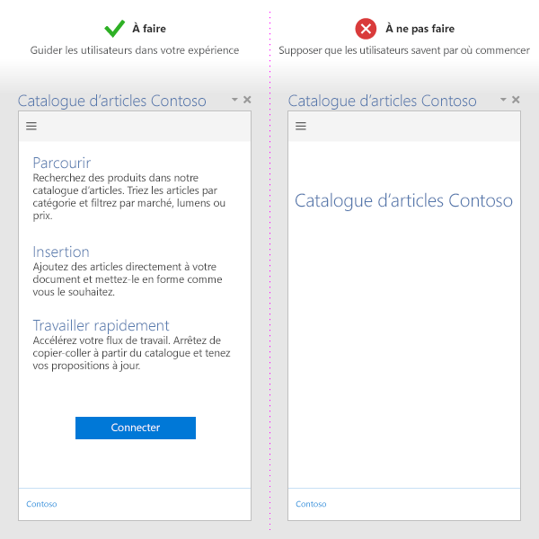
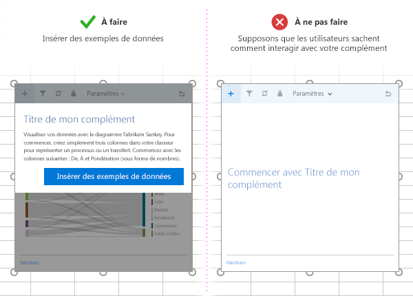

# Meilleures pratiques en matière de développement de compléments OfficeBest practices for developing Office Add-ins

Des compléments efficaces proposent des fonctionnalités uniques et attrayantes qui étendent les applications Office d’une manière visuellement attractive. Pour créer un complément intéressant, offrez une première expérience attractive à vos utilisateurs, concevez une interface utilisateur de premier choix et optimisez les performances de votre complément. Appliquez les meilleures pratiques décrites dans cet article pour créer des compléments permettant aux utilisateurs d’accomplir leurs tâches rapidement et efficacement.Effective add-ins offer unique and compelling functionality that extends Office applications in a visually appealing way. To create a great add-in, provide an engaging first-time experience for your users, design a first-class UI experience, and optimize your add-in's performance. Apply the best practices described in this article to create add-ins that help your users complete their tasks quickly and efficiently.

> [!NOTE]
> Si vous prévoyez de [publier](../publish/publish.md) votre complément sur AppSource et de le rendre disponible dans l’expérience Office, assurez-vous que vous respectez les [stratégies de validation AppSource](https://docs.microsoft.com/en-us/office/dev/store/validation-policies). Par exemple, pour réussir la validation, votre complément doit fonctionner sur toutes les plateformes prenant en charge les méthodes définies (pour en savoir plus, consultez la [section 4.12](https://docs.microsoft.com/en-us/office/dev/store/validation-policies#4-apps-and-add-ins-behave-predictably) et la [page relative à la disponibilité des compléments Office sur les plateformes et les hôtes](../overview/office-add-in-availability.md)).If you plan to [publish](../publish/publish.md) your add-in to AppSource and make it available within the Office experience, make sure that you conform to the [AppSource validation policies](https://docs.microsoft.com/en-us/office/dev/store/validation-policies). For example, to pass validation, your add-in must work across all platforms that support the methods that you define (for more information, see [section 4.12](https://docs.microsoft.com/en-us/office/dev/store/validation-policies#4-apps-and-add-ins-behave-predictably) and the [Office Add-in host and availability page](../overview/office-add-in-availability.md)). 

## Indication d’une valeur claireProvide clear value

- Créez des compléments qui aident les utilisateurs à réaliser des tâches rapidement et efficacement. Concentrez-vous sur des scénarios adaptés aux applications Office. Par exemple :Create add-ins that help users complete tasks quickly and efficiently. Focus on scenarios that make sense for Office applications. For example:
 - Réalisez des tâches de création essentielles plus rapidement et plus facilement, avec moins d’interruptions.Make core authoring tasks faster and easier, with fewer interruptions.
 - Développez de nouveaux scénarios dans Office.Enable new scenarios within Office.
 - Intégrez des services complémentaires dans des hôtes Office.Embed complementary services within Office hosts.
 - Améliorez l’expérience Office pour accroître la productivité.Improve the Office experience to enhance productivity.
- Assurez-vous que la valeur de votre complément apparaîtra clairement aux utilisateurs dès la première utilisation en créant une [première expérience enrichissante](#create-an-engaging-first-run-experience).Make sure that the value of your add-in is clear to users right away by [creating an engaging first run experience](#create-an-engaging-first-run-experience).
- Rédigez une [description claire pour AppSource](https://docs.microsoft.com/en-us/office/dev/store/create-effective-office-store-listings). Soulignez les avantages de votre complément dans votre titre et votre description. Ne comptez pas sur votre marque pour communiquer sur les fonctionnalités de votre complément.Create an [effective AppSource listing](https://docs.microsoft.com/en-us/office/dev/store/create-effective-office-store-listings). Make the benefits of your add-in clear in your title and description. Don't rely on your brand to communicate what your add-in does.

## Création d’une première expérience intéressanteCreate an engaging first-run experience

- Attirez de nouveaux utilisateurs avec une première expérience très simple et intuitive. Les utilisateurs décident toujours d’utiliser ou d’abandonner un complément après l’avoir téléchargé à partir du Windows Store.Engage new users with a highly usable and intuitive first experience. Note that users are still deciding whether to use or abandon an add-in after they download it from the store.

- Indiquez clairement les étapes que l’utilisateur doit suivre pour utiliser votre complément. Utilisez des vidéos, des schémas, des panneaux de pagination ou d’autres ressources pour attirer les utilisateurs.Make the steps that the user needs to take to engage with your add-in clear. Use videos, placemats, paging panels, or other resources to entice users.

- N’hésitez pas à ajouter un texte pour insister sur l’utilité de votre complément sur l’écran de connexion des utilisateurs.Reinforce the value proposition of your add-in on launch, rather than just asking users to sign in.

- Proposez une interface utilisateur pédagogique pour guider les utilisateurs et la personnaliser.Provide teaching UI to guide users and make your UI personal.

   

- Si votre complément de contenu est lié à des données dans le document de l’utilisateur, incluez des exemples de données ou un modèle pour montrer aux utilisateurs le format de données à utiliser.If your content add-in binds to data in the user's document, include sample data or a template to show users the data format to use.

   

- Offrez des [essais gratuits](https://docs.microsoft.com/en-us/office/dev/store/decide-on-a-pricing-model#office-store-pricing-options). Si votre complément nécessite un abonnement, proposez certaines fonctionnalités gratuitement.Offer [free trials](https://docs.microsoft.com/en-us/office/dev/store/decide-on-a-pricing-model#office-store-pricing-options). If your add-in requires a subscription, make some functionality available without a subscription.

- Facilitez l’inscription. Préremplissez les informations (e-mail, nom d’affichage) et ignorez les vérifications d’adresses e-mail.Make signup simple. Prefill information (email, display name) and skip email verifications.

- Évitez d’utiliser des fenêtres contextuelles. Si vous devez les utiliser, aidez les utilisateurs à les activer.Avoid pop ups. If you have to use them, guide the user to enable your pop up.

- Utilisez l’[authentification unique (SSO)](https://docs.microsoft.com/en-us/outlook/add-ins/authenticate-a-user-with-an-identity-token).Use [single sign-on (SSO) authentication](https://docs.microsoft.com/en-us/outlook/add-ins/authenticate-a-user-with-an-identity-token).

Pour obtenir les modèles illustrant les modèles de conception à appliquer lors du développement de votre première expérience d’utilisation, voir [Modèles de conception de l’expérience utilisateur pour les compléments Office](https://github.com/OfficeDev/Office-Add-in-UX-Design-Patterns-Code).For templates that illustrate patterns that you can apply as you develop your first-run experience, see [UX design patterns for Office Add-ins](https://github.com/OfficeDev/Office-Add-in-UX-Design-Patterns-Code).

## Utilisation des commandes de complémentUse add-in commands

- Fournissez des points d’entrée d’interface utilisateur pertinents pour votre complément à l’aide des commandes de complément. Pour plus d’informations, y compris les bonnes pratiques de conception, reportez-vous aux [commandes de complément](../design/add-in-commands.md).Provide relevant UI entry points for your add-in by using add-in commands. For details, including design best practices, see [add-in commands](../design/add-in-commands.md).

## Application des principes de conception de l’expérience utilisateurApply UX design principles

- Assurez-vous que l’aspect, la convivialité et la fonctionnalité de votre complément améliorent l’expérience Office. Utilisez [Office UI Fabric](https://developer.microsoft.com/en-us/fabric).Ensure that the look and feel and functionality of your add-in complements the Office experience. Use [Office UI Fabric](https://developer.microsoft.com/en-us/fabric).

- Privilégiez le contenu plutôt que l’apparence. Évitez les éléments d’interface utilisateur superflus qui n’ajoutent pas de valeur à l’expérience utilisateur.Favor content over chrome. Avoid superfluous UI elements that don't add value to the user experience.

- Gardez le contrôle des utilisateurs. Assurez-vous que ces derniers comprennent les décisions importantes et peuvent facilement rétablir des actions effectuées par le complément.Keep users in control. Ensure that users understand important decisions, and can easily reverse actions the add-in performs.

- Utilisez la personnalisation afin d’inspirer la confiance et d’orienter les utilisateurs. N’utilisez pas la personnalisation afin de submerger les utilisateurs ou de faire de la publicité.Use branding to inspire trust and orient users. Do not use branding to overwhelm or advertise to users.

- Évitez d’utiliser le défilement. Optimisez votre complément pour une résolution de 1366 x 768.Avoid scrolling. Optimize for 1366 x 768 resolution.

- N’incluez pas d’image sans licence.Do not include unlicensed images.

- Utilisez un [langage clair et simple](../design/voice-guidelines.md) dans votre complément.Use [clear and simple language](../design/voice-guidelines.md) in your add-in.

- Soulignez l’accessibilité : votre complément doit être facile à utiliser pour tous les utilisateurs et s’accommoder de technologies d’assistance telles que les lecteurs d’écran.Account for accessibility - make your add-in easy for all users to interact with, and accommodate assistive technologies such as screen readers.

- Adaptez-le à toutes les plateformes et méthodes d’entrée, y compris la souris/le clavier et la [fonction tactile](#optimize-for-touch). Assurez-vous que votre interface utilisateur réagit à différents formats.Design for all platforms and input methods, including mouse/keyboard and [touch](#optimize-for-touch). Ensure that your UI is responsive to different form factors.

Pour les modèles appliquant des principes de conception que vous pouvez utiliser et personnaliser lors du développement de votre complément, voir [Modèles de conception de l’expérience utilisateur pour les compléments Office](https://github.com/OfficeDev/Office-Add-in-UX-Design-Patterns-Code).For templates that apply design principles that you can use and customize as you develop your add-in, see [UX design patterns for Office Add-ins](https://github.com/OfficeDev/Office-Add-in-UX-Design-Patterns-Code).

### Optimisation de la fonction tactileOptimize for touch

- Utilisez la propriété [Context.touchEnabled](https://dev.office.com/reference/add-ins/shared/office.context.touchenabled) pour déterminer si l’application hôte sur laquelle votre complément est exécuté est compatible avec la fonction tactile.Use the [Context.touchEnabled](https://dev.office.com/reference/add-ins/shared/office.context.touchenabled) property to detect whether the host application your add-in runs on is touch enabled.

  > [!NOTE]
  > Cette propriété n’est pas prise en charge dans Outlook.This property is not supported in Outlook.

- Assurez-vous que toutes les commandes sont correctement dimensionnées pour l’interaction tactile. Par exemple, vérifiez que les boutons disposent de cibles tactiles adéquates et que les zones de texte sont assez grandes pour permettre la saisie.Ensure that all controls are appropriately sized for touch interaction. For example, buttons have adequate touch targets, and input boxes are large enough for users to enter input.

- N’utilisez pas de méthodes d’entrée non tactiles comme l’utilisation du curseur ou du clic droit.Do not rely on non-touch input methods like hover or right-click.

- Assurez-vous que votre complément fonctionne dans les modes portrait et paysage. Gardez à l’esprit qu’une partie de votre complément pourrait être masquée par le clavier virtuel sur les appareils tactiles.Ensure that your add-in works in both portrait and landscape modes. Be aware that on touch devices, part of your add-in might be hidden by the soft keyboard.

- Testez votre complément sur un véritable appareil en utilisant le [chargement de version test](../testing/sideload-an-office-add-in-on-ipad-and-mac.md).Test your add-in on a real device by using [sideloading](../testing/sideload-an-office-add-in-on-ipad-and-mac.md).

> [!NOTE]
> Si vous utilisez [Office UI Fabric](https://github.com/OfficeDev/Office-UI-Fabric) pour vos éléments de conception, un grand nombre de ces éléments sont pris en charge.If you're using [Office UI Fabric](https://github.com/OfficeDev/Office-UI-Fabric) for your design elements, many of these elements are taken care of.

## Optimisation et contrôle des performances du complémentOptimize and monitor add-in performance

- Donnez l’impression que l’interface utilisateur réagit rapidement. Votre complément doit se charger en 500 ms au maximum.Create the perception of fast UI responses. Your add-in should load in 500 ms or less.

- Veillez à ce que toutes les interactions utilisateur répondent en moins d’une seconde.Ensure that all user interactions respond in under one second.

-  Fournissez des indicateurs de chargement pour les opérations à longue durée d’exécution.Provide loading indicators for long-running operations.

- Utilisez un CDN pour héberger les images, les ressources et les bibliothèques communes. Chargez autant d’éléments que possible à partir d’un seul emplacement.Use a CDN to host images, resources, and common libraries. Load as much as you can from one place.

- Suivez les pratiques web standard pour optimiser votre page web. En production, utilisez uniquement les versions réduites des bibliothèques. Chargez uniquement les ressources dont vous avez besoin et optimisez leur chargement.Follow standard web practices to optimize your web page. In production, use only minified versions of libraries. Only load resources that you need, and optimize how resources are loaded.

- Si l’exécution des opérations dure longtemps, fournissez des commentaires aux utilisateurs. Prenez en compte les seuils indiqués dans le tableau suivant. Pour plus d’informations, reportez-vous à l’article sur les [limites des ressources et l’optimisation des performances pour les compléments Office](../concepts/resource-limits-and-performance-optimization.md).If operations take time to execute, provide feedback to users. Note the thresholds listed in the following table. For additional information, see [Resource limits and performance optimization for Office Add-ins](../concepts/resource-limits-and-performance-optimization.md).

  |**Classe d’interaction****Interaction class**|**Cible****Target**|**Limite supérieure****Upper bound**|**Perception humaine****Human perception**|
  |:-----|:-----|:-----|:-----|
  |InstantanéeInstant|<= 50 ms<=50 ms|100 ms100 ms|Aucun délai notable.No noticeable delay.|
  |RapideFast|50-100 ms50-100 ms|200 ms200 ms|Délai notable minime. Aucun commentaire n’est nécessaire.Minimally noticeable delay. No feedback necessary.|
  |NormaleTypical|100-300 ms100-300 ms|500 ms500 ms|L’opération va assez vite, sans pour autant pouvoir être qualifiée de rapide. Aucun commentaire n’est nécessaire.Quick, but too slow to be described as fast. No feedback necessary.|
  |RéactiveResponsive|300-500 ms300-500 ms|1 seconde1 second|L’opération n’est pas rapide, mais le système donne l’impression de répondre. Aucun commentaire n’est nécessaire.Not fast, but still feels responsive. No feedback necessary.|
  |ContinueContinuous|> 500 ms>500 ms|5 secondes5 seconds|Attente moyenne, le système n’a plus l’air de répondre. Un commentaire peut-être nécessaire.Medium wait, no longer feels responsive. Might need feedback.|
  |CaptiveCaptive|> 500 ms>500 ms|10 secondes10 seconds|Long, mais pas assez pour faire autre chose. Un commentaire peut-être nécessaire.Long, but not long enough to do something else. Might need feedback.|
  |ÉtendueExtended|> 500 ms>500 ms|> 10 secondes>10 seconds|Assez long pour faire quelque chose en attendant. Un commentaire peut être nécessaire.Long enough to do something else while waiting. Might need feedback.|
  |Longue duréeLong running|> 5 ms>5 ms|> 1 minute>1 minute|Les utilisateurs effectueront certainement une autre action.Users will certainly do something else.|

- Surveillez l’état de votre service et utilisez la télémétrie pour surveiller le succès d’utilisateur.Monitor your service health, and use telemetry to monitor user success.

## Commercialisation de votre complémentMarket your add-in

- Publiez votre complément dans [AppSource](https://docs.microsoft.com/en-us/office/dev/store/submit-to-the-office-store) et [faites sa promotion](https://docs.microsoft.com/en-us/office/dev/store/promote-your-office-store-solution) sur votre site web. Créez un [référencement AppSource efficace](https://docs.microsoft.com/en-us/office/dev/store/create-effective-office-store-listings).Publish your add-in to [AppSource](https://docs.microsoft.com/en-us/office/dev/store/submit-to-the-office-store) and [promote it](https://docs.microsoft.com/en-us/office/dev/store/promote-your-office-store-solution) from your website. Create an [effective AppSource listing](https://docs.microsoft.com/en-us/office/dev/store/create-effective-office-store-listings).

- Utilisez des titres et des descriptifs courts pour le complément. Ils ne doivent pas comporter plus de 128 caractères.Use succinct and descriptive add-in titles. Include no more than 128 characters.

- Rédigez des descriptions brèves et attrayantes pour votre complément. Répondez à la question « Quel problème ce complément résout-il ? ».Write short, compelling descriptions of your add-in. Answer the question "What problem does this add-in solve?".

- Faites ressortir la proposition de valeur de votre complément dans le titre et la description. Ne comptez pas sur votre marque.Convey the value proposition of your add-in in your title and description. Don't rely on your brand.

- Créez un site web pour aider les utilisateurs à trouver votre complément et à l’utiliser.Create a website to help users find and use your add-in.

## Voir aussiSee also

- [Vue d’ensemble de la plateforme des compléments OfficeOffice Add-ins platform overview](../overview/office-add-ins.md)
