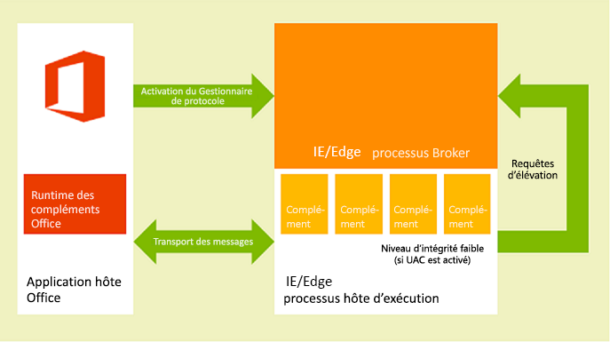
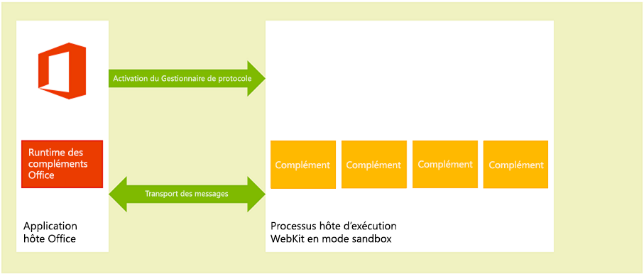
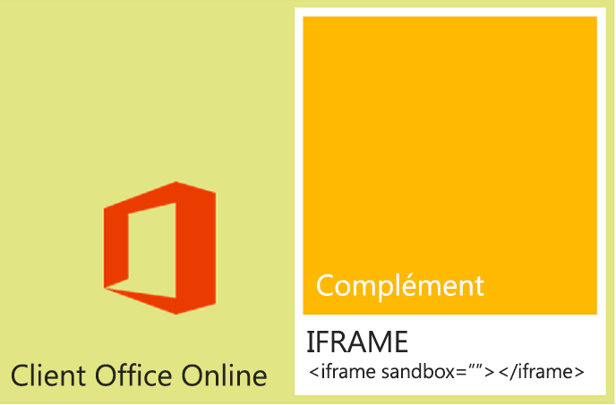

# <a name="privacy-and-security-for-office-add-ins"></a><span data-ttu-id="5e13b-102">Confidentialité et sécurité pour les compléments Office</span><span class="sxs-lookup"><span data-stu-id="5e13b-102">Privacy and security for Office Add-ins</span></span>

## <a name="understanding-the-add-in-runtime"></a><span data-ttu-id="5e13b-103">Présentation du runtime de complément</span><span class="sxs-lookup"><span data-stu-id="5e13b-103">Understanding the add-in runtime</span></span>

<span data-ttu-id="5e13b-p101">Les Compléments Office sont sécurisées par un environnement d’exécution de complément, un modèle d’autorisations à plusieurs niveaux et des gouverneurs de performances. Cette infrastructure protège l’expérience utilisateur de la façon suivante :</span><span class="sxs-lookup"><span data-stu-id="5e13b-p101">Office Add-ins are secured by an add-in runtime environment, a multiple-tier permissions model, and performance governors. This framework protects the user's experience in the following ways:</span></span> 

- <span data-ttu-id="5e13b-106">L’accès à l’infrastructure de l’interface utilisateur de l’application hôte est géré.</span><span class="sxs-lookup"><span data-stu-id="5e13b-106">Access to the host application's UI frame is managed.</span></span>

- <span data-ttu-id="5e13b-107">Seul un accès indirect au thread de l’interface utilisateur de l’application hôte est autorisé.</span><span class="sxs-lookup"><span data-stu-id="5e13b-107">Only indirect access to the host application's UI thread is allowed.</span></span>

- <span data-ttu-id="5e13b-108">Les interactions modales ne sont pas autorisées. Par exemple, les appels aux fonctions JavaScript **alert**, **confirm** et **prompt** ne sont pas autorisés, car ils sont modaux.</span><span class="sxs-lookup"><span data-stu-id="5e13b-108">Modal interactions aren't allowed - for example, calls to JavaScript  **alert**, **confirm**, and **prompt** functions aren't allowed because they're modal.</span></span>

<span data-ttu-id="5e13b-109">En outre, l’infrastructure d’exécution offre les avantages suivants pour garantir qu’un complément Office ne peut pas endommager l’environnement de l’utilisateur :</span><span class="sxs-lookup"><span data-stu-id="5e13b-109">Further, the runtime framework provides the following benefits to ensure that an Office Add-in can't damage the user's environment:</span></span>

- <span data-ttu-id="5e13b-110">Isole le processus dans lequel s’exécute le complément.</span><span class="sxs-lookup"><span data-stu-id="5e13b-110">Isolates the process the add-in runs in.</span></span>

- <span data-ttu-id="5e13b-111">Ne nécessite pas de remplacements de .dll ou de .exe, ni de composants ActiveX.</span><span class="sxs-lookup"><span data-stu-id="5e13b-111">Doesn't require .dll or .exe replacement or ActiveX components.</span></span>

- <span data-ttu-id="5e13b-112">Simplifie l’installation et la désinstallation des compléments.</span><span class="sxs-lookup"><span data-stu-id="5e13b-112">Makes add-ins easy to install and uninstall.</span></span>

<span data-ttu-id="5e13b-113">De plus, l’utilisation des ressources de mémoire, de processeur et réseau par les compléments Office peut être régie afin de garantir de bonnes performances et une excellente fiabilité.</span><span class="sxs-lookup"><span data-stu-id="5e13b-113">Also, the use of memory, CPU, and network resources by Office Add-ins is governable to ensure that good performance and reliability are maintained.</span></span> 

<span data-ttu-id="5e13b-114">Les sections suivantes décrivent brièvement comment l’architecture d’exécution prend en charge l’exécution de compléments dans les clients Office sur des appareils Windows ou Mac OS X, et dans les clients Office Online sur le web.</span><span class="sxs-lookup"><span data-stu-id="5e13b-114">The following sections briefly describe how the runtime architecture supports running add-ins in Office clients on Windows-based devices, on OS X Mac devices, and in Office Online clients on the web.</span></span>

> [!NOTE]
> <span data-ttu-id="5e13b-115">Pour en savoir plus sur l’utilisation de WIP et Intune avec les compléments Office, consultez la page [Utiliser WIP et Intune pour protéger les données de votre entreprise dans les document, en exécutant les compléments Office](/microsoft-365/enterprise/office-add-ins-wip).</span><span class="sxs-lookup"><span data-stu-id="5e13b-115">To learn about using WIP and Intune with Office Add-ins, see [Use WIP and Intune to protect enterprise data in documents running Office Add-ins](/microsoft-365/enterprise/office-add-ins-wip).</span></span>

### <a name="clients-on-windows-and-os-x-devices"></a><span data-ttu-id="5e13b-116">Clients sur appareils Windows et OS X</span><span class="sxs-lookup"><span data-stu-id="5e13b-116">Clients for Windows and OS X devices</span></span>

<span data-ttu-id="5e13b-p102">Dans les clients pris en charge pour les ordinateurs de bureau et les tablettes, comme Excel, Outlook et Outlook pour Mac, les complément Office sont pris en charge en intégrant un composant in-process, le runtime des compléments Office, qui gère le cycle de vie du complément et permet l’interopérabilité entre le complément et l’application cliente. La page web du complément elle-même est hébergée hors processus. Comme indiqué dans la figure 1, sur un ordinateur de bureau ou une tablette, la page web du complément est hébergée dans un contrôle Internet Explorer qui, à son tour, est hébergé dans un processus d’exécution du complément qui fournit la sécurité et l’isolation des performances.</span><span class="sxs-lookup"><span data-stu-id="5e13b-p102">In supported clients for desktop and tablet devices, such as Excel, Outlook, and Outlook for Mac, Office Add-ins are supported by integrating an in-process component, the Office Add-ins runtime, which manages the add-in lifecycle and enables interoperability between the add-in and the client application. The add-in webpage itself is hosted out-of-process. As shown in figure 1, on a Windows desktop or tablet device, the add-in webpage is hosted inside an Internet Explorer control which, in turn, is hosted inside an add-in runtime process that provides security and performance isolation.</span></span>

<span data-ttu-id="5e13b-p103">Sur le bureau Windows, Le mode protégé d’Internet Explorer doit être activé pour la zone de site sensible. En règle générale, il est activé par défaut. S’il est désactivé, une [erreur se produit](https://support.microsoft.com/help/2761180/apps-for-office-don-t-start-if-you-disable-protected-mode-for-the-restricted-sites-zone-in-internet-explorer) lorsque vous essayez de lancer un complément.</span><span class="sxs-lookup"><span data-stu-id="5e13b-p103">On Windows desktops, Protect Mode in Internet Explorer must be enabled for the Restricted Site Zone. This is typically enabled by default. If it is disabled, an [error will occur](https://support.microsoft.com/help/2761180/apps-for-office-don-t-start-if-you-disable-protected-mode-for-the-restricted-sites-zone-in-internet-explorer) when you try to launch an add-in.</span></span>

<span data-ttu-id="5e13b-123">*Figure 1. Environnement d’exécution des compléments Office dans les clients de bureau et de tablette Windows*</span><span class="sxs-lookup"><span data-stu-id="5e13b-123">*Figure 1. Office Add-ins runtime environment in Windows-based desktop and tablet clients*</span></span>



<span data-ttu-id="5e13b-125">Comme indiqué dans la figure suivante, sur un ordinateur de bureau Mac OS X, la page web du complément est hébergée dans un processus hôte d’exécution Webkit en mode bac à sable (sandbox) qui fournit un niveau similaire de sécurité et de protection des performances.</span><span class="sxs-lookup"><span data-stu-id="5e13b-125">As shown in the following figure, on an OS X Mac desktop, the add-in web page is hosted inside a sandboxed WebKit runtime host process which helps provide similar level of security and performance protection.</span></span> 

<span data-ttu-id="5e13b-126">*Figure 2. Environnement d’exécution des compléments Office dans les clients Mac OS X*</span><span class="sxs-lookup"><span data-stu-id="5e13b-126">*Figure 2. Office Add-ins runtime environment in OS X Mac clients*</span></span>



<span data-ttu-id="5e13b-128">Le runtime des compléments Office gère les communications entre processus, la traduction des appels et des événements d’API JavaScript dans des appels et événements natifs, ainsi que la prise en charge à distance de l’interface utilisateur pour permettre au complément d’être restitué à l’intérieur du document, dans un volet Office ou de façon adjacente à un message électronique, une demande de réunion ou un rendez-vous.</span><span class="sxs-lookup"><span data-stu-id="5e13b-128">The Office Add-ins runtime manages interprocess communication, the translation of JavaScript API calls and events into native ones, as well as UI remoting support to enable the add-in to be rendered inside the document, in a task pane, or adjacent to an email message, meeting request, or appointment.</span></span>

### <a name="web-clients"></a><span data-ttu-id="5e13b-129">Clients web</span><span class="sxs-lookup"><span data-stu-id="5e13b-129">Web clients</span></span>

<span data-ttu-id="5e13b-p104">Dans les clients web pris en charge, tels que Excel Online et Outlook Web App, les compléments Office sont hébergés dans un composant **iframe** exécuté à l’aide de l’attribut HTML5 **sandbox**. Les composants ActiveX ou la navigation dans la page principale du client web ne sont pas autorisés. La prise en charge des compléments Office est activée dans les clients web par l’intégration de l’API JavaScript pour Office. Comme pour les applications clientes de bureau, l’API JavaScript gère le cycle de vie du complément et l’interopérabilité entre le complément et le client web. Cette interopérabilité est implémentée à l’aide d’une infrastructure spéciale de communication par publication de messages sur plusieurs cadres. La bibliothèque JavaScript (Office.js) utilisée sur les clients de bureau est disponible pour l’interaction avec le client web. La figure suivante illustre l’infrastructure qui prend en charge les compléments Office dans Office Online (sur navigateur) et les composants impliqués (client web, **iframe**, exécution des compléments Office et API JavaScript pour Office) qui sont requis pour les prendre en charge.</span><span class="sxs-lookup"><span data-stu-id="5e13b-p104">In supported Web clients, such as Excel Online and Outlook Web App, Office Add-ins are hosted in an  **iframe** that runs using the HTML5 **sandbox** attribute. ActiveX components or navigating the main page of the web client are not allowed. Office Add-ins support is enabled in the web clients by the integration of the JavaScript API for Office. In a similar way to the desktop client applications, the JavaScript API manages the add-in lifecycle and interoperability between the add-in and the web client. This interoperability is implemented by using a special cross-frame post message communication infrastructure. The same JavaScript library (Office.js) that is used on desktop clients is available to interact with the web client. The following figure shows the infrastructure that supports Office Add-ins in Office Online (running in the browser), and the relevant components (the web client, **iframe**, Office Add-ins runtime, and JavaScript API for Office) that are required to support them.</span></span>

<span data-ttu-id="5e13b-137">*Figure 3. Infrastructure prenant en charge les compléments Office dans les clients web Office*</span><span class="sxs-lookup"><span data-stu-id="5e13b-137">*Figure 3. Infrastructure that supports Office Add-ins in Office web clients*</span></span>



## <a name="add-in-integrity-in-appsource"></a><span data-ttu-id="5e13b-139">Intégrité de complément dans AppSource</span><span class="sxs-lookup"><span data-stu-id="5e13b-139">Add-in integrity in AppSource</span></span>

<span data-ttu-id="5e13b-p105">Vous pouvez rendre vos compléments Office accessibles au public en les publiant dans AppSource. AppSource applique les mesures suivantes pour conserver l’intégrité des compléments :</span><span class="sxs-lookup"><span data-stu-id="5e13b-p105">You can make your Office Add-ins available to the public by publishing them to AppSource. AppSource enforces the following measures to maintain the integrity of add-ins:</span></span>


- <span data-ttu-id="5e13b-142">Le serveur hôte d’un complément Office doit toujours utiliser le protocole SSL (Secure Sockets Layer) pour communiquer.</span><span class="sxs-lookup"><span data-stu-id="5e13b-142">Requires the host server of an Office Add-in to always use Secure Sockets Layer (SSL) to communicate.</span></span>

- <span data-ttu-id="5e13b-143">Pour proposer des compléments, un développeur doit fournir la preuve de son identité, un accord contractuel et une stratégie de confidentialité conforme.</span><span class="sxs-lookup"><span data-stu-id="5e13b-143">Requires a developer to provide proof of identity, a contractual agreement, and a compliant privacy policy to submit add-ins.</span></span>

- <span data-ttu-id="5e13b-144">Assurez-vous que le code source des compléments est accessible en lecture seule.</span><span class="sxs-lookup"><span data-stu-id="5e13b-144">Ensures that the source of add-ins is accessible in read-only mode.</span></span>

- <span data-ttu-id="5e13b-145">Un système de révision par les utilisateurs est pris en charge pour les compléments disponibles afin de promouvoir une communauté d’autoréglementation.</span><span class="sxs-lookup"><span data-stu-id="5e13b-145">Supports a user-review system for available add-ins to promote a self-policing community.</span></span>

## <a name="addressing-end-users-privacy-concerns"></a><span data-ttu-id="5e13b-146">Réponse aux inquiétudes des utilisateurs finaux concernant la confidentialité</span><span class="sxs-lookup"><span data-stu-id="5e13b-146">Addressing end users' privacy concerns</span></span>

<span data-ttu-id="5e13b-147">Cette section décrit la protection offerte par la plateforme des compléments Office du point de vue du client (utilisateur final) et vous donne des recommandations concernant la satisfaction des attentes des utilisateurs et la façon de gérer leurs informations d’identification personnelle (PII) en toute sécurité.</span><span class="sxs-lookup"><span data-stu-id="5e13b-147">This section describes the protection offered by the Office Add-ins platform from the customer's (end user's) perspective, and provides guidelines for how to support users' expectations and how to securely handle users' personally identifiable information (PII).</span></span>

### <a name="end-users-perspective"></a><span data-ttu-id="5e13b-148">Point de vue des utilisateurs finaux</span><span class="sxs-lookup"><span data-stu-id="5e13b-148">End users' perspective</span></span>

<span data-ttu-id="5e13b-p106">Les compléments Office sont créés à l’aide de technologies web qui sont exécutées dans un contrôle de navigateur ou un composant **iframe**. C’est la raison pour laquelle l’utilisation de compléments est semblable à la navigation sur les sites web, que ce soit sur Internet ou sur l’intranet. Les compléments peuvent être externes à une organisation (si le complément est acquis à partir d’AppSource) ou internes (si le complément est acquis à partir d’un catalogue de compléments Exchange Server, d’un catalogue de compléments SharePoint ou d’un partage de fichiers sur le réseau d’une organisation). Les compléments ont un accès limité au réseau et la plupart d’entre eux peuvent effectuer des opérations de lecture ou d’écriture dans le document ou l’élément de messagerie actif. La plateforme du complément applique certaines contraintes avant qu’un utilisateur ou un administrateur installe ou démarre ce complément. Mais, comme pour tout modèle d’extensibilité, les utilisateurs doivent faire preuve de prudence avant de lancer un complément inconnu.</span><span class="sxs-lookup"><span data-stu-id="5e13b-p106">Office Add-ins are built using web technologies that run in a browser control or **iframe**. Because of this, using add-ins is similar to browsing to web sites on the Internet or intranet. Add-ins can be external to an organization (if you acquire the add-in from AppSource) or internal (if you acquire the add-in from an Exchange Server add-in catalog, SharePoint add-in catalog, or file share on an organization's network). Add-ins have limited access to the network and most add-ins can read or write to the active document or mail item. The add-in platform applies certain constraints before a user or administrator installs or starts an add-in. But as with any extensibility model, users should be cautious before starting an unknown add-in.</span></span>

<span data-ttu-id="5e13b-155">La plateforme du complément répond aux inquiétudes des utilisateurs finaux concernant la confidentialité des manières suivantes :</span><span class="sxs-lookup"><span data-stu-id="5e13b-155">The add-in platform addresses end users' privacy concerns in the following ways:</span></span>

- <span data-ttu-id="5e13b-156">§LTA Les données communiquées avec le serveur web qui héberge un complément du volet Office, Outlook ou de contenu, ainsi que les communications entre le complément et tout service web, doivent toujours être chiffrées à l’aide du protocole SSL (Secure Socket Layer).</span><span class="sxs-lookup"><span data-stu-id="5e13b-156">Data communicated with the web server that hosts a content, Outlook or task pane add-in as well as communication between the add-in and any web services it uses must be encrypted using the Secure Socket Layer (SSL) protocol.</span></span>

- <span data-ttu-id="5e13b-p107">Avant qu’un utilisateur n’installe un complément à partir d’AppSource, il peut afficher la politique de confidentialité et les conditions requises du complément. En outre, les compléments Outlook qui interagissent avec les boîtes aux lettres des utilisateurs exposent les autorisations spécifiques nécessaires ; l’utilisateur peut lire les conditions d’utilisation, les autorisations requises et la politique de confidentialité avant d’installer un complément Outlook.</span><span class="sxs-lookup"><span data-stu-id="5e13b-p107">Before a user installs an add-in from AppSource, the user can view the privacy policy and requirements of that add-in. In addition, Outlook add-ins that interact with users' mailboxes surface the specific permissions that they require; the user can review the terms of use, requested permissions and privacy policy before installing an Outlook add-in.</span></span>

- <span data-ttu-id="5e13b-p108">Lorsqu’ils partagent un document, les utilisateurs partagent également les compléments insérés dans ces documents ou qui y sont associés. Si un utilisateur ouvre un document qui contient un complément qu’il n’a jamais utilisé auparavant, l’application hôte demande à l’utilisateur d’accorder l’autorisation d’exécution du complément dans le document. Dans un environnement d’entreprise, l’application hôte Office demande également à l’utilisateur si le document provient d’une source externe.</span><span class="sxs-lookup"><span data-stu-id="5e13b-p108">When sharing a document, users also share add-ins that have been inserted in or associated with that document. If a user opens a document that contains an add-in that the user hasn't used before, the host application prompts the user to grant permission for the add-in to run in the document. In an organizational environment, the Office host application also prompts the user if the document comes from an external source.</span></span>

- <span data-ttu-id="5e13b-162">Les utilisateurs peuvent autoriser ou refuser l’accès à AppSource.</span><span class="sxs-lookup"><span data-stu-id="5e13b-162">Users can enable or disable the access to the offappstore.</span></span> <span data-ttu-id="5e13b-163">Pour les compléments de contenu et du volet Office, les utilisateurs gèrent l’accès aux compléments et aux catalogues approuvés à partir du **Centre de gestion de la confidentialité** sur le client Office hôte (ouvert à partir de **Fichier** > **Options** > **Centre de gestion de la confidentialité** > **Paramètres du Centre de gestion de la confidentialité** > **Catalogues de compléments approuvés**).</span><span class="sxs-lookup"><span data-stu-id="5e13b-163">For content and task pane add-ins, users manage access to trusted add-ins and catalogs from the Trust Center on the host Office client (opened from File > Options > Trust Center > Trust Center Settings > Trusted Add-in Catalogs).</span></span> <span data-ttu-id="5e13b-164">Pour les compléments Outlook, les utilisateurs peuvent les gérer en choisissant le bouton **Gérer les compléments**. Dans Outlook pour Windows, sélectionnez **Fichier** > **Gérer les compléments**. Dans Outlook pour Mac, choisissez le bouton **Gérer les compléments** dans la barre des compléments.</span><span class="sxs-lookup"><span data-stu-id="5e13b-164">For Outlook add-ins, uses can manage add-ins by choosing the  **Manage Add-ins** button: in Outlook on Windows, choose **File** > **Manage Add-ins**. In Outlook for Mac, choose the  **Manage Add-ins** button on the add-in bar.</span></span> <span data-ttu-id="5e13b-165">Dans Outlook Web App, choisissez le menu **Paramètres** (icône d’engrenage) > **Gérer les compléments**. Les administrateurs peuvent également gérer cet accès [à l’aide d’une stratégie de groupe](/previous-versions/office/office-2013-resource-kit/jj219429(v=office.15)#using-group-policy-to-manage-how-users-can-install-and-use-apps-for-office).</span><span class="sxs-lookup"><span data-stu-id="5e13b-165">In Outlook Web App choose the **Settings** menu (gear icon) > **Manage add-ins**. Administrators can also manage this access [by using group policy](/previous-versions/office/office-2013-resource-kit/jj219429(v=office.15)#using-group-policy-to-manage-how-users-can-install-and-use-apps-for-office).</span></span>

- <span data-ttu-id="5e13b-166">La conception de la plateforme du complément offre sécurité et performance aux utilisateurs finals des façons suivantes :</span><span class="sxs-lookup"><span data-stu-id="5e13b-166">The design of the add-in platform provides security and performance for end users in the following ways:</span></span>

  - <span data-ttu-id="5e13b-p110">Un complément Office s’exécute dans un contrôle de navigateur web, qui est hébergé dans un environnement d’exécution de compléments séparé de l’application hôte Office. Cette conception offre à la fois une sécurité et une séparation des performances de l’application hôte.</span><span class="sxs-lookup"><span data-stu-id="5e13b-p110">An Office Add-in runs in a web browser control that is hosted in an add-in runtime environment separate from the Office host application. This design provides both security and performance isolation from the host application.</span></span>

  - <span data-ttu-id="5e13b-169">L’exécution dans un contrôle de navigateur web permet au complément de faire quasiment tout ce qu’une page web ordinaire exécutée dans un navigateur peut faire mais, en même temps, oblige le complément à suivre la stratégie d’origine identique pour l’isolation du domaine et les zones de sécurité.</span><span class="sxs-lookup"><span data-stu-id="5e13b-169">Running in a web browser control allows the add-in to do almost anything a regular web page running in a browser can do but, at the same time, restricts the add-in to observe the same-origin policy for domain isolation and security zones.</span></span>

<span data-ttu-id="5e13b-p111">Les compléments Outlook fournissent des fonctionnalités supplémentaires de sécurité et de performance grâce à une analyse de l’utilisation des ressources propres aux compléments Outlook. Pour en savoir plus, voir [Confidentialité, autorisations et sécurité pour les compléments Outlook](/outlook/add-ins/privacy-and-security).</span><span class="sxs-lookup"><span data-stu-id="5e13b-p111">Outlook add-ins provide additional security and performance features through Outlook add-in specific resource usage monitoring. For more information, see [Privacy, permissions, and security for Outlook add-ins](/outlook/add-ins/privacy-and-security).</span></span>

### <a name="developer-guidelines-to-handle-pii"></a><span data-ttu-id="5e13b-172">Recommandations à l’intention des développeurs en matière de gestion des PII</span><span class="sxs-lookup"><span data-stu-id="5e13b-172">Developer guidelines to handle PII</span></span>

<span data-ttu-id="5e13b-173">En tant que développeur de compléments Office, nous vous fournissons ci-dessous une liste de conseils de protection PII spécifiques :</span><span class="sxs-lookup"><span data-stu-id="5e13b-173">The following lists some specific PII protection guidelines for you as a developer of Office Add-ins:</span></span>

- <span data-ttu-id="5e13b-p112">L’objet [Settings](/javascript/api/office/office.settings) est conçu pour conserver les paramètres de complément et les données d’état entre les sessions pour un complément de contenu ou du volet Office, mais il ne stocke pas les mots de passe et autres informations d’identification personnelle confidentielles dans l’objet **Settings**. Les données contenues dans l’objet **Settings** ne sont pas visibles par les utilisateurs finaux, mais elles sont stockées en tant que partie du format de fichier du document, qui est facilement accessible. Vous devez limiter l’utilisation par votre complément des informations d’identification personnelle et stocker celles qu’il exige sur le serveur hébergeant votre complément en tant que ressource sécurisée par l’utilisateur.</span><span class="sxs-lookup"><span data-stu-id="5e13b-p112">The [Settings](/javascript/api/office/office.settings) object is intended for persisting add-in settings and state data across sessions for a content or task pane add-in, but don't store passwords and other sensitive PII in the **Settings** object. The data in the **Settings** object isn't visible to end users, but it is stored as part of the document's file format which is readily accessible. You should limit your add-in's use of PII and store any PII required by your add-in on the server hosting your add-in as a user-secured resource.</span></span>

- <span data-ttu-id="5e13b-p113">Certaines applications peuvent exposer les informations d’identification personnelle dans le cadre de leur utilisation. Faites en sorte de stocker les données de vos utilisateurs de manière sécurisée, notamment l’identité, la situation géographique, les heures d’accès et autres informations d’identification, pour éviter que d’autres utilisateurs du complément puissent y accéder.</span><span class="sxs-lookup"><span data-stu-id="5e13b-p113">Using some applications can reveal PII. Make sure that you securely store data for your users' identity, location, access times, and any other credentials so that data won't become available to other users of the add-in.</span></span>

- <span data-ttu-id="5e13b-p114">Si votre complément est disponible dans AppSource, l’utilisation obligatoire de HTTPS dans AppSource assure la protection des informations d’identification personnelle transmises entre votre serveur web et l’ordinateur client ou l’appareil. Toutefois, si vous devez retransmettre ces données à d’autres serveurs, veillez à observer le même niveau de protection.</span><span class="sxs-lookup"><span data-stu-id="5e13b-p114">If your add-in is available in AppSource, the AppSource requirement for HTTPS protects PII transmitted between your web server and the client computer or device. However, if you re-transmit that data to other servers, make sure you observe the same level of protection.</span></span>

- <span data-ttu-id="5e13b-p115">Si vous stockez les informations d’identification personnelle des utilisateurs, veillez à en informer les utilisateurs et à leur permettre de les inspecter et de les supprimer. Si vous envoyez votre complément à AppSource, vous pouvez indiquer les données que vous collectez et l’utilisation qui en est faite dans la déclaration de confidentialité.</span><span class="sxs-lookup"><span data-stu-id="5e13b-p115">If you store users' PII, make sure you reveal that fact, and provide a way for users to inspect and delete it. If you submit your add-in to AppSource, you can outline the data you collect and how it's used in the privacy statement.</span></span>

## <a name="developers-permission-choices-and-security-practices"></a><span data-ttu-id="5e13b-183">Choix des développeurs relatifs aux autorisations et aux pratiques de sécurité</span><span class="sxs-lookup"><span data-stu-id="5e13b-183">Developers' permission choices and security practices</span></span>

<span data-ttu-id="5e13b-184">Suivez les recommandations générales suivantes pour prendre en charge le modèle de sécurité des compléments Office et faire une exploration en détail pour chaque type de complément.</span><span class="sxs-lookup"><span data-stu-id="5e13b-184">Follow these general guidelines to support the security model of Office Add-ins, and drill down on more details for each add-in type.</span></span>

### <a name="permissions-choices"></a><span data-ttu-id="5e13b-185">Choix des autorisations</span><span class="sxs-lookup"><span data-stu-id="5e13b-185">Permissions choices</span></span>

<span data-ttu-id="5e13b-186">La plateforme de complément fournit un modèle d’autorisations que votre complément utilise pour déclarer le niveau d’accès aux données d’un utilisateur qui sont requises pour ses fonctionnalités.</span><span class="sxs-lookup"><span data-stu-id="5e13b-186">The add-in platform provides a permissions model that your add-in uses to declare the level of access to a user's data that it requires for its features.</span></span> <span data-ttu-id="5e13b-187">Chaque niveau d’autorisation correspond au sous-ensemble de l’interface API JavaScript pour Office que votre complément est autorisé à utiliser pour ses fonctionnalités.</span><span class="sxs-lookup"><span data-stu-id="5e13b-187">Each permission level corresponds to the subset of the JavaScript API for Office your add-in is allowed to use for its features.</span></span> <span data-ttu-id="5e13b-188">Par exemple, l’autorisation **WriteDocument** pour les compléments du volet Office et de contenu permet d’accéder à la méthode [Document.setSelectedDataAsync](/javascript/api/office/office.document) qui permet à un complément d’écrire dans le document de l’utilisateur, mais n’autorise l’accès à aucune des méthodes pour la lecture des données à partir du document.</span><span class="sxs-lookup"><span data-stu-id="5e13b-188">For example, the  **WriteDocument** permission for content and task pane add-ins allows access to the [Document.setSelectedDataAsync](/javascript/api/office/office.document) method that lets an add-in write to the user's document, but doesn't allow access to any of the methods for reading data from the document.</span></span> <span data-ttu-id="5e13b-189">Ce niveau d’autorisation est utile pour les compléments qui doivent uniquement écrire dans un document, comme par exemple un complément où l’utilisateur peut requérir des données à insérer dans son document.</span><span class="sxs-lookup"><span data-stu-id="5e13b-189">This permission level makes sense for add-ins that only need to write to a document, such as an add-in where the user can query for data to insert into their document.</span></span>

<span data-ttu-id="5e13b-p117">Nous vous recommandons vivement de demander des autorisations sur la base du  _principe de privilège minimal_. Autrement dit, vous ne devez demander l’autorisation d’accès qu’au sous-ensemble minimal de l’API que votre complément requiert pour fonctionner correctement. Par exemple, si votre complément a seulement besoin de lire des données dans le document d’un utilisateur pour ses fonctionnalités, vous ne devez pas demander plus que l’autorisation **ReadDocument**. (Gardez toutefois à l’esprit qu’en cas de demande d’autorisations insuffisantes, la plateforme du complément bloquera l’utilisation de certaines API par votre complément et des erreurs seront générées lors de l’exécution.)</span><span class="sxs-lookup"><span data-stu-id="5e13b-p117">As a best practice, you should request permissions based on the principle of  _least privilege_. That is, you should request permission to access only the minimum subset of the API that your add-in requires to function correctly. For example, if your add-in needs only to read data in a user's document for its features, you should request no more than the **ReadDocument** permission. (But, keep in mind that requesting insufficient permissions will result in the add-in platform blocking your add-in's use of some APIs and will generate errors at run time.)</span></span>

<span data-ttu-id="5e13b-p118">Spécifiez des autorisations dans le manifeste de votre complément, comme montré dans l’exemple de la section ci-dessous, pour permettre aux utilisateurs de connaître le niveau d’autorisation requis pour un complément avant de décider de l’installer ou de l’activer pour la première fois. De plus, les compléments Outlook qui demandent l’autorisation **ReadWriteMailbox** exigent des privilèges d’administrateur explicites pour l’installation.</span><span class="sxs-lookup"><span data-stu-id="5e13b-p118">You specify permissions in the manifest of your add-in, as shown in the example in this section below, and end users can see the requested permission level of an add-in before they decide to install or activate the add-in for the first time. Additionally, Outlook add-ins that request the  **ReadWriteMailbox** permission require explicit administrator privilege to install.</span></span>

<span data-ttu-id="5e13b-p119">L’exemple suivant montre comment un complément du volet Office spécifie l’autorisation  **ReadDocument** dans son manifeste. À des fins de clarté par rapport aux autorisations, les autres éléments du manifeste ne sont pas affichés.</span><span class="sxs-lookup"><span data-stu-id="5e13b-p119">The following example shows how a task pane add-in specifies the  **ReadDocument** permission in its manifest. To keep permissions as the focus, other elements in the manifest aren't displayed.</span></span>

```xml
<?xml version="1.0" encoding="utf-8"?>
<OfficeApp xmlns="http://schemas.microsoft.com/office/appforoffice/1.0"
           xmlns:xsi="https://www.w3.org/2001/XMLSchema-instance" 
           xmlns:ver="http://schemas.microsoft.com/office/appforoffice/1.0"
           xsi:type="TaskPaneApp">

... <!-- To keep permissions as the focus, not displaying other elements. -->
  <Permissions>ReadDocument</Permissions>
...
</OfficeApp>
```

<span data-ttu-id="5e13b-198">Pour plus d’informations sur les autorisations pour les compléments de contenu et du volet Office, reportez-vous à la rubrique [Demande d’autorisations d’utilisation de l’API dans des compléments de contenu et de volet des tâches](/office/dev/add-ins/develop/requesting-permissions-for-api-use-in-content-and-task-pane-add-ins).</span><span class="sxs-lookup"><span data-stu-id="5e13b-198">For more information about permissions for task pane and content add-ins, see [Requesting permissions for API use in content and task pane add-ins](/office/dev/add-ins/develop/requesting-permissions-for-api-use-in-content-and-task-pane-add-ins).</span></span>

<span data-ttu-id="5e13b-199">Pour plus d’informations sur les autorisations pour les compléments Outlook, reportez-vous aux rubriques suivantes :</span><span class="sxs-lookup"><span data-stu-id="5e13b-199">For more information about permissions for Outlook add-ins, see the following topics:</span></span>

- [<span data-ttu-id="5e13b-200">Confidentialité, autorisations et sécurité pour les compléments Outlook</span><span class="sxs-lookup"><span data-stu-id="5e13b-200">Privacy, permissions, and security for Outlook add-ins</span></span>](/outlook/add-ins/privacy-and-security)

- [<span data-ttu-id="5e13b-201">Présentation des autorisations de complément Outlook</span><span class="sxs-lookup"><span data-stu-id="5e13b-201">Understanding Outlook add-in permissions</span></span>](/outlook/add-ins/understanding-outlook-add-in-permissions)

### <a name="same-origin-policy"></a><span data-ttu-id="5e13b-202">Stratégie d’origine identique</span><span class="sxs-lookup"><span data-stu-id="5e13b-202">Same origin policy</span></span>

<span data-ttu-id="5e13b-203">Comme les compléments Office sont des pages web qui s’exécutent dans un contrôle de navigateur web, elles doivent suivre la stratégie d’origine identique appliquée par le navigateur : par défaut, une page web dans un domaine ne peut pas effectuer des appels de service web [XmlHttpRequest](https://www.w3.org/TR/XMLHttpRequest/) vers un domaine autre que celui où il est hébergé.</span><span class="sxs-lookup"><span data-stu-id="5e13b-203">Because Office Add-ins are webpages that run in a web browser control, they must follow the same-origin policy enforced by the browser: by default, a webpage in one domain can't make [XmlHttpRequest](https://www.w3.org/TR/XMLHttpRequest/) web service calls to another domain other than the one where it is hosted.</span></span>

<span data-ttu-id="5e13b-p120">Pour contourner cette limitation, il est possible d’utiliser JSON/P -- JSON/P fournit un proxy pour le service web en incluant une balise  **script** avec un attribut **src** qui pointe vers un script hébergé sur un autre domaine. Vous pouvez créer au moyen d’un programme les balises **script**, en créant dynamiquement l’URL vers laquelle pointer l’attribut **src**, et en passant les paramètres à l’URL via les paramètres de requêtes de l’URI. Les fournisseurs de services web créent et hébergent du code JavaScript à des URL spécifiques, et retournent différents scripts en fonction des paramètres de requête de l’URI. Ces scripts s’exécutent ensuite à l’emplacement où ils ont été insérés et fonctionnent comme ils sont chargés de le faire.</span><span class="sxs-lookup"><span data-stu-id="5e13b-p120">One way to overcome this limitation is to use JSON/P -- provide a proxy for the web service by including a  **script** tag with a **src** attribute that points to some script hosted on another domain. You can programmatically create the **script** tags, dynamically creating the URL to which to point the **src** attribute, and passing parameters to the URL via URI query parameters. Web service providers create and host JavaScript code at specific URLs, and return different scripts depending on the URI query parameters. These scripts then execute where they are inserted and work as expected.</span></span>

<span data-ttu-id="5e13b-208">§LTA Ci-dessous figure un exemple de JSON/P dans l’exemple de complément Outlook.</span><span class="sxs-lookup"><span data-stu-id="5e13b-208">The following is an example of JSON/P in the Outlook add-in example.</span></span> 

```js
// Dynamically create an HTML SCRIPT element that obtains the details for the specified video.
function loadVideoDetails(videoIndex) {
    // Dynamically create a new HTML SCRIPT element in the webpage.
    var script = document.createElement("script");
    // Specify the URL to retrieve the indicated video from a feed of a current list of videos,
    // as the value of the src attribute of the SCRIPT element. 
    script.setAttribute("src", "https://gdata.youtube.com/feeds/api/videos/" + 
        videos[videoIndex].Id + "?alt=json-in-script&amp;callback=videoDetailsLoaded");
    // Insert the SCRIPT element at the end of the HEAD section.
    document.getElementsByTagName('head')[0].appendChild(script);
}
```

<span data-ttu-id="5e13b-p121">Exchange et SharePoint sont des proxys côté client qui permettent un accès sur plusieurs domaines. En général, la stratégie d’origine identique sur un intranet n’est pas aussi stricte que sur Internet. Pour plus d’informations, voir [Stratégie d’origine identique Partie 1 : Interdiction de regarder](https://blogs.msdn.com/b/ieinternals/archive/2009/08/28/explaining-same-origin-policy-part-1-deny-read.aspx) et [Résolution des limites de stratégie d’origine identique dans les compléments Office](../develop/addressing-same-origin-policy-limitations.md).</span><span class="sxs-lookup"><span data-stu-id="5e13b-p121">Exchange and SharePoint provide client-side proxies to enable cross-domain access. In general, same origin policy on an intranet isn't as strict as on the Internet. For more information, see [Same Origin Policy Part 1: No Peeking](https://blogs.msdn.com/b/ieinternals/archive/2009/08/28/explaining-same-origin-policy-part-1-deny-read.aspx) and [Addressing same-origin policy limitations in Office Add-ins](../develop/addressing-same-origin-policy-limitations.md).</span></span>

### <a name="tips-to-prevent-malicious-cross-site-scripting"></a><span data-ttu-id="5e13b-212">Conseils pour éviter les scripts intersites malveillants</span><span class="sxs-lookup"><span data-stu-id="5e13b-212">Tips to prevent malicious cross-site scripting</span></span>

<span data-ttu-id="5e13b-213">Un utilisateur mal intentionné pourrait attaquer l’origine d’un complément en entrant un script malveillant via le document ou les champs dans le complément.</span><span class="sxs-lookup"><span data-stu-id="5e13b-213">An ill-intentioned user could attack the origin of an add-in by entering malicious script through the document or fields in the add-in.</span></span> <span data-ttu-id="5e13b-214">Un développeur doit traiter l’entrée de l’utilisateur pour éviter l’exécution du JavaScript d’un utilisateur malveillant dans son domaine.</span><span class="sxs-lookup"><span data-stu-id="5e13b-214">A developer should process user input to avoid executing a malicious user's JavaScript within their domain.</span></span> <span data-ttu-id="5e13b-215">Voici de bonnes pratiques à suivre pour gérer l’entrée de l’utilisateur à partir d’un document ou d’un courrier électronique ou via des champs dans un complément :</span><span class="sxs-lookup"><span data-stu-id="5e13b-215">The following are some good practices to follow to handle user input from a document or mail message, or via fields in an add-in:</span></span>


- <span data-ttu-id="5e13b-p123">Au lieu d’utiliser la propriété DOM [innerHTML](https://developer.mozilla.org/docs/Web/API/Element/innerHTML), utilisez les propriétés [innerText](https://developer.mozilla.org/docs/Web/API/Node/innerText) et [textContent](https://developer.mozilla.org/docs/DOM/Node.textContent) chaque fois que cela est possible. Utilisez ce qui suit afin d’assurer la prise en charge entre navigateurs pour Internet Explorer et Firefox :</span><span class="sxs-lookup"><span data-stu-id="5e13b-p123">Instead of the DOM property [innerHTML](https://developer.mozilla.org/docs/Web/API/Element/innerHTML), use the [innerText](https://developer.mozilla.org/docs/Web/API/Node/innerText) and [textContent](https://developer.mozilla.org/docs/DOM/Node.textContent) properties where appropriate. Do the following for Internet Explorer and Firefox cross-browser support:</span></span>

    ```js
     var text = x.innerText || x.textContent
    ```

    <span data-ttu-id="5e13b-p124">Pour plus d’informations sur les différences entre  **innerText** et **textContent**, voir [Node.textContent](https://developer.mozilla.org/docs/DOM/Node.textContent). Pour plus d’informations sur la compatibilité DOM entre les navigateurs les plus répandus, voir les instructions relatives à la [compatibilité DOM W3C - HTML](https://www.quirksmode.org/dom/w3c_html.html#t07).</span><span class="sxs-lookup"><span data-stu-id="5e13b-p124">For information about the differences between  **innerText** and **textContent**, see [Node.textContent](https://developer.mozilla.org/docs/DOM/Node.textContent). For more information about DOM compatibility across common browsers, see [W3C DOM Compatibility - HTML](https://www.quirksmode.org/dom/w3c_html.html#t07).</span></span>

- <span data-ttu-id="5e13b-p125">Si vous devez utiliser  **innerHTML**, assurez-vous que l’entrée de l’utilisateur ne comporte pas de contenu malveillant avant de le transmettre à  **innerHTML**. Pour plus d’informations et pour obtenir un exemple montrant comment utiliser sans risque  **innerHTML**, voir la propriété [innerHTML](https://developer.mozilla.org/docs/Web/API/Element/innerHTML).</span><span class="sxs-lookup"><span data-stu-id="5e13b-p125">If you must use  **innerHTML**, make sure the user's input doesn't contain malicious content before passing it to  **innerHTML**. For more information and an example of how to use  **innerHTML** safely, see [innerHTML](https://developer.mozilla.org/docs/Web/API/Element/innerHTML) property.</span></span>

- <span data-ttu-id="5e13b-222">Si vous utilisez jQuery, utilisez la méthode [.text()](https://api.jquery.com/text/) au lieu de la méthode [.html()](https://api.jquery.com/html/).</span><span class="sxs-lookup"><span data-stu-id="5e13b-222">If you are using jQuery, use the [.text()](https://api.jquery.com/text/) method instead of the [.html()](https://api.jquery.com/html/) method.</span></span>

- <span data-ttu-id="5e13b-223">Utilisez la méthode [toStaticHTML](https://developer.mozilla.org/fr-FR/docs/Web/HTML/Reference) pour supprimer les éléments et attributs HTML dynamiques des entrées des utilisateurs avant de les transmettre à **innerHTML**.</span><span class="sxs-lookup"><span data-stu-id="5e13b-223">Use the [toStaticHTML](https://developer.mozilla.org/fr-FR/docs/Web/HTML/Reference) method to remove any dynamic HTML elements and attributes in users' input before passing it to **innerHTML**.</span></span>

- <span data-ttu-id="5e13b-224">Utilisez la fonction [encodeURIComponent](https://developer.mozilla.org/docs/Web/JavaScript/Reference/Global_Objects/encodeuricomponent) ou [encodeURI](https://developer.mozilla.org/docs/Web/JavaScript/Reference/Global_Objects/encodeuri) pour encoder le texte qui représente une URL ayant pour origine ou contenant une entrée utilisateur.</span><span class="sxs-lookup"><span data-stu-id="5e13b-224">Use the [encodeURIComponent](https://developer.mozilla.org/docs/Web/JavaScript/Reference/Global_Objects/encodeuricomponent) or [encodeURI](https://developer.mozilla.org/docs/Web/JavaScript/Reference/Global_Objects/encodeuri) function to encode text that is intended to be a URL that comes from or contains user input.</span></span>

- <span data-ttu-id="5e13b-225">Consultez les informations relatives au [développement de compléments sécurisés](/previous-versions/windows/apps/hh849625(v=win.10)) pour connaître d’autres meilleures pratiques en matière de création de solutions web plus sécurisées.</span><span class="sxs-lookup"><span data-stu-id="5e13b-225">See [Developing secure add-ins](/previous-versions/windows/apps/hh849625(v=win.10)) for more best practices to create more secure web solutions.</span></span>

### <a name="tips-to-prevent-clickjacking"></a><span data-ttu-id="5e13b-226">Conseils pour éviter les « détournements de clic »</span><span class="sxs-lookup"><span data-stu-id="5e13b-226">Tips to prevent "Clickjacking"</span></span>

<span data-ttu-id="5e13b-227">Comme les compléments Office sont restitués dans un IFrame lorsqu’ils sont exécutés dans un navigateur avec les applications hôtes Office Online, suivez les conseils ci-dessous pour minimiser le risque de [détournement de clic](https://en.wikipedia.org/wiki/Clickjacking), une technique employée par les pirates informatiques pour inciter les internautes à fournir des informations confidentielles.</span><span class="sxs-lookup"><span data-stu-id="5e13b-227">Because Office Add-ins are rendered in an iframe when running in a browser with Office Online host applications, use the following tips to minimize the risk of [clickjacking](https://en.wikipedia.org/wiki/Clickjacking) -- a technique used by hackers to fool users into revealing confidential information.</span></span>

<span data-ttu-id="5e13b-p126">Tout d’abord, identifiez les actions sensibles que votre complément est en mesure d’effectuer, notamment celles qu’un utilisateur non autorisé pourrait utiliser à des fins malveillantes, comme effectuer une opération financière ou publier des données sensibles. Par exemple, votre complément peut permettre à l’utilisateur d’envoyer un paiement à un destinataire qu’il a lui-même défini.</span><span class="sxs-lookup"><span data-stu-id="5e13b-p126">First, identify sensitive actions that your add-in can perform. These include any actions that an unauthorized user could use with malicious intent, such as initiating a financial transaction or publishing sensitive data. For example, your add-in might let the user send a payment to a user-defined recipient.</span></span>

<span data-ttu-id="5e13b-p127">Ensuite, concernant ces opérations sensibles, votre complément doit demander à l’utilisateur de confirmer l’action avant que celle-ci ne soit exécutée. Cette confirmation doit décrire en détail les conséquences de l’action qui va être exécutée. De même, le cas échéant, elle doit indiquer à l’utilisateur comment empêcher que l’action soit exécutée au moyen d’un bouton spécifique portant la mention « Ne pas autoriser » ou en ignorant la confirmation.</span><span class="sxs-lookup"><span data-stu-id="5e13b-p127">Second, for sensitive actions, your add-in should confirm with the user before it executes the action. This confirmation should detail what effect the action will have. It should also detail how the user can prevent the action, if necessary, whether by choosing a specific button marked "Don't Allow" or by ignoring the confirmation.</span></span>

<span data-ttu-id="5e13b-234">Enfin, pour être certain qu’aucun pirate informatique ne peut être en mesure de cacher ou masquer la confirmation, vous devez afficher cette dernière en dehors du contexte du complément (c’est-à-dire pas dans une boîte de dialogue HTML).</span><span class="sxs-lookup"><span data-stu-id="5e13b-234">Third, to ensure that no potential attacker can hide or mask the confirmation, you should display it outside the context of the add-in (that is, not in an HTML dialog box).</span></span>

<span data-ttu-id="5e13b-235">Voici quelques exemples de méthodes que vous pouvez utiliser pour obtenir la confirmation :</span><span class="sxs-lookup"><span data-stu-id="5e13b-235">Here are some examples of how you could get confirmation:</span></span>

- <span data-ttu-id="5e13b-236">Envoyer à l’utilisateur un courrier électronique contenant un lien de confirmation.</span><span class="sxs-lookup"><span data-stu-id="5e13b-236">Send an email to the user that contains a confirmation link.</span></span>

- <span data-ttu-id="5e13b-237">Envoyer à l’utilisateur un message texte contenant un code de confirmation qu’il peut saisir dans le complément.</span><span class="sxs-lookup"><span data-stu-id="5e13b-237">Send a text message to the user that includes a confirmation code that the user can enter in the add-in.</span></span>

- <span data-ttu-id="5e13b-p128">Ouvrir une boîte de dialogue de confirmation dans une nouvelle fenêtre de navigateur dirigeant vers une page qui ne peut pas être intégrée dans un iFrame. C’est généralement le modèle qui est utilisé par les pages de connexion. Utilisez l’[API de boîte de dialogue](../develop/dialog-api-in-office-add-ins.md) pour créer une boîte de dialogue.</span><span class="sxs-lookup"><span data-stu-id="5e13b-p128">Open a confirmation dialog in a new browser window to a page that cannot be iframed. This is typically the pattern that is used by login pages. Use the [dialog api](../develop/dialog-api-in-office-add-ins.md) to create a new dialog.</span></span>

<span data-ttu-id="5e13b-p129">Assurez-vous également que l’adresse que vous utilisez pour contacter l’utilisateur n’a pas pu être fournie par un pirate potentiel. Par exemple, pour les confirmations de paiement, utilisez l’adresse figurant dans le compte de l’utilisateur autorisé.</span><span class="sxs-lookup"><span data-stu-id="5e13b-p129">Also, ensure that the address you use for contacting the user couldn't have been provided by a potential attacker. For example, for payment confirmations use the address on file for the authorized user's account.</span></span>

### <a name="other-security-practices"></a><span data-ttu-id="5e13b-243">Autres pratiques de sécurité</span><span class="sxs-lookup"><span data-stu-id="5e13b-243">Other security practices</span></span>

<span data-ttu-id="5e13b-244">Les développeurs doivent aussi tenir compte des pratiques de sécurité suivantes :</span><span class="sxs-lookup"><span data-stu-id="5e13b-244">Developers should also take note of the following security practices:</span></span>


- <span data-ttu-id="5e13b-245">Les développeurs ne doivent pas utiliser les contrôles ActiveX dans les compléments Office car les contrôles ActiveX ne prennent pas en charge la nature multiplateforme de la plateforme du complément.</span><span class="sxs-lookup"><span data-stu-id="5e13b-245">Developers shouldn't use ActiveX controls in Office Add-ins as ActiveX controls don't support the cross-platform nature of the add-in platform.</span></span>

- <span data-ttu-id="5e13b-p130">Les compléments de contenu et du volet Office adoptent les mêmes paramètres SSL que les paramètres par défaut dans Internet Explorer, ce qui permet à la plupart des contenus d’être fournis uniquement par SSL. Les compléments Outlook nécessitent que le contenu soit fourni par SSL. Les développeurs doivent spécifier dans l’élément **SourceLocation** du manifeste de complément une URL qui utilise le protocole HTTPS pour identifier l’emplacement du fichier HTML du complément.</span><span class="sxs-lookup"><span data-stu-id="5e13b-p130">Content and task pane add-ins assume the same SSL settings that Internet Explorer uses by default, and allows most content to be delivered only by SSL. Outlook add-ins require all content to be delivered by SSL. Developers must specify in the **SourceLocation** element of the add-in manifest a URL that uses HTTPS, to identify the location of the HTML file for the add-in.</span></span>

    <span data-ttu-id="5e13b-249">Pour s’assurer que les compléments ne délivrent pas du contenu à l’aide du protocole HTTP lors du test des compléments, les développeurs doivent s’assurer que les paramètres suivants sont sélectionnés dans Internet Explorer et qu’aucun avertissement de sécurité n’apparaît dans leurs scénarios de test :</span><span class="sxs-lookup"><span data-stu-id="5e13b-249">To make sure add-ins aren't delivering content by using HTTP, when testing add-ins, developers should make sure the following settings are selected in Internet Explorer and no security warnings appear in their test scenarios:</span></span>

    - <span data-ttu-id="5e13b-p131">Vérifiez que le paramètre de sécurité, **Affiche un contenu mixte**, pour la zone **Internet** est défini sur **Demander**. Pour cela, procédez comme suit dans Internet Explorer : sur l’onglet **Sécurité** de la boîte de dialogue **Options Internet**, sélectionnez la zone **Internet**, sélectionnez **Personnaliser le niveau**, recherchez **Afficher un contenu mixte**, et sélectionnez **Demander** si l’option n’est pas déjà sélectionnée.</span><span class="sxs-lookup"><span data-stu-id="5e13b-p131">Make sure the security setting,  **Display mixed content**, for the  **Internet** zone is set to **Prompt**. You can do that by selecting the following in Internet Explorer: on the  **Security** tab of the **Internet Options** dialog box, select the **Internet** zone, select **Custom level**, scroll to look for  **Display mixed content**, and select  **Prompt** if it isn't already selected.</span></span>

    - <span data-ttu-id="5e13b-252">Assurez-vous que l’option **Avertir en cas de changement entre mode sécurisé et non sécurisé** est sélectionnée sur l’onglet **Avancé** de la boîte de dialogue **Options Internet**.</span><span class="sxs-lookup"><span data-stu-id="5e13b-252">Make sure **Warn if Changing between Secure and not secure mode** is selected in the **Advanced** tab of the **Internet Options** dialog box.</span></span>

- <span data-ttu-id="5e13b-p132">Afin que les compléments n’utilisent pas trop les ressources du processeur ou de la mémoire et provoquent un refus de services sur un ordinateur client, la plateforme établit des limites d’utilisation des ressources. Lors du test, les développeurs doivent vérifier si le complément fonctionne dans les limites d’utilisation des ressources.</span><span class="sxs-lookup"><span data-stu-id="5e13b-p132">To make sure that add-ins don't use excessive CPU core or memory resources and cause any denial of service on a client computer, the add-in platform establishes resource usage limits. As part of testing, developers should verify whether an add-in performs within the resource usage limits.</span></span>

- <span data-ttu-id="5e13b-255">Avant de publier un complément, les développeurs doivent s’assurer que toutes les informations personnelles identifiables exposées dans les fichiers de leur complément sont sécurisées.</span><span class="sxs-lookup"><span data-stu-id="5e13b-255">Before publishing an add-in, developers should make sure that any personal identifiable information that they expose in their add-in files is secure.</span></span>

- <span data-ttu-id="5e13b-p133">Les développeurs ne devraient pas intégrer les clés qu’ils utilisent pour accéder aux API ou aux services tiers (tels que Bing, Google ou Facebook) directement dans les pages HTML de leur complément. À la place, ils doivent créer un service web personnalisé ou stocker les clés sous une autre forme de stockage web sécurisé qu’ils peuvent appeler pour passer la valeur de clé de leur complément.</span><span class="sxs-lookup"><span data-stu-id="5e13b-p133">Developers shouldn't embed keys that they use to access third-party APIs or services (such as Bing, Google, or Facebook) directly in the HTML pages of their add-in. Instead, they should create a custom web service or store the keys in some other form of secure web storage that they can then call to pass the key value to their add-in.</span></span>

- <span data-ttu-id="5e13b-258">Les développeurs doivent procéder comme suit lorsqu’ils envoient un complément à AppSource :</span><span class="sxs-lookup"><span data-stu-id="5e13b-258">Developers should do the following when submitting an add-in to AppSource:</span></span>

  - <span data-ttu-id="5e13b-259">Héberger le complément qu’ils soumettent sur un serveur web qui prend en charge SSL.</span><span class="sxs-lookup"><span data-stu-id="5e13b-259">Host the add-in they are submitting on a web server that supports SSL.</span></span>
  - <span data-ttu-id="5e13b-260">Produire une déclaration énonçant une stratégie de confidentialité conforme.</span><span class="sxs-lookup"><span data-stu-id="5e13b-260">Produce a statement outlining a compliant privacy policy.</span></span>
  - <span data-ttu-id="5e13b-261">Être prêts à signer un accord contractuel lorsqu’ils soumettent le complément.</span><span class="sxs-lookup"><span data-stu-id="5e13b-261">Be ready to sign a contractual agreement upon submitting the add-in.</span></span>

<span data-ttu-id="5e13b-p134">Outre les règles d’utilisation des ressources, les développeurs de compléments Outlook doivent également s’assurer que leurs compléments respectent les limites de spécification des règles d’activation et l’utilisation de l’interface API JavaScript. Pour plus d’informations, voir [Limites pour l’activation et l’API JavaScript pour les compléments Outlook](/outlook/add-ins/limits-for-activation-and-javascript-api-for-outlook-add-ins).</span><span class="sxs-lookup"><span data-stu-id="5e13b-p134">Other than resource usage rules, developers for Outlook add-ins should also make sure their add-ins observe limits for specifying activation rules and using the JavaScript API. For more information, see [Limits for activation and JavaScript API for Outlook add-ins](/outlook/add-ins/limits-for-activation-and-javascript-api-for-outlook-add-ins).</span></span>

## <a name="it-administrators-control"></a><span data-ttu-id="5e13b-264">Contrôle des administrateurs informatiques</span><span class="sxs-lookup"><span data-stu-id="5e13b-264">IT administrators' control</span></span>

<span data-ttu-id="5e13b-265">Dans un environnement d’entreprise, les administrateurs informatiques ont l’autorité ultime pour accorder ou refuser l’accès à AppSource et aux catalogues privés.</span><span class="sxs-lookup"><span data-stu-id="5e13b-265">In a corporate setting, IT administrators have ultimate authority over enabling or disabling access to AppSource and any private catalogs.</span></span>

<span data-ttu-id="5e13b-266">La gestion et l’application des paramètres Office s’effectuent avec des paramètres de stratégie de groupe.</span><span class="sxs-lookup"><span data-stu-id="5e13b-266">The management and enforcement of Office settings is done with group policy settings.</span></span> <span data-ttu-id="5e13b-267">Vous pouvez les configurer via l’[outil de déploiement d’Office](https://docs.microsoft.com/deployoffice/overview-of-the-office-2016-deployment-tool), conjointement avec l’[outil de personnalisation Office](https://docs.microsoft.com/DeployOffice/overview-of-the-office-customization-tool-for-click-to-run).</span><span class="sxs-lookup"><span data-stu-id="5e13b-267">These are configurable through the [Office Deployment Tool](https://docs.microsoft.com/deployoffice/overview-of-the-office-2016-deployment-tool), in conjunction with the [Office Customization Tool](https://docs.microsoft.com/DeployOffice/overview-of-the-office-customization-tool-for-click-to-run).</span></span>

| <span data-ttu-id="5e13b-268">Nom du paramètre</span><span class="sxs-lookup"><span data-stu-id="5e13b-268">Setting name</span></span> | <span data-ttu-id="5e13b-269">Description</span><span class="sxs-lookup"><span data-stu-id="5e13b-269">Description</span></span> |
|--------------|-------------|
| <span data-ttu-id="5e13b-270">Autoriser les compléments et les catalogues web non sécurisés</span><span class="sxs-lookup"><span data-stu-id="5e13b-270">Allow Unsecure web add-ins and Catalogs</span></span> | <span data-ttu-id="5e13b-271">Permet aux utilisateurs d’exécuter des compléments non sécurisés, par exemple les compléments qui disposent d’une page web ou à des emplacements de catalogue qui ne sont pas sécurisées par SSL (https://) et ne figurent pas dans les zones Internet des utilisateurs.</span><span class="sxs-lookup"><span data-stu-id="5e13b-271">Allows users to run non-secure add-ins, which are add-ins that have webpage or catalog locations that are not SSL-secured (https://) and are not in users' Internet zones.</span></span> |
| <span data-ttu-id="5e13b-272">Bloquer les compléments web</span><span class="sxs-lookup"><span data-stu-id="5e13b-272">Block Web Add-ins</span></span> | <span data-ttu-id="5e13b-273">Vous permet d’empêcher les utilisateurs d’utiliser des compléments web.</span><span class="sxs-lookup"><span data-stu-id="5e13b-273">Allows you to prevent users from using web add-ins.</span></span> |
| <span data-ttu-id="5e13b-274">Bloquer Office Store</span><span class="sxs-lookup"><span data-stu-id="5e13b-274">Block the Office Store</span></span> |  <span data-ttu-id="5e13b-275">Vous permet d’empêcher les utilisateurs d’utiliser ou d’insérer des compléments web inclus dans Office Store.</span><span class="sxs-lookup"><span data-stu-id="5e13b-275">Allows you to prevent users from using or inserting web add-ins that come from the Office Store.</span></span> |

> [!IMPORTANT]
> <span data-ttu-id="5e13b-276">Si vos groupes de travail utilisent plusieurs versions d’Office, les paramètres de stratégie de groupe doivent être configurés pour chaque version.</span><span class="sxs-lookup"><span data-stu-id="5e13b-276">If your working groups are using multiple releases of Office, group policy settings must be configured for each release.</span></span> <span data-ttu-id="5e13b-277">Veuillez consulter la rubrique [Utiliser les stratégies de groupe pour gérer la manière dont les utilisateurs peuvent installer et utiliser des applications pour Office](https://docs.microsoft.com/previous-versions/office/office-2013-resource-kit/jj219429(v=office.15)#using-group-policy-to-manage-how-users-can-install-and-use-apps-for-office) dans l’article [Vue d’ensemble des applications pour Office 2013](https://docs.microsoft.com/previous-versions/office/office-2013-resource-kit/jj219429(v%3doffice.15)) pour plus d’informations sur les paramètres de stratégie de groupe pour Office 2013.</span><span class="sxs-lookup"><span data-stu-id="5e13b-277">Please refer to the [Using Group Policy to manage how users can install and use apps for Office](https://docs.microsoft.com/previous-versions/office/office-2013-resource-kit/jj219429(v=office.15)#using-group-policy-to-manage-how-users-can-install-and-use-apps-for-office) of the [Overview of apps for Office 2013](https://docs.microsoft.com/previous-versions/office/office-2013-resource-kit/jj219429(v%3doffice.15)) article for details on group policy settings for Office 2013.</span></span>

## <a name="see-also"></a><span data-ttu-id="5e13b-278">Voir aussi</span><span class="sxs-lookup"><span data-stu-id="5e13b-278">See also</span></span>

- [<span data-ttu-id="5e13b-279">Demande d’autorisations d’utilisation de l’API dans des compléments de contenu et de volet des tâches</span><span class="sxs-lookup"><span data-stu-id="5e13b-279">Requesting permissions for API use in content and task pane add-ins</span></span>](/office/dev/add-ins/develop/requesting-permissions-for-api-use-in-content-and-task-pane-add-ins)
- [<span data-ttu-id="5e13b-280">Confidentialité, autorisations et sécurité pour les compléments Outlook</span><span class="sxs-lookup"><span data-stu-id="5e13b-280">Privacy, permissions, and security for Outlook add-ins</span></span>](/outlook/add-ins/privacy-and-security)
- [<span data-ttu-id="5e13b-281">Présentation des autorisations de complément Outlook</span><span class="sxs-lookup"><span data-stu-id="5e13b-281">Understanding Outlook add-in permissions</span></span>](/outlook/add-ins/understanding-outlook-add-in-permissions)
- [<span data-ttu-id="5e13b-282">Limites pour l’activation et l’API JavaScript pour les compléments Outlook</span><span class="sxs-lookup"><span data-stu-id="5e13b-282">Limits for activation and JavaScript API for Outlook add-ins</span></span>](/outlook/add-ins/limits-for-activation-and-javascript-api-for-outlook-add-ins)
- [<span data-ttu-id="5e13b-283">Résolutions des limites de stratégie d’origine identique dans les compléments Office</span><span class="sxs-lookup"><span data-stu-id="5e13b-283">Addressing same-origin policy limitations in Office Add-ins</span></span>](/office/dev/add-ins/develop/addressing-same-origin-policy-limitations)
- [<span data-ttu-id="5e13b-284">Stratégie d’origine identique</span><span class="sxs-lookup"><span data-stu-id="5e13b-284">Same Origin Policy</span></span>](https://www.w3.org/Security/wiki/Same_Origin_Policy)
- [<span data-ttu-id="5e13b-285">Stratégie d’origine identique Partie 1 : Interdiction de regarder</span><span class="sxs-lookup"><span data-stu-id="5e13b-285">Same Origin Policy Part 1: No Peeking</span></span>](https://blogs.msdn.com/b/ieinternals/archive/2009/08/28/explaining-same-origin-policy-part-1-deny-read.aspx)
- [<span data-ttu-id="5e13b-286">Stratégie d’origine identique pour JavaScript</span><span class="sxs-lookup"><span data-stu-id="5e13b-286">Same origin policy for JavaScript</span></span>](https://developer.mozilla.org/docs/Web/Security/Same-origin_policy)
- [<span data-ttu-id="5e13b-287">Mode de protection d’Internet Explorer</span><span class="sxs-lookup"><span data-stu-id="5e13b-287">IE Protect Mode</span></span>](https://support.microsoft.com/help/2761180/apps-for-office-don-t-start-if-you-disable-protected-mode-for-the-restricted-sites-zone-in-internet-explorer)
