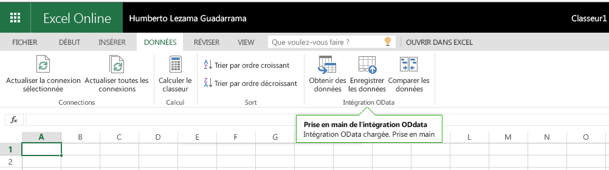
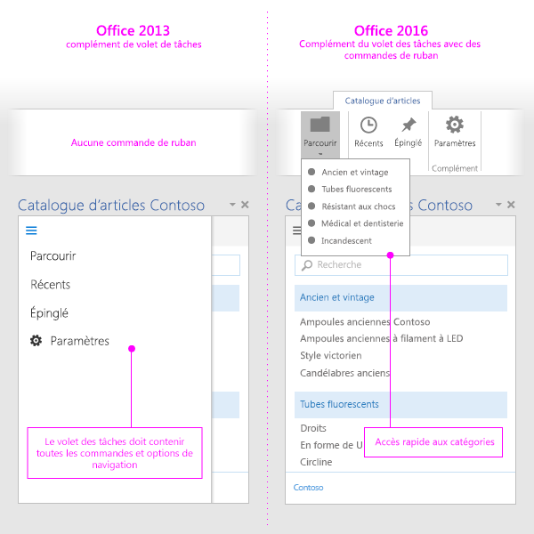

# Commandes de complément pour Excel, PowerPoint et Word

Les commandes de complément sont des éléments d’interface utilisateur qui étendent l’interface utilisateur d’Office et lancent des actions dans votre complément. Vous pouvez les utiliser pour ajouter un bouton sur le ruban ou un élément dans le menu contextuel. Lorsque les utilisateurs sélectionnent une commande de complément, ils lancent des actions telles que l’exécution de code JavaScript ou l’affichage d’une page du complément dans le volet Office. Les commandes de complément aident les utilisateurs à trouver et utiliser votre complément, ce qui favorise l’adoption et la réutilisation de votre complément, et améliore la fidélisation des clients.

Pour une vue d'ensemble du reportage, voir la vidéo [Ruban de l'application commandes complémentaires au sein du Bureau](https://channel9.msdn.com/events/Build/2016/P551).

> [!NOTE]
> Les catalogues SharePoint n’acceptent pas les commandes de complément. Vous pouvez déployer des commandes de complément via le [déploiement centralisé](../publish/centralized-deployment.md) ou [AppSource](/office/dev/store/submit-to-appsource-via-partner-center), ou utiliser le [chargement de version test](../testing/create-a-network-shared-folder-catalog-for-task-pane-and-content-add-ins.md) pour déployer votre commande de complément à des fins de test.

> [!IMPORTANT]
> Les commandes de complément sont actuellement prises en charge dans Outlook. Pour plus d’informations, voir [Commandes de complément pour Outlook](../outlook/add-in-commands-for-outlook.md).

*Figure 1. Complément incluant des commandes en cours d’exécution dans Excel (version de bureau)*

*Figure 2. Complément incluant des commandes en cours d’exécution dans Excel sur le web*

## Fonctionnalités de commande

Les fonctionnalités de commande suivantes sont actuellement prises en charge.

> [!NOTE]
> Les compléments de contenu ne prennent actuellement pas en charge les commandes de complément.

### Points d’extension

- Onglets de ruban - Permet d’étendre les onglets prédéfinis ou de créer un onglet personnalisé.
- Menus contextuels - Permet d’étendre les menus contextuels sélectionnés.

### Types de contrôles

- Boutons simples - Permettent de déclencher des actions spécifiques.
- Menus - Menu déroulant simple avec des boutons qui déclenchent des actions.

### Actions

- ShowTaskpane - Affiche un ou plusieurs volets où sont chargées des pages HTML personnalisées.
- ExecuteFunction - Charge une page HTML invisible, puis y exécute une fonction JavaScript. Pour afficher l’interface utilisateur au sein de votre fonction (par exemple, erreurs, avancement, entrées supplémentaires), vous pouvez utiliser l’API [displayDialog](/javascript/api/office/office.ui).  

### État Activé ou Désactivé par défaut

Vous pouvez spécifier si la commande est activée ou désactivée lors du lancement de votre complément et modifier le paramètre par programme.

> [!NOTE]
> Cette fonctionnalité n’est pas prise en charge dans toutes les applications Office ni tous les scénarios. Pour plus d’informations, reportez-vous aux [Commandes Activé et Désactivé pour les compléments](disable-add-in-commands.md).

### Position sur le ruban (aperçu)

Vous pouvez spécifier l’emplacement où s’affiche un onglet personnalisé sur le ruban de l’application Office, par exemple, « juste à droite de l’onglet Accueil ».

> [!NOTE]
> Cette fonctionnalité n’est pas prise en charge dans toutes les applications Office ni dans tous les scénarios. Pour plus d’informations, voir [Positionner un onglet personnalisé sur le ruban](custom-tab-placement.md).

### Intégration des boutons Office prédéfinis (aperçu)

Vous pouvez insérer les boutons prédéfinis du ruban Office dans vos groupes personnalisés de commandes et onglets personnalisés du ruban.

> [!NOTE]
> Cette fonctionnalité n’est pas prise en charge dans toutes les applications Office ni dans tous les scénarios. Pour plus d’informations, voir [Intégrer des boutons prédéfinis Office dans les onglets personnalisés](built-in-button-integration.md).

## Plateformes prises en charge

Les commandes de complément sont actuellement prises en charge sur les plateformes suivantes, à l’exception des limitations spécifiées plus haut dans les sous-sections de [Fonctionnalités de commande](#command-capabilities).

- Office sur Windows (build 16.0.6769+ connectée à un abonnement Microsoft 365)
- Office 2019 sur Windows
- Office sur Mac (build 15.33+, connecté à un abonnement Microsoft 365)
- Office 2019 sur Mac
- Office sur le web

> [!NOTE]
> Pour plus d’informations sur la prise en charge dans Outlook, voir [Commandes de complément pour Outlook](../outlook/add-in-commands-for-outlook.md).

## Débogage

Pour déboguer une commande de complément, vous devez l’exécuter dans Office sur le web. Pour plus de détails, voir [Débogage de compléments dans Office sur le web](../testing/debug-add-ins-in-office-online.md).

## Meilleures pratiques

Appliquez les meilleures pratiques suivantes lorsque vous développez des commandes de complément :

- Utilisez les commandes pour représenter une action spécifique avec un résultat clair et précis pour les utilisateurs. Ne combinez pas plusieurs actions dans un seul bouton.
- Proposez des actions détaillées permettant de réaliser plus efficacement des tâches courantes dans votre complément. Réduisez le nombre d’étapes nécessaires à la réalisation d’une action.
- Pour le placement de vos commandes dans le ruban d'application de l'Office :
    - Placez les commandes sur un onglet existant (Insertion, Révision, etc.) si la fonctionnalité ajoutée lui correspond. Par exemple, si votre complément permet aux utilisateurs d’insérer un élément multimédia, ajoutez un groupe à l’onglet Insertion. Notez que l’ensemble des onglets ne sont pas nécessairement disponibles dans toutes les versions d’Office. Pour plus d’informations, voir le [manifeste XML de compléments Office](../develop/add-in-manifests.md).
    - Placez les commandes sous l’onglet Accueil si la fonctionnalité ne correspond à aucun autre onglet, et si vous avez moins de six commandes de niveau supérieur. Vous pouvez également ajouter des commandes à l’onglet Accueil si votre complément doit fonctionner sur toutes les versions d’Office (par exemple, Office sur le web ou le bureau) et si un onglet n’est pas disponible dans toutes les versions (par exemple, si l’onglet Création n’existe pas dans Office sur le web).  
    - Placez des commandes dans un onglet personnalisé si vous avez plus de six commandes de niveau supérieur.
    - Nommez votre groupe en fonction du nom de votre complément. Si vous avez plusieurs groupes, nommez chaque groupe en fonction de la fonctionnalité offerte par les commandes de ce groupe.
    - N’ajoutez pas de boutons superflus pour augmenter la surface réservée de votre complément.
    - Ne positionnez pas un onglet personnalisé à gauche de l’onglet d’Accueil, ou ne lui donnez pas le focus par défaut lors de l’ouverture du document, sauf si votre complément est le principal mode d’interaction des utilisateurs avec le document. Donner une importance excessive à votre complément dérange et contrarie les utilisateurs et les administrateurs.
    - Si votre complément est le principal mode d’interaction des utilisateurs avec le document et que vous avez un onglet de ruban personnalisé, envisagez d’intégrer dans l’onglet les boutons de fonctions d’Office dont les utilisateurs ont fréquemment besoin.

     > [!NOTE]
     > Les compléments qui prennent trop d’espace peuvent ne pas obtenir la [validation AppSource](/legal/marketplace/certification-policies).

- Pour toutes les icônes, suivez les [règles de conception d’icône](add-in-icons.md).
- Proposez une version de votre complément qui fonctionne aussi sur les applications Office qui ne prennent pas en charge les commandes. Un seul manifeste de complément peut fonctionner à la fois dans les applications sensibles aux commandes (avec des commandes) et non sensibles aux commandes (sous forme de volet de tâches).

   *Figure 3. Complément du volet Office dans Office 2013 et le même complément utilisant des commandes de complément dans Office 2016*

   

## Étapes suivantes

La meilleure façon de commencer à utiliser des commandes de complément consiste à consulter des [exemples de commandes de complément Office](https://github.com/OfficeDev/Office-Add-in-Commands-Samples/) sur GitHub.

Pour plus d’informations sur la spécification des commandes de complément dans votre manifeste, reportez-vous à l’article expliquant comment [créer des commandes de complément dans votre manifeste](../develop/create-addin-commands.md) et au contenu de référence sur [VersionOverrides](../reference/manifest/versionoverrides.md).
