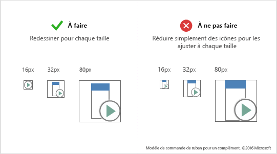
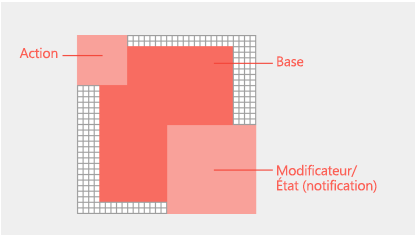

# Recommandations en matière d’icônes de style Office pour les modulesFresh style icon guidelines for Office Add-ins

Les Office versions 2013 et 2013 (sans abonnement) de Office l’iconographie du style Fresh de Microsoft.The Office 2013+ (non-subscription) versions of Office use Microsoft's Fresh style iconography. Si vous préférez que vos icônes correspondent au style monoligne de Microsoft 365, consultez les instructions relatives aux icônes de style Monoline pour Office [des modules.](add-in-icons-monoline.md)If you would prefer that your icons match the Monoline style of Microsoft 365, see [Monoline style icon guidelines for Office Add-ins](add-in-icons-monoline.md).

## Office Style visuel à nouveauOffice Fresh visual style

Les icônes Fresh incluent uniquement les éléments de communication essentiels.The Fresh icons include only essential communicative elements. Les éléments non essentiels, tels que la source de lumière, les dégradés et les perspectives, sont supprimés.Non-essential elements including perspective, gradients, and light source are removed. Les icônes simplifiées prennent en charge l’analyse rapide des commandes et des contrôles.The simplified icons support faster parsing of commands and controls. Suivez ce style pour mieux s’adapter Office clients sans abonnement.Follow this style to best fit with Office non-subscription clients.

## Meilleures pratiquesBest practices

Suivez ces instructions lorsque vous créez vos icônes :Follow these guidelines when you create your icons:

|À faireDo|À ne pas faireDon't|
|:---|:---|
|Conservez des éléments visuels simples et clairs, en vous concentrant sur les éléments clés de la communication.Keep visuals simple and clear, focusing on the key elements of the communication.| N’utilisez pas d’artefacts qui rendent votre icône désordonnée.Don't use artifacts that make your icon look messy.|
|Utilisez le langage d’icône Office pour représenter des comportements ou des concepts.Use the Office icon language to represent behaviors or concepts.|Ne réaffectez pas les glyphes Fabric Core pour les commandes de application Office du ruban ou des menus contextuels.Don’t repurpose Fabric Core glyphs for add-in commands in the Office app ribbon or contextual menus. Les icônes Fabric Core sont stylistiquement différentes et ne correspondent pas.Fabric Core icons are stylistically different and will not match.|
|Réutilisez les métaphores visuelles d’Office courantes telles que le pinceau pour mettre en forme ou la loupe pour rechercher.Reuse common Office visual metaphors such as paintbrush for format or magnifying glass for find.|Ne réutilisez pas les métaphores visuelles pour différentes commandes.Don't reuse visual metaphors for different commands. L’utilisation de la même icône pour différents comportements et concepts peut semer la confusion.Using the same icon for different behaviors and concepts can cause confusion. |
|Redessinez vos icônes pour les réduire ou les agrandir.Redraw your icons to make them small or larger. Prenez le temps de redessiner les découpages, les coins et des bords arrondis pour optimiser la netteté de ligne.Take the time to redraw cutouts, corners, and rounded edges to maximize line clarity. |Ne redimensionnez pas vos icônes en réduisant ou en agrandissant leurs tailles.Don't resize your icons by shrinking or enlarging in size. Cela peut entraîner une mauvaise qualité visuelle et des actions peu claires.This can lead to poor visual quality and unclear actions. Les icônes complexes créées dans une plus grande taille risquent de perdre en clarté si elles sont redimensionnées pour être réduites sans être redessinées.Complex icons created at a larger size may lose clarity if resized to be smaller without redraw. |
|Utilisez un remplissage blanc pour améliorer l’accessibilité. La plupart des objets dans les icônes nécessitent un arrière-plan blanc pour être lisibles sur les thèmes de l’interface utilisateur d’Office et en mode contraste élevé.Use a white fill for accessibility. Most objects in your icons will require a white background to be legible across Office UI themes and in high-contrast modes.  |Évitez de vous fier à votre logo ou marque pour communiquer ce que fait une commande de complément.Avoid relying on your logo or brand to communicate what an add-in command does. Les repères de marque ne sont pas toujours reconnaissables sur des icônes de petites tailles et lorsque des modificateurs sont appliqués.Brand marks aren't always recognizable at smaller icon sizes and when modifiers are applied. Les marques de marque entrent souvent en conflit application Office styles d’icône du ruban et peuvent attirer l’attention des utilisateurs dans un environnement saturé.Brand marks often conflict with Office app ribbon icon styles, and can compete for user attention in a saturated environment. |
|Utilisez le format PNG avec un arrière-plan transparent.Use the PNG format with a transparent background. ||
|Évitez le contenu localisable dans les icônes, y compris les caractères typographiques, les paragraphes en drapeau et les points d’interrogation.Avoid localizable content in your icons, including typographic characters, indications of paragraph rags, and question marks. ||

## Configuration requise et recommandations sur la taille des icônesIcon size recommendations and requirements

Les icônes du bureau Office sont des images bitmap.Office desktop icons are bitmap images. Différentes tailles apparaissent en fonction du paramètre PPP de l’utilisateur et du mode tactile.Different sizes will render depending on the user's DPI setting and touch mode. Incluez les huit tailles prises en charge pour créer la meilleure expérience possible dans tous les contextes et résolutions pris en charge.Include all eight supported sizes to create the best experience in all supported resolutions and contexts. Voici les tailles prises en charge - trois sont obligatoires :The following are the supported sizes - three are required:

- 16 px (obligatoire)16 px (Required)
- 20 px20 px
- 24 px24 px
- 32 px (obligatoire)32 px (Required)
- 40 px40 px
- 48 px48 px
- 64 px (recommandé, meilleur choix pour Mac)64 px (Recommended, best for Mac)
- 80 px (obligatoire)80 px (Required)

> [!IMPORTANT]
> Pour obtenir une image représentant l’icône représentant votre application, voir Créer des listes efficaces dans [AppSource](/office/dev/store/create-effective-office-store-listings#create-an-icon-for-your-add-in) et dans Office pour la taille et d’autres exigences.For an image that is your add-in's representative icon, see [Create effective listings in AppSource and within Office](/office/dev/store/create-effective-office-store-listings#create-an-icon-for-your-add-in) for size and other requirements.

Veillez à renouveler les icônes pour chaque taille au lieu de les réduire pour les ajuster.Make sure to redraw your icons for each size rather than shrink them to fit.

## Mise en page et structure de l’icôneIcon anatomy and layout

Office icônes sont généralement composées d’un élément de base avec des modificateurs d’action et conceptuels superposés.Office icons are typically comprised of a base element with action and conceptual modifiers overlaid. Les modificateurs d’action représentent des concepts tels qu’ajouter, ouvrir, nouveau ou fermer. Action modifiers represent concepts such as add, open, new, or close. Les modificateurs conceptuels représentent l’état, l’altération ou une description de l’icône.Conceptual modifiers represent status, alteration, or a description of the icon.

Pour créer des commandes qui s’alignent sur l’interface utilisateur d’Office, suivez les instructions de mise en forme pour les éléments de base et les modificateurs. Cela garantit que vos commandes auront un aspect professionnel et que vos clients auront confiance en votre complément. Si vous apportez des exceptions à ces instructions, faites-le intentionnellement.To create commands that align with the Office UI, follow layout guidelines for the base element and modifiers. This ensures that your commands look professional and that your customers will trust your add-in. If you make exceptions to these guidelines, do so intentionally.

L’image suivante montre la disposition des éléments de base et modificateurs dans une icône Office.The following image shows the layout of base elements and modifiers in an Office icon.

- Éléments de base centraux dans le cadre de pixel avec remplissage vide tout autour.Center base elements in the pixel frame with empty padding all around.
- Placez les modificateurs d’action dans le coin supérieur gauche.Place action modifiers on the top left.
- Placez les modificateurs conceptuels dans la partie inférieure droite.Place conceptual modifiers on the bottom right.
- Limitez le nombre d’éléments dans les icônes.Limit the number of elements in your icons. À 32 px, limitez le nombre de modificateurs à un maximum de deux.At 32 px, limit the number of modifiers to a maximum of two. À 16 px, limitez le nombre de modificateurs à un.At 16 px, limit the number of modifiers to one.

### Remplissage d’un élément de baseBase element padding

Placez les éléments de base de façon cohérente en fonction des tailles.Place base elements consistently across sizes. Si les éléments de base ne peuvent pas être centrés dans le cadre, alignez-les en haut à gauche, en laissant les pixels supplémentaires dans la partie inférieure droite.If base elements can't be centered in the frame, align them to the top left, leaving the extra pixels on the bottom right. Pour obtenir de meilleurs résultats, appliquez les instructions de remplissage répertoriées dans le tableau de la section suivante.For best results, apply the padding guidelines listed in the table in the following section.

### ModificateursModifiers

Tous les modificateurs doivent avoir un cutout transparent de 1 px entre chaque élément, y compris l’arrière-plan.All modifiers should have a 1 px transparent cutout between each element, including the background. Les éléments ne doivent pas se chevaucher directement.Elements should not directly overlap. Créez des espaces entre les règles et les bords.Create whitespace between rules and edges. Les modificateurs peuvent varier légèrement en taille, mais utilisez ces dimensions comme point de départ.Modifiers can vary slightly in size, but use these dimensions as a starting point.

|Taille de l’icôneIcon size|Remplissage autour de l’élément de basePadding around base element|Taille du modificateurModifier size|
|:---|:---|:---|
|16 px16 px|00|9 px9 px|
|20 px20 px|1px1px|10 px10 px|
|24 px24 px|1px1px|12 px12 px|
|32 px32 px|2px2px|14 px14 px|
|40 px40 px|2px2px|20 px20 px|
|48 px48 px|3px3px|22 px22 px|
|64 px64 px|5px5px|29 px29 px|
|80 px80 px|5px5px|38 px38 px|

## Couleurs de l’icôneIcon colors

> [!NOTE]
> Les couleurs recommandées concernent les icônes du ruban utilisées dans les [Commandes de complément](add-in-commands.md).These color guidelines are for ribbon icons used in [Add-in commands](add-in-commands.md). Ces icônes ne sont pas restitues avec Fluent’interface utilisateur et la palette de couleurs est différente de la palette décrite dans [Microsoft UI Fabric | Couleurs | Partagé](https://fluentfabric.azurewebsites.net/#/color/shared).These icons are not rendered with Fluent UI and the color palette is different from the palette described at [Microsoft UI Fabric | Colors | Shared](https://fluentfabric.azurewebsites.net/#/color/shared).

Les icônes Office ont une palette de couleurs limitée. Utilisez les couleurs répertoriées dans le tableau suivant pour garantir une intégration parfaite avec l’interface utilisateur d’Office. Appliquez les instructions suivantes sur l’utilisation des couleurs :Office icons have a limited color palette. Use the colors listed in the following table to guarantee seamless integration with the Office UI. Apply the following guidelines to the use of color:

- Utilisez la couleur pour véhiculer une signification plutôt que pour embellir. Elle doit mettre en surbrillance ou mettre en évidence une action, un état ou un élément qui différencie explicitement le repère.Use color to communicate meaning rather than for embellishment. It should highlight or emphasize an action, status, or an element that explicitly differentiates the mark.
- Si possible, n’utilisez qu’une seule couleur supplémentaire au-delà du gris. Limitez les couleurs supplémentaires à deux au maximum.If possible, use only one additional color beyond gray. Limit additional colors to two at the most.
- Les couleurs ont une apparence cohérente dans toutes les tailles d’icône.Colors should have a consistent appearance in all icon sizes. Les icônes Office ont des palettes de couleurs légèrement différentes pour des tailles d’icônes différentes.Office icons have slightly different color palettes for different icon sizes. Les icônes de 16 px et plus petites sont légèrement plus sombres et plus dynamiques que les icônes de 32 px et plus grandes.16 px and smaller icons are slightly darker and more vibrant than 32 px and larger icons. Sans ces ajustements discrets, les couleurs semblent varier en taille.Without these subtle adjustments, colors appear to vary across sizes.

|Nom de la couleurColor name|RVBRGB|HexHex|CouleurColor|CatégorieCategory|
|:---|:---|:---|:---|:---|
|Texte gris (80)Text Gray (80)|80, 80, 8080, 80, 80|#505050#505050|  |TexteText|
|Texte gris (95)Text Gray (95)|95, 95, 9595, 95, 95|#5F5F5F#5F5F5F|  |TexteText|
|Texte gris (105)Text Gray (105)|105, 105, 105105, 105, 105|#696969#696969|  |TexteText|
|Gris foncé 32Dark Gray 32|128, 128, 128128, 128, 128|#808080#808080|  |32 px et supérieures32 px and above|
|Gris moyen 32Medium Gray 32|158, 158, 158158, 158, 158|#9E9E9E#9E9E9E|  |32 px et supérieures32 px and above|
|TOUT gris clairLight Gray ALL|179, 179, 179179, 179, 179|#B3B3B3#B3B3B3|  |Toutes les taillesAll sizes|
|Gris foncé 16Dark Gray 16|114, 114, 114114, 114, 114|#727272#727272|  |16 px et inférieur16 px and below|
|Gris moyen 16Medium Gray 16|144, 144, 144144, 144, 144|#909090#909090|  |16 et moins16 and below|
|Bleu 32Blue 32|77, 130, 18477, 130, 184|#4d82B8#4d82B8|  |32 px et supérieures32 px and above|
|Bleu 16Blue 16|74, 125, 17774, 125, 177|#4A7DB1#4A7DB1|  |16 px et inférieur16 px and below|
|TOUT jauneYellow ALL|234, 194, 130234, 194, 130|#EAC282#EAC282|  |Toutes les taillesAll sizes|
|Orange 32Orange 32|231, 142, 70231, 142, 70|#E78E46#E78E46|  |32 px et supérieures32 px and above|
|Orange 16Orange 16|227, 142, 70227, 142, 70|#E3751C#E3751C|  |16 px et inférieur16 px and below|
|TOUT rosePink ALL|230, 132, 151230, 132, 151|#E68497#E68497|  |Toutes les taillesAll sizes|
|Vert 32Green 32|118, 167, 151118, 167, 151|#76A797#76A797|  |32 px et supérieures32 px and above|
|Vert 16Green 16|104, 164, 144104, 164, 144|#68A490#68A490|  |16 px et inférieur16 px and below|
|Rouge 32Red 32|216, 99, 68216, 99, 68|#D86344#D86344|  |32 px et supérieures32 px and above|
|Rouge 16Red 16|214, 85, 50214, 85, 50|#D65532#D65532|  |16 px et inférieur16 px and below|
|Violet 32Purple 32|152, 104, 185152, 104, 185|#9868B9#9868B9|  |32 px et supérieures32 px and above|
|Violet 16Purple 16|137, 89, 171137, 89, 171|#8959AB#8959AB|  |16 px et inférieur16 px and below|

## Icônes en modes de contraste élevéIcons in high contrast modes

Les icônes Office sont conçues pour un rendu correct en mode de contraste élevé. Les éléments de premier plan sont bien différenciés des arrière-plans pour optimiser la lisibilité et permettre le recoloriage. En modes de contraste élevé, Office recolorie tous les pixels de votre icône avec une valeur rouge, verte ou bleue inférieure à 190 en noir plein. Tous les autres pixels sont blancs. Autrement dit, chaque canal RVB est évalué lorsque les valeurs 0-189 sont noires et les valeurs 190-255 sont blanches. D’autres thèmes à contraste élevé recolorient à l’aide du même seuil de valeur 190 mais avec des règles différentes. Par exemple, le thème blanc à contraste élevé recolorie tous les pixels supérieurs à 190 en opaque, mais tous les autres pixels en transparent. Appliquez les instructions suivantes pour optimiser la lisibilité dans les paramètres de contraste élevé :Office icons are designed to render well in high contrast modes. Foreground elements are well differentiated from backgrounds to maximize legibility and enable recoloring. In high contrast modes, Office will recolor any pixel of your icon with a red, green, or blue value less than 190 to full black. All other pixels will be white. In other words, each RGB channel is assessed where 0-189 values are black and 190-255 values are white. Other high-contrast themes recolor using the same 190 value threshold but with different rules. For example, the high-contrast white theme will recolor all pixels greater than 190 opaque but all other pixels as transparent. Apply the following guidelines to maximize legibility in high-contrast settings:

- Essayez de différencier les éléments de premier plan et d’arrière-plan par rapport au seuil de valeur 190.Aim to differentiate foreground and background elements along the 190 value threshold.
- Suivez les styles visuels des icônes Office.Follow Office icon visual styles.
- Utilisez des couleurs de notre palette d’icônes.Use colors from our icon palette.
- Évitez d’utiliser des dégradés.Avoid the use of gradients.
- Évitez les grands blocs de couleur avec des valeurs similaires.Avoid large blocks of color with similar values.

## Voir aussiSee also

- [Élément de manifeste d’icôneIcon manifest element](../reference/manifest/icon.md)
- [Élément manifeste IconUrlIconUrl manifest element](../reference/manifest/iconurl.md)
- [Élément manifeste HighResolutionIconUrlHighResolutionIconUrl manifest element](../reference/manifest/highresolutioniconurl.md)
- [Créer une icône pour votre add-inCreate an icon for your add-in](/office/dev/store/create-effective-office-store-listings#create-an-icon-for-your-add-in)
