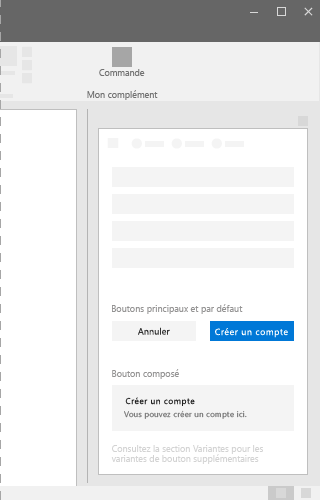

# Composant de bouton dans Office UI Fabric

Utilisez les boutons dans votre complément Office pour permettre aux utilisateurs de valider des changements ou de suivre des étapes dans une tâche. Assurez-vous que le texte du bouton communique l’objectif de l’interaction. Placez les boutons en bas du conteneur de l’interface utilisateur d’un volet des tâches, d’une boîte de dialogue ou d’un volet de contenu. Par exemple, utilisez des boutons pour permettre aux utilisateurs d’envoyer un formulaire, de fermer une boîte de dialogue ou de passer à la page suivante.
  
#### Exemple : Boutons dans un volet des tâches

## Meilleures pratiques

|**À faire**|**À ne pas faire**|
|:-----|:--------|
|Les boutons par défaut doivent toujours effectuer des opérations sûres dans des compléments. |Ne pas placer le focus par défaut sur un bouton qui supprime des données. Placer plutôt le focus sur le bouton qui exécute l’opération sûre ou annule l’action.|
|Utiliser une seule ligne de texte dans l’étiquette du bouton. Le texte doit être le plus court possible.|Ne placer rien d’autre que du texte dans un bouton.|
|Vérifier que l’étiquette reflète un objectif clair du bouton pour l’utilisateur. Utiliser des étiquettes concises, spécifiques, explicites. Envisager d’utiliser un seul mot.|Ne pas utiliser les boutons pour la navigation, sauf pour les étapes **Retour** et **Suivant**. Pour la navigation, envisager d’utiliser un lien.|
|Exposer uniquement un ou deux boutons (actions) à l’utilisateur. Par exemple, **Accepter** et **Annuler**. Pour exposer plus d’actions, envisager d’utiliser des cases à cocher ou des cases d’option pour que les utilisateurs sélectionnent des actions, et de fournir un seul bouton pour démarrer les actions sélectionnées.||
|Définir les boutons **Envoyer**, **OK** et **Appliquer** comme boutons principaux. Lorsque les boutons **Réinitialiser** ou **Annuler** s’affichent à côté de l’un de ces boutons, les définir comme boutons par défaut.| |

## Variantes

|**Variation**|**Description**|**Exemple**|
|:------------|:--------------|:----------|
|**Bouton principal**|Les boutons principaux héritent de la couleur de thème dans le statut non opérationnel. Utilisez les boutons principaux pour mettre en évidence l’appel principal à l’action.||
|**Bouton par défaut**|Les boutons par défaut doivent toujours effectuer des opérations sûres et ne doivent jamais rien supprimer.||
|**Bouton composé**|Utilisez les boutons composés pour provoquer des actions qui exécutent une tâche ou entraînent une tâche de transition.||

## Implémentation

Pour plus d’informations, reportez-vous à [Bouton](https://dev.office.com/fabric#/components/button) et [Démarrer avec un exemple de code Fabric React](https://github.com/OfficeDev/Word-Add-in-GettingStartedFabricReact).

## Voir aussi

- [Modèles de conception UX](https://github.com/OfficeDev/Office-Add-in-UX-Design-Patterns-Code)
- [Office UI Fabric dans des compléments Office](office-ui-fabric.md)
