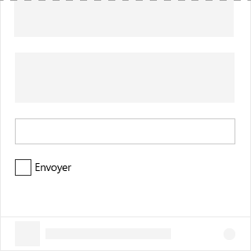

# Composant de case à cocher dans Office UI FabricCheckbox component in Office UI Fabric

Une case à cocher est un élément de l’interface utilisateur qui permet aux utilisateurs d’activer ou de désactiver des options dans les compléments. Utilisez les cases à cocher pour permettre aux utilisateurs de sélectionner des options. En outre, une case à cocher peut être associée à un contrôle. Lorsque la case à cocher est sélectionnée ou désélectionnée, le comportement du contrôle associé change. Par exemple, le contrôle associé peut basculer entre l’état visible ou masqué.A check box is a UI element that allows users to select or clear options in add-ins. Use check boxes to allow users to select among options. Additionally, a check box may be paired with a related control. When the check box is selected or cleared, the behavior of the related control changes. For example, the related control may toggle between the visible or hidden states.
  
#### Exemple : Case à cocher dans un volet des tâchesExample: Check box in a task pane

## Meilleures pratiquesBest practices

|**À faire****Do**|**À ne pas faire****Don't**|
|:------------|:--------------|
|Utiliser les cases à cocher pour indiquer l’état.Use check boxes to indicate status.   |Ne pas utiliser les cases à cocher pour afficher/indiquer une action.Don’t use check boxes to show/indicate an action.   |
|Utiliser plusieurs cases à cocher lorsque les utilisateurs peuvent sélectionner plusieurs options qui ne s’excluent pas mutuellement.Use multiple check boxes when users can select multiple options, and the options are not mutually exclusive.|Ne pas utiliser de case à cocher lorsque les utilisateurs ne peuvent choisir qu’une seule option. Utiliser les cases d’option lorsqu’ils ne doivent sélectionner qu’une seule option.Don’t use a check box when users can choose only one option. When selecting only one option is required, use radio buttons.|
|Autoriser les utilisateurs à choisir n’importe quelle combinaison d’options lorsque plusieurs cases à cocher sont regroupées.Allow users to choose any combination of options when several check boxes are grouped together.|Ne pas placer deux groupes de cases à cocher l’un à côté de l’autre. Séparer les deux groupes avec des étiquettes.Don't put two groups of check boxes next to each other. Separate the two groups with labels.|
|Utiliser une case à cocher unique pour un paramètre secondaire.Use a single check box for a secondary setting. Par exemple, la case à cocher **Mémoriser mes informations** est un paramètre secondaire utilisé dans un scénario de connexion.For example, the **Remember me?** check box is a secondary setting used in a sign-in scenario.|Ne pas utiliser de cases à cocher pour activer et désactiver des paramètres. Pour passer d’un état activé à désactivé ou vice-versa, utiliser un bouton bascule.Don’t use check boxes to turn settings on or off. To change between an on or off state, use a toggle.|

## VariantesVariants

|**Variation****Variation**|**Description****Description**|**Exemple****Example**|
|:------------|:--------------|:----------|
|**Case à cocher non contrôlée****Uncontrolled check box**|À utiliser comme état de case à cocher par défaut.Use as the default check box state. ||
|**Case à cocher non contrôlée avec la valeur Vrai sélectionnée par défaut****Uncontrolled check box with default checked true**|À utiliser lorsque l’instance de case à cocher conserve son propre étatUse when the check box instance maintains its own state. ||
|**Case à cocher non contrôlée désélectionnée avec la valeur Vrai sélectionnée par défaut****Disabled uncontrolled check box with default checked true**|État désactivé de la case à cocher.Disabled state of the check box. ||
|**Case à cocher contrôlée****Controlled check box**|L’état sélectionné de cette case à cocher est décidé à un autre endroit de votre interface utilisateur. Dans ce scénario, la valeur correcte est transmise à la case à cocher par un événement **onChange** et le nouveau rendu de l’interface utilisateur.The checked state of this check box is decided at another location in your UI. In this scenario, the correct value is passed to the check box by an **onChange** event and re-rendering of the UI. ||

## ImplémentationImplementation

Pour plus d’informations, reportez-vous à [Case à cocher](https://dev.office.com/fabric#/components/checkbox) et [Démarrer avec un exemple de code Fabric React](https://github.com/OfficeDev/Word-Add-in-GettingStartedFabricReact).For details, see [Checkbox](https://dev.office.com/fabric#/components/checkbox) and [Getting started with Fabric React code sample](https://github.com/OfficeDev/Word-Add-in-GettingStartedFabricReact).

## Voir aussiSee also

- [Modèles de conception UXUX Design Patterns](https://github.com/OfficeDev/Office-Add-in-UX-Design-Patterns-Code)
- [Office UI Fabric dans des compléments OfficeOffice UI Fabric in Office Add-ins](office-ui-fabric.md)
