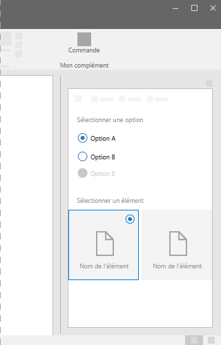
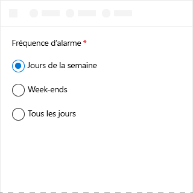
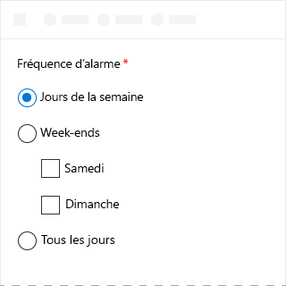
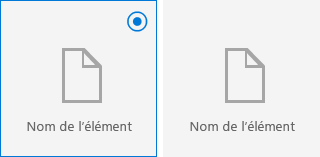

# Composant ChoiceGroup dans Office UI Fabric

Le composant ChoiceGroup, également appelé bouton radio, présente aux utilisateurs deux options ou plus qui s’excluent mutuellement. Les utilisateurs ne peuvent sélectionner qu’un seul bouton ChoiceGroup dans un groupe. Chaque option est représentée par un bouton ChoiceGroup. 
  
#### Exemple : ChoiceGroup dans un volet des tâches

 

 

## Meilleures pratiques

|**À faire**|**À ne pas faire**|
|:------------|:--------------|
|Conserver les options ChoiceGroup au même niveau.   |Ne pas utiliser de ChoiceGroups ou de cases à cocher imbriqués.   |
|Utiliser des ChoiceGroups avec 2 à 7 options, en vérifiant qu’il y a suffisamment d’espace à l’écran pour afficher toutes les options. Dans le cas contraire, utiliser une case à cocher ou une liste déroulante.|Ne pas utiliser lorsque les options sont des nombres à intervalle fixe, par exemple 10, 20, 30, etc. À la place, utiliser un composant de curseur.|
|Si les utilisateurs ne choisissent aucune option, envisager d’inclure une option comme **Aucune** ou **Non concerné**.|Ne pas utiliser de boutons ChoiceGroup pour un choix binaire unique.|
|Si possible, aligner les boutons ChoiceGroup verticalement et non horizontalement. L’alignement horizontal est plus difficile à lire et à localiser.||
|Lister les options dans un ordre logique. Par exemple, commencer par les options les plus susceptibles d’être activées, les plus simples ou les moins risquées. |Ne pas ranger les options par ordre alphabétique, car ce classement dépend de la langue.|

## Variantes

|**Variation**|**Description**|**Exemple**|
|:------------|:--------------|:----------|
|**ChoiceGroups**|À utiliser lorsque les images ne sont pas nécessaires pour effectuer une sélection.| |
|**ChoiceGroups utilisant des images**|À utiliser lorsque les images sont nécessaires pour effectuer une sélection.| |

## Implémentation

Pour plus d’informations, reportez-vous à [ChoiceGroup](https://dev.office.com/fabric#/components/choicegroup) et [Démarrer avec un exemple de code Fabric React](https://github.com/OfficeDev/Word-Add-in-GettingStartedFabricReact).

## Ressources supplémentaires

- [Modèles de conception UX](https://github.com/OfficeDev/Office-Add-in-UX-Design-Patterns-Code)

- [Office UI Fabric dans des compléments Office](office-ui-fabric.md)
