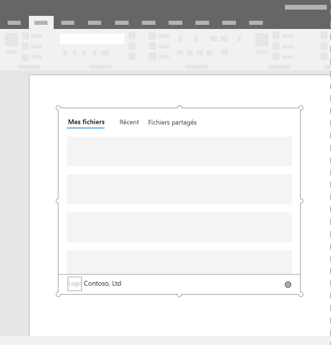

# Compléments Office de contenu

Les compléments de contenu sont des surfaces qui peuvent être incorporées directement dans des documents Excel ou PowerPoint. Les compléments de contenu permettent aux utilisateurs d’accéder aux contrôles d’interface qui exécutent le code pour modifier des documents ou afficher des données d’une source de données. Utilisez les compléments de contenu lorsque vous souhaitez incorporer des fonctionnalités directement dans le document.  

*Figure 1. Mise en page type pour les compléments de contenu*

## Meilleures pratiques

- Inclure un élément de navigation ou de commande comme le CommandBar ou le tableau croisé dynamique en haut de votre complément.
- Inclure un élément de la marque tel que BrandBar en bas de votre complément (s’applique aux compléments Excel et PowerPoint uniquement).

## Variantes

Les tailles de contenu des Excel et PowerPoint dans Office bureau et Microsoft 365 sont spécifiées par l’utilisateur.

## Menu Caractéristique

Les menus Caractéristique peuvent entraver les éléments de navigation et de commande se trouvant en haut à droite du complément. Voici les dimensions actuelles du menu Caractéristique sur Windows et Mac.

Pour Windows, le menu Caractéristique mesure 12 x 32 pixels, comme illustré.

*Figure 2. Menu Caractéristique sur Windows*

Pour Mac, le menu Caractéristique mesure 26 x 26 pixels, mais flotte à 8 pixels de la droite et à 6 pixels du haut, ce qui permet d’augmenter l’espace occupé à 34 x 32 pixels, comme illustré.

*Figure 3. Menu Caractéristique sur Mac*

## Implémentation

Pour consulter un exemple qui implémente un complément de contenu, reportez-vous à [Excel Content Add-in Humongous Insurance](https://github.com/OfficeDev/Excel-Content-Add-in-Humongous-Insurance) dans GitHub.

## Considérations relatives à la prise en charge

- Vérifiez si votre Office fonctionne sur une application ou une plateforme [Office spécifique.](../overview/office-add-in-availability.md)
- Certains compléments de contenu peuvent exiger que l’utilisateur accepte que le complément lise et écrive dans Excel ou PowerPoint. Vous pouvez déclarer le [niveau des autorisations](../develop/requesting-permissions-for-api-use-in-content-and-task-pane-add-ins.md) que vous souhaitez attribuer à votre utilisateur dans le manifeste du complément.  
- Les compléments de contenu sont pris en charge dans Excel et PowerPoint dans Office 2013 et versions ultérieures. Si vous ouvrez un complément dans une version d’Office qui ne prend pas en charge les compléments web Office, le complément s’affichera comme une image.

## Voir aussi

- [Application cliente Office et disponibilité de la plateforme pour les compléments Office](../overview/office-add-in-availability.md)
- [Cœur de fabric dans les modules](fabric-core.md)
- [Modèles de conception de l’expérience utilisateur pour les compléments Office](../design/ux-design-pattern-templates.md)
- [Demande d’autorisations d’utilisation de l’API dans des compléments](../develop/requesting-permissions-for-api-use-in-content-and-task-pane-add-ins.md)
