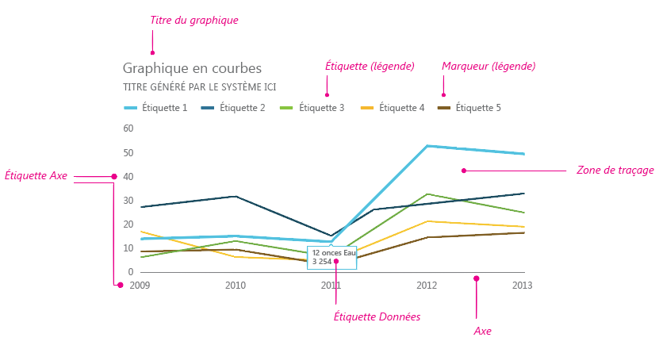
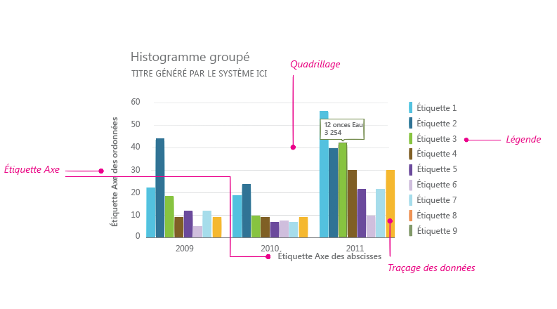
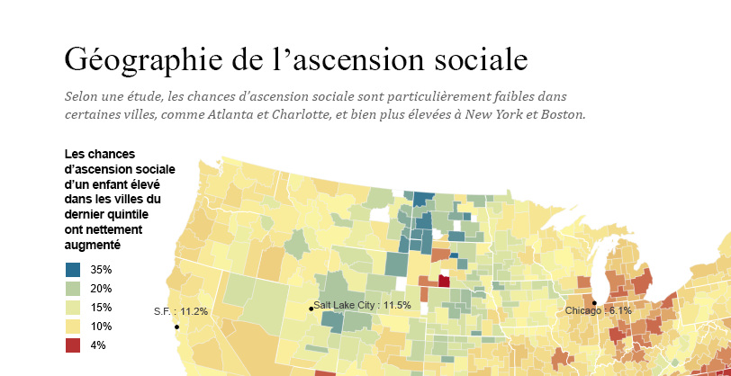
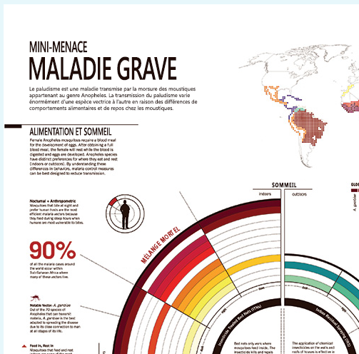
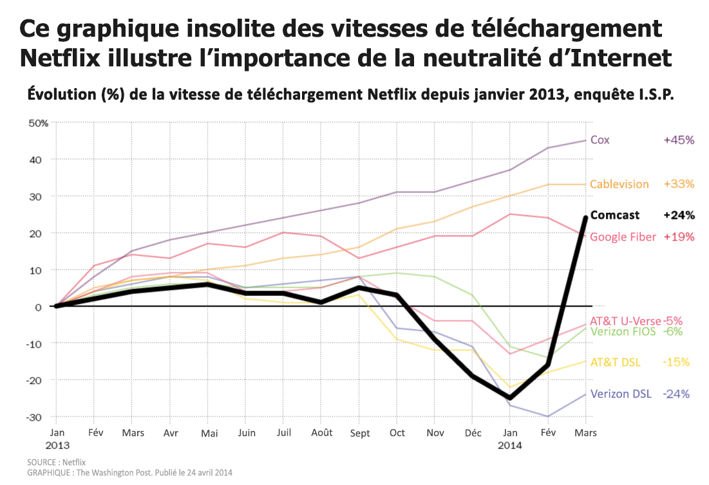

# Règles de style de visualisation de données pour les compléments OfficeData visualization style guidelines for Office Add-ins

Une bonne visualisation des données permet aux utilisateurs de rechercher des informations dans leurs données. Ils peuvent utiliser ces informations pour raconter des histoires qui informent et persuadent. Cet article fournit des instructions pour vous aider à créer des visualisations de données efficaces dans vos compléments pour Excel et d’autres applications Office.Good data visualizations help users find insights in their data. They can use those insights to tell stories that inform and persuade. This article provides guidelines to help you design effective data visualizations in your add-ins for Excel and other Office apps.

Nous vous recommandons d’utiliser [Office UI Fabric](https://developer.microsoft.com/fabric) pour créer l’apparence de vos visualisations de données. Office UI Fabric comprend des styles et des composants qui s’intègrent parfaitement à l’apparence Office.We recommend that you use [Office UI Fabric](https://developer.microsoft.com/fabric) to create the chrome for your data visualizations. Office UI Fabric includes styles and components that integrate seamlessly with the Office look and feel. 

<!--The following figure shows a data visualization in an add-in that uses Fabric.

 

-->

## Éléments de visualisation de donnéesData visualization elements

Les visualisations de données partagent un cadre général et des éléments visuels et interactifs communs, notamment des titres, des étiquettes et des tracés de données, comme indiqué dans les figures suivantes.Data visualizations share a general framework and common visual and interactive elements, including titles, labels, and data plots, as shown in the following figures.

### Titres de graphiqueChart titles

Suivez ces instructions pour les titres de graphique :Follow these guidelines for chart titles:

- Faites en sorte que vos titres de graphique soient lisibles. Positionnez-les pour créer une hiérarchie visuelle claire par rapport au reste du graphique.Make your chart titles easily readable. Position them to create a clear visual hierarchy in relation to the rest of the chart.
- En règle générale, utilisez la mise en majuscule de phrase (premier mot en majuscule). Pour créer un contraste ou accentuer des hiérarchies, vous pouvez mettre tout en majuscules, mais faites-le avec parcimonie.In general, use sentence capitalization (capitalize the first word). To create contrast or to reinforce hierarchies, you can use all caps, but all caps should be used sparingly.
- Intégrez les [recommandations relatives aux polices d’Office UI Fabric](https://developer.microsoft.com/fabric#/styles/typography) pour harmoniser vos graphiques avec l’interface utilisateur Office, qui utilise la police Segoe. Vous pouvez également utiliser une autre police pour différencier le contenu du graphique de l’interface utilisateur.Incorporate the [Office UI Fabric type ramp](https://developer.microsoft.com/fabric#/styles/typography) to make your charts consistent with the Office UI, which uses Segoe. You can also use a different typeface to differentiate chart content from the UI.
- Utilisez des polices sans-serif avec des compteurs de grande taille.Use sans-serif typefaces with large counters.

Les exemples suivants illustrent des polices serif et sans-serif utilisées dans les titres de graphique. Remarquez comment le contraste d’échelle et une utilisation efficace des espaces blancs créent une hiérarchie visuelle forte.The following examples show serif and sans-serif typefaces used in chart titles. Notice how the scale contrast and effective use of white space create a strong visual hierarchy.

### Étiquettes d’axeAxis labels

Rendez vos étiquettes d’axe suffisamment foncées pour qu’elles soient lisibles, avec des taux de contraste adéquats entre les couleurs de texte et d’arrière-plan. Veillez à ce qu’elles ne soient pas trop foncées pour ne pas se confondre avec l’encre de données.Make your axis labels dark enough to read clearly, with adequate contrast ratios between the text and background colors. Make sure that they are not so dark that they compete with data ink.

Les nuances de gris clair sont les plus efficaces pour les étiquettes d’axe. Si vous utilisez Fabric, consultez la [palette de couleurs neutres](https://developer.microsoft.com/fabric#/styles/colors).Light grays are most effective for axis labels. If you’re using Fabric, see the [Neutral Colors palette](https://developer.microsoft.com/fabric#/styles/colors).

### Encre de donnéesData ink

Les pixels qui représentent les données réelles dans un graphique sont appelés encre de données. Il doit s’agir de l’objectif central de la visualisation. Évitez d’utiliser des ombres portées, des plans lourds ou des éléments de conception inutiles qui faussent ou se confondent avec les données. Utilisez des dégradés uniquement lorsque les valeurs de données sont liées à des valeurs de couleur. Évitez les graphiques en trois dimensions, sauf si une valeur objective mesurable est liée à une troisième dimension.The pixels that represent the actual data in a chart are referred to as data ink. This should be the central focus of the visualization. Avoid the use of drop shadows, heavy outlines, or unnecessary design elements that distort or compete with the data. Use gradients only when data values are tied to color values. Avoid three-dimensional charts unless a measurable, objective value is bound to a third dimension.

### CouleurColor

Choisissez des couleurs qui respectent les thèmes du système d’exploitation ou de l’application plutôt que des couleurs codées en dur. En même temps, assurez-vous que les couleurs que vous appliquez ne faussent pas les données. Une utilisation abusive des couleurs dans les visualisations de données peut provoquer une distorsion des données et une lecture incorrecte des informations.Choose colors that follow operating system or application themes rather than hardcoded colors. At the same time, make sure that the colors you apply do not distort the data. Misuse of color in data visualizations can result in data distortion and incorrect reading of information.

Pour des recommandations sur l’utilisation des couleurs dans les visualisations de données, voir les rubriques suivantes :For best practices for use of color in data visualizations, see the following:

- [Pourquoi les couleurs de l’arc-en-ciel ne constituent pas la meilleure option pour les visualisations de données ?Why rainbow colors aren't the best option for data visualizations](http://www.poynter.org/2013/why-rainbow-colors-arent-always-the-best-options-for-data-visualizations/224413/)
- [Color Brewer 2.0 : Conseils en matière de couleur pour la cartographieColor Brewer 2.0: Color Advice for Cartography](http://colorbrewer2.org/)
- [Je veux une teinteI Want Hue](http://tools.medialab.sciences-po.fr/iwanthue/)

### QuadrillageGridlines

Le quadrillage est souvent nécessaire pour une lecture précise d’un graphique, mais il doit être présenté comme un élément visuel secondaire, qui améliore l’encre de données, sans se confondre avec elle. Créez un quadrillage statique fin et léger, sauf s’il est conçu spécifiquement pour un contraste élevé. Vous pouvez également utiliser une interaction pour créer un quadrillage dynamique ponctuel qui s’affiche dans le contexte lorsqu’un utilisateur interagit avec un graphique.Gridlines are often necessary for accurately reading a chart, but should be presented as a secondary visual element, enhancing the data ink, not competing with it. Make static gridlines thin and light, unless they are designed specifically for high contrast. You can also use interaction to create dynamic, just-in-time gridlines that appear in context when a user interacts with a chart.

Les nuances de gris clair sont les plus efficaces pour les quadrillages. Si vous utilisez Fabric, consultez la [palette de couleurs neutres](https://developer.microsoft.com/fabric#/styles/colors).Light grays are most effective for gridlines. If you’re using Fabric, see the [Neutral Colors palette](https://developer.microsoft.com/fabric#/styles/colors).

L’image suivante montre une visualisation de données avec le quadrillage.The following image shows a data visualization with gridlines.

### LégendesLegends

Ajoutez des légendes si nécessaire pour :Add legends if necessary to:

- Faire une distinction entre les sériesDistinguish between series
- Présenter des modifications d’échelle ou de valeurPresent scale or value changes

Assurez-vous que vos légendes améliorent l’encre de données et ne rivalisent pas avec elle. Placez les légendes :Make sure that your legends enhance the data ink and do not compete with it. Place legends:

- Alignées à gauche, au-dessus de la zone de traçage par défaut, si tous les éléments de légende tiennent au-dessus du graphique.Flush left above the plot area by default, if all legend items fit above the chart.
- Dans la partie supérieure droite de la zone de traçage, si tous les éléments de légende ne tiennent pas au-dessus du graphique et ajoutez une zone de texte déroulante, si nécessaire.On the upper right side of the plot area, if all legend items do not fit above the chart, and make it scrollable, if necessary.

Pour optimiser la lisibilité et l’accessibilité, associez des marqueurs de légende à la forme de graphique appropriée. Par exemple, utilisez des marqueurs de légende circulaires pour les légendes de graphique en bulles et de graphique en nuages de points. Utilisez des marques de légende de segment de ligne pour les graphiques en courbes.To optimize for readability and accessibility, map legend markers to the relevant chart shape. For example, use circle legend markers for scatter plot and bubble chart legends. Use line segment legend markers for line charts.

### Info-bulles et étiquettes de donnéesData labels and tooltips

Assurez-vous que les info-bulles et les étiquettes de données contiennent des variations adéquates d’espace blanc et de type. Utilisez des algorithmes pour réduire l’occlusion et la collision. Par exemple, une info-bulle peut apparaître à droite d’un point de données par défaut, mais à gauche si des bords droits sont détectés.Ensure that data labels and tooltips have adequate white space and type variation. Use algorithms to minimize occlusion and collision. For example, a tooltip might surface to the right of a data point by default, but surface to the left if right edges are detected.

## Principes de conceptionDesign principles

L’équipe de conception d’Office a élaboré l’ensemble suivant de principes de conception, que nous utilisons lors de la création de visualisations de données pour la suite de produits Office.The Office Design team created the following set of design principles, which we use when designing new data visualizations for the Office product suite.

### Principes de conception visuelleVisual design principles

- Les visualisations doivent respecter et améliorer les données, facilitant ainsi leur compréhension. Mettez en surbrillance les données, en ajoutant des éléments de soutien uniquement selon les besoins pour fournir un contexte. Évitez les embellissements inutiles (ombres portées, contours, etc.), les éléments de graphique indésirables ou la distorsion des données.Visualizations should honor and enhance the data, making it easy to understand. Highlight the data, adding supporting elements only as needed to provide context. Avoid unnecessary embellishments (drop shadows, outlines, etc), chart junk, or data distortion.
- Les visualisations doivent encourager l’exploration en fournissant un retour visuel enrichi. Utilisez des modèles d’interaction bien établis, des options d’interface et des commentaires système clairs.Visualizations should encourage exploration by providing rich visual feedback. Use well-established interaction patterns, interface controls, and clear system feedback.
- Incarnez des principes de conception consacrés. Utilisez les principes de conception de communication typographique et visuelle établis pour améliorer la forme, la lisibilité et le sens.Embody time-honored design principles. Use established typographic and visual communication design principles to enhance form, readability, and meaning.

### Principes de conception de l’interactionInteraction design principles

- Concevez votre projet de façon à permettre l’exploration.Design to allow for exploration.
- Autorisez les interactions directes avec des objets qui révèlent de nouvelles perspectives (tri par glissement, par exemple).Allow for direct interactions with objects that reveal new insights (sorting via drag, for example).
- Utilisez des modèles d’interaction simples, directs et familiers.Use simple, direct, familiar interaction models.

Pour plus d’informations sur la conception de visualisations de données interactives et conviviales, voir [Fondements et pièges de l’interface utilisateur](http://uitraps.com/).For more information about how to design user-friendly interactive data visualizations, see [UI Tenets and Traps](http://uitraps.com/).

### Principes de conception de mouvementsMotion design principles

Le mouvement suit un stimulus. Les éléments visuels doivent se déplacer dans la même direction à la même vitesse. Cela s’applique à :Motion follows stimulus. Visual elements should move in the same direction at the same rate. This applies to:

- Création de graphiqueChart creation
- Transition d’un type de graphique à un autreTransition from one chart type to another chart type
- FiltrageFiltering
- TriSorting
- Ajout ou soustraction de donnéesAdding or subtracting data
- Brossage ou segmentation des donnéesBrushing or slicing data
- Redimensionnement d’un graphiqueResizing a chart

Créez une perception de causalité. Lors de la préparation des animations :Create a perception of causality. When staging animations:

- Préparez une chose à la fois.Stage one thing at a time. 
- Préparez les modifications des axes avant les modifications de l’encre de données.Stage changes to axes before changes to data ink.
- Préparez et animez des objets en tant que groupes s’ils se déplacent à la même vitesse dans la même direction.Stage and animate objects as a group if they are moving at the same speed in the same direction.
- Préparez les éléments de données en groupes de 4 à 5 objets maximum. Les visionneuses ont des difficultés à suivre plus de 4 à 5 objets indépendamment.Stage data elements in groups of no more than 4-5 objects. Viewers have difficulty tracking more than 4-5 objects independently.

Le mouvement ajoute une signification.Motion adds meaning.

- Les animations augmentent la compréhension par l’utilisateur des modifications apportées aux données, fournissent du contexte et agissent comme un calque d’annotation non verbal.Animations increase user comprehension of changes to the data, provide context, and act as a non-verbal annotation layer.
- Le mouvement doit se produire dans un espace de coordonnées significatif de la visualisation.Motion should occur in a meaningful coordinate space of the visualization.
- Adaptez l’animation en fonction du visuel.Tailor the animation to the visual. 
- Évitez les animations gratuites.Avoid gratuitous animations.

Le mouvement suit les données.Motion follows data.

- Conservez les mappages de données. Si une zone est liée à une mesure, conservez cette zone de transition.Preserve data mappings. If an area is tied to a measure, maintain that area in transition.
- Maintenez un langage de création d’animation cohérent. Autant que possible, mappez l’animation de visualisation de données sur le langage de conception de mouvement Office existant. Utilisez des animations similaires pour les types de graphiques similaires.Maintain a consistent animation design language. Where possible, map data visualization animation to existing Office motion design language. Use similar animations for similar chart types.

## Accessibilité des visualisations de donnéesAccessibility in data visualizations

- N’utilisez pas la couleur comme l’unique vecteur de communication des informations. Les personnes daltoniennes ne seront pas capables d’interpréter les résultats. Utilisez la forme, la taille et la texture en plus de la couleur lorsque cela est possible pour communiquer des informations.Do not use color as the only way to communicate information. People who are color blind will not be able to interpret the results. Use shape, size and texture in addition to color when possible to communicate information.
- Rendez tous les éléments interactifs, tels que les boutons de commande ou les listes déroulantes, accessibles à partir d’un clavier.Make all interactive elements, such as push buttons or pick lists, accessible from a keyboard.
- Envoyez des événements d’accessibilité aux lecteurs d’écran pour annoncer les modifications de sélection, les info-bulles et ainsi de suite.Send accessibility events to screen readers to announce focus changes, tooltips, and so on.

## Voir aussiSee also 

- [Données + Conception : une introduction simple à la préparation et à la visualisation des informationsData + Design: A Simple Introduction to Preparing and Visualizing Information](https://infoactive.co/data-design)
- [Les cinq meilleures bibliothèques pour créer des visualisations de donnéesThe Five Best Libraries for Building Data Visualizations](http://www.fastcompany.com/3029760/the-five-best-libraries-for-building-data-vizualizations)
- [Affichage visuel des informations quantitativesThe Visual Display of Quantitative Information](https://www.edwardtufte.com/tufte/books_vdqi)
