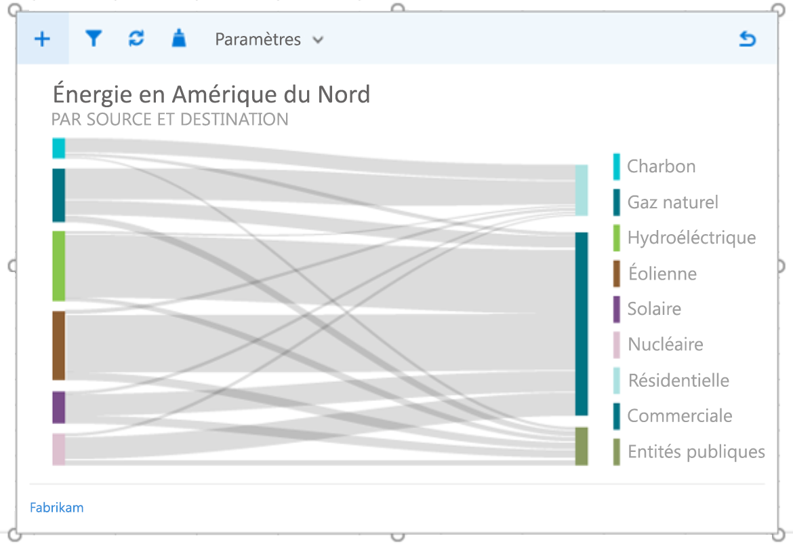

# Règles de style de visualisation de données pour les compléments Office

Une bonne visualisation des données permet aux utilisateurs de rechercher des informations dans leurs données. Ils peuvent utiliser ces informations pour raconter des histoires qui informent et persuadent. Cet article fournit des instructions pour vous aider à créer des visualisations de données efficaces dans vos compléments pour Excel et d’autres applications Office.

Nous vous recommandons d’utiliser [Office UI Fabric](https://developer.microsoft.com/fabric) pour créer l’apparence de vos visualisations de données. Office UI Fabric comprend des styles et des composants qui s’intègrent parfaitement à l’apparence Office. 

<!--The following figure shows a data visualization in an add-in that uses Fabric.

 

-->

## Éléments de visualisation de données

Les visualisations de données partagent un cadre général et des éléments visuels et interactifs communs, y compris les titres, les étiquettes et les tracés de données, comme illustré dans la figure suivante.

### Titres de graphique

Suivez ces instructions pour les titres de graphique :

- Faites en sorte que vos titres de graphique soient lisibles. Positionnez-les pour créer une hiérarchie visuelle claire par rapport au reste du graphique.
- En règle générale, utilisez la mise en majuscule de phrase (premier mot en majuscule). Pour créer un contraste ou accentuer des hiérarchies, vous pouvez mettre tout en majuscules, mais faites-le avec parcimonie.
- Intégrez les [recommandations relatives aux polices d’Office UI Fabric](https://developer.microsoft.com/fabric#/styles/typography) pour harmoniser vos graphiques avec l’interface utilisateur Office, qui utilise la police Segoe. Vous pouvez également utiliser une autre police pour différencier le contenu du graphique de l’interface utilisateur.
- Utilisez des polices sans-serif avec des compteurs de grande taille.

### Étiquettes d’axe

Rendez vos étiquettes d’axe suffisamment foncées pour qu’elles soient lisibles, avec des taux de contraste adéquats entre les couleurs de texte et d’arrière-plan. Veillez à ce qu’elles ne soient pas trop foncées pour ne pas se confondre avec l’encre de données.

Les nuances de gris clair sont les plus efficaces pour les étiquettes d’axe. Si vous utilisez Fabric, consultez la [palette de couleurs neutres](https://developer.microsoft.com/fabric#/styles/colors).

### Encre de données

Les pixels qui représentent les données réelles dans un graphique sont appelés encre de données. Il doit s’agir de l’objectif central de la visualisation. Évitez d’utiliser des ombres portées, des plans lourds ou des éléments de conception inutiles qui faussent ou se confondent avec les données. Utilisez des dégradés uniquement lorsque les valeurs de données sont liées à des valeurs de couleur. Évitez les graphiques en trois dimensions, sauf si une valeur objective mesurable est liée à une troisième dimension.

### Couleur

Choisissez des couleurs qui respectent les thèmes du système d’exploitation ou de l’application plutôt que des couleurs codées en dur. En même temps, assurez-vous que les couleurs que vous appliquez ne faussent pas les données. Une utilisation abusive des couleurs dans les visualisations de données peut provoquer une distorsion des données et une lecture incorrecte des informations.

Pour des recommandations sur l’utilisation des couleurs dans les visualisations de données, voir les rubriques suivantes :

- [Pourquoi les couleurs de l’arc-en-ciel ne constituent pas la meilleure option pour les visualisations de données ?](https://www.poynter.org/2013/why-rainbow-colors-arent-always-the-best-options-for-data-visualizations/224413/)
- [Color Brewer 2.0 : Conseils en matière de couleur pour la cartographie](http://colorbrewer2.org/)
- [Je veux une teinte](https://tools.medialab.sciences-po.fr/iwanthue/)

### Quadrillage

Le quadrillage est souvent nécessaire pour une lecture précise d’un graphique, mais il doit être présenté comme un élément visuel secondaire, qui améliore l’encre de données, sans se confondre avec elle. Créez un quadrillage statique fin et léger, sauf s’il est conçu spécifiquement pour un contraste élevé. Vous pouvez également utiliser une interaction pour créer un quadrillage dynamique ponctuel qui s’affiche dans le contexte lorsqu’un utilisateur interagit avec un graphique.

Les nuances de gris clair sont les plus efficaces pour les quadrillages. Si vous utilisez Fabric, consultez la [palette de couleurs neutres](https://developer.microsoft.com/fabric#/styles/colors).

L’image suivante montre une visualisation de données avec le quadrillage.

### Légendes

Ajoutez des légendes si nécessaire pour :

- Faire une distinction entre les séries
- Présenter des modifications d’échelle ou de valeur

Assurez-vous que vos légendes améliorent l’encre de données et ne rivalisent pas avec elle. Placez les légendes :

- Alignées à gauche, au-dessus de la zone de traçage par défaut, si tous les éléments de légende tiennent au-dessus du graphique.
- Dans la partie supérieure droite de la zone de traçage, si tous les éléments de légende ne tiennent pas au-dessus du graphique et ajoutez une zone de texte déroulante, si nécessaire.

Pour optimiser la lisibilité et l’accessibilité, associez des marqueurs de légende à la forme de graphique appropriée. Par exemple, utilisez des marqueurs de légende circulaires pour les légendes de graphique en bulles et de graphique en nuages de points. Utilisez des marques de légende de segment de ligne pour les graphiques en courbes.

### Info-bulles et étiquettes de données

Assurez-vous que les info-bulles et les étiquettes de données contiennent des variations adéquates d’espace blanc et de type. Utilisez des algorithmes pour réduire l’occlusion et la collision. Par exemple, une info-bulle peut apparaître à droite d’un point de données par défaut, mais à gauche si des bords droits sont détectés.

## Principes de conception

L’équipe de conception d’Office a élaboré l’ensemble suivant de principes de conception, que nous utilisons lors de la création de visualisations de données pour la suite de produits Office.

### Principes de conception visuelle

- Les visualisations doivent respecter et améliorer les données, facilitant ainsi leur compréhension. Mettez en surbrillance les données, en ajoutant des éléments de soutien uniquement selon les besoins pour fournir un contexte. Évitez les embellissements inutiles (ombres portées, contours, etc.), les éléments de graphique indésirables ou la distorsion des données.
- Les visualisations doivent encourager l’exploration en fournissant un retour visuel enrichi. Utilisez des modèles d’interaction bien établis, des options d’interface et des commentaires système clairs.
- Incarnez des principes de conception consacrés. Utilisez les principes de conception de communication typographique et visuelle établis pour améliorer la forme, la lisibilité et le sens.

### Principes de conception de l’interaction

- Concevez votre projet de façon à permettre l’exploration.
- Autorisez les interactions directes avec des objets qui révèlent de nouvelles perspectives (tri par glissement, par exemple).
- Utilisez des modèles d’interaction simples, directs et familiers.

Pour plus d’informations sur la conception de visualisations de données interactives et conviviales, voir [Fondements et pièges de l’interface utilisateur](https://uitraps.com/).

### Principes de conception de mouvements

Le mouvement suit un stimulus. Les éléments visuels doivent se déplacer dans la même direction à la même vitesse. Cela s’applique à :

- Création de graphique
- Transition d’un type de graphique à un autre
- Filtrage
- Tri
- Ajout ou soustraction de données
- Brossage ou segmentation des données
- Redimensionnement d’un graphique

Créez une perception de causalité. Lors de la préparation des animations :

- Préparez une chose à la fois. 
- Préparez les modifications des axes avant les modifications de l’encre de données.
- Préparez et animez des objets en tant que groupes s’ils se déplacent à la même vitesse dans la même direction.
- Préparez les éléments de données en groupes de 4 à 5 objets maximum. Les visionneuses ont des difficultés à suivre plus de 4 à 5 objets indépendamment.

Le mouvement ajoute une signification.

- Les animations augmentent la compréhension par l’utilisateur des modifications apportées aux données, fournissent du contexte et agissent comme un calque d’annotation non verbal.
- Le mouvement doit se produire dans un espace de coordonnées significatif de la visualisation.
- Adaptez l’animation en fonction du visuel. 
- Évitez les animations gratuites.

Le mouvement suit les données.

- Conservez les mappages de données. Si une zone est liée à une mesure, conservez cette zone de transition.
- Maintenez un langage de création d’animation cohérent. Autant que possible, mappez l’animation de visualisation de données sur le langage de conception de mouvement Office existant. Utilisez des animations similaires pour les types de graphiques similaires.

## Accessibilité des visualisations de données

- N’utilisez pas la couleur comme l’unique vecteur de communication des informations. Les personnes daltoniennes ne seront pas capables d’interpréter les résultats. Utilisez la forme, la taille et la texture en plus de la couleur lorsque cela est possible pour communiquer des informations.
- Rendez tous les éléments interactifs, tels que les boutons de commande ou les listes déroulantes, accessibles à partir d’un clavier.
- Envoyez des événements d’accessibilité aux lecteurs d’écran pour annoncer les modifications de sélection, les info-bulles et ainsi de suite.

## Voir aussi 

- [Les cinq meilleures bibliothèques pour créer des visualisations de données](https://www.fastcompany.com/3029760/the-five-best-libraries-for-building-data-vizualizations)
- [Affichage visuel des informations quantitatives](https://www.edwardtufte.com/tufte/books_vdqi)
