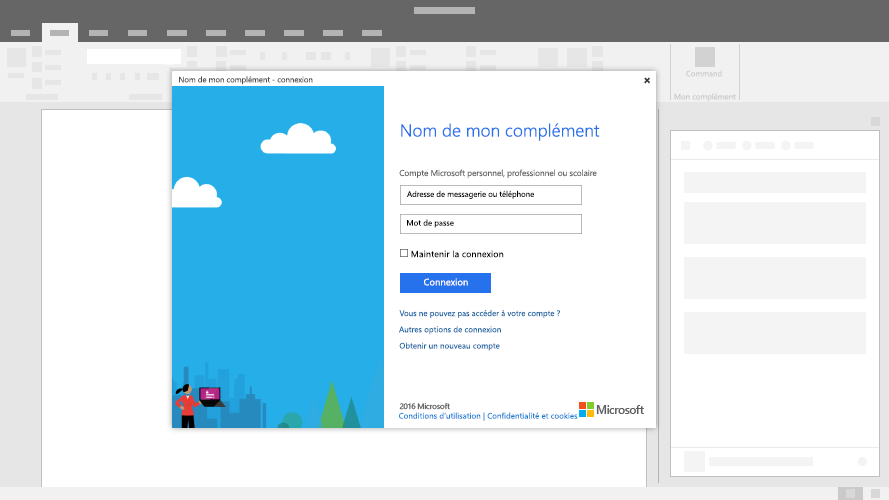

# Boîtes de dialogue dans les compléments Office

Les boîtes de dialogue sont des surfaces qui flottent au-dessus de la fenêtre active de l’application Office. Vous pouvez utiliser les boîtes de dialogue afin de fournir un espace supplémentaire sur l’écran pour les tâches comme les pages de connexion impossibles à ouvrir directement dans un volet des tâches, ou pour les demandes de confirmation d’une action effectuée par un utilisateur, ou pour afficher des vidéos qui peuvent être trop petites si confinées à un volet des tâches.

*Figure 1. Mise en page type pour une boîte de dialogue*

## Meilleures pratiques

|À faire|À ne pas faire|
|:-----|:--------|
|<ul><li>Inclure un titre descriptif qui inclut le nom de votre complément, ainsi que la tâche en cours.</li></ul>|<ul><li>Ne pas ajouter le nom de votre société au titre.</li></ul>|
||<ul><li>Ne pas ouvrir une boîte de dialogue, sauf si le scénario l’exige.</li></ul>|

## Implémentation

Pour voir un exemple relatif à l’implémentation d’une boîte de dialogue, consultez [Exemple d’API de boîte de dialogue de complément Office](https://github.com/OfficeDev/Office-Add-in-Dialog-API-Simple-Example) dans GitHub.

## Voir aussi

- [Dialog object](/javascript/api/office/office.dialog)
- [Modèles de conception de l’expérience utilisateur pour les compléments Office](../design/ux-design-pattern-templates.md)
