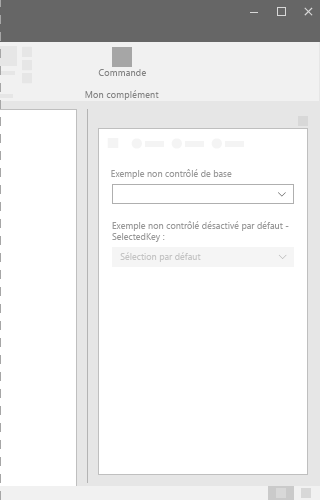
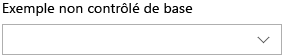
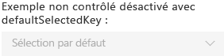

# Composant de liste déroulante dans Office UI Fabric

Une liste déroulante est une liste d’options qui s’affiche en cliquant sur un bouton de liste déroulante. Utilisez des listes déroulantes ou des menus déroulants pour simplifier la conception de l’interface utilisateur, et lorsque les utilisateurs doivent effectuer un choix dans l’interface utilisateur. Lorsque la liste est réduite, l’élément sélectionné est visible. Pour modifier l’élément sélectionné, les utilisateurs ouvrent la liste et sélectionnent une nouvelle valeur.
  
#### Exemple : Liste déroulante dans un volet de tâches

## Meilleures pratiques

|**À faire**|**À ne pas faire**|
|:------------|:--------------|
|Utiliser une liste déroulante lorsque l’option sélectionnée par défaut est plus susceptible d’être sélectionnée que d’autres options. En revanche, ChoiceGroup ou les cases d’option affichent tous les choix, ce qui donne une importance identique à toutes les options.|Ne pas utiliser de listes déroulantes lorsque toutes les options sont pareillement susceptibles d’être sélectionnées.|
|Utiliser une liste déroulante lorsqu’il y a plusieurs choix qui peuvent être réduits en un seul champ. Utiliser également les listes déroulantes pour les longues listes d’éléments ou lorsque l’espace à l’écran est limité.|Ne pas utiliser de listes déroulantes s’il y a moins de deux choix. À la place, utiliser une case à cocher.|
|Utiliser des instructions ou des mots raccourcis dans les listes déroulantes.| |

## Variantes

|**Variation**|**Description**|**Exemple**|
|:------------|:--------------|:----------|
|**Liste déroulante non contrôlée de base**|À utiliser lorsque de nombreuses options peuvent être sélectionnées.| |
|**Liste déroulante non contrôlée désactivée avec defaultSelectedKey**|État désactivé de la liste déroulante.| |
|**Liste déroulante contrôlée**|À utiliser lorsque l’élément sélectionné par défaut est influencé par un autre emplacement dans votre interface utilisateur et que l’élément sélectionné dans la liste déroulante doit être conservé.| |

## Implémentation

Pour plus d’informations, reportez-vous à [Liste déroulante](https://dev.office.com/fabric#/components/dropdown) et [Démarrer avec un exemple de code Fabric React](https://github.com/OfficeDev/Word-Add-in-GettingStartedFabricReact).

## Voir aussi

- [Modèles de conception UX](https://github.com/OfficeDev/Office-Add-in-UX-Design-Patterns-Code)
- [Office UI Fabric dans des compléments Office](office-ui-fabric.md)
