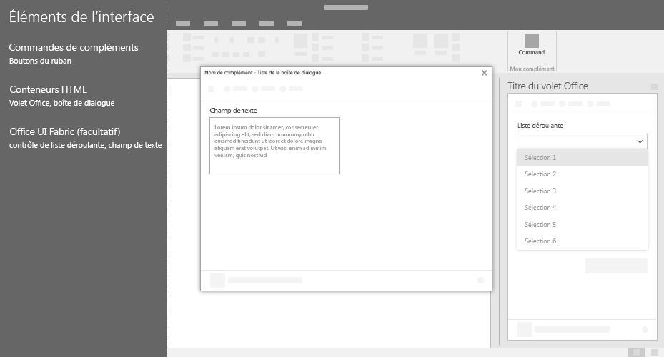

# Éléments d’interface utilisateur Office pour les compléments OfficeOffice UI elements for Office Add-ins

Vous pouvez utiliser plusieurs types d’éléments d’interface utilisateur pour étendre l’interface utilisateur d’Office, y compris des commandes de complément et des conteneurs HTML. Ces éléments d’interface utilisateur ressemblent à une extension naturelle d’Office et fonctionnent sur les plateformes. Vous pouvez insérer votre code basé sur le web personnalisé dans l’un de ces éléments.You can use several types of UI elements to extend the Office UI, including add-in commands and HTML containers. These UI elements look like a natural extension of Office and work across platforms. You can insert your custom web-based code into any of these elements.

L’image suivante montre les types d’éléments d’interface utilisateur d’Office que vous pouvez créer.The following image shows the types of Office UI elements that you can create.

## Commandes de complémentAdd-in commands

Utilisez des [commandes de complément](add-in-commands.md) pour ajouter des points d’entrée vers votre complément au ruban Office. Les commandes démarrent les actions dans votre complément en exécutant du code JavaScript ou en lançant un conteneur HTML. Vous pouvez créer deux types de commandes de complément.Use [add-in commands](add-in-commands.md) to add entry points to your add-in to the Office ribbon. Commands start actions in your add-in either by running JavaScript code, or by launching an HTML container. You can create two types of add-in commands.

|**Type de commande****Command type**|**Description****Description**|
|:---------------|:--------------|
|Onglets, menus et boutons du rubanRibbon buttons, menus, and tabs|Permet d’ajouter des boutons personnalisés, des menus (déroulants) ou des onglets au ruban par défaut dans Office. Utilisez les boutons et menus pour déclencher une action dans Office. Utilisez les onglets pour regrouper et organiser des boutons et menus.Use to add custom buttons, menus (dropdowns), or tabs to the default ribbon in Office. Use Buttons and menus to trigger an action in Office. Use tabs to group and organize buttons and menus.|
|Menus contextuelsContext menus| Permet de développer le menu contextuel par défaut. Les menus contextuels s’affichent lorsque les utilisateurs cliquent avec le bouton droit de la souris sur du texte dans un document Office ou un tableau dans Excel.Use to extend the default context menu. Context menus are displayed when users right-click text in an Office document or a table in Excel.| 

## Conteneurs HTMLHTML containers

Utilisez les conteneurs HTML pour intégrer du code de l’interface utilisateur basé sur HTML dans les clients Office. Ces pages web peuvent ensuite référencer l’API JavaScript Office pour interagir avec du contenu dans le document. Vous pouvez créer trois types de conteneurs HTML.Use HTML containers to embed HTML-based UI code within Office clients. These web pages can then reference the Office JavaScript API to interact with content in the document. You can create three types of HTML containers.

|**Conteneur HTML****HTML container**|**Description****Description**|
|:-----------------|:--------------|
|[Volets des tâchesTask panes](task-pane-add-ins.md)|Permet d’afficher l’interface utilisateur personnalisée dans le volet droit du document Office. Utilisez les volets des tâches pour permettre aux utilisateurs d’interagir côte à côte avec votre complément et le document Office.Display custom UI in the right pane of the Office document. Use task panes to allow users to interact with your add-in side-by-side with the Office document.|
|[Compléments de contenuContent add-ins](content-add-ins.md)|Permet d’afficher l’interface utilisateur personnalisée incorporée dans les documents Office. Utilisez les compléments de contenu pour permettre aux utilisateurs d’interagir avec votre complément directement dans le document Office. Par exemple, vous pouvez afficher du contenu externe tel que des vidéos ou des visualisations de données provenant d’autres sources.Display custom UI embedded within Office documents. Use content add-ins to allow users to interact with your add-in directly within the Office document. For example, you might want to show external content such as videos or data visualizations from other sources. |
|[Boîtes de dialogueDialog boxes](dialog-boxes.md)|Permet d’afficher l’interface utilisateur personnalisée dans une boîte de dialogue superposée sur le document Office. Utilisez une boîte de dialogue pour les interactions qui nécessitent de l’attention et plus de valeur et ne nécessitent pas une interaction côte-à-côte avec le document.Display custom UI in a dialog box that overlays the Office document. Use a dialog box for interactions that require focus and more real estate, and do not require a side-by-side interaction with the document.|

## Voir aussiSee also

- [Commandes de complément pour Excel, Word et PowerPointAdd-in commands for Excel, Word, and PowerPoint](add-in-commands.md)
- [Volets des tâchesTask panes](task-pane-add-ins.md)
- [Compléments de contenuContent add-ins](content-add-ins.md)
- [Boîtes de dialogueDialog boxes](dialog-boxes.md)
