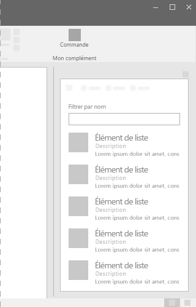

# Composant de la liste dans la structure de l?interface utilisateur d?Office

Les listes proposent une mise en page coh?rente lors de l?interaction avec des ensembles de contenu importants, m?me lorsque le contenu est principalement du texte. Les listes permettent aux utilisateurs de parcourir facilement du contenu. 
  
#### Exemple : Liste dans un volet de t?ches

## Meilleures pratiques

- Terminer chaque entr?e d?une liste par un point si :
  - Toutes les entr?es sont des phrases compl?tes.
  - Une ou plusieurs entr?es contiennent un fragment et une phrase compl?te qui propose des informations suppl?mentaires.
  - Toutes les entr?es compl?tent la phrase d?introduction ou le fragment.
- Listes cons?cutives distinctes dans une page avec un titre.

## Variantes

|**Variation**|**Description**|**Exemple**|
|:------------|:--------------|:----------|
|**Liste de la grille**|? utiliser lorsque des informations d?taill?es sont requises avec chaque ?l?ment de liste.| |
|**Liste d??l?ments ? hauteur variable**|? utiliser lorsque des images et des textes importants sont n?cessaires.| |

## Impl?mentation

Pour plus d?informations, reportez-vous ? [Liste](https://dev.office.com/fabric#/components/list) et [D?marrer avec un exemple de code React de la structure](https://github.com/OfficeDev/Word-Add-in-GettingStartedFabricReact).

## Voir aussi

- [Mod?les de conception UX](https://github.com/OfficeDev/Office-Add-in-UX-Design-Patterns-Code)
- [Office UI Fabric dans des compl?ments Office](office-ui-fabric.md)
