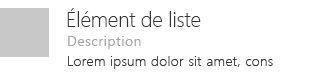
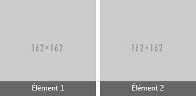

# Composant de la liste dans la structure de l’interface utilisateur d’Office

Les listes proposent une mise en page cohérente lors de l’interaction avec des ensembles de contenu importants, même lorsque le contenu est principalement du texte. Les listes permettent aux utilisateurs de parcourir facilement du contenu. 
  
#### Exemple : Liste dans un volet de tâches

 

 

## Meilleures pratiques

- Terminer chaque entrée d’une liste par un point si :
  - Toutes les entrées sont des phrases complètes.
  - Une ou plusieurs entrées contiennent un fragment et une phrase complète qui propose des informations supplémentaires.
  - Toutes les entrées complètent la phrase d’introduction ou le fragment.
- Listes consécutives distinctes dans une page avec un titre.

 

## Variantes

|**Variation**|**Description**|**Exemple**|
|:------------|:--------------|:----------|
|**Liste de la grille**|À utiliser lorsque des informations détaillées sont requises avec chaque élément de liste.| |
|**Liste d’éléments à hauteur variable**|À utiliser lorsque des images et des textes importants sont nécessaires.| |

 

## Implémentation

Pour plus d’informations, voir [Liste](https://dev.office.com/fabric#/components/list) et [Démarrer avec un exemple de code React de la structure](https://github.com/OfficeDev/Word-Add-in-GettingStartedFabricReact).

## Ressources supplémentaires

- [Modèles de conception UX](https://github.com/OfficeDev/Office-Add-in-UX-Design-Patterns-Code)

- [Office UI Fabric dans des compléments Office](office-ui-fabric.md)
