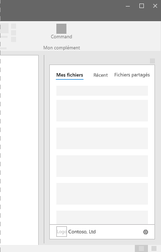

# Volets Office dans les compléments Office
 
Les volets des tâches sont des surfaces d’interface qui s’affichent généralement sur le côté droit de la fenêtre dans Word, PowerPoint, Excel et Outlook. Les volets des tâches permettent aux utilisateurs d’accéder aux contrôles d’interface qui exécutent le code pour modifier des documents ou des e-mails, ou afficher des données d’une source de données. Utilisez les volets des tâches lorsque vous n’avez pas besoin d’incorporer des fonctionnalités directement dans le document.

*Figure 1. Mise en page type du volet Office*

## Meilleures pratiques

|**À faire**|**À ne pas faire**|
|:-----|:--------|
|<ul><li>Inclure le nom de votre complément dans le titre.</li></ul>|<ul><li>Ne pas ajouter le nom de votre société au titre.</li></ul>|
|<ul><li>Utiliser des noms descriptifs courts dans le titre.</li></ul>|<ul><li>Ne pas ajouter de chaînes telles que « Complément », « pour Word » ou « pour Office » au titre de votre complément.</li></ul>|
|<ul><li>Inclure un élément de navigation ou de commande comme la CommandBar ou le Pivot en haut de votre complément.</li></ul>||
|<ul><li>Inclure un élément de la marque tel que le BrandBar en bas de votre complément, sauf si votre complément doit être utilisé dans Outlook.</li></ul>||

## Variantes

Les images suivantes montrent les différentes tailles de volet des tâches avec le ruban Office à une résolution de 1 366 x 768. Pour Excel, l’espace vertical supplémentaire est requis pour s’adapter à la barre de formule.  

*Figure 2. Tailles de volet des tâches du bureau Office 2016*

- Excel - 320 x 455
- PowerPoint - 320 x 531
- Word - 320 x 531
- Outlook - 348 x 535

 

*Figure 3. Tailles de volet des tâches Office 365*

- Excel - 350 x 378
- PowerPoint - 348 x 391
- Word - 329 x 445
- Outlook Web App - 320 x 570

## Menu Caractéristique

Les menus Caractéristique peuvent entraver les éléments de navigation et de commande se trouvant en haut à droite du complément. Voici les dimensions actuelles du menu Caractéristique sur Windows et Mac.

Pour Windows, le menu Caractéristique mesure 12 x 32 pixels, comme illustré.

*Figure 4. Menu Caractéristique sur Windows*

Pour Mac, le menu Caractéristique mesure 26 x 26 pixels, mais flotte à 8 pixels de la droite et à 6 pixels du haut, ce qui permet d’augmenter l’espace à 34 x 32 pixels, comme illustré.

*figure 5. Menu Caractéristique sur Mac*

## Implémentation

Pour consulter un exemple qui implémente un volet des tâches, reportez-vous à [Excel Add-in JS WoodGrove Expense Trends](https://github.com/OfficeDev/Excel-Add-in-WoodGrove-Expense-Trends) sur GitHub. 

## Voir aussi

- [Office UI Fabric dans des compléments Office](office-ui-fabric.md) 
- [Modèles de conception de l’expérience utilisateur pour les compléments Office](https://github.com/OfficeDev/Office-Add-in-UX-Design-Patterns-Code)

