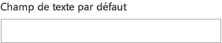

# Composant TextField dans Office UI Fabric

Les champs de texte permettent aux utilisateurs de saisir du texte. Ils sont généralement utilisés pour capturer une seule ligne de texte mais peuvent être configurés pour capturer plusieurs lignes de texte. Le texte s’affiche à l’écran dans un format simple et uniforme.
  
#### Exemple : TextField dans un volet Office

## Meilleures pratiques

|**À faire**|**À ne pas faire**|
|:------------|:--------------|
|Utiliser des champs de texte pour accepter la saisie de données sur un formulaire ou une page.|Ne pas utiliser de champs de texte pour rendre une copie de base dans un élément de corps d’une page.|
|Étiqueter les champs de texte avec des noms utiles.|Ne pas utiliser de champs de texte pour saisir une date ou une heure. Utiliser plutôt un sélecteur de date et heure.|
|Utiliser un texte de l’espace réservé concis pour spécifier le contenu qui doit être saisi.|Ne pas utiliser de champs de texte si des options d’entrée valides peuvent être prédéfinies. Utiliser plutôt une liste déroulante.|
|Fournir tous les états appropriés pour les champs de texte (statique, pointage, focus, engagé, non disponible, erreur).||
|Marquer clairement les champs obligatoires et facultatifs.||
|Si possible, mettre en forme les champs de texte en fonction du format de données attendu. Par exemple, lors de la capture d’un numéro de téléphone à 10 chiffres, utiliser trois champs distincts pour stocker les différentes parties du numéro de téléphone.||

## Variantes

|**Variation**|**Description**|**Exemple**|
|:------------|:--------------|:----------|
|**Default TextField (champ de texte par défaut)**|À utiliser comme champ de texte par défaut.| |
|**Disabled TextField (champ de texte désactivé)**|À utiliser lorsque le champ de texte est désactivé.| |
|**Required TextField (champ de texte obligatoire)**|À utiliser lorsque le champ de texte est obligatoire.| |
|**TextField with a placeholder (champ de texte avec un espace réservé)**|À utiliser lorsqu’un texte de l’espace réservé est nécessaire.| |
|**TextField with multiple lines (champ de texte avec plusieurs lignes)**|À utiliser lorsque plusieurs lignes de texte sont nécessaires.| |

## Implémentation

Pour plus d’informations, reportez-vous à [TextField](https://dev.office.com/fabric#/components/textfield) et [Démarrer avec un exemple de code Fabric React](https://github.com/OfficeDev/Word-Add-in-GettingStartedFabricReact).

## Voir aussi

- [Modèles de conception UX](https://github.com/OfficeDev/Office-Add-in-UX-Design-Patterns-Code)
- [Office UI Fabric dans des compléments Office](office-ui-fabric.md)
