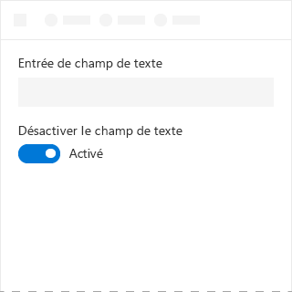
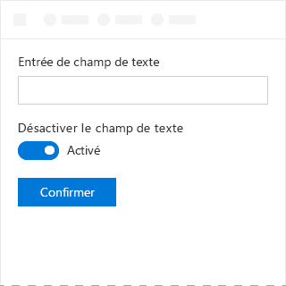

# Composant de bouton bascule dans Office UI Fabric

Les boutons bascules sont des commutateurs physiques qui activent ou d?sactivent des ?l?ments. Utilisez les boutons bascules pour pr?senter deux options qui s?excluent mutuellement (par exemple, on et off), lorsque le choix d?une option provoque une action imm?diate.
  
#### Exemple : bouton bascule dans un volet Office

## Meilleures pratiques

|**? faire**|**? ne pas faire**|
|:------------|:--------------|
|Utiliser les boutons bascule pour les param?tres binaires lorsque les modifications sont imm?diatement appliqu?es.   |Ne pas utiliser de boutons bascule si les utilisateurs doivent effectuer une ?tape suppl?mentaire avant que les modifications prennent effet.   |
|Remplacer les ?tiquettes **On** et **Off** uniquement s?il existe des ?tiquettes plus sp?cifiques ? utiliser pour un param?tre. Utiliser des ?tiquettes courtes (3 ? 4 caract?res) qui repr?sentent des oppos?s binaires.| |

## Variantes

|**Variation**|**Description**|**Exemple**|
|:------------|:--------------|:----------|
|**Enabled and checked (Activ? et s?lectionn?)**|? utiliser lorsque l??tat bascul? est actif.| |
|**Enabled and unchecked (Activ? et d?s?lectionn?)**|? utiliser lorsque l??tat bascul? est inactif.| |
|**Disabled and checked (D?sactiv? et s?lectionn?)**|? utiliser lorsque l??tat actif ne peut pas ?tre modifi?.| |
|**Disabled and unchecked (D?sactiv? et d?s?lectionn?)**|? utiliser lorsque l??tat inactif ne peut pas ?tre modifi?.| |

## Impl?mentation

Pour plus d?informations, reportez-vous ? [Bouton bascule](https://dev.office.com/fabric#/components/toggle) et [D?marrer avec un exemple de code Fabric React](https://github.com/OfficeDev/Word-Add-in-GettingStartedFabricReact).

## Voir aussi

- [Mod?les de conception UX](https://github.com/OfficeDev/Office-Add-in-UX-Design-Patterns-Code)
- [Office UI Fabric dans des compl?ments Office](office-ui-fabric.md)
