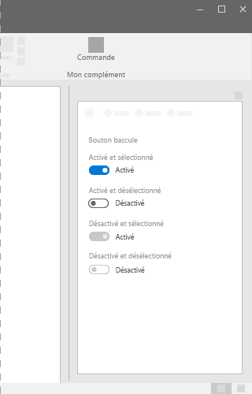

# Composant de bouton bascule dans Office UI Fabric

Les boutons bascule représentent un commutateur physique permettant d’activer ou de désactiver des éléments. Utilisez les boutons bascule pour présenter deux options qui s’excluent mutuellement (par exemple, activé et désactivé) lorsque le choix d’une option provoque une action immédiate.
  
#### Exemple : Bouton bascule dans un volet des tâches

 

## Meilleures pratiques

|**À faire**|**À ne pas faire**|
|:------------|:--------------|
|Utiliser les boutons bascule pour les paramètres binaires lorsque les modifications sont immédiatement appliquées.   |Ne pas utiliser de boutons bascule si les utilisateurs doivent effectuer une étape supplémentaire avant que les modifications prennent effet.   |
|Ne remplacer les étiquettes **On** et **Off** que s’il existe des étiquettes plus spécifiques à utiliser pour un paramètre. Utiliser des étiquettes courtes (3 à 4 caractères) qui représentent des opposés binaires.| |

## Variantes

|**Variation**|**Description**|**Exemple**|
|:------------|:--------------|:----------|
|**Enabled and checked (Activé et sélectionné)**|À utiliser lorsque l’état basculé est actif.| |
|**Enabled and unchecked (Activé et désélectionné)**|À utiliser lorsque l’état basculé est inactif.| |
|**Disabled and checked (Désactivé et sélectionné)**|À utiliser lorsque l’état actif ne peut pas être modifié.| |
|**Disabled and unchecked (Désactivé et désélectionné)**|À utiliser lorsque l’état inactif ne peut pas être modifié.| |

## Implémentation

Pour plus d’informations, voir [Bouton bascule](https://dev.office.com/fabric#/components/toggle) et [Démarrer avec un exemple de code Fabric React](https://github.com/OfficeDev/Word-Add-in-GettingStartedFabricReact).

## Ressources supplémentaires

- [Modèles de conception UX](https://github.com/OfficeDev/Office-Add-in-UX-Design-Patterns-Code)

- [Office UI Fabric dans des compléments Office](office-ui-fabric.md)
