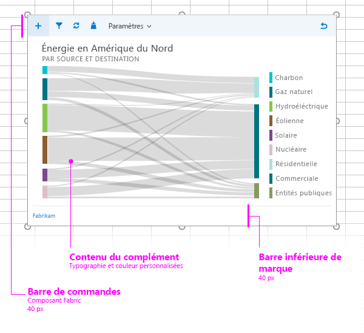

#Mise en page pour les compléments de contenu

Créez un style visuel cohérent pour vos compléments de contenu en utilisant la mise en page recommandée. Celle-ci contient les éléments suivants : 

- La barre de commandes (facultatif) : comprend des icônes ou des outils de navigation pour les utilisateurs et permet de superposer le contenu du complément. La hauteur maximale est de 80 pixels.
- Contenu du complément
- Élément de personnalisation (facultatif)

Vous pouvez également ajouter des [éléments d’interface HTML personnalisés](ui-elements.md#custom-HTML-based-UI) à votre complément de contenu.

Vous pouvez également consulter un [exemple d’utilisation d’Office UI Fabric dans des compléments Office](https://github.com/OfficeDev/Office-Add-in-Fabric-UI-Sample).

<!-- Add sample template for content add-in and individual building blocks - Command Bar, Input, layout components. -->
