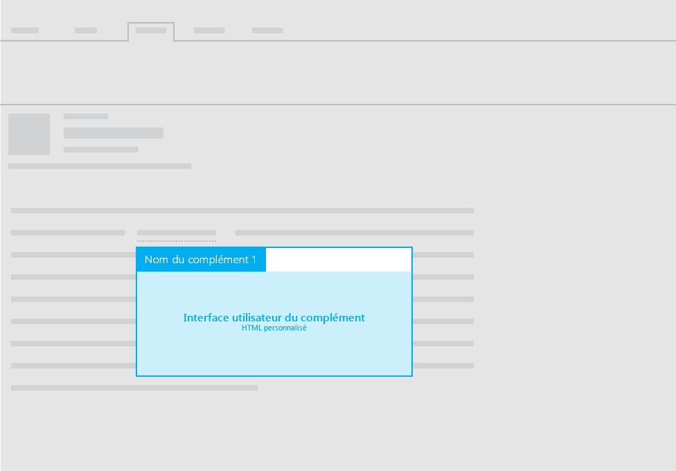

# Mises en page pour les compléments de messagerie

Vous pouvez utiliser l’une des mises en page suivantes pour les compléments de messagerie :

- Volet de tâches
- Contextuel
- Fonctions avec notifications de la barre d’informations

Pour bénéficier de conseils sur le texte de l’interface utilisateur de vos compléments, reportez-vous à la rubrique relative à la [voix Office](https://msdn.microsoft.com/fr-fr/library/office/mt484351.aspx).

## Application de volet de tâches

Pour obtenir des recommandations sur la mise en page des volets de tâches pour les compléments de messagerie, voir [Mise en page pour les compléments de volet de tâches](layout-for-task-pane-add-ins.md).

## Compléments contextuels

L’image suivante présente la mise en page recommandée pour un [complément de messagerie contextuel](https://docs.microsoft.com/fr-fr/outlook/add-ins/contextual-outlook-add-ins).

## Fonctions avec notifications de la barre d’informations

En plus d’utiliser un volet de tâches ou un volet contextuel pour afficher des éléments d’interface utilisateur HTML personnalisés dans votre complément de messagerie, vous pouvez exécuter des fonctions à l’aide de commandes. Pour afficher du texte dans l’interface utilisateur comme résultat d’une fonction, vous pouvez utiliser les notifications de la barre d’informations. Par exemple, vous pouvez utiliser une notification de la barre d’informations pour afficher les messages d’erreur ou de réussite. 

Pour plus d’informations, reportez-vous aux [commandes de complément pour la messagerie](https://docs.microsoft.com/fr-fr/outlook/add-ins/add-in-commands-for-outlook). 

## Voir aussi

- [Instructions de conception pour les compléments Office](../add-in-design.md)
