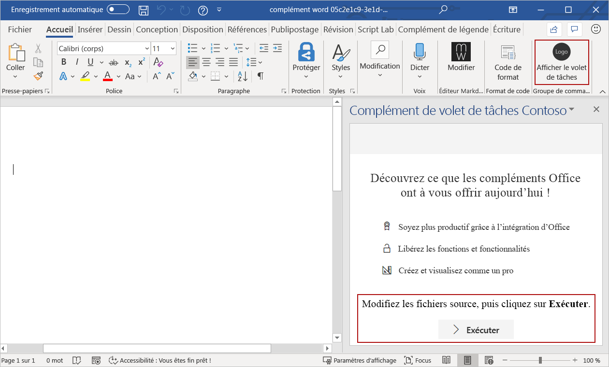
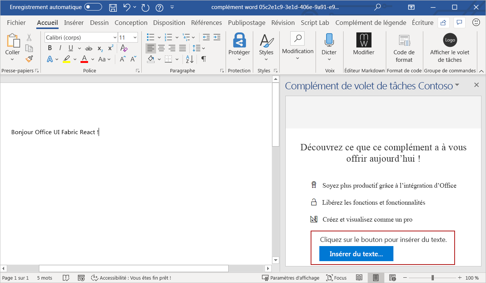

# <a name="use-office-ui-fabric-react-in-office-add-ins"></a>Utilisation d’Office UI Fabric React dans des compléments Office

Office UI Fabric est l’infrastructure frontale JavaScript permettant de créer des expériences pour Office et Office 365. Si vous créez votre complément à l’aide de React, envisagez d’utiliser Fabric React pour créer votre expérience utilisateur. Fabric fournit plusieurs composants UX basés sur React, tels que des boutons ou cases à cocher, que vous pouvez utiliser dans votre complément.

Cet article décrit la création d’un complément conçu avec la fonction React et utilise les composants Fabric React. 

> [!NOTE]
> [Fabric Core](office-ui-fabric.md#use-fabric-core-icons-fonts-colors) est inclus dans Fabric React, ce qui signifie que votre complément aura également accès à Fabric Core une fois que vous aurez effectué les étapes décrites dans cet article.

## <a name="create-an-add-in-project"></a>Création d’un projet de complément

Vous utiliserez le générateur Yeoman pour les compléments Office pour créer un projet de complément utilisant React.

### <a name="install-the-prerequisites"></a>Installez les composants requis

[!include[Yeoman generator prerequisites](../includes/quickstart-yo-prerequisites.md)]

### <a name="create-the-project"></a>Créez le projet

[!include[Yeoman generator create project guidance](../includes/yo-office-command-guidance.md)]

- **Sélectionnez un type de projet :** `Office Add-in Task Pane project using React framework`
- **Sélectionnez un type de script :** `TypeScript`
- **Comment souhaitez-vous nommer votre complément ?** `My Office Add-in`
- **Quelle application client Office voulez-vous prendre en charge ?** `Word`


Après avoir exécuté l’assistant, le générateur crée le projet et installe les composants Node de prise en charge.

[!include[Yeoman generator next steps](../includes/yo-office-next-steps.md)]

### <a name="try-it-out"></a>Essayez

1. Accédez au dossier racine du projet.

    ```command&nbsp;line
    cd "My Office Add-in"
    ```

2. Pour démarrer le serveur web local et charger indépendamment votre complément, procédez comme suit.

    > [!NOTE]
    > Les compléments Office doivent utiliser le protocole HTTPS, et non HTTP, même lorsque vous développez. Si vous êtes invité à installer un certificat après avoir exécuté une des commandes suivantes, acceptez d’installer le certificat fourni par le générateur Yeoman.

    > [!TIP]
    > Si vous testez votre complément sur Mac, exécutez la commande suivante avant de continuer. Lorsque vous exécutez cette commande, le serveur web local démarre.
    >
    > ```command&nbsp;line
    > npm run dev-server
    > ```

    - Pour tester votre complément dans Word, exécutez la commande suivante dans le répertoire racine de votre projet. Cela a pour effet de démarrer le serveur web local (s’il n’est pas déjà en cours d’exécution) et d’ouvrir Word avec votre complément chargé.

        ```command&nbsp;line
        npm start
        ```

    - Pour tester votre complément dans Word sur un navigateur, exécutez la commande suivante dans le répertoire racine de votre projet. Lorsque vous exécutez cette commande, le serveur web local démarre (s’il n’est pas déjà en cours d’exécution).

        ```command&nbsp;line
        npm run start:web
        ```

        Pour utiliser votre complément, ouvrez un nouveau document dans Word sur le web, puis chargez la version test de votre complément en suivant les instructions de l’article relatif au [chargement de version test des compléments Office dans Office sur le web](../testing/sideload-office-add-ins-for-testing.md#sideload-an-office-add-in-in-office-on-the-web).

3. Dans Word, sélectionnez l’onglet **Accueil**, puis choisissez le bouton **Afficher le volet Office** du ruban pour ouvrir le volet Office du complément. Remarquez le texte par défaut et le bouton **Exécuter** en bas du volet Office. Ensuite, vous redéfinirez ce texte et ce bouton en créant un composant React qui utilise les composants UX de Fabric React.

    


## <a name="create-a-react-component-that-uses-fabric-react"></a>Créer un composant React utilisant Fabric React

À ce stade, vous avez créé un complément très rudimentaire du volet Office standard en utilisant React. Ensuite, procédez comme suit pour créer un nouveau composant React (`ButtonPrimaryExample`) dans le projet de complément. Le composant utilise les composants `Label` et `PrimaryButton` de Fabric React.

1. Ouvrez le dossier du projet créé par le générateur Yeoman et accédez à **src\taskpane\components**.
2. Dans ce dossier, créez un fichier nommé **Button.tsx**.
3. Dans **Button.tsx**, ajoutez le code suivant pour définir le composant `ButtonPrimaryExample`.

```typescript
import * as React from 'react';
import { PrimaryButton, IButtonProps } from 'office-ui-fabric-react/lib/Button';
import { Label } from 'office-ui-fabric-react/lib/Label';

export class ButtonPrimaryExample extends React.Component<IButtonProps, {}> {
  public constructor(props) {
    super(props);
  }

  insertText = async () => {
    // In the click event, write text to the document.
    await Word.run(async (context) => {
      let body = context.document.body;
      body.insertParagraph('Hello Office UI Fabric React!', Word.InsertLocation.end);
      await context.sync();
    });
  }

  public render() {
    let { disabled } = this.props;
    return (
      <div className='ms-BasicButtonsExample'>
        <Label>Click the button to insert text.</Label>
        <PrimaryButton
          data-automation-id='test'
          disabled={ disabled }
          text='Insert text...'
          onClick={ this.insertText } />
      </div>
    );
  }
}
```

Ce code effectue les opérations suivantes :

- Fait référence à la bibliothèque React en utilisant `import * as React from 'react';`.
- Référence les composants de Fabric (`PrimaryButton`, `IButtonProps`, `Label`) utilisés pour créer `ButtonPrimaryExample`.
- Déclare le nouveau composant `ButtonPrimaryExample` en utilisant `export class ButtonPrimaryExample extends React.Component`.
- Déclare la fonction `insertText` qui gère l’événement du bouton `onClick`.
- Définit l’interface utilisateur du composant React dans la fonction `render`. Le balisage HTML utilise les composants `Label` et `PrimaryButton` de Fabric React et spécifie que lorsque l’événement `onClick` se déclenche, la fonction `insertText` s’exécute.

## <a name="add-the-react-component-to-your-add-in"></a>Ajoutez le composant React à votre complément

Ajoutez le composant `ButtonPrimaryExample` à votre complément en ouvrant **src\components\App.tsx** et en effectuant les opérations suivantes :

1. Ajoutez l’instruction importation suivante pour référencer `ButtonPrimaryExample` dans **Button.tsx**.

    ```typescript
    import {ButtonPrimaryExample} from './Button';
    ```

2. Supprimez les deux instructions d’importation suivantes.

    ```typescript
    import { Button, ButtonType } from 'office-ui-fabric-react';
    ...
    import Progress from './Progress';
    ```

3. Remplacez la fonction `render()` par défaut par le code suivant qui utilise `ButtonPrimaryExample`.

    ```typescript
    render() {
      return (
        <div className="ms-welcome">
        <Header logo="assets/logo-filled.png" title={this.props.title} message="Welcome" />
        <HeroList message="Discover what this add-in can do for you today!" items={this.state.listItems} >
          <ButtonPrimaryExample />
        </HeroList>
        </div>
      );
    }
    ```

  4. Enregistrez les modifications apportées à **App.tsx**.

## <a name="see-the-result"></a>Regardez le résultat

Dans Word, le volet Office complément se met automatiquement à jour lorsque vous enregistrez les modifications apportées à **App.tsx**. Le texte et le bouton par défaut en bas du volet Office indiquent désormais l’interface utilisateur définie par le composant `ButtonPrimaryExample`. Sélectionnez le bouton **Insérer un texte...** pour insérer du texte dans le document.



Félicitations, vous avez créé un complément de volet Office à l’aide de React et Office UI Fabric React ! 

## <a name="see-also"></a>Voir aussi

- [Office UI Fabric dans des compléments Office](office-ui-fabric.md)
- [Office UI Fabric React](https://developer.microsoft.com/fabric)
- [Modèles de conception de l’expérience utilisateur pour les compléments Office](ux-design-pattern-templates.md)
- [Démarrer avec un exemple de code Fabric React](https://github.com/OfficeDev/Word-Add-in-GettingStartedFabricReact)
