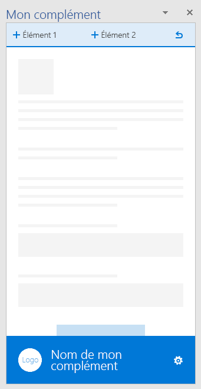
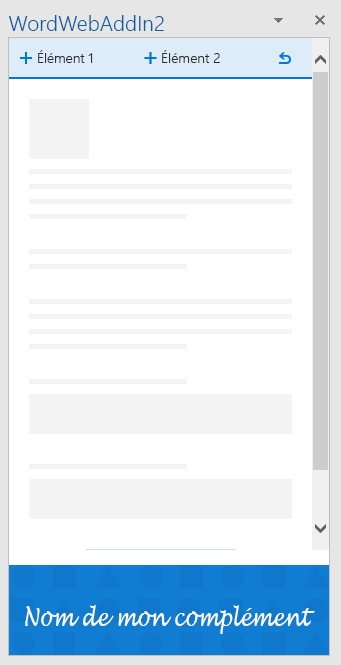
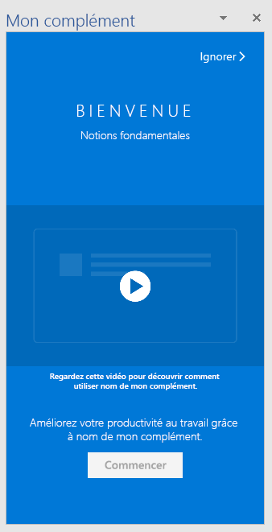
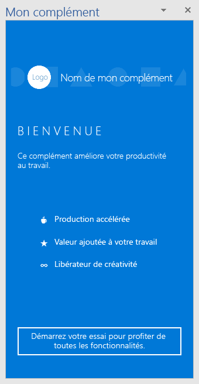
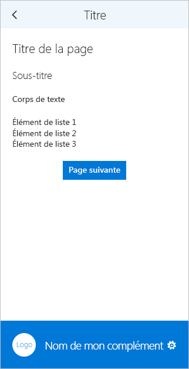
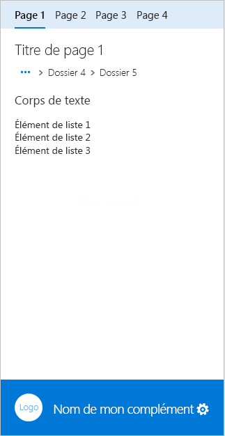
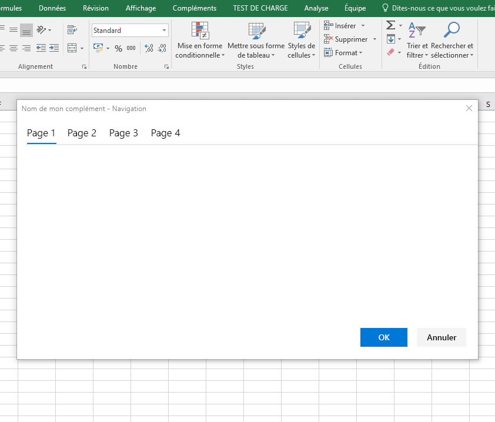
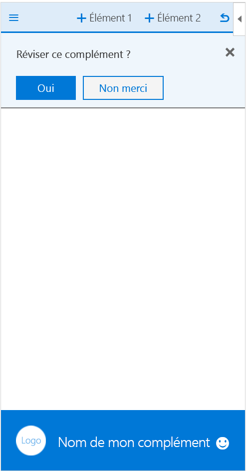
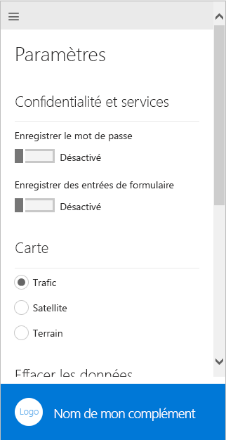
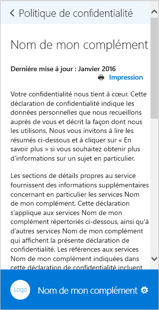

# Mod?les de conception d?exp?rience utilisateur pour les compl?ments OfficeUX design pattern templates for Office Add-ins

Le [projet de mod?les de conception de l?exp?rience utilisateur pour compl?ments Office](https://github.com/OfficeDev/Office-Add-in-UX-Design-Patterns-Code "projet de mod?les de conception de l?exp?rience utilisateur pour compl?ments Office") inclut des fichiers HTML, JavaScript et CSS que vous pouvez utiliser pour cr?er l?exp?rience utilisateur de votre compl?ment.The [UX design patterns for Office Add-ins project](https://github.com/OfficeDev/Office-Add-in-UX-Design-Patterns-Code "UX design patterns for Office Add-ins project") includes HTML, JavaScript, and CSS files that you can use to create the UX for your add-in.   

Utiliser le projet de mod?les de conception d?exp?rience utilisateur aux fins suivantes :Use the UX design patterns project to:

* Appliquer des solutions ? des sc?narios client courants.Apply solutions to common customer scenarios.
* Appliquer les meilleures pratiques en mati?re de conception.Apply design best practices.
* Incorporer les composants et styles d?[Office UI Fabric](https://dev.office.com/fabric#/get-started).Incorporate [Office UI Fabric](https://dev.office.com/fabric#/get-started) components and styles.
* Cr?er des compl?ments qui s?int?grent visuellement ? l?interface utilisateur d?Office par d?faut.Build add-ins that visually integrate with the default Office UI.  

## Utilisation des mod?les de conception UXUsing the UX design patterns

Vous pouvez utiliser le [Kit d'outils de conception de compl?ments Office](https://aka.ms/addins_toolkit) avec la [Kit d'outils de conception Fabric](https://aka.ms/fabric-toolkit) comme guide lorsque vous concevez votre propre compl?ment Office.You can use the [Office Add-ins Design Toolkit](https://aka.ms/addins_toolkit) together with the [Fabric Design Toolkit](https://aka.ms/fabric-toolkit) as a guide when you design your own Office Add-in. Vous pouvez ?galement ajouter le [code source](https://github.com/OfficeDev/Office-Add-in-UX-Design-Patterns-Code/tree/master/templates) directement ? votre projet.You can also add the [source code](https://github.com/OfficeDev/Office-Add-in-UX-Design-Patterns-Code/tree/master/templates) directly to your project.

Pour utiliser les sp?cifications afin de cr?er une maquette de votre propre interface utilisateur du compl?ment, proc?dez comme suit :To use the specifications to build a mock-up of your own add-in UI:

1. T?l?chargez les fichiers de ressources de conception et commencez ? concevoir votre propre interface utilisateur :Download design assets files and begin designing your own UI:
    * [Kit d'outils de conception de compl?ments OfficeOffice Add-ins Design Toolkit](https://aka.ms/addins_toolkit)
    * [Kit d'outils de conception FabricFabric Design Toolkit](https://aka.ms/fabric-toolkit)

2. Pour obtenir des instructions, reportez-vous aux articles suivants :Refer to the following articles for guidance:
    * Bonnes pratiques en mati?re de [conception de compl?ments Office](add-in-design.md)Best practices for [Designing your Office Add-ins](add-in-design.md)
    * [Kits d?outils Office UI FabricOffice UI Fabric Toolkits](https://developer.microsoft.com/en-us/fabric#/resources)

> [!NOTE]
> Certains mod?les UX dans le kit d'outils de conception de compl?ments ne correspondent pas aux mod?les de conception UX d?taill?s ci-dessous.Some UX patterns in the Add-ins Design Toolkit do not match the UX design patterns detailed below. Nous pr?voyons de publier une documentation mise ? jour qui s'alignera sur le kit d'outils.We're planning to release updated documentation that will align with the toolkit.

Pour ajouter le code source, proc?dez comme suit :To add the source code:

1. Clonez le [r?f?rentiel du projet de mod?les de conception de l?exp?rience utilisateur pour les compl?ments Office](https://github.com/OfficeDev/Office-Add-in-UX-Design-Patterns-Code "projet de mod?les de conception de l?exp?rience utilisateur pour les compl?ments Office").Clone the [UX design patterns for Office Add-ins project repo](https://github.com/OfficeDev/Office-Add-in-UX-Design-Patterns-Code "UX design patterns for Office Add-ins project").
2. Copiez le [dossier des composants](https://github.com/OfficeDev/Office-Add-in-UX-Design-Pattern-Code/tree/master/assets) ainsi que le dossier de code pour le mod?le individuel que vous choisissez dans votre projet de compl?ment.Copy the [assets folder](https://github.com/OfficeDev/Office-Add-in-UX-Design-Pattern-Code/tree/master/assets), and the code folder for the individual pattern you choose to your add-in project.  
3. Incorporez le mod?le individuel ? votre compl?ment. Par exemple :Incorporate the individual pattern into your add-in. For example:
    - Modifiez l?emplacement source ou l?URL de commande de compl?ment dans le manifeste.Edit the source location or add-in command URL in the manifest.
    - Utilisez le mod?le de conception d?exp?rience utilisateur en tant que mod?le pour d?autres pages.Use the UX design pattern as a template for other pages.
    - Lien vers ou ? partir du mod?le de conception d?exp?rience utilisateur.Link to or from the UX design pattern.

> [!NOTE]
> certaines sp?cifications de mod?le d?exp?rience utilisateur ne correspondent pas au code source.Some UX pattern specifications do not match the source code. Nous mettons tout en ?uvre pour aligner toutes les ressources.We're working hard to bring all assets into alignment. Notez ?galement que certaines sp?cifications sont pr?sent?es comme archiv?es.Also notice that some specifications are presented as archived. Nous ?valuons la valeur de ces sp?cifications archiv?es sur la plateforme.We're assessing these archived specifications for value to the platform. Chaque mod?le vise ? repr?senter un mod?le unique et d?interaction.Each pattern aims to represent a unique template and pattern of interaction. Les mod?les ne doivent pas se chevaucher et doivent ?tre bien diff?renci?s des composants Office Fabric UI.The patterns should not overlap with each other and should be well differentiated from Office Fabric UI components.

## Types de mod?les de conception de l?exp?rience utilisateurTypes of UX design patterns
### Pages g?n?riquesGeneric pages

Les mod?les de page g?n?rique peuvent ?tre appliqu?s ? n?importe quelle page de votre compl?ment et n?ont pas d?usage particulier. L?un des mod?les de premi?re utilisation constitue un exemple de page ? usage sp?cifique. La liste suivante d?crit les pages g?n?riques disponibles :Generic page templates can be applied to any page in your add-in and don't have a special purpose. An example of a special purpose page, would be any of the first-run patterns. The following list describes the generic pages available:

* **Page d?accueil** : une page de compl?ment standard, par exemple la page sur laquelle un utilisateur est renvoy? apr?s une premi?re exp?rience d?utilisation ou un processus de connexion.**Landing page** - A standard add-in page, for example the page a user lands on after a first-run experience or sign-in process. 
    * En savoir plus sur les instructions relatives ? l?adoption du [langage de conception Office](add-in-design-language.md) dans votre compl?ment.Learn about guidelines for adopting the [Office design language](add-in-design-language.md) in your add-in.
    * [Code de la page d?accueilLanding page code](https://github.com/OfficeDev/Office-Add-in-UX-Design-Patterns-Code/tree/master/templates/generic/landing-page)
* **Image de marque dans la barre de marque** - La page d?accueil avec une image dans le pied de page qui repr?sente votre marque.**Brand image in brand bar** - The landing page with an image in the footer that represents your brand. 
    * [Sp?cification de la barre de marqueBrand bar specification](https://github.com/OfficeDev/Office-Add-in-UX-Design-Patterns/blob/master/patterns/brand-bar.md)
    * [Code de la barre de marqueBrand bar code](https://github.com/OfficeDev/Office-Add-in-UX-Design-Patterns-Code/tree/master/templates/generic/brand-bar)

<table>
 <tr><th>AccueilLanding</th><th>Barre de marqueBrand Bar</th></tr>
 <tr><td></td>
<td></td></tr>
 </table>
 
### Premi?re exp?rience d?utilisationFirst-run experience

Il s?agit de l?exp?rience v?cue par un utilisateur lorsqu?il ouvre votre compl?ment pour la premi?re fois. Les mod?les de mod?le de conception de premi?re utilisation suivants sont disponibles :A first-run experience is the experience a user has when they open your add-in for the first time. The following first-run design pattern templates are available: 

* **?tapes de d?marrage** - Permet aux utilisateurs ayant une liste d??tapes ? suivre de commencer ? utiliser votre compl?ment.**Steps to start** - Provides users with an ordered list of steps to perform to get started using your add-in. 
    * [?tapes de d?marrage d?une sp?cification](https://github.com/OfficeDev/Office-Add-in-UX-Design-Patterns/blob/master/assets/archived-patterns/fre_stepsToStart.pdf) (Ce mod?le de conception d?exp?rience utilisateur a ?t? archiv?.[Steps to start specification](https://github.com/OfficeDev/Office-Add-in-UX-Design-Patterns/blob/master/assets/archived-patterns/fre_stepsToStart.pdf) (This UX design pattern has been archived. Comme nous ?valuons sa valeur, reportez-vous ? [Sp?cification sur la valeur de la premi?re ex?cution](https://github.com/OfficeDev/Office-Add-in-UX-Design-Patterns/blob/master/patterns/value-placemat.md).)As we assess its value, see [First-Run Value specification](https://github.com/OfficeDev/Office-Add-in-UX-Design-Patterns/blob/master/patterns/value-placemat.md).)  
    * [Code des ?tapes de d?marrageSteps to start code](https://github.com/OfficeDev/Office-Add-in-UX-Design-Patterns-Code/tree/master/templates/first-run/instruction-step)
* **Valeur** - Communique la proposition de valeur de votre compl?ment.**Value** - Communicates your add-in's value proposition.
    * [Sp?cification de la valeurValue specification](https://github.com/OfficeDev/Office-Add-in-UX-Design-Patterns/blob/master/patterns/value-placemat.md)
    * [Code de la valeurValue code](https://github.com/OfficeDev/Office-Add-in-UX-Design-Patterns-Code/tree/master/templates/first-run/value-placemat)
* **Vid?o** - Montre une vid?o aux utilisateurs avant qu?ils commencent ? utiliser votre compl?ment.**Video** - Shows users a video before they start using your add-in.
    * [Sp?cification de la vid?oVideo specification](https://github.com/OfficeDev/Office-Add-in-UX-Design-Patterns/blob/master/patterns/video-placemat.md)
    * [Code de la vid?oVideo code](https://github.com/OfficeDev/Office-Add-in-UX-Design-Patterns-Code/tree/master/templates/first-run/video-placemat)
* **Proc?dure pas ? pas** : explique aux utilisateurs une s?rie de fonctionnalit?s ou d?informations avant qu?ils commencent ? utiliser le compl?ment.**Walkthrough** - Takes users through a series of features or information before they start using the add-in.
    * [Sp?cification de Carrousel](https://github.com/OfficeDev/Office-Add-in-UX-Design-Patterns/blob/master/patterns/carousel.md) (Ce mod?le de conception d?exp?rience utilisateur a ?t? renomm? ? Carrousel ?.[Carousel specification](https://github.com/OfficeDev/Office-Add-in-UX-Design-Patterns/blob/master/patterns/carousel.md) (Note that this UX design pattern has been renamed to "Carousel." Les anciennes sp?cifications le d?signaient comme ? Panneau de pagination ?.Former specifications refered to it as a "Paging Panel." Les ressources de code le d?signe comme ? Proc?dure pas ? pas pour la premi?re ex?cution ?.Code assets refer to it as a "First-run Walkthrough." 
    * [Code de la proc?dure pas ? pasWalkthrough code](https://github.com/OfficeDev/Office-Add-in-UX-Design-Patterns-Code/tree/master/templates/first-run/walkthrough)

[AppSource](https://docs.microsoft.com/en-us/office/dev/store/use-the-seller-dashboard-to-submit-to-the-office-store) dispose d?un syst?me qui g?re les versions d??valuation d?un compl?ment, mais si vous souhaitez contr?ler l?interface utilisateur relative ? l?exp?rience d??valuation de votre compl?ment, utilisez les mod?les suivants :[AppSource](https://docs.microsoft.com/en-us/office/dev/store/use-the-seller-dashboard-to-submit-to-the-office-store) has a system that manages trial versions of an add-in, but if you want to control the UI of the trial experience for your add-in, use the following patterns:

* **Version d??valuation** - Explique aux utilisateurs comment utiliser la version d??valuation de votre compl?ment.**Trial** - Shows users how to get started with a trial version of your add-in.
    * [Sp?cification d??valuation](https://github.com/OfficeDev/Office-Add-in-UX-Design-Patterns/blob/master/assets/archived-patterns/fre_trialVersion.pdf) (Ce mod?le de conception d?exp?rience utilisateur a ?t? archiv?.[Trial specification](https://github.com/OfficeDev/Office-Add-in-UX-Design-Patterns/blob/master/assets/archived-patterns/fre_trialVersion.pdf) (This UX design pattern has been archived. Comme nous ?valuons sa valeur, reportez-vous ? ce PDF.)As we assess its value, refer to this PDF.)
    * [Code de la version d??valuationTrial code](https://github.com/OfficeDev/Office-Add-in-UX-Design-Patterns-Code/tree/master/templates/first-run/trial-placemat)
* **Fonctionnalit? d??valuation** - Informe les utilisateurs que la fonctionnalit? qu?ils tentent d?utiliser n?est pas disponible dans la version d??valuation du compl?ment. Par ailleurs, si votre compl?ment est gratuit, mais qu?il comporte une fonctionnalit? qui n?cessite un abonnement, envisagez d?utiliser ce mod?le. Vous pouvez ?galement utiliser ce mod?le pour offrir une exp?rience avec une version ant?rieure apr?s qu?une p?riode d??valuation est termin?e.**Trial feature** - Advises users that the feature they are trying to use is not available in the trial version of the add-in. Alternatively, if your add-in is free but it includes a feature that requires a subscription, consider using this pattern. You might also use this pattern to provide a downgraded experience after a trial has ended.
    * [Sp?cification de la fonctionnalit? d??valuation](https://github.com/OfficeDev/Office-Add-in-UX-Design-Patterns/blob/master/assets/archived-patterns/fre_trialFeature.pdf) (Ce mod?le de conception d?exp?rience utilisateur a ?t? archiv?.[Trial feature specification](https://github.com/OfficeDev/Office-Add-in-UX-Design-Patterns/blob/master/assets/archived-patterns/fre_trialFeature.pdf) (This UX design pattern has been archived. Comme nous ?valuons sa valeur, reportez-vous ? ce PDF.)As we assess its value, refer to this PDF.)
    * [Code de la fonctionnalit? d??valuationTrial feature code](https://github.com/OfficeDev/Office-Add-in-UX-Design-Patterns-Code/tree/master/templates/first-run/trial-placemat-feature)

> [!IMPORTANT]
> Si vous d?cidez de g?rer votre propre version d??valuation et de ne pas utiliser AppSource pour g?rer la version d??valuation, assurez-vous que vous incluez la balise **Un autre achat peut ?tre requis** dans les notes de test du service Mon tableau de bord vendeur.If you decide to manage your own trial, and not use AppSource to manage the trial, make sure to include the **Additional purchase may be required** tag in the testing notes in the seller dashboard.

D?terminez s?il convient de montrer la vid?o sur la premi?re exp?rience d?utilisation une ou plusieurs fois (tout d?pend de son importance pour votre sc?nario). Par exemple, si les utilisateurs utilisent votre compl?ment r?guli?rement, ils peuvent oublier comment l?utiliser. Il peut ?tre utile de consulter la premi?re exp?rience d?utilisation plusieurs fois.Consider whether showing users the first-run experience once or many times is important to your scenario. For example, if users use your add-in periodically, they might forget how to use it, and it might be helpful to see the first-run experience more than once. 

 <table>
 <tr><th>?tapes de d?marrageSteps to Start</th><th>ValeurValue</th><th>Vid?oVideo</th></tr>
 <tr>
<td></td>
<td></td>
<td></td></tr>
 </table>

 <table>
 <tr><th>Premi?re page de la proc?dure pas ? pasWalkthrough first page</th><th>Version d??valuationTrial</th><th>Fonctionnalit? d??valuationTrial feature</th></tr>
 <tr>
<td></td>
<td></td>
<td></td></tr>
 </table> 

### NavigationNavigation

Les utilisateurs doivent naviguer entre les diff?rentes pages de votre compl?ment. Les mod?les de navigation suivants indiquent diff?rentes options que vous pouvez utiliser afin d?organiser les pages et les commandes de votre compl?ment.Users need to navigate between the different pages of your add-in. The following navigation templates show different options you can use to organize pages and commands in your add-in.

* **Bouton Page pr?c?dente et Page suivante** - Affiche un volet Office avec les boutons Page pr?c?dente et Page suivante. Utilisez ce mod?le pour vous assurer que les utilisateurs suivent une s?rie d??tapes ordonn?es.**Back button and Next page** - Shows a task pane with Back and Next page buttons. Use this pattern to ensure users follow an ordered series of steps.
    * [Sp?cification des boutons Page pr?c?dente et Page suivanteBack Button and Next Page specification](https://github.com/OfficeDev/Office-Add-in-UX-Design-Patterns/blob/master/patterns/back-button.md)
    * [Code des boutons Page pr?c?dente et Page suivanteBack Button and Next Page code](https://github.com/OfficeDev/Office-Add-in-UX-Design-Patterns-Code/tree/master/templates/navigation/back-button) 
* **Navigation** - Affiche un menu, commun?ment appel? menu hamburger, avec les ?l?ments de menu de la page dans un volet Office.**Navigation** - Shows a menu, commonly referred to as the hamburger menu, with page menu items in a task pane. 
    * [Sp?cification de la navigationNavigation specification](https://github.com/OfficeDev/Office-Add-in-UX-Design-Patterns/blob/master/patterns/contextual-menu.md)
    * [Code de la navigationNavigation code](https://github.com/OfficeDev/Office-Add-in-UX-Design-Patterns-Code/tree/master/templates/navigation/navigation) 
* **Navigation ? l?aide de commandes** - Affiche le menu hamburger avec les boutons de commande (ou d?action) dans un volet Office. Utilisez ce mod?le lorsque vous voulez fournir des options de navigation et de commande ensemble.**Navigation with commands** - Shows the hamburger menu with command (or action) buttons in a task pane. Use this pattern when you want to provide navigation and command options together. 
    * [Sp?cification de la navigation ? l?aide de commandesNavigation with commands specification](https://github.com/OfficeDev/Office-Add-in-UX-Design-Patterns/blob/master/patterns/command-bar.md)
    * [Code de la navigation ? l?aide de commandesNavigation with commands code](https://github.com/OfficeDev/Office-Add-in-UX-Design-Patterns-Code/tree/master/templates/navigation/navigation-commands)
* **Tableau crois? dynamique** - Affiche la navigation du tableau crois? dynamique dans un volet Office. Utilisez la navigation du tableau crois? dynamique pour permettre aux utilisateurs de naviguer entre les diff?rents contenus.**Pivot** - Shows Pivot navigation inside of a task pane. Use pivot navigation to allow users to navigate between different content.
    * [Sp?cification du tableau crois? dynamiquePivot specification](https://github.com/OfficeDev/Office-Add-in-UX-Design-Patterns/blob/master/patterns/pivot.md)
    * [Code du tableau crois? dynamiquePivot code](https://github.com/OfficeDev/Office-Add-in-UX-Design-Patterns-Code/tree/master/templates/navigation/pivot)
* **Barre d?onglets** - Affiche la navigation ? l?aide de boutons avec du texte et des ic?nes verticalement empil?s. Utiliser la barre d?onglets pour permettre la navigation ? l?aide des onglets avec des titres courts et explicites.**Tab bar** - Shows navigation using buttons with vertically stacked text and icons. Use the tab bar to provide navigation using tabs with short and descriptive titles.
    * [Sp?cification de la barre d?ongletsTab bar specification](https://github.com/OfficeDev/Office-Add-in-UX-Design-Patterns/blob/master/patterns/tab-bar.md)
    * [Code de la barre d?ongletsTab bar code](https://github.com/OfficeDev/Office-Add-in-UX-Design-Patterns-Code/tree/master/templates/navigation/tab-bar) 

<table>
<tr><th>Bouton Pr?c?dentBack button</th><th>NavigationNavigation</th><th>Navigation ? l?aide de commandesNavigation with commands</th></tr>
<tr>
    <td>
        
    </td>
    <td>
        
    </td>
    <td>
        
    </td>
</tr>
 </table>

<table>
<tr><th>PivotPivot</th><th>Barre d?ongletsTab bar</th></tr>
<tr><td></td>
<td></td>
</tr>
 </table>

### NotificationsNotifications

Votre compl?ment peut avertir les utilisateurs d??v?nements, tels qu?une erreur, ou de l??tat d?avancement d?un ?l?ment de plusieurs fa?ons. Les mod?les de notification suivants sont disponibles :Your add-in can notify users of events, such as errors, or of progress in a variety of ways. The following notification templates are available: 

* **Bo?te de dialogue incorpor?e** - Affiche une bo?te de dialogue dans le volet des t?ches qui vous fournit des informations et, ?ventuellement, une exp?rience interactive, ? l?aide des boutons ou d?autres commandes. Pensez ? en utiliser une pour inviter un utilisateur ? confirmer une action. Utiliser le mod?le de bo?te de dialogue incorpor?e lorsque vous souhaitez conserver l?exp?rience utilisateur dans le volet Office.**Embedded dialog box** - Shows a dialog box inside the task pane that provides information and, optionally, an interactive experience, using buttons or other controls. Consider using one to prompt a user to confirm an action. Use the Embedded dialog pattern when you want to keep the user experience in the task pane.
    * [Sp?cification de la bo?te de dialogue incorpor?eEmbedded dialog box specification](https://github.com/OfficeDev/Office-Add-in-UX-Design-Patterns/blob/master/patterns/embedded-dialog.md)
    * [Code de la bo?te de dialogue incorpor?eEmbedded dialog box code](https://github.com/OfficeDev/Office-Add-in-UX-Design-Patterns-Code/tree/master/templates/notifications/embedded-dialog)
* **Message incorpor?** - Indique l??chec, la r?ussite ou des informations, et peut appara?tre ? un emplacement sp?cifi? dans le volet Office. Par exemple, si un utilisateur entre une adresse de messagerie incorrecte dans une zone de texte, un message d?erreur appara?t juste en dessous de la zone de texte.**Inline message** - Indicates error, success, or information, and can appear at a specified location in the task pane. For example, if a user enters an incorrectly formatted email address in a text box, an error message appears just below the text box. 
    * [Sp?cification d?un message incorpor?](https://github.com/OfficeDev/Office-Add-in-UX-Design-Patterns/blob/master/assets/archived-patterns/notification_inlineMessage.pdf) (Ce mod?le de conception d?exp?rience utilisateur a ?t? archiv?.[Inline message specification](https://github.com/OfficeDev/Office-Add-in-UX-Design-Patterns/blob/master/assets/archived-patterns/notification_inlineMessage.pdf) (This UX design pattern has been archived. Comme nous ?valuons sa valeur, reportez-vous ? ce PDF.)As we assess its value, refer to this PDF.)
    * [Code du message incorpor?Inline message code](https://github.com/OfficeDev/Office-Add-in-UX-Design-Patterns-Code/tree/master/templates/notifications/inline-message)
* **Banni?re de message** - Fournit des informations et, ?ventuellement, des instructions dans une banni?re qui peut ?tre r?duite ? une seule ligne, d?velopp?e en plusieurs lignes ou masqu?e. Utilisez des banni?res de message pour signaler une mise ? jour du service ou donner un conseil utile lorsque le compl?ment d?marre.**Message banner** - Provides information and, optionally, a simple call to action, in a banner that can be collapsed to a single line, expanded to multiple lines, or dismissed. Use message banners to report a service update or a helpful tip when the add-in starts. 
    * [Sp?cification de banni?re de message](https://github.com/OfficeDev/Office-Add-in-UX-Design-Patterns/blob/master/assets/archived-patterns/message_bar.pdf) (Ce mod?le de conception d?exp?rience utilisateur a ?t? archiv?.[Message banner specification](https://github.com/OfficeDev/Office-Add-in-UX-Design-Patterns/blob/master/assets/archived-patterns/message_bar.pdf) (This UX design pattern has been archived. Comme nous ?valuons sa valeur, reportez-vous ? ce PDF.)As we assess its value, refer to this PDF.)
    * [Code de la banni?re de messageMessage banner code](https://github.com/OfficeDev/Office-Add-in-UX-Design-Patterns-Code/tree/master/templates/notifications/message-banner)
* **Barre de progression** - Indique la progression d?un processus long et synchrone, tel qu?une t?che de configuration qui doit ?tre termin?e pour que l?utilisateur puisse effectuer d?autres actions. Il s?agit d?une page distincte interstitielle qui met en ?vidence la marque du compl?ment. Utilisez une barre de progression quand le processus peut envoyer des notifications pour indiquer la progression de la t?che dans le compl?ment.**Progress bar** - Indicates the progress of a long-running, synchronous process, such as a configuration task that must complete before the user can take any further action. It is a separate interstitial page that also reinforces the add-in brand. Use a progress bar when the process can send periodic measures of how far along it is back to the add-in.
    * [Sp?cification de la barre de progressionProgress bar specification](https://github.com/OfficeDev/Office-Add-in-UX-Design-Patterns/blob/master/patterns/progress-indicator.md)
    * [Code de la barre de progressionProgress bar code](https://github.com/OfficeDev/Office-Add-in-UX-Design-Patterns-Code/tree/master/templates/notifications/progress-bar)
* **Bouton fl?ch?** - Indique qu?un processus synchrone long est lanc?, mais ne fournit aucune indication sur son ?tat d?avancement. Il s?agit d?une page distincte interstitielle qui met en ?vidence la marque du compl?ment. Utilisez un bouton fl?ch? quand le compl?ment ne peut pas indiquer avec pr?cision la progression du processus.**Spinner** - Indicates that a long-running, synchronous process is underway, but provides no indication of how far along it is. It is a separate interstitial page that also reinforces the add-in brand. Use a spinner when the add-in cannot know reliably how far along a process is. 
    * [Sp?cification du bouton fl?ch?Spinner specification](https://github.com/OfficeDev/Office-Add-in-UX-Design-Patterns/blob/master/patterns/spinner.md)
    * [Code du bouton fl?ch?Spinner code](https://github.com/OfficeDev/Office-Add-in-UX-Design-Patterns-Code/tree/master/templates/notifications/spinner)
* **Annonce** - Fournit un bref message qui dispara?t au bout de quelques secondes. Comme il se peut que l?utilisateur ne voie pas le message, utilisez une annonce uniquement pour les informations non importantes. Utilisez une annonce pour informer les utilisateurs d?un ?v?nement dans un syst?me distant, tel que la r?ception d?un message ?lectronique.**Toast** - Provides a brief message that fades away after a few seconds. Because the user might not see the message, use toast only for nonessential information. It is a good choice for notifying users of an event in a remote system, such as the receipt of an email.
    * [Sp?cification de l?annonceToast specification](https://github.com/OfficeDev/Office-Add-in-UX-Design-Patterns/blob/master/patterns/toast.md)
    * [Code de l?annonceToast code](https://github.com/OfficeDev/Office-Add-in-UX-Design-Patterns-Code/tree/master/templates/notifications/toast)

 <table>
 <tr><th>Bo?te de dialogue incorpor?eEmbedded dialog</th><th>Message incorpor?Inline message</th><th>Banni?re de messageMessage banner</th></tr>
 <tr><td></td>
<td></td>
<td></td></tr>
 </table>

 <table>
 <tr><th>Barre de progressionProgress bar</th><th>Bouton fl?ch?Spinner</th><th>AnnonceToast</th></tr>
 <tr><td></td>
<td></td>
<td></td></tr>
 </table>
 

### Composants g?n?rauxGeneral components

Les ?l?ments suivants constituent des composants g?n?raux que vous pouvez utiliser avec vos compl?ments dans diff?rents sc?narios.The following are general components that you can use in your add-ins in a variety of scenarios.  

#### Bo?tes de dialogue clientClient dialog boxes

Les bo?tes de dialogue client fournissent aux utilisateurs un autre moyen de travailler avec votre compl?ment en dehors d?un volet Office. Les mod?les de bo?te de dialogue suivants sont disponibles :Client dialog boxes provide another way for users to work with your add-in outside of a task pane. The following dialog box templates are available:

* **Bo?te de dialogue de rampe de type** - Affiche une bo?te de dialogue avec du contenu textuel. Utilisez la bo?te de dialogue de rampe de type pour transmettre des informations d?taill?es aux utilisateurs.**Typeramp dialog box** - Shows a dialog box with textual content. Use the typeramp dialog to display elaborative information to users. 
    * Apprenez-en davantage sur la conception de [bo?tes de dialogue dans les compl?ments Office](dialog-boxes.md). Suivez ?galement nos recommandations concernant la [typographie dans les compl?ments Office](add-in-design-language.md#typography).Learn about designing [dialog boxes in Office Add-ins](dialog-boxes.md). Also follow our guidelines for [Typography in Office Add-ins](add-in-design-language.md#typography).
    * [Code de la bo?te de dialogue de rampe de typeTyperamp dialog box code](https://github.com/OfficeDev/Office-Add-in-UX-Design-Patterns-Code/tree/master/templates/dialog/typeramp)
* **Bo?te de dialogue d?alerte** - Affiche un message d?alerte avec des informations importantes, comme les erreurs ou les notifications, aux utilisateurs.**Alert dialog box** - Shows an alert box with important information, such as errors or notifications, to users.  
    * [Sp?cification de bo?te de dialogue d?alerte](https://github.com/OfficeDev/Office-Add-in-UX-Design-Patterns/blob/master/assets/archived-patterns/notification_alert.pdf) (Ce mod?le de conception d?exp?rience utilisateur a ?t? archiv?.[Alert dialog box specification](https://github.com/OfficeDev/Office-Add-in-UX-Design-Patterns/blob/master/assets/archived-patterns/notification_alert.pdf) (This UX design pattern has been archived. Comme nous ?valuons sa valeur, reportez-vous ? ce PDF.)As we assess its value, refer to this PDF.)
    * [Code de la bo?te de dialogue d?alerteAlert dialog box code](https://github.com/OfficeDev/Office-Add-in-UX-Design-Patterns-Code/tree/master/templates/dialog/alert)
* **Bo?te de dialogue de navigation** - Affiche une bo?te de dialogue comportant la navigation. Utilisez la bo?te de dialogue de navigation pour permettre aux utilisateurs de naviguer entre les diff?rents contenus.**Navigation dialog box** - Shows a dialog box with navigation. Use the navigation dialog box to allow users to navigate between different content. 
    * Apprenez-en davantage sur la conception de [bo?tes de dialogue dans des compl?ments Office](dialog-boxes.md). D?couvrez ?galement comment utiliser les [composants de tableau crois? dynamique Office UI Fabric dans les compl?ments Office](pivot.md).Learn about designing [dialog boxes in Office Add-ins](dialog-boxes.md). Also learn about using Office UI Fabric [Pivot components in Office Add-ins](pivot.md).
    * [Code de la bo?te de dialogue de navigationNavigation dialog box code](https://github.com/OfficeDev/Office-Add-in-UX-Design-Patterns-Code/tree/master/templates/dialog/navigation)

<table>
 <tr><th>Bo?te de dialogue de rampe de typeTyperamp dialog</th><th>Bo?te de dialogue d?alerteAlert dialog</th></tr>
<tr>
<td></td>
<td></td>
</tr></tr>
 </table>
 
 <table>
 <tr><th>Bo?te de dialogue de navigationNavigation dialog</th></tr>
<tr><td></td></tr>
</tr>
 </table>

#### ?valuations et commentairesFeedback and ratings

Pour am?liorer la visibilit? et l?adoption de votre compl?ment, il est utile de fournir aux utilisateurs la possibilit? de noter et de commenter votre compl?ment dans AppSource. Ce mod?le comporte deux m?thodes pour effectuer des commentaires et des ?valuations dans le compl?ment :To improve the visibility and adoption of your add-in, it is helpful to provide users with the ability to rate and review your add-in in AppSource. This pattern shows two methods for presenting feedback and ratings from within the add-in:

- Commentaires initi?s par l?utilisateur - Un utilisateur choisit d?envoyer des commentaires ? l?aide du menu de navigation (par exemple, en utilisant le lien **Envoyer des commentaires**) ou d?une ic?ne dans le pied de page.User-initiated feedback - A user chooses to send feedback by using either the navigation menu (for example, using the **Send Feedback** link) or an icon on the footer.
- Commentaires initi?s par le syst?me - Une fois le compl?ment ex?cut? trois fois, l?utilisateur est invit? ? fournir un commentaire, via une banni?re de message.System-initiated feedback - After the add-in runs three times, the user is prompted to provide feedback via a Message Banner.

Les deux m?thodes ouvrent une bo?te de dialogue qui contient la page AppSource pour le compl?ment.Either method opens a dialog box that contains the AppSource page for the add-in.

* [Sp?cification des ?valuations et des commentaires](https://github.com/OfficeDev/Office-Add-in-UX-Design-Patterns/blob/master/assets/archived-patterns/notification_feedback.pdf) (Ce mod?le de conception d?exp?rience utilisateur a ?t? archiv?.[Feedback and ratings specification](https://github.com/OfficeDev/Office-Add-in-UX-Design-Patterns/blob/master/assets/archived-patterns/notification_feedback.pdf) (This UX design pattern has been archived. Comme nous ?valuons sa valeur, reportez-vous ? ce PDF.)As we assess its value, refer to this PDF.)
* [Code des ?valuations et commentairesFeedback and ratings code](https://github.com/OfficeDev/Office-Add-in-UX-Design-Patterns-Code/tree/master/templates/feedback/office-store)

> [!IMPORTANT]
> Ce mod?le pointe actuellement vers la page d?accueil d?AppSource. Veillez ? mettre ? jour l?URL avec l?URL de la page de votre compl?ment dans AppSource.This pattern currently points to the AppSource home page. Be sure to update this URL to the URL of your add-in's page in AppSource.

 <table>
 <tr><th>?valuations et commentairesFeedback and ratings</th></tr>
<tr><td></td></tr>
</tr>
 </table>

#### Param?tres et confidentialit?Settings and privacy

Les compl?ments peuvent n?cessiter une page des param?tres afin que les utilisateurs puissent configurer les param?tres qui contr?lent le comportement du compl?ment. Vous pouvez ?galement fournir aux utilisateurs les politiques de confidentialit? auxquelles votre compl?ment adh?re.Add-ins may need a Settings page that allows users to configure settings that control the behavior of the add-in. Also, you may want to provide users with the privacy policies your add-in adheres to. 

* **Param?tres** - Affiche un volet Office avec des composants de configuration contr?lant le comportement du compl?ment. Une page des param?tres fournit des options que l?utilisateur peut choisir.**Settings** - Shows a task pane with configuration components that controls the behavior of the add-in. A settings page provides options for the user to choose.
    * [Sp?cification des param?tresSettings specification](https://github.com/OfficeDev/Office-Add-in-UX-Design-Patterns/blob/master/patterns/settings.md)
    * [Code des param?tresSettings code](https://github.com/OfficeDev/Office-Add-in-UX-Design-Patterns-Code/tree/master/templates/settings)
* **Politique de confidentialit?** - Affiche un volet Office contenant des informations importantes sur les politiques de confidentialit?.**Privacy policy** - Shows task pane with important information about privacy policies. 
    * [Sp?cification de la politique de confidentialit?](https://github.com/OfficeDev/Office-Add-in-UX-Design-Patterns/blob/master/assets/archived-patterns/general_multiSection.pdf) (Ce mod?le de conception d?exp?rience utilisateur a ?t? archiv?.[Privacy Policy specification](https://github.com/OfficeDev/Office-Add-in-UX-Design-Patterns/blob/master/assets/archived-patterns/general_multiSection.pdf) (This UX design pattern has been archived. Comme nous ?valuons sa valeur, reportez-vous ? ce PDF.)As we assess its value, refer to this PDF.)
    * [Code de la politique de confidentialit?Privacy Policy code](https://github.com/OfficeDev/Office-Add-in-UX-Design-Patterns-Code/tree/master/templates/settings)

<table>
 <tr><th>Param?tresSettings</th><th>Politique de confidentialit?Privacy Policy</th></tr>
<tr>
<td></td>
<td></td>
</tr></tr>
 </table>

## Voir aussiSee also

* [Meilleures pratiques en mati?re de d?veloppement de compl?ments OfficeBest practices for developing Office Add-ins](../concepts/add-in-development-best-practices.md)
* [Office UI FabricOffice UI Fabric](http://dev.office.com/fabric/)
