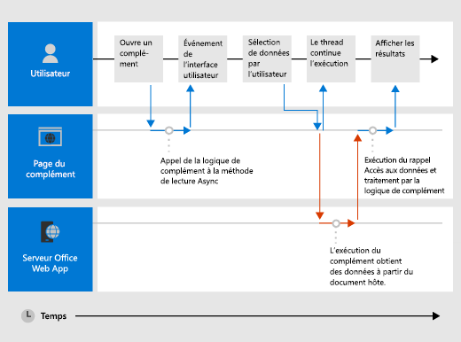

# <a name="asynchronous-programming-in-office-add-ins"></a><span data-ttu-id="02f97-103">Programmation asynchrone dans des compléments Office</span><span class="sxs-lookup"><span data-stu-id="02f97-103">Asynchronous programming in Office Add-ins</span></span>

[!include[information about the common API](../includes/alert-common-api-info.md)]

<span data-ttu-id="02f97-104">Pourquoi l’API de Compléments Office a-t-elle recours à la programmation asynchrone ?</span><span class="sxs-lookup"><span data-stu-id="02f97-104">Why does the Office Add-ins API use asynchronous programming?</span></span> <span data-ttu-id="02f97-105">JavaScript étant un langage monothread, si le script appelle un processus synchrone de longue durée, toute exécution de script ultérieure sera bloquée tant que ce processus ne sera pas terminé.</span><span class="sxs-lookup"><span data-stu-id="02f97-105">Because JavaScript is a single-threaded language, if script invokes a long-running synchronous process, all subsequent script execution will be blocked until that process completes.</span></span> <span data-ttu-id="02f97-106">Étant donné que certaines opérations sur les clients Web Office (mais aussi les clients enrichis) peuvent bloquer l’exécution si elles sont exécutées de manière synchrone, la plupart des API JavaScript d’Office sont conçues pour s’exécuter de manière asynchrone.</span><span class="sxs-lookup"><span data-stu-id="02f97-106">Because certain operations against Office web clients (but rich clients as well) could block execution if they are run synchronously, most of the Office JavaScript APIs are designed to execute asynchronously.</span></span> <span data-ttu-id="02f97-107">Cela permet de s’assurer que les compléments Office sont réactifs et rapides.</span><span class="sxs-lookup"><span data-stu-id="02f97-107">This makes sure that Office Add-ins are responsive and fast.</span></span> <span data-ttu-id="02f97-108">Vous devez donc fréquemment écrire des fonctions de rappel lorsque vous utilisez ces méthodes asynchrones.</span><span class="sxs-lookup"><span data-stu-id="02f97-108">It also frequently requires you to write callback functions when working with these asynchronous methods.</span></span>

<span data-ttu-id="02f97-109">Les noms de toutes les méthodes asynchrones de l’API se terminent par « Async », comme les `Document.getSelectedDataAsync` `Binding.getDataAsync` méthodes, ou `Item.loadCustomPropertiesAsync` .</span><span class="sxs-lookup"><span data-stu-id="02f97-109">The names of all asynchronous methods in the API end with "Async", such as the `Document.getSelectedDataAsync`, `Binding.getDataAsync`, or `Item.loadCustomPropertiesAsync` methods.</span></span> <span data-ttu-id="02f97-110">Lorsqu’une méthode « Async » est appelée, elle est exécutée immédiatement et toute exécution de script ultérieure peut se poursuivre normalement.</span><span class="sxs-lookup"><span data-stu-id="02f97-110">When an "Async" method is called, it executes immediately and any subsequent script execution can continue.</span></span> <span data-ttu-id="02f97-111">La fonction de rappel facultative que vous transmettez à une méthode « Async » s’exécute dès que l’opération demandée ou les données sont prêtes.</span><span class="sxs-lookup"><span data-stu-id="02f97-111">The optional callback function you pass to an "Async" method executes as soon as the data or requested operation is ready.</span></span> <span data-ttu-id="02f97-112">L’opération est généralement rapide, mais le retour pourrait présenter un léger retard.</span><span class="sxs-lookup"><span data-stu-id="02f97-112">This generally occurs promptly, but there can be a slight delay before it returns.</span></span>

<span data-ttu-id="02f97-113">Le diagramme suivant illustre le flux d’exécution d’un appel à une méthode « Async » qui lit les données sélectionnées par l’utilisateur dans un document ouvert dans Word ou Excel.</span><span class="sxs-lookup"><span data-stu-id="02f97-113">The following diagram shows the flow of execution for a call to an "Async" method that reads the data the user selected in a document open in the server-based Word or Excel.</span></span> <span data-ttu-id="02f97-114">Au moment de l’appel « Async », le thread d’exécution JavaScript est libre d’effectuer tout traitement supplémentaire côté client (même si aucun n’est affiché dans le diagramme).</span><span class="sxs-lookup"><span data-stu-id="02f97-114">At the point when the "Async" call is made, the JavaScript execution thread is free to perform any additional client-side processing (although none are shown in the diagram).</span></span> <span data-ttu-id="02f97-115">Lorsque la méthode « Async » est renvoyée, le rappel reprend l’exécution sur le thread, et le complément peut accéder aux données, effectuer une opération avec ce dernier et afficher le résultat.</span><span class="sxs-lookup"><span data-stu-id="02f97-115">When the "Async" method returns, the callback resumes execution on the thread, and the add-in can the access data, do something with it, and display the result.</span></span> <span data-ttu-id="02f97-116">Le même modèle d’exécution asynchrone est conservé lorsque vous utilisez les applications client riche Office, telles que Word 2013 ou Excel 2013.</span><span class="sxs-lookup"><span data-stu-id="02f97-116">The same asynchronous execution pattern holds when working with the Office rich client applications, such as Word 2013 or Excel 2013.</span></span>

<span data-ttu-id="02f97-117">*Figure 1. Flux d’exécution de programmation asynchrone*</span><span class="sxs-lookup"><span data-stu-id="02f97-117">*Figure 1. Asynchronous programming execution flow*</span></span>



<span data-ttu-id="02f97-p104">La prise en charge de cette conception asynchrone dans les clients riches et les clients web fait partie des objectifs de conception « écriture unique-exécution multiplateforme » du modèle de développement des Compléments Office. Par exemple, vous pouvez créer un complément de contenu ou du volet de tâches avec une seule base de code qui sera exécutée sur Excel 2013 et Excel sur le web.</span><span class="sxs-lookup"><span data-stu-id="02f97-p104">Support for this asynchronous design in both rich and web clients is part of the "write once-run cross-platform" design goals of the Office Add-ins development model. For example, you can create a content or task pane add-in with a single code base that will run in both Excel 2013 and Excel on the web.</span></span>

## <a name="writing-the-callback-function-for-an-async-method"></a><span data-ttu-id="02f97-121">Écriture de la fonction de rappel pour une méthode « Async »</span><span class="sxs-lookup"><span data-stu-id="02f97-121">Writing the callback function for an "Async" method</span></span>

<span data-ttu-id="02f97-122">La fonction de rappel transmise en tant qu’argument de _rappel_ à une méthode « Async » doit déclarer un paramètre unique que le runtime de complément utilisera pour fournir l’accès à un objet [asyncResult](/javascript/api/office/office.asyncresult) lors de l’exécution de la fonction de rappel.</span><span class="sxs-lookup"><span data-stu-id="02f97-122">The callback function you pass as the _callback_ argument to an "Async" method must declare a single parameter that the add-in runtime will use to provide access to an [AsyncResult](/javascript/api/office/office.asyncresult) object when the callback function executes.</span></span> <span data-ttu-id="02f97-123">Vous pouvez écrire:</span><span class="sxs-lookup"><span data-stu-id="02f97-123">You can write:</span></span>

- <span data-ttu-id="02f97-124">Une fonction anonyme qui doit être écrite et passée directement en ligne avec l’appel à la méthode « Async » en tant que paramètre _callback_ de la méthode « Async ».</span><span class="sxs-lookup"><span data-stu-id="02f97-124">An anonymous function that must be written and passed directly in line with the call to the "Async" method as the _callback_ parameter of the "Async" method.</span></span>

- <span data-ttu-id="02f97-125">Une fonction nommée, en passant le nom de cette fonction en tant que paramètre _callback_ d’une méthode « Async ».</span><span class="sxs-lookup"><span data-stu-id="02f97-125">A named function, passing the name of that function as the _callback_ parameter of an "Async" method.</span></span>

<span data-ttu-id="02f97-p106">Une fonction anonyme est utile si vous envisagez de n’utiliser son code qu’une fois : comme elle n’a pas de nom, vous ne pouvez pas y faire référence dans une autre partie du code. Une fonction nommée est utile si vous voulez réutiliser la fonction de rappel pour plusieurs méthodes « Async ».</span><span class="sxs-lookup"><span data-stu-id="02f97-p106">An anonymous function is useful if you are only going to use its code once - because it has no name, you can't reference it in another part of your code. A named function is useful if you want to reuse the callback function for more than one "Async" method.</span></span>

### <a name="writing-an-anonymous-callback-function"></a><span data-ttu-id="02f97-128">Écriture d’une fonction de rappel anonyme</span><span class="sxs-lookup"><span data-stu-id="02f97-128">Writing an anonymous callback function</span></span>

<span data-ttu-id="02f97-129">La fonction de rappel anonyme suivante déclare un seul paramètre nommé `result` qui récupère les données à partir de la propriété [asyncResult. Value](/javascript/api/office/office.asyncresult#value) lorsque le rappel est retourné.</span><span class="sxs-lookup"><span data-stu-id="02f97-129">The following anonymous callback function declares a single parameter named `result` that retrieves data from the [AsyncResult.value](/javascript/api/office/office.asyncresult#value) property when the callback returns.</span></span>

```js
function (result) {
        write('Selected data: ' + result.value);
}
```

<span data-ttu-id="02f97-130">L’exemple suivant montre comment transmettre cette fonction de rappel anonyme en ligne dans le contexte d’un appel complet de méthode « Async » à la `Document.getSelectedDataAsync` méthode.</span><span class="sxs-lookup"><span data-stu-id="02f97-130">The following example shows how to pass this anonymous callback function in line in the context of a full "Async" method call to the `Document.getSelectedDataAsync` method.</span></span>

- <span data-ttu-id="02f97-131">Le premier argument _coercionType_ , `Office.CoercionType.Text` , spécifie de renvoyer les données sélectionnées en tant que chaîne de texte.</span><span class="sxs-lookup"><span data-stu-id="02f97-131">The first _coercionType_ argument, `Office.CoercionType.Text`, specifies to return the selected data as a string of text.</span></span>

- <span data-ttu-id="02f97-132">Le deuxième argument de _rappel_ est la fonction anonyme passée dans la ligne à la méthode.</span><span class="sxs-lookup"><span data-stu-id="02f97-132">The second _callback_ argument is the anonymous function passed in-line to the method.</span></span> <span data-ttu-id="02f97-133">Lorsque la fonction s’exécute, elle utilise le paramètre _result_ pour accéder à la `value` propriété de l' `AsyncResult` objet afin d’afficher les données sélectionnées par l’utilisateur dans le document.</span><span class="sxs-lookup"><span data-stu-id="02f97-133">When the function executes, it uses the _result_ parameter to access the `value` property of the `AsyncResult` object to display the data selected by the user in the document.</span></span>

```js
Office.context.document.getSelectedDataAsync(Office.CoercionType.Text, 
    function (result) {
        write('Selected data: ' + result.value);
    }
});

// Function that writes to a div with id='message' on the page.
function write(message){
    document.getElementById('message').innerText += message; 
}
```

<span data-ttu-id="02f97-134">Vous pouvez également utiliser le paramètre de votre fonction de rappel pour accéder à d’autres propriétés de l' `AsyncResult` objet.</span><span class="sxs-lookup"><span data-stu-id="02f97-134">You can also use the parameter of your callback function to access other properties of the `AsyncResult` object.</span></span> <span data-ttu-id="02f97-135">Utilisez la propriété [AsyncResult.status](/javascript/api/office/office.asyncresult#status) pour déterminer si l’appel a réussi ou échoué.</span><span class="sxs-lookup"><span data-stu-id="02f97-135">Use the [AsyncResult.status](/javascript/api/office/office.asyncresult#status) property to determine if the call succeeded or failed.</span></span> <span data-ttu-id="02f97-136">En cas d’échec, vous pouvez utiliser la propriété [AsyncResult.error](/javascript/api/office/office.asyncresult#error) pour accéder à un objet [Error](/javascript/api/office/office.error) et obtenir des informations sur l’erreur.</span><span class="sxs-lookup"><span data-stu-id="02f97-136">If your call fails you can use the [AsyncResult.error](/javascript/api/office/office.asyncresult#error) property to access an [Error](/javascript/api/office/office.error) object for error information.</span></span>

<span data-ttu-id="02f97-137">Pour plus d’informations sur l’utilisation de la `getSelectedDataAsync` méthode, voir [lecture et écriture de données dans la sélection active d’un document ou d’une feuille de calcul](read-and-write-data-to-the-active-selection-in-a-document-or-spreadsheet.md).</span><span class="sxs-lookup"><span data-stu-id="02f97-137">For more information about using the `getSelectedDataAsync` method, see [Read and write data to the active selection in a document or spreadsheet](read-and-write-data-to-the-active-selection-in-a-document-or-spreadsheet.md).</span></span> 

### <a name="writing-a-named-callback-function"></a><span data-ttu-id="02f97-138">Écriture d’une fonction de rappel nommée</span><span class="sxs-lookup"><span data-stu-id="02f97-138">Writing a named callback function</span></span>

<span data-ttu-id="02f97-139">Vous pouvez également écrire une fonction nommée et transmettre son nom au paramètre _callback_ d’une méthode « Async ».</span><span class="sxs-lookup"><span data-stu-id="02f97-139">Alternatively, you can write a named function and pass its name to the _callback_ parameter of an "Async" method.</span></span> <span data-ttu-id="02f97-140">Par exemple, l’exemple précédent peut être réécrit pour passer une fonction nommée `writeDataCallback` en tant que paramètre _callback_ comme suit.</span><span class="sxs-lookup"><span data-stu-id="02f97-140">For example, the previous example can be rewritten to pass a function named `writeDataCallback` as the _callback_ parameter like this.</span></span>

```js
Office.context.document.getSelectedDataAsync(Office.CoercionType.Text, 
    writeDataCallback);

// Callback to write the selected data to the add-in UI.
function writeDataCallback(result) {
    write('Selected data: ' + result.value);
}

// Function that writes to a div with id='message' on the page.
function write(message){
    document.getElementById('message').innerText += message;
}
```


## <a name="differences-in-whats-returned-to-the-asyncresultvalue-property"></a><span data-ttu-id="02f97-141">Différences dans les éléments retournés à la propriété AsyncResult.value</span><span class="sxs-lookup"><span data-stu-id="02f97-141">Differences in what's returned to the AsyncResult.value property</span></span>

<span data-ttu-id="02f97-142">Les `asyncContext` `status` Propriétés, et `error` de l' `AsyncResult` objet renvoient les mêmes types d’informations à la fonction de rappel transmise à toutes les méthodes « Async ».</span><span class="sxs-lookup"><span data-stu-id="02f97-142">The `asyncContext`, `status`, and `error` properties of the `AsyncResult` object return the same kinds of information to the callback function passed to all "Async" methods.</span></span> <span data-ttu-id="02f97-143">Toutefois, ce qui est renvoyé à la `AsyncResult.value` propriété varie en fonction de la fonctionnalité de la méthode « Async ».</span><span class="sxs-lookup"><span data-stu-id="02f97-143">However, what's returned to the `AsyncResult.value` property varies depending on the functionality of the "Async" method.</span></span>

<span data-ttu-id="02f97-144">Par exemple, les `addHandlerAsync` méthodes (des objets [Binding](/javascript/api/office/office.binding), [CustomXMLPart](/javascript/api/office/office.customxmlpart), [document](/javascript/api/office/office.document), [RoamingSettings](/javascript/api/outlook/office.roamingsettings)et [Settings](/javascript/api/office/office.settings) ) sont utilisées pour ajouter des fonctions de gestionnaire d’événements aux éléments représentés par ces objets.</span><span class="sxs-lookup"><span data-stu-id="02f97-144">For example, the `addHandlerAsync` methods (of the [Binding](/javascript/api/office/office.binding), [CustomXmlPart](/javascript/api/office/office.customxmlpart), [Document](/javascript/api/office/office.document), [RoamingSettings](/javascript/api/outlook/office.roamingsettings), and [Settings](/javascript/api/office/office.settings) objects) are used to add event handler functions to the items represented by these objects.</span></span> <span data-ttu-id="02f97-145">Vous pouvez accéder à la `AsyncResult.value` propriété à partir de la fonction de rappel que vous transmettez à l’une des `addHandlerAsync` méthodes, mais étant donné que vous n’avez pas accès à des données ou à un objet lorsque vous ajoutez un gestionnaire d’événements, la `value` propriété renvoie toujours **undefined** si vous tentez d’y accéder.</span><span class="sxs-lookup"><span data-stu-id="02f97-145">You can access the `AsyncResult.value` property from the callback function you pass to any of the `addHandlerAsync` methods, but since no data or object is being accessed when you add an event handler, the `value` property always returns **undefined** if you attempt to access it.</span></span>

<span data-ttu-id="02f97-146">En revanche, si vous appelez la `Document.getSelectedDataAsync` méthode, elle renvoie les données sélectionnées par l’utilisateur dans le document à la `AsyncResult.value` propriété dans le rappel.</span><span class="sxs-lookup"><span data-stu-id="02f97-146">On the other hand, if you call the `Document.getSelectedDataAsync` method, it returns the data the user selected in the document to the `AsyncResult.value` property in the callback.</span></span> <span data-ttu-id="02f97-147">Ou, si vous appelez la méthode [bindings. getAllAsync](/javascript/api/office/office.bindings#getallasync-options--callback-) , elle renvoie un tableau de tous les `Binding` objets dans le document.</span><span class="sxs-lookup"><span data-stu-id="02f97-147">Or, if you call the [Bindings.getAllAsync](/javascript/api/office/office.bindings#getallasync-options--callback-) method, it returns an array of all of the `Binding` objects in the document.</span></span> <span data-ttu-id="02f97-148">Si vous appelez la méthode [bindings. getByIdAsync](/javascript/api/office/office.bindings#getbyidasync-id--options--callback-) , elle renvoie un seul `Binding` objet.</span><span class="sxs-lookup"><span data-stu-id="02f97-148">And, if you call the [Bindings.getByIdAsync](/javascript/api/office/office.bindings#getbyidasync-id--options--callback-) method, it returns a single `Binding` object.</span></span>

<span data-ttu-id="02f97-149">Pour obtenir une description de ce qui est renvoyé à la `AsyncResult.value` propriété pour une `Async` méthode, consultez la section « valeur de rappel » de la rubrique de référence de cette méthode.</span><span class="sxs-lookup"><span data-stu-id="02f97-149">For a description of what's returned to the `AsyncResult.value` property for an `Async` method, see the "Callback value" section of that method's reference topic.</span></span> <span data-ttu-id="02f97-150">Pour obtenir un résumé de tous les objets qui fournissent des `Async` méthodes, reportez-vous au tableau en bas de la rubrique [asyncResult](/javascript/api/office/office.asyncresult) Object.</span><span class="sxs-lookup"><span data-stu-id="02f97-150">For a summary of all of the objects that provide `Async` methods, see the table at the bottom of the [AsyncResult](/javascript/api/office/office.asyncresult) object topic.</span></span>

## <a name="asynchronous-programming-patterns"></a><span data-ttu-id="02f97-151">Modèles de programmation asynchrone</span><span class="sxs-lookup"><span data-stu-id="02f97-151">Asynchronous programming patterns</span></span>

<span data-ttu-id="02f97-152">L’API JavaScript pour Office prend en charge deux types de modèles de programmation asynchrone :</span><span class="sxs-lookup"><span data-stu-id="02f97-152">The Office JavaScript API supports two kinds of asynchronous programming patterns:</span></span>

- <span data-ttu-id="02f97-153">Utilisation des rappels imbriqués</span><span class="sxs-lookup"><span data-stu-id="02f97-153">Using nested callbacks</span></span>
- <span data-ttu-id="02f97-154">Utilisation du modèle des promesses</span><span class="sxs-lookup"><span data-stu-id="02f97-154">Using the promises pattern</span></span>

<span data-ttu-id="02f97-p114">La programmation asynchrone à l’aide des fonctions de rappel nécessite que vous imbriquiez fréquemment le résultat retourné d’un rappel au sein d’au moins deux rappels. Pour ce faire, vous pouvez utiliser les rappels imbriqués de toutes les méthodes « Async » de l’API.</span><span class="sxs-lookup"><span data-stu-id="02f97-p114">Asynchronous programming with callback functions frequently requires you to nest the returned result of one callback within two or more callbacks. If you need to do so, you can use nested callbacks from all "Async" methods of the API.</span></span>

<span data-ttu-id="02f97-157">L’utilisation des rappels imbriqués est un modèle de programmation familier pour la plupart des développeurs JavaScript, mais le code contenant des rappels fortement imbriqués peut être difficile à lire et à comprendre.</span><span class="sxs-lookup"><span data-stu-id="02f97-157">Using nested callbacks is a programming pattern familiar to most JavaScript developers, but code with deeply nested callbacks can be difficult to read and understand.</span></span> <span data-ttu-id="02f97-158">En guise d’alternative aux rappels imbriqués, l’API JavaScript Office prend également en charge une implémentation du modèle de promesses.</span><span class="sxs-lookup"><span data-stu-id="02f97-158">As an alternative to nested callbacks, the Office JavaScript API also supports an implementation of the promises pattern.</span></span>

> [!NOTE]
> <span data-ttu-id="02f97-159">Dans la version actuelle de l’API JavaScript pour Office, la prise en charge *intégrée* du modèle promesses fonctionne uniquement avec le code pour les [liaisons dans les feuilles de calcul Excel et les documents Word](bind-to-regions-in-a-document-or-spreadsheet.md).</span><span class="sxs-lookup"><span data-stu-id="02f97-159">In the current version of the Office JavaScript API, *built-in* support for the promises pattern only works with code for [bindings in Excel spreadsheets and Word documents](bind-to-regions-in-a-document-or-spreadsheet.md).</span></span> <span data-ttu-id="02f97-160">Toutefois, vous pouvez encapsuler d’autres fonctions qui ont des rappels à l’intérieur de votre fonction personnalisée de renvoi de la promesse.</span><span class="sxs-lookup"><span data-stu-id="02f97-160">However, you can wrap other functions that have callbacks inside your own custom Promise-returning function.</span></span> <span data-ttu-id="02f97-161">Pour plus d’informations, consultez [la rubrique envelopper les API communes dans les fonctions de retour à la vente](#wrap-common-apis-in-promise-returning-functions).</span><span class="sxs-lookup"><span data-stu-id="02f97-161">For more information, see [Wrap Common APIs in Promise-returning functions](#wrap-common-apis-in-promise-returning-functions).</span></span>

### <a name="asynchronous-programming-using-nested-callback-functions"></a><span data-ttu-id="02f97-162">Programmation asynchrone utilisant des fonctions de rappel imbriquées</span><span class="sxs-lookup"><span data-stu-id="02f97-162">Asynchronous programming using nested callback functions</span></span>

<span data-ttu-id="02f97-p117">Vous devez fréquemment effectuer au moins deux opérations asynchrones pour réaliser une tâche. Pour ce faire, vous pouvez imbriquer un appel « Async » dans un autre.</span><span class="sxs-lookup"><span data-stu-id="02f97-p117">Frequently, you need to perform two or more asynchronous operations to complete a task. To accomplish that, you can nest one "Async" call inside another.</span></span>

<span data-ttu-id="02f97-165">L’exemple de code suivant imbrique deux appels asynchrones.</span><span class="sxs-lookup"><span data-stu-id="02f97-165">The following code example nests two asynchronous calls.</span></span>

- <span data-ttu-id="02f97-166">D’abord, la méthode [Bindings.getByIdAsync](/javascript/api/office/office.bindings#getbyidasync-id--options--callback-) est appelée pour accéder à une liaison dans le document nommé « MyBinding ».</span><span class="sxs-lookup"><span data-stu-id="02f97-166">First, the [Bindings.getByIdAsync](/javascript/api/office/office.bindings#getbyidasync-id--options--callback-) method is called to access a binding in the document named "MyBinding".</span></span> <span data-ttu-id="02f97-167">L' `AsyncResult` objet renvoyé au `result` paramètre de ce rappel permet d’accéder à l’objet Binding spécifié à partir de la `AsyncResult.value` propriété.</span><span class="sxs-lookup"><span data-stu-id="02f97-167">The `AsyncResult` object returned to the `result` parameter of that callback provides access to the specified binding object from the `AsyncResult.value` property.</span></span>
- <span data-ttu-id="02f97-168">Ensuite, l’objet Binding auquel vous avez accédé à partir du premier `result` paramètre est utilisé pour appeler la méthode [Binding. getDataAsync](/javascript/api/office/office.binding#getdataasync-options--callback-) .</span><span class="sxs-lookup"><span data-stu-id="02f97-168">Then, the binding object accessed from the first `result` parameter is used to call the [Binding.getDataAsync](/javascript/api/office/office.binding#getdataasync-options--callback-) method.</span></span>
- <span data-ttu-id="02f97-169">Enfin, le `result2` paramètre du rappel transmis à la `Binding.getDataAsync` méthode est utilisé pour afficher les données dans la liaison.</span><span class="sxs-lookup"><span data-stu-id="02f97-169">Finally, the `result2` parameter of the callback passed to the `Binding.getDataAsync` method is used to display the data in the binding.</span></span>

```js
function readData() {
    Office.context.document.bindings.getByIdAsync("MyBinding", function (result) {
        result.value.getDataAsync({ coercionType: 'text' }, function (result2) {
            write(result2.value);
        });
    });
}

// Function that writes to a div with id='message' on the page.
function write(message){
    document.getElementById('message').innerText += message; 
}
```

<span data-ttu-id="02f97-170">Ce modèle de rappel imbriqué de base peut être utilisé pour toutes les méthodes asynchrones dans l’API JavaScript pour Office.</span><span class="sxs-lookup"><span data-stu-id="02f97-170">This basic nested callback pattern can be used for all asynchronous methods in the Office JavaScript API.</span></span>

<span data-ttu-id="02f97-171">Les sections suivantes montrent comment utiliser des fonctions anonymes ou nommées pour des rappels imbriqués dans des méthodes asynchrones.</span><span class="sxs-lookup"><span data-stu-id="02f97-171">The following sections show how to use either anonymous or named functions for nested callbacks in asynchronous methods.</span></span>

#### <a name="using-anonymous-functions-for-nested-callbacks"></a><span data-ttu-id="02f97-172">Utilisation des fonctions anonymes pour des rappels imbriqués</span><span class="sxs-lookup"><span data-stu-id="02f97-172">Using anonymous functions for nested callbacks</span></span>

<span data-ttu-id="02f97-173">Dans l’exemple suivant, deux fonctions anonymes sont déclarées inline et transmises `getByIdAsync` aux `getDataAsync` méthodes et en tant que rappels imbriqués.</span><span class="sxs-lookup"><span data-stu-id="02f97-173">In the following example, two anonymous functions are declared inline and passed into the `getByIdAsync` and `getDataAsync` methods as nested callbacks.</span></span> <span data-ttu-id="02f97-174">Comme les fonctions sont très simples, l’objet de l’implémentation est évident.</span><span class="sxs-lookup"><span data-stu-id="02f97-174">Because the functions are simple and inline, the intent of the implementation is immediately clear.</span></span>

```js
Office.context.document.bindings.getByIdAsync('myBinding', function (bindingResult) {
    bindingResult.value.getDataAsync(function (getResult) {
        if (getResult.status == Office.AsyncResultStatus.Failed) {
            write('Action failed. Error: ' + asyncResult.error.message);
        } else {
            write('Data has been read successfully.');
        }
    });
});

// Function that writes to a div with id='message' on the page.
function write(message){
    document.getElementById('message').innerText += message;
}
```

#### <a name="using-named-functions-for-nested-callbacks"></a><span data-ttu-id="02f97-175">Utilisation de fonctions nommées pour des rappels imbriqués</span><span class="sxs-lookup"><span data-stu-id="02f97-175">Using named functions for nested callbacks</span></span>

<span data-ttu-id="02f97-176">Dans des implémentations complexes, il peut être utile d’utiliser des fonctions nommées pour garantir une meilleure lisibilité, simplicité de gestion et possibilité de réutilisation du code.</span><span class="sxs-lookup"><span data-stu-id="02f97-176">In complex implementations, it may be helpful to use named functions to make your code easier to read, maintain, and reuse.</span></span> <span data-ttu-id="02f97-177">Dans l’exemple suivant, les deux fonctions anonymes de l’exemple de la section précédente ont été réécrites sous la forme de fonctions nommées `deleteAllData` et `showResult` .</span><span class="sxs-lookup"><span data-stu-id="02f97-177">In the following example, the two anonymous functions from the example in the previous section have been rewritten as functions named `deleteAllData` and `showResult`.</span></span> <span data-ttu-id="02f97-178">Ces fonctions nommées sont ensuite transmises aux `getByIdAsync` `deleteAllDataValuesAsync` méthodes et sous forme de rappels par nom.</span><span class="sxs-lookup"><span data-stu-id="02f97-178">These named functions are then passed into the `getByIdAsync` and `deleteAllDataValuesAsync` methods as callbacks by name.</span></span>

```js
Office.context.document.bindings.getByIdAsync('myBinding', deleteAllData);

function deleteAllData(asyncResult) {
    asyncResult.value.deleteAllDataValuesAsync(showResult);
}

function showResult(asyncResult) {
    if (asyncResult.status == Office.AsyncResultStatus.Failed) {
        write('Action failed. Error: ' + asyncResult.error.message);
    } else {
        write('Data has been deleted successfully.');
    }
}

// Function that writes to a div with id='message' on the page.
function write(message){
    document.getElementById('message').innerText += message;
}
```

### <a name="asynchronous-programming-using-the-promises-pattern-to-access-data-in-bindings"></a><span data-ttu-id="02f97-179">Programmation asynchrone en utilisant le modèle des promesses pour accéder aux données des liaisons</span><span class="sxs-lookup"><span data-stu-id="02f97-179">Asynchronous programming using the promises pattern to access data in bindings</span></span>

<span data-ttu-id="02f97-p121">Plutôt que de transmettre une fonction de rappel et d’attendre le renvoi de la fonction pour poursuivre l’exécution, le motif de programmation des promesses renvoie immédiatement un objet de promesse qui représente le résultat souhaité. Toutefois, contrairement à la vraie programmation synchrone, en arrière-plan, la concrétisation du résultat prévu est en fait différée jusqu’à ce que l’environnement d’exécution des compléments Office puisse réaliser la demande. Un gestionnaire _onError_ est fourni pour couvrir les cas où la demande ne peut pas être remplie.</span><span class="sxs-lookup"><span data-stu-id="02f97-p121">Instead of passing a callback function and waiting for the function to return before execution continues, the promises programming pattern immediately returns a promise object that represents its intended result. However, unlike true synchronous programming, under the covers the fulfillment of the promised result is actually deferred until the Office Add-ins runtime environment can complete the request. An _onError_ handler is provided to cover situations when the request can't be fulfilled.</span></span>

<span data-ttu-id="02f97-183">L’API JavaScript pour Office fournit la méthode [Office. Select](/javascript/api/office#office-select-expression--callback-) pour prendre en charge le modèle de promesses pour l’utilisation d’objets Binding existants.</span><span class="sxs-lookup"><span data-stu-id="02f97-183">The Office JavaScript API provides the [Office.select](/javascript/api/office#office-select-expression--callback-) method to support the promises pattern for working with existing binding objects.</span></span> <span data-ttu-id="02f97-184">L’objet promesse renvoyé à la `Office.select` méthode prend en charge uniquement les quatre méthodes auxquelles vous pouvez accéder directement à partir de l’objet [Binding](/javascript/api/office/office.binding) : [getDataAsync](/javascript/api/office/office.binding#getdataasync-options--callback-), [setDataAsync](/javascript/api/office/office.binding#setdataasync-data--options--callback-), [addHandlerAsync](/javascript/api/office/office.binding#addhandlerasync-eventtype--handler--options--callback-)et [removeHandlerAsync](/javascript/api/office/office.binding#removehandlerasync-eventtype--options--callback-).</span><span class="sxs-lookup"><span data-stu-id="02f97-184">The promise object returned to the `Office.select` method supports only the four methods that you can access directly from the [Binding](/javascript/api/office/office.binding) object: [getDataAsync](/javascript/api/office/office.binding#getdataasync-options--callback-), [setDataAsync](/javascript/api/office/office.binding#setdataasync-data--options--callback-), [addHandlerAsync](/javascript/api/office/office.binding#addhandlerasync-eventtype--handler--options--callback-), and [removeHandlerAsync](/javascript/api/office/office.binding#removehandlerasync-eventtype--options--callback-).</span></span>

<span data-ttu-id="02f97-185">Le modèle des promesses à utiliser avec les liaisons se présente comme suit :</span><span class="sxs-lookup"><span data-stu-id="02f97-185">The promises pattern for working with bindings takes this form:</span></span>

<span data-ttu-id="02f97-186">**Office. Select (**_selectorExpression_, _OnError_**).** _BindingObjectAsyncMethod_</span><span class="sxs-lookup"><span data-stu-id="02f97-186">**Office.select(**_selectorExpression_, _onError_**).**_BindingObjectAsyncMethod_</span></span>

<span data-ttu-id="02f97-187">Le paramètre _selectorExpression_ prend la forme `"bindings#bindingId"` , où _bindingId_ est le nom ( `id` ) d’une liaison que vous avez créée précédemment dans le document ou la feuille de calcul (à l’aide de l’une des méthodes « addFrom » de la `Bindings` collection : `addFromNamedItemAsync` , `addFromPromptAsync` , ou `addFromSelectionAsync` ).</span><span class="sxs-lookup"><span data-stu-id="02f97-187">The _selectorExpression_ parameter takes the form `"bindings#bindingId"`, where _bindingId_ is the name ( `id`) of a binding that you created previously in the document or spreadsheet (using one of the "addFrom" methods of the `Bindings` collection: `addFromNamedItemAsync`, `addFromPromptAsync`, or `addFromSelectionAsync`).</span></span> <span data-ttu-id="02f97-188">Par exemple, l’expression de sélecteur `bindings#cities` spécifie que vous souhaitez accéder à la liaison avec l' **ID** « villes ».</span><span class="sxs-lookup"><span data-stu-id="02f97-188">For example, the selector expression `bindings#cities` specifies that you want to access the binding with an **id** of 'cities'.</span></span>

<span data-ttu-id="02f97-189">Le paramètre _OnError_ est une fonction de gestion des erreurs qui accepte un seul paramètre de type `AsyncResult` qui peut être utilisé pour accéder à un `Error` objet, si la `select` méthode ne parvient pas à accéder à la liaison spécifiée.</span><span class="sxs-lookup"><span data-stu-id="02f97-189">The _onError_ parameter is an error handling function which takes a single parameter of type `AsyncResult` that can be used to access an `Error` object, if the `select` method fails to access the specified binding.</span></span> <span data-ttu-id="02f97-190">L’exemple suivant montre une fonction de gestion des erreurs de base pouvant être passée au paramètre _onError_.</span><span class="sxs-lookup"><span data-stu-id="02f97-190">The following example shows a basic error handler function that can be passed to the _onError_ parameter.</span></span>

```js
function onError(result){
    var err = result.error;
    write(err.name + ": " + err.message);
}
// Function that writes to a div with id='message' on the page.
function write(message){
    document.getElementById('message').innerText += message; 
}
```

<span data-ttu-id="02f97-191">Remplacez l’espace réservé _BindingObjectAsyncMethod_ par un appel à l’une des quatre `Binding` méthodes d’objet prises en charge par l’objet Promise : `getDataAsync` ,, `setDataAsync` `addHandlerAsync` ou `removeHandlerAsync` .</span><span class="sxs-lookup"><span data-stu-id="02f97-191">Replace the _BindingObjectAsyncMethod_ placeholder with a call to any of the four `Binding` object methods supported by the promise object: `getDataAsync`, `setDataAsync`, `addHandlerAsync`, or `removeHandlerAsync`.</span></span> <span data-ttu-id="02f97-192">Les appels à ces méthodes ne prennent pas en charge les promesses supplémentaires.</span><span class="sxs-lookup"><span data-stu-id="02f97-192">Calls to these methods don't support additional promises.</span></span> <span data-ttu-id="02f97-193">Vous devez les appeler à l’aide du [modèle de fonction de rappel imbriquée](#asynchronous-programming-using-nested-callback-functions).</span><span class="sxs-lookup"><span data-stu-id="02f97-193">You must call them using the [nested callback function pattern](#asynchronous-programming-using-nested-callback-functions).</span></span>

<span data-ttu-id="02f97-194">Une fois qu’une `Binding` promesse d’objet est satisfaite, elle peut être réutilisée dans l’appel de la méthode chaînée comme s’il s’agissait d’une liaison (le runtime du complément ne réessaie pas de manière asynchrone de répondre à la promesse).</span><span class="sxs-lookup"><span data-stu-id="02f97-194">After a `Binding` object promise is fulfilled, it can be reused in the chained method call as if it were a binding (the add-in runtime won't asynchronously retry fulfilling the promise).</span></span> <span data-ttu-id="02f97-195">Si la `Binding` promesse de l’objet ne peut pas être satisfaite, le runtime du complément réessaiera d’accéder à l’objet Binding lors de la prochaine appel de l’une de ses méthodes asynchrones.</span><span class="sxs-lookup"><span data-stu-id="02f97-195">If the `Binding` object promise can't be fulfilled, the add-in runtime will try again to access the binding object the next time one of its asynchronous methods is invoked.</span></span>

<span data-ttu-id="02f97-196">L’exemple de code suivant utilise la `select` méthode pour récupérer une liaison avec le `id` « `cities` » de la `Bindings` collection, puis appelle la méthode [addHandlerAsync](/javascript/api/office/office.binding#addhandlerasync-eventtype--handler--options--callback-) pour ajouter un gestionnaire d’événements pour l’événement [DataChanged](/javascript/api/office/office.bindingdatachangedeventargs) de la liaison.</span><span class="sxs-lookup"><span data-stu-id="02f97-196">The following code example uses the `select` method to retrieve a binding with the `id` "`cities`" from the `Bindings` collection, and then calls the [addHandlerAsync](/javascript/api/office/office.binding#addhandlerasync-eventtype--handler--options--callback-) method to add an event handler for the [dataChanged](/javascript/api/office/office.bindingdatachangedeventargs) event of the binding.</span></span>

```js
function addBindingDataChangedEventHandler() {
    Office.select("bindings#cities", function onError(){/* error handling code */}).addHandlerAsync(Office.EventType.BindingDataChanged,
    function (eventArgs) {
        doSomethingWithBinding(eventArgs.binding);
    });
}

```

> [!IMPORTANT]
> <span data-ttu-id="02f97-197">La `Binding` promesse de l’objet renvoyée par la `Office.select` méthode donne accès uniquement aux quatre méthodes de l' `Binding` objet.</span><span class="sxs-lookup"><span data-stu-id="02f97-197">The `Binding` object promise returned by the `Office.select` method provides access to only the four methods of the `Binding` object.</span></span> <span data-ttu-id="02f97-198">Si vous avez besoin d’accéder à n’importe quel autre membre de l' `Binding` objet, vous devez utiliser la `Document.bindings` propriété et `Bindings.getByIdAsync` ou les `Bindings.getAllAsync` méthodes pour récupérer l' `Binding` objet.</span><span class="sxs-lookup"><span data-stu-id="02f97-198">If you need to access any of the other members of the `Binding` object, instead you must use the `Document.bindings` property and `Bindings.getByIdAsync` or `Bindings.getAllAsync` methods to retrieve the `Binding` object.</span></span> <span data-ttu-id="02f97-199">Par exemple, si vous avez besoin d’accéder aux propriétés de l' `Binding` objet (les `document` `id` Propriétés, ou `type` ), ou si vous avez besoin d’accéder aux propriétés des objets [MatrixBinding](/javascript/api/office/office.matrixbinding) ou [TableBinding](/javascript/api/office/office.tablebinding) , vous devez utiliser `getByIdAsync` les `getAllAsync` méthodes ou pour récupérer un `Binding` objet.</span><span class="sxs-lookup"><span data-stu-id="02f97-199">For example, if you need to access any of the `Binding` object's properties (the `document`, `id`, or `type` properties), or need to access the properties of the [MatrixBinding](/javascript/api/office/office.matrixbinding) or [TableBinding](/javascript/api/office/office.tablebinding) objects, you must use the `getByIdAsync` or `getAllAsync` methods to retrieve a `Binding` object.</span></span>

## <a name="passing-optional-parameters-to-asynchronous-methods"></a><span data-ttu-id="02f97-200">Passage de paramètres facultatifs à des méthodes asynchrones</span><span class="sxs-lookup"><span data-stu-id="02f97-200">Passing optional parameters to asynchronous methods</span></span>

<span data-ttu-id="02f97-201">La syntaxe courante pour toutes les méthodes « Async » suit ce modèle :</span><span class="sxs-lookup"><span data-stu-id="02f97-201">The common syntax for all "Async" methods follows this pattern:</span></span>

 <span data-ttu-id="02f97-202">_AsyncMethod_ `(`_RequiredParameters_`, [`_OptionalParameters_`],`_CallbackFunction_`);`</span><span class="sxs-lookup"><span data-stu-id="02f97-202">_AsyncMethod_ `(` _RequiredParameters_ `, [` _OptionalParameters_ `],` _CallbackFunction_ `);`</span></span>

<span data-ttu-id="02f97-p128">Toutes les méthodes asynchrones prennent en charge des paramètres facultatifs, qui sont passés sous la forme d’un objet JSON (JavaScript Object Notation) qui contient un ou plusieurs paramètres facultatifs. L’objet JSON contenant les paramètres facultatifs est une collection non ordonnée de paires clé-valeur où le caractère « : » sépare la clé de la valeur. Chaque paire dans l’objet est séparée par une virgule, et l’ensemble complet de paires est placé entre accolades. La clé est le nom du paramètre, et la valeur est la valeur à passer pour ce paramètre.</span><span class="sxs-lookup"><span data-stu-id="02f97-p128">All asynchronous methods support optional parameters, which are passed in as a JavaScript Object Notation (JSON) object that contains one or more optional parameters. The JSON object containing the optional parameters is an unordered collection of key-value pairs with the ":" character separating the key and the value. Each pair in the object is comma-separated, and the entire set of pairs is enclosed in braces. The key is the parameter name, and value is the value to pass for that parameter.</span></span>

<span data-ttu-id="02f97-207">Vous pouvez créer l’objet JSON qui contient les paramètres facultatifs incorporés, ou créer un `options` objet et le passer comme paramètre _options_ .</span><span class="sxs-lookup"><span data-stu-id="02f97-207">You can create the JSON object that contains optional parameters inline, or by creating an `options` object and passing that in as the _options_ parameter.</span></span>

### <a name="passing-optional-parameters-inline"></a><span data-ttu-id="02f97-208">Passage de paramètres facultatifs incorporés</span><span class="sxs-lookup"><span data-stu-id="02f97-208">Passing optional parameters inline</span></span>

<span data-ttu-id="02f97-209">Par exemple, la syntaxe pour appeler la méthode [Document.setSelectedDataAsync](/javascript/api/office/office.document#setselecteddataasync-data--options--callback-) avec des paramètres facultatifs incorporés se présente comme ceci :</span><span class="sxs-lookup"><span data-stu-id="02f97-209">For example, the syntax for calling the [Document.setSelectedDataAsync](/javascript/api/office/office.document#setselecteddataasync-data--options--callback-) method with optional parameters inline looks like this:</span></span>

```js
 Office.context.document.setSelectedDataAsync(data, {coercionType: 'coercionType', asyncContext: 'asyncContext'},callback);

```

<span data-ttu-id="02f97-210">Dans cette forme de syntaxe d’appel, les deux paramètres facultatifs, _coercionType_ et _asyncContext_, sont définis comme un objet incorporé entre accolades.</span><span class="sxs-lookup"><span data-stu-id="02f97-210">In this form of the calling syntax, the two optional parameters, _coercionType_ and _asyncContext_, are defined as a JSON object inline enclosed in braces.</span></span>

<span data-ttu-id="02f97-211">L’exemple suivant montre comment appeler la `Document.setSelectedDataAsync` méthode en spécifiant des paramètres facultatifs incorporés.</span><span class="sxs-lookup"><span data-stu-id="02f97-211">The following example shows how to call to the `Document.setSelectedDataAsync` method by specifying optional parameters inline.</span></span>

```js
Office.context.document.setSelectedDataAsync(
    "<html><body>hello world</body></html>",
    {coercionType: "html", asyncContext: 42},
    function(asyncResult) {
        write(asyncResult.status + " " + asyncResult.asyncContext);
    }
)

// Function that writes to a div with id='message' on the page.
function write(message){
    document.getElementById('message').innerText += message; 
}
```

> [!NOTE]
> <span data-ttu-id="02f97-212">Vous pouvez spécifier des paramètres facultatifs dans l’objet JSON dans n’importe quel ordre dans la mesure où leurs noms sont correctement spécifiés.</span><span class="sxs-lookup"><span data-stu-id="02f97-212">You can specify optional parameters in any order in the JSON object as long as their names are specified correctly.</span></span>

### <a name="passing-optional-parameters-in-an-options-object"></a><span data-ttu-id="02f97-213">Passage de paramètres facultatifs dans un objet options</span><span class="sxs-lookup"><span data-stu-id="02f97-213">Passing optional parameters in an options object</span></span>

<span data-ttu-id="02f97-214">Vous pouvez également créer un objet nommé `options` qui spécifie les paramètres facultatifs séparément de l’appel de la méthode, puis transmettre l' `options` objet en tant qu’argument _options_ .</span><span class="sxs-lookup"><span data-stu-id="02f97-214">Alternatively, you can create an object named `options` that specifies the optional parameters separately from the method call, and then pass the `options` object as the _options_ argument.</span></span>

<span data-ttu-id="02f97-215">L’exemple suivant montre une façon de créer l' `options` objet, où `parameter1` ,, `value1` et ainsi de suite, sont des espaces réservés aux noms et valeurs de paramètres effectifs.</span><span class="sxs-lookup"><span data-stu-id="02f97-215">The following example shows one way of creating the `options` object, where `parameter1`, `value1`, and so on, are placeholders for the actual parameter names and values.</span></span>

```js
var options = {
    parameter1: value1,
    parameter2: value2,
    ...
    parameterN: valueN
};

```

<span data-ttu-id="02f97-216">Ce qui ressemble à l’exemple suivant lors de la spécification des paramètres [ValueFormat](/javascript/api/office/office.valueformat) et [FilterType](/javascript/api/office/office.filtertype).</span><span class="sxs-lookup"><span data-stu-id="02f97-216">Which looks like the following example when used to specify the [ValueFormat](/javascript/api/office/office.valueformat) and [FilterType](/javascript/api/office/office.filtertype) parameters.</span></span>

```js
var options = {
    valueFormat: "unformatted",
    filterType: "all"
};
```

<span data-ttu-id="02f97-217">Voici une autre façon de créer l' `options` objet.</span><span class="sxs-lookup"><span data-stu-id="02f97-217">Here's another way of creating the `options` object.</span></span>

```js
var options = {};
options[parameter1] = value1;
options[parameter2] = value2;
...
options[parameterN] = valueN;
```

<span data-ttu-id="02f97-218">Ce qui ressemble à l’exemple suivant lorsqu’il est utilisé pour spécifier les `ValueFormat` `FilterType` paramètres et :</span><span class="sxs-lookup"><span data-stu-id="02f97-218">Which looks like the following example when used to specify the `ValueFormat` and `FilterType` parameters:</span></span>

```js
var options = {};
options["ValueFormat"] = "unformatted";
options["FilterType"] = "all";
```

> [!NOTE]
> <span data-ttu-id="02f97-219">Lors de l’utilisation de l’une ou l’autre des méthodes de création de l' `options` objet, vous pouvez spécifier des paramètres facultatifs dans n’importe quel ordre dans la mesure où leurs noms sont correctement spécifiés.</span><span class="sxs-lookup"><span data-stu-id="02f97-219">When using either method of creating the `options` object, you can specify optional parameters in any order as long as their names are specified correctly.</span></span>

<span data-ttu-id="02f97-220">L’exemple suivant montre comment appeler la `Document.setSelectedDataAsync` méthode en spécifiant des paramètres facultatifs dans un `options` objet.</span><span class="sxs-lookup"><span data-stu-id="02f97-220">The following example shows how to call to the `Document.setSelectedDataAsync` method by specifying optional parameters in an `options` object.</span></span>

```js
var options = {
   coercionType: "html",
   asyncContext: 42
};

document.setSelectedDataAsync(
    "<html><body>hello world</body></html>",
    options,
    function(asyncResult) {
        write(asyncResult.status + " " + asyncResult.asyncContext);
    }
)

// Function that writes to a div with id='message' on the page.
function write(message){
    document.getElementById('message').innerText += message; 
}
```

<span data-ttu-id="02f97-221">Dans les deux exemples de paramètres facultatifs, le paramètre _callback_ est spécifié en tant que dernier paramètre (en suivant les paramètres facultatifs Inline, ou en suivant l’objet d’arguments _options_ ).</span><span class="sxs-lookup"><span data-stu-id="02f97-221">In both optional parameter examples, the _callback_ parameter is specified as the last parameter (following the inline optional parameters, or following the _options_ argument object).</span></span> <span data-ttu-id="02f97-222">Vous pouvez également spécifier le paramètre _callback_ à l’intérieur de l’objet JSON incorporé, ou dans l’objet `options`.</span><span class="sxs-lookup"><span data-stu-id="02f97-222">Alternatively, you can specify the _callback_ parameter inside either the inline JSON object, or in the `options` object.</span></span> <span data-ttu-id="02f97-223">Cependant, vous ne pouvez passer le paramètre _callback_ qu’à un seul endroit : soit dans l’objet _options_ (incorporé ou créé en externe), soit comme dernier paramètre, mais pas les deux.</span><span class="sxs-lookup"><span data-stu-id="02f97-223">However, you can pass the _callback_ parameter in only one location: either in the _options_ object (inline or created externally), or as the last parameter, but not both.</span></span>

## <a name="wrap-common-apis-in-promise-returning-functions"></a><span data-ttu-id="02f97-224">Envelopper les API communes dans les fonctions de retour à la vente</span><span class="sxs-lookup"><span data-stu-id="02f97-224">Wrap Common APIs in Promise-returning functions</span></span>

<span data-ttu-id="02f97-225">Les méthodes de l’API commune (et de l’API Outlook) ne retournent pas de [promesses](https://developer.mozilla.org/docs/Web/JavaScript/Reference/Global_Objects/Promise).</span><span class="sxs-lookup"><span data-stu-id="02f97-225">The Common API (and Outlook API) methods do not return [Promises](https://developer.mozilla.org/docs/Web/JavaScript/Reference/Global_Objects/Promise).</span></span> <span data-ttu-id="02f97-226">Par conséquent, vous ne pouvez pas utiliser [await](https://developer.mozilla.org/docs/Web/JavaScript/Reference/Operators/await) pour suspendre l’exécution jusqu’à la fin de l’opération asynchrone.</span><span class="sxs-lookup"><span data-stu-id="02f97-226">Therefore, you cannot use [await](https://developer.mozilla.org/docs/Web/JavaScript/Reference/Operators/await) to pause the execution until the asynchronous operation completes.</span></span> <span data-ttu-id="02f97-227">Si vous avez besoin `await` de comportement, vous pouvez encapsuler l’appel de méthode dans une promesse créée de manière explicite.</span><span class="sxs-lookup"><span data-stu-id="02f97-227">If you need `await` behavior, you can wrap the method call in an explicitly created Promise.</span></span> 

<span data-ttu-id="02f97-228">Le modèle de base consiste à créer une méthode asynchrone qui renvoie immédiatement un objet promesse et *résout* cet objet promise au terme de la méthode interne, ou *rejette* l’objet en cas d’échec de la méthode.</span><span class="sxs-lookup"><span data-stu-id="02f97-228">The basic pattern is to create an asynchronous method that returns a Promise object immediately and *resolves* that Promise object when the inner method completes, or *rejects* the object if the method fails.</span></span> <span data-ttu-id="02f97-229">Voici un exemple simple</span><span class="sxs-lookup"><span data-stu-id="02f97-229">The following is a simple example</span></span>

```javascript
function getDocumentFilePath() {
    return new OfficeExtension.Promise(function (resolve, reject) {
        try {
            Office.context.document.getFilePropertiesAsync(function (asyncResult) {
                resolve(asyncResult.value.url);
            });
        }
        catch (error) {
            reject(WordMarkdownConversion.errorHandler(error));
        }
    })
}
```

<span data-ttu-id="02f97-230">Lorsque cette méthode doit être attendue, elle peut être appelée soit à l’aide du `await` mot clé, soit en tant que fonction passée à une `then` fonction.</span><span class="sxs-lookup"><span data-stu-id="02f97-230">When this method needs to be awaited, it can be called either with the `await` keyword or as the function passed to a `then` function.</span></span>

> [!NOTE]
> <span data-ttu-id="02f97-231">Cette technique est particulièrement utile lorsque vous devez appeler l’une des API communes à l’intérieur d’un appel de la `run` méthode dans l’un des modèles objet spécifiques à l’application.</span><span class="sxs-lookup"><span data-stu-id="02f97-231">This technique is especially useful when you need to call one of the Common APIs inside a call of the `run` method in one of the application-specific object models.</span></span> <span data-ttu-id="02f97-232">Pour obtenir un exemple de la fonction ci-dessus utilisée de cette façon, reportez-vous au fichier [Home.js dans l’exemple Word-Add-in-JavaScript-MDConversion](https://github.com/OfficeDev/Word-Add-in-MarkdownConversion/blob/master/Word-Add-in-JavaScript-MDConversionWeb/Home.js).</span><span class="sxs-lookup"><span data-stu-id="02f97-232">For an example of the function above being used in this way, see the file [Home.js in the sample Word-Add-in-JavaScript-MDConversion](https://github.com/OfficeDev/Word-Add-in-MarkdownConversion/blob/master/Word-Add-in-JavaScript-MDConversionWeb/Home.js).</span></span>

<span data-ttu-id="02f97-233">Voici un exemple d’utilisation de la machine à écrire.</span><span class="sxs-lookup"><span data-stu-id="02f97-233">The following is an example using TypeScript.</span></span>

```typescript
readDocumentFileAsync(): Promise<any> {
    return new Promise((resolve, reject) => {
        const chunkSize = 65536;
        const self = this;

        Office.context.document.getFileAsync(Office.FileType.Compressed, { sliceSize: chunkSize }, (asyncResult) => {
            if (asyncResult.status === Office.AsyncResultStatus.Failed) {
                reject(asyncResult.error);
            } else {
                // `getAllSlices` is a Promise-wrapped implementation of File.getSliceAsync.
                self.getAllSlices(asyncResult.value).then(result => {
                    if (result.IsSuccess) {
                        resolve(result.Data);
                    } else {
                        reject(asyncResult.error);
                    }
                });
            }
        });
    });
}
```

## <a name="see-also"></a><span data-ttu-id="02f97-234">Voir aussi</span><span class="sxs-lookup"><span data-stu-id="02f97-234">See also</span></span>

- [<span data-ttu-id="02f97-235">Compréhension de l’API JavaScript pour Office</span><span class="sxs-lookup"><span data-stu-id="02f97-235">Understanding the Office JavaScript API</span></span>](understanding-the-javascript-api-for-office.md)
- [<span data-ttu-id="02f97-236">API JavaScript pour Office</span><span class="sxs-lookup"><span data-stu-id="02f97-236">Office JavaScript API</span></span>](../reference/javascript-api-for-office.md)
