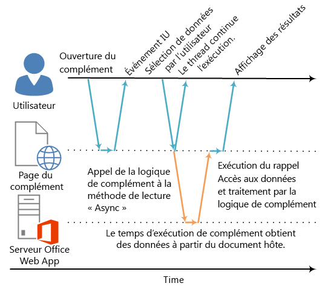

# <a name="asynchronous-programming-in-office-add-ins"></a><span data-ttu-id="c9e7e-102">Programmation asynchrone dans des compléments Office</span><span class="sxs-lookup"><span data-stu-id="c9e7e-102">Asynchronous programming in Office Add-ins</span></span>

<span data-ttu-id="c9e7e-p101">Pourquoi l’API de Compléments Office a-t-elle recours à la programmation asynchrone ?JavaScript étant un langage monothread, si le script appelle un processus synchrone de longue durée, toute exécution de script ultérieure sera bloquée tant que ce processus ne sera pas terminé. Comme certaines opérations, notamment celles agissant sur les clients web Office (mais aussi sur les clients riches), peuvent bloquer l’exécution si elles sont exécutées de façon synchrone, la plupart des méthodes dans l’interface API JavaScript pour Office sont conçues pour être exécutées de façon asynchrone. Cela permet de garantir que les Compléments Office sont réactifs et très performants. Vous devez donc fréquemment écrire des fonctions de rappel lorsque vous utilisez ces méthodes asynchrones.</span><span class="sxs-lookup"><span data-stu-id="c9e7e-p101">Why does the Office Add-ins API use asynchronous programming? Because JavaScript is a single-threaded language, if script invokes a long-running synchronous process, all subsequent script execution will be blocked until that process completes. Because certain operations against Office web clients (but rich clients as well) could block execution if they are run synchronously, most of the methods in the JavaScript API for Office are designed to execute asynchronously. This makes sure that Office Add-ins are responsive and highly performing. It also frequently requires you to write callback functions when working with these asynchronous methods.</span></span>

<span data-ttu-id="c9e7e-p102">Le nom de toutes les méthodes asynchrones de l’API se terminent par « Async », comme pour les méthodes [Document.getSelectedDataAsync](/javascript/api/office/office.document#getselecteddataasync-coerciontype--options--callback-), [Binding.getDataAsync](/javascript/api/office/office.binding#getdataasync-options--callback-) ou [Item.loadCustomPropertiesAsync](/javascript/api/outlook/office.item#loadcustompropertiesasync-callback--usercontext-). Lorsqu’une méthode « Async » est appelée, elle est exécutée immédiatement et toute exécution de script ultérieure peut se poursuivre normalement. La fonction de rappel facultative que vous transmettez à une méthode « Async » s’exécute dès que l’opération demandée ou les données sont prêtes. L’opération est généralement rapide, mais le retour pourrait présenter un léger retard.</span><span class="sxs-lookup"><span data-stu-id="c9e7e-p102">The names of all asynchronous methods in the API end with "Async", such as the  [Document.getSelectedDataAsync](/javascript/api/office/office.document#getselecteddataasync-coerciontype--options--callback-), [Binding.getDataAsync](/javascript/api/office/office.binding#getdataasync-options--callback-), or [Item.loadCustomPropertiesAsync](/javascript/api/outlook/office.item#loadcustompropertiesasync-callback--usercontext-) methods. When an "Async" method is called, it executes immediately and any subsequent script execution can continue. The optional callback function you pass to an "Async" method executes as soon as the data or requested operation is ready. This generally occurs promptly, but there can be a slight delay before it returns.</span></span>

<span data-ttu-id="c9e7e-p103">Le diagramme suivant présente le flux d’exécution d’un appel à une méthode « Async » qui lit les données sélectionnées par l’utilisateur dans un document ouvert dans l’instance Word Online ou Excel Online sur le serveur. Au moment où l’appel « Async » est effectué, le thread d’exécution JavaScript est libre d’effectuer tout traitement côté client supplémentaire (même si aucun n’est affiché dans le diagramme). Lors du retour de la méthode « Async », l’appel reprend l’exécution sur le thread et le complément peut accéder aux données, les exploiter et afficher le résultat. Le même motif d’exécution asynchrone est employé en cas d’utilisation des applications hôtes de client riche Office, telles que Word 2013 ou Excel 2013.</span><span class="sxs-lookup"><span data-stu-id="c9e7e-p103">The following diagram shows the flow of execution for a call to an "Async" method that reads the data the user selected in a document open in the server-based Word Online or Excel Online. At the point when the "Async" call is made, the JavaScript execution thread is free to perform any additional client-side processing. (Although none are shown in the diagram.) When the "Async" method returns, the callback resumes execution on the thread, and the add-in can the access data, do something with it, and display the result. The same asynchronous execution pattern holds when working with the Office rich client host applications, such as Word 2013 or Excel 2013.</span></span>

<span data-ttu-id="c9e7e-116">*Figure 1. Flux d’exécution de programmation asynchrone*</span><span class="sxs-lookup"><span data-stu-id="c9e7e-116">*Figure 1. Asynchronous programing execution flow*</span></span>



<span data-ttu-id="c9e7e-p104">La prise en charge de cette conception asynchrone dans les clients riches et les clients web fait partie des objectifs de conception « écriture unique-exécution multiplateforme » du modèle de développement des Compléments Office. Par exemple, vous pouvez créer un complément de contenu ou du volet de tâches avec une seule base de code qui sera exécutée sur Excel 2013 et Excel Online.</span><span class="sxs-lookup"><span data-stu-id="c9e7e-p104">Support for this asynchronous design in both rich and web clients is part of the "write once-run cross-platform" design goals of the Office Add-ins development model. For example, you can create a content or task pane add-in with a single code base that will run in both Excel 2013 and Excel Online.</span></span>

## <a name="writing-the-callback-function-for-an-async-method"></a><span data-ttu-id="c9e7e-120">Écriture de la fonction de rappel pour une méthode « Async »</span><span class="sxs-lookup"><span data-stu-id="c9e7e-120">Writing the callback function for an "Async" method</span></span>


<span data-ttu-id="c9e7e-p105">La fonction de rappel que vous transmettez en tant qu’argument _callback_ à une méthode « Async » doit déclarer un seul paramètre que le runtime de complément va utiliser pour permettre l’accès à un objet [AsyncResult](/javascript/api/office/office.asyncresult) lorsque la fonction de rappel sera exécutée. Vous pouvez écrire :</span><span class="sxs-lookup"><span data-stu-id="c9e7e-p105">The callback function you pass as the  _callback_ argument to an "Async" method must declare a single parameter that the add-in runtime will use to provide access to an [AsyncResult](/javascript/api/office/office.asyncresult) object when the callback function executes. You can write:</span></span>


- <span data-ttu-id="c9e7e-123">une fonction anonyme devant être écrite et passée directement en ligne avec l’appel à la méthode « Async » en tant que paramètre  _callback_ de la méthode « Async » ;</span><span class="sxs-lookup"><span data-stu-id="c9e7e-123">An anonymous function that must be written and passed directly in line with the call to the "Async" method as the  _callback_ parameter of the "Async" method.</span></span>

- <span data-ttu-id="c9e7e-124">une fonction nommée, en passant le nom de cette fonction en tant que paramètre  _callback_ de la méthode « Async ».</span><span class="sxs-lookup"><span data-stu-id="c9e7e-124">A named function, passing the name of that function as the  _callback_ parameter of an "Async" method.</span></span>

<span data-ttu-id="c9e7e-p106">Une fonction anonyme est utile si vous envisagez de n’utiliser son code qu’une fois : comme elle n’a pas de nom, vous ne pouvez pas y faire référence dans une autre partie du code. Une fonction nommée est utile si vous voulez réutiliser la fonction de rappel pour plusieurs méthodes « Async ».</span><span class="sxs-lookup"><span data-stu-id="c9e7e-p106">An anonymous function is useful if you are only going to use its code once - because it has no name, you can't reference it in another part of your code. A named function is useful if you want to reuse the callback function for more than one "Async" method.</span></span>


### <a name="writing-an-anonymous-callback-function"></a><span data-ttu-id="c9e7e-127">Écriture d’une fonction de rappel anonyme</span><span class="sxs-lookup"><span data-stu-id="c9e7e-127">Writing an anonymous callback function</span></span>

<span data-ttu-id="c9e7e-128">La fonction de rappel anonyme suivante déclare un seul paramètre nommé `result` qui récupère les données à partir de la propriété [AsyncResult.value](/javascript/api/office/office.asyncresult#value) lorsque le rappel est renvoyé.</span><span class="sxs-lookup"><span data-stu-id="c9e7e-128">The following anonymous callback function declares a single parameter named  `result` that retrieves data from the [AsyncResult.value](/javascript/api/office/office.asyncresult#value) property when the callback returns.</span></span>


```js
function (result) {
        write('Selected data: ' + result.value);
}
```

<span data-ttu-id="c9e7e-129">L’exemple suivant montre comment passer cette fonction de rappel anonyme dans le contexte d’un appel complet de méthode « Async » à la méthode  **Document.getSelectedDataAsync**.</span><span class="sxs-lookup"><span data-stu-id="c9e7e-129">The following example shows how to pass this anonymous callback function in line in the context of a full "Async" method call to the  **Document.getSelectedDataAsync** method.</span></span>


- <span data-ttu-id="c9e7e-130">Le premier argument  _coercionType_,  `Office.CoercionType.Text`, spécifie le retour des données sélectionnées en tant que chaîne de texte.</span><span class="sxs-lookup"><span data-stu-id="c9e7e-130">The first  _coercionType_ argument, `Office.CoercionType.Text`, specifies to return the selected data as a string of text.</span></span>

- <span data-ttu-id="c9e7e-p107">Le deuxième argument  _callback_ est la fonction anonyme passée en ligne à la méthode. Lors de l’exécution de la fonction, elle utilise le paramètre _result_ pour accéder à la propriété **value** de l’objet **AsyncResult** afin d’afficher les données sélectionnées par l’utilisateur dans le document.</span><span class="sxs-lookup"><span data-stu-id="c9e7e-p107">The second  _callback_ argument is the anonymous function passed in-line to the method. When the function executes, it uses the _result_ parameter to access the **value** property of the **AsyncResult** object to display the data selected by the user in the document.</span></span>


```js
Office.context.document.getSelectedDataAsync(Office.CoercionType.Text, 
    function (result) {
        write('Selected data: ' + result.value);
    }
});

// Function that writes to a div with id='message' on the page.
function write(message){
    document.getElementById('message').innerText += message; 
}
```

<span data-ttu-id="c9e7e-p108">Vous pouvez également utiliser le paramètre de votre fonction de rappel pour accéder aux autres propriétés de l’objet **AsyncResult**. Utilisez la propriété [AsyncResult.status](/javascript/api/office/office.asyncresult#status) pour déterminer si l’appel a réussi ou échoué. En cas d’échec, vous pouvez utiliser la propriété [AsyncResult.error](/javascript/api/office/office.asyncresult#error) pour accéder à un objet [Error](/javascript/api/office/office.error) et obtenir des informations sur l’erreur.</span><span class="sxs-lookup"><span data-stu-id="c9e7e-p108">You can also use the parameter of your callback function to access other properties of the  **AsyncResult** object. Use the [AsyncResult.status](/javascript/api/office/office.asyncresult#status) property to determine if the call succeeded or failed. If your call fails you can use the [AsyncResult.error](/javascript/api/office/office.asyncresult#error) property to access an [Error](/javascript/api/office/office.error) object for error information.</span></span>

<span data-ttu-id="c9e7e-136">Pour plus d’informations sur l’utilisation de la méthode  **getSelectedDataAsync**, voir [Lecture et écriture de données dans la sélection active d’un document ou d’une feuille de calcul](read-and-write-data-to-the-active-selection-in-a-document-or-spreadsheet.md).</span><span class="sxs-lookup"><span data-stu-id="c9e7e-136">For more information about using the  **getSelectedDataAsync** method, see [Read and write data to the active selection in a document or spreadsheet](read-and-write-data-to-the-active-selection-in-a-document-or-spreadsheet.md).</span></span> 


### <a name="writing-a-named-callback-function"></a><span data-ttu-id="c9e7e-137">Écriture d’une fonction de rappel nommée</span><span class="sxs-lookup"><span data-stu-id="c9e7e-137">Writing a named callback function</span></span>

<span data-ttu-id="c9e7e-p109">Vous pouvez également écrire une fonction nommée et passer son nom au paramètre  _callback_ d’une méthode « Async ». Par exemple, l’exemple précédent peut être réécrit pour passer une fonction nommée `writeDataCallback` en tant que paramètre _callback_ comme suit.</span><span class="sxs-lookup"><span data-stu-id="c9e7e-p109">Alternatively, you can write a named function and pass its name to the  _callback_ parameter of an "Async" method. For example, the previous example can be rewritten to pass a function named `writeDataCallback` as the _callback_ parameter like this.</span></span>


```js
Office.context.document.getSelectedDataAsync(Office.CoercionType.Text, 
    writeDataCallback);

// Callback to write the selected data to the add-in UI.
function writeDataCallback(result) {
    write('Selected data: ' + result.value);
}

// Function that writes to a div with id='message' on the page.
function write(message){
    document.getElementById('message').innerText += message; 
}
```


## <a name="differences-in-whats-returned-to-the-asyncresultvalue-property"></a><span data-ttu-id="c9e7e-140">Différences dans les éléments retournés à la propriété AsyncResult.value</span><span class="sxs-lookup"><span data-stu-id="c9e7e-140">Differences in what's returned to the AsyncResult.value property</span></span>


<span data-ttu-id="c9e7e-p110">Les propriétés  **asyncContext**,  **status** et **error** de l’objet **AsyncResult** retournent le même type d’informations à la fonction de rappel passée à toutes les méthodes « Async ». Cependant, les éléments retournés à la propriété **AsyncResult.value** varient selon la fonctionnalité de la méthode « Async ».</span><span class="sxs-lookup"><span data-stu-id="c9e7e-p110">The  **asyncContext**,  **status**, and  **error** properties of the **AsyncResult** object return the same kinds of information to the callback function passed to all "Async" methods. However, what's returned to the **AsyncResult.value** property varies depending on the functionality of the "Async" method.</span></span>

<span data-ttu-id="c9e7e-p111">Par exemple, les méthodes **addHandlerAsync** (des objets [Binding](/javascript/api/office/office.binding), [CustomXmlPart](/javascript/api/office/office.customxmlpart), [Document](/javascript/api/office/office.document), [RoamingSettings](/javascript/api/outlook/office.roamingsettings) et [Settings](/javascript/api/office/office.settings)) sont utilisées pour ajouter des fonctions de gestionnaire d’événements aux éléments représentés par ces objets. Vous pouvez accéder à la propriété **AsyncResult.value** à partir de la fonction de rappel que vous transmettez aux méthodes **addHandlerAsync**, mais comme vous n’accédez à aucune donnée ni à aucun objet lorsque vous ajoutez un gestionnaire d’événements, la propriété **value** renvoie toujours **undefined** si vous tentez d’y accéder.</span><span class="sxs-lookup"><span data-stu-id="c9e7e-p111">For example, the  **addHandlerAsync** methods (of the [Binding](/javascript/api/office/office.binding), [CustomXmlPart](/javascript/api/office/office.customxmlpart), [Document](/javascript/api/office/office.document), [RoamingSettings](/javascript/api/outlook/office.roamingsettings), and [Settings](/javascript/api/office/office.settings) objects) are used to add event handler functions to the items represented by these objects. You can access the **AsyncResult.value** property from the callback function you pass to any of the **addHandlerAsync** methods, but since no data or object is being accessed when you add an event handler, the **value** property always returns **undefined** if you attempt to access it.</span></span>

<span data-ttu-id="c9e7e-p112">En revanche, si vous appelez la méthode  **Document.getSelectedDataAsync**, celle-ci renvoie les données que l’utilisateur a sélectionnées dans le document à la propriété  **AsyncResult.value** dans le rappel. Ou alors, si vous appelez la méthode [Bindings.getAllAsync](/javascript/api/office/office.bindings#getallasync-options--callback-), celle-ci renvoie un tableau de tous les objets  **Binding** du document. Enfin, si vous appelez la méthode [Bindings.getByIdAsync](/javascript/api/office/office.bindings#getbyidasync-id--options--callback-), celle-ci renvoie un seul objet  **Binding**.</span><span class="sxs-lookup"><span data-stu-id="c9e7e-p112">On the other hand, if you call the  **Document.getSelectedDataAsync** method, it returns the data the user selected in the document to the **AsyncResult.value** property in the callback. Or, if you call the [Bindings.getAllAsync](/javascript/api/office/office.bindings#getallasync-options--callback-) method, it returns an array of all of the **Binding** objects in the document. And, if you call the [Bindings.getByIdAsync](/javascript/api/office/office.bindings#getbyidasync-id--options--callback-) method, it returns a single **Binding** object.</span></span>

<span data-ttu-id="c9e7e-p113">Pour obtenir une description des éléments renvoyés à la propriété **AsyncResult.value** pour une méthode « Async », voir la section relative à la valeur de rappel dans la rubrique de référence de cette méthode. Pour obtenir un résumé de tous les objets qui fournissent des méthodes « Async », voir le tableau situé au bas de la rubrique relative à l’objet [AsyncResult](/javascript/api/office/office.asyncresult).</span><span class="sxs-lookup"><span data-stu-id="c9e7e-p113">For a description of what's returned to the  **AsyncResult.value** property for an "Async" method, see the "Callback value" section of that method's reference topic. For a summary of all of the objects that provide "Async" methods, see the table at the bottom of the [AsyncResult](/javascript/api/office/office.asyncresult) object topic.</span></span>


## <a name="asynchronous-programming-patterns"></a><span data-ttu-id="c9e7e-150">Modèles de programmation asynchrone</span><span class="sxs-lookup"><span data-stu-id="c9e7e-150">Asynchronous programming patterns</span></span>


<span data-ttu-id="c9e7e-151">L’interface API JavaScript pour Office prend en charge deux types de modèles de programmation asynchrone :</span><span class="sxs-lookup"><span data-stu-id="c9e7e-151">The JavaScript API for Office supports two kinds of asynchronous programming patterns:</span></span>


- <span data-ttu-id="c9e7e-152">Utilisation des rappels imbriqués</span><span class="sxs-lookup"><span data-stu-id="c9e7e-152">Using nested callbacks</span></span>
    
- <span data-ttu-id="c9e7e-153">Utilisation du modèle des promesses</span><span class="sxs-lookup"><span data-stu-id="c9e7e-153">Using the promises pattern</span></span>
    
<span data-ttu-id="c9e7e-p114">La programmation asynchrone à l’aide des fonctions de rappel nécessite que vous imbriquiez fréquemment le résultat retourné d’un rappel au sein d’au moins deux rappels. Pour ce faire, vous pouvez utiliser les rappels imbriqués de toutes les méthodes « Async » de l’API.</span><span class="sxs-lookup"><span data-stu-id="c9e7e-p114">Asynchronous programming with callback functions frequently requires you to nest the returned result of one callback within two or more callbacks. If you need to do so, you can use nested callbacks from all "Async" methods of the API.</span></span>

<span data-ttu-id="c9e7e-p115">L’utilisation des rappels imbriqués est un modèle de programmation familier pour la plupart des développeurs JavaScript, mais le code contenant des rappels fortement imbriqués peut être difficile à lire et à comprendre. Pour offrir une solution de remplacement aux rappels imbriqués, l’interface API JavaScript pour Office prend également en charge l’implémentation du modèle des promesses. Cependant, dans la version actuelle de l’interface API JavaScript pour Office, le modèle des promesses fonctionne uniquement avec du code destiné aux [liaisons dans les feuilles de calcul Excel et les documents Word](bind-to-regions-in-a-document-or-spreadsheet.md).</span><span class="sxs-lookup"><span data-stu-id="c9e7e-p115">Using nested callbacks is a programming pattern familiar to most JavaScript developers, but code with deeply nested callbacks can be difficult to read and understand. As an alternative to nested callbacks, the JavaScript API for Office also supports an implementation of the promises pattern. However, in the current version of the JavaScript API for Office, the promises pattern only works with code for [bindings in Excel spreadsheets and Word documents](bind-to-regions-in-a-document-or-spreadsheet.md).</span></span>

<a name="AsyncProgramming_NestedCallbacks" />
### <a name="asynchronous-programming-using-nested-callback-functions"></a><span data-ttu-id="c9e7e-159">Programmation asynchrone utilisant des fonctions de rappel imbriquées</span><span class="sxs-lookup"><span data-stu-id="c9e7e-159">Asynchronous programming using nested callback functions</span></span>


<span data-ttu-id="c9e7e-p116">Vous devez fréquemment effectuer au moins deux opérations asynchrones pour réaliser une tâche. Pour ce faire, vous pouvez imbriquer un appel « Async » dans un autre.</span><span class="sxs-lookup"><span data-stu-id="c9e7e-p116">Frequently, you need to perform two or more asynchronous operations to complete a task. To accomplish that, you can nest one "Async" call inside another.</span></span>

<span data-ttu-id="c9e7e-162">L’exemple de code suivant imbrique deux appels asynchrones.</span><span class="sxs-lookup"><span data-stu-id="c9e7e-162">The following code example nests two asynchronous calls.</span></span>


- <span data-ttu-id="c9e7e-p117">D’abord, la méthode [Bindings.getByIdAsync](/javascript/api/office/office.bindings#getbyidasync-id--options--callback-) est appelée pour accéder à une liaison dans le document nommé « MyBinding ». L’objet **AsyncResult** renvoyé au paramètre `result` de ce rappel donne accès à l’objet de liaison spécifié dans la propriété **AsyncResult.value**.</span><span class="sxs-lookup"><span data-stu-id="c9e7e-p117">First, the [Bindings.getByIdAsync](/javascript/api/office/office.bindings#getbyidasync-id--options--callback-) method is called to access a binding in the document named "MyBinding". The **AsyncResult** object returned to the `result` parameter of that callback provides access to the specified binding object from the **AsyncResult.value** property.</span></span>

- <span data-ttu-id="c9e7e-165">Ensuite, l’objet Binding auquel vous avez accédé à partir du premier paramètre `result` est utilisé pour appeler la méthode [Binding.getDataAsync](/javascript/api/office/office.binding#getdataasync-options--callback-).</span><span class="sxs-lookup"><span data-stu-id="c9e7e-165">Then, the binding object accessed from the first  `result` parameter is used to call the [Binding.getDataAsync](/javascript/api/office/office.binding#getdataasync-options--callback-) method.</span></span>

- <span data-ttu-id="c9e7e-166">Enfin, le paramètre  `result2` du rappel passé à la méthode **Binding.getDataAsync** est utilisé pour afficher les données dans la liaison.</span><span class="sxs-lookup"><span data-stu-id="c9e7e-166">Finally, the  `result2` parameter of the callback passed to the **Binding.getDataAsync** method is used to display the data in the binding.</span></span>


```js
function readData() {
    Office.context.document.bindings.getByIdAsync("MyBinding", function (result) {
        result.value.getDataAsync({ coercionType: 'text' }, function (result2) {
            write(result2.value);
        });
    });
}

// Function that writes to a div with id='message' on the page.
function write(message){
    document.getElementById('message').innerText += message; 
}
```

<span data-ttu-id="c9e7e-167">Ce modèle de rappel imbriqué de base s’applique à toutes les méthodes asynchrones dans l’interface API JavaScript pour Office.</span><span class="sxs-lookup"><span data-stu-id="c9e7e-167">This basic nested callback pattern can be used for all asynchronous methods in the JavaScript API for Office.</span></span>

<span data-ttu-id="c9e7e-168">Les sections suivantes montrent comment utiliser des fonctions anonymes ou nommées pour des rappels imbriqués dans des méthodes asynchrones.</span><span class="sxs-lookup"><span data-stu-id="c9e7e-168">The following sections show how to use either anonymous or named functions for nested callbacks in asynchronous methods.</span></span>


#### <a name="using-anonymous-functions-for-nested-callbacks"></a><span data-ttu-id="c9e7e-169">Utilisation des fonctions anonymes pour des rappels imbriqués</span><span class="sxs-lookup"><span data-stu-id="c9e7e-169">Using anonymous functions for nested callbacks</span></span>

<span data-ttu-id="c9e7e-p118">Dans l’exemple suivant, deux fonctions anonymes sont déclarées en ligne et passées dans les méthodes  **getByIdAsync** et **getDataAsync** en tant que rappels imbriqués. Comme les fonctions sont très simples, l’objet de l’implémentation est évident.</span><span class="sxs-lookup"><span data-stu-id="c9e7e-p118">In the following example, two anonymous functions are declared inline and passed into the  **getByIdAsync** and **getDataAsync** methods as nested callbacks. Because the functions are simple and inline, the intent of the implementation is immediately clear.</span></span>


```js
Office.context.document.bindings.getByIdAsync('myBinding', function (bindingResult) {
    bindingResult.value.getDataAsync(function (getResult) {
        if (getResult.status == Office.AsyncResultStatus.Failed) {
            write('Action failed. Error: ' + asyncResult.error.message);
        } else {
            write('Data has been read successfully.');
        }
    });
});

// Function that writes to a div with id='message' on the page.
function write(message){
    document.getElementById('message').innerText += message;
}
```


#### <a name="using-named-functions-for-nested-callbacks"></a><span data-ttu-id="c9e7e-172">Utilisation de fonctions nommées pour des rappels imbriqués</span><span class="sxs-lookup"><span data-stu-id="c9e7e-172">Using named functions for nested callbacks</span></span>

<span data-ttu-id="c9e7e-p119">Dans des implémentations complexes, il peut être utile d’utiliser des fonctions nommées pour garantir une meilleure lisibilité, simplicité de gestion et possibilité de réutilisation du code. Dans l’exemple suivant, les deux fonctions anonymes de l’exemple dans la section précédente ont été réécrites comme fonctions nommées  `deleteAllData` et `showResult`. Ces fonctions nommées sont ensuite passées dans les méthodes  **getByIdAsync** et **deleteAllDataValuesAsync** comme rappels par nom.</span><span class="sxs-lookup"><span data-stu-id="c9e7e-p119">In complex implementations, it may be helpful to use named functions to make your code easier to read, maintain, and reuse. In the following example, the two anonymous functions from the example in the previous section have been rewritten as functions named  `deleteAllData` and `showResult`. These named functions are then passed into the  **getByIdAsync** and **deleteAllDataValuesAsync** methods as callbacks by name.</span></span>


```js
Office.context.document.bindings.getByIdAsync('myBinding', deleteAllData);

function deleteAllData(asyncResult) {
    asyncResult.value.deleteAllDataValuesAsync(showResult);
}

function showResult(asyncResult) {
    if (asyncResult.status == Office.AsyncResultStatus.Failed) {
        write('Action failed. Error: ' + asyncResult.error.message);
    } else {
        write('Data has been deleted successfully.');
    }
}

// Function that writes to a div with id='message' on the page.
function write(message){
    document.getElementById('message').innerText += message;
}
```


### <a name="asynchronous-programming-using-the-promises-pattern-to-access-data-in-bindings"></a><span data-ttu-id="c9e7e-176">Programmation asynchrone en utilisant le modèle des promesses pour accéder aux données des liaisons</span><span class="sxs-lookup"><span data-stu-id="c9e7e-176">Asynchronous programming using the promises pattern to access data in bindings</span></span>


<span data-ttu-id="c9e7e-p120">Plutôt que de transmettre une fonction de rappel et d’attendre le renvoi de la fonction pour poursuivre l’exécution, le motif de programmation des promesses renvoie immédiatement un objet de promesse qui représente le résultat souhaité. Toutefois, contrairement à la vraie programmation synchrone, en arrière-plan, la concrétisation du résultat prévu est en fait différée jusqu’à ce que l’environnement d’exécution des compléments Office puisse réaliser la demande. Un gestionnaire _onError_ est fourni pour couvrir les cas où la demande ne peut pas être remplie.</span><span class="sxs-lookup"><span data-stu-id="c9e7e-p120">Instead of passing a callback function and waiting for the function to return before execution continues, the promises programming pattern immediately returns a promise object that represents its intended result. However, unlike true synchronous programming, under the covers the fulfillment of the promised result is actually deferred until the Office Add-ins runtime environment can complete the request. An _onError_ handler is provided to cover situations when the request can't be fulfilled.</span></span>

<span data-ttu-id="c9e7e-p121">L’interface API JavaScript pour Office fournit la méthode [Office.select](/javascript/api/office#office-select) pour prendre en charge le modèle des promesses permettant d’utiliser des objets de liaison existants. L’objet de promesse renvoyé à la méthode **Office.select** prend en charge uniquement les quatre méthodes auxquelles vous pouvez accéder directement à partir de l’objet [Binding](/javascript/api/office/office.binding) : [getDataAsync](/javascript/api/office/office.binding#getdataasync-options--callback-), [setDataAsync](/javascript/api/office/office.binding#setdataasync-data--options--callback-), [addHandlerAsync](/javascript/api/office/office.binding#addhandlerasync-eventtype--handler--options--callback-) et [removeHandlerAsync](/javascript/api/office/office.binding#removehandlerasync-eventtype--options--callback-).</span><span class="sxs-lookup"><span data-stu-id="c9e7e-p121">The JavaScript API for Office provides the [Office.select](/javascript/api/office#office-select) method to support the promises pattern for working with existing binding objects. The promise object returned to the **Office.select** method supports only the four methods that you can access directly from the [Binding](/javascript/api/office/office.binding) object: [getDataAsync](/javascript/api/office/office.binding#getdataasync-options--callback-), [setDataAsync](/javascript/api/office/office.binding#setdataasync-data--options--callback-), [addHandlerAsync](/javascript/api/office/office.binding#addhandlerasync-eventtype--handler--options--callback-), and [removeHandlerAsync](/javascript/api/office/office.binding#removehandlerasync-eventtype--options--callback-).</span></span>

<span data-ttu-id="c9e7e-182">Le modèle des promesses à utiliser avec les liaisons se présente comme suit :</span><span class="sxs-lookup"><span data-stu-id="c9e7e-182">The promises pattern for working with bindings takes this form:</span></span>

 <span data-ttu-id="c9e7e-183">**Office.select(**_selectorExpression_,  _onError_**).**_BindingObjectAsyncMethod_</span><span class="sxs-lookup"><span data-stu-id="c9e7e-183">**Office.select(**_selectorExpression_,  _onError_**).**_BindingObjectAsyncMethod_</span></span>

<span data-ttu-id="c9e7e-p122">Le paramètre  _selectorExpression_ a le format `"bindings#bindingId"`, où  _bindingId_ est le nom ( **id**) d’une liaison créée précédemment dans le document ou la feuille de calcul (à l’aide de l’une des méthodes « addFrom » de la collection  **Bindings** :  **addFromNamedItemAsync**,  **addFromPromptAsync** ou **addFromSelectionAsync**). Par exemple, l’expression de sélecteur  `bindings#cities` spécifie que vous voulez accéder à la liaison avec le paramètre **id** 'cities'.</span><span class="sxs-lookup"><span data-stu-id="c9e7e-p122">The  _selectorExpression_ parameter takes the form `"bindings#bindingId"`, where  _bindingId_ is the name ( **id**) of a binding that you created previously in the document or spreadsheet (using one of the "addFrom" methods of the  **Bindings** collection: **addFromNamedItemAsync**,  **addFromPromptAsync**, or  **addFromSelectionAsync**). For example, the selector expression  `bindings#cities` specifies that you want to access the binding with an **id** of 'cities'.</span></span>

<span data-ttu-id="c9e7e-p123">Le paramètre  _onError_ est une fonction de gestion des erreurs qui prend un seul paramètre de type **AsyncResult** pouvant être utilisé pour accéder à un objet **Error** si la méthode **select** ne permet pas d’accéder à la liaison spécifiée. L’exemple suivant montre une fonction de gestion des erreurs de base pouvant être passée au paramètre _onError_.</span><span class="sxs-lookup"><span data-stu-id="c9e7e-p123">The  _onError_ parameter is an error handling function which takes a single parameter of type **AsyncResult** that can be used to access an **Error** object, if the **select** method fails to access the specified binding. The following example shows a basic error handler function that can be passed to the _onError_ parameter.</span></span>


```js
function onError(result){
    var err = result.error;
    write(err.name + ": " + err.message);
}
// Function that writes to a div with id='message' on the page.
function write(message){
    document.getElementById('message').innerText += message; 
}
```

<span data-ttu-id="c9e7e-p124">Remplacez l’espace réservé _BindingObjectAsyncMethod_ par un appel à l’une des quatre méthodes d’objet **Binding** prises en charge par l’objet de promesse : **getDataAsync**, **setDataAsync**, **addHandlerAsync** ou **removeHandlerAsync**. Les appels à ces méthodes ne prennent pas en charge les promesses supplémentaires. Vous devez les appeler à l’aide du [modèle de fonction de rappel imbriquée](#AsyncProgramming_NestedCallbacks).</span><span class="sxs-lookup"><span data-stu-id="c9e7e-p124">Replace the  _BindingObjectAsyncMethod_ placeholder with a call to any of the four **Binding** object methods supported by the promise object: **getDataAsync**,  **setDataAsync**,  **addHandlerAsync**, or  **removeHandlerAsync**. Calls to these methods don't support additional promises. You must call them using the [nested callback function pattern](#AsyncProgramming_NestedCallbacks).</span></span>

<span data-ttu-id="c9e7e-p125">Une fois qu’une promesse d’objet  **Binding** est concrétisée, elle peut être réutilisée dans l’appel de méthode chaîné comme s’il s’agissait d’une liaison (le runtime de complément ne retentera pas de concrétiser la promesse de façon asynchrone). Si la promesse d’objet **Binding** ne peut pas être concrétisée, le runtime de complément retentera d’accéder à l’objet de liaison au prochain appel de l’une de ses méthodes asynchrones.</span><span class="sxs-lookup"><span data-stu-id="c9e7e-p125">After a  **Binding** object promise is fulfilled, it can be reused in the chained method call as if it were a binding (the add-in runtime won't asynchronously retry fulfilling the promise). If the **Binding** object promise can't be fulfilled, the add-in runtime will try again to access the binding object the next time one of its asynchronous methods is invoked.</span></span>

<span data-ttu-id="c9e7e-193">L’exemple de code suivant utilise la méthode **select** pour récupérer une liaison avec l’**id** « `cities` » à partir de la collection **Bindings**, puis appelle la méthode [addHandlerAsync](/javascript/api/office/office.binding#addhandlerasync-eventtype--handler--options--callback-) afin d’ajouter un gestionnaire d’événements pour l’événement [dataChanged](/javascript/api/office/office.bindingdatachangedeventargs) de la liaison.</span><span class="sxs-lookup"><span data-stu-id="c9e7e-193">The following code example uses the  **select** method to retrieve a binding with the **id** " `cities`" from the  **Bindings** collection, and then calls the [addHandlerAsync](/javascript/api/office/office.binding#addhandlerasync-eventtype--handler--options--callback-) method to add an event handler for the [dataChanged](/javascript/api/office/office.bindingdatachangedeventargs) event of the binding.</span></span>


```js
function addBindingDataChangedEventHandler() {
    Office.select("bindings#cities", function onError(){/* error handling code */}).addHandlerAsync(Office.EventType.BindingDataChanged,
    function (eventArgs) {
        doSomethingWithBinding(eventArgs.binding);
    });
}

```


> [!IMPORTANT]
> <span data-ttu-id="c9e7e-p126">La promesse d’objet **Binding** renvoyée par la méthode **Office.select** fournit uniquement un accès aux quatre méthodes de l’objet **Binding**. Pour accéder à l’un des autres membres de l’objet **Binding**, vous devez utiliser la propriété **Document.bindings** et la méthode **Bindings.getByIdAsync** ou **Bindings.getAllAsync** pour récupérer l’objet **Binding**. Par exemple, pour accéder aux propriétés de l’objet **Binding** (propriété **document**, **id** ou **type**) ou pour accéder aux propriétés de l’objet [MatrixBinding](/javascript/api/office/office.matrixbinding) ou [TableBinding](/javascript/api/office/office.tablebinding), vous devez utiliser la méthode **getByIdAsync** ou **getAllAsync** pour récupérer un objet **Binding**.</span><span class="sxs-lookup"><span data-stu-id="c9e7e-p126">The  **Binding** object promise returned by the **Office.select** method provides access to only the four methods of the **Binding** object. If you need to access any of the other members of the **Binding** object, instead you must use the **Document.bindings** property and **Bindings.getByIdAsync** or **Bindings.getAllAsync** methods to retrieve the **Binding** object. For example, if you need to access any of the **Binding** object's properties (the **document**,  **id**, or  **type** properties), or need to access the properties of the [MatrixBinding](/javascript/api/office/office.matrixbinding) or [TableBinding](/javascript/api/office/office.tablebinding) objects, you must use the **getByIdAsync** or **getAllAsync** methods to retrieve a **Binding** object.</span></span>


## <a name="passing-optional-parameters-to-asynchronous-methods"></a><span data-ttu-id="c9e7e-197">Passage de paramètres facultatifs à des méthodes asynchrones</span><span class="sxs-lookup"><span data-stu-id="c9e7e-197">Passing optional parameters to asynchronous methods</span></span>


<span data-ttu-id="c9e7e-198">La syntaxe courante pour toutes les méthodes « Async » suit ce modèle :</span><span class="sxs-lookup"><span data-stu-id="c9e7e-198">The common syntax for all "Async" methods follows this pattern:</span></span>

 <span data-ttu-id="c9e7e-199">_AsyncMethod_ `(`_RequiredParameters_`, [`_OptionalParameters_`],`_CallbackFunction_`);`</span><span class="sxs-lookup"><span data-stu-id="c9e7e-199">_AsyncMethod_ `(` _RequiredParameters_ `, [` _OptionalParameters_ `],` _CallbackFunction_ `);`</span></span>

<span data-ttu-id="c9e7e-p127">Toutes les méthodes asynchrones prennent en charge des paramètres facultatifs, qui sont passés sous la forme d’un objet JSON (JavaScript Object Notation) qui contient un ou plusieurs paramètres facultatifs. L’objet JSON contenant les paramètres facultatifs est une collection non ordonnée de paires clé-valeur où le caractère « : » sépare la clé de la valeur. Chaque paire dans l’objet est séparée par une virgule, et l’ensemble complet de paires est placé entre accolades. La clé est le nom du paramètre, et la valeur est la valeur à passer pour ce paramètre.</span><span class="sxs-lookup"><span data-stu-id="c9e7e-p127">All asynchronous methods support optional parameters, which are passed in as a JavaScript Object Notation (JSON) object that contains one or more optional parameters. The JSON object containing the optional parameters is an unordered collection of key-value pairs with the ":" character separating the key and the value. Each pair in the object is comma-separated, and the entire set of pairs is enclosed in braces. The key is the parameter name, and value is the value to pass for that parameter.</span></span>

<span data-ttu-id="c9e7e-204">Vous pouvez créer l’objet JSON qui contient les paramètres facultatifs incorporés, ou créer un objet  `options` et le passer comme paramètre _options_.</span><span class="sxs-lookup"><span data-stu-id="c9e7e-204">You can create the JSON object that contains optional parameters inline, or by creating an  `options` object and passing that in as the _options_ parameter.</span></span>


### <a name="passing-optional-parameters-inline"></a><span data-ttu-id="c9e7e-205">Passage de paramètres facultatifs incorporés</span><span class="sxs-lookup"><span data-stu-id="c9e7e-205">Passing optional parameters inline</span></span>

<span data-ttu-id="c9e7e-206">Par exemple, la syntaxe pour appeler la méthode [Document.setSelectedDataAsync](/javascript/api/office/office.document#setselecteddataasync-data--options--callback-) avec des paramètres facultatifs incorporés se présente comme ceci :</span><span class="sxs-lookup"><span data-stu-id="c9e7e-206">For example, the syntax for calling the [Document.setSelectedDataAsync](/javascript/api/office/office.document#setselecteddataasync-data--options--callback-) method with optional parameters inline looks like this:</span></span>

```js
 Office.context.document.setSelectedDataAsync(data, {coercionType: 'coercionType', asyncContext: 'asyncContext'},callback);

```

<span data-ttu-id="c9e7e-207">Dans cette forme de syntaxe d’appel, les deux paramètres facultatifs,  _coercionType_ et _asyncContext_, sont définis comme un objet incorporé mis entre accolades.</span><span class="sxs-lookup"><span data-stu-id="c9e7e-207">In this form of the calling syntax, the two optional parameters,  _coercionType_ and _asyncContext_, are defined as a JSON object inline enclosed in braces.</span></span>

<span data-ttu-id="c9e7e-208">L’exemple suivant montre comment appeler la méthode **Document.setSelectedDataAsync** en spécifiant des paramètres facultatifs incorporés.</span><span class="sxs-lookup"><span data-stu-id="c9e7e-208">The following example shows how to call to the  **Document.setSelectedDataAsync** method by specifying optional parameters inline.</span></span>


```js
Office.context.document.setSelectedDataAsync(
    "<html><body>hello world</body></html>",
    {coercionType: "html", asyncContext: 42},
    function(asyncResult) {
        write(asyncResult.status + " " + asyncResult.asyncContext);
    }
)

// Function that writes to a div with id='message' on the page.
function write(message){
    document.getElementById('message').innerText += message; 
}
```


> [!NOTE]
> <span data-ttu-id="c9e7e-209">Vous pouvez spécifier des paramètres facultatifs dans l’objet JSON dans n’importe quel ordre dans la mesure où leurs noms sont correctement spécifiés.</span><span class="sxs-lookup"><span data-stu-id="c9e7e-209">You can specify optional parameters in any order in the JSON object as long as their names are specified correctly.</span></span>


### <a name="passing-optional-parameters-in-an-options-object"></a><span data-ttu-id="c9e7e-210">Passage de paramètres facultatifs dans un objet options</span><span class="sxs-lookup"><span data-stu-id="c9e7e-210">Passing optional parameters in an options object</span></span>

<span data-ttu-id="c9e7e-211">Vous pouvez également créer un objet nommé  `options` qui spécifie les paramètres facultatifs séparément de l’appel de la méthode, puis passe l’objet `options` comme l’argument _options_.</span><span class="sxs-lookup"><span data-stu-id="c9e7e-211">Alternatively, you can create an object named  `options` that specifies the optional parameters separately from the method call, and then pass the `options` object as the _options_ argument.</span></span>

<span data-ttu-id="c9e7e-212">L’exemple suivant illustre une manière de créer l’objet  `options`, où  `parameter1` et `value1` notamment sont des espaces réservés aux noms et valeurs de paramètres effectifs.</span><span class="sxs-lookup"><span data-stu-id="c9e7e-212">The following example shows one way of creating the  `options` object, where `parameter1`,  `value1`, and so on, are placeholders for the actual parameter names and values.</span></span>


```js
var options = {
    parameter1: value1,
    parameter2: value2,
    ...
    parameterN: valueN
};

```

<span data-ttu-id="c9e7e-213">Ce qui ressemble à l’exemple suivant lors de la spécification des paramètres [ValueFormat](/javascript/api/office/office.valueformat) et [FilterType](/javascript/api/office/office.filtertype).</span><span class="sxs-lookup"><span data-stu-id="c9e7e-213">Which looks like the following example when used to specify the [ValueFormat](/javascript/api/office/office.valueformat) and [FilterType](/javascript/api/office/office.filtertype) parameters.</span></span>


```js
var options = {
    valueFormat: "unformatted",
    filterType: "all"
};
```

<span data-ttu-id="c9e7e-214">Voici une autre façon de créer l’objet  `options`.</span><span class="sxs-lookup"><span data-stu-id="c9e7e-214">Here's another way of creating the  `options` object.</span></span>


```js
var options = {};
options[parameter1] = value1;
options[parameter2] = value2;
...
options[parameterN] = valueN;
```

<span data-ttu-id="c9e7e-215">Ce qui ressemble à l’exemple suivant lors de la spécification des paramètres  **ValueFormat** et **FilterType** :</span><span class="sxs-lookup"><span data-stu-id="c9e7e-215">Which looks like the following example when used to specify the  **ValueFormat** and **FilterType** parameters.:</span></span>


```js
var options = {};
options["ValueFormat"] = "unformatted";
options["FilterType"] = "all";
```


> [!NOTE]
> <span data-ttu-id="c9e7e-216">Au moment de créer l’objet `options` en employant l’une ou l’autre de ces méthodes, vous pouvez spécifier des paramètres facultatifs dans n’importe quel ordre du moment où leurs noms sont spécifiés correctement.</span><span class="sxs-lookup"><span data-stu-id="c9e7e-216">When using either method of creating the  `options` object, you can specify optional parameters in any order as long as their names are specified correctly.</span></span>

<span data-ttu-id="c9e7e-217">L’exemple suivant illustre comment appeler la méthode **Document.setSelectedDataAsync** en spécifiant des paramètres facultatifs dans un objet `options`.</span><span class="sxs-lookup"><span data-stu-id="c9e7e-217">The following example shows how to call to the  **Document.setSelectedDataAsync** method by specifying optional parameters in an `options` object.</span></span>


```js
var options = {
   coercionType: "html",
   asyncContext: 42
};

document.setSelectedDataAsync(
    "<html><body>hello world</body></html>",
    options,
    function(asyncResult) {
        write(asyncResult.status + " " + asyncResult.asyncContext);
    }
)

// Function that writes to a div with id='message' on the page.
function write(message){
    document.getElementById('message').innerText += message; 
}
```


<span data-ttu-id="c9e7e-p128">Dans les deux exemples de paramètres facultatifs, le paramètre _callback_ est spécifié comme le dernier paramètre (à la suite des paramètres facultatifs incorporés, ou de l’objet de l’argument _options_). Vous pouvez également spécifier le paramètre _callback_ à l’intérieur de l’objet JSON incorporé, ou dans l’objet `options`. Cependant, vous ne pouvez passer le paramètre _callback_ qu’à un seul endroit : soit dans l’objet _options_ (incorporé ou créé en externe), soit comme dernier paramètre, mais pas les deux.</span><span class="sxs-lookup"><span data-stu-id="c9e7e-p128">In both optional parameter examples, the  _callback_ parameter is specified as the last parameter (following the inline optional parameters, or following the _options_ argument object). Alternatively, you can specify the _callback_ parameter inside either the inline JSON object, or in the `options` object. However, you can pass the _callback_ parameter in only one location: either in the _options_ object (inline or created externally), or as the last parameter, but not both.</span></span>


## <a name="see-also"></a><span data-ttu-id="c9e7e-221">Voir aussi</span><span class="sxs-lookup"><span data-stu-id="c9e7e-221">See also</span></span>

- [<span data-ttu-id="c9e7e-222">Présentation de l’API JavaScript pour Office</span><span class="sxs-lookup"><span data-stu-id="c9e7e-222">Understanding the JavaScript API for Office</span></span>](understanding-the-javascript-api-for-office.md)
- [<span data-ttu-id="c9e7e-223">Interface API JavaScript pour Office</span><span class="sxs-lookup"><span data-stu-id="c9e7e-223">JavaScript API for Office</span></span>](/office/dev/add-ins/reference/javascript-api-for-office)
