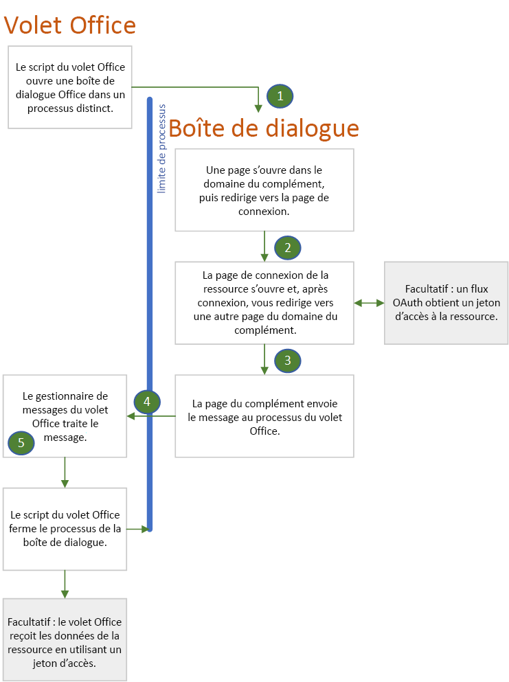

# Authentifier et autoriser avec l’API de dialogue OfficeAuthenticate and authorize with the Office dialog API

De nombreuses autorités d’identité, également appelées service d’émission de jeton de sécurité (STS), empêchent leur page de connexion de s’ouvrir dans un IFRAME.Many identity authorities, also called Secure Token Services (STS), prevent their login page from opening in an iframe. Il s'agit notamment de Google, Facebook et des services protégés par Microsoft Identity Platform (anciennement Azure AD V 2.0) tels qu'un compte Microsoft, un compte Microsoft 365 Éducation ou travail, ou tout autre compte commun.These include Google, Facebook, and services protected by Microsoft Identity Platform (formerly Azure AD V 2.0) such as a Microsoft account, a Microsoft 365 Education or work account, or other common account. Cela a pour effet de créer un problème pour les compléments Office, car lorsque le complément est exécuté dans **Office sur le Web**, le volet Office est un IFRAME.This creates a problem for Office Add-ins because when the add-in is running in **Office on the web**, the task pane is an iframe. Les utilisateurs d’un complément peuvent se connecter à l’un de ces services uniquement si le complément peut ouvrir une instance de navigateur entièrement distincte.Users of an add-in can only login to one of these services if the add-in can open an entirely separate browser instance. C’est la raison pour laquelle Office fournit son [API de boîte de dialogue Office](dialog-api-in-office-add-ins.md), à savoir la méthode [displayDialogAsync](/javascript/api/office/office.ui).This is why Office provides its [Office dialog API](dialog-api-in-office-add-ins.md), specifically the [displayDialogAsync](/javascript/api/office/office.ui) method.

> [!NOTE]
> Cet article part du principe que vous êtes familiarisé(e) avec [Utiliser l’API de boîte de dialogue Office](dialog-api-in-office-add-ins.md) dans vos compléments Office.This article assumes that you are familiar with [Use the Office dialog API in your Office Add-ins](dialog-api-in-office-add-ins.md).

La boîte de dialogue ouverte avec cette API présente les caractéristiques suivantes :The dialog box that is opened with this API has the following characteristics:

- C'est [non modal](https://en.wikipedia.org/wiki/Dialog_box).It is [nonmodal](https://en.wikipedia.org/wiki/Dialog_box).
- Il s’agit d’une instance de navigateur totalement distincte du volet de tâches, ce qui signifie :It is a completely separate browser instance from the task pane, meaning:
  - Elle possède ses propres environnements d’exécution JavaScript et objets de fenêtre et variables globales.It has its own JavaScript runtime environment and window object and global variables.
  - Il n’existe pas d’environnement d’exécution partagé dans le volet des tâches.There is no shared execution environment with the task pane.
  - Il ne partage pas le même espace de stockage de session (la propriété [Window.sessionStorage](https://developer.mozilla.org/docs/Web/API/Window/sessionStorage)) que le volet Office.It does not share the same session storage (the [Window.sessionStorage](https://developer.mozilla.org/docs/Web/API/Window/sessionStorage) property) as the task pane.
- La première page ouverte dans la boîte de dialogue doit être hébergée dans le même domaine que le volet des tâches, y compris le protocole, les sous-domaines et le port, le cas échéant.The first page opened in the dialog box must be hosted in the same domain as the task pane, including protocol, subdomains, and port, if any.
- La boîte de dialogue peut renvoyer les informations au volet des tâches à l’aide de la méthode [messageParent](/javascript/api/office/office.ui#messageparent-message-), mais cette méthode ne peut être appelée que depuis une page hébergée dans le même domaine que le volet des tâches, y compris le protocole, les sous-domaines et le port.The dialog box can send information back to the task pane by using the [messageParent](/javascript/api/office/office.ui#messageparent-message-) method, but this method can be called only from a page that is hosted in the same domain as the task pane, including protocol, subdomains, and port.

Lorsque la boîte de dialogue n’est pas un IFRAME (qui est la valeur par défaut), elle peut ouvrir la page de connexion d’un fournisseur d’identité.When the dialog box is not an iframe (which is the default), it can open the login page of an identity provider. Comme vous le verrez dans la section ci-dessous, les caractéristiques de la boîte de dialogue Office ont une incidence sur la manière dont vous utilisez les bibliothèques d’authentification ou d’autorisation telles que MSAL et Passport.As you'll see below, the characteristics of the Office dialog box have implications for how you use authentication or authorization libraries such as MSAL and Passport.

> [!NOTE]
> Vous pouvez configurer la boîte de dialogue pour qu’elle s’ouvre dans un IFRAME flottant : vous pouvez simplement transmettre l’ `displayInIframe: true`option dans l’appel à`displayDialogAsync`.There is a way to configure the dialog box to open in a floating iframe: you simply pass the `displayInIframe: true` option in the call to `displayDialogAsync`. Ne le faites *pas* lorsque vous utilisez l’API de boîte de dialogue Office pour la connexion.Do *not* do this when you are using the Office dialog API for login.

## Flux d’authentification avec la boîte de dialogue OfficeAuthentication flow with the Office dialog box

Voici un flux d’authentification simple et standard.The following is a simple and typical authentication flow. Les détails sont répertoriés après le diagramme.Details are after the diagram.

1. La première page qui s’ouvre dans la boîte de dialogue est une page (ou toute autre ressource) qui est hébergée dans le domaine du complément ; autrement dit, le même domaine que la fenêtre du volet des tâches.The first page that opens in the dialog box is a page (or other resource) that is hosted in the add-in's domain; that is, the same domain as the task pane window. Cette page peut avoir une IU simple indiquant « Veuillez patienter, nous allons vous rediriger vers la page sur laquelle vous pouvez vous connecter à *NOM DU FOURNISSEUR* ».This page can have a simple UI that says "Please wait, we are redirecting you to the page where you can sign in to *NAME-OF-PROVIDER*." Le code dans cette page construit l’URL de la page de connexion du fournisseur d’identité en utilisant les informations transmises à la boîte de dialogue, comme décrit dans [Transmission d’informations à la boîte de dialogue](dialog-api-in-office-add-ins.md#pass-information-to-the-dialog-box) ou est codée en dur dans un fichier de configuration du complément, tel qu’un fichier web.config.The code in this page constructs the URL of the identity provider's sign-in page with information that is either passed to the dialog box as described in [Pass information to the dialog box](dialog-api-in-office-add-ins.md#pass-information-to-the-dialog-box) or is hardcoded into a configuration file of the add-in, such as a web.config file.
2. La fenêtre de la boîte de dialogue redirige alors l’utilisateur vers la page de connexion.The dialog box window then redirects to the sign-in page. L’URL inclut un paramètre de requête qui indique au fournisseur d’identité de rediriger la fenêtre de la boîte de dialogue une fois que l’utilisateur s’est connecté à une page spécifique.The URL includes a query parameter that tells the identity provider to redirect the dialog box window to a specific page after the user signs in. Dans cet article, nous appellerons cette page **redirectPage.html**.In this article, we'll call this page **redirectPage.html**. *Il doit s’agir d’une page se trouvant dans le même domaine que la fenêtre hôte*, afin que les résultats de la tentative de connexion puissent être transférés au volet des tâches avec un appel de`messageParent`.*This must be a page in the same domain as the host window*, so that the results of the sign-in attempt can be passed to the task pane with a call of `messageParent`.
3. Le service du fournisseur d’identité traite la requête GET entrante à partir de la fenêtre de la boîte de dialogue.The identity provider's service processes the incoming GET request from the dialog box window. Si l’utilisateur est déjà connecté, il redirige immédiatement la fenêtre vers **redirectPage.html** et inclut les données utilisateur sous la forme d’un paramètre de requête.If the user is already signed in, it immediately redirects the window to **redirectPage.html** and includes user data as a query parameter. Si l’utilisateur n’est pas encore connecté, la page de connexion du fournisseur apparaît dans la fenêtre et l’utilisateur se connecte.If the user is not already signed in, the provider's sign-in page appears in the window, and the user signs in. Pour la plupart des fournisseurs, si l’utilisateur ne parvient pas à se connecter, le fournisseur affiche une page d’erreur dans la fenêtre de la boîte de dialogue et ne redirige pas vers **redirectPage.html**.For most providers, if the user cannot sign in successfully, the provider shows an error page in the dialog box window and does not redirect to **redirectPage.html**. L’utilisateur doit fermer la fenêtre en sélectionnant le **X** dans le coin.The user must close the window by selecting the **X** in the corner. Si l’utilisateur se connecte avec succès, la fenêtre de la boîte de dialogue est redirigée vers **redirectPage.html** et les données utilisateur sont incluses sous la forme d’un paramètre de requête.If the user successfully signs in, the dialog box window is redirected to **redirectPage.html** and user data is included as a query parameter.
4. Lorsque la page **redirectPage.html** s’ouvre, elle appelle`messageParent` pour indiquer le succès ou l’échec au volet des tâches et éventuellement indiquer également des données utilisateur ou des données d’erreur.When the **redirectPage.html** page opens, it calls `messageParent` to report the success or failure to the task pane page and optionally also report user data or error data. Les autres messages possibles incluent le passage d’un jeton d’accès ou le volet des tâches dans lequel le jeton est stocké.Other possible messages include passing an access token or telling the task pane that the token is in storage.
5. L’événement `DialogMessageReceived` se déclenche dans le volet des tâches, et son gestionnaire ferme la fenêtre de la boîte de dialogue et effectue éventuellement d’autres traitements du message.The `DialogMessageReceived` event fires in the task pane page and its handler closes the dialog box window and may further process of the message.

#### Prise en charge de plusieurs fournisseurs d’identitéSupport multiple identity providers

Si votre complément offre à l’utilisateur le choix entre plusieurs fournisseurs, tels qu’un compte Microsoft, Google ou Facebook, vous avez besoin d’une première page locale (voir section précédente) qui fournit une interface utilisateur permettant à l’utilisateur de sélectionner un fournisseur. La sélection déclenche la construction de l’URL de connexion et la redirection vers celle-ci.If your add-in gives the user a choice of providers, such as a Microsoft account, Google, or Facebook, you need a local first page (see preceding section) that provides a UI for the user to select a provider. Selection triggers the construction of the sign-in URL and redirection to it.

#### Autorisation du complément pour une ressource externeAuthorization of the add-in to an external resource

Sur le web nouvelle génération, les applications web sont des principaux de sécurité au même titre que les utilisateurs.In the modern web, users and web applications are security principals. L'application possède sa propre identité et ses propres autorisations pour une ressource en ligne telle que Microsoft 365, Google Plus, Facebook ou LinkedIn.The application has its own identity and permissions to an online resource such as Microsoft 365, Google Plus, Facebook, or LinkedIn. L’application est inscrite auprès du fournisseur de ressources avant d’être déployée.The application is registered with the resource provider before it is deployed. L’inscription inclut :The registration includes:

- La liste des autorisations dont l’application a besoin.A list of the permissions that the application needs.
- l’URL à laquelle le service de ressources doit renvoyer un jeton d’accès lorsque l’application accède au service.A URL to which the resource service should return an access token when the application accesses the service.  

Lorsqu’un utilisateur appelle une fonction dans l’application qui accède aux données de l’utilisateur dans le service de ressources, l’utilisateur est invité à se connecter au service, puis à accorder à l’application les autorisations dont elle a besoin pour les ressources de l’utilisateur. Ensuite, le service redirige la fenêtre de connexion vers l’URL précédemment inscrite et transmet le jeton d’accès. L’application utilise le jeton d’accès pour accéder aux ressources de l’utilisateur.When a user invokes a function in the application that accesses the user's data in the resource service, they are prompted to sign in to the service and then prompted to grant the application the permissions it needs to the user's resources. The service then redirects the sign-in window to the previously registered URL and passes the access token. The application uses the access token to access the user's resources.

Vous pouvez utiliser les API de dialogue Office pour gérer ce processus à l’aide d’un flux semblable à celui décrit pour la connexion des utilisateurs.You can use the Office dialog API to manage this process by using a flow that is similar to the one described for users to sign in. Les seules différences sont les suivantes :The only differences are:

- Si l’utilisateur n’a pas préalablement accordé à l’application les autorisations nécessaires, il est invité à le faire dans la boîte de dialogue après la connexion.If the user hasn't previously granted the application the permissions it needs, the user is prompted to do so in the dialog box after signing in.
- La fenêtre de la boîte de dialogue envoie le jeton d’accès vers la fenêtre hôte en utilisant `messageParent` pour envoyer le jeton d’accès converti en chaîne ou en stockant jeton d’accès à un emplacement où la fenêtre hôte peut le récupérer (et utilise `messageParent` pour indiquer à la fenêtre hôte que le jeton est disponible).The dialog box window sends the access token to the host window either by using `messageParent` to send the stringified access token or by storing the access token where the host window can retrieve it (and using `messageParent` to tell the host window that the token is available). Le jeton a une limite de temps, mais tant qu’elle n’est pas écoulée, la fenêtre hôte peut l’utiliser pour accéder directement aux ressources de l’utilisateur sans demander d’autre confirmation.The token has a time limit, but while it lasts, the host window can use it to directly access the user's resources without any further prompting.

Quelques exemples de compléments d’authentification qui utilisent l’API de boîte de dialogue Office à cet effet sont répertoriés dans les [exemples](#samples).Some authentication sample add-ins that use the Office dialog API for this purpose are listed in [Samples](#samples).

## Utilisation de bibliothèques d’authentification avec la boîte de dialogueUsing authentication libraries with the dialog box

Le fait que la boîte de dialogue Office et le volet des tâches s’exécutent dans différents navigateurs, et instances JavaScript Runtime, signifie que vous devez utiliser de nombreuses bibliothèques d’authentification et d’autorisation de manière différente que celle utilisée lorsque l’authentification et l’autorisation peuvent être effectuées dans la même fenêtre.The fact that the Office dialog box and the task pane run in different browser, and JavaScript runtime, instances means that you must use many authentication/authorization libraries in the way that is different from how they are used when authentication and authorization can take place in the same window. Les sections suivantes décrivent les principales façons dont vous ne pouvez généralement pas utiliser ces bibliothèques et la *manière* de les utiliser.The following sections describe the main ways that you usually cannot use these libraries and the way that you *can* use them.

### En général, vous ne pouvez pas utiliser le cache interne de la bibliothèque pour stocker des jetonsYou usually cannot use the library's internal cache to store tokens

En règle générale, les bibliothèques associées à l’authentification fournissent un cache en mémoire pour stocker le jeton d’accès.Typically, auth-related libraries provide an in-memory cache to store the access token. Si des appels ultérieurs au fournisseur de ressources (par exemple, Google, Microsoft Graph, Facebook, etc.) sont apportés, la bibliothèque vérifie tout d’abord si le jeton dans son cache a expiré.If subsequent calls to the resource provider (such as Google, Microsoft Graph, Facebook, etc.) are made, the library will first check to see if the token in its cache is expired. Si celui-ci n’a pas expiré, la bibliothèque renvoie le jeton mis en cache plutôt que d’effectuer un autre aller-retour vers le SJS pour un nouveau jeton.If it is unexpired, the library returns the cached token rather than making another round-trip to the STS for a new token. Mais ce modèle n’est pas utilisable dans les compléments Office. Dans la mesure où la connexion a lieu dans l’instance du navigateur de la boîte de dialogue Office, le cache du jeton est dans cette instance.But this pattern is not usable in Office Add-ins. Since the login occurs in the Office dialog box's browser instance, the token cache is in that instance.

Ceci est lié au fait qu’une bibliothèque fournit généralement des méthodes à la fois interactives et «silencieuses» pour obtenir un jeton.Closely related to this is the fact that a library will typically provide both interactive and "silent" methods for getting a token. Lorsque vous pouvez effectuer les deux appels d’authentification et de données à la ressource dans la même instance de navigateur, votre code appelle la méthode silencieuse pour obtenir un jeton juste avant que votre code n’ajoute le jeton à l’appel de données.When you can do both the authentication and the data calls to the resource in the same browser instance, your code calls the silent method to obtain a token just before your code adds the token to the data call. La méthode silencieuse vérifie la présence d’un jeton non expiré dans le cache et le renvoie, le cas échéant.The silent method checks for an unexpired token in the cache and returns it, if there is one. Dans le cas contraire, la méthode silencieuse appelle la méthode interactive qui redirige vers la connexion de STS.Otherwise, the silent method calls the interactive method which redirects to the STS's login. Une fois la connexion terminée, la méthode interactive renvoie le jeton, mais le met en cache dans la mémoire.After login completes, the interactive method returns the token, but also caches it in memory. En revanche, lorsque l’API de boîte de dialogue Office est utilisée, les données appellent la ressource, qui appellent la méthode silencieuse, se trouvent dans l’instance de navigateur du volet des tâches.But when the Office dialog API is being used, the data calls to the resource, which would call the silent method, are in the task pane's browser instance. Le cache de jetons de la bibliothèque n’existe pas dans cette instance.The library's token cache does not exist in that instance.

En guise d’alternative, l’instance de navigateur de la boîte de dialogue de votre complément peut appeler directement la méthode interactive de la bibliothèque.As an alternative, your add-in's dialog box browser instance can directly call the library's interactive method. Lorsque cette méthode renvoie un jeton, votre code doit stocker de manière explicite le jeton à l’endroit où l’instance de navigateur du volet des tâches peut le récupérer (par exemple, stockage local\* ou une base de données côté serveur).When that method returns a token, your code must explicitly store the token someplace where the task pane's browser instance can retrieve it, such as Local Storage\* or a server-side database. Une autre option consiste à transmettre le jeton au volet des tâches avec la méthode`messageParent`.Another option is to pass the token to the task pane with the `messageParent` method. Cette alternative est uniquement possible si la méthode interactive stocke le jeton d’accès à un endroit où votre code peut le lire.This alternative is only possible if the interactive method stores the access token in a place where your code can read it. Parfois, la méthode interactive d’une bibliothèque est conçue pour stocker le jeton dans une propriété privée d’un objet qui n’est pas accessible à votre code.Sometimes a library's interactive method is designed to store the token in a private property of an object that is inaccessible to your code.

> [!NOTE]
> \* Un bogue peut affecter votre stratégie de gestion des jetons.\* There is a bug that will effect your strategy for token handling. Si le complément s’exécute dans **Office sur le web** dans le navigateur Safari ou Edge, la boîte de dialogue et le volet des tâches Office ne partagent pas le même stockage local, il ne peut donc pas être utilisé pour communiquer entre eux.If the add-in is running in **Office on the web** in either the Safari or Edge browser, the dialog box and task pane do not share the same Local Storage, so it cannot be used to communicate between them.

### En général, vous ne pouvez pas utiliser l’objet «contexte d’authentification» de la bibliothèque.You usually cannot use the library's "auth context" object

Il arrive souvent qu’une bibliothèque liée à l’authentification ait une méthode qui récupère un jeton de façon interactive et crée également un objet «contexte d’authentification» que la méthode renvoie.Often, an auth-related library has a method that both obtains a token interactively and also creates an "auth-context" object which the method returns. Le jeton est une propriété de l’objet (potentiellement privé et inaccessible directement à partir de votre code).The token is a property of the object (possibly private and inaccessible directly from your code). Cet objet possède les méthodes pour recevoir les données de la ressource.That object has the methods that get data from the resource. Ces méthodes incluent le jeton dans les requêtes HTTP qu’ils font au fournisseur de ressources (par exemple, Google, Microsoft Graph, Facebook, etc.).These methods include the token in the HTTP Requests that they make to the resource provider (such as Google, Microsoft Graph, Facebook, etc.).

Ces objets de contexte d’authentification, ainsi que les méthodes qui les créent, ne sont pas utilisables dans les compléments Office. Dans la mesure où la connexion a lieu dans l’instance du navigateur de la boîte de dialogue Office, l’objet devrait être créé à cet emplacement.These auth-context objects, and the methods that create them, are not usable in Office Add-ins. Since the login occurs in the Office dialog box's browser instance, the object would have to be created there. Mais les appels de données à la ressource se trouvent dans l’instance de navigateur du volet des tâches et il n’est pas possible d’utiliser l’objet d’une instance à l’autre.But the data calls to the resource are in the task pane browser instance and there is no way to get the object from one instance to another. Par exemple, vous ne pouvez pas passer l'objet avec`messageParent` car `messageParent`peut uniquement transmettre des chaînes ou des valeurs booléennes.For example, you cannot pass the object with `messageParent` because `messageParent` can only pass strings or boolean values. Un objet JavaScript avec des méthodes ne peut pas être mis en chaîne de façon fiable.A JavaScript object with methods cannot be reliably stringified.

### Utilisation des bibliothèques avec l’API de boîte de dialogue OfficeHow you can use libraries with the Office dialog API

En plus ou au lieu de, des objets «contexte d’authentification» monolithiques, la plupart des bibliothèques fournissent des API à un niveau d’abstraction inférieur qui permettent à votre code de créer moins d’objets d’assistance monolithiques.In addition to, or instead of, monolithic "auth context" objects, most libraries provide APIs at a lower level of abstraction that enable your code to create less monolithic helper objects. Par exemple, [MSAL.NET](https://github.com/AzureAD/microsoft-authentication-library-for-dotnet/wiki#conceptual-documentation) v.For example, [MSAL.NET](https://github.com/AzureAD/microsoft-authentication-library-for-dotnet/wiki#conceptual-documentation) v. 3. x. x a une API pour créer une URL de connexion, et une autre API qui crée un objet AuthResult qui contient un jeton d’accès dans une propriété accessible à votre code.3.x.x has an API to construct a login URL, and another API that constructs an AuthResult object that contains an access token in a property that is accessible to your code. Pour consulter des exemples d’MSAL.net dans un complément Office, voir :[complément Office Microsoft Graph ASP.NET](https://github.com/OfficeDev/PnP-OfficeAddins/tree/master/Samples/auth/Office-Add-in-Microsoft-Graph-ASPNET) et [complément Outlook Microsoft Graph ASP.NET](https://github.com/OfficeDev/PnP-OfficeAddins/tree/master/Samples/auth/Outlook-Add-in-Microsoft-Graph-ASPNET).For examples of MSAL.NET in an Office add-in see: [Office Add-in Microsoft Graph ASP.NET](https://github.com/OfficeDev/PnP-OfficeAddins/tree/master/Samples/auth/Office-Add-in-Microsoft-Graph-ASPNET) and [Outlook Add-in Microsoft Graph ASP.NET](https://github.com/OfficeDev/PnP-OfficeAddins/tree/master/Samples/auth/Outlook-Add-in-Microsoft-Graph-ASPNET). Pour obtenir un exemple d’utilisation [msal.js](https://github.com/AzureAD/microsoft-authentication-library-for-js) dans un complément, voir [complément Office Microsoft Graph React](https://github.com/OfficeDev/PnP-OfficeAddins/tree/master/Samples/auth/Office-Add-in-Microsoft-Graph-React).For an example of using [msal.js](https://github.com/AzureAD/microsoft-authentication-library-for-js) in an add-in, see [Office Add-in Microsoft Graph React](https://github.com/OfficeDev/PnP-OfficeAddins/tree/master/Samples/auth/Office-Add-in-Microsoft-Graph-React).

Pour plus d’informations sur les bibliothèques d’authentification et d’autorisation, voir [Microsoft Graph : bibliothèques recommandées](authorize-to-microsoft-graph-without-sso.md#recommended-libraries-and-samples) et [autres services externes : bibliothèques](auth-external-add-ins.md#libraries).For more information about authentication and authorization libraries, see [Microsoft Graph: Recommended libraries](authorize-to-microsoft-graph-without-sso.md#recommended-libraries-and-samples) and [Other external services: Libraries](auth-external-add-ins.md#libraries).

## ExemplesSamples

- [Complément Office Microsoft Graph ASP.NET](https://github.com/OfficeDev/PnP-OfficeAddins/tree/master/Samples/auth/Office-Add-in-Microsoft-Graph-ASPNET): complément ASP.net (Excel, Word ou PowerPoint) qui utilise la bibliothèque MSAL.net et le flux de code d’autorisation pour se connecter et obtenir un jeton d’accès pour les données Microsoft Graph.[Office Add-in Microsoft Graph ASP.NET](https://github.com/OfficeDev/PnP-OfficeAddins/tree/master/Samples/auth/Office-Add-in-Microsoft-Graph-ASPNET): An ASP.NET based add-in (Excel, Word, or PowerPoint) that uses the MSAL.NET library and the Authorization Code Flow to log in and get an access token for Microsoft Graph data.
- [Complément Outlook Microsoft Graph ASP.NET](https://github.com/OfficeDev/PnP-OfficeAddins/tree/master/Samples/auth/Outlook-Add-in-Microsoft-Graph-ASPNET): comme celui ci-dessus, mais l’application Office est Outlook.[Outlook Add-in Microsoft Graph ASP.NET](https://github.com/OfficeDev/PnP-OfficeAddins/tree/master/Samples/auth/Outlook-Add-in-Microsoft-Graph-ASPNET): Just like the one above, but the Office application is Outlook.
- [Complément Office Microsoft Graph React](https://github.com/OfficeDev/PnP-OfficeAddins/tree/master/Samples/auth/Office-Add-in-Microsoft-Graph-React): complément NodeJS (Excel, Word ou PowerPoint) qui utilise la bibliothèque msal.js et le flux implicite pour se connecter et obtenir un jeton d’accès pour les données Microsoft Graph.[Office Add-in Microsoft Graph React](https://github.com/OfficeDev/PnP-OfficeAddins/tree/master/Samples/auth/Office-Add-in-Microsoft-Graph-React): A NodeJS based add-in (Excel, Word, or PowerPoint) that uses the msal.js library and the Implicit Flow to log in and get an access token for Microsoft Graph data.

Pour plus d’informations, voir :For more information, see:
- [Autoriser des services externes dans votre complément OfficeAuthorize external services in your Office Add-in](auth-external-add-ins.md)
- [Utiliser l’API de boîte de dialogue Office dans vos compléments OfficeUse the Office dialog API in your Office Add-ins](dialog-api-in-office-add-ins.md)
