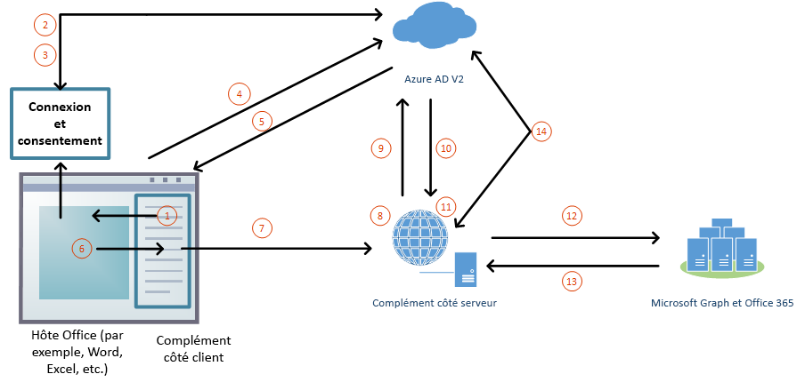

# Autoriser la connexion à Microsoft Graph avec l’authentification uniqueAuthorize to Microsoft Graph with SSO

Les utilisateurs se connectent à Office (plateformes en ligne, mobiles et de bureau) à l’aide de leur compte Microsoft personnel, de leur compte Microsoft 365 Éducation ou de leur compte de travail.Users sign in to Office (online, mobile, and desktop platforms) using either their personal Microsoft account or their Microsoft 365 Education or work account. Le meilleur moyen pour un complément Office d’obtenir un accès autorisé à [Microsoft Graph](https://developer.microsoft.com/graph/docs) est d’utiliser les informations d’identification Office de l’utilisateur.The best way for an Office Add-in to get authorized access to [Microsoft Graph](https://developer.microsoft.com/graph/docs) is to use the credentials from the user's Office sign on. Cela leur permet d’accéder à leurs données Microsoft Graph sans avoir à se connecter une deuxième fois.This enables them to access their Microsoft Graph data without needing to sign in a second time.

> [!NOTE]
> La connexion unique sur API est actuellement prise en charge pour Word, Excel et PowerPoint.The Single Sign-on API is currently supported for Word, Excel, Outlook, and PowerPoint. Pour plus d’informations sur l’endroit où l’API d’authentification unique est actuellement prise en charge, consultez la rubrique [Ensembles de conditions requises de l’API d’identité](../reference/requirement-sets/identity-api-requirement-sets.md).For more information about where the Single Sign-on API is currently supported, see [IdentityAPI requirement sets](../reference/requirement-sets/identity-api-requirement-sets.md).
> Si vous utilisez un complément Outlook, veillez à activer l’authentification moderne pour la location d’Office 365.If you are working with an Outlook add-in, be sure to enable Modern Authentication for the Office 365 tenancy. Pour plus d’informations sur la manière de procéder, voir [Exchange Online : Activation de votre client pour l’authentification moderne](https://social.technet.microsoft.com/wiki/contents/articles/32711.exchange-online-how-to-enable-your-tenant-for-modern-authentication.aspx).For information about how to do this, see [Exchange Online: How to enable your tenant for modern authentication](https://social.technet.microsoft.com/wiki/contents/articles/32711.exchange-online-how-to-enable-your-tenant-for-modern-authentication.aspx).

## Architecture de complément pour l’authentification unique et Microsoft GraphAdd-in architecture for SSO and Microsoft Graph

Outre l’hébergement des pages et du JavaScript de l’application Web, le complément doit également héberger, dans le même [nom de domaine complet](/windows/desktop/DNS/f-gly#_dns_fully_qualified_domain_name_fqdn__gly), une ou plusieurs API Web qui recevront un jeton d’accès à Microsoft Graph et effectueront des requêtes.In addition to hosting the pages and JavaScript of the web application, the add-in must also host, at the same [fully qualified domain name](/windows/desktop/DNS/f-gly#_dns_fully_qualified_domain_name_fqdn__gly), one or more web APIs that will get an access token to Microsoft Graph and make requests to it.

Le manifeste du complément contient un balisage qui spécifie comment le complément est enregistré dans le point de terminaison Azure Active Directory (Azure AD) v2.0 et il indique les autorisations à Microsoft Graph dont le complément a besoin.The add-in manifest contains markup that specifies how the add-in is registered in the Azure Active Directory (Azure AD) v2.0 endpoint, and it specifies any permissions to Microsoft Graph that the add-in needs.

### Mode de fonctionnement en cours d’exécutionHow it works at runtime

Le diagramme suivant montre comment fonctionne le processus de connexion et l’accès à Microsoft Graph.The following diagram shows how the process of signing in and getting access to Microsoft Graph works.

1. Dans le complément, JavaScript appelle une nouvelle API Office.js [getAccessToken](/javascript/api/office-runtime/officeruntime.auth#getaccesstoken-options-).In the add-in, JavaScript calls a new Office.js API [getAccessToken](/javascript/api/office-runtime/officeruntime.auth#getaccesstoken-options-). Cela indique à l’application cliente Office qu’elle doit obtenir un jeton d’accès au complément.This tells the Office client application to obtain an access token to the add-in. (Ci-après, il est appelé **jeton d’accès bootstrap**, car il est remplacé par un deuxième jeton plus loin dans le processus.(Hereafter, this is called the **bootstrap access token** because it is replaced with a second token later in the process. Pour consulter un exemple de jeton d’accès bootstrap décodé, voir [Exemple jeton d’accès](sso-in-office-add-ins.md#example-access-token).)For an example of a decoded bootstrap access token, see [Example access token](sso-in-office-add-ins.md#example-access-token).)
2. Si l’utilisateur n’est pas connecté, l’application cliente Office ouvre une fenêtre contextuelle pour qu’il se connecte.If the user is not signed in, the Office client application opens a pop-up window for the user to sign in.
3. Si c’est la première fois que l’utilisateur actuel utilise votre complément, il est invité à donner son consentement.If this is the first time the current user has used your add-in, he or she is prompted to consent.
4. L’application cliente Office demande le jeton d’accès **bootstrap** au point de terminaison Azure AD v2.0 pour l’utilisateur actuel.The Office client application requests the **bootstrap access token** from the Azure AD v2.0 endpoint for the current user.
5. Azure AD envoie le jeton d’a bootstrap à l’application cliente Office.Azure AD sends the bootstrap token to the Office client application.
6. L’application cliente Office envoie le jeton d’accès **bootstrap** au add-in dans le cadre de l’objet de résultat renvoyé par `getAccessToken` l’appel.The Office client application sends the **bootstrap access token** to the add-in as part of the result object returned by the `getAccessToken` call.
7. JavaScript dans le complément effectue une requête HTTP à une API web qui est hébergée sur le même domaine complet que le complément et inclut le **jeton d’accès bootstrap** comme preuve d’autorisation.JavaScript in the add-in makes an HTTP request to a web API that is hosted at the same fully-qualified domain as the add-in, and it includes the **bootstrap access token** as authorization proof.
8. Le code côté serveur valide le **jeton d’accès bootstrap** entrant.Server-side code validates the incoming **bootstrap access token**.
9. Le code côté serveur utilise le flux « de la part de » (défini dans [OAuth2 Token Exchange](https://tools.ietf.org/html/draft-ietf-oauth-token-exchange-02) et le daemon ou l’application serveur pour le scénario Azure de l’API [web)](/azure/active-directory/develop/active-directory-authentication-scenarios)pour obtenir un jeton d’accès pour Microsoft Graph en échange du jeton d’accès bootstrap.Server-side code uses the "on behalf of" flow (defined at [OAuth2 Token Exchange](https://tools.ietf.org/html/draft-ietf-oauth-token-exchange-02) and the [daemon or server application to web API Azure scenario](/azure/active-directory/develop/active-directory-authentication-scenarios)) to obtain an access token for Microsoft Graph in exchange for the bootstrap access token.
10. Azure AD renvoie le jeton d’accès à Microsoft Graph (et un jeton d’actualisation si le complément demande l’autorisation *offline_access*) au complément.Azure AD returns the access token to Microsoft Graph (and a refresh token, if the add-in requests *offline_access* permission) to the add-in.
11. Le code côté serveur met en cache le jeton d’accès à Microsoft Graph.Server-side code caches the access token to Microsoft Graph.
12. Le code côté serveur effectue des requêtes à Microsoft Graph et inclut le jeton d’accès à Microsoft Graph.Server-side code makes requests to Microsoft Graph and includes the access token to Microsoft Graph.
13. Microsoft Graph renvoie des données au module, qui peuvent les transmettre à l’interface utilisateur du module.Microsoft Graph returns data to the add-in, which can pass it on to the add-in's UI.
14. Lorsque le jeton d’accès à Microsoft Graph expire, le code côté serveur peut utiliser son jeton d’actualisation pour obtenir un nouveau jeton d’accès à Microsoft Graph.When the access token to Microsoft Graph expires, the server-side code can use its refresh token to get a new access token to Microsoft Graph.

## Développer un complément authentification unique qui accède à Microsoft GraphDevelop an SSO add-in that accesses Microsoft Graph

Vous développez un complément qui accède à Microsoft Graph comme vous le feriez pour n’importe quel autre complément qui utilise l’authentification unique.You develop an add-in that accesses Microsoft Graph just as you would any other add-in that uses SSO. Pour obtenir une description complète, voir [Activer l’authentification unique pour les compléments Office](../develop/sso-in-office-add-ins.md). La différence est qu’il est obligatoire que le complément ait une API Web côté serveur, et ce qu’on appelle le jeton d’accès dans cet article s’appelle le « jeton d’accès bootstrap ».For a thorough description, see [Enable single sign-on for Office Add-ins](../develop/sso-in-office-add-ins.md). The difference is that it is mandatory that the add-in have a server-side Web API, and what's called the access token in that article is called the "bootstrap access token."

Selon votre langue et votre infrastructure, des bibliothèques peuvent être disponibles pour simplifier le code côté serveur que vous devez rédiger.Depending on your language and framework, libraries might be available that will simplify the server-side code you have to write. Votre code côté serveur doit effectuer les opérations suivantes :Your code should do the following:

* Lancez le flux « de la part de » avec un appel au point de terminaison Azure AD v2.0 qui inclut le jeton d’accès bootstrap, certaines métadonnées sur l’utilisateur et les informations d’identification du module (son ID et sa question secrète).Initiate the "on behalf of" flow with a call to the Azure AD v2.0 endpoint that includes the bootstrap access token, some metadata about the user, and the credentials of the add-in (its ID and secret).
* Créer une ou plusieurs méthodes API Web qui obtiennent des données de Microsoft Graph en transmettant le jeton d’accès (potentiellement mis en cache) à Microsoft Graph.Create one or more Web API methods that get Microsoft Graph data by passing the (possibly cached) access token to Microsoft Graph.
* De manière facultative, avant d’initier le flux, validez le jeton d’accès bootstrap reçu à partir du gestionnaire de jetons que vous avez créé précédemment.Optionally, before initiating the flow, validate the add-in bootstrap access token that is received from the token handler you created earlier. Pour plus d’informations, voir [Valider le jeton d’accès](sso-in-office-add-ins.md#validate-the-access-token).For more information, see [Validate the access token](sso-in-office-add-ins.md#validate-the-access-token). 
* De manière facultative, une fois le flux terminé, mettez en cache le jeton d’accès renvoyé vers Microsoft Graph.Optionally, after the flow completes, cache the returned access token to Microsoft Graph. Nous vous conseillons de le faire si le complément effectue plusieurs appels à Microsoft Graph.You'll want to do this if the add-in makes more than one call to Microsoft Graph. Pour plus d’informations sur ce flux, voir [Azure Active Directory v2.0 et OAuth 2.0 On-Behalf-Of flow](/azure/active-directory/develop/active-directory-v2-protocols-oauth-on-behalf-of).For more information about this flow see [Azure Active Directory v2.0 and OAuth 2.0 On-Behalf-Of flow](/azure/active-directory/develop/active-directory-v2-protocols-oauth-on-behalf-of).

> [!NOTE]
> Pour consulter des exemples de jeton d’accès décodés pour Microsoft Graph qui ont été obtenus par le flux « de la part de », voir [Azure Active Directory v2.0 et OAuth 2.0 On-Behalf-Of flow](/azure/active-directory/develop/active-directory-v2-protocols-oauth-on-behalf-of).For examples of decoded access tokens for Microsoft Graph that have been obtained by the "on-behalf-of" flow, see [Azure Active Directory v2.0 and OAuth 2.0 On-Behalf-Of flow](/azure/active-directory/develop/active-directory-v2-protocols-oauth-on-behalf-of).

Pour obtenir des exemples de scénarios et procédures détaillées, consultez les rubriques suivantes :For examples of detailed walkthroughs and scenarios, see:

* [Créer un complément Office Node.js qui utilise l’authentification uniqueCreate a Node.js Office Add-in that uses single sign-on](create-sso-office-add-ins-nodejs.md)
* [Créer un complément Office ASP.NET qui utilise l’authentification uniqueCreate an ASP.NET Office Add-in that uses single sign-on](create-sso-office-add-ins-aspnet.md)
* [Scénario : Implémenter l’authentification unique pour votre service dans un complément OutlookScenario: Implement single sign-on to your service in an Outlook add-in](../outlook/implement-sso-in-outlook-add-in.md)

## Distribution de modules ssO dans Microsoft AppSourceDistributing SSO-enabled add-ins in Microsoft AppSource

Lorsqu’un administrateur Microsoft 365 acquiert un add-in à partir [d’AppSource,](https://appsource.microsoft.com)il peut le redistribuer par déploiement [centralisé](../publish/centralized-deployment.md) et accorder le consentement de l’administrateur au add-in pour accéder aux étendues Microsoft Graph.When a Microsoft 365 admin acquires an add-in from [AppSource](https://appsource.microsoft.com), the admin can redistribute it by [centralized deployment](../publish/centralized-deployment.md) and grant admin consent to the add-in to access Microsoft Graph scopes. Toutefois, il est également possible pour l’utilisateur final d’acquérir le add-in directement à partir d’AppSource, auquel cas l’utilisateur doit donner son consentement au module.It's also possible, however, for the end user to acquire the add-in directly from AppSource, in which case the user must grant consent to the add-in. Cela peut créer un problème de performances potentiel pour lequel nous avons fourni une solution.This can create a potential performance problem for which we've provided a solution.

Si votre code transmet l’option dans l’appel de , par exemple, Office peut demander à l’utilisateur son consentement si `allowConsentPrompt` `getAccessToken` Azure AD signale à Office que le consentement n’a pas encore été accordé au module. `OfficeRuntime.auth.getAccessToken( { allowConsentPrompt: true } );`If your code passes the `allowConsentPrompt` option in the call of `getAccessToken`, like `OfficeRuntime.auth.getAccessToken( { allowConsentPrompt: true } );`, then Office can prompt the user for consent if Azure AD reports to Office that consent has not yet been granted to the add-in. Toutefois, pour des raisons de sécurité, Office peut uniquement invite l’utilisateur à consentir à l’étendue Azure `profile` AD.However, for security reasons, Office can only prompt the user to consent to the Azure AD `profile` scope. Office ne peut pas être invité à consentir à des *étendues Microsoft Graph,* pas même `User.Read` .*Office cannot prompt for consent to any Microsoft Graph scopes*, not even `User.Read`. Cela signifie que si l’utilisateur donne son consentement à l’invite, Office retourne un jeton d’a bootstrap.This means that if the user grants consent on the prompt, Office will return a bootstrap token. Toutefois, la tentative d’échange du jeton d’a bootstrap contre un jeton d’accès à Microsoft Graph échouera avec l’erreur AADSTS65001, ce qui signifie que le consentement (aux étendues Microsoft Graph) n’a pas été accordé.But the attempt to exchange the bootstrap token for an access token to Microsoft Graph will fail with error AADSTS65001, which means consent (to Microsoft Graph scopes) has not been granted.

Votre code peut et doit gérer cette erreur en revenir à un autre système d’authentification, ce qui invite l’utilisateur à donner son consentement aux étendues Microsoft Graph.Your code can, and should, handle this error by falling back to an alternate system of authentication, which will prompt the user for consent to Microsoft Graph scopes. (Pour obtenir des exemples de code, voir Créer un [add-in Office Node.js](create-sso-office-add-ins-nodejs.md) qui utilise l' sign-on unique et [Create an ASP.NET Office Add-in that uses single sign-on](create-sso-office-add-ins-aspnet.md) and the samples they link to.) Toutefois, l’ensemble du processus nécessite plusieurs allers-retours vers Azure AD.(For code examples, see [Create a Node.js Office Add-in that uses single sign-on](create-sso-office-add-ins-nodejs.md) and [Create an ASP.NET Office Add-in that uses single sign-on](create-sso-office-add-ins-aspnet.md) and the samples they link to.) But the entire process requires multiple round trips to Azure AD. Vous pouvez éviter cette pénalité de performances en incluant `forMSGraphAccess` l’option dans l’appel de ; par `getAccessToken` exemple, `OfficeRuntime.auth.getAccessToken( { forMSGraphAccess: true } )` .You can avoid this performance penalty by including the `forMSGraphAccess` option in the call of `getAccessToken`; for example, `OfficeRuntime.auth.getAccessToken( { forMSGraphAccess: true } )`.  Cela indique à Office que votre application a besoin d’étendues Microsoft Graph.This signals to Office that your add-in needs Microsoft Graph scopes. Office demande à Azure AD de vérifier que le consentement aux étendues Microsoft Graph a déjà été accordé au add-in.Office will ask Azure AD to verify that consent to Microsoft Graph scopes has already been granted to the add-in. Si c’est le cas, le jeton d’a bootstrap est renvoyé.If it has, the bootstrap token will be returned. Si ce n’est pas le cas, l’appel de `getAccessToken` retournera l’erreur 13012.If it hasn't, then the call of `getAccessToken` will return error 13012. Votre code peut gérer cette erreur en revenir immédiatement à un autre système d’authentification, sans tenter d’échanger des jetons avec Azure AD.Your code can handle this error by falling back to an alternate system of authentication immediately, without making a doomed attempt to exchange tokens with Azure AD.

En tant que meilleure pratique, passez toujours aux moments où votre application sera distribuée dans AppSource et nécessite des `forMSGraphAccess` `getAccessToken` étendues Microsoft Graph.As a best practice, always pass `forMSGraphAccess` to `getAccessToken` when your add-in will be distributed in AppSource and needs Microsoft Graph scopes.

> [!TIP]
> Si vous développez un add-in Outlook qui utilise l'  luiso et que vous chargez une version test, Office retourne toujours l’erreur 13012 lorsqu’il est passé, même si le consentement de l’administrateur a été `forMSGraphAccess` `getAccessToken` accordé.If you develop an Outlook add-in that uses SSO and you sideload it for testing, Office will *always* return error 13012 when `forMSGraphAccess` is passed to `getAccessToken` even if administrator consent has been granted. Pour cette raison, vous devez commenter `forMSGraphAccess` l’option lors du développement **d’un** add-in Outlook.For this reason, you should comment out the `forMSGraphAccess` option **when developing** an Outlook add-in. N’oubliez pas de désafcommenter l’option lorsque vous déployez pour la production.Be sure to uncomment the option when you deploy for production. La fausse version 13012 se produit uniquement lorsque vous chargez une version de chargement dans Outlook.The bogus 13012 only happens when you are sideloading in Outlook.