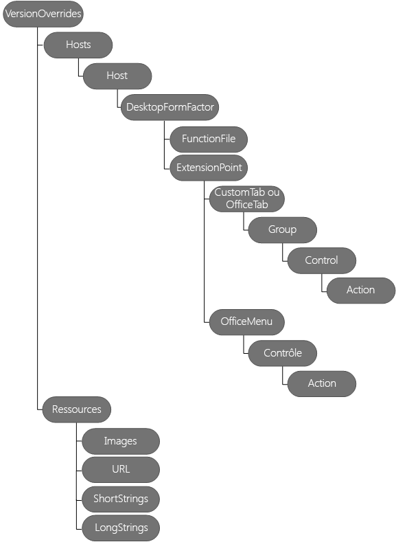

# <a name="create-add-in-commands-in-your-manifest-for-excel-word-and-powerpoint"></a><span data-ttu-id="773c1-104">Création de commandes de complément dans votre manifeste pour Excel, Word et PowerPoint</span><span class="sxs-lookup"><span data-stu-id="773c1-104">Create add-in commands in your manifest for Excel, Word, and PowerPoint</span></span>


<span data-ttu-id="773c1-p102">Utilisez **[VersionOverrides](/office/dev/add-ins/reference/manifest/versionoverrides)** dans votre manifeste pour définir des commandes de complément pour Excel, Word et PowerPoint. Les commandes de complément sont un moyen de personnaliser facilement l’interface utilisateur Office par défaut en y ajoutant des éléments d’interface de votre choix qui exécutent des actions. Vous pouvez utiliser les commandes de complément pour :</span><span class="sxs-lookup"><span data-stu-id="773c1-p102">Use **[VersionOverrides](/office/dev/add-ins/reference/manifest/versionoverrides)** in your manifest to define add-in commands for Excel, Word, and PowerPoint. Add-in commands provide an easy way to customize the default Office user interface (UI) with specified UI elements that perform actions. You can use add-in commands to:</span></span>
- <span data-ttu-id="773c1-108">créer des éléments d’interface utilisateur ou des points d’entrée qui facilitent l’utilisation des fonctionnalités de votre complément ;</span><span class="sxs-lookup"><span data-stu-id="773c1-108">Create UI elements or entry points that make your add-in's functionality easier to use.</span></span>  
  
- <span data-ttu-id="773c1-109">ajouter des boutons ou une liste déroulante de boutons sur le ruban ;</span><span class="sxs-lookup"><span data-stu-id="773c1-109">Add buttons or a drop-down list of buttons to the ribbon.</span></span>
  
- <span data-ttu-id="773c1-110">ajouter des options de menu individuelles (pouvant chacune contenir des sous-menus) à des menus contextuels spécifiques ;</span><span class="sxs-lookup"><span data-stu-id="773c1-110">Add individual menu items — each containing optional submenus — to specific context (shortcut) menus.</span></span>
  
- <span data-ttu-id="773c1-p103">exécuter des actions lorsque vous avez choisi une commande de complément. Vous pouvez effectuer les opérations suivantes :</span><span class="sxs-lookup"><span data-stu-id="773c1-p103">Perform actions when your add-in command is chosen. You can:</span></span>

  - <span data-ttu-id="773c1-p104">afficher des compléments de volet de tâches avec lesquels les utilisateurs peuvent interagir. Dans votre complément de volet de tâches, vous pouvez afficher le code HTML qui utilise la structure de l’interface utilisateur Office pour créer une interface utilisateur personnalisée ;</span><span class="sxs-lookup"><span data-stu-id="773c1-p104">Show one or more task pane add-ins for users to interact with. Inside your task pane add-in, you can display HTML that uses Office UI Fabric to create a custom UI.</span></span>

     <span data-ttu-id="773c1-115">*ou*</span><span class="sxs-lookup"><span data-stu-id="773c1-115">*or*</span></span>

  - <span data-ttu-id="773c1-116">exécuter du code JavaScript, ce qui se fait normalement sans afficher d’interface utilisateur ;</span><span class="sxs-lookup"><span data-stu-id="773c1-116">Run JavaScript code, which normally runs without displaying any UI.</span></span>

<span data-ttu-id="773c1-p105">Cet article explique comment modifier un manifeste pour définir des commandes de complément. Le schéma suivant illustre la hiérarchie des éléments utilisés pour définir des commandes de complément. Ces éléments sont décrits plus en détail dans cet article.</span><span class="sxs-lookup"><span data-stu-id="773c1-p105">This article describes how to edit your manifest to define add-in commands. The following diagram shows the hierarchy of elements used to define add-in commands. These elements are described in more detail in this article.</span></span> 

<span data-ttu-id="773c1-p106">L’image ci-après est une présentation des éléments de commandes de complément dans le fichier manifeste. </span><span class="sxs-lookup"><span data-stu-id="773c1-p106">The following image is an overview of add-in commands elements in the manifest. </span></span>

## <a name="step-1-start-from-a-sample"></a><span data-ttu-id="773c1-122">Étape 1 : démarrer à partir d’un exemple</span><span class="sxs-lookup"><span data-stu-id="773c1-122">Step 1: Start from a sample</span></span>

<span data-ttu-id="773c1-p107">Nous vous recommandons vivement de commencer à partir d’un des exemples que nous fournissons sur la page des [exemples de commandes de complément Office](https://github.com/OfficeDev/Office-Add-in-Command-Sample). Si vous le souhaitez, vous pouvez créer votre propre manifeste en suivant les étapes décrites dans ce guide. Vous pouvez valider votre manifeste à l’aide du fichier XSD sur le site des exemples de commandes de complément Office. Assurez-vous que vous avez lu la rubrique [Commandes de complément pour Excel, Word et PowerPoint](../design/add-in-commands.md) avant d’utiliser les commandes de complément.</span><span class="sxs-lookup"><span data-stu-id="773c1-p107">We strongly recommend that you start from one of the samples we provide in  [Office Add-in Commands Samples](https://github.com/OfficeDev/Office-Add-in-Command-Sample). Optionally, you can create your own manifest by following the steps in this guide. You can validate your manifest using the XSD file in the Office Add-in Commands Samples site. Ensure that you have read  [Add-in commands for Excel, Word and PowerPoint](../design/add-in-commands.md) before using add-in commands.</span></span>

## <a name="step-2-create-a-task-pane-add-in"></a><span data-ttu-id="773c1-127">Étape 2 : créer un complément de volet Office</span><span class="sxs-lookup"><span data-stu-id="773c1-127">Step 2: Create a task pane add-in</span></span>

<span data-ttu-id="773c1-p108">Pour utiliser les commandes de complément, vous devez tout d’abord créer un complément de volet Office, puis modifier le manifeste du complément, comme décrit dans cet article. Vous ne pouvez pas utiliser de commandes de complément avec les compléments de contenu. Si vous mettez à jour un manifeste existant, vous devez ajouter les **espaces de noms XML** appropriés, ainsi que l’élément **VersionOverrides** au manifeste, comme décrit à l’[étape 3 : Ajoutez l’élément VersionOverrides](#step-3-add-versionoverrides-element).</span><span class="sxs-lookup"><span data-stu-id="773c1-p108">To start using add-in commands, you must first create a task pane add-in, and then modify the add-in's manifest as described in this article. You can't use add-in commands with content add-ins. If you're updating an existing manifest, you must add the appropiate **XML namespaces** as well as add the **VersionOverrides** element to the manifest as described in [Step 3: Add VersionOverrides element](#step-3-add-versionoverrides-element).</span></span>

<span data-ttu-id="773c1-p109">L’exemple suivant illustre le manifeste d’un complément Office 2013. Ce manifeste ne contient pas de commande de complément car il n’y a pas d’élément **VersionOverrides**. Office 2013 ne prend pas en charge les commandes de complément mais, en ajoutant **VersionOverrides** à ce manifeste, votre complément s’exécute dans Office 2013 et Office 2016. Dans Office 2013, votre complément n’affiche pas les commandes de complément et utilise la valeur **SourceLocation** pour exécuter votre complément sous la forme d’un complément de volet de tâches unique. Dans Office 2016, si aucun élément **VersionOverrides** n’est inclus, **SourceLocation** est utilisé pour exécuter votre complément. Cependant, si vous incluez **VersionOverrides**, votre complément affiche uniquement les commandes de complément et n’affiche pas votre complément sous la forme d’un complément de volet de tâches unique.</span><span class="sxs-lookup"><span data-stu-id="773c1-p109">The following example shows an Office 2013 add-in's manifest. There are no add-in commands in this manifest because there is no **VersionOverrides** element. Office 2013 doesn't support add-in commands, but by adding **VersionOverrides** to this manifest, your add-in will run in both Office 2013 and Office 2016. In Office 2013, your add-in won't display add-in commands, and uses the value of **SourceLocation** to run your add-in as a single task pane add-in. In Office 2016, if no **VersionOverrides** element is included, **SourceLocation** is used to run your add-in. If you include **VersionOverrides**, however, your add-in displays the add-in commands only, and doesn't display your add-in as a single task pane add-in.</span></span>
  
```xml
<OfficeApp xmlns="http://schemas.microsoft.com/office/appforoffice/1.1" xmlns:xsi="https://www.w3.org/2001/XMLSchema-instance" xmlns:bt="http://schemas.microsoft.com/office/officeappbasictypes/1.0" xmlns:ov="http://schemas.microsoft.com/office/taskpaneappversionoverrides" xsi:type="TaskPaneApp">
  <Id>657a32a9-ab8a-4579-ac9f-df1a11a64e52</Id>
  <Version>1.0.0.0</Version>
  <ProviderName>Contoso</ProviderName>
  <DefaultLocale>en-US</DefaultLocale>
  <DisplayName DefaultValue="Contoso Add-in Commands" />
  <Description DefaultValue="Contoso Add-in Commands"/>
  <IconUrl DefaultValue="~remoteAppUrl/Images/Icon_32.png" />
 
  <AppDomains>
    <AppDomain>AppDomain1</AppDomain>
    <AppDomain>AppDomain2</AppDomain>
    <AppDomain>AppDomain3</AppDomain>
  </AppDomains>
  <Hosts>
    <Host Name="Workbook" />
  </Hosts>
  <DefaultSettings>
    <SourceLocation DefaultValue="https://www.contoso.com/Pages/Home.aspx" />
  </DefaultSettings>
  <Permissions>ReadWriteDocument</Permissions>

 <!-- The VersionOverrides element is inserted at this location in the manifest. -->

</OfficeApp>
```

## <a name="step-3-add-versionoverrides-element"></a><span data-ttu-id="773c1-136">Étape 3 : ajouter un élément VersionOverrides</span><span class="sxs-lookup"><span data-stu-id="773c1-136">Step 3: Add VersionOverrides element</span></span>

<span data-ttu-id="773c1-p110">L’élément **VersionOverrides** est l’élément racine qui contient la définition de votre commande de complément. **VersionOverrides** est un élément enfant de l’élément **OfficeApp** dans le manifeste. Le tableau suivant répertorie les attributs de l’élément **VersionOverrides**.</span><span class="sxs-lookup"><span data-stu-id="773c1-p110">The **VersionOverrides** element is the root element that contains the definition of your add-in command. **VersionOverrides** is a child element of the **OfficeApp** element in the manifest. The following table lists the attributes of the **VersionOverrides** element.</span></span>

|<span data-ttu-id="773c1-140">**Attribut**</span><span class="sxs-lookup"><span data-stu-id="773c1-140">**Attribute**</span></span>|<span data-ttu-id="773c1-141">**Description**</span><span class="sxs-lookup"><span data-stu-id="773c1-141">**Description**</span></span>|
|:-----|:-----|
|<span data-ttu-id="773c1-142">**xmlns**</span><span class="sxs-lookup"><span data-stu-id="773c1-142">**xmlns**</span></span> <br/> | <span data-ttu-id="773c1-143">Obligatoire.</span><span class="sxs-lookup"><span data-stu-id="773c1-143">Required.</span></span> <span data-ttu-id="773c1-144">Emplacement du schéma, qui doit être `http://schemas.microsoft.com/office/taskpaneappversionoverrides`.</span><span class="sxs-lookup"><span data-stu-id="773c1-144">The schema location, which must be `http://schemas.microsoft.com/office/taskpaneappversionoverrides`.</span></span> <br/> |
|<span data-ttu-id="773c1-145">**xsi:type**</span><span class="sxs-lookup"><span data-stu-id="773c1-145">**xsi:type**</span></span> <br/> |<span data-ttu-id="773c1-p112">Obligatoire. Version du schéma. La version décrite dans cet article est « VersionOverridesV1_0 ».</span><span class="sxs-lookup"><span data-stu-id="773c1-p112">Required. The schema version. The version described in this article is "VersionOverridesV1_0".</span></span>  <br/> |

<span data-ttu-id="773c1-149">Le tableau suivant présente les éléments enfants de **VersionOverrides**.</span><span class="sxs-lookup"><span data-stu-id="773c1-149">The following table identifies the child elements of **VersionOverrides**.</span></span>
  
|<span data-ttu-id="773c1-150">**Élément**</span><span class="sxs-lookup"><span data-stu-id="773c1-150">**Element**</span></span>|<span data-ttu-id="773c1-151">**Description**</span><span class="sxs-lookup"><span data-stu-id="773c1-151">**Description**</span></span>|
|:-----|:-----|
|<span data-ttu-id="773c1-152">**Description**</span><span class="sxs-lookup"><span data-stu-id="773c1-152">**Description**</span></span> <br/> |<span data-ttu-id="773c1-p113">Facultatif. Décrit le complément. Cet élément **Description** enfant remplace un élément **Description** précédent dans la partie parent du manifeste. L’attribut **resid** pour cet élément **Description** est défini sur l’**id** d’un élément **Chaîne**. L’élément **Chaîne** contient le texte pour la **description**. </span><span class="sxs-lookup"><span data-stu-id="773c1-p113">Optional. Describes the add-in. This child **Description** element overrides a previous **Description** element in the parent portion of the manifest. The **resid** attribute for this **Description** element is set to the **id** of a **String** element. The **String** element contains the text for **Description**. </span></span><br/> |
|<span data-ttu-id="773c1-158">**Configuration requise**</span><span class="sxs-lookup"><span data-stu-id="773c1-158">**Requirements**</span></span> <br/> |<span data-ttu-id="773c1-p114">Facultatif. Spécifie l’ensemble de conditions requises minimal et la version d’Office.js qui doit être activée par le complément Office. Cet élément **Configuration requise** enfant remplace l’élément **Configuration requise** dans la partie parent du manifeste. Pour plus d’informations, consultez la rubrique [Spécifier les hôtes Office et la configuration requise d’API](../develop/specify-office-hosts-and-api-requirements.md).  </span><span class="sxs-lookup"><span data-stu-id="773c1-p114">Optional. Specifies the minimum requirement set and version of Office.js that the add-in requires. This child **Requirements** element overrides the **Requirements** element in the parent portion of the manifest. For more information, see [Specify Office hosts and API requirements](../develop/specify-office-hosts-and-api-requirements.md).  </span></span><br/> |
|<span data-ttu-id="773c1-163">**Hôtes**</span><span class="sxs-lookup"><span data-stu-id="773c1-163">**Hosts**</span></span> <br/> |<span data-ttu-id="773c1-p115">Obligatoire. Spécifie une collection d’hôtes d’Office. L’élément **Hôtes** enfant remplace l’élément **Hôtes** dans la partie parent du manifeste. Vous devez inclure un ensemble d’attributs **xsi:type** à « Classeur » ou « Document ». </span><span class="sxs-lookup"><span data-stu-id="773c1-p115">Required. Specifies a collection of Office hosts. The child **Hosts** element overrides the **Hosts** element in the parent portion of the manifest. You must include a **xsi:type** attribute set to "Workbook" or "Document". </span></span><br/> |
|<span data-ttu-id="773c1-168">**Ressources**</span><span class="sxs-lookup"><span data-stu-id="773c1-168">**Resources**</span></span> <br/> |<span data-ttu-id="773c1-p116">Définit une collection de ressources (chaînes, URL et images) qui sont référencées par d’autres éléments de manifeste. Par exemple, la valeur de l’élément **Description** fait référence à un élément enfant dans **Ressources**. L’élément **Ressources** est décrit à l’[étape 7 : ajouter l’élément Ressources](#step-7-add-the-resources-element), plus loin dans cet article. </span><span class="sxs-lookup"><span data-stu-id="773c1-p116">Defines a collection of resources (strings, URLs, and images) that other manifest elements reference. For example, the **Description** element's value refers to a child element in **Resources**. The **Resources** element is described in [Step 7: Add the Resources element](#step-7-add-the-resources-element) later in this article. </span></span><br/> |

<span data-ttu-id="773c1-172">L’exemple suivant montre comment utiliser l’élément **VersionOverrides** et ses éléments enfants.</span><span class="sxs-lookup"><span data-stu-id="773c1-172">The following example shows how to use the **VersionOverrides** element and its child elements.</span></span>

```xml
<OfficeApp>
...
  <VersionOverrides xmlns="http://schemas.microsoft.com/office/taskpaneappversionoverrides" xsi:type="VersionOverridesV1_0">
    <Description resid="residDescription" />
    <Requirements>
      <!-- add information about requirement sets -->
    </Requirements>
    <Hosts>
      <Host xsi:type="Workbook">
        <!-- add information about form factors -->
      </Host>
      <Host xsi:type="Document">
        <!-- add information about form factors -->
      </Host>
    </Hosts>
    <Resources> 
      <!-- add information about resources -->
    </Resources>
  </VersionOverrides>
...
</OfficeApp>
```

## <a name="step-4-add-hosts-host-and-desktopformfactor-elements"></a><span data-ttu-id="773c1-173">Étape 4 : ajouter des éléments Hosts, Host et DesktopFormFactor</span><span class="sxs-lookup"><span data-stu-id="773c1-173">Step 4: Add Hosts, Host, and DesktopFormFactor elements</span></span>

<span data-ttu-id="773c1-p117">L’élément **Hôtes** contient un ou plusieurs éléments **Hôte**. Un élément **Hôte** spécifie un hôte Office particulier. L’élément **Hôte** contient des éléments enfants qui spécifient les commandes de complément à afficher une fois que votre complément est installé sur l’hôte Office. Pour afficher les mêmes commandes de complément dans deux ou plusieurs hôtes Office différents, vous devez dupliquer les éléments enfants dans chaque **hôte**.</span><span class="sxs-lookup"><span data-stu-id="773c1-p117">The **Hosts** element contains one or more **Host** elements. A **Host** element specifies a particular Office host. The **Host** element contains child elements that specify the add-in commands to display after your add-in is installed in that Office host. To show the same add-in commands in two or more different Office hosts, you must duplicate the child elements in each **Host**.</span></span>

<span data-ttu-id="773c1-178">L’élément **DesktopFormFactor** spécifie les paramètres d’un complément exécuté dans Office sur un bureau Windows et dans Office Online (dans un navigateur).</span><span class="sxs-lookup"><span data-stu-id="773c1-178">The **DesktopFormFactor** element specifies the settings for an add-in that runs in Office on Windows desktop, and Office Online (in browser).</span></span>

<span data-ttu-id="773c1-179">L’exemple suivant illustre l’utilisation des éléments **Hôtes**, **Hôte** et **DesktopFormFactor**.</span><span class="sxs-lookup"><span data-stu-id="773c1-179">The following is an example of **Hosts**, **Host**, and **DesktopFormFactor** elements.</span></span>

```xml
<OfficeApp>
...
  <VersionOverrides xmlns="http://schemas.microsoft.com/office/taskpaneappversionoverrides" xsi:type="VersionOverridesV1_0">
  ...
    <Hosts>
      <Host xsi:type="Workbook">
        <DesktopFormFactor>

              <!-- information about FunctionFile and ExtensionPoint -->

        </DesktopFormFactor>
      </Host>
    </Hosts>
  ...
  </VersionOverrides>
...
</OfficeApp>
```

## <a name="step-5-add-the-functionfile-element"></a><span data-ttu-id="773c1-180">Étape 5 : ajouter l’élément FunctionFile</span><span class="sxs-lookup"><span data-stu-id="773c1-180">Step 5: Add the FunctionFile element</span></span>

<span data-ttu-id="773c1-p118">L’élément **FunctionFile** définit un fichier qui contient du code JavaScript à exécuter lorsqu’une commande de complément utilise une action **ExecuteFunction** (reportez-vous à [Contrôles de bouton](/office/dev/add-ins/reference/manifest/control#button-control) pour obtenir une description). L’attribut **resid** de l’élément **FunctionFile** est défini sur un fichier HTML qui inclut tous les fichiers JavaScript requis par vos commandes de complément. Vous ne pouvez pas créer une liaison directe vers un fichier JavaScript. Vous pouvez uniquement créer une liaison vers un fichier HTML. Le nom du fichier est indiqué en tant qu’élément **Url** dans l’élément **Resources**.</span><span class="sxs-lookup"><span data-stu-id="773c1-p118">The **FunctionFile** element specifies a file that contains JavaScript code to run when an add-in command uses the **ExecuteFunction** action (see [Button controls](/office/dev/add-ins/reference/manifest/control#button-control) for a description). The **FunctionFile** element's **resid** attribute is set to a HTML file that includes all the JavaScript files your add-in commands require. You can't link directly to a JavaScript file. You can only link to an HTML file. The file name is specified as a **Url** element in the **Resources** element.</span></span>

<span data-ttu-id="773c1-186">Vous trouverez ci-dessous un exemple de l’élément **FunctionFile**.</span><span class="sxs-lookup"><span data-stu-id="773c1-186">The following is an example of the **FunctionFile** element.</span></span>
  
```xml
<DesktopFormFactor>
    <FunctionFile resid="residDesktopFuncUrl" />
    <ExtensionPoint xsi:type="PrimaryCommandSurface">
      <!-- information about this extension point -->
    </ExtensionPoint> 

    <!-- You can define more than one ExtensionPoint element as needed -->
</DesktopFormFactor>
```

> [!IMPORTANT]
> <span data-ttu-id="773c1-187">Assurez-vous que votre code JavaScript appelle `Office.initialize`.</span><span class="sxs-lookup"><span data-stu-id="773c1-187">Make sure your JavaScript code calls  `Office.initialize`.</span></span>

<span data-ttu-id="773c1-p119">Le code JavaScript dans le fichier HTML référencé par l’élément **FunctionFile** doit appeler `Office.initialize`. L’élément **FunctionName** (reportez-vous à [Contrôles de bouton](/office/dev/add-ins/reference/manifest/control#button-control) pour obtenir une description) utilise les fonctions de **FunctionFile**.</span><span class="sxs-lookup"><span data-stu-id="773c1-p119">The JavaScript in the HTML file referenced by the **FunctionFile** element must call `Office.initialize`. The **FunctionName** element (see [Button controls](/office/dev/add-ins/reference/manifest/control#button-control) for a description) uses the functions in **FunctionFile**.</span></span>

<span data-ttu-id="773c1-190">Le code suivant montre comment implémenter la fonction utilisée par **FunctionName**.</span><span class="sxs-lookup"><span data-stu-id="773c1-190">The following code shows how to implement the function used by **FunctionName**.</span></span>

```javascript

<script>
    // The initialize function must be run each time a new page is loaded.
    (function () {
        Office.initialize = function (reason) {
            // If you need to initialize something you can do so here.
        };
    })();

    // Your function must be in the global namespace.
    function writeText(event) {

        // Implement your custom code here. The following code is a simple example.  
        Office.context.document.setSelectedDataAsync("ExecuteFunction works. Button ID=" + event.source.id,
            function (asyncResult) {
                var error = asyncResult.error;
                if (asyncResult.status === Office.AsyncResultStatus.Failed) {
                    // Show error message.
                }
                else {
                    // Show success message.
                }
            });

        // Calling event.completed is required. event.completed lets the platform know that processing has completed. 
        event.completed();
    }
</script>
```

> [!IMPORTANT]
> <span data-ttu-id="773c1-p120">L’appel de l’élément **event.completed** indique que vous avez correctement géré l’événement. Lorsqu’une fonction est appelée plusieurs fois (par exemple, lorsque l’utilisateur clique plusieurs fois sur une même commande de complément), tous les événements sont automatiquement mis en file d’attente. Le premier événement s’exécute automatiquement, tandis que les autres événements restent dans la file d’attente. Lorsque votre fonction appelle **event.completed**, l’appel de la file d’attente suivant de cette fonction s’exécute. Vous devez implémenter **event.completed** pour que votre fonction s’exécute correctement.</span><span class="sxs-lookup"><span data-stu-id="773c1-p120">The call to **event.completed** signals that you have successfully handled the event. When a function is called multiple times, such as multiple clicks on the same add-in command, all events are automatically queued. The first event runs automatically, while the other events remain on the queue. When your function calls **event.completed**, the next queued call to that function runs. You must implement **event.completed**, otherwise your function will not run.</span></span>

## <a name="step-6-add-extensionpoint-elements"></a><span data-ttu-id="773c1-196">Etape 6 : ajouter des éléments ExtensionPoint</span><span class="sxs-lookup"><span data-stu-id="773c1-196">Step 6: Add ExtensionPoint elements</span></span>

<span data-ttu-id="773c1-p121">L’élément **ExtensionPoint** définit où les commandes de complément doivent apparaître dans l’interface utilisateur Office. Vous pouvez définir les éléments **ExtensionPoint** avec ces valeurs **xsi:type** :</span><span class="sxs-lookup"><span data-stu-id="773c1-p121">The **ExtensionPoint** element defines where add-in commands should appear in the Office UI. You can define **ExtensionPoint** elements with these **xsi:type** values:</span></span>

- <span data-ttu-id="773c1-199">**PrimaryCommandSurface**, qui fait référence au ruban dans Office.</span><span class="sxs-lookup"><span data-stu-id="773c1-199">**PrimaryCommandSurface**, which refers to the ribbon in Office.</span></span>

- <span data-ttu-id="773c1-200">**ContextMenu**, qui est le menu contextuel qui apparaît lorsque vous cliquez avec le bouton droit de la souris dans l’interface utilisateur Office.</span><span class="sxs-lookup"><span data-stu-id="773c1-200">**ContextMenu**, which is the shortcut menu that appears when you right-click in the Office UI.</span></span>

<span data-ttu-id="773c1-201">Les exemples suivants montrent comment utiliser l’élément **ExtensionPoint** avec les valeurs d’attribut **PrimaryCommandSurface** et **ContextMenu**, ainsi que les éléments enfants qui doivent être utilisés avec chacune d’elles.</span><span class="sxs-lookup"><span data-stu-id="773c1-201">The following examples show how to use the **ExtensionPoint** element with **PrimaryCommandSurface** and **ContextMenu** attribute values, and the child elements that should be used with each.</span></span>

> [!IMPORTANT]
> <span data-ttu-id="773c1-p122">Pour les éléments qui contiennent un attribut ID, veillez à indiquer un ID unique. Nous vous recommandons d’utiliser le nom de votre organisation, ainsi que votre ID. Par exemple, utilisez le format suivant : `<CustomTab id="mycompanyname.mygroupname">`.</span><span class="sxs-lookup"><span data-stu-id="773c1-p122">For elements that contain an ID attribute, make sure you provide a unique ID. We recommend that you use your company's name along with your ID. For example, use the following format: `<CustomTab id="mycompanyname.mygroupname">`.</span></span> 
  
```xml
<ExtensionPoint xsi:type="PrimaryCommandSurface">
  <CustomTab id="Contoso Tab">
  <!-- If you want to use a default tab that comes with Office, remove the above CustomTab element, and then uncomment the following OfficeTab element -->
  <!-- <OfficeTab id="TabData"> -->
    <Label resid="residLabel4" />
    <Group id="Group1Id12">
      <Label resid="residLabel4" />
      <Icon>
        <bt:Image size="16" resid="icon1_32x32" />
        <bt:Image size="32" resid="icon1_32x32" />
        <bt:Image size="80" resid="icon1_32x32" />
      </Icon>
      <Tooltip resid="residToolTip" />
      <Control xsi:type="Button" id="Button1Id1">

        <!-- information about the control -->
      </Control>
      <!-- other controls, as needed -->
    </Group>
  </CustomTab>
</ExtensionPoint>
<ExtensionPoint xsi:type="ContextMenu">
  <OfficeMenu id="ContextMenuCell">
    <Control xsi:type="Menu" id="ContextMenu2">
            <!-- information about the control -->
    </Control>
    <!-- other controls, as needed -->
  </OfficeMenu>
</ExtensionPoint>
```

|<span data-ttu-id="773c1-205">**Élément**</span><span class="sxs-lookup"><span data-stu-id="773c1-205">**Element**</span></span>|<span data-ttu-id="773c1-206">**Description**</span><span class="sxs-lookup"><span data-stu-id="773c1-206">**Description**</span></span>|
|:-----|:-----|
|<span data-ttu-id="773c1-207">**CustomTab**</span><span class="sxs-lookup"><span data-stu-id="773c1-207">**CustomTab**</span></span> <br/> |<span data-ttu-id="773c1-p123">Obligatoire si vous souhaitez ajouter un onglet personnalisé au ruban (à l’aide de **PrimaryCommandSurface**). Si vous utilisez l’élément **CustomTab**, vous ne pouvez pas utiliser l’élément **OfficeTab**. L’attribut **id** est obligatoire. </span><span class="sxs-lookup"><span data-stu-id="773c1-p123">Required if you want to add a custom tab to the ribbon (using **PrimaryCommandSurface**). If you use the **CustomTab** element, you can't use the **OfficeTab** element. The **id** attribute is required. </span></span><br/> |
|<span data-ttu-id="773c1-211">**OfficeTab**</span><span class="sxs-lookup"><span data-stu-id="773c1-211">**OfficeTab**</span></span> <br/> |<span data-ttu-id="773c1-p124">Obligatoire pour étendre un onglet du ruban Office par défaut (en utilisant **PrimaryCommandSurface**). Si vous utilisez l’élément **OfficeTab**, vous ne pouvez pas utiliser l’élément **CustomTab**. </span><span class="sxs-lookup"><span data-stu-id="773c1-p124">Required if you want to extend a default Office ribbon tab (using **PrimaryCommandSurface**). If you use the **OfficeTab** element, you can't use the **CustomTab** element. </span></span><br/> <span data-ttu-id="773c1-214">Pour obtenir plus de valeurs d’onglet à utiliser avec l’attribut **id**, reportez-vous à la section [Valeurs des onglets du ruban Office par défaut](/office/dev/add-ins/reference/manifest/officetab).</span><span class="sxs-lookup"><span data-stu-id="773c1-214">For more tab values to use with the **id** attribute, see [Tab values for default Office ribbon tabs](/office/dev/add-ins/reference/manifest/officetab).</span></span>  <br/> |
|<span data-ttu-id="773c1-215">**OfficeMenu**</span><span class="sxs-lookup"><span data-stu-id="773c1-215">**OfficeMenu**</span></span> <br/> | <span data-ttu-id="773c1-p125">Obligatoire pour ajouter des commandes de complément à un menu contextuel par défaut (en utilisant **ContextMenu**). L’attribut **id** doit être défini sur : </span><span class="sxs-lookup"><span data-stu-id="773c1-p125">Required if you're adding add-in commands to a default context menu (using **ContextMenu**). The **id** attribute must be set to: </span></span><br/> <span data-ttu-id="773c1-p126">**ContextMenuText** pour Excel ou Word. Affiche l’élément dans le menu contextuel lorsque du texte est sélectionné et que l’utilisateur clique dessus avec le bouton droit de la souris. </span><span class="sxs-lookup"><span data-stu-id="773c1-p126">**ContextMenuText** for Excel or Word. Displays the item on the context menu when text is selected and then the user right-clicks on the selected text. </span></span><br/> <span data-ttu-id="773c1-p127">**ContextMenuCell** pour Excel. Affiche l’élément dans le menu contextuel lorsque l’utilisateur clique avec le bouton droit de la souris dans une cellule de la feuille de calcul. </span><span class="sxs-lookup"><span data-stu-id="773c1-p127">**ContextMenuCell** for Excel. Displays the item on the context menu when the user right-clicks on a cell on the spreadsheet. </span></span><br/> |
|<span data-ttu-id="773c1-222">**Group**</span><span class="sxs-lookup"><span data-stu-id="773c1-222">**Group**</span></span> <br/> |<span data-ttu-id="773c1-p128">Groupe de points d’extension de l’interface utilisateur sur un onglet. Un groupe peut contenir jusqu’à six contrôles. L’attribut **id** est obligatoire. Il s’agit d’une chaîne avec un maximum de 125 caractères. </span><span class="sxs-lookup"><span data-stu-id="773c1-p128">A group of user interface extension points on a tab. A group can have up to six controls. The **id** attribute is required. It's a string with a maximum of 125 characters. </span></span><br/> |
|<span data-ttu-id="773c1-226">**Label**</span><span class="sxs-lookup"><span data-stu-id="773c1-226">**Label**</span></span> <br/> |<span data-ttu-id="773c1-p129">Obligatoire. L’étiquette du groupe. L’attribut **resid** doit être défini sur la valeur de l’attribut **id** d’un élément **Chaîne**. **Chaîne** est un enfant de l’élément **ShortStrings**, qui est lui-même un enfant de l’élément **Ressources**. </span><span class="sxs-lookup"><span data-stu-id="773c1-p129">Required. The label of the group. The **resid** attribute must be set to the value of the **id** attribute of a **String** element. The **String** element is a child element of the **ShortStrings** element, which is a child element of the **Resources** element. </span></span><br/> |
|<span data-ttu-id="773c1-231">**Icon**</span><span class="sxs-lookup"><span data-stu-id="773c1-231">**Icon**</span></span> <br/> |<span data-ttu-id="773c1-p130">Obligatoire. Spécifie l’icône du groupe à utiliser sur de petits appareils, ou lorsqu’un nombre trop important de boutons est affiché. L’attribut **resid** doit être défini sur la valeur de l’attribut **id** d’un élément **Image**. **Image** est un enfant de l’élément **Images**, qui est lui-même un enfant de l’élément **Ressources**. L’attribut **size** donne la taille, en pixels, de l’image. Trois tailles d’images sont obligatoires : 16, 32 et 80. 5 tailles facultatives sont également prises en charge : 20, 24, 40, 48 et 64. </span><span class="sxs-lookup"><span data-stu-id="773c1-p130">Required. Specifies the group's icon to be used on small form factor devices, or when too many buttons are displayed. The **resid** attribute must be set to the value of the **id** attribute of an **Image** element. The **Image** element is a child element of the **Images** element, which is a child element of the **Resources** element. The **size** attribute gives the size, in pixels, of the image. Three image sizes are required: 16, 32, and 80. Five optional sizes are also supported: 20, 24, 40, 48, and 64. </span></span><br/> |
|<span data-ttu-id="773c1-239">**Tooltip**</span><span class="sxs-lookup"><span data-stu-id="773c1-239">**Tooltip**</span></span> <br/> |<span data-ttu-id="773c1-p131">Facultatif. Info-bulle du groupe. L’attribut **resid** doit être défini sur la valeur de l’attribut **id** d’un élément **Chaîne**. **Chaîne** est un enfant de l’élément **LongStrings**, qui est lui-même un enfant de l’élément **Ressources**. </span><span class="sxs-lookup"><span data-stu-id="773c1-p131">Optional. The tooltip of the group. The **resid** attribute must be set to the value of the **id** attribute of a **String** element. The **String** element is a child element of the **LongStrings** element, which is a child element of the **Resources** element. </span></span><br/> |
|<span data-ttu-id="773c1-244">**Control**</span><span class="sxs-lookup"><span data-stu-id="773c1-244">**Control**</span></span> <br/> |<span data-ttu-id="773c1-p132">Chaque groupe exige au moins un contrôle. Un élément **Control** peut être de type **Button** ou **Menu**. Utilisez **Menu** pour spécifier une liste déroulante de contrôles de bouton. Actuellement, seuls les boutons et les menus sont pris en charge. Pour plus d’informations, reportez-vous aux sections [Contrôles de bouton](/office/dev/add-ins/reference/manifest/control#button-control) et [Contrôles de menu](/office/dev/add-ins/reference/manifest/control#menu-dropdown-button-controls). </span><span class="sxs-lookup"><span data-stu-id="773c1-p132">Each group requires at least one control. A **Control** element can be either a **Button** or a **Menu**. Use **Menu** to specify a drop-down list of button controls. Currently, only buttons and menus are supported. See the  [Button controls](/office/dev/add-ins/reference/manifest/control#button-control) and [Menu controls](/office/dev/add-ins/reference/manifest/control#menu-dropdown-button-controls) sections for more information. </span></span><br/><span data-ttu-id="773c1-250">**Remarque :** pour faciliter les opérations de dépannage, nous vous recommandons d’ajouter un élément **Control** et les éléments enfants **Resources** associés un par un.</span><span class="sxs-lookup"><span data-stu-id="773c1-250">**Note:** To make troubleshooting easier, we recommend that you add a **Control** element and the related **Resources** child elements one at a time.</span></span>          |


### <a name="button-controls"></a><span data-ttu-id="773c1-251">Contrôles de bouton</span><span class="sxs-lookup"><span data-stu-id="773c1-251">Button controls</span></span>

<span data-ttu-id="773c1-p133">Un bouton effectue une action unique quand il est sélectionné. Il peut exécuter une fonction JavaScript ou afficher un volet de tâches. L’exemple suivant montre comment définir deux boutons. Le premier bouton exécute une fonction JavaScript sans afficher d’interface utilisateur et le deuxième bouton affiche un volet de tâches. Dans l’élément **Contrôle** :</span><span class="sxs-lookup"><span data-stu-id="773c1-p133">A button performs a single action when the user selects it. It can either execute a JavaScript function or show a task pane. The following example shows how to define two buttons. The first button runs a JavaScript function without showing a UI, and the second button shows a task pane. In the **Control** element:</span></span>

- <span data-ttu-id="773c1-257">l’attribut **type** est obligatoire et doit être défini sur **Button**.</span><span class="sxs-lookup"><span data-stu-id="773c1-257">The **type** attribute is required, and must be set to **Button**.</span></span>

- <span data-ttu-id="773c1-258">l’attribut \*\* id\*\* de l’élément **Contrôle** est une chaîne avec un maximum de 125 caractères.</span><span class="sxs-lookup"><span data-stu-id="773c1-258">The **id** attribute of the **Control** element is a string with a maximum of 125 characters.</span></span>

```xml
<!-- Define a control that calls a JavaScript function. -->
<Control xsi:type="Button" id="Button1Id1">
  <Label resid="residLabel" />
  <Tooltip resid="residToolTip" />
  <Supertip>
    <Title resid="residLabel" />
    <Description resid="residToolTip" />
  </Supertip>
  <Icon>
    <bt:Image size="16" resid="icon1_32x32" />
    <bt:Image size="32" resid="icon1_32x32" />
    <bt:Image size="80" resid="icon1_32x32" />
  </Icon>
  <Action xsi:type="ExecuteFunction">
    <FunctionName>getData</FunctionName>
  </Action>
</Control>

<!-- Define a control that shows a task pane. -->
<Control xsi:type="Button" id="Button2Id1">
  <Label resid="residLabel2" />
  <Tooltip resid="residToolTip" />
  <Supertip>
    <Title resid="residLabel" />
    <Description resid="residToolTip" />
  </Supertip>
  <Icon>
    <bt:Image size="16" resid="icon2_32x32" />
    <bt:Image size="32" resid="icon2_32x32" />
    <bt:Image size="80" resid="icon2_32x32" />
  </Icon>
  <Action xsi:type="ShowTaskpane">
    <SourceLocation resid="residUnitConverterUrl" />
  </Action>
</Control>
```

|<span data-ttu-id="773c1-259">**Éléments**</span><span class="sxs-lookup"><span data-stu-id="773c1-259">**Elements**</span></span>|<span data-ttu-id="773c1-260">**Description**</span><span class="sxs-lookup"><span data-stu-id="773c1-260">**Description**</span></span>|
|:-----|:-----|
|<span data-ttu-id="773c1-261">**Label**</span><span class="sxs-lookup"><span data-stu-id="773c1-261">**Label**</span></span> <br/> |<span data-ttu-id="773c1-p134">Obligatoire. Texte du bouton. L’attribut **resid** doit être défini sur la valeur de l’attribut **id** d’un élément **Chaîne**. **Chaîne** est un enfant de l’élément **ShortStrings**, qui est lui-même un enfant de l’élément **Ressources**. </span><span class="sxs-lookup"><span data-stu-id="773c1-p134">Required. The text for the button. The **resid** attribute must be set to the value of the **id** attribute of a **String** element. The **String** element is a child element of the **ShortStrings** element, which is a child element of the **Resources** element. </span></span><br/> |
|<span data-ttu-id="773c1-266">**Tooltip**</span><span class="sxs-lookup"><span data-stu-id="773c1-266">**Tooltip**</span></span> <br/> |<span data-ttu-id="773c1-p135">Facultatif. Info-bulle pour le bouton. L’attribut **resid** doit être défini sur la valeur de l’attribut **id** d’un élément **Chaîne**. **Chaîne** est un enfant de l’élément **LongStrings**, qui est lui-même un enfant de l’élément **Ressources**. </span><span class="sxs-lookup"><span data-stu-id="773c1-p135">Optional. The tooltip for the button. The **resid** attribute must be set to the value of the **id** attribute of a **String** element. The **String** element is a child element of the **LongStrings** element, which is a child element of the **Resources** element. </span></span><br/> |
|<span data-ttu-id="773c1-271">**Supertip**</span><span class="sxs-lookup"><span data-stu-id="773c1-271">**Supertip**</span></span> <br/> | <span data-ttu-id="773c1-p136">Obligatoire. Info-bulle multiligne associée à ce bouton, qui est définie de la façon suivante : </span><span class="sxs-lookup"><span data-stu-id="773c1-p136">Required. The supertip for this button, which is defined by the following: </span></span><br/> <span data-ttu-id="773c1-274">**Titre**</span><span class="sxs-lookup"><span data-stu-id="773c1-274">**Title**</span></span> <br/>  <span data-ttu-id="773c1-p137">Obligatoire. Texte de l’info-bulle améliorée. L’attribut **resid** doit être défini sur la valeur de l’attribut **id** d’un élément **Chaîne**. **Chaîne** est un enfant de l’élément **ShortStrings**, qui est lui-même un enfant de l’élément **Ressources**. </span><span class="sxs-lookup"><span data-stu-id="773c1-p137">Required. The text for the supertip. The **resid** attribute must be set to the value of the **id** attribute of a **String** element. The **String** element is a child element of the **ShortStrings** element, which is a child element of the **Resources** element. </span></span><br/> <span data-ttu-id="773c1-279">**Description**</span><span class="sxs-lookup"><span data-stu-id="773c1-279">**Description**</span></span> <br/>  <span data-ttu-id="773c1-p138">Obligatoire. Description de l’info-bulle. L’attribut **resid** doit être défini sur la valeur de l’attribut **id** d’un élément **Chaîne**. **Chaîne** est un enfant de l’élément **LongStrings**, qui est lui-même un enfant de l’élément **Ressources**. </span><span class="sxs-lookup"><span data-stu-id="773c1-p138">Required. The description for the supertip. The **resid** attribute must be set to the value of the **id** attribute of a **String** element. The **String** element is a child element of the **LongStrings** element, which is a child element of the **Resources** element. </span></span><br/> |
|<span data-ttu-id="773c1-284">**Icon**</span><span class="sxs-lookup"><span data-stu-id="773c1-284">**Icon**</span></span> <br/> | <span data-ttu-id="773c1-p139">Obligatoire. Contient les éléments **Image** pour le bouton. Les fichiers image doivent être au format .png. </span><span class="sxs-lookup"><span data-stu-id="773c1-p139">Required. Contains the **Image** elements for the button. Image files must be .png format. </span></span><br/> <span data-ttu-id="773c1-288">**Image**</span><span class="sxs-lookup"><span data-stu-id="773c1-288">**Image**</span></span> <br/>  <span data-ttu-id="773c1-p140">Définit une image à afficher sur le bouton. L’attribut **resid** doit être défini sur la valeur de l’attribut **id** d’un élément **Image**. **Image** est un enfant de l’élément **Images**, qui est lui-même un enfant de l’élément **Ressources**. L’attribut **size** indique la taille, en pixels, de l’image. Trois tailles d’images sont obligatoires : 16, 32 et 80. 5 tailles facultatives sont également prises en charge : 20, 24, 40, 48 et 64. </span><span class="sxs-lookup"><span data-stu-id="773c1-p140">Defines an image to display on the button. The **resid** attribute must be set to the value of the **id** attribute of an **Image** element. The **Image** element is a child element of the **Images** element, which is a child element of the **Resources** element. The **size** attribute indicates the size, in pixels, of the image. Three image sizes are required: 16, 32, and 80. Five optional sizes are also supported: 20, 24, 40, 48, and 64. </span></span><br/> |
|<span data-ttu-id="773c1-295">**Action**</span><span class="sxs-lookup"><span data-stu-id="773c1-295">**Action**</span></span> <br/> | <span data-ttu-id="773c1-p141">Obligatoire. Indique l’action à réaliser lorsque l’utilisateur sélectionne le bouton. Vous pouvez spécifier une des valeurs suivantes pour l’attribut **xsi:type** : </span><span class="sxs-lookup"><span data-stu-id="773c1-p141">Required. Specifies the action to perform when the user selects the button. You can specify one of the following values for the **xsi:type** attribute: </span></span><br/> <span data-ttu-id="773c1-p142">**ExecuteFunction**, qui exécute une fonction JavaScript située dans le fichier référencé par **FunctionFile**. **ExecuteFunction** n’affiche pas d’interface utilisateur. L’élément enfant **FunctionName** spécifie le nom de la fonction à exécuter.</span><span class="sxs-lookup"><span data-stu-id="773c1-p142">**ExecuteFunction**, which runs a JavaScript function located in the file referenced by **FunctionFile**. **ExecuteFunction** does not display a UI. The **FunctionName** child element specifies the name of the function to execute. </span></span><br/> <span data-ttu-id="773c1-p143">**ShowTaskPane**, qui indique un complément de volet de tâches. L’élément enfant **SourceLocation** indique l’emplacement du fichier source du complément de volet de tâches à afficher. L’attribut **resid** doit être défini sur la valeur de l’attribut **id** d’un élément **Url** dans l’élément **Urls** dans l’élément **Ressources**. </span><span class="sxs-lookup"><span data-stu-id="773c1-p143">**ShowTaskPane**, which shows a task pane add-in. The **SourceLocation** child element specifies the source file location of the task pane add-in to display. The **resid** attribute must be set to the value of the **id** attribute of a **Url** element in the **Urls** element in the **Resources** element. </span></span><br/> |


### <a name="menu-controls"></a><span data-ttu-id="773c1-305">Contrôles de menu</span><span class="sxs-lookup"><span data-stu-id="773c1-305">Menu controls</span></span>
<span data-ttu-id="773c1-306">Un contrôle de type **Menu** peut être utilisé avec **PrimaryCommandSurface** ou **ContextMenu**, et permet de définir :</span><span class="sxs-lookup"><span data-stu-id="773c1-306">A **Menu** control can be used with either **PrimaryCommandSurface** or **ContextMenu**, and defines:</span></span>
  
- <span data-ttu-id="773c1-307">une option de menu de niveau racine.</span><span class="sxs-lookup"><span data-stu-id="773c1-307">A root-level menu item.</span></span>

- <span data-ttu-id="773c1-308">une liste de sous-menus.</span><span class="sxs-lookup"><span data-stu-id="773c1-308">A list of submenu items.</span></span>
 
<span data-ttu-id="773c1-p144">Lorsqu’il est utilisé avec **PrimaryCommandSurface**, l’option de menu de niveau racine s’affiche sous la forme d’un bouton dans le ruban. Lorsque le bouton est sélectionné, le sous-menu s’affiche sous la forme d’une liste déroulante. Lorsqu’il est utilisé avec **ContextMenu**, un élément de menu avec un sous-menu est inséré dans le menu contextuel. Dans les deux cas, les éléments individuels du sous-menu peuvent exécuter une fonction JavaScript ou afficher un volet de tâches. Un seul niveau de sous-menus est pris en charge pour l’instant.</span><span class="sxs-lookup"><span data-stu-id="773c1-p144">When used with **PrimaryCommandSurface**, the root menu item displays as a button on the ribbon. When the button is selected, the submenu displays as a drop-down list. When used with **ContextMenu**, a menu item with a submenu is inserted on the context menu. In both cases, individual submenu items can either execute a JavaScript function or show a task pane. Only one level of submenus is supported at this time.</span></span>

<span data-ttu-id="773c1-p145">L’exemple de code ci-dessous indique comment définir un élément de menu comportant deux options de sous-menu. La première option de sous-menu affiche un volet de tâches et la seconde exécute une fonction JavaScript. Dans l’élément **Control** :</span><span class="sxs-lookup"><span data-stu-id="773c1-p145">The following example shows how to define a menu item with two submenu items. The first submenu item shows a task pane, and the second submenu item runs a JavaScript function. In the **Control** element:</span></span>

- <span data-ttu-id="773c1-317">l’attribut **xsi:type** est obligatoire et doit être défini sur **Menu**.</span><span class="sxs-lookup"><span data-stu-id="773c1-317">The **xsi:type** attribute is required, and must be set to **Menu**.</span></span>
  
- <span data-ttu-id="773c1-318">L’attribut **id** est une chaîne avec un maximum de 125 caractères.</span><span class="sxs-lookup"><span data-stu-id="773c1-318">The **id** attribute is a string with a maximum of 125 characters.</span></span>

```xml

<Control xsi:type="Menu" id="TestMenu2">
  <Label resid="residLabel3" />
  <Tooltip resid="residToolTip" />
  <Supertip>
    <Title resid="residLabel" />
    <Description resid="residToolTip" />
  </Supertip>
  <Icon>
    <bt:Image size="16" resid="icon1_32x32" />
    <bt:Image size="32" resid="icon1_32x32" />
    <bt:Image size="80" resid="icon1_32x32" />
  </Icon>
  <Items>
    <Item id="showGallery2">
      <Label resid="residLabel3"/>
      <Supertip>
        <Title resid="residLabel" />
        <Description resid="residToolTip" />
      </Supertip>
      <Icon>
        <bt:Image size="16" resid="icon1_32x32" />
        <bt:Image size="32" resid="icon1_32x32" />
        <bt:Image size="80" resid="icon1_32x32" />
      </Icon>
      <Action xsi:type="ShowTaskpane">
        <TaskpaneId>MyTaskPaneID1</TaskpaneId>
        <SourceLocation resid="residUnitConverterUrl" />
      </Action>
    </Item>
    <Item id="showGallery3">
      <Label resid="residLabel5"/>
      <Supertip>
        <Title resid="residLabel" />
        <Description resid="residToolTip" />
      </Supertip>
      <Icon>
        <bt:Image size="16" resid="icon4_32x32" />
        <bt:Image size="32" resid="icon4_32x32" />
        <bt:Image size="80" resid="icon4_32x32" />
      </Icon>
      <Action xsi:type="ExecuteFunction">
        <FunctionName>getButton</FunctionName>
      </Action>
    </Item>
  </Items>
</Control>
```

|<span data-ttu-id="773c1-319">**Éléments**</span><span class="sxs-lookup"><span data-stu-id="773c1-319">**Elements**</span></span>|<span data-ttu-id="773c1-320">**Description**</span><span class="sxs-lookup"><span data-stu-id="773c1-320">**Description**</span></span>|
|:-----|:-----|
|<span data-ttu-id="773c1-321">**Label**</span><span class="sxs-lookup"><span data-stu-id="773c1-321">**Label**</span></span> <br/> |<span data-ttu-id="773c1-p146">Obligatoire. Texte de l’élément de menu racine. L’attribut **resid** doit être défini sur la valeur de l’attribut **id** d’un élément **Chaîne**. **Chaîne** est un enfant de l’élément **ShortStrings**, qui est lui-même un enfant de l’élément **Ressources**. </span><span class="sxs-lookup"><span data-stu-id="773c1-p146">Required. The text of the root menu item. The **resid** attribute must be set to the value of the **id** attribute of a **String** element. The **String** element is a child element of the **ShortStrings** element, which is a child element of the **Resources** element. </span></span><br/> |
|<span data-ttu-id="773c1-326">**Tooltip**</span><span class="sxs-lookup"><span data-stu-id="773c1-326">**Tooltip**</span></span> <br/> |<span data-ttu-id="773c1-p147">Facultatif. Info-bulle du menu. L’attribut **resid** doit être défini sur la valeur de l’attribut **id** d’un élément **Chaîne**. **Chaîne** est un enfant de l’élément **LongStrings**, qui est lui-même un enfant de l’élément **Ressources**. </span><span class="sxs-lookup"><span data-stu-id="773c1-p147">Optional. The tooltip for the menu. The **resid** attribute must be set to the value of the **id** attribute of a **String** element. The **String** element is a child element of the **LongStrings** element, which is a child element of the **Resources** element. </span></span><br/> |
|<span data-ttu-id="773c1-331">**Info-bulle améliorée**</span><span class="sxs-lookup"><span data-stu-id="773c1-331">**SuperTip**</span></span> <br/> | <span data-ttu-id="773c1-p148">Obligatoire. Info-bulle multiligne associée au menu, qui est définie de la façon suivante : </span><span class="sxs-lookup"><span data-stu-id="773c1-p148">Required. The supertip for the menu, which is defined by the following: </span></span><br/> <span data-ttu-id="773c1-334">**Titre**</span><span class="sxs-lookup"><span data-stu-id="773c1-334">**Title**</span></span> <br/>  <span data-ttu-id="773c1-p149">Obligatoire. Texte de l’info-bulle améliorée. L’attribut **resid** doit être défini sur la valeur de l’attribut **id** d’un élément **Chaîne**. **Chaîne** est un enfant de l’élément **ShortStrings**, qui est lui-même un enfant de l’élément **Ressources**. </span><span class="sxs-lookup"><span data-stu-id="773c1-p149">Required. The text of the supertip. The **resid** attribute must be set to the value of the **id** attribute of a **String** element. The **String** element is a child element of the **ShortStrings** element, which is a child element of the **Resources** element. </span></span><br/> <span data-ttu-id="773c1-339">**Description**</span><span class="sxs-lookup"><span data-stu-id="773c1-339">**Description**</span></span> <br/>  <span data-ttu-id="773c1-p150">Obligatoire. Description de l’info-bulle. L’attribut **resid** doit être défini sur la valeur de l’attribut **id** d’un élément **Chaîne**. **Chaîne** est un enfant de l’élément **LongStrings**, qui est lui-même un enfant de l’élément **Ressources**. </span><span class="sxs-lookup"><span data-stu-id="773c1-p150">Required. The description for the supertip. The **resid** attribute must be set to the value of the **id** attribute of a **String** element. The **String** element is a child element of the **LongStrings** element, which is a child element of the **Resources** element. </span></span><br/> |
|<span data-ttu-id="773c1-344">**Icon**</span><span class="sxs-lookup"><span data-stu-id="773c1-344">**Icon**</span></span> <br/> | <span data-ttu-id="773c1-p151">Obligatoire. Contient les éléments **Image** du menu. Les fichiers image doivent être au format .png. </span><span class="sxs-lookup"><span data-stu-id="773c1-p151">Required. Contains the **Image** elements for the menu. Image files must be .png format. </span></span><br/> <span data-ttu-id="773c1-348">**Image**</span><span class="sxs-lookup"><span data-stu-id="773c1-348">**Image**</span></span> <br/>  <span data-ttu-id="773c1-p152">Image du menu. L’attribut **resid** doit être défini sur la valeur de l’attribut **id** d’un élément **Image**. **Image** est un enfant de l’élément **Images**, qui est lui-même un enfant de l’élément **Ressources**. L’attribut **size** indique la taille, en pixels, de l’image. Trois tailles d’image, en pixels, sont nécessaires : 16, 32 et 80. 5 tailles facultatives, en pixels, sont également prises en charge : 20, 24, 40, 48 et 64. </span><span class="sxs-lookup"><span data-stu-id="773c1-p152">An image for the menu. The **resid** attribute must be set to the value of the **id** attribute of an **Image** element. The **Image** element is a child element of the **Images** element, which is a child element of the **Resources** element. The **size** attribute indicates the size in pixels of the image. Three image sizes, in pixels, are required: 16, 32, and 80. Five optional sizes, in pixels, are also supported: 20, 24, 40, 48, and 64. </span></span><br/> |
|<span data-ttu-id="773c1-355">**Éléments**</span><span class="sxs-lookup"><span data-stu-id="773c1-355">**Items**</span></span> <br/> |<span data-ttu-id="773c1-p153">Obligatoire. Contient les éléments **Élément** pour chaque élément de sous-menu. Chaque élément **Élément** contient les mêmes éléments enfants que les [contrôles de bouton](/office/dev/add-ins/reference/manifest/control#button-control).  </span><span class="sxs-lookup"><span data-stu-id="773c1-p153">Required. Contains the **Item** elements for each submenu item. Each **Item** element contains the same child elements as [Button controls](/office/dev/add-ins/reference/manifest/control#button-control).  </span></span><br/> |
   
## <a name="step-7-add-the-resources-element"></a><span data-ttu-id="773c1-359">Étape 7 : ajouter l’élément Resources</span><span class="sxs-lookup"><span data-stu-id="773c1-359">Step 7: Add the Resources element</span></span>

<span data-ttu-id="773c1-p154">L’élément **Ressources** contient des ressources utilisées par les différents éléments enfants de l’élément **VersionOverrides**. Les ressources incluent des icônes, des chaînes et des URL. Un élément du manifeste peut utiliser une ressource en référençant l’**id** de la ressource. L’utilisation de l’**id** permet d’organiser le manifeste, en particulier lorsqu’il existe des versions différentes de la ressource pour différents paramètres régionaux. Un **id** doit comporter 32 caractères au maximum.</span><span class="sxs-lookup"><span data-stu-id="773c1-p154">The **Resources** element contains resources used by the different child elements of the **VersionOverrides** element. Resources include icons, strings, and URLs. An element in the manifest can use a resource by referencing the **id** of the resource. Using the **id** helps organize the manifest, especially when there are different versions of the resource for different locales. An **id** has a maximum of 32 characters.</span></span>
  
<span data-ttu-id="773c1-p155">L’exemple suivant montre un exemple de l’utilisation de l’élément **Ressources**. Chaque ressource peut avoir plusieurs éléments enfants **Override** afin que vous puissiez définir une ressource différente pour un paramètre régional spécifique.</span><span class="sxs-lookup"><span data-stu-id="773c1-p155">The following shows an example of how to use the **Resources** element. Each resource can have one or more **Override** child elements to define a different resource for a specific locale.</span></span>


```xml
<Resources>
  <bt:Images>
    <bt:Image id="icon1_16x16" DefaultValue="https://www.contoso.com/Images/icon_default.png">
      <bt:Override Locale="ja-jp" Value="https://www.contoso.com/Images/ja-jp16-icon_default.png" />
    </bt:Image>
    <bt:Image id="icon1_32x32" DefaultValue="https://www.contoso.com/Images/icon_default.png">
      <bt:Override Locale="ja-jp" Value="https://www.contoso.com/Images/ja-jp32-icon_default.png" />
    </bt:Image>
    <bt:Image id="icon1_80x80" DefaultValue="https://www.contoso.com/Images/icon_default.png">
      <bt:Override Locale="ja-jp" Value="https://www.contoso.com/Images/ja-jp80-icon_default.png" />
    </bt:Image>
  </bt:Images>
  <bt:Urls>
    <bt:Url id="residDesktopFuncUrl" DefaultValue="https://www.contoso.com/Pages/Home.aspx">
      <bt:Override Locale="ja-jp" Value="https://www.contoso.com/Pages/Home.aspx" />
    </bt:Url>
  </bt:Urls>
  <bt:ShortStrings>
    <bt:String id="residLabel" DefaultValue="GetData">
      <bt:Override Locale="ja-jp" Value="JA-JP-GetData" />
    </bt:String>
  </bt:ShortStrings>
  <bt:LongStrings>
    <bt:String id="residToolTip" DefaultValue="Get data for your document.">
      <bt:Override Locale="ja-jp" Value="JA-JP - Get data for your document." />
    </bt:String>
  </bt:LongStrings>
</Resources>
```

|<span data-ttu-id="773c1-367">**Ressource**</span><span class="sxs-lookup"><span data-stu-id="773c1-367">**Resource**</span></span>|<span data-ttu-id="773c1-368">**Description**</span><span class="sxs-lookup"><span data-stu-id="773c1-368">**Description**</span></span>|
|:-----|:-----|
|<span data-ttu-id="773c1-369">**Images**/ **Image**</span><span class="sxs-lookup"><span data-stu-id="773c1-369">**Images**/ **Image**</span></span> <br/> | <span data-ttu-id="773c1-p156">Fournit l’URL HTTPS d’un fichier image. Chaque image doit définir les trois tailles d’image obligatoires :</span><span class="sxs-lookup"><span data-stu-id="773c1-p156">Provides the HTTPS URL to an image file. Each image must define the three required image sizes:</span></span> <br/>  <span data-ttu-id="773c1-372">16 x 16</span><span class="sxs-lookup"><span data-stu-id="773c1-372">16×16</span></span> <br/>  <span data-ttu-id="773c1-373">32 x 32</span><span class="sxs-lookup"><span data-stu-id="773c1-373">32×32</span></span> <br/>  <span data-ttu-id="773c1-374">80 × 80</span><span class="sxs-lookup"><span data-stu-id="773c1-374">80×80</span></span> <br/>  <span data-ttu-id="773c1-375">Les tailles d’image suivantes sont également prises en charge, mais ne sont pas obligatoires :</span><span class="sxs-lookup"><span data-stu-id="773c1-375">The following image sizes are also supported, but not required:</span></span> <br/>  <span data-ttu-id="773c1-376">20 × 20</span><span class="sxs-lookup"><span data-stu-id="773c1-376">20×20</span></span> <br/>  <span data-ttu-id="773c1-377">24 × 24</span><span class="sxs-lookup"><span data-stu-id="773c1-377">24×24</span></span> <br/>  <span data-ttu-id="773c1-378">40 × 40</span><span class="sxs-lookup"><span data-stu-id="773c1-378">40×40</span></span> <br/>  <span data-ttu-id="773c1-379">48 × 48</span><span class="sxs-lookup"><span data-stu-id="773c1-379">48×48</span></span> <br/>  <span data-ttu-id="773c1-380">64 x 64</span><span class="sxs-lookup"><span data-stu-id="773c1-380">64×64</span></span> <br/> |
|<span data-ttu-id="773c1-381">**URL**/ **Url**</span><span class="sxs-lookup"><span data-stu-id="773c1-381">**Urls**/ **Url**</span></span> <br/> |<span data-ttu-id="773c1-p157">Indique un emplacement d’URL HTTPS. Une URL peut comporter 2 048 caractères au maximum.</span><span class="sxs-lookup"><span data-stu-id="773c1-p157">Provides an HTTPS URL location. A URL can be a maximum of 2048 characters.</span></span>  <br/> |
|<span data-ttu-id="773c1-384">**ShortStrings**/ **Chaîne**</span><span class="sxs-lookup"><span data-stu-id="773c1-384">**ShortStrings**/ **String**</span></span> <br/> |<span data-ttu-id="773c1-p158">Texte pour les éléments **Label** et **Title**. Chaque élément **String** comporte 125 caractères au maximum. </span><span class="sxs-lookup"><span data-stu-id="773c1-p158">The text for **Label** and **Title** elements. Each **String** contains a maximum of 125 characters. </span></span><br/> |
|<span data-ttu-id="773c1-387">**LongStrings**/ **Chaîne**</span><span class="sxs-lookup"><span data-stu-id="773c1-387">**LongStrings**/ **String**</span></span> <br/> |<span data-ttu-id="773c1-p159">Texte des éléments **Tooltip** et **Description**. Chaque élément **String** contient un maximum de 250 caractères. </span><span class="sxs-lookup"><span data-stu-id="773c1-p159">The text for **Tooltip** and **Description** elements. Each **String** contains a maximum of 250 characters. </span></span><br/> |
   > [!NOTE]
> <span data-ttu-id="773c1-390">Vous devez utiliser le protocole SSL (Secure Sockets Layer) pour toutes les URL dans les éléments **Image** et **Url**.</span><span class="sxs-lookup"><span data-stu-id="773c1-390">You must use Secure Sockets Layer (SSL) for all URLs in the **Image** and **Url** elements.</span></span>

### <a name="tab-values-for-default-office-ribbon-tabs"></a><span data-ttu-id="773c1-391">Valeurs des onglets du ruban Office par défaut</span><span class="sxs-lookup"><span data-stu-id="773c1-391">Tab values for default Office ribbon tabs</span></span>

<span data-ttu-id="773c1-p160">Dans Excel et Word, vous pouvez ajouter vos commandes de complément au ruban en utilisant les onglets de l’interface utilisateur Office par défaut. Le tableau ci-dessous contient les valeurs que vous pouvez utiliser pour l’attribut **id** de l’élément **OfficeTab**. Les valeurs des onglets respectent la casse.</span><span class="sxs-lookup"><span data-stu-id="773c1-p160">In Excel and Word, you can add your add-in commands to the ribbon by using the default Office UI tabs. The following table lists the values that you can use for the **id** attribute of the **OfficeTab** element. The tab values are case sensitive.</span></span>

|<span data-ttu-id="773c1-395">**Application hôte Office**</span><span class="sxs-lookup"><span data-stu-id="773c1-395">**Office host application**</span></span>|<span data-ttu-id="773c1-396">**Valeurs des onglets**</span><span class="sxs-lookup"><span data-stu-id="773c1-396">**Tab values**</span></span>|
|:-----|:-----|
|<span data-ttu-id="773c1-397">Excel</span><span class="sxs-lookup"><span data-stu-id="773c1-397">Excel</span></span>  <br/> |<span data-ttu-id="773c1-398">**TabHome**         **TabInsert**         **TabPageLayoutExcel**         **TabFormulas**         **TabData**         **TabReview**         **TabView**         **TabDeveloper**         **TabAddIns**         **TabPrintPreview**         **TabBackgroundRemoval**</span><span class="sxs-lookup"><span data-stu-id="773c1-398">**TabHome**         **TabInsert**         **TabPageLayoutExcel**         **TabFormulas**         **TabData**         **TabReview**         **TabView**         **TabDeveloper**         **TabAddIns**         **TabPrintPreview**         **TabBackgroundRemoval**</span></span> <br/> |
|<span data-ttu-id="773c1-399">Word</span><span class="sxs-lookup"><span data-stu-id="773c1-399">Word</span></span>  <br/> |<span data-ttu-id="773c1-400">**TabHome**         **TabInsert**         **TabWordDesign**         **TabPageLayoutWord**         **TabReferences**         **TabMailings**         **TabReviewWord**         **TabView**         **TabDeveloper**         **TabAddIns**         **TabBlogPost**         **TabBlogInsert**         **TabPrintPreview**         **TabOutlining**         **TabConflicts**         **TabBackgroundRemoval**         **TabBroadcastPresentation**</span><span class="sxs-lookup"><span data-stu-id="773c1-400">**TabHome**         **TabInsert**         **TabWordDesign**         **TabPageLayoutWord**         **TabReferences**         **TabMailings**         **TabReviewWord**         **TabView**         **TabDeveloper**         **TabAddIns**         **TabBlogPost**         **TabBlogInsert**         **TabPrintPreview**         **TabOutlining**         **TabConflicts**         **TabBackgroundRemoval**         **TabBroadcastPresentation**</span></span> <br/> |
|<span data-ttu-id="773c1-401">PowerPoint</span><span class="sxs-lookup"><span data-stu-id="773c1-401">PowerPoint</span></span>  <br/> |<span data-ttu-id="773c1-402">**TabHome**         **TabInsert**         **TabDesign**         **TabTransitions**         **TabAnimations**         **TabSlideShow**         **TabReview**         **TabView**         **TabDeveloper**         **TabAddIns**         **TabPrintPreview**         **TabMerge**         **TabGrayscale**         **TabBlackAndWhite**         **TabBroadcastPresentation**         **TabSlideMaster**         **TabHandoutMaster**         **TabNotesMaster**         **TabBackgroundRemoval**         **TabSlideMasterHome**</span><span class="sxs-lookup"><span data-stu-id="773c1-402">**TabHome**         **TabInsert**         **TabDesign**         **TabTransitions**         **TabAnimations**         **TabSlideShow**         **TabReview**         **TabView**         **TabDeveloper**         **TabAddIns**         **TabPrintPreview**         **TabMerge**         **TabGrayscale**         **TabBlackAndWhite**         **TabBroadcastPresentation**         **TabSlideMaster**         **TabHandoutMaster**         **TabNotesMaster**         **TabBackgroundRemoval**         **TabSlideMasterHome**</span></span>          <br/> |

## <a name="see-also"></a><span data-ttu-id="773c1-403">Voir aussi</span><span class="sxs-lookup"><span data-stu-id="773c1-403">See also</span></span>

-  [<span data-ttu-id="773c1-404">Commandes de complément pour Excel, Word et PowerPoint</span><span class="sxs-lookup"><span data-stu-id="773c1-404">Add-in commands for Excel, Word and PowerPoint</span></span>](../design/add-in-commands.md)
