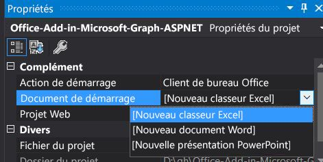

# <a name="create-an-aspnet-office-add-in-that-uses-single-sign-on-preview"></a><span data-ttu-id="f92ff-103">Créer un complément Office ASP.NET qui utilise l’authentification unique (aperçu)</span><span class="sxs-lookup"><span data-stu-id="f92ff-103">Create an ASP.NET Office Add-in that uses single sign-on (preview)</span></span>

<span data-ttu-id="f92ff-104">Lorsque les utilisateurs sont connectés à Office, votre complément peut utiliser les mêmes informations d’identification pour permettre aux utilisateurs d’accéder à plusieurs applications sans avoir à se connecter une deuxième fois.</span><span class="sxs-lookup"><span data-stu-id="f92ff-104">When users are signed in to Office, your add-in can use the same credentials to permit users to access multiple applications without requiring them to sign in a second time.</span></span> <span data-ttu-id="f92ff-105">Pour obtenir une vue d’ensemble, consultez la rubrique [Activer l’authentification unique dans un complément Office](sso-in-office-add-ins.md).</span><span class="sxs-lookup"><span data-stu-id="f92ff-105">For an overview, see [Enable SSO in an Office Add-in](sso-in-office-add-ins.md).</span></span>
<span data-ttu-id="f92ff-106">Cet article vous guide tout au long du processus d’activation de l’authentification unique (SSO) dans un complément intégré à Node.js et Express.</span><span class="sxs-lookup"><span data-stu-id="f92ff-106">This article walks you through the process of enabling single sign-on (SSO) in an add-in that is built with Node.js and Express.</span></span>

> [!NOTE]
> <span data-ttu-id="f92ff-107">Pour voir un article similaire sur un complément basé sur ASP.NET, reportez-vous à [Créer un complément Office Node.js qui utilise l’authentification unique](create-sso-office-add-ins-nodejs.md).</span><span class="sxs-lookup"><span data-stu-id="f92ff-107">For a similar article about an ASP.NET-based add-in, see [Create a Node.js Office Add-in that uses single sign-on](create-sso-office-add-ins-nodejs.md).</span></span>

## <a name="prerequisites"></a><span data-ttu-id="f92ff-108">Conditions préalables</span><span class="sxs-lookup"><span data-stu-id="f92ff-108">Prerequisites</span></span>

* <span data-ttu-id="f92ff-109">Visual Studio 2019 ou version ultérieure.</span><span class="sxs-lookup"><span data-stu-id="f92ff-109">Visual Studio 2019 or later.</span></span>

* [<span data-ttu-id="f92ff-110">Outils de développement Office</span><span class="sxs-lookup"><span data-stu-id="f92ff-110">Office Developer Tools</span></span>](https://www.visualstudio.com/features/office-tools-vs.aspx)

[!include[additional prerequisites](../includes/sso-tutorial-prereqs.md)]

* <span data-ttu-id="f92ff-111">Au moins des fichiers et classeurs sont stockés sur OneDrive Entreprise dans votre abonnement Office 365.</span><span class="sxs-lookup"><span data-stu-id="f92ff-111">At least a few files and folders stored on OneDrive for Business in your Office 365 subscription.</span></span>

* <span data-ttu-id="f92ff-112">Un abonnement Microsoft Azure.</span><span class="sxs-lookup"><span data-stu-id="f92ff-112">A Microsoft Azure subscription.</span></span> <span data-ttu-id="f92ff-113">Ce complément requiert Azure Active Directory (AD).</span><span class="sxs-lookup"><span data-stu-id="f92ff-113">This add-in requires Azure Active Directory (AD).</span></span> <span data-ttu-id="f92ff-114">Azure AD fournit des services d’identité que les applications utilisent à des fins d’authentification et d’autorisation.</span><span class="sxs-lookup"><span data-stu-id="f92ff-114">Azure AD provides identity services that applications use for authentication and authorization.</span></span> <span data-ttu-id="f92ff-115">Un abonnement d’évaluation peut être obtenu sur le site de [Microsoft Azure](https://account.windowsazure.com/SignUp).</span><span class="sxs-lookup"><span data-stu-id="f92ff-115">A trial subscription can be acquired at [Microsoft Azure](https://account.windowsazure.com/SignUp).</span></span>

## <a name="set-up-the-starter-project"></a><span data-ttu-id="f92ff-116">Configurer le projet de démarrage</span><span class="sxs-lookup"><span data-stu-id="f92ff-116">Set up the starter project</span></span>

<span data-ttu-id="f92ff-117">Clonez ou téléchargez le référentiel sur [Complément Office ASPNET SSO](https://github.com/officedev/office-add-in-aspnet-sso).</span><span class="sxs-lookup"><span data-stu-id="f92ff-117">Clone or download the repo at [Office Add-in ASPNET SSO](https://github.com/officedev/office-add-in-aspnet-sso).</span></span>

> [!NOTE]
> <span data-ttu-id="f92ff-118">Il existe deux versions de l’échantillon :</span><span class="sxs-lookup"><span data-stu-id="f92ff-118">There are two versions of the sample:</span></span>
>
> * <span data-ttu-id="f92ff-p103">Le dossier **Before** est un projet de démarrage. L’interface utilisateur et d’autres aspects du complément qui ne sont pas directement liés à l’authentification unique ou à l’autorisation sont déjà terminés. Les sections suivantes de cet article vous guident tout au long de la procédure d’exécution de cette dernière.</span><span class="sxs-lookup"><span data-stu-id="f92ff-p103">The **Before** folder is a starter project. The UI and other aspects of the add-in that are not directly connected to SSO or authorization are already done. Later sections of this article walk you through the process of completing it.</span></span>
> * <span data-ttu-id="f92ff-122">La version **Complète** de l’échantillon s’apparente au complément obtenu si vous aviez terminé les procédures de cet article, sauf que le projet final comporte des commentaires de code qui seraient redondants avec le texte de cet article.</span><span class="sxs-lookup"><span data-stu-id="f92ff-122">The **Complete** version of the sample is just like the add-in that you would have if you completed the procedures of this article, except that the completed project has code comments that would be redundant with the text of this article.</span></span> <span data-ttu-id="f92ff-123">Pour utiliser la version finale, suivez simplement les instructions de cet article, mais remplacez « Avant » par « Finale » et ignorez les sections **Code côté client** et **Code côté serveur**.</span><span class="sxs-lookup"><span data-stu-id="f92ff-123">To use the completed version, just follow the instructions in this article, but replace "Before" with "Complete" and skip the sections **Code the client side** and **Code the server side**.</span></span>


## <a name="register-the-add-in-with-azure-ad-v20-endpoint"></a><span data-ttu-id="f92ff-124">Enregistrez le complément avec le point de terminaison Azure AD v2.0</span><span class="sxs-lookup"><span data-stu-id="f92ff-124">Register the add-in with Azure AD v2.0 endpoint</span></span>

1. <span data-ttu-id="f92ff-125">Accédez à la page [portail Azure : enregistrement des applications](https://go.microsoft.com/fwlink/?linkid=2083908) pour enregistrer votre application.</span><span class="sxs-lookup"><span data-stu-id="f92ff-125">Navigate to the [Azure portal - App registrations](https://go.microsoft.com/fwlink/?linkid=2083908) page to register your app.</span></span>

1. <span data-ttu-id="f92ff-126">Connectez-vous à votre client Office 365 en utilisant les informations d’identification d’***administrateur***.</span><span class="sxs-lookup"><span data-stu-id="f92ff-126">Sign in with the ***admin*** credentials to your Office 365 tenancy.</span></span> <span data-ttu-id="f92ff-127">Par exemple, MonNom@contoso.onmicrosoft.com.</span><span class="sxs-lookup"><span data-stu-id="f92ff-127">For example, MyName@contoso.onmicrosoft.com.</span></span>

1. <span data-ttu-id="f92ff-128">Sélectionnez **Nouvelle inscription**.</span><span class="sxs-lookup"><span data-stu-id="f92ff-128">Select **New registration**.</span></span> <span data-ttu-id="f92ff-129">Sur la page **Inscrire une application**, définissez les valeurs comme suit.</span><span class="sxs-lookup"><span data-stu-id="f92ff-129">On the **Register an application** page, set the values as follows.</span></span>

    * <span data-ttu-id="f92ff-130">Définissez le **Nom** sur `Office-Add-in-ASPNET-SSO`.</span><span class="sxs-lookup"><span data-stu-id="f92ff-130">Set **Name** to `Office-Add-in-ASPNET-SSO`.</span></span>
    * <span data-ttu-id="f92ff-131">Définissez les **Types de comptes pris en charge** à **Comptes dans un annuaire organisationnel (comptes Azure AD Directory multi-locataires) et les comptes personnels Microsoft (par ex. Skype, Xbox)**.</span><span class="sxs-lookup"><span data-stu-id="f92ff-131">Set **Supported account types** to **Accounts in any organizational directory (Any Azure AD directory - Multitenant) and personal Microsoft accounts (e.g. Skype, Xbox)**.</span></span> <span data-ttu-id="f92ff-132">(Si vous voulez que le complément soit utilisable uniquement par les utilisateurs de l’organisation où vous l’enregistrez, vous pouvez choisir **Comptes dans cet annuaire d’organisation uniquement...** à la place, mais vous devrez suivre quelques étapes de configuration supplémentaires.</span><span class="sxs-lookup"><span data-stu-id="f92ff-132">(If you want the add-in to be usable only by users in the tenancy where you are registering it, you can choose **Accounts in this organizational directory only ...** instead, but you will need to go through some additional setup steps.</span></span> <span data-ttu-id="f92ff-133">Si vous souhaitez en savoir plus, veuilles consulter **Configuration de pour un seul locataire**.)</span><span class="sxs-lookup"><span data-stu-id="f92ff-133">See **Setup for single-tenant** below.)</span></span>
    * <span data-ttu-id="f92ff-134">Dans la section **redirection d’URI**, assurez-vous que **Web** est sélectionnée dans la liste déroulante, puis définissez l’URI sur` https://localhost:44355/AzureADAuth/Authorize`.</span><span class="sxs-lookup"><span data-stu-id="f92ff-134">In the **Redirect URI** section, ensure that **Web** is selected in the drop down and then set the URI to` https://localhost:44355/AzureADAuth/Authorize`.</span></span>
    * <span data-ttu-id="f92ff-135">Choisissez **Inscrire**.</span><span class="sxs-lookup"><span data-stu-id="f92ff-135">Choose **Register**.</span></span>

1. <span data-ttu-id="f92ff-136">Sur la page **Office-Add-in-NodeJS-SSO**, copiez et enregistrez les valeurs pour l’**ID de l’application (client)** et l’**ID de répertoire (client)**.</span><span class="sxs-lookup"><span data-stu-id="f92ff-136">On the **Office-Add-in-NodeJS-SSO** page, copy and save the values for the **Application (client) ID** and the **Directory (tenant) ID**.</span></span> <span data-ttu-id="f92ff-137">Vous utiliserez les deux plus tard.</span><span class="sxs-lookup"><span data-stu-id="f92ff-137">You'll use both of them in later procedures.</span></span>

    > [!NOTE]
    > <span data-ttu-id="f92ff-138">Cet ID a la valeur « audience » lorsque d’autres applications, telles que l’application hôte Office (par exemple, PowerPoint, Word, Excel) demandent un accès autorisé à l’application.</span><span class="sxs-lookup"><span data-stu-id="f92ff-138">This ID is the "audience" value when other applications, such as the Office host application (e.g., PowerPoint, Word, Excel), seek authorized access to the application.</span></span> <span data-ttu-id="f92ff-139">Il s’agit également de l’« ID client » de l’application dès que celle-ci recherche un accès autorisé à Microsoft Graph.</span><span class="sxs-lookup"><span data-stu-id="f92ff-139">It is also the "client ID" of the application when it, in turn, seeks authorized access to Microsoft Graph.</span></span>

1. <span data-ttu-id="f92ff-140">Sous **Gérer** sélectionnez **Certificats et clés secrètes**.</span><span class="sxs-lookup"><span data-stu-id="f92ff-140">Under **Manage**, select **Certificates & secrets**.</span></span> <span data-ttu-id="f92ff-141">Sélectionnez le bouton **Nouveau secret client**.</span><span class="sxs-lookup"><span data-stu-id="f92ff-141">Select the **New client secret** button.</span></span> <span data-ttu-id="f92ff-142">Entrer une valeur pour **Description**, puis sélectionnez une option appropriée pour **Expire le** puis **Ajouter**.</span><span class="sxs-lookup"><span data-stu-id="f92ff-142">Enter a value for **Description**, then select an appropriate option for **Expires** and choose **Add**.</span></span> <span data-ttu-id="f92ff-143">*Copier la valeur secrète client immédiatement et enregistrez-la avec l’ID d’application* avant de continuer car vous en aurez besoin dans une procédure plus loin.</span><span class="sxs-lookup"><span data-stu-id="f92ff-143">*Copy the client secret value immediately and save it with the application ID* before proceeding as you'll need it in a later procedure.</span></span>

1. <span data-ttu-id="f92ff-144">Sélectionnez **Exposer une API** sous **Gérer**.</span><span class="sxs-lookup"><span data-stu-id="f92ff-144">Under **Manage**, select **Expose an API**.</span></span> <span data-ttu-id="f92ff-145">Sélectionnez le lien **Définir** pour générer l’URI de l’ID d’application sous la forme « api://$App ID GUID$ », où $App ID GUID$ est l’**ID de l’application (client)**.</span><span class="sxs-lookup"><span data-stu-id="f92ff-145">Select the **Set** link to generate the Application ID URI in the form "api://$App ID GUID$", where $App ID GUID$ is the **Application (client) ID**.</span></span> <span data-ttu-id="f92ff-146">Insérez `localhost:44355/` (Notez la barre oblique « / » ajoutée à la fin) après la `//` et avant le GUID.</span><span class="sxs-lookup"><span data-stu-id="f92ff-146">Insert `localhost:44355/` (note the forward slash "/" appended to the end) after the `//` and before the GUID.</span></span> <span data-ttu-id="f92ff-147">La forme de l’ID entier doit être `api://localhost:44355/$App ID GUID$`; par exemple`api://localhost:44355/c6c1f32b-5e55-4997-881a-753cc1d563b7`.</span><span class="sxs-lookup"><span data-stu-id="f92ff-147">The entire ID should have the form `api://localhost:44355/$App ID GUID$`; for example `api://localhost:44355/c6c1f32b-5e55-4997-881a-753cc1d563b7`.</span></span>

1. <span data-ttu-id="f92ff-148">Sélectionnez **Enregistrer** dans la boîte de dialogue.</span><span class="sxs-lookup"><span data-stu-id="f92ff-148">Select **Save** on the dialog.</span></span>

1. <span data-ttu-id="f92ff-149">Sélectionnez le bouton **Ajouter une étendue**.</span><span class="sxs-lookup"><span data-stu-id="f92ff-149">Select the **Add a scope** button.</span></span> <span data-ttu-id="f92ff-150">Dans le volet qui s’ouvre, entrez `access_as_user` en tant que **nom de l’étendue**.</span><span class="sxs-lookup"><span data-stu-id="f92ff-150">In the panel that opens, enter `access_as_user` as the **Scope** name.</span></span>

1. <span data-ttu-id="f92ff-151">Donnez la valeur **Administrateurs et utilisateurs** à **Qui peut donner son consentement ?** .</span><span class="sxs-lookup"><span data-stu-id="f92ff-151">Set **Who can consent?** to **Admins and users**.</span></span>

1. <span data-ttu-id="f92ff-152">Renseignez les champs pour configurer les invites de consentement des administrateurs et utilisateurs avec les valeurs appropriées pour l’étendue `access_as_user` qui permet à l’application Office hôte d’utiliser l’API web de votre complément avec les mêmes droits que l’utilisateur actuel.</span><span class="sxs-lookup"><span data-stu-id="f92ff-152">Fill in the fields for configuring the admin and user consent prompts with values that are appropriate for the `access_as_user` scope which enables the Office host application to use your add-in's web APIs with the same rights as the current user.</span></span> <span data-ttu-id="f92ff-153">Suggestions :</span><span class="sxs-lookup"><span data-stu-id="f92ff-153">Suggestions:</span></span>

    - <span data-ttu-id="f92ff-154">**Titre consentement administrateur** : Office peut agir en tant qu’utilisateur.</span><span class="sxs-lookup"><span data-stu-id="f92ff-154">**Admin consent title**: Office can act as the user.</span></span>
    - <span data-ttu-id="f92ff-155">**Description consentement administrateur** : activez Office pour qu’il appelle les API de complément web avec les mêmes droits que l’utilisateur actuel.</span><span class="sxs-lookup"><span data-stu-id="f92ff-155">**Admin consent description**: Enable Office to call the add-in's web APIs with the same rights as the current user.</span></span>
    - <span data-ttu-id="f92ff-156">**Titre consentement utilisateur** : Office peut agir à votre place.</span><span class="sxs-lookup"><span data-stu-id="f92ff-156">**User consent title**: Office can act as you.</span></span>
    - <span data-ttu-id="f92ff-157">**Description consentement administrateur** : activez Office pour qu’il appelle les API de complément web avec les mêmes droits dont vous disposez.</span><span class="sxs-lookup"><span data-stu-id="f92ff-157">**Admin consent description**: Enable Office to call the add-in's web APIs with the same rights that you have.</span></span>

1. <span data-ttu-id="f92ff-158">Vérifiez que **State** est défini comme **Activé**.</span><span class="sxs-lookup"><span data-stu-id="f92ff-158">Ensure that **State** is set to **Enabled**.</span></span>

1. <span data-ttu-id="f92ff-159">Sélectionnez **Ajouter une étendue**.</span><span class="sxs-lookup"><span data-stu-id="f92ff-159">Select **Add scope** .</span></span>

    > [!NOTE]
    > <span data-ttu-id="f92ff-160">La partie domaine du **Nom de l’étendue** affiché juste sous le champ de texte devrait automatiquement correspondre à l’URI d’ID d’application définie à l’étape précédente avec `/access_as_user`ajouté à la fin, par exemple, `api://localhost:6789/c6c1f32b-5e55-4997-881a-753cc1d563b7/access_as_user`.</span><span class="sxs-lookup"><span data-stu-id="f92ff-160">The domain part of the **Scope** name displayed just below the text field should automatically match the Application ID URI that you set earlier, with `/access_as_user` appended to the end; for example, `api://localhost:6789/c6c1f32b-5e55-4997-881a-753cc1d563b7/access_as_user`.</span></span>

1. <span data-ttu-id="f92ff-161">Dans la section **Applications client autorisées**, vous identifiez les applications que vous souhaitez autoriser dans l’application web de votre complément.</span><span class="sxs-lookup"><span data-stu-id="f92ff-161">In the **Authorized client applications** section, you identify the applications that you want to authorize to your add-in's web application.</span></span> <span data-ttu-id="f92ff-162">Chacun des ID suivants doit être pré-autorisé.</span><span class="sxs-lookup"><span data-stu-id="f92ff-162">Each of the following IDs needs to be pre-authorized.</span></span>

    - <span data-ttu-id="f92ff-163">`d3590ed6-52b3-4102-aeff-aad2292ab01c` (Microsoft Office)</span><span class="sxs-lookup"><span data-stu-id="f92ff-163">`d3590ed6-52b3-4102-aeff-aad2292ab01c` (Microsoft Office)</span></span>
    - <span data-ttu-id="f92ff-164">`ea5a67f6-b6f3-4338-b240-c655ddc3cc8e` (Microsoft Office)</span><span class="sxs-lookup"><span data-stu-id="f92ff-164">`ea5a67f6-b6f3-4338-b240-c655ddc3cc8e` (Microsoft Office)</span></span>
    - <span data-ttu-id="f92ff-165">`57fb890c-0dab-4253-a5e0-7188c88b2bb4` (Office sur le web)</span><span class="sxs-lookup"><span data-stu-id="f92ff-165">`57fb890c-0dab-4253-a5e0-7188c88b2bb4` (Office on the web)</span></span>
    - <span data-ttu-id="f92ff-166">`bc59ab01-8403-45c6-8796-ac3ef710b3e3` (Outlook sur le web)</span><span class="sxs-lookup"><span data-stu-id="f92ff-166">`bc59ab01-8403-45c6-8796-ac3ef710b3e3` (Outlook on the web)</span></span>

    <span data-ttu-id="f92ff-167">Pour chaque ID, procédez comme suit :</span><span class="sxs-lookup"><span data-stu-id="f92ff-167">For each ID, take these steps:</span></span>

    <span data-ttu-id="f92ff-168">a.</span><span class="sxs-lookup"><span data-stu-id="f92ff-168">a.</span></span> <span data-ttu-id="f92ff-169">Sélectionnez le bouton **Ajouter une application client** puis, dans le volet qui s’ouvre, définissez l’ID Client pour le GUID respectif et cochez la case pour `api://localhost:44355/$App ID GUID$/access_as_user`.</span><span class="sxs-lookup"><span data-stu-id="f92ff-169">Select **Add a client application** button and then, in the panel that opens, set the Client ID to the respective GUID and check the box for `api://localhost:44355/$App ID GUID$/access_as_user`.</span></span>

    <span data-ttu-id="f92ff-170">b.</span><span class="sxs-lookup"><span data-stu-id="f92ff-170">b.</span></span> <span data-ttu-id="f92ff-171">Sélectionnez **Ajouter une application**.</span><span class="sxs-lookup"><span data-stu-id="f92ff-171">Select **Add application**.</span></span>

1. <span data-ttu-id="f92ff-172">Sélectionnez **Autorisations API** sous **Gestion**, puis sélectionnez **Ajouter une autorisation**.</span><span class="sxs-lookup"><span data-stu-id="f92ff-172">Under **Manage**, select **API permissions** and then select **Add a permission**.</span></span> <span data-ttu-id="f92ff-173">Dans le volet qui s’ouvre, sélectionnez **Microsoft Graph**, puis **Autorisations déléguées**.</span><span class="sxs-lookup"><span data-stu-id="f92ff-173">On the panel that opens, choose **Microsoft Graph** and then choose **Delegated permissions**.</span></span>

1. <span data-ttu-id="f92ff-174">Utilisez la zone de recherche **Sélectionnez les autorisations** pour rechercher les autorisations dont votre complément a besoin.</span><span class="sxs-lookup"><span data-stu-id="f92ff-174">Use the **Select permissions** search box to search for the permissions your add-in needs.</span></span> <span data-ttu-id="f92ff-175">Sélectionnez les éléments suivants.</span><span class="sxs-lookup"><span data-stu-id="f92ff-175">Select the following.</span></span> <span data-ttu-id="f92ff-176">Votre complément proprement dit ne requiert que la première. Mais l’autorisation `profile` est également requise pour que l’hôte Office puisse obtenir un jeton pour l’application web de votre complément.</span><span class="sxs-lookup"><span data-stu-id="f92ff-176">Only the first is really required by your add-in itself; but the `profile` permission is required for the Office host to get a token to your add-in web application.</span></span> <span data-ttu-id="f92ff-177">(Seuls Files.Read.All et profil sont réellement nécessaires au complément.</span><span class="sxs-lookup"><span data-stu-id="f92ff-177">(Only Files.Read.All and profile are actually needed by the add-in.</span></span> <span data-ttu-id="f92ff-178">Vous devez demander les deux autres, car la bibliothèque MSAL.NET en a besoin.)</span><span class="sxs-lookup"><span data-stu-id="f92ff-178">You must request the other two because the MSAL.NET library requires them.)</span></span>

    * <span data-ttu-id="f92ff-179">Files.Read.All</span><span class="sxs-lookup"><span data-stu-id="f92ff-179">Files.Read.All</span></span>
    * <span data-ttu-id="f92ff-180">offline_access</span><span class="sxs-lookup"><span data-stu-id="f92ff-180">offline_access</span></span>
    * <span data-ttu-id="f92ff-181">openid</span><span class="sxs-lookup"><span data-stu-id="f92ff-181">openid</span></span>
    * <span data-ttu-id="f92ff-182">profil</span><span class="sxs-lookup"><span data-stu-id="f92ff-182">profile</span></span>

    > [!NOTE]
    > <span data-ttu-id="f92ff-183">L’autorisation `User.Read` est peut-être déjà répertoriée par défaut.</span><span class="sxs-lookup"><span data-stu-id="f92ff-183">The `User.Read` permission may already be listed by default.</span></span> <span data-ttu-id="f92ff-184">Une bonne pratique consiste à demander uniquement les autorisations dont vous avez besoin. Ainsi, nous vous recommandons de désactiver la case à cocher de cette autorisation si votre complément n’en a pas réellement besoin.</span><span class="sxs-lookup"><span data-stu-id="f92ff-184">It is a good practice not to ask for permissions that are not needed, so we recommend that you uncheck the box for this permission if your add-in does not actually need it.</span></span>

1. <span data-ttu-id="f92ff-185">Activez la case à cocher pour chaque autorisation telle qu’elle apparaît.</span><span class="sxs-lookup"><span data-stu-id="f92ff-185">Select the check box for each permission as it appears.</span></span> <span data-ttu-id="f92ff-186">Après avoir sélectionné les autorisations dont votre complément a besoin, sélectionnez le bouton **Ajouter des autorisations** situé en bas du panneau.</span><span class="sxs-lookup"><span data-stu-id="f92ff-186">After selecting the permissions that your add-in needs, select the **Add permissions** button at the bottom of the panel.</span></span>

1. <span data-ttu-id="f92ff-187">Sur la même page, sélectionnez le bouton **Accorder l’autorisation d’administrateur pour [nom du client]**, puis **Accepter** pour la confirmation qui s’affiche.</span><span class="sxs-lookup"><span data-stu-id="f92ff-187">On the same page, choose the **Grant admin consent for [tenant name]** button, and then select **Accept** for the confirmation that appears.</span></span>

    > [!NOTE]
    > <span data-ttu-id="f92ff-188">Une fois que vous avez choisi **Accorder le consentement d’administrateur pour [nom du locataire]**, vous pouvez voir un message de bannière vous invitant à réessayer dans quelques minutes afin de pouvoir construire l’invite d’autorisation.</span><span class="sxs-lookup"><span data-stu-id="f92ff-188">After choosing **Grant admin consent for [tenant name]**, you may see a banner message asking you to try again in a few minutes so that the consent prompt can be constructed.</span></span> <span data-ttu-id="f92ff-189">Si c’est le cas, vous pouvez commencer à travailler sur la section suivante, ***mais n’oubliez pas de revenir au portail et d’appuyer sur ce bouton*** !</span><span class="sxs-lookup"><span data-stu-id="f92ff-189">If so, you can start work on the next section, ***but don't forget to come back to the portal and press this button***!</span></span>

## <a name="configure-the-solution"></a><span data-ttu-id="f92ff-190">Configurer la solution</span><span class="sxs-lookup"><span data-stu-id="f92ff-190">Configure the solution</span></span>

1. <span data-ttu-id="f92ff-191">À la racine du dossier **Before**, ouvrez le fichier (.sln) solution dans **Visual Studio**.</span><span class="sxs-lookup"><span data-stu-id="f92ff-191">In the root of the **Before** folder, open the solution (.sln) file in **Visual Studio**.</span></span> <span data-ttu-id="f92ff-192">Cliquez avec le bouton droit sur le nœud supérieur de l’**Explorateur de solutions** (le nœud solution, et non l’un des nœuds de projet), puis sélectionnez **Définir les projets de démarrage**.</span><span class="sxs-lookup"><span data-stu-id="f92ff-192">Right-click the top node in **Solution Explorer** (the Solution node, not either of the project nodes), and then select **Set startup projects**.</span></span>

1. <span data-ttu-id="f92ff-193">Sous **Propriétés communes**, sélectionnez **Projet de démarrage**, puis **Plusieurs projets de démarrage**.</span><span class="sxs-lookup"><span data-stu-id="f92ff-193">Under **Common Properties**, select **Startup Project**, and then **Multiple startup projects**.</span></span> <span data-ttu-id="f92ff-194">Assurez-vous que l’**Action** pour les deux projets est définie sur **Démarrer**, et que le projet qui se termine par « ...WebAPI » apparaît en premier dans la liste.</span><span class="sxs-lookup"><span data-stu-id="f92ff-194">Ensure that the **Action** for both projects is set to **Start**, and that the project that ends in "...WebAPI" is listed first.</span></span> <span data-ttu-id="f92ff-195">Fermez la boîte de dialogue.</span><span class="sxs-lookup"><span data-stu-id="f92ff-195">Close the dialog.</span></span>

1. <span data-ttu-id="f92ff-196">Dans l’**Explorateur de solutions**, sélectionnez (ne cliquez pas avec le bouton droit) le projet **Office-Add-in-Microsoft-Graph-ASPNETWebAPI**.</span><span class="sxs-lookup"><span data-stu-id="f92ff-196">Back in **Solution Explorer**, select (don't right-click) the **Office-Add-in-Microsoft-Graph-ASPNETWebAPI** project.</span></span> <span data-ttu-id="f92ff-197">Le volet **Propriétés** s’ouvre.</span><span class="sxs-lookup"><span data-stu-id="f92ff-197">The **Properties** pane opens.</span></span> <span data-ttu-id="f92ff-198">Assurez-vous que **SSL activé** est **Vrai**.</span><span class="sxs-lookup"><span data-stu-id="f92ff-198">Ensure that **SSL Enabled** is **True**.</span></span> <span data-ttu-id="f92ff-199">Vérifiez que l’**URL SSL** est `http://localhost:44355/`.</span><span class="sxs-lookup"><span data-stu-id="f92ff-199">Verify that the **SSL URL** is `http://localhost:44355/`.</span></span>

1. <span data-ttu-id="f92ff-200">Dans « web.config », utilisez les valeurs que vous avez copiées dans le version précédente.</span><span class="sxs-lookup"><span data-stu-id="f92ff-200">In "Web.config", use the values that you copied in earlier.</span></span> <span data-ttu-id="f92ff-201">Configurez les **Ida:ClientID** et **Ida:Audience** à votre **ID d’application (client)**, puis configurez **Ida:Password** sur votre code secret client.</span><span class="sxs-lookup"><span data-stu-id="f92ff-201">Set both the **ida:ClientID** and the **ida:Audience** to your **Application (client) ID**, and set **ida:Password** to your client secret.</span></span>

    > [!NOTE]
    > <span data-ttu-id="f92ff-202">L’**ID d’application (client)** est la valeur « audience » lorsque d’autres applications, telles que l’application hôte Office (par exemple, PowerPoint, Word, Excel) demandent un accès autorisé à l’application.</span><span class="sxs-lookup"><span data-stu-id="f92ff-202">The **Application (client) ID** is the "audience" value when other applications, such as the Office host application (e.g., PowerPoint, Word, Excel), seek authorized access to the application.</span></span> <span data-ttu-id="f92ff-203">Il s’agit également de l’« ID client » de l’application dès que celle-ci recherche un accès autorisé à Microsoft Graph.</span><span class="sxs-lookup"><span data-stu-id="f92ff-203">It is also the "client ID" of the application when it, in turn, seeks authorized access to Microsoft Graph.</span></span>

1. <span data-ttu-id="f92ff-204">Si vous n’avez pas choisi « Comptes dans ce répertoire d’organisation uniquement » pour **TYPES DE COMPTES PRIS EN CHARGE** lorsque vous avez enregistré le complément, enregistrez et fermez le fichier web.config. Dans le cas contraire, enregistrez-le et laissez-le ouvert.</span><span class="sxs-lookup"><span data-stu-id="f92ff-204">If you didn't choose "Accounts in this organizational directory only" for **SUPPORTED ACCOUNT TYPES** when you registered the add-in, save and close the web.config. Otherwise, save but leave it open.</span></span>

1. <span data-ttu-id="f92ff-205">Toujours dans l’**Explorateur de solutions**, sélectionnez le projet **Office-complément-Microsoft-Graph-ASPNET** et ouvrez le fichier manifeste de complément « Office-Add-in-ASPNET-SSO.xml » et faites défiler la page jusqu’à la fin du fichier.</span><span class="sxs-lookup"><span data-stu-id="f92ff-205">Still in **Solution Explorer**, choose the **Office-Add-in-Microsoft-Graph-ASPNET** project and open the add-in manifest file “Office-Add-in-ASPNET-SSO.xml” and then scroll to the bottom of the file.</span></span> <span data-ttu-id="f92ff-206">Juste au-dessus de la balise de fin `</VersionOverrides>`, vous trouverez le balisage suivant :</span><span class="sxs-lookup"><span data-stu-id="f92ff-206">Just above the end `</VersionOverrides>` tag, you'll find the following markup:</span></span>

    ```xml
    <WebApplicationInfo>
      <Id>$application_GUID here$</Id>
      <Resource>api://localhost:44355/$application_GUID here$</Resource>
      <Scopes>
          <Scope>Files.Read.All</Scope>
          <Scope>offline_access</Scope>
          <Scope>openid</Scope>
          <Scope>profile</Scope>
      </Scopes>
    </WebApplicationInfo>
    ```

1. <span data-ttu-id="f92ff-207">Remplacez l’espace réservé « $application_GUID here$ » *aux deux endroits* du balisage par l’ID d’application que vous avez copiée lorsque vous avez inscrit votre complément.</span><span class="sxs-lookup"><span data-stu-id="f92ff-207">Replace the placeholder “$application_GUID here$” *in both places* in the markup with the Application ID that you copied when you registered your add-in.</span></span> <span data-ttu-id="f92ff-208">Les signes « $ » ne faisant pas partie de l’ID, vous ne devez pas les inclure.</span><span class="sxs-lookup"><span data-stu-id="f92ff-208">The "$" signs are not part of the ID, so do not include them.</span></span> <span data-ttu-id="f92ff-209">C’est le même ID que celui que vous avez utilisé pour ClientID et Audience dans le fichier web.config.</span><span class="sxs-lookup"><span data-stu-id="f92ff-209">This is the same ID you used in for the ClientID and Audience in the web.config.</span></span>

  > [!NOTE]
  > <span data-ttu-id="f92ff-210">La valeur de la **ressource** est l’**URI de l’ID d’application** que vous avez défini lors de l’inscription du complément.</span><span class="sxs-lookup"><span data-stu-id="f92ff-210">The **Resource** value is the **Application ID URI** you set when you registered the add-in.</span></span> <span data-ttu-id="f92ff-211">La section **Étendues** est utilisée uniquement pour générer une boîte de dialogue de consentement si le complément est vendu via AppSource.</span><span class="sxs-lookup"><span data-stu-id="f92ff-211">The **Scopes** section is used only to generate a consent dialog box if the add-in is sold through AppSource.</span></span>

1. <span data-ttu-id="f92ff-212">Enregistrez et fermez le fichier.</span><span class="sxs-lookup"><span data-stu-id="f92ff-212">Save and close the file.</span></span>

### <a name="setup-for-single-tenant"></a><span data-ttu-id="f92ff-213">Configuration d’un seul locataire</span><span class="sxs-lookup"><span data-stu-id="f92ff-213">Setup for single-tenant</span></span>

<span data-ttu-id="f92ff-214">Si vous avez choisi « Comptes dans ce répertoire d’organisation uniquement » pour **TYPES DE COMPTES PRIS EN CHARGE** lorsque vous avez enregistré le complément, vous devez suivre ces étapes de configuration supplémentaires :</span><span class="sxs-lookup"><span data-stu-id="f92ff-214">If you chose "Accounts in this organizational directory only" for **SUPPORTED ACCOUNT TYPES** when you registered the add-in, you need to take these additional setup steps:</span></span>

1. <span data-ttu-id="f92ff-215">Revenez au portail Azure et ouvrez le volet **vue d’ensemble** de l’inscription du complément.</span><span class="sxs-lookup"><span data-stu-id="f92ff-215">Go back to the Azure Portal and open the **Overview** blade of the add-in's registration.</span></span> <span data-ttu-id="f92ff-216">Copiez l’**ID de répertoire (client)**.</span><span class="sxs-lookup"><span data-stu-id="f92ff-216">Copy the **Directory (tenant) ID**.</span></span>

1. <span data-ttu-id="f92ff-217">Dans le fichier Web. config, remplacez le « Common » par la valeur de **Ida:Authority** avec le GUID que vous avez copié à l’étape précédente.</span><span class="sxs-lookup"><span data-stu-id="f92ff-217">In the web.config, replace the "common" in the value of **ida:Authority** with the GUID you copied in the preceding step.</span></span> <span data-ttu-id="f92ff-218">Lorsque vous avez terminé, la valeur doit ressembler à ceci : `<add key="ida:Authority" value="https://login.microsoftonline.com/12345678-91ab-cdef-0123-456789abcdef/oauth2/v2.0" />`.</span><span class="sxs-lookup"><span data-stu-id="f92ff-218">When you are finished the value should look similar to this: `<add key="ida:Authority" value="https://login.microsoftonline.com/12345678-91ab-cdef-0123-456789abcdef/oauth2/v2.0" />`.</span></span>

1. <span data-ttu-id="f92ff-219">Enregistrez et fermez le fichier web.config.</span><span class="sxs-lookup"><span data-stu-id="f92ff-219">Save and close the web.config.</span></span>

## <a name="code-the-client-side"></a><span data-ttu-id="f92ff-220">Code côté client</span><span class="sxs-lookup"><span data-stu-id="f92ff-220">Code the client side</span></span>

1. <span data-ttu-id="f92ff-221">Ouvrez le fichier HomeES6.js dans le dossier **Scripts**.</span><span class="sxs-lookup"><span data-stu-id="f92ff-221">Open the HomeES6.js file in the **Scripts** folder.</span></span> <span data-ttu-id="f92ff-222">Il contient déjà du code :</span><span class="sxs-lookup"><span data-stu-id="f92ff-222">It already has some code in it:</span></span>

    * <span data-ttu-id="f92ff-223">Un polyfill qui affecte l’objet Office. promesse à l’objet fenêtre globale pour que le complément puisse s’exécuter lorsque Office utilise Internet Explorer pour l’interface utilisateur.</span><span class="sxs-lookup"><span data-stu-id="f92ff-223">A polyfill that assigns the Office.Promise object to the global window object so that the add-in can run when Office is using Internet Explorer for the UI.</span></span> <span data-ttu-id="f92ff-224">(Pour plus d’informations, voir [Navigateurs utilisés par les compléments Office](../concepts/browsers-used-by-office-web-add-ins.md).)</span><span class="sxs-lookup"><span data-stu-id="f92ff-224">(For more information, see [Browsers used by Office Add-ins](../concepts/browsers-used-by-office-web-add-ins.md).)</span></span>
    * <span data-ttu-id="f92ff-225">Une affectation à la méthode `Office.initialize` qui affecte elle-même un gestionnaire à l’événement ClickButton `getGraphAccessTokenButton`.</span><span class="sxs-lookup"><span data-stu-id="f92ff-225">An assignment to the `Office.initialize` method that, in turn, assigns a handler to the `getGraphAccessTokenButton` button click event.</span></span>
    * <span data-ttu-id="f92ff-226">Une méthode `showResult` permettant d’afficher les données renvoyées par Microsoft Graph (ou un message d’erreur) en bas du volet Office.</span><span class="sxs-lookup"><span data-stu-id="f92ff-226">A `showResult` method that will display data returned from Microsoft Graph (or an error message) at the bottom of the task pane.</span></span>
    * <span data-ttu-id="f92ff-227">Une méthode `logErrors` qui consigne dans la console les erreurs qui ne sont pas destinées à l’utilisateur final.</span><span class="sxs-lookup"><span data-stu-id="f92ff-227">A `logErrors` method that will log to console errors that are not intended for the end user.</span></span>
    * <span data-ttu-id="f92ff-228">Code qui implémente le système d’autorisation de repli que le complément utilisera dans les scénarios où l’authentification unique n’est pas prise en charge ou a provoqué une erreur.</span><span class="sxs-lookup"><span data-stu-id="f92ff-228">Code that implements the fallback authorization system that the add-in will use in scenarios where SSO is not supported or has errored.</span></span>

1. <span data-ttu-id="f92ff-229">En dessous de l’affectation au `Office.initialize`, ajoutez le code ci-dessous.</span><span class="sxs-lookup"><span data-stu-id="f92ff-229">Below the assignment to `Office.initialize`, add the code below.</span></span> <span data-ttu-id="f92ff-230">Tenez compte des informations suivantes à propos de ce code :</span><span class="sxs-lookup"><span data-stu-id="f92ff-230">Note the following about this code:</span></span>

    * <span data-ttu-id="f92ff-231">La gestion des erreurs dans le complément tente parfois automatiquement d’obtenir un jeton d’accès une deuxième fois, à l’aide d’un autre jeu d’options.</span><span class="sxs-lookup"><span data-stu-id="f92ff-231">The error-handling in the add-in will sometimes automatically attempt a second time to get an access token, using a different set of options.</span></span> <span data-ttu-id="f92ff-232">La variable de compteur `retryGetAccessToken` permet de s’assurer que l’utilisateur ne tente pas de manière répétée d’obtenir un jeton sans y parvenir.</span><span class="sxs-lookup"><span data-stu-id="f92ff-232">The counter variable `retryGetAccessToken` is used to ensure that the user isn't cycled repeatedly through failed attempts to get a token.</span></span>
    * <span data-ttu-id="f92ff-233">La fonction `getGraphData` est définie avec le mot clé ES6 `async`.</span><span class="sxs-lookup"><span data-stu-id="f92ff-233">The `getGraphData` function is defined with the ES6 `async` keyword.</span></span> <span data-ttu-id="f92ff-234">L’utilisation de la syntaxe ES6 simplifie l’utilisation de l’API d’authentification unique dans les compléments Office.</span><span class="sxs-lookup"><span data-stu-id="f92ff-234">Using ES6 syntax makes the SSO API in Office Add-ins much easier to to use.</span></span> <span data-ttu-id="f92ff-235">Il s’agit du seul fichier dans la solution qui utilise une syntaxe non prise en charge par Internet Explorer.</span><span class="sxs-lookup"><span data-stu-id="f92ff-235">This is the only file in the solution that will use syntax that is not supported by Internet Explorer.</span></span> <span data-ttu-id="f92ff-236">Nous plaçons « ES6 » dans le nom du fichier comme rappel.</span><span class="sxs-lookup"><span data-stu-id="f92ff-236">We put 'ES6' in the filename as a reminder.</span></span> <span data-ttu-id="f92ff-237">La solution utilise le transpondeur tsc pour transpiler ce fichier en ES5, afin que le complément puisse être exécuté lorsque Office utilise Internet Explorer pour l’interface utilisateur.</span><span class="sxs-lookup"><span data-stu-id="f92ff-237">The solution uses the tsc transpiler to transpile this file to ES5, so that the add-in can run when Office is using Internet Explorer for the UI.</span></span> <span data-ttu-id="f92ff-238">(Consultez le fichier tsconfig.json dans la racine du projet.)</span><span class="sxs-lookup"><span data-stu-id="f92ff-238">(See the tsconfig.json file in the root of the project.)</span></span>

    ```javascript
    var retryGetAccessToken = 0;

    async function getGraphData() {
        await getDataWithToken({ allowSignInPrompt: true, forMSGraphAccess: true });
    }
    ```

1. <span data-ttu-id="f92ff-239">Ajoutez la fonction suivante après la fonction `getGraphData`.</span><span class="sxs-lookup"><span data-stu-id="f92ff-239">Below the `getGraphData` function add the following function.</span></span> <span data-ttu-id="f92ff-240">Notez que vous créez la fonction `handleClientSideErrors` dans une étape ultérieure.</span><span class="sxs-lookup"><span data-stu-id="f92ff-240">Note that you create the `handleClientSideErrors` function in a later step.</span></span>

    ```javascript
    async function getDataWithToken() {
        try {

            // TODO 1: Get the bootstrap token and send it to the server to exchange
            //         for an access token to Microsoft Graphn and then get the data
            //         from Microsoft Graph.

        }
        catch (exception) {
            if (exception.code) {
                handleClientSideErrors(exception);
            }
            else {
                showResult(["EXCEPTION: " + JSON.stringify(exception)]);
            }
        }
    }
    ```

1. <span data-ttu-id="f92ff-241">Remplacez `TODO 1` par ce qui suit.</span><span class="sxs-lookup"><span data-stu-id="f92ff-241">Replace `TODO 1` with the following.</span></span> <span data-ttu-id="f92ff-242">Tenez compte du code suivant :</span><span class="sxs-lookup"><span data-stu-id="f92ff-242">About this code, note:</span></span>

    * <span data-ttu-id="f92ff-243">`getAccessToken` indique à Office d’obtenir un jeton de démarrage à partir d’Azure AD et de revenir au complément.</span><span class="sxs-lookup"><span data-stu-id="f92ff-243">`getAccessToken` tells Office to get a bootstrap token from Azure AD and return to the add-in.</span></span>
    * <span data-ttu-id="f92ff-244">`allowSignInPrompt` indique à Office d’inviter l’utilisateur à se connecter si l’utilisateur n’est pas encore connecté à Office.</span><span class="sxs-lookup"><span data-stu-id="f92ff-244">`allowSignInPrompt` tells Office to prompt the user to sign in if the user isn't already signed into Office.</span></span>
    * <span data-ttu-id="f92ff-245">`forMSGraphAccess` indique à Office que le complément envisage de permuter le jeton d'amorçage d’un jeton d’accès à Microsoft Graph (au lieu d’utiliser simplement le jeton d'amorçage comme jeton ID utilisateur).</span><span class="sxs-lookup"><span data-stu-id="f92ff-245">`forMSGraphAccess` tells Office that the add-in intends to swap the bootstrap token for an access token to Microsoft Graph (instead of just using the bootstrap token as a user ID token).</span></span> <span data-ttu-id="f92ff-246">La configuration de cette option permet à Office d’annuler le processus d’acquisition d’un jeton d'amorçage (et de renvoyer le code d’erreur 13012) si l’administrateur du locataire de l’utilisateur n’a pas accordé le consentement du complément.</span><span class="sxs-lookup"><span data-stu-id="f92ff-246">Setting this option gives Office a chance to cancel the process of getting a bootstrap token (and return error code 13012) if the user's tenant administrator has not granted consent to the add-in.</span></span> <span data-ttu-id="f92ff-247">Le code côté client du complément peut répondre au 13012 en branchant un système d’autorisation de secours.</span><span class="sxs-lookup"><span data-stu-id="f92ff-247">The add-in's client-side code can respond to the 13012 by branching to a fallback authorization system.</span></span> <span data-ttu-id="f92ff-248">Si le `forMSGraphAccess` n’est pas utilisé et que l’administrateur n’a pas donné son accord, le jeton d’amorçage est renvoyé, mais la tentative de l’arrêter avec le flux de compte génère une erreur.</span><span class="sxs-lookup"><span data-stu-id="f92ff-248">If the `forMSGraphAccess` is not used, and the admin has not granted consent, the bootstrap token is returned, but the attempt to exhange it with the on-behalf-of flow would result in an error.</span></span> <span data-ttu-id="f92ff-249">Par conséquent, l’option `forMSGraphAccess` permet au complément de brancher rapidement vers le système de secours.</span><span class="sxs-lookup"><span data-stu-id="f92ff-249">Thus, the `forMSGraphAccess` option enables the add-in to branch to the fallback system quickly.</span></span>
    * <span data-ttu-id="f92ff-250">Vous créez la fonction `getData` dans une étape ultérieure.</span><span class="sxs-lookup"><span data-stu-id="f92ff-250">You create the `getData` function in a later step.</span></span>
    * <span data-ttu-id="f92ff-251">Le paramètre `/api/values` est l’URL d’un contrôleur côté serveur qui transforme l’échange de jeton et utilise le jeton d’accès qu’il renvoie pour appeler Microsoft Graph.</span><span class="sxs-lookup"><span data-stu-id="f92ff-251">The `/api/values` parameter is the URL of a server-side controller that will make the token exchange and use the access token it gets back to make the call to Microsoft Graph.</span></span>

    ```javascript
    let bootstrapToken = await OfficeRuntime.auth.getAccessToken({
        allowSignInPrompt: true,
        forMSGraphAccess: true });

    getData("/api/values", bootstrapToken);
    ```

1. <span data-ttu-id="f92ff-252">Ajoutez la fonction suivante après la fonction `getGraphData`.</span><span class="sxs-lookup"><span data-stu-id="f92ff-252">Below the `getGraphData` function, add the following.</span></span> <span data-ttu-id="f92ff-253">Tenez compte du code suivant :</span><span class="sxs-lookup"><span data-stu-id="f92ff-253">About this code, note:</span></span>

    * <span data-ttu-id="f92ff-254">Il est utilisé par les systèmes d’authentification unique et de secours.</span><span class="sxs-lookup"><span data-stu-id="f92ff-254">It is used by both the SSO and the fallback authorization systems.</span></span>
    * <span data-ttu-id="f92ff-255">Le paramètre `relativeUrl` est un contrôleur côté serveur.</span><span class="sxs-lookup"><span data-stu-id="f92ff-255">The `relativeUrl` parameter is a server-side controller.</span></span>
    * <span data-ttu-id="f92ff-256">Le paramètre `accessToken` peut être un jeton d’amorçage ou un jeton d’accès complet.</span><span class="sxs-lookup"><span data-stu-id="f92ff-256">The `accessToken` parameter can be a bootstrap token or a full access token.</span></span>
    * <span data-ttu-id="f92ff-257">Le `writeFileNamesToOfficeDocument` fait déjà partie du projet.</span><span class="sxs-lookup"><span data-stu-id="f92ff-257">The `writeFileNamesToOfficeDocument` is already part of the project.</span></span>
    * <span data-ttu-id="f92ff-258">Vous créez la fonction `handleServerSideErrors` dans une étape ultérieure.</span><span class="sxs-lookup"><span data-stu-id="f92ff-258">You create the `handleServerSideErrors` function in a later step.</span></span>

    ```javascript
    function getData(relativeUrl, accessToken) {

        $.ajax({
            url: relativeUrl,
            headers: { "Authorization": "Bearer " + accessToken },
            type: "GET"
        })
            .done(function (result) {
                writeFileNamesToOfficeDocument(result)
                    .then(function () {
                        showResult(["Your data has been added to the document."]);
                    })
                    .catch(function (error) {
                        showResult([JSON.stringify(error)]);
                    });
            })
            .fail(function (result) {
                handleServerSideErrors(result);
            });
    }
    ```

### <a name="handle-client-side-errors"></a><span data-ttu-id="f92ff-259">Gérer les erreurs côté client</span><span class="sxs-lookup"><span data-stu-id="f92ff-259">Handle client-side errors</span></span>

1. <span data-ttu-id="f92ff-260">Sous la fonction `getData`, ajoutez la fonction suivante.</span><span class="sxs-lookup"><span data-stu-id="f92ff-260">Below the `getData` function, add the following function.</span></span> <span data-ttu-id="f92ff-261">Veuillez noter que `error.code` est un nombre, généralement compris dans la plage 13xxx.</span><span class="sxs-lookup"><span data-stu-id="f92ff-261">Note that `error.code` is a number, usually in the range 13xxx.</span></span>

    ```javascript
    function handleClientSideErrors(error) {
        switch (error.code) {

            // TODO 2: Handle errors where the add-in should NOT invoke
            //         the alternative system of authorization.

            // TODO 3: Handle errors where the add-in should invoke
            //         the alternative system of authorization.

        }
    }
    ```

1. <span data-ttu-id="f92ff-262">Remplacez `TODO 2` par le code suivant.</span><span class="sxs-lookup"><span data-stu-id="f92ff-262">Replace `TODO 2` with the following code.</span></span> <span data-ttu-id="f92ff-263">Pour plus d’informations sur ces erreurs, reportez-vous à [Résoudre les problèmes liés à SSO dans les compléments Office](troubleshoot-sso-in-office-add-ins.md).</span><span class="sxs-lookup"><span data-stu-id="f92ff-263">For more information about these errors, see [Troubleshoot SSO in Office Add-ins](troubleshoot-sso-in-office-add-ins.md).</span></span>

    ```javascript
    case 13001:
        // No one is signed into Office. If the add-in cannot be effectively used when no one
        // is logged into Office, then the first call of getAccessToken should pass the
        // `allowSignInPrompt: true` option.
        showResult(["No one is signed into Office. But you can use many of the add-ins functions anyway. If you want to log in, press the Get OneDrive File Names button again."]);
        break;
    case 13002:
        // The user aborted the consent prompt. If the add-in cannot be effectively used when consent
        // has not been granted, then the first call of getAccessToken should pass the `allowConsentPrompt: true` option.
        showResult(["You can use many of the add-ins functions even though you have not granted consent. If you want to grant consent, press the Get OneDrive File Names button again."]);
        break;
    case 13006:
        // Only seen in Office on the Web.
        showResult(["Office on the Web is experiencing a problem. Please sign out of Office, close the browser, and then start again."]);
        break;
    case 13008:
        // Only seen in Office on the Web.
        showResult(["Office is still working on the last operation. When it completes, try this operation again."]);
        break;
    case 13010:
        // Only seen in Office on the Web.
        showResult(["Follow the instructions to change your browser's zone configuration."]);
        break;
    ```

1. <span data-ttu-id="f92ff-264">Remplacez `TODO 3` par le code suivant.</span><span class="sxs-lookup"><span data-stu-id="f92ff-264">Replace `TODO 3` with the following code.</span></span> <span data-ttu-id="f92ff-265">Pour toutes les autres erreurs, le complément se branche au système d’autorisation de secours.</span><span class="sxs-lookup"><span data-stu-id="f92ff-265">For all other errors, the add-in branches to the fallback authorization system.</span></span> <span data-ttu-id="f92ff-266">Pour plus d’informations sur ces erreurs, reportez-vous à [Résoudre les problèmes liés à SSO dans les compléments Office](troubleshoot-sso-in-office-add-ins.md).Dans ce complément, le système de secours ouvre une boîte de dialogue demandant à l’utilisateur de se connecter, même si l’utilisateur l’est déjà, et utilise MSAL.js et le flux implicite pour obtenir un jeton d’accès à Microsoft Graph.</span><span class="sxs-lookup"><span data-stu-id="f92ff-266">For more information about these errors, see [Troubleshoot SSO in Office Add-ins](troubleshoot-sso-in-office-add-ins.md). In this add-in, the fallback system opens a dialog which requires the user to sign in, even if the user already is, and uses msal.js and the Implicit Flow to get an access token to Microsoft Graph.</span></span>

    ```javascript
    default:
        dialogFallback();
        break;
    ```

### <a name="handle-server-side-errors"></a><span data-ttu-id="f92ff-267">Gérer les erreurs côté serveur</span><span class="sxs-lookup"><span data-stu-id="f92ff-267">Handle server-side errors</span></span>

1. <span data-ttu-id="f92ff-268">Sous la fonction `handleClientSideErrors`, ajoutez la fonction suivante.</span><span class="sxs-lookup"><span data-stu-id="f92ff-268">Below the `handleClientSideErrors` function, add the following function.</span></span>

    ```javascript
    function handleServerSideErrors(result) {

    // TODO 4: Parse the JSON response.

    // TODO 5: Handle case where Microsoft Graph requires an additional form
    //         of authentication.

    // TODO 6: Handle other Azure AD errors

    }
    ```

1. <span data-ttu-id="f92ff-269">Remplacez `TODO 4` par ce qui suit.</span><span class="sxs-lookup"><span data-stu-id="f92ff-269">Replace `TODO 4` with the following.</span></span> <span data-ttu-id="f92ff-270">À propos de ce code, Notez que des classes d’erreur ASP.NET ont été créées avant d’être telles que l’authentification multi-facteur.</span><span class="sxs-lookup"><span data-stu-id="f92ff-270">About this code, note that ASP.NET error classes were created before there was such a thing as MFA.</span></span> <span data-ttu-id="f92ff-271">Dans le cadre de la façon dont la logique côté serveur gère les demandes pour un deuxième facteur d’authentification, l’erreur côté serveur envoyée au client a une propriété de **Message**, mais aucune propriété **ExceptionMessage** n’est disponible.</span><span class="sxs-lookup"><span data-stu-id="f92ff-271">As a side-effect of how our server-side logic handles the requests for a second authentication factor, the server-side error sent to the client has a **Message** property but no **ExceptionMessage** property.</span></span> <span data-ttu-id="f92ff-272">Cependant, toutes les autres erreurs auront une propriété **ExceptionMessage**, pour que le code côté client doit analyser la réponse pour les deux.</span><span class="sxs-lookup"><span data-stu-id="f92ff-272">But all other errors will have a **ExceptionMessage** property, so the client-side code has to parse the response for both.</span></span> <span data-ttu-id="f92ff-273">L’une ou l’autre variable est non définie.</span><span class="sxs-lookup"><span data-stu-id="f92ff-273">Either one or the other variable will be undefined.</span></span>

    ```javascript
    var message = JSON.parse(result.responseText).Message;
    var exceptionMessage = JSON.parse(result.responseText).ExceptionMessage;
    ```

1. <span data-ttu-id="f92ff-274">Remplacez `TODO 5` par ce qui suit.</span><span class="sxs-lookup"><span data-stu-id="f92ff-274">Replace `TODO 5` with the following.</span></span> <span data-ttu-id="f92ff-275">Lorsque Microsoft Graph exige un formulaire d’authentification supplémentaire, il envoie l’erreur AADSTS50076.</span><span class="sxs-lookup"><span data-stu-id="f92ff-275">When Microsoft Graph requires an additional form of authentication, it sends error AADSTS50076.</span></span> <span data-ttu-id="f92ff-276">Celle-ci inclut des informations sur la configuration requise supplémentaire dans la propriété **message les déclarations**.</span><span class="sxs-lookup"><span data-stu-id="f92ff-276">It includes information about the additional requirement in the **Message.Claims** property.</span></span> <span data-ttu-id="f92ff-277">Pour gérer ce problème, le code effectue une deuxième tentative d’obtention du jeton d’amorçage, mais cette fois, il inclut la demande d’un facteur supplémentaire comme valeur de l’option `authChallenge`, ce qui indique à Azure AD d’inviter l’utilisateur à fournir toutes les formes requises d’authentification.</span><span class="sxs-lookup"><span data-stu-id="f92ff-277">To handle this, the code makes a second attempt to get the bootstrap token, but this time it includes the request for an additional factor as the value of the `authChallenge` option, which tells Azure AD to prompt the user for all required forms of authentication.</span></span>

    ```javascript
    if (message) {
        if (message.indexOf("AADSTS50076") !== -1) {
            var claims = JSON.parse(message).Claims;
            var claimsAsString = JSON.stringify(claims);
            getDataWithToken({ authChallenge: claimsAsString });
            return;
        }
    }
    ```

1. <span data-ttu-id="f92ff-278">Remplacez `TODO 6` par ce qui suit.</span><span class="sxs-lookup"><span data-stu-id="f92ff-278">Replace `TODO 6` with the following.</span></span>

    ```javascript
    if (exceptionMessage) {

        // TODO 7: Handle case where bootstrap token has expired.

        // TODO 8: Handle all other Azure AD errors.
    }
    ```

1. <span data-ttu-id="f92ff-279">Remplacez `TODO 7` par ce qui suit.</span><span class="sxs-lookup"><span data-stu-id="f92ff-279">Replace `TODO 7` with the following.</span></span> <span data-ttu-id="f92ff-280">Notez que, dans de rares cas, le jeton de démarrage n’a pas expiré lorsqu’il est validé par Office, mais arrive à expiration au moment où il est envoyé Azure AD pour l’échange.</span><span class="sxs-lookup"><span data-stu-id="f92ff-280">Note that on rare occasions the bootstrap token is unexpired when Office validates it, but expires by the time it is sent to Azure AD for exchange.</span></span> <span data-ttu-id="f92ff-281">Azure AD enverra une réponse incluant l’erreur AADSTS500133.</span><span class="sxs-lookup"><span data-stu-id="f92ff-281">Azure AD will respond with error AADSTS500133.</span></span> <span data-ttu-id="f92ff-282">Dans ce cas, le code rappelle l’API de l’authentification unique (sauf une fois).</span><span class="sxs-lookup"><span data-stu-id="f92ff-282">When this happens, the code  recalls the SSO API (but no more than once).</span></span> <span data-ttu-id="f92ff-283">Cette fois-ci, Office renvoie un nouveau jeton d’amorçage non expiré.</span><span class="sxs-lookup"><span data-stu-id="f92ff-283">This time Office returns a new unexpired bootstrap token.</span></span>

    ```javascript
    if ((exceptionMessage.indexOf("AADSTS500133") !== -1)
        && (retryGetAccessToken <= 0)) {

        retryGetAccessToken++;
        getGraphData();
    }
    ```

1. <span data-ttu-id="f92ff-284">Remplacez `TODO 8` par ce qui suit.</span><span class="sxs-lookup"><span data-stu-id="f92ff-284">Replace `TODO 8` with the following.</span></span>

    ```javascript
    else {
        dialogFallback();
    }
    ```

1. <span data-ttu-id="f92ff-285">Enregistrez le fichier.</span><span class="sxs-lookup"><span data-stu-id="f92ff-285">Save the file.</span></span>

## <a name="code-the-server-side"></a><span data-ttu-id="f92ff-286">Code côté serveur</span><span class="sxs-lookup"><span data-stu-id="f92ff-286">Code the server side</span></span>

### <a name="configure-the-owin-middleware"></a><span data-ttu-id="f92ff-287">Configurer les intergiciels OWIN</span><span class="sxs-lookup"><span data-stu-id="f92ff-287">Configure the OWIN middleware</span></span>

1. <span data-ttu-id="f92ff-288">Ouvrez le fichier Startup.cs à la racine du projet **Office-Add-in-ASPNET-SSO-WebAPI** et ajoutez la méthode suivante à la classe de **démarrage**.</span><span class="sxs-lookup"><span data-stu-id="f92ff-288">Open the Startup.cs file in the root of the **Office-Add-in-ASPNET-SSO-WebAPI** project and add the following method to the **Startup** class.</span></span> <span data-ttu-id="f92ff-289">Notez que vous créez la méthode `ConfigureAuth` dans une étape ultérieure.</span><span class="sxs-lookup"><span data-stu-id="f92ff-289">Note that you create the `ConfigureAuth` method in a later step.</span></span>

    ```csharp
    public void Configuration(IAppBuilder app)
    {
        ConfigureAuth(app);
    }
    ```

1. <span data-ttu-id="f92ff-290">Enregistrez et fermez le fichier.</span><span class="sxs-lookup"><span data-stu-id="f92ff-290">Save and close the file.</span></span>

1. <span data-ttu-id="f92ff-291">Cliquez avec le bouton droit de la souris sur le dossier **App_Start**, puis sélectionnez **Ajouter > Classe**.</span><span class="sxs-lookup"><span data-stu-id="f92ff-291">Right-click the **App_Start** folder and select **Add > Class**.</span></span>

1. <span data-ttu-id="f92ff-292">Dans la boîte de dialogue **Ajouter un nouvel élément** nommez le fichier **Startup.Auth.cs**, puis cliquez sur **Ajouter**.</span><span class="sxs-lookup"><span data-stu-id="f92ff-292">In the **Add new item** dialog name the file **Startup.Auth.cs** and then click **Add**.</span></span>

1. <span data-ttu-id="f92ff-293">Raccourcissez le nom de l’espace de noms dans le nouveau fichier `Office_Add_in_ASPNET_SSO_WebAPI`.</span><span class="sxs-lookup"><span data-stu-id="f92ff-293">Shorten the namespace name in the new file to `Office_Add_in_ASPNET_SSO_WebAPI`.</span></span>

1. <span data-ttu-id="f92ff-294">Vérifiez que toutes les instructions `using` suivantes se trouvent en haut du fichier.</span><span class="sxs-lookup"><span data-stu-id="f92ff-294">Ensure that all of the following `using` statements are at the top of the file.</span></span>

    ```csharp
    using Owin;
    using Microsoft.IdentityModel.Tokens;
    using System.Configuration;
    using Microsoft.Owin.Security.OAuth;
    using Microsoft.Owin.Security.Jwt;
    using Office_Add_in_ASPNET_SSO_WebAPI.App_Start;
    ```

1. <span data-ttu-id="f92ff-p148">Ajoutez le mot clé `partial` à la déclaration de la classe `Startup`, si ce n’est pas déjà fait. Elle doit ressembler à ceci :</span><span class="sxs-lookup"><span data-stu-id="f92ff-p148">Add the keyword `partial` to the declaration of the `Startup` class, if it is not already there. It should look like this:</span></span>

    `public partial class Startup`

1. <span data-ttu-id="f92ff-p149">Ajoutez la méthode suivante à la classe `Startup`. Cette méthode spécifie comment l’intergiciel OWIN valide les jetons d’accès qui lui sont transmis à partir de la méthode `getData` dans le fichier Home.js côté client. Le processus d’autorisation est déclenché chaque fois qu’un point de terminaison Web API décoré avec l’attribut `[Authorize]` est appelé.</span><span class="sxs-lookup"><span data-stu-id="f92ff-p149">Add the following method to the `Startup` class. This method specifies how the OWIN middleware will validate the access tokens that are passed to it from the `getData` method in the client-side Home.js file. The authorization process is triggered whenever a Web API endpoint that is decorated with the `[Authorize]` attribute is called.</span></span>

    ```csharp
    public void ConfigureAuth(IAppBuilder app)
    {
        // TODO 1: Configure the validation settings

        // TODO 2: Specify the type of authorization and the discovery endpoint
        //        of the secure token service.
    }
    ```

1. <span data-ttu-id="f92ff-300">Remplacez le `TODO 1` par ce qui suit.</span><span class="sxs-lookup"><span data-stu-id="f92ff-300">Replace the `TODO 1` with the following.</span></span> <span data-ttu-id="f92ff-301">Tenez compte des informations suivantes :</span><span class="sxs-lookup"><span data-stu-id="f92ff-301">Note about this code:</span></span>

    * <span data-ttu-id="f92ff-302">Le code demande à OWIN de s'assurer que l'audience spécifiée dans le jeton d'amorçage qui provient de l'hôte Office doit correspondre à la valeur spécifiée dans le web.config.</span><span class="sxs-lookup"><span data-stu-id="f92ff-302">The code instructs OWIN to ensure that the audience specified in the bootstrap token that comes from the Office host must match the value specified in the web.config.</span></span>
    * <span data-ttu-id="f92ff-303">Les comptes Microsoft ont un GUID d’émetteur différent de celui de tout autre GUID de locataire organisationnel pour prendre en charge les deux types de comptes, nous ne validons pas l’émetteur.</span><span class="sxs-lookup"><span data-stu-id="f92ff-303">Microsoft Accounts have an issuer GUID that is different from any organizational tenant GUID, so to support both kinds of accounts, we do not validate the issuer.</span></span>
    * <span data-ttu-id="f92ff-304">Le réglage de `SaveSigninToken` sur `true` fait qu’OWIN enregistre le jeton brut d’amorçage à partir de l’hôte Office.</span><span class="sxs-lookup"><span data-stu-id="f92ff-304">Setting `SaveSigninToken` to `true` causes OWIN to save the raw bootstrap token from the Office host.</span></span> <span data-ttu-id="f92ff-305">Le complément en a besoin pour obtenir un jeton d’accès à Microsoft Graph avec le flux « de la part de ».</span><span class="sxs-lookup"><span data-stu-id="f92ff-305">The add-in needs it to obtain an access token to Microsoft Graph with the on-behalf-of flow.</span></span>
    * <span data-ttu-id="f92ff-306">Les étendues ne sont pas validées par l’intergiciel OWIN.</span><span class="sxs-lookup"><span data-stu-id="f92ff-306">Scopes are not validated by the OWIN middleware.</span></span> <span data-ttu-id="f92ff-307">Les étendues du jeton d’amorçage, qui doivent inclure `access_as_user`, sont validées dans le contrôleur.</span><span class="sxs-lookup"><span data-stu-id="f92ff-307">The scopes of the bootstrap token, which should include `access_as_user`, is validated in the controller.</span></span>

    ```csharp
    TokenValidationParameters tvps = new TokenValidationParameters
    {
        ValidAudience = ConfigurationManager.AppSettings["ida:Audience"],
        ValidateIssuer = false,
        SaveSigninToken = true
    };
    ```

1. <span data-ttu-id="f92ff-308">Remplacez `TODO 2` par ce qui suit.</span><span class="sxs-lookup"><span data-stu-id="f92ff-308">Replace `TODO 2` with the following.</span></span> <span data-ttu-id="f92ff-309">Tenez compte des informations suivantes :</span><span class="sxs-lookup"><span data-stu-id="f92ff-309">Note about this code:</span></span>

    * <span data-ttu-id="f92ff-310">La méthode `UseOAuthBearerAuthentication` est appelée au lieu de la méthode `UseWindowsAzureActiveDirectoryBearerAuthentication` plus courante, car cette dernière n’est pas compatible avec le point de terminaison Azure AD V2.</span><span class="sxs-lookup"><span data-stu-id="f92ff-310">The method `UseOAuthBearerAuthentication` is called instead of the more common `UseWindowsAzureActiveDirectoryBearerAuthentication` because the latter is not compatible with the Azure AD V2 endpoint.</span></span>
    * <span data-ttu-id="f92ff-311">L’URL transmise à la méthode correspond à l’endroit où l’intergiciel OWIN obtient les instructions permettant d’obtenir la clé requise pour vérifier la signature sur le jeton d’amorçage reçu de l’hôte Office.</span><span class="sxs-lookup"><span data-stu-id="f92ff-311">The URL that is passed to the method is where the OWIN middleware obtains instructions for getting the key it needs to verify the signature on the bootstrap token received from the Office host.</span></span> <span data-ttu-id="f92ff-312">Le segment d’autorité de l’URL provient du fichier web.config. Il s’agit soit de la chaîne « commun », soit d’un GUID pour un complément à un seul locataire.</span><span class="sxs-lookup"><span data-stu-id="f92ff-312">The Authority segment of the URL comes from the web.config. It is either the string "common" or, for a single-tenant add-in, a GUID.</span></span>

    ```csharp
    string[] endAuthoritySegments = { "oauth2/v2.0" };
    string[] parsedAuthority = ConfigurationManager.AppSettings["ida:Authority"].Split(endAuthoritySegments, System.StringSplitOptions.None);
    string wellKnownURL = parsedAuthority[0] + "v2.0/.well-known/openid-configuration";

    app.UseOAuthBearerAuthentication(new OAuthBearerAuthenticationOptions
    {
        AccessTokenFormat = new JwtFormat(tvps, new OpenIdConnectCachingSecurityTokenProvider(wellKnownURL))
    });
    ```

1. <span data-ttu-id="f92ff-313">Enregistrez et fermez le fichier.</span><span class="sxs-lookup"><span data-stu-id="f92ff-313">Save and close the file.</span></span>

### <a name="create-the-apivalues-controller"></a><span data-ttu-id="f92ff-314">Créer le contrôleur /api/values</span><span class="sxs-lookup"><span data-stu-id="f92ff-314">Create the /api/values controller</span></span>

1. <span data-ttu-id="f92ff-315">Ouvrez le fichier **Controllers\ValueController.cs**.</span><span class="sxs-lookup"><span data-stu-id="f92ff-315">Open the file **Controllers\ValueController.cs**.</span></span> <span data-ttu-id="f92ff-316">Ce contrôleur est utilisé lorsque le système d’authentification unique a correctement obtenu un jeton d’amorçage.</span><span class="sxs-lookup"><span data-stu-id="f92ff-316">This controller is used when the SSO system has successfully obtained a bootstrap token.</span></span> <span data-ttu-id="f92ff-317">Il n’est pas utilisé dans le cadre du système d’autorisation de secours.</span><span class="sxs-lookup"><span data-stu-id="f92ff-317">It is not used as part of the fallback authorization system.</span></span> <span data-ttu-id="f92ff-318">Ce système utilise l'AzureADAuthController, qui a été créé pour vous.</span><span class="sxs-lookup"><span data-stu-id="f92ff-318">That system used the AzureADAuthController, which has been created for you.</span></span>

1. <span data-ttu-id="f92ff-319">Vérifiez que les instructions `using` suivantes se trouvent en haut du fichier.</span><span class="sxs-lookup"><span data-stu-id="f92ff-319">Ensure that the following `using` statements are at the top of the file.</span></span>

    ```csharp
    using Microsoft.Identity.Client;
    using System.Configuration;
    using System.Linq;
    using System.Security.Claims;
    using System.Threading.Tasks;
    using System.Web.Http;
    using System;
    using System.Net;
    using System.Net.Http;
    using Office_Add_in_ASPNET_SSO_WebAPI.Helpers;
    ```

1. <span data-ttu-id="f92ff-p156">Juste au-dessus de la ligne qui déclare `ValuesController`, ajoutez l’attribut `[Authorize]`. Cela permet de s’assurer que votre complément exécutera le processus d’autorisation que vous avez configuré dans la dernière procédure chaque fois qu’une méthode de contrôleur est appelée. Seuls les appelants avec un jeton d’accès valide à votre complément peuvent ainsi appeler les méthodes du contrôleur.</span><span class="sxs-lookup"><span data-stu-id="f92ff-p156">Just above the line that declares the `ValuesController`, add the `[Authorize]` attribute. This ensures that your add-in will run the authorization process that you configured in the last procedure whenever a controller method is called. Only callers with a valid access token to your add-in can invoke the methods of the controller.</span></span>

1. <span data-ttu-id="f92ff-323">Ajoutez la méthode suivante à `ValuesController`.</span><span class="sxs-lookup"><span data-stu-id="f92ff-323">Add the following method to the `ValuesController`.</span></span> <span data-ttu-id="f92ff-324">Vous remarquerez que la valeur renvoyée est `Task<HttpResponseMessage>` et non `Task<IEnumerable<string>>`, laquelle serait plus courante pour une méthode `GET api/values`.</span><span class="sxs-lookup"><span data-stu-id="f92ff-324">Note that the return value is `Task<HttpResponseMessage>` instead of `Task<IEnumerable<string>>` as would be more common for a `GET api/values` method.</span></span> <span data-ttu-id="f92ff-325">Il s’agit d’un effet secondaire de ce fait que la logique d’autorisation OAuth doit se trouver dans le contrôleur, plutôt que dans un filtre ASP.NET.</span><span class="sxs-lookup"><span data-stu-id="f92ff-325">This is a side effect of that fact that the OAuth  authorization logic must be in the controller, instead of in an ASP.NET filter.</span></span> <span data-ttu-id="f92ff-326">Certaines conditions d’erreur dans cette logique nécessitent qu’un objet de réponse HTTP soit envoyé au client du complément.</span><span class="sxs-lookup"><span data-stu-id="f92ff-326">Some error conditions in that logic require that an HTTP Response object be sent to the add-in's client.</span></span>

    ```csharp
    // GET api/values
    public async Task<HttpResponseMessage> Get()
    {
        // TODO 1: Validate the scopes of the bootstrap token.

        // TODO 2: Assemble all the information that is needed to get a
        //        token for Microsoft Graph using the on-behalf-of flow.

        // TODO 3: Get the access token for Microsoft Graph.

        // TODO 4: Use the token to call Microsoft Graph.
    }
    ```

1. <span data-ttu-id="f92ff-327">Remplacez `TODO1` par le code suivant pour confirmer que les étendues spécifiées dans le jeton incluent `access_as_user`.</span><span class="sxs-lookup"><span data-stu-id="f92ff-327">Replace `TODO1` with the following code to validate that the scopes that are specified in the token include `access_as_user`.</span></span> <span data-ttu-id="f92ff-328">Notez que le deuxième paramètre de la méthode `SendErrorToClient` est un objet d’**Exception**.</span><span class="sxs-lookup"><span data-stu-id="f92ff-328">Note that the second parameter of the `SendErrorToClient` method is an **Exception** object.</span></span> <span data-ttu-id="f92ff-329">Dans ce cas, le code transmet `null` car même l’objet **Exception** bloque l’inclusion de la propriété **Message** dans la réponse HTTP qui est générée.</span><span class="sxs-lookup"><span data-stu-id="f92ff-329">In this case, the code passes `null` because including the **Exception** object blocks the inclusion of the **Message** property in the HTTP Response that is generated.</span></span>


    ```csharp
    string[] addinScopes = ClaimsPrincipal.Current.FindFirst("http://schemas.microsoft.com/identity/claims/scope").Value.Split(' ');
    if (!(addinScopes.Contains("access_as_user")))
    {
        return HttpErrorHelper.SendErrorToClient(HttpStatusCode.Unauthorized, null, "Missing access_as_user.");
    }
    ```

1. <span data-ttu-id="f92ff-330">Remplacez `TODO 2` par le code suivant pour assembler toutes les informations nécessaires pour obtenir un jeton pour Microsoft Graph à l’aide du flux « de la part de ».</span><span class="sxs-lookup"><span data-stu-id="f92ff-330">Replace `TODO 2` with the following code to assemble all the information that is needed to get a token for Microsoft Graph using the "on behalf of" flow.</span></span> <span data-ttu-id="f92ff-331">Tenez compte du code suivant :</span><span class="sxs-lookup"><span data-stu-id="f92ff-331">About this code, note:</span></span>

    * <span data-ttu-id="f92ff-p160">Votre complément ne joue plus le rôle d’une ressource (ou audience) à laquelle l’hôte Office et l’utilisateur doivent accéder. Désormais, il est lui-même un client qui a besoin d’accéder à Microsoft Graph. `ConfidentialClientApplication` est l’objet de « contexte client » MSAL.</span><span class="sxs-lookup"><span data-stu-id="f92ff-p160">Your add-in is no longer playing the role of a resource (or audience) to which the Office host and user need access. Now it is itself a client that needs access to Microsoft Graph. `ConfidentialClientApplication` is the MSAL “client context” object.</span></span>
    * <span data-ttu-id="f92ff-335">À partir de MSAL.NET 3. x. x, le `bootstrapContext` est simplement le jeton d’amorçage.</span><span class="sxs-lookup"><span data-stu-id="f92ff-335">Beginning with MSAL.NET 3.x.x, the `bootstrapContext` is just the bootstrap token itself.</span></span>
    * <span data-ttu-id="f92ff-336">L’autorité provient du fichier web.config. Il s’agit soit de la chaîne « commun », soit d’un GUID pour un complément à un seul locataire.</span><span class="sxs-lookup"><span data-stu-id="f92ff-336">The Authority comes from the web.config. It is either the string "common" or, for a single-tenant add-in, a GUID.</span></span>
    * <span data-ttu-id="f92ff-p161">MSAL requiert les étendues `openid` et `offline_access` pour fonctionner, mais il génère une erreur si votre code les demande de façon redondante. Il génère également une erreur si votre code demande `profile`, qui est utilisé uniquement lorsque l’application Office hôte obtient le jeton pour l’application web de votre complément. Seul `Files.Read.All` est demandé explicitement.</span><span class="sxs-lookup"><span data-stu-id="f92ff-p161">MSAL requires the `openid` and `offline_access` scopes to function, but it throws an error if your code redundantly requests them. It will also throw an error if your code requests `profile`, which is really only used when the Office host application gets the token to your add-in's web application. So only `Files.Read.All` is explicitly requested.</span></span>

    ```csharp
    string bootstrapContext = ClaimsPrincipal.Current.Identities.First().BootstrapContext.ToString();
    UserAssertion userAssertion = new UserAssertion(bootstrapContext);

    var cca = ConfidentialClientApplicationBuilder.Create(ConfigurationManager.AppSettings["ida:ClientID"])
                                                    .WithRedirectUri("https://localhost:44355")
                                                    .WithClientSecret(ConfigurationManager.AppSettings["ida:Password"])
                                                    .WithAuthority(ConfigurationManager.AppSettings["ida:Authority"])
                                                    .Build();

    string[] graphScopes = { "https://graph.microsoft.com/Files.Read.All" };
    ```

1. <span data-ttu-id="f92ff-p162">Remplacez `TODO 3` par le code suivant. Tenez compte des informations suivantes :</span><span class="sxs-lookup"><span data-stu-id="f92ff-p162">Replace `TODO 3` with the following code. Note about this code:</span></span>

    * <span data-ttu-id="f92ff-342">La méthode `ConfidentialClientApplication.AcquireTokenOnBehalfOfAsync` recherchera tout d’abord dans le cache MSAL, c’est-à-dire en mémoire, un jeton d’accès correspondant.</span><span class="sxs-lookup"><span data-stu-id="f92ff-342">The `ConfidentialClientApplication.AcquireTokenOnBehalfOfAsync` method will first look in the MSAL cache, which is in memory, for a matching access token.</span></span> <span data-ttu-id="f92ff-343">Uniquement s’il n’existe pas, elle lance le flux « de la part de » avec le point de terminaison Azure AD V2.</span><span class="sxs-lookup"><span data-stu-id="f92ff-343">Only if there isn't one, does it initiate the on-behalf-of flow with the Azure AD V2 endpoint.</span></span>
    * <span data-ttu-id="f92ff-344">Les exceptions qui ne sont pas de type `MsalServiceException` ne sont intentionnellement pas capturées afin d’être propagées au client sous la forme de messages `500 Server Error`.</span><span class="sxs-lookup"><span data-stu-id="f92ff-344">Any exceptions that are not of type `MsalServiceException` are intentionally not caught, so they will propagate to the client as `500 Server Error` messages.</span></span>

    ```csharp
    AcquireTokenOnBehalfOfParameterBuilder parameterBuilder = null;
    AuthenticationResult authResult = null;
    try
    {
        parameterBuilder = cca.AcquireTokenOnBehalfOf(graphScopes, userAssertion);
        authResult = await parameterBuilder.ExecuteAsync();
    }
    catch (MsalServiceException e)
    {
        // TODO 3a: Handle request for multi-factor authentication.

        // TODO 3b: Handle lack of consent and invalid scope (permission).

        // TODO 3c: Handle all other MsalServiceExceptions.
    }
    ```

1. <span data-ttu-id="f92ff-345">Remplacez `TODO 3a` par le code suivant.</span><span class="sxs-lookup"><span data-stu-id="f92ff-345">Replace `TODO 3a` with the following code.</span></span> <span data-ttu-id="f92ff-346">Tenez compte du code suivant :</span><span class="sxs-lookup"><span data-stu-id="f92ff-346">About this code, note:</span></span>

    * <span data-ttu-id="f92ff-347">Si l’authentification multifacteur est requise par la ressource Microsoft Graph et que l’utilisateur ne l'a pas encore fournie, Azure AD renvoie « 400 : emande incorrecte » avec l’erreur `AADSTS50076` et une propriété **Claims**.</span><span class="sxs-lookup"><span data-stu-id="f92ff-347">If multi-factor authentication is required by the Microsoft Graph resource and the user has not yet provided it, Azure AD will return "400 Bad Request" with error `AADSTS50076` and a **Claims** property.</span></span> <span data-ttu-id="f92ff-348">MSAL génère une exception **MsalUiRequiredException** (qui hérite de **MsalServiceException**) avec ces informations.</span><span class="sxs-lookup"><span data-stu-id="f92ff-348">MSAL throws a **MsalUiRequiredException** (which inherits from **MsalServiceException**) with this information.</span></span>
    * <span data-ttu-id="f92ff-349">La valeur de la propriété **Claims** doit être transmise au client qui doit la transmettre à son tour à l’hôte Office, qui l’inclut alors dans une demande de nouveau jeton d’amorçage.</span><span class="sxs-lookup"><span data-stu-id="f92ff-349">The **Claims** property value must be passed to the client which should pass it to the Office host, which then includes it in a request for a new bootstrap token.</span></span> <span data-ttu-id="f92ff-350">Azure AD demandera à l’utilisateur d’accepter tous les formulaires d’authentification requis.</span><span class="sxs-lookup"><span data-stu-id="f92ff-350">Azure AD will prompt the user for all required forms of authentication.</span></span>
    * <span data-ttu-id="f92ff-p167">Les API qui créent des réponses HTTP à partir d’exceptions ne connaissent pas la propriété **Claims**, donc ils ne l’incluent pas dans l’objet de la réponse. Nous devons créer manuellement un message qui l’inclut. Une propriété **Message** personnalisé, cependant, bloque la création d’une propriété **ExceptionMessage**, afin que la seule façon de communiquer l’ID d’erreur `AADSTS50076` au client est de l’ajouter à la propriété **Message** personnalisée. JavaScript dans le client devra découvrir si une réponse a une propriété **Message** ou **ExceptionMessage**, afin qu’il sache laquelle lire.</span><span class="sxs-lookup"><span data-stu-id="f92ff-p167">The APIs that create HTTP Responses from exceptions don't know about the **Claims** property, so they don't include it in the response object. We have to manually create a message that includes it. A custom **Message** property, however, blocks the creation of an **ExceptionMessage** property, so the only way to get the error ID `AADSTS50076` to the client is to add it to the custom **Message**. JavaScript in the client will need to discover if a response has a **Message** or **ExceptionMessage**, so it knows which to read.</span></span>
    * <span data-ttu-id="f92ff-355">Le message personnalisé est au format JSON pour que le code JavaScript côté client puisse l’analyser avec des méthodes d’objet `JSON` JavaScript connues.</span><span class="sxs-lookup"><span data-stu-id="f92ff-355">The custom message is formatted as JSON so that the client-side JavaScript can parse it with well-known JavaScript `JSON` object methods.</span></span>

    ```csharp
    if (e.Message.StartsWith("AADSTS50076"))
    {
        string responseMessage = String.Format("{{\"AADError\":\"AADSTS50076\",\"Claims\":{0}}}", e.Claims);
        return HttpErrorHelper.SendErrorToClient(HttpStatusCode.Forbidden, null, responseMessage);
    }
    ```

1. <span data-ttu-id="f92ff-356">Remplacez `TODO 3b` par le code suivant.</span><span class="sxs-lookup"><span data-stu-id="f92ff-356">Replace `TODO 3b` with the following code.</span></span> <span data-ttu-id="f92ff-357">Tenez compte du code suivant :</span><span class="sxs-lookup"><span data-stu-id="f92ff-357">About this code, note:</span></span>

    * <span data-ttu-id="f92ff-358">Si l’appel à Azure AD contenait au moins une étendue (autorisation) pour laquelle ni l’utilisateur, ni un administrateur client a consenti (ou pour laquelle le consentement a été révoqué), Azure AD renvoie « 400 demande incorrecte » avec une erreur `AADSTS65001`</span><span class="sxs-lookup"><span data-stu-id="f92ff-358">If the call to Azure AD contained at least one scope (permission) for which neither the user nor a tenant administrator has consented (or consent was revoked), Azure AD will return "400 Bad Request" with error `AADSTS65001`.</span></span> <span data-ttu-id="f92ff-359">MSAL génère une exception **MsalUiRequiredException** avec ces informations.</span><span class="sxs-lookup"><span data-stu-id="f92ff-359">MSAL throws a **MsalUiRequiredException** with this information.</span></span>
    *  <span data-ttu-id="f92ff-360">Si l’appel à Azure AD contenait au moins une étendue non reconnue par Azure AD, AAD renvoie « 400 Demande incorrecte » avec l’erreur `AADSTS70011`.</span><span class="sxs-lookup"><span data-stu-id="f92ff-360">If the call to Azure AD contained at least one scope that Azure AD does not recognize, AAD returns "400 Bad Request" with error `AADSTS70011`.</span></span> <span data-ttu-id="f92ff-361">MSAL génère une exception **MsalUiRequiredException** avec ces informations.</span><span class="sxs-lookup"><span data-stu-id="f92ff-361">MSAL throws a **MsalUiRequiredException** with this information.</span></span>
    *  <span data-ttu-id="f92ff-362">La description entière est incluse, car l’erreur 70011 est renvoyée dans d’autres conditions et elle doit être gérée dans ce complément uniquement lorsqu’elle indique une étendue non valide.</span><span class="sxs-lookup"><span data-stu-id="f92ff-362">The entire description is included because 70011 is returned in other conditions and it should only be handled in this add-in when it means that there is an invalid scope.</span></span>
    *  <span data-ttu-id="f92ff-p171">L’objet **MsalUiRequiredException** est transmis à `SendErrorToClient`. Cela permet de garantir qu’une propriété **ExceptionMessage** qui contient les informations d’erreur est incluse dans la réponse HTTP.</span><span class="sxs-lookup"><span data-stu-id="f92ff-p171">The **MsalUiRequiredException** object is passed to `SendErrorToClient`. This ensures that an **ExceptionMessage** property that contains the error information is included in the HTTP Response.</span></span>

    ```csharp
    if ((e.Message.StartsWith("AADSTS65001")) || (e.Message.StartsWith("AADSTS70011: The provided value for the input parameter 'scope' is not valid.")))
    {
        return HttpErrorHelper.SendErrorToClient(HttpStatusCode.Forbidden, e, null);
    }
    ```

1. <span data-ttu-id="f92ff-365">Remplacez `TODO 3c` par le code suivant pour gérer toutes les autres **MsalServiceException**s.</span><span class="sxs-lookup"><span data-stu-id="f92ff-365">Replace `TODO 3c` with the following code to handle all other **MsalServiceException**s.</span></span> <span data-ttu-id="f92ff-366">Comme indiqué précédemment,</span><span class="sxs-lookup"><span data-stu-id="f92ff-366">As noted earlier,</span></span>

    ```csharp
    else
    {
        throw e;
    }
    ```

1. <span data-ttu-id="f92ff-367">Remplacez `TODO 4` par le code suivant.</span><span class="sxs-lookup"><span data-stu-id="f92ff-367">Replace `TODO 4` with the following code.</span></span> <span data-ttu-id="f92ff-368">La méthode `GraphApiHelper.GetOneDriveFileNames`, créée pour vous, effectue la demande de données à Microsoft Graph et inclut le jeton d’accès.</span><span class="sxs-lookup"><span data-stu-id="f92ff-368">The `GraphApiHelper.GetOneDriveFileNames` method, which has been created for you, makes the request for data to Microsoft Graph and includes the access token.</span></span>

    ```csharp
    return await GraphApiHelper.GetOneDriveFileNames(authResult.AccessToken);
    ```

1. <span data-ttu-id="f92ff-369">Enregistrez et fermez le fichier.</span><span class="sxs-lookup"><span data-stu-id="f92ff-369">Save and close the file.</span></span>

## <a name="run-the-solution"></a><span data-ttu-id="f92ff-370">Exécutez la solution</span><span class="sxs-lookup"><span data-stu-id="f92ff-370">Run the solution</span></span>

1. <span data-ttu-id="f92ff-371">Ouvrez le fichier de solution Visual Studio.</span><span class="sxs-lookup"><span data-stu-id="f92ff-371">Open the Visual Studio solution file.</span></span>
1. <span data-ttu-id="f92ff-372">Dans le menu **Générer**, sélectionnez **Nettoyer la solution**.</span><span class="sxs-lookup"><span data-stu-id="f92ff-372">On the **Build** menu, select **Clean Solution**.</span></span> <span data-ttu-id="f92ff-373">Une fois l’opération terminée, ouvrez de nouveau le menu **Build**, puis sélectionnez **Générer la solution**.</span><span class="sxs-lookup"><span data-stu-id="f92ff-373">When it finishes, open the **Build** menu again and select **Build Solution**.</span></span>
1. <span data-ttu-id="f92ff-374">Dans l’**Explorateur de solutions**, sélectionnez le nœud de projet **Office-Add-in-ASPNET-SSO** (et non le projet dont le nom se termine par « WebAPI »).</span><span class="sxs-lookup"><span data-stu-id="f92ff-374">In **Solution Explorer**, select the **Office-Add-in-ASPNET-SSO** project node (not the top solution node and not the project whose name ends in "WebAPI").</span></span>
1. <span data-ttu-id="f92ff-375">Dans le volet **Propriétés**, ouvrez la liste déroulante **Document de départ**, puis choisissez l’une des trois options (Excel, Word ou PowerPoint).</span><span class="sxs-lookup"><span data-stu-id="f92ff-375">In the **Properties** pane, open the **Start Document** drop down and choose one of the three options (Excel, Word, or PowerPoint).</span></span>

    

1. <span data-ttu-id="f92ff-377">Appuyez sur la touche F5.</span><span class="sxs-lookup"><span data-stu-id="f92ff-377">Press F5.</span></span>
1. <span data-ttu-id="f92ff-378">Dans l’application Office, sur le ruban **Accueil**, sélectionnez **Afficher le complément** dans le groupe **ASP.NET SSO** pour ouvrir le complément du panneau des tâches.</span><span class="sxs-lookup"><span data-stu-id="f92ff-378">In the Office application, on the **Home** ribbon, select the **Show Add-in** in the **SSO ASP.NET** group to open the task pane add-in.</span></span>
1. <span data-ttu-id="f92ff-379">Cliquez sur le bouton **Obtenir des noms de fichier OneDrive**.</span><span class="sxs-lookup"><span data-stu-id="f92ff-379">Click the **Get OneDrive File Names** button.</span></span> <span data-ttu-id="f92ff-380">Si vous êtes connecté à Office à l’aide d’un compte professionnel ou scolaire (Office 365) ou d’un compte Microsoft et que l’authentification unique fonctionne comme prévu, les 10 premiers noms de fichier et de dossiers dans votre espace OneDrive Entreprise sont affichés dans le volet Office.</span><span class="sxs-lookup"><span data-stu-id="f92ff-380">If you are logged into Office with either a Work or School (Office 365) account or Microsoft Account, and SSO is working as expected, the first 10 file and folder names in your OneDrive for Business are displayed on the task pane.</span></span> <span data-ttu-id="f92ff-381">Si vous n’êtes pas connecté ou si vous êtes dans un scénario qui ne prend pas en charge SSO ou si l’authentification unique ne fonctionne pas pour une raison quelconque, vous serez invité à vous connecter.</span><span class="sxs-lookup"><span data-stu-id="f92ff-381">If you are not logged in, or you are in a scenario that does not support SSO, or SSO is not working for any reason, you will be prompted to log in.</span></span> <span data-ttu-id="f92ff-382">Une fois connecté, les noms de fichier et de dossier s’affichent.</span><span class="sxs-lookup"><span data-stu-id="f92ff-382">After you log in, the file and folder names appear.</span></span>
