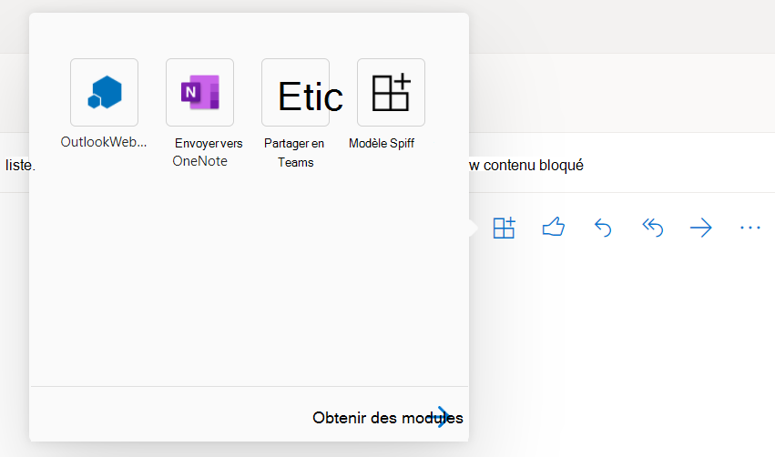

# Déboguer des compléments Office dans Visual Studio

Cet article explique comment déboguer du code côté client dans des modules de Office qui sont créés avec l’un des modèles de projet de Office Add-in dans Visual Studio 2022.  Pour plus d’informations sur le débogage de code côté serveur dans les Office, voir Vue d’ensemble du débogage de Office [Add-ins - Côté serveur ou côté client](../testing/debug-add-ins-overview.md#server-side-or-client-side) ?

> [!NOTE]
> Vous ne pouvez pas utiliser Visual Studio pour déboguer des Office sur Mac. Pour plus d’informations sur le débogage sur un Mac, voir [Déboguer Office des macros complémentaires sur un Mac](../testing/debug-office-add-ins-on-ipad-and-mac.md).

## Réviser les propriétés de création et de débogage

Avant de commencer le débogage, examinez les propriétés de chaque projet pour confirmer que Visual Studio ouvre l’application Office souhaitée et que d’autres propriétés de build et de débogage sont définies correctement.

### Propriétés du projet de complément

Ouvrez **la fenêtre Propriétés** du projet de add-in pour passer en revue les propriétés du projet.

1. Dans **l’Explorateur de solutions**, choisissez le projet de complément (*pas* le projet d’application web).

2. Dans la barre de menu, choisissez **Affichage** > **Fenêtre Propriétés**.

Le tableau suivant décrit les propriétés du projet de complément.

|Propriété|Description|
|:-----|:-----|
|**Action de démarrage**|Spécifie le mode de débogage pour votre complément. Cette valeur doit être définie **sur Microsoft Edge** pour un Outlook de recherche. Pour toutes les autres applications Office, il doit être Office **client de bureau**.|
|**Document de démarrage** (Compléments Excel, PowerPoint et Word uniquement)|Spécifie le document à ouvrir lors du démarrage du projet. Dans un nouveau projet, il s’agit de **[Nouveau Excel Workbook]**, **[Nouveau document Word]** ou [Nouvelle présentation **PowerPoint]**. Pour spécifier un document particulier, suivez les étapes de la procédure d’utilisation d’un [document existant pour déboguer le module.](#use-an-existing-document-to-debug-the-add-in)|
|**Projet Web**|Spécifie le nom du projet web associé au complément.|
|**Adresse e-mail** (Compléments Outlook uniquement)|Spécifie l’adresse de messagerie du compte utilisateur dans Exchange Server ou Exchange Online avec lequel vous souhaitez tester votre complément Outlook. Si ce n’est pas le cas, l’adresse de messagerie vous est demandé lorsque vous commencez le débogage.|
|**Url EWS** (Compléments Outlook uniquement)|Spécifie l’URL Exchange services web (par exemple : `https://www.contoso.com/ews/exchange.aspx`). Cette propriété peut être laissée vide.|
|**Url OWA** (Compléments Outlook uniquement)|Spécifie l’OUTLOOK SUR LE WEB URL (par exemple : `https://www.contoso.com/owa`). Cette propriété peut être laissée vide.|
|**Utiliser l’authentification multi-facteur** (Compléments Outlook uniquement)|Spécifie la valeur booléle qui indique si l’authentification multifacteur doit être utilisée. La valeur par défaut **est false**, mais la propriété n’a aucun effet pratique. Si vous devez normalement fournir un second facteur pour vous connecter au compte de messagerie, vous serez invité à le faire lorsque vous commencerez le débogage. |
|**Nom d'utilisateur** (Compléments Outlook uniquement)|Spécifie le nom du compte utilisateur dans Exchange Server ou Exchange Online avec lequel vous souhaitez tester votre complément Outlook. Cette propriété peut être laissée vide.|
|**Fichier du projet**|Indique le nom du fichier contenant la version, la configuration et d’autres informations sur le projet.|
|**Dossier du projet**|Précise l’emplacement du fichier de projet.|

> [!NOTE]
> Pour un complément Outlook, vous pouvez choisir de spécifier des valeurs pour une ou plusieurs des propriétés du *complément Outlook uniquement* dans la fenêtre **propriétés**, mais cette opération n’est pas obligatoire.

### Propriétés du projet application Web

Ouvrez la **fenêtre Propriétés** du projet d’application web pour passer en revue les propriétés du projet.

1. Dans **l’Explorateur de** solutions, choisissez le projet d’application web.

2. Dans la barre de menu, choisissez **Affichage** > **Fenêtre Propriétés**.

Le tableau suivant décrit les propriétés du projet d’application web qui sont les plus pertinentes aux projets complément Office.

|Propriété|Description|
|:-----|:-----|
|**SSL activé**|Spécifie si SSL est activé sur le site. Cette propriété doit être définie sur **vrai** pour les projets complément Office.|
|**URL SSL**|Spécifie l’URL HTTPS sécurité pour le site. Lecture seule.|
|**URL**|Spécifie l’URL HTTP pour le site. Lecture seule.|
|**Fichier du projet**|Indique le nom du fichier contenant la version, la configuration et d’autres informations sur le projet.|
|**Dossier du projet**|Précise l’emplacement du fichier de projet. Lecture seule. Le fichier manifeste créé par Visual Studio lors de l’exécution est écrit le `bin\Debug\OfficeAppManifests` dossier dans cet emplacement.|

## Déboguer un projet Excel, PowerPoint ou word

Cette section décrit comment démarrer et déboguer un Excel, un PowerPoint ou un module word.

### Démarrer le projet Excel, PowerPoint ou word

Démarrez le projet en sélectionnant **Débogage** **DebugStart** >  dans la barre de menus ou appuyez sur le bouton F5. Visual Studio créer automatiquement la solution et démarrer l’application Office hôte.

Lorsque Visual Studio crée le projet, il effectue les tâches suivantes :

1. Crée une copie du fichier manifeste XML et l’ajoute au  `_ProjectName_\bin\Debug\OfficeAppManifests` répertoire. L Office qui héberge votre application utilise cette copie lorsque vous démarrez Visual Studio déboguer le module.

2. Crée un ensemble d’entrées de Registre sur votre ordinateur Windows qui permet au module d’apparaître dans l’application Office application.

3. Crée le projet d’application web, puis le déploie sur le serveur web IIS local (`https://localhost`).

4. S’il s’agit du premier projet de add-in que vous avez déployé sur le serveur web IIS local, vous pouvez être invité à installer un certificat Self-Signed dans le magasin de certificats racines de confiance de l’utilisateur actuel. Cela est nécessaire pour qu’IIS Express puisse afficher correctement le contenu de votre complément.

> [!NOTE]
> Si Office utilise le contrôle Edge Legacy webview (EdgeHTML) pour exécuter des applications sur votre ordinateur Windows, Visual Studio peut vous inviter à ajouter une exemption de bouclisation réseau locale. Cela est nécessaire pour que le contrôle webview puisse accéder au site web déployé sur le serveur web IIS local. Vous pouvez également modifier ce paramètre à tout moment dans Visual Studio sous **Outils** > **Options** > **Outils Office (web)** > **Débogage de compléments web**. Pour savoir quel contrôle de navigateur est utilisé sur votre ordinateur Windows, voir [Navigateurs utilisés par les Office de recherche](../concepts/browsers-used-by-office-web-add-ins.md).

Visual Studio effectue ensuite les actions suivantes :

1. Modifie l’élément [SourceLocation](../reference/manifest/sourcelocation.md) du fichier manifeste XML (qui a été copié `_ProjectName_\bin\Debug\OfficeAppManifests` dans le répertoire) `~remoteAppUrl` en remplaçant le jeton par l’adresse complète de la page de démarrage (par exemple, `https://localhost:44302/Home.html`).

2. Il démarre le projet d’application web dans IIS Express.

3. Valide le manifeste. Pour réviser les règles de validation du fichier manifeste XML dans votre projet, voir [Manifeste XML des compléments Office](../develop/add-in-manifests.md). 

   > [!IMPORTANT]
   > Les Office XSD de manifeste Visual Studio installés sont à jour. Si vous obtenez des erreurs de validation pour le manifeste, votre première étape de dépannage doit consister à remplacer un ou plusieurs de ces fichiers par les dernières versions. Pour obtenir des instructions détaillées, voir [Erreurs de validation](../testing/troubleshoot-development-errors.md#manifest-schema-validation-errors-in-visual-studio-projects) de schéma de manifeste Visual Studio projets.

4. Ouvre l’Office’application et charge une version de version de votre application.

### Déboguer le Excel, PowerPoint ou le add-in Word

1. Lancez le module dans l’application Office’application. Par exemple, s’il s’agit d’un add-in du volet Des tâches, il aura ajouté  un bouton au ruban Accueil (par exemple, un bouton Afficher le volet **Des** tâches). Sélectionnez le bouton dans le ruban. 

   > [!NOTE]
   > Si votre add-in n’est pas chargé de manière Visual Studio, vous pouvez le recharger manuellement. Dans Excel, PowerPoint ou Word, sélectionnez l’onglet Insertion, puis la  flèche vers le bas située à droite de Mes **modules.**
   >
   > 
   >
   > Dans la liste des compléments disponibles, recherchez la section **Compléments développeur** et sélectionnez votre complément pour effectuer cette opération.

   > [!TIP]
   > Le volet Des tâches peut apparaître vide lors de sa première ouverture. Si c’est le cas, il doit s’restituer correctement lorsque vous lancez les outils de débogage dans une étape ultérieure.

3. Ouvrez [le menu Personnalité](../design/task-pane-add-ins.md#personality-menu) , puis **sélectionnez Attacher un débogger**. Cela permet d’ouvrir les outils de débogage pour le contrôle webview que Office utilise pour exécuter des Windows ordinateur. Vous pouvez définir des points d’arrêt et coder pas à pas, comme décrit dans l’un des articles suivants :

    - [Déboguer des compléments à l’aide des outils de développement pour Internet Explorer](../testing/debug-add-ins-using-f12-tools-ie.md)
    - [Déboguer des compléments à l’aide des outils de développement pour la version héritée Edge](../testing/debug-add-ins-using-devtools-edge-legacy.md)
    - [Déboguer des compléments à l’aide des Outils de développement dans Microsoft Edge (basés sur Chromium)](../testing/debug-add-ins-using-devtools-edge-chromium.md)

4. Pour apporter des modifications à votre code, arrêtez d’abord la session de débogage dans Visual Studio puis fermez l Office application. A apporté vos modifications et démarrez une nouvelle session de débogage.

## Déboguer un Outlook de recherche

Cette section décrit comment démarrer et déboguer un Outlook de travail.

### Démarrer le Outlook projet de module

Démarrez le projet en sélectionnant **Débogage** **DebugStart** >  dans la barre de menus ou appuyez sur le bouton F5. Visual Studio créer automatiquement la solution et lancer la page Outlook de votre location Microsoft 365.

Lorsque Visual Studio crée le projet, il effectue les tâches suivantes.

1. Vous invite à vous connecter aux informations d’identification. Si vous êtes invité à vous connectez à plusieurs reprises ou si vous recevez une erreur vous signalant que vous n’êtes pas autorisé, l’thth de base peut être désactivée pour les comptes sur votre client Microsoft 365. Dans ce cas, essayez d’utiliser un compte Microsoft à la place. Vous pouvez également essayer de définir la propriété Utiliser l’th **auth multi-facteur** sur **True** dans le volet Outlook de propriétés du projet de l’Application Web. Voir [Propriétés du projet de add-in](#add-in-project-properties).

1. Crée une copie du fichier manifeste XML et l’ajoute au `_ProjectName_\bin\Debug\OfficeAppManifests` répertoire. Outlook utilise cette copie lorsque vous démarrez Visual Studio déboguer le module.

2. Crée le projet d’application web, puis le déploie sur le serveur web IIS local (`https://localhost`).

3. S’il s’agit du premier projet de add-in que vous avez déployé sur le serveur web IIS local, vous pouvez être invité à installer un certificat Self-Signed dans le magasin de certificats racines de confiance de l’utilisateur actuel. Cela est nécessaire pour qu’IIS Express puisse afficher correctement le contenu de votre complément.

> [!NOTE]
> Si Office utilise le contrôle Edge Legacy webview (EdgeHTML) pour exécuter des applications sur votre ordinateur Windows, Visual Studio peut vous inviter à ajouter une exemption de bouclisation réseau locale. Cela est nécessaire pour que le contrôle webview puisse accéder au site web déployé sur le serveur web IIS local. Vous pouvez également modifier ce paramètre à tout moment dans Visual Studio sous **Outils** > **Options** > **Outils Office (web)** > **Débogage de compléments web**. Pour savoir quel contrôle de navigateur est utilisé sur votre ordinateur Windows, voir [Navigateurs utilisés par les Office de recherche](../concepts/browsers-used-by-office-web-add-ins.md).

Visual Studio effectue ensuite les actions suivantes :

1. Modifie l’élément [SourceLocation](../reference/manifest/sourcelocation.md) du fichier manifeste XML (qui a été copié `_ProjectName_\bin\Debug\OfficeAppManifests` dans le répertoire) `~remoteAppUrl` en remplaçant le jeton par l’adresse complète de la page de démarrage (par exemple, `https://localhost:44302/Home.html`).

2. Il démarre le projet d’application web dans IIS Express.

3. Valide le manifeste. Pour réviser les règles de validation du fichier manifeste XML dans votre projet, voir [Manifeste XML des compléments Office](../develop/add-in-manifests.md). 

   > [!IMPORTANT]
   > Les Office XSD de manifeste Visual Studio installés sont à jour. Si vous obtenez des erreurs de validation pour le manifeste, votre première étape de dépannage doit consister à remplacer un ou plusieurs de ces fichiers par les dernières versions. Pour obtenir des instructions détaillées, voir [Erreurs de validation](../testing/troubleshoot-development-errors.md#manifest-schema-validation-errors-in-visual-studio-projects) de schéma de manifeste Visual Studio projets.

4. Ouvre la page Outlook de votre location Microsoft 365 dans Microsoft Edge.

### Déboguer le Outlook de projet

1. Dans la page Outlook, sélectionnez un message électronique ou un élément de rendez-vous pour l’ouvrir dans sa propre fenêtre. 

2. Appuyez sur F12 pour ouvrir l’outil de débogage Edge.

3. Une fois l’outil ouvert, lancez le module. Par exemple, dans la barre d’outils en haut d’un message, sélectionnez le bouton Plus d’applications, puis sélectionnez votre application dans la ligne de la ligne qui s’ouvre.

   

4. Utilisez les instructions de l’un des articles suivants pour définir des points d’arrêt et coder pas à pas. Chacun d’eux a un lien vers des instructions plus détaillées.

   - [Déboguer des compléments à l’aide des outils de développement pour la version héritée Edge](../testing/debug-add-ins-using-devtools-edge-legacy.md)
   - [Déboguer des compléments à l’aide des Outils de développement dans Microsoft Edge (basés sur Chromium)](../testing/debug-add-ins-using-devtools-edge-chromium.md)

   > [!TIP]
   > Pour déboguer le code `Office.initialize` `Office.onReady` qui s’exécute dans la méthode ou une méthode qui s’exécute à l’ouverture du module, définissez vos points d’arrêt, puis fermez et rouvrez le module. Pour plus d’informations sur ces méthodes, voir [Initialize your Office Add-in](../develop/initialize-add-in.md).

5. Pour apporter des modifications à votre code, arrêtez d’abord la session de débogage dans Visual Studio puis fermez les pages Outlook suivantes. A apporté vos modifications et démarrez une nouvelle session de débogage.

## Utiliser un document existant pour déboguer le complément

Si vous avez un document qui contient les données de test à utiliser pendant le débogage de votre complément Excel, PowerPoint ou Word, Visual Studio peut être configuré pour ouvrir ce dernier lorsque vous démarrez le projet. Pour spécifier un document existant à utiliser pour déboguer le complément, procédez comme suit.

1. Dans **l’Explorateur de solutions**, choisissez le projet de complément (*pas* le projet d’application web).

2. Dans la barre de menus, sélectionnez **Project** > **ajouter un élément existant**.

3. Dans la boîte de dialogue **Ajouter un élément existant**, recherchez et sélectionnez le document que vous souhaitez ajouter.

4. Choisissez le bouton **Ajouter** pour ajouter le document à votre projet.

5. Dans **l’Explorateur de solutions**, choisissez le projet de complément (*pas* le projet d’application web).

6. Dans la barre de menu, choisissez **Affichage** > **Fenêtre Propriétés**.

7. Dans la fenêtre **propriétés**, choisissez la liste **Document de démarrage** et sélectionnez le document que vous avez ajouté au projet. Le projet est désormais configuré pour démarrer le complément dans ce document.

## Étapes suivantes

Une fois que votre complément fonctionne comme vous le souhaitez, voir [Déployer et publier votre complément Office](../publish/publish.md) pour en savoir plus sur les méthodes avec lesquelles vous pouvez distribuer le complément aux utilisateurs.
