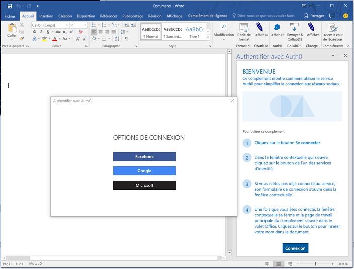
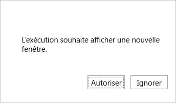
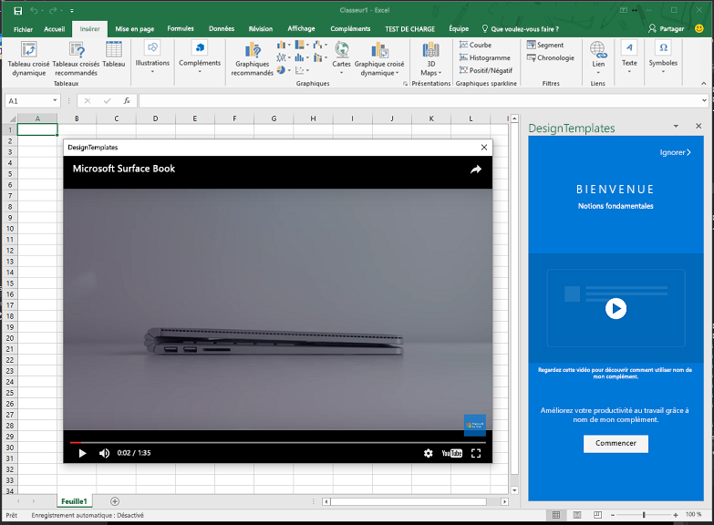

# <a name="use-the-dialog-api-in-your-office-add-ins"></a><span data-ttu-id="f4acd-102">Utiliser l’API de dialogue dans vos compléments Office</span><span class="sxs-lookup"><span data-stu-id="f4acd-102">Use the Dialog API in your Office Add-ins</span></span>

<span data-ttu-id="f4acd-p101">Vous pouvez utiliser l’[API de dialogue](/javascript/api/office/office.ui) pour ouvrir des boîtes de dialogue dans votre complément Office. Cet article fournit des conseils concernant l’utilisation de l’API de dialogue dans votre complément Office.</span><span class="sxs-lookup"><span data-stu-id="f4acd-p101">You can use the [Dialog API](/javascript/api/office/office.ui) to open dialog boxes in your Office Add-in. This article provides guidance for using the Dialog API in your Office Add-in.</span></span>

> [!NOTE]
> <span data-ttu-id="f4acd-p102">Pour plus d’informations sur les compléments où l’API de dialogue est actuellement prise en charge, consultez la rubrique relative aux [ensembles de conditions requises de l’API de dialogue](/office/dev/add-ins/reference/requirement-sets/dialog-api-requirement-sets). L’API de dialogue est actuellement prise en charge pour Word, Excel, PowerPoint et Outlook.</span><span class="sxs-lookup"><span data-stu-id="f4acd-p102">For information about where the Dialog API is currently supported, see [Dialog API requirement sets](/office/dev/add-ins/reference/requirement-sets/dialog-api-requirement-sets). The Dialog API is currently supported for Word, Excel, PowerPoint, and Outlook.</span></span>

> <span data-ttu-id="f4acd-107">Un scénario principal pour l’API de dialogue consiste à activer l’authentification pour une ressource telle que Google ou Facebook.</span><span class="sxs-lookup"><span data-stu-id="f4acd-107">A primary scenario for the Dialog APIs is to enable authentication with a resource such as Google or Facebook.</span></span>

<span data-ttu-id="f4acd-108">Envisagez d’ouvrir une boîte de dialogue à partir d’un volet Office, d’un complément de contenu ou d’un [complément de commande](../design/add-in-commands.md) pour effectuer les opérations suivantes :</span><span class="sxs-lookup"><span data-stu-id="f4acd-108">Consider opening a dialog box from a task pane or content add-in or [add-in command](../design/add-in-commands.md) to do the following:</span></span>

- <span data-ttu-id="f4acd-109">afficher les pages de connexion qui ne peuvent pas être ouvertes directement dans un volet Office ;</span><span class="sxs-lookup"><span data-stu-id="f4acd-109">Display sign in pages that cannot be opened directly in a task pane.</span></span>
- <span data-ttu-id="f4acd-110">fournir davantage d’espace à l’écran, ou même un plein écran, pour certaines tâches exécutées dans votre complément ;</span><span class="sxs-lookup"><span data-stu-id="f4acd-110">Provide more screen space, or even a full screen, for some tasks in your add-in.</span></span>
- <span data-ttu-id="f4acd-111">héberger une vidéo qui serait trop petite si elle était limitée à un volet Office.</span><span class="sxs-lookup"><span data-stu-id="f4acd-111">Host a video that would be too small if confined to a task pane.</span></span>

> [!NOTE]
> <span data-ttu-id="f4acd-p103">Comme des éléments d’IU qui se chevauchent peuvent gêner des utilisateurs, évitez d’ouvrir une boîte de dialogue à partir d’un volet Office à moins que votre scénario l’exige. Lorsque vous envisagez d’utiliser la surface d’exposition d’un volet Office, tenez compte du fait que les volets Office peuvent être affichés sous forme d’onglets. Pour voir un exemple, consultez la rubrique relative à l’exemple de [complément Excel JavaScript SalesTracker](https://github.com/OfficeDev/Excel-Add-in-JavaScript-SalesTracker).</span><span class="sxs-lookup"><span data-stu-id="f4acd-p103">Because overlapping UI elements are discouraged, avoid opening a dialog from a task pane unless your scenario requires it. When you consider how to use the surface area of a task pane, note that task panes can be tabbed. For an example, see the [Excel Add-in JavaScript SalesTracker](https://github.com/OfficeDev/Excel-Add-in-JavaScript-SalesTracker) sample.</span></span>

<span data-ttu-id="f4acd-115">L’image suivante montre un exemple de boîte de dialogue.</span><span class="sxs-lookup"><span data-stu-id="f4acd-115">The following image shows an example of a dialog box.</span></span>



<span data-ttu-id="f4acd-p104">Notez que la boîte de dialogue s’ouvre toujours au centre de l’écran. L’utilisateur peut la déplacer et la redimensionner. La fenêtre est *non modale* : un utilisateur peut continuer à interagir à la fois avec le document dans l’application Office hôte et avec la page hôte dans le volet Office, le cas échéant.</span><span class="sxs-lookup"><span data-stu-id="f4acd-p104">Note that the dialog box always opens in the center of the screen. The user can move and resize it. The window is *nonmodal*--a user can continue to interact with both the document in the host Office application and with the host page in the task pane, if there is one.</span></span>

## <a name="dialog-api-scenarios"></a><span data-ttu-id="f4acd-120">Scénarios de l’API de dialogue</span><span class="sxs-lookup"><span data-stu-id="f4acd-120">Dialog API scenarios</span></span>

<span data-ttu-id="f4acd-121">Les API JavaScript Office prennent en charge les scénarios suivants avec un objet [Dialog](/javascript/api/office/office.dialog) et deux fonctions dans l’[espace de noms Office.context.ui](/javascript/api/office/office.ui).</span><span class="sxs-lookup"><span data-stu-id="f4acd-121">The Office JavaScript APIs support the following scenarios with a [Dialog](/javascript/api/office/office.dialog) object and two functions in the [Office.context.ui namespace](/javascript/api/office/office.ui).</span></span>

### <a name="open-a-dialog-box"></a><span data-ttu-id="f4acd-122">Ouvrir une boîte de dialogue.</span><span class="sxs-lookup"><span data-stu-id="f4acd-122">Open a dialog box</span></span>

<span data-ttu-id="f4acd-p105">Pour ouvrir une boîte de dialogue, votre code dans le volet Office appelle la méthode [displayDialogAsync](/javascript/api/office/office.ui) et lui transmet l’URL de la ressource que vous voulez ouvrir. Il s’agit généralement d’une page, mais ce peut être une méthode du contrôleur dans une application MVC, un itinéraire, une méthode de service web ou toute autre ressource. Dans cet article, les termes « page » ou « site web » font référence à la ressource dans la boîte de dialogue. Le code suivant est un exemple simple.</span><span class="sxs-lookup"><span data-stu-id="f4acd-p105">To open a dialog box, your code in the task pane calls the [displayDialogAsync](/javascript/api/office/office.ui) method and passes to it the URL of the resource that you want to open. This is usually a page, but it can be a controller method in an MVC application, a route, a web service method, or any other resource. In this article, 'page' or 'website' refers to the resource in the dialog. The following code is a simple example:</span></span>

```js
Office.context.ui.displayDialogAsync('https://myAddinDomain/myDialog.html');
```

> [!NOTE]
> - <span data-ttu-id="f4acd-p106">L’URL utilise le protocole HTTP**S**. Ceci est obligatoire pour toutes les pages chargées dans une boîte de dialogue, pas seulement la première page chargée.</span><span class="sxs-lookup"><span data-stu-id="f4acd-p106">The URL uses the HTTP**S** protocol. This is mandatory for all pages loaded in a dialog box, not just the first page loaded.</span></span>
> - <span data-ttu-id="f4acd-129">Le domaine de la ressource figurant dans la boîte de dialogue est le même que celui de la page hôte, qui peut être la page d’un volet Office ou le [fichier de fonctions](/office/dev/add-ins/reference/manifest/functionfile) d’une commande de complément.</span><span class="sxs-lookup"><span data-stu-id="f4acd-129">The dialog resource's domain is the same as the domain of the host page, which can be the page in a task pane or the [function file](/office/dev/add-ins/reference/manifest/functionfile) of an add-in command.</span></span> <span data-ttu-id="f4acd-130">Obligatoire : la page, la méthode du contrôleur ou toute autre ressource qui est transmise à la méthode `displayDialogAsync` doit se trouver dans le même domaine que la page hôte.</span><span class="sxs-lookup"><span data-stu-id="f4acd-130">This is required: the page, controller method, or other resource that is passed to the `displayDialogAsync` method must be in the same domain as the host page.</span></span>

> [!IMPORTANT]
> <span data-ttu-id="f4acd-131">La page hôte et les ressources de la boîte de dialogue doivent avoir le même domaine complet.</span><span class="sxs-lookup"><span data-stu-id="f4acd-131">The host page and the resources of the dialog must have the same full domain.</span></span> <span data-ttu-id="f4acd-132">Si vous tentez de transmettre `displayDialogAsync` à un sous-domaine du domaine du complément, cela ne fonctionnera pas.</span><span class="sxs-lookup"><span data-stu-id="f4acd-132">If you attempt to pass `displayDialogAsync` a subdomain of the add-in's domain, it will not work.</span></span> <span data-ttu-id="f4acd-133">Le domaine complet et tous les sous-domaines doivent être exactement les mêmes.</span><span class="sxs-lookup"><span data-stu-id="f4acd-133">The full domain, including any subdomain, must match.</span></span>

<span data-ttu-id="f4acd-p109">Une fois que la première page (ou toute autre ressource) est chargée, un utilisateur peut accéder à n’importe quel site web (ou n’importe quelle autre ressource) qui utilise le protocole HTTPS. Vous pouvez également concevoir la première page de façon à ce que l’utilisateur soit immédiatement redirigé vers un autre site.</span><span class="sxs-lookup"><span data-stu-id="f4acd-p109">After the first page (or other resource) is loaded, a user can go to any website (or other resource) that uses HTTPS. You can also design the first page to immediately redirect to another site.</span></span>

<span data-ttu-id="f4acd-136">Par défaut, la boîte de dialogue occupera 80 % de la hauteur et de la largeur de l’écran de l’appareil, mais vous pouvez définir des pourcentages différents en transmettant un objet de configuration à la méthode, comme indiqué dans l’exemple suivant :</span><span class="sxs-lookup"><span data-stu-id="f4acd-136">By default, the dialog box will occupy 80% of the height and width of the device screen, but you can set different percentages by passing a configuration object to the method, as shown in the following example:</span></span>

```js
Office.context.ui.displayDialogAsync('https://myDomain/myDialog.html', {height: 30, width: 20});
```

<span data-ttu-id="f4acd-137">Pour voir un exemple de complément qui effectue ce type d’action, consultez la rubrique relative à l’[exemple d’API de dialogue de complément Office](https://github.com/OfficeDev/Office-Add-in-Dialog-API-Simple-Example).</span><span class="sxs-lookup"><span data-stu-id="f4acd-137">For a sample add-in that does this, see [Office Add-in Dialog API Example](https://github.com/OfficeDev/Office-Add-in-Dialog-API-Simple-Example).</span></span>

<span data-ttu-id="f4acd-p110">Définissez les deux valeurs sur 100 % pour bénéficier d’une réelle d’expérience de plein écran. (Le maximum réel est de 99,5 %, et la fenêtre peut toujours être déplacée et redimensionnée.)</span><span class="sxs-lookup"><span data-stu-id="f4acd-p110">Set both values to 100% to get what is effectively a full screen experience. (The effective maximum is 99.5%, and the window is still moveable and resizable.)</span></span>

> [!NOTE]
> <span data-ttu-id="f4acd-p111">Vous ne pouvez ouvrir qu’une seule boîte de dialogue à partir d’une fenêtre hôte. Toute tentative d’ouverture d’une autre boîte de dialogue génère une erreur. Par exemple, si un utilisateur ouvre une boîte de dialogue à partir d’un volet Office, il ne peut pas ouvrir une seconde boîte de dialogue à partir d’une autre page dans le volet Office. Toutefois, quand une boîte de dialogue est ouverte à partir d’une [commande de complément](../design/add-in-commands.md), la commande ouvre un nouveau fichier HTML (mais invisible) chaque fois qu’elle est sélectionnée. Cela crée une nouvelle fenêtre hôte (invisible), afin que chaque fenêtre de ce type puisse lancer sa propre boîte de dialogue. Pour plus d’informations, reportez-vous à [Erreurs provenant de displayDialogAsync](#errors-from-displaydialogasync).</span><span class="sxs-lookup"><span data-stu-id="f4acd-p111">You can open only one dialog box from a host window. An attempt to open another dialog box generates an error. For example, if a user opens a dialog box from a task pane, she cannot open a second dialog box, from a different page in the task pane. However, when a dialog box is opened from an [add-in command](../design/add-in-commands.md), the command opens a new (but unseen) HTML file each time it is selected. This creates a new (unseen) host window, so each such window can launch its own dialog box. For more information, see [Errors from displayDialogAsync](#errors-from-displaydialogasync).</span></span>

### <a name="take-advantage-of-a-performance-option-in-office-online"></a><span data-ttu-id="f4acd-146">Tirer parti d’une option de performances dans Office Online</span><span class="sxs-lookup"><span data-stu-id="f4acd-146">Take advantage of a performance option in Office Online</span></span>

<span data-ttu-id="f4acd-p112">La propriété `displayInIframe` est une propriété supplémentaire dans l’objet de configuration que vous pouvez transmettre à `displayDialogAsync`. Lorsque cette propriété est définie sur `true` et que le complément est en cours d’exécution dans un document ouvert dans Office Online, la boîte de dialogue s’ouvre sous la forme d’un iFrame flottant et non d’une fenêtre indépendante. Elle s’ouvre ainsi plus rapidement. Voici un exemple :</span><span class="sxs-lookup"><span data-stu-id="f4acd-p112">The `displayInIframe` property is an additional property in the configuration object that you can pass to `displayDialogAsync`. When this property is set to `true`, and the add-in is running in a document opened in Office Online, the dialog box will open as a floating iframe rather than an independent window, which makes it open faster. The following is an example:</span></span>

```js
Office.context.ui.displayDialogAsync('https://myDomain/myDialog.html', {height: 30, width: 20, displayInIframe: true});
```

<span data-ttu-id="f4acd-p113">La valeur par défaut est `false`, ce qui revient à omettre entièrement la propriété. Si le complément n’est pas exécuté dans Office Online, le `displayInIframe` est ignoré.</span><span class="sxs-lookup"><span data-stu-id="f4acd-p113">The default value is `false`, which is the same as omitting the property entirely. If the add-in is not running in Office Online, the `displayInIframe` is ignored.</span></span>

> [!NOTE]
> <span data-ttu-id="f4acd-p114">Vous ne devez **pas** utiliser `displayInIframe: true` si la boîte de dialogue redirige à un moment donné l’utilisateur vers une page qui ne peut pas être ouverte dans un iFrame. Par exemple, les pages de connexion de nombreux services web connus, comme un compte Microsoft et Google, ne peuvent pas être ouvertes dans un iFrame.</span><span class="sxs-lookup"><span data-stu-id="f4acd-p114">You should **not** use `displayInIframe: true` if the dialog will at any point redirect to a page that cannot be opened in an iframe. For example, the sign in pages of many popular web services, such as Google and Microsoft Account, cannot be opened in an iframe.</span></span>

### <a name="handling-pop-up-blockers-with-office-online"></a><span data-ttu-id="f4acd-154">Gestion des bloqueurs de fenêtres publicitaires avec Office Online</span><span class="sxs-lookup"><span data-stu-id="f4acd-154">Handling pop-up blockers with Office Online</span></span>

<span data-ttu-id="f4acd-155">Une tentative d’ouverture d’une boîte de dialogue lorsqu’Office Online est en cours d’utilisation peut entraîner le blocage de celle-ci par le bloqueur de fenêtres publicitaires du navigateur.</span><span class="sxs-lookup"><span data-stu-id="f4acd-155">Attempting to display a dialog while using Office Online may cause the browser's pop-up blocker to block the dialog.</span></span> <span data-ttu-id="f4acd-156">Il est possible de contourner le bloqueur si l’utilisateur de votre complément accepte d’abord une invite du complément.</span><span class="sxs-lookup"><span data-stu-id="f4acd-156">The browser's pop-up blocker can be circumvented if the user of your add-in first agrees to a prompt from the add-in.</span></span> <span data-ttu-id="f4acd-157">L’objet [DialogOptions](/javascript/api/office/office.dialogoptions) de la méthode `displayDialogAsync` possède la propriété `promptBeforeOpen` permettant de déclencher l’ouverture de ce type de fenêtre contextuelle.</span><span class="sxs-lookup"><span data-stu-id="f4acd-157">`displayDialogAsync`'s [DialogOptions](/javascript/api/office/office.dialogoptions) has the `promptBeforeOpen` property to trigger such a pop-up.</span></span> <span data-ttu-id="f4acd-158">`promptBeforeOpen` est une valeur booléenne qui est associée au comportement suivant :</span><span class="sxs-lookup"><span data-stu-id="f4acd-158">`promptBeforeOpen` is a boolean value which provides the following behavior:</span></span>

 - <span data-ttu-id="f4acd-159">`true` -L’infrastructure affiche une fenêtre contextuelle pour déclencher la navigation et éviter le bloqueur de fenêtres publicitaires du navigateur.</span><span class="sxs-lookup"><span data-stu-id="f4acd-159">`true` - The framework displays a pop-up to trigger the navigation and avoid the browser's pop-up blocker.</span></span> 
 - <span data-ttu-id="f4acd-160">`false` -La boîte de dialogue n’est pas affichée et le développeur doit gérer les fenêtres contextuelles (en fournissant un artefact d’interface utilisateur pour déclencher la navigation).</span><span class="sxs-lookup"><span data-stu-id="f4acd-160">`false` - The dialog will not be shown and the developer must handle pop-ups (by providing a user interface artifact to trigger the navigation).</span></span> 
 
<span data-ttu-id="f4acd-161">La fenêtre contextuelle est semblable à la capture d’écran suivante :</span><span class="sxs-lookup"><span data-stu-id="f4acd-161">The pop-up looks similiar to that in the following screenshot:</span></span>


 
### <a name="send-information-from-the-dialog-box-to-the-host-page"></a><span data-ttu-id="f4acd-163">Envoi d’informations à la page hôte à partir de la boîte de dialogue</span><span class="sxs-lookup"><span data-stu-id="f4acd-163">Send information from the dialog box to the host page</span></span>

<span data-ttu-id="f4acd-164">La boîte de dialogue ne peut pas communiquer avec la page hôte dans le volet Office, sauf si :</span><span class="sxs-lookup"><span data-stu-id="f4acd-164">The dialog box cannot communicate with the host page in the task pane unless:</span></span>

- <span data-ttu-id="f4acd-165">la page active dans la boîte de dialogue se trouve dans le même domaine que la page hôte ;</span><span class="sxs-lookup"><span data-stu-id="f4acd-165">The current page in the dialog box is in the same domain as the host page.</span></span>
- <span data-ttu-id="f4acd-p116">la bibliothèque JavaScript Office est chargée dans la page. (Comme n’importe quelle page qui utilise la bibliothèque JavaScript Office, le script de la page doit attribuer une méthode à la propriété `Office.initialize`, bien qu’il puisse s’agir d’une méthode vide. Pour plus d’informations, voir [Initialisation de votre complément](understanding-the-javascript-api-for-office.md#initializing-your-add-in).)</span><span class="sxs-lookup"><span data-stu-id="f4acd-p116">The Office JavaScript library is loaded in the page. (Like any page that uses the Office JavaScript library, script for the page must assign a method to the `Office.initialize` property, although it can be an empty method. For details, see [Initializing your add-in](understanding-the-javascript-api-for-office.md#initializing-your-add-in).)</span></span>

<span data-ttu-id="f4acd-p117">Le code de la page de boîte de dialogue utilise la fonction `messageParent` pour envoyer une valeur booléenne ou un message de type chaîne à la page hôte. La chaîne peut être un mot, une phrase, un blob XML, un JSON converti en chaîne ou un autre élément pouvant être sérialisé en chaîne. Voici un exemple :</span><span class="sxs-lookup"><span data-stu-id="f4acd-p117">Code in the dialog page uses the `messageParent` function to send either a Boolean value or a string message to the host page. The string can be a word, sentence, XML blob, stringified JSON, or anything else that can be serialized to a string. The following is an example:</span></span>

```js
if (loginSuccess) {
    Office.context.ui.messageParent(true);
}
```

> [!NOTE]
> - <span data-ttu-id="f4acd-p118">La fonction `messageParent` est l’une des deux *seules* API Office pouvant être appelées dans la boîte de dialogue. L’autre est `Office.context.requirements.isSetSupported`. Pour plus d’informations, consultez la rubrique relative à la [spécification d’hôtes Office et de conditions requises d’API](specify-office-hosts-and-api-requirements.md).</span><span class="sxs-lookup"><span data-stu-id="f4acd-p118">The `messageParent` function is one of *only* two Office APIs that can be called in the dialog box. The other is `Office.context.requirements.isSetSupported`. For information about it, see [Specify Office hosts and API requirements](specify-office-hosts-and-api-requirements.md).</span></span>
> - <span data-ttu-id="f4acd-175">La fonction `messageParent` peut uniquement être appelée sur une page ayant le même domaine (y compris les mêmes protocole et port) que la page hôte.</span><span class="sxs-lookup"><span data-stu-id="f4acd-175">The `messageParent` function can only be called on a page with the same domain (including protocol and port) as the host page.</span></span>

<span data-ttu-id="f4acd-176">Dans l’exemple suivant, `googleProfile` est une version convertie en chaîne du profil Google de l’utilisateur.</span><span class="sxs-lookup"><span data-stu-id="f4acd-176">In the next example, `googleProfile` is a stringified version of the user's Google profile.</span></span>

```js
if (loginSuccess) {
    Office.context.ui.messageParent(googleProfile);
}
```

<span data-ttu-id="f4acd-p119">La page hôte doit être configurée de façon à recevoir le message. Pour ce faire, ajoutez un paramètre de rappel à l’appel d’origine de `displayDialogAsync`. Le rappel attribue un gestionnaire à l’événement `DialogMessageReceived`. Voici un exemple :</span><span class="sxs-lookup"><span data-stu-id="f4acd-p119">The host page must be configured to receive the message. You do this by adding a callback parameter to the original call of `displayDialogAsync`. The callback assigns a handler to the `DialogMessageReceived` event. The following is an example:</span></span>

```js
var dialog;
Office.context.ui.displayDialogAsync('https://myDomain/myDialog.html', {height: 30, width: 20},
    function (asyncResult) {
        dialog = asyncResult.value;
        dialog.addEventHandler(Office.EventType.DialogMessageReceived, processMessage);
    }
);
```

> [!NOTE]
> - <span data-ttu-id="f4acd-p120">Office transmet un objet [AsyncResult](/javascript/api/office/office.asyncresult) au rappel. Il représente le résultat de la tentative d’ouverture de la boîte de dialogue. Il ne représente pas le résultat de tous les événements dans la boîte de dialogue. Pour plus d’informations sur cette distinction, consultez la section [Gestion des erreurs et des événements](#handle-errors-and-events).</span><span class="sxs-lookup"><span data-stu-id="f4acd-p120">Office passes an [AsyncResult](/javascript/api/office/office.asyncresult) object to the callback. It represents the result of the attempt to open the dialog box. It does not represent the outcome of any events in the dialog box. For more on this distinction, see the section [Handle errors and events](#handle-errors-and-events).</span></span>
> - <span data-ttu-id="f4acd-185">La propriété `value` de `asyncResult` est définie sur un objet [Dialog](/javascript/api/office/office.dialog), qui existe dans la page hôte, pas dans le contexte d’exécution de la boîte de dialogue.</span><span class="sxs-lookup"><span data-stu-id="f4acd-185">The `value` property of the `asyncResult` is set to a [Dialog](/javascript/api/office/office.dialog) object, which exists in the host page, not in the dialog box's execution context.</span></span>
> - <span data-ttu-id="f4acd-p121">`processMessage` est la fonction qui gère l’événement. Vous pouvez lui donner le nom que vous souhaitez.</span><span class="sxs-lookup"><span data-stu-id="f4acd-p121">The `processMessage` is the function that handles the event. You can give it any name you want.</span></span>
> - <span data-ttu-id="f4acd-188">La variable `dialog` est déclarée avec une portée plus large que le rappel, car elle est également référencée dans `processMessage`.</span><span class="sxs-lookup"><span data-stu-id="f4acd-188">The `dialog` variable is declared at a wider scope than the callback because it is also referenced in `processMessage`.</span></span>

<span data-ttu-id="f4acd-189">Voici un exemple simple de gestionnaire pour l’événement `DialogMessageReceived` :</span><span class="sxs-lookup"><span data-stu-id="f4acd-189">The following is a simple example of a handler for the `DialogMessageReceived` event:</span></span>

```js
function processMessage(arg) {
    var messageFromDialog = JSON.parse(arg.message);
    showUserName(messageFromDialog.name);
}
```

> [!NOTE]
> - <span data-ttu-id="f4acd-p122">Office transmet l’objet `arg` au gestionnaire. Sa propriété `message` est la valeur booléenne ou la chaîne envoyée par l’appel de `messageParent` dans la boîte de dialogue. Dans cet exemple, il s’agit d’une représentation convertie en chaîne du profil de l’utilisateur à partir d’un service tel qu’un compte Microsoft ou Google, qui est donc désérialisé en objet avec `JSON.parse`.</span><span class="sxs-lookup"><span data-stu-id="f4acd-p122">Office passes the `arg` object to the handler. Its `message` property is the Boolean or string sent by the call of `messageParent` in the dialog. In this example, it is a stringified representation of a user's profile from a service such as Microsoft Account or Google, so it is deserialized back to an object with `JSON.parse`.</span></span>
> - <span data-ttu-id="f4acd-p123">L’implémentation `showUserName` n’est pas visible. Elle peut afficher un message de bienvenue personnalisé dans le volet Office.</span><span class="sxs-lookup"><span data-stu-id="f4acd-p123">The `showUserName` implementation is not shown. It might display a personalized welcome message on the task pane.</span></span>

<span data-ttu-id="f4acd-195">Lorsque l’intervention de l’utilisateur sur la boîte de dialogue est terminée, votre gestionnaire de messages doit fermer la boîte de dialogue, comme indiqué dans cet exemple.</span><span class="sxs-lookup"><span data-stu-id="f4acd-195">When the user interaction with the dialog box is completed, your message handler should close the dialog box, as shown in this example.</span></span>

```js
function processMessage(arg) {
    dialog.close();
    // message processing code goes here;
}
```

> [!NOTE]
> - <span data-ttu-id="f4acd-196">L’objet `dialog` doit être le même que celui renvoyé par l’appel de `displayDialogAsync`.</span><span class="sxs-lookup"><span data-stu-id="f4acd-196">The `dialog` object must be the same one that is returned by the call of `displayDialogAsync`.</span></span>
> - <span data-ttu-id="f4acd-197">L’appel de `dialog.close` indique à Office de fermer immédiatement la boîte de dialogue.</span><span class="sxs-lookup"><span data-stu-id="f4acd-197">The call of `dialog.close` tells Office to immediately close the dialog box.</span></span>

<span data-ttu-id="f4acd-198">Pour voir un exemple de complément qui utilise ces techniques, consultez la rubrique relative à l’[exemple d’API de dialogue de complément Office](https://github.com/OfficeDev/Office-Add-in-Dialog-API-Simple-Example).</span><span class="sxs-lookup"><span data-stu-id="f4acd-198">For a sample add-in that uses these techniques, see [Office Add-in Dialog API Example](https://github.com/OfficeDev/Office-Add-in-Dialog-API-Simple-Example).</span></span>

<span data-ttu-id="f4acd-p124">Si le complément a besoin d’ouvrir une autre page du volet Office après avoir reçu le message, vous pouvez utiliser la méthode `window.location.replace` (ou `window.location.href`) en tant que dernière ligne du gestionnaire. Voici un exemple :</span><span class="sxs-lookup"><span data-stu-id="f4acd-p124">If the add-in needs to open a different page of the task pane after receiving the message, you can use the `window.location.replace` method (or `window.location.href`) as the last line of the handler. The following is an example:</span></span>

```js
function processMessage(arg) {
    // message processing code goes here;
    window.location.replace("/newPage.html");
    // Alternatively ...
    // window.location.href = "/newPage.html";
}
```

<span data-ttu-id="f4acd-201">Pour voir un exemple de complément qui effectue ce type d’action, consultez l’article relatif à l’exemple [Insérer des graphiques Excel à l’aide de Microsoft Graph dans un complément PowerPoint](https://github.com/OfficeDev/PowerPoint-Add-in-Microsoft-Graph-ASPNET-InsertChart).</span><span class="sxs-lookup"><span data-stu-id="f4acd-201">For an example of an add-in that does this, see the [Insert Excel charts using Microsoft Graph in a PowerPoint add-in](https://github.com/OfficeDev/PowerPoint-Add-in-Microsoft-Graph-ASPNET-InsertChart) sample.</span></span>

#### <a name="conditional-messaging"></a><span data-ttu-id="f4acd-202">Messagerie conditionnelle</span><span class="sxs-lookup"><span data-stu-id="f4acd-202">Conditional messaging</span></span>

<span data-ttu-id="f4acd-p125">Étant donné que vous pouvez envoyer plusieurs appels `messageParent` à partir de la boîte de dialogue, mais que vous n’avez qu’un seul gestionnaire dans la page hôte pour l’événement `DialogMessageReceived`, le gestionnaire doit utiliser la logique conditionnelle pour distinguer les différents messages. Par exemple, si la boîte de dialogue invite un utilisateur à se connecter à un fournisseur d’identité tel qu’un compte Microsoft ou Google, elle envoie le profil de l’utilisateur sous la forme d’un message. Si l’authentification échoue, la boîte de dialogue envoie des informations sur l’erreur à la page hôte, comme dans l’exemple suivant :</span><span class="sxs-lookup"><span data-stu-id="f4acd-p125">Because you can send multiple `messageParent` calls from the dialog box, but you have only one handler in the host page for the `DialogMessageReceived` event, the handler must use conditional logic to distinguish different messages. For example, if the dialog box prompts a user to sign in to an identity provider such as Microsoft Account or Google, it sends the user's profile as a message. If authentication fails, the dialog box sends error information to the host page, as in the following example:</span></span>

```js
if (loginSuccess) {
    var userProfile = getProfile();
    var messageObject = {messageType: "signinSuccess", profile: userProfile};
    var jsonMessage = JSON.stringify(messageObject);
    Office.context.ui.messageParent(jsonMessage);
} else {
    var errorDetails = getError();
    var messageObject = {messageType: "signinFailure", error: errorDetails};
    var jsonMessage = JSON.stringify(messageObject);
    Office.context.ui.messageParent(jsonMessage);
}
```

> [!NOTE]
> - <span data-ttu-id="f4acd-206">La variable `loginSuccess` serait initialisée en lisant la réponse HTTP à partir du fournisseur d’identité.</span><span class="sxs-lookup"><span data-stu-id="f4acd-206">The `loginSuccess` variable would be initialized by reading the HTTP response from the identity provider.</span></span>
> - <span data-ttu-id="f4acd-p126">L’implémentation des fonctions `getProfile` et `getError` n’est pas affichée. Chacune obtient des données à partir d’un paramètre de requête ou du corps de la réponse HTTP.</span><span class="sxs-lookup"><span data-stu-id="f4acd-p126">The the implementation of the `getProfile` and `getError` functions are not not shown. They each get data from a query parameter or from the body of the HTTP response.</span></span>
> - <span data-ttu-id="f4acd-p127">Des objets anonymes de différents types sont envoyés selon que la connexion a réussi ou non. Tous deux ont une propriété `messageType`, mais un a une propriété `profile` et l’autre une propriété `error`.</span><span class="sxs-lookup"><span data-stu-id="f4acd-p127">Anonymous objects of different types are sent depending on whether the sign in was successful. Both have a `messageType` property, but one has a `profile` property and the other has an `error` property.</span></span>

<span data-ttu-id="f4acd-p128">Le code du gestionnaire dans la page hôte utilise la valeur de la propriété `messageType` pour créer une branche comme le montre l’exemple suivant. Notez que la fonction `showUserName` est identique à celle de l’exemple précédent et que la fonction `showNotification` affiche l’erreur dans l’interface utilisateur de la page hôte.</span><span class="sxs-lookup"><span data-stu-id="f4acd-p128">The handler code in the host page uses the value of the `messageType` property to branch as shown in the following example. Note that the `showUserName` function is the same as in the previous example and `showNotification` function displays the error in the host page's UI.</span></span>

```js
function processMessage(arg) {
    var messageFromDialog = JSON.parse(arg.message);
    if (messageFromDialog.messageType === "signinSuccess") {
        dialog.close();
        showUserName(messageFromDialog.profile.name);
        window.location.replace("/newPage.html");
    } else {
        dialog.close();
        showNotification("Unable to authenticate user: " + messageFromDialog.error);
    }
}
```

> [!NOTE]
> <span data-ttu-id="f4acd-213">L'implémentation `showNotification` n'est pas montrée dans l'exemple de code fourni par cet article.</span><span class="sxs-lookup"><span data-stu-id="f4acd-213">The `showNotification` implementation is not shown in the sample code provided by this article.</span></span> <span data-ttu-id="f4acd-214">Pour un exemple d'implémentation de cette fonction dans votre complément, voir [Exemple d'API de dialogue de complément Office](https://github.com/OfficeDev/Office-Add-in-Dialog-API-Simple-Example).</span><span class="sxs-lookup"><span data-stu-id="f4acd-214">For an example of how you might implement this function within your add-in, see [Office Add-in Dialog API Example](https://github.com/OfficeDev/Office-Add-in-Dialog-API-Simple-Example).</span></span>

### <a name="closing-the-dialog-box"></a><span data-ttu-id="f4acd-215">Fermeture de la boîte de dialogue</span><span class="sxs-lookup"><span data-stu-id="f4acd-215">Closing the dialog box</span></span>

<span data-ttu-id="f4acd-p130">Vous pouvez implémenter un bouton de fermeture dans la boîte de dialogue. Pour ce faire, le gestionnaire d’événements Click du bouton doit utiliser `messageParent` pour indiquer à la page hôte que vous avez cliqué sur le bouton. Voici un exemple :</span><span class="sxs-lookup"><span data-stu-id="f4acd-p130">You can implement a button in the dialog box that will close it. To do this, the click event handler for the button should use `messageParent` to tell the host page that the button has been clicked. The following is an example:</span></span>

```js
function closeButtonClick() {
    var messageObject = {messageType: "dialogClosed"};
    var jsonMessage = JSON.stringify(messageObject);
    Office.context.ui.messageParent(jsonMessage);
}
```

<span data-ttu-id="f4acd-p131">Le gestionnaire de la page hôte pour `DialogMessageReceived` appelle `dialog.close`, comme dans cet exemple. (Consultez les exemples précédents qui montrent comment l’objet Dialog est initialisé.)</span><span class="sxs-lookup"><span data-stu-id="f4acd-p131">The host page handler for `DialogMessageReceived` would call `dialog.close`, as in this example. (See previous examples that show how the dialog object is initialized.)</span></span>


```js
function processMessage(arg) {
    var messageFromDialog = JSON.parse(arg.message);
    if (messageFromDialog.messageType === "dialogClosed") {
       dialog.close();
    }
}
```

<span data-ttu-id="f4acd-p132">Même lorsque vous ne disposez pas de votre propre IU de fermeture de boîte de dialogue, un utilisateur final peut fermer la boîte de dialogue en choisissant le **X** dans le coin supérieur droit. Cette action déclenche l’événement `DialogEventReceived`. Si votre volet hôte a besoin de savoir quand cela se produit, il doit déclarer un gestionnaire pour cet événement. Pour plus d’informations, consultez la section [Erreurs et événements dans la fenêtre de dialogue](#errors-and-events-in-the-dialog-window).</span><span class="sxs-lookup"><span data-stu-id="f4acd-p132">Even when you don't have your own close dialog UI, an end user can close the dialog box by choosing the **X** in the upper-right corner. This action triggers the `DialogEventReceived` event. If your host pane needs to know when this happens, it should declare a handler for this event. See the section [Errors and events in the dialog window](#errors-and-events-in-the-dialog-window) for details.</span></span>

## <a name="handle-errors-and-events"></a><span data-ttu-id="f4acd-225">Gestion des erreurs et des événements</span><span class="sxs-lookup"><span data-stu-id="f4acd-225">Handle errors and events</span></span>

<span data-ttu-id="f4acd-226">Votre code doit gérer deux catégories d’événements :</span><span class="sxs-lookup"><span data-stu-id="f4acd-226">Your code should handle two categories of events:</span></span>

- <span data-ttu-id="f4acd-227">les erreurs renvoyées par l’appel de `displayDialogAsync` car la boîte de dialogue ne peut pas être créée ;</span><span class="sxs-lookup"><span data-stu-id="f4acd-227">Errors returned by the call of `displayDialogAsync` because the dialog box cannot be created.</span></span>
- <span data-ttu-id="f4acd-228">les erreurs, et autres événements, dans la fenêtre de dialogue.</span><span class="sxs-lookup"><span data-stu-id="f4acd-228">Errors, and other events, in the dialog window.</span></span>

### <a name="errors-from-displaydialogasync"></a><span data-ttu-id="f4acd-229">Erreurs provenant de displayDialogAsync</span><span class="sxs-lookup"><span data-stu-id="f4acd-229">Errors from displayDialogAsync</span></span>

<span data-ttu-id="f4acd-230">En plus des erreurs système et de plateforme générales, trois erreurs sont propres à l’appel de `displayDialogAsync`.</span><span class="sxs-lookup"><span data-stu-id="f4acd-230">In addition to general platform and system errors, three errors are specific to calling `displayDialogAsync`.</span></span>

|<span data-ttu-id="f4acd-231">Numéro de code</span><span class="sxs-lookup"><span data-stu-id="f4acd-231">Code number</span></span>|<span data-ttu-id="f4acd-232">Signification</span><span class="sxs-lookup"><span data-stu-id="f4acd-232">Meaning</span></span>|
|:-----|:-----|
|<span data-ttu-id="f4acd-233">12004</span><span class="sxs-lookup"><span data-stu-id="f4acd-233">12004</span></span>|<span data-ttu-id="f4acd-p133">Le domaine de l’URL transmis à `displayDialogAsync` n’est pas approuvé. Le domaine doit être le même domaine que celui de la page hôte (y compris le protocole et le numéro de port).</span><span class="sxs-lookup"><span data-stu-id="f4acd-p133">The domain of the URL passed to `displayDialogAsync` is not trusted. The domain must be the same domain as the host page (including protocol and port number).</span></span>|
|<span data-ttu-id="f4acd-236">12005</span><span class="sxs-lookup"><span data-stu-id="f4acd-236">12005</span></span>|<span data-ttu-id="f4acd-p134">L’URL transmise à `displayDialogAsync` utilise le protocole HTTP. C’est le protocole HTTPS qui est requis. (Dans certaines versions d’Office, le message d’erreur renvoyé avec le code 12005 est identique à celui renvoyé avec le code 12004.)</span><span class="sxs-lookup"><span data-stu-id="f4acd-p134">The URL passed to `displayDialogAsync` uses the HTTP protocol. HTTPS is required. (In some versions of Office, the error message returned with 12005 is the same one returned for 12004.)</span></span>|
|<span data-ttu-id="f4acd-240"><span id="12007">12007</span></span><span class="sxs-lookup"><span data-stu-id="f4acd-240"><span id="12007">12007</span></span></span>|<span data-ttu-id="f4acd-p135">Une boîte de dialogue est déjà ouverte à partir de cette fenêtre hôte. Une fenêtre hôte, par exemple un volet Office, ne peut avoir qu’une seule boîte de dialogue ouverte à la fois.</span><span class="sxs-lookup"><span data-stu-id="f4acd-p135">A dialog box is already opened from this host window. A host window, such as a task pane, can only have one dialog box open at a time.</span></span>|
|<span data-ttu-id="f4acd-243">12009</span><span class="sxs-lookup"><span data-stu-id="f4acd-243">12009</span></span>|<span data-ttu-id="f4acd-244">L’utilisateur a choisi d’ignorer la boîte de dialogue.</span><span class="sxs-lookup"><span data-stu-id="f4acd-244">The user chose to ignore the dialog box.</span></span> <span data-ttu-id="f4acd-245">Cette erreur peut se produire dans les versions en ligne d’Office, quand les utilisateurs peuvent choisir d’autoriser ou non un complément à afficher une boîte de dialogue.</span><span class="sxs-lookup"><span data-stu-id="f4acd-245">This error can occur in online versions of Office, where users may choose not to allow an add-in to present a dialog.</span></span>|

<span data-ttu-id="f4acd-246">Lorsque `displayDialogAsync` est appelé, il transmet toujours un objet [AsyncResult](/javascript/api/office/office.asyncresult) à sa fonction de rappel.</span><span class="sxs-lookup"><span data-stu-id="f4acd-246">When `displayDialogAsync` is called, it always passes an [AsyncResult](/javascript/api/office/office.asyncresult) object to its callback function.</span></span> <span data-ttu-id="f4acd-247">Lorsque l’appel est réussi (autrement dit, que la fenêtre de dialogue est ouverte), la propriété `value` de l’objet `AsyncResult` est un objet [Dialog](/javascript/api/office/office.dialog).</span><span class="sxs-lookup"><span data-stu-id="f4acd-247">When the call is successful - that is, the dialog window is opened - the `value` property of the `AsyncResult` object is a [Dialog](/javascript/api/office/office.dialog) object.</span></span> <span data-ttu-id="f4acd-248">Vous trouverez un exemple dans la section [Envoi d’informations à la page hôte à partir de la boîte de dialogue](#send-information-from-the-dialog-box-to-the-host-page).</span><span class="sxs-lookup"><span data-stu-id="f4acd-248">An example of this is in the section [Send information from the dialog box to the host page](#send-information-from-the-dialog-box-to-the-host-page).</span></span> <span data-ttu-id="f4acd-249">Quand l’appel de `displayDialogAsync` échoue, la fenêtre n’est pas créée, la propriété `status` de l’objet `AsyncResult` est définie sur `Office.AsyncResultStatus.Failed` et la propriété `error` de l’objet est remplie.</span><span class="sxs-lookup"><span data-stu-id="f4acd-249">When the call to `displayDialogAsync` fails, the window is not created, the `status` property of the `AsyncResult` object is set to `Office.AsyncResultStatus.Failed`, and the `error` property of the object is populated.</span></span> <span data-ttu-id="f4acd-250">Vous devez toujours disposer d’un rappel qui teste le `status` et répond lorsqu’il s’agit d’une erreur.</span><span class="sxs-lookup"><span data-stu-id="f4acd-250">You should always have a callback that tests the `status` and responds when it's an error.</span></span> <span data-ttu-id="f4acd-251">Pour voir un exemple qui signale simplement le message d’erreur, quel que soit son numéro de code, consultez le code suivant :</span><span class="sxs-lookup"><span data-stu-id="f4acd-251">For an example that simply reports the error message regardless of its code number, see the following code:</span></span>

```js
var dialog;
Office.context.ui.displayDialogAsync('https://myDomain/myDialog.html',
function (asyncResult) {
    if (asyncResult.status === Office.AsyncResultStatus.Failed) {
        showNotification(asyncResult.error.code = ": " + asyncResult.error.message);
    } else {
        dialog = asyncResult.value;
        dialog.addEventHandler(Office.EventType.DialogMessageReceived, processMessage);
    }
});
```

### <a name="errors-and-events-in-the-dialog-window"></a><span data-ttu-id="f4acd-252">Erreurs et événements dans la fenêtre de dialogue</span><span class="sxs-lookup"><span data-stu-id="f4acd-252">Errors and events in the dialog window</span></span>

<span data-ttu-id="f4acd-253">Trois erreurs et événements, désignés par leur numéro de code, dans la boîte de dialogue déclencheront un événement `DialogEventReceived` dans la page hôte.</span><span class="sxs-lookup"><span data-stu-id="f4acd-253">Three errors and events, known by their code numbers, in the dialog box will trigger a `DialogEventReceived` event in the host page.</span></span>

|<span data-ttu-id="f4acd-254">Numéro de code</span><span class="sxs-lookup"><span data-stu-id="f4acd-254">Code number</span></span>|<span data-ttu-id="f4acd-255">Signification</span><span class="sxs-lookup"><span data-stu-id="f4acd-255">Meaning</span></span>|
|:-----|:-----|
|<span data-ttu-id="f4acd-256">12002</span><span class="sxs-lookup"><span data-stu-id="f4acd-256">12002</span></span>|<span data-ttu-id="f4acd-257">Un des éléments suivants :</span><span class="sxs-lookup"><span data-stu-id="f4acd-257">One of the following:</span></span><br> <span data-ttu-id="f4acd-258">- Aucune page n’existe à l’URL qui a été transmise à `displayDialogAsync`.</span><span class="sxs-lookup"><span data-stu-id="f4acd-258">- No page exists at the URL that was passed to `displayDialogAsync`.</span></span><br> <span data-ttu-id="f4acd-259">- La page qui a été transmise à `displayDialogAsync` a été chargée, mais la boîte de dialogue a été redirigée vers une page introuvable ou impossible à charger, ou a été redirigée vers une URL dont la syntaxe n’est pas valide.</span><span class="sxs-lookup"><span data-stu-id="f4acd-259">- The page that was passed to `displayDialogAsync` loaded, but the dialog box was directed to a page that it cannot find or load, or it has been directed to a URL with invalid syntax.</span></span>|
|<span data-ttu-id="f4acd-260">12003</span><span class="sxs-lookup"><span data-stu-id="f4acd-260">12003</span></span>|<span data-ttu-id="f4acd-p138">La boîte de dialogue a été redirigée vers une URL avec le protocole HTTP. C’est le protocole HTTPS qui est requis.</span><span class="sxs-lookup"><span data-stu-id="f4acd-p138">The dialog box was directed to a URL with the HTTP protocol. HTTPS is required.</span></span>|
|<span data-ttu-id="f4acd-263">12006</span><span class="sxs-lookup"><span data-stu-id="f4acd-263">12006</span></span>|<span data-ttu-id="f4acd-264">La boîte de dialogue a été fermée, généralement parce que l’utilisateur choisit le bouton **X**.</span><span class="sxs-lookup"><span data-stu-id="f4acd-264">The dialog box was closed, usually because the user chooses the **X** button.</span></span>|

<span data-ttu-id="f4acd-p139">Votre code peut attribuer un gestionnaire pour l’événement `DialogEventReceived` dans l’appel de `displayDialogAsync`. Voici un exemple simple :</span><span class="sxs-lookup"><span data-stu-id="f4acd-p139">Your code can assign a handler for the `DialogEventReceived` event in the call to `displayDialogAsync`. The following is a simple example:</span></span>

```js
var dialog;
Office.context.ui.displayDialogAsync('https://myDomain/myDialog.html',
    function (result) {
        dialog = result.value;
        dialog.addEventHandler(Office.EventType.DialogEventReceived, processDialogEvent);
    }
);
```

<span data-ttu-id="f4acd-267">Pour voir un exemple de gestionnaire pour l’événement `DialogEventReceived` qui crée des messages d’erreur personnalisés pour chaque code d’erreur, consultez l’exemple suivant :</span><span class="sxs-lookup"><span data-stu-id="f4acd-267">For an example of a handler for the `DialogEventReceived` event that creates custom error messages for each error code, see the following example:</span></span>

```js
function processDialogEvent(arg) {
    switch (arg.error) {
        case 12002:
            showNotification("The dialog box has been directed to a page that it cannot find or load, or the URL syntax is invalid.");
            break;
        case 12003:
            showNotification("The dialog box has been directed to a URL with the HTTP protocol. HTTPS is required.");            break;
        case 12006:
            showNotification("Dialog closed.");
            break;
        default:
            showNotification("Unknown error in dialog box.");
            break;
    }
}
```

<span data-ttu-id="f4acd-268">Pour voir un exemple de complément qui gère les erreurs de cette façon, consultez la rubrique relative à l’[exemple d’API de dialogue de complément Office](https://github.com/OfficeDev/Office-Add-in-Dialog-API-Simple-Example).</span><span class="sxs-lookup"><span data-stu-id="f4acd-268">For a sample add-in that handles errors in this way, see [Office Add-in Dialog API Example](https://github.com/OfficeDev/Office-Add-in-Dialog-API-Simple-Example).</span></span>


## <a name="pass-information-to-the-dialog-box"></a><span data-ttu-id="f4acd-269">Transmission d’informations à la boîte de dialogue</span><span class="sxs-lookup"><span data-stu-id="f4acd-269">Pass information to the dialog box</span></span>

<span data-ttu-id="f4acd-p140">Parfois, la page hôte doit transmettre des informations à la boîte de dialogue. Pour ce faire, il existe deux moyens :</span><span class="sxs-lookup"><span data-stu-id="f4acd-p140">Sometimes the host page needs to pass information to the dialog box. You can do this in two primary ways:</span></span>

- <span data-ttu-id="f4acd-272">ajouter des paramètres de requête à l’URL qui est transmise à `displayDialogAsync` ;</span><span class="sxs-lookup"><span data-stu-id="f4acd-272">Add query parameters to the URL that is passed to `displayDialogAsync`.</span></span>
- <span data-ttu-id="f4acd-p141">stocker les informations à un emplacement auquel à la fois la fenêtre hôte et la boîte de dialogue ont accès. Les deux fenêtres ne partagent pas un stockage de session commun, mais *si elles ont le même domaine* (y compris le même numéro de port, le cas échéant), elles utilisent un [stockage local](https://www.w3schools.com/html/html5_webstorage.asp) commun.</span><span class="sxs-lookup"><span data-stu-id="f4acd-p141">Store the information somewhere that is accessible to both the host window and dialog box. The two windows do not share a common session storage, but *if they have the same domain* (including port number, if any),  they share a common [local storage](https://www.w3schools.com/html/html5_webstorage.asp).</span></span>

### <a name="use-local-storage"></a><span data-ttu-id="f4acd-275">Utilisation du stockage local</span><span class="sxs-lookup"><span data-stu-id="f4acd-275">Use local storage</span></span>

<span data-ttu-id="f4acd-276">Pour utiliser le stockage local, votre code appelle la méthode `setItem` de l’objet `window.localStorage` dans la page hôte avant l’appel de `displayDialogAsync`, comme dans l’exemple suivant :</span><span class="sxs-lookup"><span data-stu-id="f4acd-276">To use local storage, your code calls the `setItem` method of the `window.localStorage` object in the host page before the `displayDialogAsync` call, as in the following example:</span></span>

```js
localStorage.setItem("clientID", "15963ac5-314f-4d9b-b5a1-ccb2f1aea248");
```

<span data-ttu-id="f4acd-277">Le code dans la fenêtre de dialogue lit l’élément lorsqu’il est nécessaire, comme dans l’exemple suivant :</span><span class="sxs-lookup"><span data-stu-id="f4acd-277">Code in the dialog window reads the item when it's needed, as in the following example:</span></span>

```js
var clientID = localStorage.getItem("clientID");
// You can also use property syntax:
// var clientID = localStorage.clientID;
```

### <a name="use-query-parameters"></a><span data-ttu-id="f4acd-278">Utiliser les paramètres de requête</span><span class="sxs-lookup"><span data-stu-id="f4acd-278">Use query parameters</span></span>

<span data-ttu-id="f4acd-279">L’exemple suivant montre comment transmettre des données à l’aide d’un paramètre de requête :</span><span class="sxs-lookup"><span data-stu-id="f4acd-279">The following example shows how to pass data with a query parameter:</span></span>

```js
Office.context.ui.displayDialogAsync('https://myAddinDomain/myDialog.html?clientID=15963ac5-314f-4d9b-b5a1-ccb2f1aea248');
```

<span data-ttu-id="f4acd-280">Pour obtenir un exemple qui utilise cette technique, consultez l’article relatif à l’exemple [Insérer des graphiques Excel à l’aide de Microsoft Graph dans un complément PowerPoint](https://github.com/OfficeDev/PowerPoint-Add-in-Microsoft-Graph-ASPNET-InsertChart).</span><span class="sxs-lookup"><span data-stu-id="f4acd-280">For a sample that uses this technique, see [Insert Excel charts using Microsoft Graph in a PowerPoint add-in](https://github.com/OfficeDev/PowerPoint-Add-in-Microsoft-Graph-ASPNET-InsertChart).</span></span>

<span data-ttu-id="f4acd-281">Le code dans votre fenêtre de dialogue peut analyser l’URL et lire la valeur du paramètre.</span><span class="sxs-lookup"><span data-stu-id="f4acd-281">Code in your dialog window can parse the URL and read the parameter value.</span></span>

> [!NOTE]
> <span data-ttu-id="f4acd-p142">Office ajoute automatiquement un paramètre de requête appelé `_host_info` à l’URL qui est transmise à `displayDialogAsync`. (Il est ajouté après vos paramètres de requête personnalisés, le cas échéant. Il n’est pas ajouté à toutes les autres URL auxquelles la boîte de dialogue accède.) Microsoft peut modifier le contenu de cette valeur, ou le supprimer entièrement, à l’avenir, donc votre code ne doit pas le lire. La même valeur est ajoutée au stockage de session de la boîte de dialogue. Là encore, *votre code ne doit ni lire, ni écrire cette valeur*.</span><span class="sxs-lookup"><span data-stu-id="f4acd-p142">Office automatically adds a query parameter called `_host_info` to the URL that is passed to `displayDialogAsync`. (It is appended after your custom query parameters, if any. It is not appended to any subsequent URLs that the dialog box navigates to.) Microsoft may change the content of this value, or remove it entirely, in the future, so your code should not read it. The same value is added to the dialog box's session storage. Again, *your code should neither read nor write to this value*.</span></span>

## <a name="use-the-dialog-apis-to-show-a-video"></a><span data-ttu-id="f4acd-287">Utilisation des API de dialogue pour afficher une vidéo</span><span class="sxs-lookup"><span data-stu-id="f4acd-287">Use the Dialog APIs to show a video</span></span>

<span data-ttu-id="f4acd-288">Pour afficher une vidéo dans une boîte de dialogue :</span><span class="sxs-lookup"><span data-stu-id="f4acd-288">To show a video in a dialog box:</span></span>

1.  <span data-ttu-id="f4acd-p143">Créez une page dont seul le contenu est un iFrame. L’attribut `src` de l’iFrame pointe vers une vidéo en ligne. Le protocole de l’URL de la vidéo doit être HTTP**S**. Dans cet article, nous appellerons cette page « video.dialogbox.html ». Voici un exemple de marques de révision :</span><span class="sxs-lookup"><span data-stu-id="f4acd-p143">Create a page whose only content is an iframe. The `src` attribute of the iframe points to an online video. The protocol of the video's URL must be HTTP**S**. In this article we'll call this page "video.dialogbox.html". The following is an example of the markup:</span></span>

    ```HTML
    <iframe class="ms-firstrun-video__player"  width="640" height="360"
        src="https://www.youtube.com/embed/XVfOe5mFbAE?rel=0&autoplay=1"
        frameborder="0" allowfullscreen>
    </iframe>
    ```

2.  <span data-ttu-id="f4acd-294">La page video.dialogbox.html doit se trouver dans le même domaine que la page hôte.</span><span class="sxs-lookup"><span data-stu-id="f4acd-294">The video.dialogbox.html page must be in the same domain as the host page.</span></span>
3.  <span data-ttu-id="f4acd-295">Utilisez un appel de `displayDialogAsync` dans la page hôte pour ouvrir video.dialogbox.html.</span><span class="sxs-lookup"><span data-stu-id="f4acd-295">Use a call of `displayDialogAsync` in the host page to open video.dialogbox.html.</span></span>
4.  <span data-ttu-id="f4acd-p144">Si votre complément a besoin de savoir quand l’utilisateur ferme la boîte de dialogue, inscrivez un gestionnaire pour l’événement `DialogEventReceived` et gérez l’événement 12006. Pour plus d’informations, consultez la section [Erreurs et événements dans la fenêtre de dialogue](#errors-and-events-in-the-dialog-window).</span><span class="sxs-lookup"><span data-stu-id="f4acd-p144">If your add-in needs to know when the user closes the dialog box, register a handler for the `DialogEventReceived` event and handle the 12006 event. For details, see the section [Errors and events in the dialog window](#errors-and-events-in-the-dialog-window).</span></span>

<span data-ttu-id="f4acd-298">Pour un échantillon qui affiche une vidéo dans une boîte de dialogue, voir le [modèle de conception de maquette vidéo](/office/dev/add-ins/design/first-run-experience-patterns#video-placemat).</span><span class="sxs-lookup"><span data-stu-id="f4acd-298">For a sample that shows a video in a dialog box, see the [video placemat design pattern](/office/dev/add-ins/design/first-run-experience-patterns#video-placemat).</span></span>



## <a name="use-the-dialog-apis-in-an-authentication-flow"></a><span data-ttu-id="f4acd-300">Utilisation des API de dialogue dans un flux d’authentification</span><span class="sxs-lookup"><span data-stu-id="f4acd-300">Use the Dialog APIs in an authentication flow</span></span>

<span data-ttu-id="f4acd-301">Le scénario principal des API de dialogue consiste à activer l’authentification auprès d’un fournisseur de ressources ou d’identité qui n’autorise pas l’ouverture de sa page de connexion dans un iframe, comme un compte Microsoft, Office 365, Google et Facebook.</span><span class="sxs-lookup"><span data-stu-id="f4acd-301">A primary scenario for the Dialog APIs is to enable authentication with a resource or identity provider that does not allow its sign-in page to open in an Iframe, such as Microsoft Account, Office 365, Google, and Facebook.</span></span>

> [!NOTE]
> <span data-ttu-id="f4acd-p145">Lorsque vous utilisez les API de dialogue pour ce scénario, n’utilisez *pas* l’option `displayInIframe: true` dans l’appel de `displayDialogAsync`. Reportez-vous à la section [Tirer parti d’une option de performances dans Office Online](#take-advantage-of-a-performance-option-in-office-online) précédemment dans cet article pour plus d’informations sur cette option.</span><span class="sxs-lookup"><span data-stu-id="f4acd-p145">When you are using the Dialog APIs for this scenario, do *not* use the `displayInIframe: true` option in the call to `displayDialogAsync`. See [Take advantage of a performance option in Office Online](#take-advantage-of-a-performance-option-in-office-online) previously in this article for details about this option.</span></span>

<span data-ttu-id="f4acd-304">Voici un flux d’authentification simple et standard :</span><span class="sxs-lookup"><span data-stu-id="f4acd-304">The following is a simple and typical authentication flow:</span></span>

1. <span data-ttu-id="f4acd-p146">La première page qui s’ouvre dans la boîte de dialogue est une page locale (ou toute autre ressource) qui est hébergée dans le domaine du complément. Autrement dit, le domaine de la fenêtre hôte. Cette page peut avoir une IU simple indiquant « Veuillez patienter, nous allons vous rediriger vers la page sur laquelle vous pouvez vous connecter à *NOM DU FOURNISSEUR* ». Le code dans cette page construit l’URL de la page de connexion du fournisseur d’identité en utilisant les informations transmises à la boîte de dialogue, comme décrit dans [Transmission d’informations à la boîte de dialogue](#pass-information-to-the-dialog-box).</span><span class="sxs-lookup"><span data-stu-id="f4acd-p146">The first page that opens in the dialog box is a local page (or other resource) that is hosted in the add-in's domain; that is, the host window's domain. This page can have a simple UI that says "Please wait, we are redirecting you to the page where you can sign in to *NAME-OF-PROVIDER*." Code in this page constructs the URL of the identity provider's sign-in page by using information that is passed to the dialog box as described in [Pass information to the dialog box](#pass-information-to-the-dialog-box).</span></span>
2. <span data-ttu-id="f4acd-p147">La fenêtre de dialogue redirige alors l’utilisateur vers la page de connexion. L’URL inclut un paramètre de requête qui indique au fournisseur d’identité de rediriger la fenêtre de dialogue une fois que l’utilisateur s’est connecté à une page spécifique. Dans cet article, nous appellerons cette page « redirectPage.html ». (*Il doit s’agir d’une page ayant le même domaine que la fenêtre hôte*, car le seul moyen pour que la fenêtre de dialogue transmette les résultats de la tentative de connexion est un appel de `messageParent`, qui ne peut être appelé que sur une page ayant le même domaine que la fenêtre hôte.)</span><span class="sxs-lookup"><span data-stu-id="f4acd-p147">The dialog window then redirects to the sign-in page. The URL includes a query parameter that tells the identity provider to redirect the dialog window, after the user signs in, to a specific page. In this article, we'll call this page "redirectPage.html". (*This must be a page in the same domain as the host window*, because the only way for the dialog window to pass the results of the sign-in attempt is with a call of `messageParent`, which can only be called on a page with the same domain as the host window.)</span></span>
2. <span data-ttu-id="f4acd-p148">Le service du fournisseur d’identité traite la requête GET entrante à partir de la fenêtre de dialogue. Si l’utilisateur est déjà connecté, il redirige immédiatement la fenêtre vers redirectPage.html et inclut les données utilisateur sous la forme d’un paramètre de requête. Si l’utilisateur n’est pas encore connecté, la page de connexion du fournisseur apparaît dans la fenêtre et l’utilisateur se connecte. Pour la plupart des fournisseurs, si l’utilisateur ne parvient pas à se connecter, le fournisseur affiche une page d’erreur dans la fenêtre de dialogue et ne redirige pas vers redirectPage.html. L’utilisateur doit fermer la fenêtre en sélectionnant le **X** dans le coin. Si l’utilisateur se connecte avec succès, la fenêtre de dialogue est redirigée vers redirectPage.html et les données utilisateur sont incluses sous la forme d’un paramètre de requête.</span><span class="sxs-lookup"><span data-stu-id="f4acd-p148">The identity provider's service processes the incoming GET request from the dialog window. If the user is already logged on, it immediately redirects the window to redirectPage.html and includes user data as a query parameter. If the user is not already signed in, the provider's sign-in page appears in the window, and the user signs in. For most providers, if the user cannot sign in successfully, the provider shows an error page in the dialog window and does not redirect to redirectPage.html. The user must close the window by selecting the **X** in the corner. If the user successfully signs in, the dialog window is redirected to redirectPage.html and user data is included as a query parameter.</span></span>
3. <span data-ttu-id="f4acd-318">Lorsque la page redirectPage.html s’ouvre, elle appelle `messageParent` pour indiquer le succès ou l’échec à la page hôte et éventuellement indiquer également des données utilisateur ou des données d’erreur.</span><span class="sxs-lookup"><span data-stu-id="f4acd-318">When the redirectPage.html page opens, it calls `messageParent` to report the success or failure to the host page and optionally also report user data or error data.</span></span>
4. <span data-ttu-id="f4acd-319">L’événement `DialogMessageReceived` se déclenche dans la page hôte, et son gestionnaire ferme la fenêtre de dialogue et effectue éventuellement d’autres traitements du message.</span><span class="sxs-lookup"><span data-stu-id="f4acd-319">The `DialogMessageReceived` event fires in the host page and its handler closes the dialog window and optionally does other processing of the message.</span></span>

<span data-ttu-id="f4acd-320">Pour examiner un exemple de complément qui utilise ce modèle, voir :</span><span class="sxs-lookup"><span data-stu-id="f4acd-320">For a sample add-in that uses this pattern, see:</span></span>

- <span data-ttu-id="f4acd-321">[Insérer des graphiques Excel à l’aide de Microsoft Graph dans un complément PowerPoint](https://github.com/OfficeDev/PowerPoint-Add-in-Microsoft-Graph-ASPNET-InsertChart) : la ressource qui s’ouvre initialement dans la fenêtre de la boîte de dialogue est une méthode du contrôleur qui ne dispose d’aucun affichage propre.</span><span class="sxs-lookup"><span data-stu-id="f4acd-321">[Insert Excel charts using Microsoft Graph in a PowerPoint add-in](https://github.com/OfficeDev/PowerPoint-Add-in-Microsoft-Graph-ASPNET-InsertChart): The resource that is initially opened in the dialog window is a controller method that has no view of its own.</span></span> <span data-ttu-id="f4acd-322">Elle redirige l’utilisateur vers la page de connexion Office 365.</span><span class="sxs-lookup"><span data-stu-id="f4acd-322">It redirects to the Office 365 sign in page.</span></span>

#### <a name="support-multiple-identity-providers"></a><span data-ttu-id="f4acd-323">Prise en charge de plusieurs fournisseurs d’identité</span><span class="sxs-lookup"><span data-stu-id="f4acd-323">Support multiple identity providers</span></span>

<span data-ttu-id="f4acd-p150">Si votre complément offre à l’utilisateur le choix entre plusieurs fournisseurs, tels qu’un compte Microsoft, Google ou Facebook, vous avez besoin d’une première page locale (voir section précédente) qui fournit une IU permettant à l’utilisateur de sélectionner un fournisseur. La sélection déclenche la construction de l’URL de connexion et la redirection vers celle-ci.</span><span class="sxs-lookup"><span data-stu-id="f4acd-p150">If your add-in gives the user a choice of providers, such as Microsoft Account, Google, or Facebook, you need a local first page (see preceding section) that provides a UI for the user to select a provider. Selection triggers the construction of the sign-in URL and redirection to it.</span></span>

#### <a name="authorization-of-the-add-in-to-an-external-resource"></a><span data-ttu-id="f4acd-326">Autorisation du complément pour une ressource externe</span><span class="sxs-lookup"><span data-stu-id="f4acd-326">Authorization of the add-in to an external resource</span></span>

<span data-ttu-id="f4acd-p151">Sur le web nouvelle génération, les applications web sont des principaux de sécurité au même titre que les utilisateurs, et l’application a sa propre identité et ses propres autorisations pour une ressource en ligne comme Office 365, Google Plus, Facebook ou LinkedIn. L’application est inscrite auprès du fournisseur de ressources avant d’être déployée. L’inscription inclut :</span><span class="sxs-lookup"><span data-stu-id="f4acd-p151">In the modern web, web applications are security principals just as users are, and the application has its own identity and permissions to an online resource such as Office 365, Google Plus, Facebook, or LinkedIn. The application is registered with the resource provider before it is deployed. The registration includes:</span></span>

- <span data-ttu-id="f4acd-330">la liste des autorisations dont l’application a besoin pour les ressources d’un utilisateur ;</span><span class="sxs-lookup"><span data-stu-id="f4acd-330">A list of the permissions that the application needs to a user's resources.</span></span>
- <span data-ttu-id="f4acd-331">l’URL à laquelle le service de ressources doit renvoyer un jeton d’accès lorsque l’application accède au service.</span><span class="sxs-lookup"><span data-stu-id="f4acd-331">A URL to which the resource service should return an access token when the application accesses the service.</span></span>  

<span data-ttu-id="f4acd-p152">Lorsqu’un utilisateur appelle une fonction dans l’application qui accède aux données de l’utilisateur dans le service de ressources, l’utilisateur est invité à se connecter au service, puis à accorder à l’application les autorisations dont elle a besoin pour les ressources de l’utilisateur. Ensuite, le service redirige la fenêtre de connexion vers l’URL précédemment inscrite et transmet le jeton d’accès. L’application utilise le jeton d’accès pour accéder aux ressources de l’utilisateur.</span><span class="sxs-lookup"><span data-stu-id="f4acd-p152">When a user invokes a function in the application that accesses the user's data in the resource service, they are prompted to sign in to the service and then prompted to grant the application the permissions it needs to the user's resources. The service then redirects the sign-in window to the previously registered URL and passes the access token. The application uses the access token to access the user's resources.</span></span>

<span data-ttu-id="f4acd-p153">Vous pouvez utiliser les API de dialogue pour gérer ce processus à l’aide d’un flux semblable à celui décrit pour la connexion des utilisateurs. Les seules différences sont les suivantes :</span><span class="sxs-lookup"><span data-stu-id="f4acd-p153">You can use the Dialog APIs to manage this process by using a flow that is similar to the one described for users to sign in. The only differences are:</span></span>

- <span data-ttu-id="f4acd-337">Si l’utilisateur n’a pas préalablement accordé à l’application les autorisations nécessaires, il est invité à le faire dans la boîte de dialogue après la connexion.</span><span class="sxs-lookup"><span data-stu-id="f4acd-337">If the user hasn't previously granted the application the permissions it needs, she is prompted to do so in the dialog box after signing in.</span></span>
- <span data-ttu-id="f4acd-p154">La fenêtre de dialogue envoie le jeton d’accès à la fenêtre hôte en utilisant `messageParent` pour envoyer le jeton d’accès converti en chaîne ou en stockant jeton d’accès à un emplacement où la fenêtre hôte peut le récupérer. Le jeton a une limite de temps, mais tant qu’elle n’est pas écoulée, la fenêtre hôte peut l’utiliser pour accéder directement aux ressources de l’utilisateur sans demander d’autre confirmation.</span><span class="sxs-lookup"><span data-stu-id="f4acd-p154">The dialog window sends the access token to the host window either by using `messageParent` to send the stringified access token or by storing the access token where the host window can retrieve it. The token has a time limit, but while it lasts, the host window can use it to directly access the user's resources without any further prompting.</span></span>

<span data-ttu-id="f4acd-340">Les exemples suivants utilisent les API de dialogue à cet effet :</span><span class="sxs-lookup"><span data-stu-id="f4acd-340">The following sample uses the Dialog APIs for this purpose:</span></span>
- <span data-ttu-id="f4acd-341">[Insérer des graphiques Excel à l’aide de Microsoft Graph dans un complément PowerPoint](https://github.com/OfficeDev/PowerPoint-Add-in-Microsoft-Graph-ASPNET-InsertChart) : stocke le jeton d’accès dans une base de données.</span><span class="sxs-lookup"><span data-stu-id="f4acd-341">[Insert Excel charts using Microsoft Graph in a PowerPoint add-in](https://github.com/OfficeDev/PowerPoint-Add-in-Microsoft-Graph-ASPNET-InsertChart) - Stores the access token in a database.</span></span>

<span data-ttu-id="f4acd-342">Pour plus d’informations sur l’authentification et l’autorisation dans des compléments, consultez les rubriques suivantes :</span><span class="sxs-lookup"><span data-stu-id="f4acd-342">For more information about authentication and authorization in add-ins, see:</span></span>
- [<span data-ttu-id="f4acd-343">Autoriser des services externes dans votre complément Office</span><span class="sxs-lookup"><span data-stu-id="f4acd-343">Authorize external services in your Office Add-in</span></span>](auth-external-add-ins.md)
- [<span data-ttu-id="f4acd-344">Bibliothèque d’applications d’assistance des API JavaScript Office</span><span class="sxs-lookup"><span data-stu-id="f4acd-344">Office JavaScript API Helpers library</span></span>](https://github.com/OfficeDev/office-js-helpers)


## <a name="use-the-office-dialog-api-with-single-page-applications-and-client-side-routing"></a><span data-ttu-id="f4acd-345">Utilisation de l’API de dialogue Office avec des applications à page unique et routage côté client</span><span class="sxs-lookup"><span data-stu-id="f4acd-345">Use the Office Dialog API with single-page applications and client-side routing</span></span>

<span data-ttu-id="f4acd-346">Si votre complément utilise le routage côté client, comme le font les applications à page unique en règle générale, vous avez la possibilité de transmettre l’URL d’un itinéraire à la méthode [displayDialogAsync](/javascript/api/office/office.ui), au lieu de l’URL de la page HTML complète et distincte.</span><span class="sxs-lookup"><span data-stu-id="f4acd-346">If your add-in uses client-side routing, as single-page applications typically do, you have the option to pass the URL of a route to the [displayDialogAsync](/javascript/api/office/office.ui) method, instead of the URL of a complete and separate HTML page.</span></span>

> [!IMPORTANT]
><span data-ttu-id="f4acd-p155">La boîte de dialogue se trouve dans une nouvelle fenêtre avec son propre contexte d’exécution. Si vous transmettez un itinéraire, votre page de base et son code d’initialisation et d’amorçage s’exécutent à nouveau dans ce nouveau contexte, et toutes les variables sont définies sur leurs valeurs initiales dans la fenêtre de dialogue. Par conséquent, cette technique lance une deuxième instance de votre application dans la fenêtre de dialogue. Le code qui modifie des variables dans la fenêtre de dialogue ne change pas la version du volet Office des mêmes variables. De même, la fenêtre de dialogue possède son propre stockage de session, qui n’est pas accessible à partir du code dans le volet Office.</span><span class="sxs-lookup"><span data-stu-id="f4acd-p155">The dialog box is in a new window with its own execution context. If you pass a route, your base page and all its initialization and bootstrapping code run again in this new context, and any variables are set to their initial values in the dialog window. So this technique launches a second instance of your application in the dialog window. Code that changes variables in the dialog window does not change the task pane version of the same variables. Similarly, the dialog window has its own session storage, which is not accessible from code in the task pane.</span></span>
