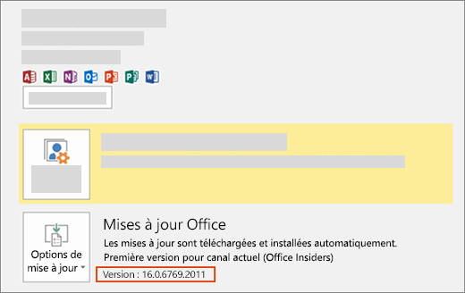

# Installer la dernière version d’Office

De nouvelles fonctionnalités de développeur, y compris celles en version d’évaluation, sont mises à la disposition des abonnés qui souhaitent obtenir les dernières versions d’Office.

## Inscription pour l’obtention des versions les plus récentes

Pour s’inscrire afin d’obtenir les dernières versions d’Office, procédez comme suit :

- Si vous êtes abonné à la famille Microsoft 365, personnel ou Université, consultez la rubrique [soyez un Office Insider](https://insider.office.com).
- Si vous êtes un client Microsoft 365 apps pour les entreprises, voir [install the First release build for Microsoft 365 Apps for Business Customers](https://support.office.com/article/Install-the-First-Release-build-for-Office-365-for-business-customers-4dd8ba40-73c0-4468-b778-c7b744d03ead).
- Si vous exécutez Office sur un Mac :
  - Démarrez une application Office.
  - Sélectionnez **Vérifier les mises à jour** dans le menu Aide.
  - Dans la zone Mise à jour automatique Microsoft (AutoUpdate), cochez la case pour participer au programme Office Insider.

## Obtention de la dernière version

Pour obtenir la dernière version d’Office, procédez comme suit :

1. Télécharger [l’outil Déploiement d’Office](https://www.microsoft.com/download/details.aspx?id=49117).
2. Run the tool. This extracts the following two files: Setup.exe and configuration.xml.
3. Remplacez le fichier configuration.xml par le [fichier de configuration First Release](https://raw.githubusercontent.com/OfficeDev/Office-Add-in-Commands-Samples/master/Tools/FirstReleaseConfig/configuration.xml).
4. En tant qu’administrateur, exécutez la commande suivante : `setup.exe /configure configuration.xml`

> [!NOTE]
> L’exécution de la commande peut durer plusieurs minutes sans vous en indiquer la progression.

Une fois le processus d’installation terminé, les dernières applications d’Office sont installées. Pour vérifier que la dernière version est bien installée, accédez à **Fichier** > **Compte** à partir de n’importe quelle application Office. Sous Mises à jour Office, vous verrez la mention (Office Insiders) au-dessus du numéro de version.

## Builds Office minimum pour les ensembles de conditions requises pour l’API JavaScript pour Office

Pour plus d’informations sur les versions minimum des produits pour chaque plate-forme pour les ensembles de conditions requises pour les API, voir les rubriques suivantes :

- [Ensembles de conditions requises de l’API JavaScript pour Excel](../reference/requirement-sets/excel-api-requirement-sets.md)
- [Ensembles de conditions requises de l’API JavaScript pour OneNote](../reference/requirement-sets/onenote-api-requirement-sets.md)
- [Ensembles de conditions requises de l’API JavaScript pour Outlook](../reference/requirement-sets/outlook-api-requirement-sets.md)
- [Ensembles de conditions requises de l’API JavaScript pour PowerPoint](../reference/requirement-sets/powerpoint-api-requirement-sets.md)
- [Ensembles de conditions requises de l’API JavaScript pour Word](../reference/requirement-sets/word-api-requirement-sets.md)
- [Ensembles de conditions requises de l’API de boîte de dialogue](../reference/requirement-sets/dialog-api-requirement-sets.md)
- [Ensembles de conditions requises des API communes pour Office](../reference/requirement-sets/office-add-in-requirement-sets.md)
