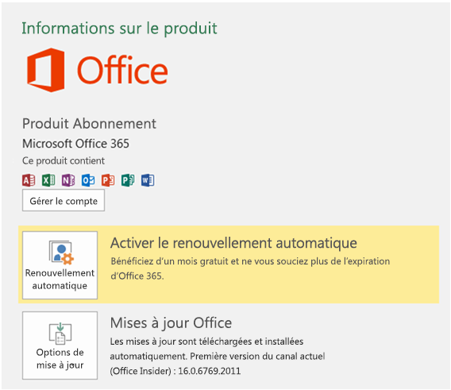

# Installer la dernière version d’OfficeInstall the latest version of Office

De nouvelles fonctionnalités de développeur, y compris celles en version d’évaluation, sont mises à la disposition des abonnés qui souhaitent obtenir les dernières versions d’Office.New developer features, including those still in preview, are delivered first to subscribers who opt in to get the latest builds of Office.

## Inscription pour l’obtention des versions les plus récentesOpt in to getting the latest builds

Pour s’inscrire afin d’obtenir les dernières versions d’Office, procédez comme suit :To opt in to getting the latest builds of Office:

- Si vous êtes abonné à Office 365 Famille, Personnel ou Université, consultez la page [Participez au programme Office Insider](https://products.office.com/office-insider).If you're an Office 365 Home, Personal, or University subscriber, see [Be an Office Insider](https://products.office.com/office-insider).
- Si vous êtes un client d’Office 365 pour les entreprises, consultez l’article [Installer la version First Release pour Office 365 pour les entreprises](https://support.office.com/article/Install-the-First-Release-build-for-Office-365-for-business-customers-4dd8ba40-73c0-4468-b778-c7b744d03ead).If you're an Office 365 for business customer, see [Install the First Release build for Office 365 for business customers](https://support.office.com/article/Install-the-First-Release-build-for-Office-365-for-business-customers-4dd8ba40-73c0-4468-b778-c7b744d03ead).
- Si vous exécutez Office sur un Mac :If you're running Office on a Mac:
    - Démarrez une application Office.Start the Office application.
    - Sélectionnez **Vérifier les mises à jour** dans le menu Aide.Select **Check for Updates** on the Help menu.
    - Dans la zone Mise à jour automatique Microsoft (AutoUpdate), cochez la case pour participer au programme Office Insider.In the Microsoft AutoUpdate box, check the box to join the Office Insider program.

## Obtention de la dernière versionGet the latest build

Pour obtenir la dernière version d’Office, procédez comme suit :To get the latest build of Office:

1. Télécharger [l’outil Déploiement d’Office](https://www.microsoft.com/download/details.aspx?id=49117).Download the [Office Deployment Tool](https://www.microsoft.com/download/details.aspx?id=49117).
2. Exécutez l’outil. Cette opération extrait les deux fichiers suivants : Setup.exe et configuration.xml.Run the tool. This extracts the following two files: Setup.exe and configuration.xml.
3. Remplacez le fichier configuration.xml par le [fichier de configuration First Release](https://raw.githubusercontent.com/OfficeDev/Office-Add-in-Commands-Samples/master/Tools/FirstReleaseConfig/configuration.xml).Replace the configuration.xml file with the [First Release Configuration File](https://raw.githubusercontent.com/OfficeDev/Office-Add-in-Commands-Samples/master/Tools/FirstReleaseConfig/configuration.xml).
4. En tant qu’administrateur, exécutez la commande suivante : `setup.exe /configure configuration.xml`Run the following command as an administrator:  `setup.exe /configure configuration.xml`

    > [!NOTE]
    > L’exécution de la commande peut durer plusieurs minutes sans vous en indiquer la progression.The command might take a long time to run without indicating progress.

Une fois le processus d’installation terminé, les dernières applications d’Office sont installées.When the installation process finishes, you will have the latest Office applications installed. Pour vérifier que la dernière version est bien installée, accédez à **Fichier** > **Compte** à partir de n’importe quelle application Office.To verify that you have the latest build, go to **File** > **Account** from any Office application. Sous Mises à jour Office, vous verrez la mention (Office Insiders) au-dessus du numéro de version.Under Office Updates, you'll see the (Office Insiders) label above the version number.

## Builds Office minimum pour les ensembles de conditions requises pour l’API JavaScript pour OfficeMinimum Office builds for Office JavaScript API requirement sets

Pour plus d’informations sur les versions minimum des produits pour chaque plate-forme pour les ensembles de conditions requises pour les API, voir les rubriques suivantes :For information about the minimum product builds for each platform for the API requirement sets, see the following:

- [Ensembles de conditions requises de l’API JavaScript pour WordWord JavaScript API requirement sets](/office/dev/add-ins/reference/requirement-sets/word-api-requirement-sets)
- [Ensembles de conditions requises de l’API JavaScript pour ExcelExcel JavaScript API requirement sets](/office/dev/add-ins/reference/requirement-sets/excel-api-requirement-sets)
- [Ensembles de conditions requises de l’API JavaScript pour OneNoteOneNote JavaScript API requirement sets](/office/dev/add-ins/reference/requirement-sets/onenote-api-requirement-sets)
- [Ensembles de conditions requises de l’API de boîte de dialogueDialog API requirement sets](/office/dev/add-ins/reference/requirement-sets/dialog-api-requirement-sets)
- [Ensembles de conditions requises des API communes pour OfficeOffice Common API requirement sets](/office/dev/add-ins/reference/requirement-sets/office-add-in-requirement-sets)
