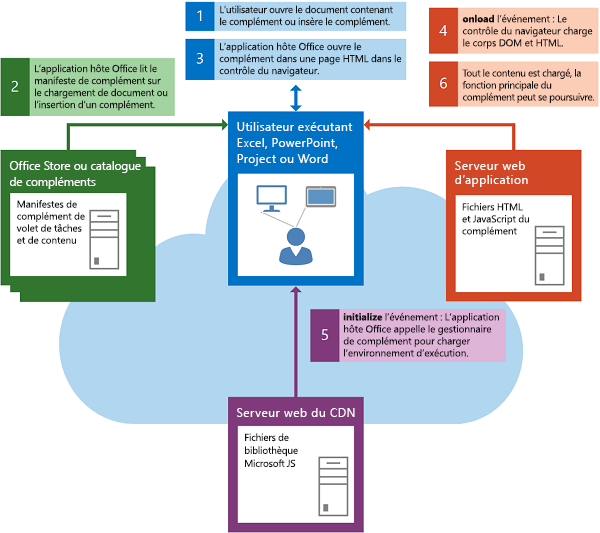
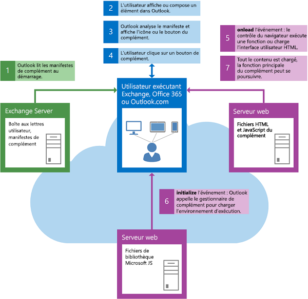

# <a name="loading-the-dom-and-runtime-environment"></a><span data-ttu-id="47b42-102">Chargement du DOM et de l’environnement d’exécution</span><span class="sxs-lookup"><span data-stu-id="47b42-102">Loading the DOM and runtime environment</span></span>

<span data-ttu-id="47b42-103">Un complément doit s’assurer que le DOM et l’environnement d’exécution des Compléments Office ont été chargés avant d’exécuter sa propre logique personnalisée.</span><span class="sxs-lookup"><span data-stu-id="47b42-103">An add-in must ensure that both the DOM and the Office Add-ins runtime environment are loaded before running its own custom logic.</span></span> 

## <a name="startup-of-a-content-or-task-pane-add-in"></a><span data-ttu-id="47b42-104">Démarrage d’un complément de contenu ou du volet Office</span><span class="sxs-lookup"><span data-stu-id="47b42-104">Startup of a content or task pane add-in</span></span>

<span data-ttu-id="47b42-105">La figure suivante illustre le flux des événements impliqués au démarrage d’un complément de contenu ou du volet Office dans Excel, PowerPoint, Project, Word ou Access.</span><span class="sxs-lookup"><span data-stu-id="47b42-105">The following figure shows the flow of events involved in starting a content or task pane add-in in Excel, PowerPoint, Project, Word, or Access.</span></span>



<span data-ttu-id="47b42-107">Les événements suivants se produisent lors du démarrage d’un complément de contenu ou du volet Office :</span><span class="sxs-lookup"><span data-stu-id="47b42-107">The following events occur when a content or task pane add-in starts:</span></span>

1. <span data-ttu-id="47b42-108">L’utilisateur ouvre un document qui contient déjà un complément ou insère un complément dans le document.</span><span class="sxs-lookup"><span data-stu-id="47b42-108">The user opens a document that already contains an add-in or inserts an add-in in the document.</span></span>

2. <span data-ttu-id="47b42-109">L’application hôte Office lit le manifeste XML du complément à partir d’AppSource, d’un catalogue de compléments sur SharePoint ou du catalogue de dossiers partagés duquel il provient.</span><span class="sxs-lookup"><span data-stu-id="47b42-109">The Office host application reads the add-in's XML manifest from AppSource, an add-in catalog on SharePoint, or the shared folder catalog it originates from.</span></span>

3. <span data-ttu-id="47b42-110">L’application hôte Office ouvre la page HTML du complément dans un contrôle de navigateur.</span><span class="sxs-lookup"><span data-stu-id="47b42-110">The Office host application opens the add-in's HTML page in a browser control.</span></span>

    <span data-ttu-id="47b42-p101">Les deux étapes suivantes, 4 et 5, se produisent de manière asynchrone et parallèlement. C’est pour cela que le code de votre complément doit veiller à ce que le chargement du DOM et de l’environnement d’exécution du complément soit terminé avant de continuer.</span><span class="sxs-lookup"><span data-stu-id="47b42-p101">The next two steps, steps 4 and 5, occur asynchronously and in parallel. For this reason, your add-in's code must make sure that both the DOM and the add-in runtime environment have finished loading before proceeding.</span></span>

4. <span data-ttu-id="47b42-113">Le contrôle de navigateur charge le DOM et le corps HTML, puis demande au gestionnaire d’événements l’événement  **window.onload**.</span><span class="sxs-lookup"><span data-stu-id="47b42-113">The browser control loads the DOM and HTML body, and calls the event handler for the  **window.onload** event.</span></span>

5. <span data-ttu-id="47b42-114">L’application hôte Office charge l’environnement d’exécution, lequel télécharge et met en cache l’API JavaScript pour les fichiers de bibliothèque JavaScript à partir du serveur de réseau de distribution de contenu, puis appelle le gestionnaire d’événements du complément pour l’événement [initialize](/javascript/api/office#office-initialize) de l’objet [Office](/javascript/api/office) si un gestionnaire lui a été affecté.</span><span class="sxs-lookup"><span data-stu-id="47b42-114">The Office host application loads the runtime environment, which downloads and caches the JavaScript API for JavaScript library files from the content distribution network (CDN) server, and then calls the add-in's event handler for the [initialize](/javascript/api/office#office-initialize) event of the [Office](/javascript/api/office) object, if a handler has been assigned to it.</span></span> <span data-ttu-id="47b42-115">Il vérifie alors également si des rappels (ou des fonctions `then()` chaînées) ont été transmis (ou chaînées) au gestionnaire `Office.onReady`.</span><span class="sxs-lookup"><span data-stu-id="47b42-115">At this time it also checks to see if any callbacks (or chained `then()` functions) have been passed (or chained) to the `Office.onReady` handler.</span></span> <span data-ttu-id="47b42-116">Pour plus d’informations sur la distinction entre `Office.initialize` et `Office.onReady`, voir [Initialisation de votre complément](/office/dev/add-ins/develop/understanding-the-javascript-api-for-office#initializing-your-add-in).</span><span class="sxs-lookup"><span data-stu-id="47b42-116">For more information about the distinction between `Office.initialize` and `Office.onReady`, see [Initializing your add-in](/office/dev/add-ins/develop/understanding-the-javascript-api-for-office#initializing-your-add-in).</span></span>

6. <span data-ttu-id="47b42-117">Lorsque le chargement du DOM et du corps HTML est terminé et que le complément finit de s’initialiser, la fonction principale du complément peut poursuivre.</span><span class="sxs-lookup"><span data-stu-id="47b42-117">When the DOM and HTML body finish loading and the add-in finishes initializing, the main function of the add-in can proceed.</span></span>


## <a name="startup-of-an-outlook-add-in"></a><span data-ttu-id="47b42-118">Démarrage d’un complément Outlook</span><span class="sxs-lookup"><span data-stu-id="47b42-118">Startup of an Outlook add-in</span></span>

<span data-ttu-id="47b42-119">La figure suivante illustre le flux des événements impliqués au démarrage d’un complément Outlook exécuté sur un ordinateur de bureau, une tablette ou un smartphone.</span><span class="sxs-lookup"><span data-stu-id="47b42-119">The following figure shows the flow of events involved in starting an Outlook add-in running on the desktop, tablet, or smartphone.</span></span>



<span data-ttu-id="47b42-121">Les événements suivants se produisent lors du démarrage d’un complément Outlook :</span><span class="sxs-lookup"><span data-stu-id="47b42-121">The following events occur when an Outlook add-in starts:</span></span>

1. <span data-ttu-id="47b42-122">Lorsqu’Outlook démarre, il lit les manifestes XML pour les compléments Outlook qui ont été installés pour le compte de messagerie de l’utilisateur.</span><span class="sxs-lookup"><span data-stu-id="47b42-122">When Outlook starts, Outlook reads the XML manifests for Outlook add-ins that have been installed for the user's email account.</span></span>

2. <span data-ttu-id="47b42-123">L’utilisateur sélectionne un élément dans Outlook.</span><span class="sxs-lookup"><span data-stu-id="47b42-123">The user selects an item in Outlook.</span></span>

3. <span data-ttu-id="47b42-124">Si l’élément sélectionné répond aux conditions d’activation d’un complément Outlook, Outlook active le complément et affiche son bouton dans l’interface utilisateur.</span><span class="sxs-lookup"><span data-stu-id="47b42-124">If the selected item satisfies the activation conditions of an Outlook add-in, Outlook activates the add-in and makes its button visible in the UI.</span></span>

4. <span data-ttu-id="47b42-p103">Si l’utilisateur clique sur le bouton pour démarrer le complément Outlook, Outlook ouvre la page HTML dans un contrôle de navigateur. Les deux étapes suivantes, 5 et 6, se produisent en parallèle.</span><span class="sxs-lookup"><span data-stu-id="47b42-p103">If the user clicks the button to start the Outlook add-in, Outlook opens the HTML page in a browser control. The next two steps, steps 5 and 6, occur in parallel.</span></span>

5. <span data-ttu-id="47b42-127">Le contrôle de navigateur charge le modèle objet de document (DOM) et le corps HTML, puis appelle le gestionnaire d’événements pour l’événement  **onload**.</span><span class="sxs-lookup"><span data-stu-id="47b42-127">The browser control loads the DOM and HTML body, and calls the event handler for the  **onload** event.</span></span>

6. <span data-ttu-id="47b42-128">Outlook charge l’environnement d’exécution, lequel télécharge et met en cache l’API JavaScript pour les fichiers de bibliothèque JavaScript à partir du serveur de réseau de distribution de contenu, puis appelle le gestionnaire d’événements du complément pour l’événement [initialize](/javascript/api/office#office-initialize) de l’objet [Office](/javascript/api/office) du complément si un gestionnaire lui a été affecté.</span><span class="sxs-lookup"><span data-stu-id="47b42-128">Outlook loads the runtime environment, which downloads and caches the JavaScript API for JavaScript library files from the content distribution network (CDN) server, and then calls the event handler for the [initialize](/javascript/api/office#office-initialize) event of the [Office](/javascript/api/office) object of the add-in, if a handler has been assigned to it.</span></span> <span data-ttu-id="47b42-129">Il vérifie alors également si des rappels (ou des fonctions `then()` chaînées) ont été transmis (ou chaînées) au gestionnaire `Office.onReady`.</span><span class="sxs-lookup"><span data-stu-id="47b42-129">At this time it also checks to see if any callbacks (or chained `then()` functions) have been passed (or chained) to the `Office.onReady` handler.</span></span> <span data-ttu-id="47b42-130">Pour plus d’informations sur la distinction entre `Office.initialize` et `Office.onReady`, voir [Initialisation de votre complément](/office/dev/add-ins/develop/understanding-the-javascript-api-for-office#initializing-your-add-in).</span><span class="sxs-lookup"><span data-stu-id="47b42-130">For more information about the distinction between `Office.initialize` and `Office.onReady`, see [Initializing your add-in](/office/dev/add-ins/develop/understanding-the-javascript-api-for-office#initializing-your-add-in).</span></span>

7. <span data-ttu-id="47b42-131">Lorsque le chargement du DOM et du corps HTML est terminé et que le complément finit de s’initialiser, la fonction principale du complément peut poursuivre.</span><span class="sxs-lookup"><span data-stu-id="47b42-131">When the DOM and HTML body finish loading and the add-in finishes initializing, the main function of the add-in can proceed.</span></span>


## <a name="checking-the-load-status"></a><span data-ttu-id="47b42-132">Vérification du statut de chargement</span><span class="sxs-lookup"><span data-stu-id="47b42-132">Checking the load status</span></span>

<span data-ttu-id="47b42-133">Vous pouvez vérifier que le chargement du DOM et de l’environnement d’exécution est bien terminé en utilisant la fonction jQuery [.ready()](https://api.jquery.com/ready/) : `$(document).ready()`.</span><span class="sxs-lookup"><span data-stu-id="47b42-133">One way to check that both the DOM and the runtime environment have finished loading is to use the jQuery [.ready()](https://api.jquery.com/ready/) function: `$(document).ready()`.</span></span> <span data-ttu-id="47b42-134">Par exemple, le gestionnaire d'événements **onReady** suivant s'assure que le DOM est d'abord chargé avant le code spécifique à l'initialisation du complément.</span><span class="sxs-lookup"><span data-stu-id="47b42-134">For example, the following **onReady** event handler makes sure the DOM is first loaded before the code specific to initializing the add-in runs.</span></span> <span data-ttu-id="47b42-135">Par la suite, le gestionnaire **onReady** utilise la propriété [mailbox.item](/javascript/api/outlook/office.mailbox) pour obtenir l'élément sélectionné dans Outlook, et appelle la fonction principale du complément, `initDialer`.</span><span class="sxs-lookup"><span data-stu-id="47b42-135">Subsequently, the **onReady** handler proceeds to use the [mailbox.item](/javascript/api/outlook/office.mailbox) property to obtain the currently selected item in Outlook, and calls the main function of the add-in, `initDialer`.</span></span>

```js
Office.onReady()
    .then(
        // Checks for the DOM to load.
        $(document).ready(function () {
            // After the DOM is loaded, add-in-specific code can run.
            var mailbox = Office.context.mailbox;
            _Item = mailbox.item;
            initDialer();
        });
);
```

<span data-ttu-id="47b42-136">Vous pouvez également utiliser le même code dans un gestionnaire d’événements **initialize** comme illustré dans l’exemple suivant.</span><span class="sxs-lookup"><span data-stu-id="47b42-136">Alternatively, you can use the same code in an  **initialize** event handler as shown in the following example.</span></span>

```js
Office.initialize = function () {
    // Checks for the DOM to load.
    $(document).ready(function () {
        // After the DOM is loaded, add-in-specific code can run.
        var mailbox = Office.context.mailbox;
        _Item = mailbox.item;
        initDialer();
    });
}
```

<span data-ttu-id="47b42-137">Il est possible d’utiliser cette même technique dans les gestionnaires **onReady** ou **initialize** de tout complément Office.</span><span class="sxs-lookup"><span data-stu-id="47b42-137">This same technique can be used in the **onReady** or **initialize** handlers of any Office Add-in.</span></span>

<span data-ttu-id="47b42-138">Le numéroteur téléphonique fourni comme exemple de complément Outlook présente une approche légèrement différente, puisqu’il utilise uniquement JavaScript pour vérifier ces mêmes conditions.</span><span class="sxs-lookup"><span data-stu-id="47b42-138">The phone dialer sample Outlook add-in shows a slightly different approach using only JavaScript to check these same conditions.</span></span> 

> [!IMPORTANT]
> <span data-ttu-id="47b42-139">Même si aucune tâche d’initialisation n’est à effectuer dans votre complément, vous devez inclure au moins un appel **Office.onReady** ou affecter une fonction de gestionnaire d’événements **Office.initialize** minimale comme dans l’exemple suivant.</span><span class="sxs-lookup"><span data-stu-id="47b42-139">Even if your add-in has no initialization tasks to perform, you must include at least a call of **Office.onReady** or assign minimal **Office.initialize** event handler function as shown in the following examples.</span></span>
>
>```js
>Office.onReady();
>```
>
>```js
>Office.initialize = function () {};
>```
>
> <span data-ttu-id="47b42-140">Si vous n’appelez pas **Office.onReady** ou n’affectez pas un Gestionnaire d’événements **Office.initialize**, votre complément peut déclencher une erreur lors de son démarrage.</span><span class="sxs-lookup"><span data-stu-id="47b42-140">If you do not call **Office.onReady** or assign an  **Office.initialize** event handler, your add-in may raise an error when it starts.</span></span> <span data-ttu-id="47b42-141">En outre, si un utilisateur essaie d’utiliser votre complément avec un client web Office Online, notamment Excel Online, PowerPoint Online ou Outlook Web App, l’exécution du complément échouera.</span><span class="sxs-lookup"><span data-stu-id="47b42-141">Also, if a user attempts to use your add-in with an Office Online web client, such as Excel Online, PowerPoint Online, or Outlook Web App, it will fail to run.</span></span>
>
> <span data-ttu-id="47b42-142">Si votre complément comprend plusieurs pages, chaque fois qu’il charge une nouvelle page, celle-ci doit soit appeler **Office.onReady**, soit affecter un gestionnaire d’événements **Office.initialize**.</span><span class="sxs-lookup"><span data-stu-id="47b42-142">If your add-in includes more than one page, whenever it loads a new page that page must either call **Office.onReady** or assign an  **Office.initialize** event handler.</span></span>

## <a name="see-also"></a><span data-ttu-id="47b42-143">Voir aussi</span><span class="sxs-lookup"><span data-stu-id="47b42-143">See also</span></span>

- [<span data-ttu-id="47b42-144">Présentation de l’API JavaScript pour Office</span><span class="sxs-lookup"><span data-stu-id="47b42-144">Understanding the JavaScript API for Office</span></span>](understanding-the-javascript-api-for-office.md)
