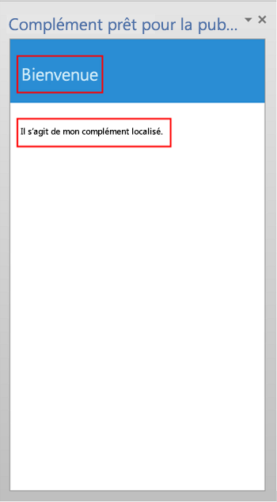

# <a name="localization-for-office-add-ins"></a>Localisation des compléments Office

Vous pouvez librement implémenter n’importe quel schéma de localisation convenant à votre Complément Office. L’API JavaScript et le schéma du manifeste de la plateforme Compléments Office offrent quelques choix. Vous pouvez utiliser l’API JavaScript pour Office pour déterminer un paramètre régional et les chaînes d’affichage en fonction des paramètres régionaux de l’application hôte, ou pour interpréter ou afficher les données en fonction des paramètres régionaux des données. Vous pouvez utiliser le manifeste pour spécifier l’emplacement des fichiers et les informations descriptives propres à un paramètre régional. Sinon, vous pouvez utiliser un script Microsoft Ajax pour prendre en charge l’internationalisation et la localisation.

## <a name="use-the-javascript-api-to-determine-locale-specific-strings"></a>Utiliser l’API JavaScript pour déterminer les chaînes propres aux paramètres régionaux

L’API JavaScript pour Office offre deux propriétés qui prennent en charge l’affichage ou l’interprétation de valeurs cohérentes avec les paramètres régionaux de l’application hôte et des données :

- [Context.displayLanguage][displayLanguage] spécifie les paramètres régionaux (ou langue) de l’interface utilisateur de l’application hôte. L’exemple suivant vérifie si l’application hôte utilise les paramètres régionaux en-US ou fr-Fr, et affiche un message de bienvenue propre aux paramètres régionaux.
    
    ```js
    function sayHelloWithDisplayLanguage() {
        var myLanguage = Office.context.displayLanguage;
        switch (myLanguage) {
            case 'en-US':
                write('Hello!');
                break;
            case 'fr-FR':
                write('Bonjour!');
                break;
        }
    }
    
    // Function that writes to a div with id='message' on the page.
    function write(message) {
        document.getElementById('message').innerText += message; 
    }
    ```

- [Context.contentLanguage][contentLanguage] spécifie le paramètre régional (ou langue) des données. Le fait d’étendre le dernier exemple de code, au lieu de vérifier la propriété [displayLanguage], attribue `myLanguage` à la propriété [contentLanguage] et utilise le reste du code pour afficher un message de bienvenue correspondant aux paramètres régionaux des données :
    
    ```js
    var myLanguage = Office.context.contentLanguage;
    ```

## <a name="control-localization-from-the-manifest"></a>Contrôler la localisation à partir du manifeste


Chaque complément Office indique un élément [DefaultLocale] élément et un paramètre régional dans son manifeste. Par défaut, la plateforme de complément Office et les applications hôtes Office appliquent les valeurs des éléments [Description], [DisplayName], [IconUrl], [HighResolutionIconUrl] et [SourceLocation] à tous les paramètres régionaux. Vous pouvez éventuellement prendre en charge des valeurs spécifiques pour les paramètres régionaux spécifiques, en spécifiant un élément enfant [Override] pour chaque paramètre régional supplémentaire, pour chacun des cinq éléments. La valeur de l’élément [DefaultLocale] et de l’attribut `Locale` de l’élément [Override] est spécifiée en fonction de la norme [RFC 3066] relative aux balises pour l’identification des langues (« Tags for the Identification of Languages »). Le tableau 1 décrit la prise en charge de localisation de ces éléments.

**Tableau 1. Prise en charge de localisation**


|**Élément**|**Prise en charge de localisation**|
|:-----|:-----|
|[Description]   |Les utilisateurs de chaque paramètre régional spécifié peuvent voir une description localisée du complément dans l’Office Store (ou dans un catalogue privé).<br/>Pour les compléments Outlook, les utilisateurs peuvent voir la description dans le Centre d’administration Exchange (EAC) après l’installation.|
|[DisplayName]   |Les utilisateurs de chaque paramètre régional spécifié peuvent voir une description localisée du complément dans l’Office Store (ou dans un catalogue privé).<br/>Pour les compléments Outlook, les utilisateurs peuvent voir le nom d’affichage sous forme d’étiquette pour le bouton de l’application Outlook ainsi que dans l’EAC après l’installation.<br/>Pour les compléments de contenu et du volet Office, les utilisateurs peuvent voir l’icône dans le ruban après avoir installé l’application.|
|[IconUrl]        |L’image de l’icône est facultative. Vous pouvez utiliser la même technique de remplacement pour spécifier une image donnée pour une culture particulière. Si vous utilisez et localisez une icône, les utilisateurs de chaque paramètre régional que vous spécifiez peuvent voir l’image d’icône localisée pour le complément.<br/>Pour les compléments Outlook, les utilisateurs peuvent voir l’icône dans l’EAC après l’installation du complément.<br/>Pour les compléments de contenu et du volet Office, les utilisateurs peuvent voir l’icône dans le ruban après avoir installé le complément.|
|[HighResolutionIconUrl] <br/><br/>**Important**  Cet élément est disponible uniquement lors de l’utilisation de la version 1.1 du manifeste de complément.|L’image de l’icône de haute résolution est facultative. Néanmoins, si elle est indiquée, elle doit l’être après l’élément [IconUrl]. Si  [HighResolutionIconUrl] est spécifié et que le complément est installé sur un appareil qui prend en charge la haute résolution (dpi), la valeur [HighResolutionIconUrl] est utilisée à la place de la valeur [IconUrl].<br/>Vous pouvez utiliser la même technique de remplacement pour spécifier une image donnée pour une culture particulière. Si vous utilisez et localisez une icône, les utilisateurs de chaque paramètre régional que vous spécifiez peuvent voir l’image d’icône localisée pour le complément.<br/>Pour les compléments Outlook, les utilisateurs peuvent voir l’icône dans l’EAC après l’installation du complément.<br/>Pour les compléments de contenu et du volet de tâches, les utilisateurs peuvent voir l’icône dans le ruban après avoir installé le complément.|
|[Ressources] <br/><br/>**Important**  Cet élément est disponible uniquement lors de l’utilisation de la version 1.1 du manifeste de complément.   |Les utilisateurs de chaque paramètre régional que vous spécifiez peuvent voir les ressources de chaîne et d’icône que vous créez spécifiquement pour le complément pour ce paramètre régional. |
|[SourceLocation]   |Les utilisateurs de chaque paramètre régional que vous spécifiez peuvent voir une page web que vous concevez spécifiquement pour le complément pour ce paramètre régional. |


 > **Remarque :** Vous ne pouvez localiser la description et le nom d’affichage que pour les paramètres régionaux pris en charge par Office. Voir [Identificateurs de langues et valeurs OptionState Id dans Office 2013](http://technet.microsoft.com/fr-fr/library/cc179219.aspx) pour connaître la liste des langues et des paramètres régionaux pour la version actuelle d’Office.


### <a name="examples"></a>Exemples

Par exemple, une Complément Office peut spécifier que  [DefaultLocale] est `en-us`. Pour l’élément  [DisplayName], le complément peut spécifier un élément enfant  [Override] pour le paramètre régional `fr-fr`, comme illustré ci-dessous. 


```xml
<DefaultLocale>en-us</DefaultLocale>
...
<DisplayName DefaultValue="Video player">
    <Override Locale="fr-fr" Value="Lecteur vidéo" />
</DisplayName>
```

 > **Remarque :** Si vous devez localiser plusieurs domaines au sein d’une famille de langues, comme `de-de` et `de-at`, nous vous recommandons d’utiliser des éléments `Override` distincts pour chaque domaine. L’utilisation uniquement du nom de la langue, soit `de` dans ce cas, n’est pas prise en charge pour toutes les combinaisons de plateformes et d’applications hôtes Office.

Cela signifie que le complément adopte le paramètre régional `en-us` par défaut. Les utilisateurs voient le nom d’affichage « Video player » pour tous les paramètres régionaux, sauf si le paramètre régional de l’ordinateur client est `fr-fr`, auquel cas ils verront le nom d’affichage « Lecteur vidéo ».

> **Remarque :** Vous ne pouvez spécifier qu’un seul remplacement par langue, notamment pour les paramètres régionaux par défaut. Par exemple, si votre paramètre régional par défaut est `en-us`, vous ne pouvez pas spécifier un remplacement pour `en-us`. 

L’exemple suivant applique un remplacement de paramètre régional pour l’élément  [Description]. Il commence par spécifier le paramètre régional par défaut  `en-us` et une description en anglais, puis spécifie une instruction [Override] avec une description en français pour le paramètre régional `fr-fr` :

```xml
<DefaultLocale>en-us</DefaultLocale>
...
<Description DefaultValue=
   "Watch YouTube videos referenced in the emails you receive 
   without leaving your email client.">
   <Override Locale="fr-fr" Value=
   "Visualisez les vidéos YouTube référencées dans vos courriers 
   électronique directement depuis Outlook et Outlook Web App."/>
</Description>
```

Cela signifie que le complément considère `en-us` comme le paramètre régional par défaut. Les utilisateurs verront la description en anglais figurant dans l’attribut `DefaultValue` pour tous les paramètres régionaux, sauf si le paramètre régional de l’ordinateur du client est `fr-fr`, auquel cas la description s’affichera en français.

Dans l’exemple suivant, le complément spécifie une image séparée convenant mieux pour le paramètre régional et la culture  `fr-fr`. Les utilisateurs voient l’image DefaultLogo.png par défaut, sauf lorsque le paramètre régional de l’ordinateur client est  `fr-fr`. Dans ce cas, les utilisateurs voient l’image FrenchLogo.png. 


```xml
<!-- Replace "domain" with a real web server name and path. -->
<IconUrl DefaultValue="https://<domain>/DefaultLogo.png"/>
    <Override Locale="fr-fr" Value="https://<domain>/FrenchLogo.png"/>
```

L’exemple suivant montre comment localiser une ressource dans la section `Resources`. Une valeur de remplacement des paramètres régionaux est appliquée pour une image plus appropriée par rapport à la culture `ja-jp`.

```xml
<Resources>
      <bt:Images>
        <bt:Image id="icon1_16x16" DefaultValue="https://www.contoso.com/icon_default.png">
          <bt:Override Locale="ja-jp" Value="https://www.contoso.com/ja-jp16-icon_default.png" />
        </bt:Image>
 ...
```


Pour l’élément  [SourceLocation], la prise en charge de paramètres régionaux supplémentaires implique de fournir un fichier source HTML distinct pour chacun des paramètres régionaux spécifiés. Les utilisateurs de chaque paramètre régional que vous spécifiez peuvent voir une page Web personnalisée que vous concevez pour eux.

Pour les compléments Outlook, l’élément [SourceLocation] s’aligne également sur le format. Ceci vous permet de fournir un fichier source HTML localisé distinct pour chaque format. Vous pouvez spécifier un ou plusieurs éléments enfants [Override] dans chaque élément de paramètres applicable ([DesktopSettings], [TabletSettings] ou [PhoneSettings]). L’exemple suivant montre les éléments de paramètres pour les formats ordinateur de bureau, tablette et smartphone, avec pour chacun un fichier HTML pour le paramètre régional par défaut et pour le paramètre régional français.


```xml
<DesktopSettings>
   <SourceLocation DefaultValue="https://contoso.com/Desktop.html">
      <Override Locale="fr-fr" Value="https://contoso.com/fr/Desktop.html" />
   </SourceLocation>
   <RequestedHeight>250</RequestedHeight>
</DesktopSettings>
<TabletSettings>
   <SourceLocation DefaultValue="https://contoso.com/Tablet.html">
      <Override Locale="fr-fr" Value="https://contoso.com/fr/Tablet.html" />
   </SourceLocation>
   <RequestedHeight>200</RequestedHeight>
</TabletSettings>
<PhoneSettings>
   <SourceLocation DefaultValue="https://contoso.com/Mobile.html">
      <Override Locale="fr-fr" Value="https://contoso.com/fr/Mobile.html" />
   </SourceLocation>

</PhoneSettings>

```

## <a name="match-datetime-format-with-client-locale"></a>Mettre en correspondance le format de date/heure avec le paramètre régional du client

Vous pouvez obtenir les paramètres régionaux de l’interface utilisateur de l’application d’hébergement en utilisant la propriété [displayLanguage]. Vous pouvez ensuite afficher les valeurs de date et d’heure dans un format cohérent avec les paramètres régionaux actuels de l’application hôte. Une solution consiste à préparer un fichier de ressources qui spécifie le format d’affichage de date/heure à utiliser pour chaque paramètre régional pris en charge par le complément Office. Lors de l’exécution, votre complément peut utiliser le fichier de ressources et faire correspondre le format de date/heure approprié avec le paramètre régional obtenu à partir de la propriété [displayLanguage].

Vous pouvez obtenir les paramètres régionaux des données de l’application d’hébergement en utilisant la propriété [contentLanguage]. En fonction de cette valeur, vous pouvez correctement interpréter ou afficher des chaînes de date/heure. Par exemple, dans le paramètre régional `jp-JP`, les valeurs de date/heure sont exprimées sous la forme `yyyy/MM/dd`, alors qu’avec le paramètre régional `fr-FR` elles apparaissent sous la forme `dd/MM/yyyy`.


## <a name="use-ajax-for-globalization-and-localization"></a>Utiliser Ajax pour l’internationalisation et la localisation


Si vous utilisez Visual Studio pour créer des Compléments Office, .NET Framework et Ajax offrent des moyens d’internationaliser et de localiser les fichiers de script client.

Vous pouvez internationaliser et utiliser les extensions de type JavaScript [Date](http://msdn.microsoft.com/library/caf98d32-2de2-4704-8198-692350343681.aspx) et [Number](http://msdn.microsoft.com/library/c216d3a1-12ae-47d1-bca1-c3666d04572f.aspx) ainsi que l’objet JavaScript [Date](http://msdn.microsoft.com/library/ce2202bb-7ec9-4f5a-bf48-3a04feff283e.aspx) dans le code JavaScript pour qu’une Complément Office affiche les valeurs en fonction des paramètres régionaux du navigateur actuel. Pour plus d’informations, voir [Walkthrough: Globalizing a Date by Using Client Script](http://msdn.microsoft.com/library/69b34e6d-d590-4d03-a763-b7ae54b47d74.aspx).

Vous pouvez inclure des chaînes de ressources localisées directement dans des fichiers JavaScript autonomes pour fournir des fichiers de script client pour les différents paramètres régionaux, qui sont définis dans le navigateur ou fournis par l’utilisateur. Créez un fichier de script distinct pour chaque paramètre régional pris en charge. Dans chaque fichier de script, incluez un objet au format JSON contenant les chaînes de ressources pour ce paramètre régional. Les valeurs localisées sont appliquées lorsque le script s’exécute dans le navigateur. 


## <a name="example-build-a-localized-office-add-in"></a>Exemple : créer un complément Office localisé

Cette section inclut des exemples expliquant comment localiser la description, le nom d’affichage et l’interface utilisateur d’une Complément Office.

Pour exécuter l’exemple de code fourni, configurez Microsoft Office 2013 sur votre ordinateur pour utiliser des langues supplémentaires et pouvoir tester votre complément en basculant d’une langue à l’autre pour l’affichage des menus et des commandes, l’édition et la vérification, ou les deux.

En outre, vous devez créer un projet de complément Office Visual Studio 2015.

 > **Remarque :**   Pour télécharger Visual Studio 2015, consultez la [page dédiée aux outils de développement Office](https://www.visualstudio.com/features/office-tools-vs). Cette page contient également un lien pour télécharger les outils de développement Office.

### <a name="configure-office-2013-to-use-additional-languages-for-display-or-editing"></a>Configurer Office 2013 pour utiliser des langues supplémentaires pour l’affichage ou l’édition

Vous pouvez utiliser un module linguistique Office 2013 pour installer des langues supplémentaires. Pour plus d’informations sur les modules linguistiques et comment les obtenir, voir [Options de langue Office 2013](http://office.microsoft.com/en-us/language-packs/).

 > **Remarque :**  Si vous êtes abonné à MSDN, les modules linguistiques Office 2013 peuvent être disponibles dans le cadre de votre abonnement. Pour savoir si votre abonnement propose le téléchargement des modules linguistiques Office 2013, accédez à [Accueil Abonnements MSDN](https://msdn.microsoft.com/subscriptions/manage/), tapez « Modules linguistiques Office 2013 » dans **Téléchargements logiciels**, choisissez  **Rechercher**, puis sélectionnez  **Produits disponibles avec mon abonnement**. Sous  **Langue**, cochez la case correspondant au module linguistique que vous voulez télécharger, puis cliquez sur  **OK**. 

Une fois le module linguistique installé, vous pouvez configurer Office 2013 pour utiliser la langue installée pour l’affichage de l’interface utilisateur, pour l’édition du contenu du document, ou les deux. Dans cet exemple, le module linguistique espagnol a été installé sur Office 2013.

### <a name="create-an-office-add-in-project"></a>Créer un projet de complément Office

1. Dans Visual Studio, choisissez  **Fichier**  >  **Nouveau projet**.
    
2. Dans la boîte de dialogue **Nouveau projet**, sous  **Modèles**, développez  **Visual Basic** ou **Visual C#**, développez  **Office/SharePoint**, puis sélectionnez  **Compléments Office**.
    
3. Choisissez **Complément Office** et donnez un nom à votre complément, par exempleWorldReadyApp. Cliquez sur  **OK**.
    
4. Dans la boîte de dialogue **Créer un complément Office**, sélectionnez  **Volet Office** et cliquez sur **Suivant**. Sur la page suivante, désactivez les cases à cocher pour toutes les applications hôtes à l’exception de Word. Cliquez sur  **Terminer** pour créer le projet.
    

### <a name="localize-the-text-used-in-your-add-in"></a>Localiser le texte utilisé dans votre complément

Le texte que vous souhaitez localiser dans une autre langue apparaît à deux emplacements :

-  **Nom d’affichage et description du complément**. Ce contenu est contrôlé par les entrées du fichier manifeste de l’application.
    
-  **Interface utilisateur du complément**. Vous pouvez localiser les chaînes qui s’affichent dans l’interface utilisateur de votre complément à l’aide du code JavaScript, par exemple en utilisant un fichier de ressources séparé qui contient les chaînes localisées.
    
Pour localiser le nom d’affichage et la description du complément

1. Dans l’ **Explorateur de solutions**, développez  **WorldReadyApp**,  **WorldReadyAppManifest**, puis choisissez  **WorldReadyApp.xml**.
    
2. Dans WorldReadyAppManifest.xml, remplacez les éléments [DisplayName] et [Description] par le bloc de code suivant :
    
     > **Remarque :** Vous pouvez remplacer les chaînes localisées en espagnol utilisées dans cet exemple pour les éléments [DisplayName] et [Description] par les chaînes localisées dans une autre langue.

    ```xml
    <DisplayName DefaultValue="World Ready add-in">
      <Override Locale="es-es" Value="Aplicación de uso internacional"/>
    </DisplayName>
    <Description DefaultValue="An add-in for testing localization">
      <Override Locale="es-es" Value="Una aplicación para la prueba de la localización"/>
    </Description>
    ```

3. Lorsque vous modifiez la langue d’affichage dans Office 2013, par exemple de l’anglais vers l’espagnol, puis que vous exécutez le complément, le nom d’affichage et la description du complément sont affichés avec le texte localisé. 
    
Pour mettre en page l’interface utilisateur du complément :

1. Dans Visual Studio, dans l’ **Explorateur de solutions**, choisissez  **Home.html**.
    
2. Remplacez le code HTML dans Home.html par le code HTML suivant.
    
    ```html
    <!DOCTYPE html>
    <html>
    <head>
        <meta charset="UTF-8" />
        <meta http-equiv="X-UA-Compatible" content="IE=Edge" />
        <title></title>
        <script src="../../Scripts/jquery-1.8.2.js" type="text/javascript"></script>
    
        <link href="../../Content/Office.css" rel="stylesheet" type="text/css" />
        <script src="https://appsforoffice.microsoft.com/lib/1/hosted/office.js" type="text/javascript"></script>
    
        <!-- To enable offline debugging using a local reference to Office.js, use:                        -->
        <!-- <script src="../../Scripts/Office/MicrosoftAjax.js" type="text/javascript"></script>          -->
        <!--    <script src="../../Scripts/Office/1.0/office.js" type="text/javascript"></script>          -->
    
        <link href="../App.css" rel="stylesheet" type="text/css" />
        <script src="../App.js" type="text/javascript"></script>
    
        <link href="Home.css" rel="stylesheet" type="text/css" />
        <script src="Home.js" type="text/javascript"></script> <body>
        <!-- Page content -->
        <div id="content-header">
            <div class="padding">
                <h1 id="greeting"></h1>
            </div>
        </div>
        <div id="content-main">
            <div class="padding">
                <div>
                    <p id="about"></p>
                </div>            
            </div>
        </div>
    </head>
    </html>
    ```

3. Dans Visual Studio, choisissez  **Fichier**,  **Enregistrer App\Home\Home.html**.
    
La figure 3 montre l’élément titre (h1) et l’élément paragraphe (p) qui afficheront le texte localisé lors de l’exécution de l’exemple de complément.

**Figure 3. Interface utilisateur du complément**



### <a name="add-the-resource-file-that-contains-the-localized-strings"></a>Ajouter le fichier de ressources qui contient les chaînes localisées

Le fichier de ressources JavaScript contient les chaînes utilisées pour l’interface utilisateur du complément. L’interface utilisateur de l’exemple de complément comprend un élément h1 qui affiche un message de bienvenue et un élément p qui présente le complément à l’utilisateur. 

Pour activer les chaînes localisées pour le titre et le paragraphe, placez les chaînes dans un fichier de ressources distinct. Le fichier de ressources crée un objet JavaScript qui contient un objet JavaScript Object Notation (JSON) individuel pour chaque ensemble de chaînes localisées. Le fichier de ressources fournit une méthode pour obtenir l’objet JSON approprié pour des paramètres régionaux donnés. 

Pour ajouter le fichier de ressources au projet de complément :

1. Dans l’ **Explorateur de solutions** de Visual Studio, sélectionnez le dossier **Complément** dans le projet web pour l’exemple de complément et choisissez **Ajouter**  >   **Fichier JavaScript**.
    
2. Dans la boîte de dialogue  **Spécifier le nom de l’élément**, entrez UIStrings.js.
    
3. Ajoutez le code suivant au fichier UIStrings.js.

    ```js
    /* Store the locale-specific strings */
    
    var UIStrings = (function ()
    {
        "use strict";
    
        var UIStrings = {};
    
        // JSON object for English strings
        UIStrings.EN =
        {        
            "Greeting": "Welcome",
            "Introduction": "This is my localized add-in."        
        };
    
    
        // JSON object for Spanish strings
        UIStrings.ES =
        {        
            "Greeting": "Bienvenido",
            "Introduction": "Esta es mi aplicación localizada."
        };
    
        UIStrings.getLocaleStrings = function (locale)
        {
            var text;
            
            // Get the resource strings that match the language.
            switch (locale)
            {
                case 'en-US':
                    text = UIStrings.EN;
                    break;
                case 'es-ES':
                    text = UIStrings.ES;
                    break;
                default:
                    text = UIStrings.EN;
                    break;
            }
    
            return text;
        };
    
        return UIStrings;
    })();
    ```

Le fichier de ressources UIStrings.js crée un objet,  **UIStrings**, qui contient les chaînes localisées pour l’interface utilisateur de votre complément. 

### <a name="localize-the-text-used-for-the-add-in-ui"></a>Localiser le texte utilisé pour l’interface utilisateur du complément

Pour utiliser le fichier de ressources dans votre complément, vous devez ajouter une balise de script pour ce fichier dans Home.html. Quand Home.html est chargé, UIStrings.js s’exécute et l’objet  **UIStrings** que vous utilisez pour obtenir les chaînes est disponible pour votre code. Ajoutez le code HTML suivant dans la balise head pour Home.html pour que **UIStrings** soit disponible pour votre code.

```html
<!-- Resource file for localized strings:                                                          -->
<script src="../UIStrings.js" type="text/javascript"></script>
```

Vous pouvez désormais utiliser l’objet  **UIStrings** pour définir les chaînes pour l’interface utilisateur de votre complément.

Si vous voulez changer la localisation pour votre complément en fonction de la langue utilisée pour afficher les menus et les commandes dans l’application hôte, utilisez la propriété  **Office.context.displayLanguage** pour obtenir les paramètres régionaux pour cette langue. Par exemple, si la langue de l’application hôte utilise l’espagnol pour afficher les menus et les commandes, la propriété **Office.context.displayLanguage** retournera le code de langue es-ES.

Si vous voulez changer la localisation pour votre complément en fonction de la langue utilisée pour l’édition du contenu de document, utilisez la propriété  **Office.context.contentLanguage** pour obtenir les paramètres régionaux pour cette langue. Par exemple, si la langue de l’application hôte utilise l’espagnol pour l’édition de contenu de document, la propriété **Office.context.contentLanguage** retournera le code de langue es-ES.

Une fois que vous connaissez la langue utilisée par l’application hôte, vous pouvez utiliser  **UIStrings** pour obtenir les chaînes localisées qui correspondent à la langue de l’application hôte.

Remplacez le code du fichier Home.js par le code suivant. Le code montre comment changer les chaînes utilisées dans les éléments d’interface utilisateur de Home.html en fonction de la langue d’affichage de l’application hôte ou de la langue d’édition de l’application hôte.

 > **Remarque :**  Pour activer ou désactiver la localisation du complément en fonction de la langue utilisée pour la modification, supprimez le commentaire de la ligne de code  `var myLanguage = Office.context.contentLanguage;` et ajoutez un commentaire à la ligne de code `var myLanguage = Office.context.displayLanguage;`

```js
/// <reference path="../App.js" />
/// <reference path="../UIStrings.js" />


(function () {
    "use strict";

    // The initialize function must be run each time a new page is loaded.
    Office.initialize = function (reason)
    {
       
        $(document).ready(function () {
            app.initialize();

            // Get the language setting for editing document content.
            // To test this, uncomment the following line and then comment out the
            // line that uses Office.context.displayLanguage.
            // var myLanguage = Office.context.contentLanguage;

            // Get the language setting for UI display in the host application.
            var myLanguage = Office.context.displayLanguage;            
            var UIText;

            // Get the resource strings that match the language.
            // Use the UIStrings object from the UIStrings.js file
            // to get the JSON object with the correct localized strings.
            UIText = UIStrings.getLocaleStrings(myLanguage);            

            // Set localized text for UI elements.
            $("#greeting").text(UIText.Greeting);
            $("#about").text(UIText.Instruction);
        });
    };    
})();
```

### <a name="test-your-localized-add-in"></a>Tester votre complément localisé

Pour tester votre complément localisé, changez la langue utilisée pour l’affichage et l’édition dans l’application hôte, puis exécutez votre complément. 

Pour changer la langue utilisée pour l’affichage ou l’édition dans votre complément :

1. Dans Word 2013, choisissez  **Fichier**,  **Options**,  **Langue**. La figure 4 montre la boîte de dialogue  **Options Word** ouverte avec l’onglet Langue.
    
    **Figure 4. Options de langue dans la boîte de dialogue Options Word 2013**

    

2. Sous  **Choisir les langues de l’interface utilisateur et de l’Aide**, sélectionnez la langue souhaitée pour l’affichage, par exemple l’espagnol, puis cliquez sur la flèche vers le haut pour déplacer l’espagnol tout en haut de la liste. Pour changer la langue utilisée pour l’édition, sous  **Choisir les langues d’édition**, choisissez la langue que vous voulez utiliser pour l’édition, par exemple l’espagnol, puis choisissez  **Définir par défaut**.
    
3. Choisissez  **OK** pour confirmer votre sélection, puis fermez Word.
    
Exécutez l’exemple de complément. Le complément de volet de tâches se charge dans Word 2013 et les chaînes de l’interface utilisateur du complément changent pour correspondre à la langue utilisée par l’application hôte, comme indiqué dans la figure 5.


**Figure 5. Interface utilisateur du complément avec texte localisé**


## <a name="additional-resources"></a>Ressources supplémentaires

- [Instructions de conception pour les compléments Office](../design/add-in-design.md)
    
- [Identificateurs de langue et valeurs d’ID de l’élément OptionState dans Office 2013](http://technet.microsoft.com/fr-fr/library/cc179219%28Office.15%29.aspx)

[DefaultLocale]:         http://dev.office.com/reference/add-ins/manifest/defaultlocale
[Description]:           http://dev.office.com/reference/add-ins/manifest/description
[DisplayName]:           http://dev.office.com/reference/add-ins/manifest/displayname
[IconUrl]:               http://dev.office.com/reference/add-ins/manifest/iconurl
[HighResolutionIconUrl]: http://dev.office.com/reference/add-ins/manifest/highresolutioniconurl
[Resources]:             https://dev.office.com/reference/add-ins/manifest/resources
[SourceLocation]:        http://dev.office.com/reference/add-ins/manifest/sourcelocation
[Override]:              http://dev.office.com/reference/add-ins/manifest/override
[DesktopSettings]:       http://dev.office.com/reference/add-ins/manifest/desktopsettings
[TabletSettings]:        http://dev.office.com/reference/add-ins/manifest/tabletsettings
[PhoneSettings]:         http://dev.office.com/reference/add-ins/manifest/phonesettings
[displayLanguage]:  http://dev.office.com/reference/add-ins/shared/office.context.displaylanguage 
[contentLanguage]:  http://dev.office.com/reference/add-ins/shared/office.context.contentlanguage 
[RFC 3066]: https://www.rfc-editor.org/info/rfc3066