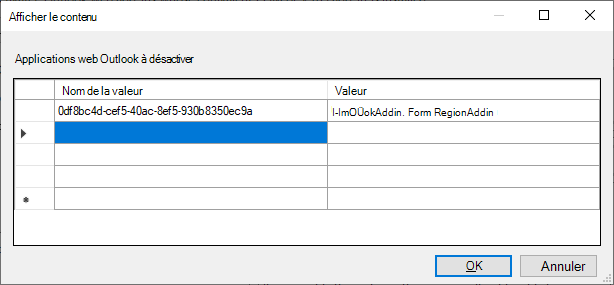

# <a name="make-your-office-add-in-compatible-with-an-existing-com-add-in"></a>Rendre votre complément Office compatible avec un complément COM existant

Si vous avez un compl?ment COM existant, vous pouvez créer des fonctionnalités équivalentes dans votre compl?ment Office, permettant ainsi votre solution de s’exécuter sur d’autres plateformes telles que Office sur le Web ou Mac. Dans certains cas, votre Office peut ne pas être en mesure de fournir toutes les fonctionnalités disponibles dans le compl?ment COM correspondant. Dans ces situations, votre compl?ment COM peut fournir une meilleure expérience utilisateur sur Windows que l’interface Office compl?ments peut fournir.

Vous pouvez configurer votre compl?ment Office de sorte que lorsque le compl?ment COM équivalent est déjà install sur l’ordinateur d’un utilisateur, Office sur Windows exécute le compl?ment COM au lieu du compl?ment Office. Le add-in COM est appelé « équivalent », car Office passe en toute transparence entre le compl?ment COM et le compl?ment Office en fonction de celui qui est install ? l’ordinateur d’un utilisateur.

> [!NOTE]
> Cette fonctionnalité est prise en charge par la plateforme et les applications suivantes, lorsqu’elles sont connectées à Microsoft 365 abonnement. Les add-ins COM ne peuvent pas être installés sur une autre plateforme. Ainsi, sur ces plateformes, l’élément manifeste qui est abordé plus loin dans cet article, `EquivalentAddins` est ignoré.
>
> - Excel, Word et PowerPoint sur Windows (version 1904 ou ultérieure)
> - Outlook sur Windows (version 2102 ou ultérieure) par rapport à une version Exchange serveur pris en charge
>   - Exchange Online
>   - Exchange cumulative 2019 10 ou version ultérieure ([KB5003612](https://support.microsoft.com/topic/b1434cad-3fbc-4dc3-844d-82568e8d4344))
>   - Exchange cumulative 2016 21 ou version ultérieure ([KB5003611](https://support.microsoft.com/topic/b7ba1656-abba-4a0b-9be9-dac45095d969))

## <a name="specify-an-equivalent-com-add-in"></a>Spécifier un compl?ment COM équivalent

### <a name="manifest"></a>Manifeste

> [!IMPORTANT]
> S’applique Excel, Outlook, PowerPoint et Word.

Pour activer la compatibilité entre votre Office et votre compl?ment COM, identifiez [](add-in-manifests.md) le compl?ment COM équivalent dans le manifeste de votre Office compl?ment. Ensuite, Office sur Windows utilisera le compl?ment COM au lieu du compl?ment Office, s’ils sont tous les deux install s.

L’exemple suivant montre la partie du manifeste qui spécifie un compl?ment COM en tant que compl?ment équivalent. La valeur de l’élément identifie le add-in COM et l’élément `ProgId` [EquivalentAddins](../reference/manifest/equivalentaddins.md) doit être placé immédiatement avant la balise `VersionOverrides` de fermeture.

```xml
<VersionOverrides>
  ...
  <EquivalentAddins>
    <EquivalentAddin>
      <ProgId>ContosoCOMAddin</ProgId>
      <Type>COM</Type>
    </EquivalentAddin>
  </EquivalentAddins>
</VersionOverrides>
```

> [!TIP]
> Pour plus d’informations sur le module complémentaire COM et la compatibilité XLL UDF, voir Rendre vos fonctions personnalisées compatibles avec les fonctions [XLL définies par l’utilisateur.](../excel/make-custom-functions-compatible-with-xll-udf.md) Non applicable pour les Outlook.

### <a name="group-policy"></a>Stratégie de groupe

> [!IMPORTANT]
> S’applique Outlook uniquement.

Pour déclarer la compatibilité entre votre compl?ment web Outlook et le compl?ment COM/VSTO, identifiez le compl?ment COM équivalent dans la stratégie de groupe **Deactiver** les compl?ments web Outlook dont le compl?ment COM ou VSTO équivalent est install s en configurant sur l’ordinateur de l’utilisateur. Ensuite, Outlook sur Windows utilisera le compl?ment COM au lieu du compl?ment web, s’ils sont tous deux install s.

1. Téléchargez la dernière [version de l’outil Modèles d’administration,](https://www.microsoft.com/download/details.aspx?id=49030)en vous important des **instructions d’installation de l’outil.**
1. Ouvrez l’Éditeur de stratégie de groupe local (**gpedit.msc**).
1. Accédez **aux**  >  **modèles d’administration** de configuration utilisateur   >  **Microsoft Outlook 2016**  >  **divers.**
1. Sélectionnez le paramètre Désactiver Outlook de sites web dont l’équivalent **COM ou VSTO est installé.**
1. Ouvrez le lien pour modifier le paramètre de stratégie.
1. Dans la boîte **de dialogue Outlook les** applications web à désactiver :
    1. Définissez **le nom de** la valeur sur la valeur trouvée dans le manifeste du `Id` add-in web. **Important**: *n’ajoutez* pas d’accolades `{}` autour de l’entrée.
    1. Définissez **la** valeur sur la valeur du VSTO `ProgId` com/VSTO équivalent.
    1. Sélectionnez **OK** pour mettre la mise à jour en vigueur.
    

## <a name="equivalent-behavior-for-users"></a>Comportement équivalent pour les utilisateurs

Lorsqu’un compl?ment [COM](#specify-an-equivalent-com-add-in)équivalent est spécifié, Office sur Windows n’affiche pas l’interface utilisateur de votre compl?ment Office si le compl?ment COM ex quis est install . Office masque uniquement les boutons du ruban du Office et n’empêche pas l’installation. Par conséquent, votre Office’interface utilisateur apparaîtra toujours aux emplacements suivants dans l’interface utilisateur.

- Sous **Mes modules**
- En tant qu’entrée dans le gestionnaire du ruban (Excel, Word et PowerPoint uniquement)

> [!NOTE]
> La spécification d’un module com équivalent dans le manifeste n’a aucun effet sur les autres plateformes telles que Office sur le Web ou Mac.

Les scénarios suivants décrivent ce qui se produit en fonction de la façon dont l’utilisateur acquiert le Office de contenu.

### <a name="appsource-acquisition-of-an-office-add-in"></a>Acquisition d’un Office AppSource

Si un utilisateur acquiert le Office à partir d’AppSource et que le module com équivalent est déjà installé, Office :

1. Installez le Office’installation.
2. Masquez l Office’interface utilisateur du module de module dans le ruban.
3. Affichez un appel pour l’utilisateur qui pointe sur le bouton du ruban du compl?ment COM.

### <a name="centralized-deployment-of-office-add-in"></a>Déploiement centralisé du Office de bureau

Si un administrateur déploie le add-in Office sur son client à l’aide d’un déploiement centralisé et que le module com équivalent est déjà installé, l’utilisateur doit redémarrer Office avant de voir les modifications. Une fois Office redémarrage, il :

1. Installez le Office’installation.
2. Masquez l Office’interface utilisateur du module de module dans le ruban.
3. Affichez un appel pour l’utilisateur qui pointe sur le bouton du ruban du compl?ment COM.

### <a name="document-shared-with-embedded-office-add-in"></a>Document partagé avec un Office incorporé

Si un utilisateur a installé le compl?ment COM, puis obtient un document partagé avec le compl?ment Office incorporé, alors lorsqu’il ouvre le document, Office :

1. Invitez l’utilisateur à faire confiance au Office de contenu.
2. S’il est approuvé, Office le module de mise en Office s’installe.
3. Masquez l Office’interface utilisateur du module de module dans le ruban.

## <a name="other-com-add-in-behavior"></a>Autre comportement des autres compl?ments COM

### <a name="excel-powerpoint-word"></a>Excel, PowerPoint, Word

Si un utilisateur désinstalle l’équivalent du compl?ment COM, Office sur Windows restaure l’interface utilisateur Office du compl?ment.

Une fois que vous avez spécifié un Office COM équivalent pour votre Office, Office cesse de traiter les mises à jour de votre Office de recherche. Pour obtenir les dernières mises à jour du Office, l’utilisateur doit d’abord désinstaller le compl?ment COM.

### <a name="outlook"></a>Outlook

Le VSTO COM/Outlook doit être connecté pour que le module web correspondant soit désactivé.

Si le VSTO COM/VSTO est alors déconnecté lors d’une session Outlook suivante, le compl?ment web restera probablement désactivé jusqu’au redémarrage de Outlook'

## <a name="see-also"></a>Voir aussi

- [Rendre vos fonctions personnalisées compatibles avec les fonctions XLL définies par l’utilisateur](../excel/make-custom-functions-compatible-with-xll-udf.md)
