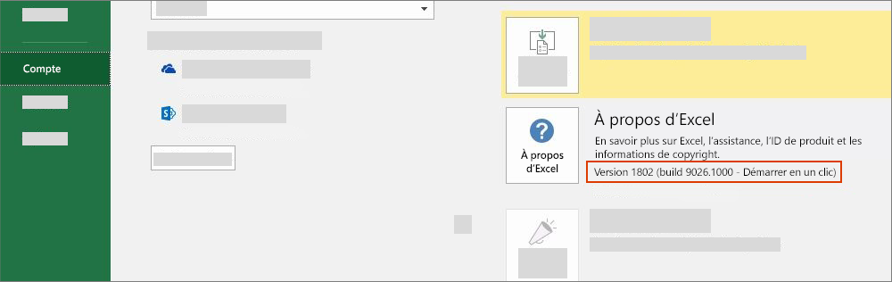

# Versions d’Office et ensembles de conditions requises

Il existe de nombreuses versions d’Office sur plusieurs plateformes, celles-ci ne prenant pas forcément en charge toutes les API dans l’interface API JavaScript pour Office (Office.js). Vous n’avez pas toujours le contrôle sur la version d’Office que vos utilisateurs ont installée.  Pour gérer cette situation, nous fournissons un système nommé ensembles de conditions requises pour vous aider à déterminer si un hôte Office prend en charge les fonctionnalités dont vous avez besoin dans votre complément Office. 

> [!NOTE]
> - Office s’exécute sur plusieurs plateformes, y compris sur Windows, dans un navigateur, un Mac et un iPad.
> - Parmi les hôtes Office, voici quelques exemples de produits Office : Excel, Word, PowerPoint, Outlook, OneNote et autres.  
> - Un ensemble de conditions requises est un groupe nommé de membres d’API, par exemple : `ExcelApi 1.5`, `WordApi 1.3`, et ainsi de suite.  

## Vérification de votre version d’Office

Pour identifier la version d’Office que vous utilisez, à partir d’une application Office, sélectionnez le menu **Fichier**, puis sélectionnez **Compte**. La version d’Office s’affiche dans la section **Informations sur le produit**. Par exemple, la capture d’écran suivante indique la version 1802 d’Office (build 9026.1000) :

## Disponibilité des ensembles de conditions requises Office

Les compléments Office peuvent utiliser des ensembles de conditions requises d’API pour déterminer si l’hôte Office prend en charge les membres d’API nécessaires. La prise en charge des ensembles de conditions requises varie selon l’hôte Office et la version de ce dernier (voir la section précédente).

Certains hôtes Office ont leurs propres ensembles de conditions requises d’API. Par exemple, le premier ensemble de conditions requises pour l’API Excel était `ExcelApi 1.1` et le premier ensemble de conditions requises pour l’API Word était `WordApi 1.1`. Depuis lors, de nombreux ensembles de conditions requises d’API Excel et d’API Word ont été ajoutés pour proposer des fonctionnalités d’API supplémentaires.

Par ailleurs, d’autres fonctionnalités telles que les commandes de complément (extensibilité du ruban) et la possibilité de lancer des boîtes de dialogue (API de boîte de dialogue) ont été ajoutées à l’API commune. Les commandes de complément et les ensembles de conditions requises d’API de boîte de dialogue sont des exemples d’ensembles de conditions requises d’API que les différents hôtes Office ont en commun.

Un complément peut utiliser uniquement des API dans les ensembles de conditions requises qui sont prises en charge par la version de l’hôte Office sur lequel le complément est exécuté. Pour savoir exactement quels ensembles de conditions requises sont disponibles pour une version spécifique de l’hôte Office, reportez-vous aux articles suivants sur les ensembles de conditions requises propres aux hôtes :

- [Ensembles de conditions requises de l’API JavaScript pour Excel](../reference/requirement-sets/excel-api-requirement-sets.md) (ExcelApi)
- [Ensembles de conditions requises de l’API JavaScript pour Word](../reference/requirement-sets/word-api-requirement-sets.md) (WordApi)
- [Ensembles de conditions requises de l’API JavaScript pour OneNote](../reference/requirement-sets/onenote-api-requirement-sets.md) (OneNoteApi)
- [Ensembles de conditions requises de l’API JavaScript pour PowerPoint](../reference/requirement-sets/powerpoint-api-requirement-sets.md) (PowerPointApi)
- [Présentation de l’ensemble de conditions requises pour les API Outlook](../reference/requirement-sets/outlook-api-requirement-sets.md) (Mailbox)

Certains ensembles de conditions requises contiennent des API qui peuvent être utilisées par n’importe quel hôte Office. Pour plus d’informations sur ces ensembles de conditions requises, reportez-vous aux articles suivants :

- [Ensembles de conditions requises communes pour Office](../reference/requirement-sets/office-add-in-requirement-sets.md)
- [Ensembles de conditions requises concernant les commandes de complément](../reference/requirement-sets/add-in-commands-requirement-sets.md)
- [Ensembles de conditions requises de l’API de boîte de dialogue](../reference/requirement-sets/dialog-api-requirement-sets.md)
- [Ensembles de conditions requises de l’API d’identité](../reference/requirement-sets/identity-api-requirement-sets.md)

Le numéro de version d’un ensemble de conditions requises, par exemple « 1.1 » dans `ExcelApi 1.1`, est défini par rapport à l’hôte d’Office. Le numéro de version d’un ensemble donné de conditions requises (par exemple, `ExcelApi 1.1`) ne correspond pas au numéro de version d’Office.js, ni aux ensembles de conditions requises pour d’autres hôtes Office (comme Word, Outlook, etc.).  Les ensembles de conditions requises pour les différents hôtes Office sont publiés à des moments et à des rythmes différents. Par exemple, `ExcelApi 1.5` a été publié avant l’ensemble de conditions requises `WordApi 1.3`.

L’API JavaScript pour la bibliothèque Office (Office.js) inclut tous les ensembles de conditions requises actuellement disponibles. Alors qu’il existe des ensembles de conditions requises `ExcelApi 1.3` et `WordApi 1.3`, il n’existe pas d’ensemble de conditions requises `Office.js 1.3`. La dernière version d’Office.js est gérée comme un point de terminaison Office unique remis via le réseau de distribution de contenu (CDN). Pour plus d’informations sur le CDN Office.js, notamment sur la gestion des versions et de la compatibilité avec les anciennes versions, reportez-vous à l’article [Présentation de l’API Interface JavaScript pour Office](../develop/understanding-the-javascript-api-for-office.md).

## Spécification des ensembles de conditions requises et des hôtes Office

Il existe différentes méthodes pour spécifier les hôtes Office et les ensembles de conditions qui sont requis par un complément.  Pour plus d’informations, consultez la rubrique [Spécifier les hôtes Office et la configuration requise d’API](../develop/specify-office-hosts-and-api-requirements.md).

## Voir aussi

- [Spécification des exigences en matière d’hôtes Office et d’API](../develop/specify-office-hosts-and-api-requirements.md)
- [Installer la dernière version d’Office](../develop/install-latest-office-version.md)
- [Aperçu des canaux de mise à jour pour les applications Microsoft 365](/deployoffice/overview-of-update-channels-for-office-365-proplus)
- [Tirez le meilleur parti d’Office avec Office 365](https://products.office.com/compare-all-microsoft-office-products?tab=2)
