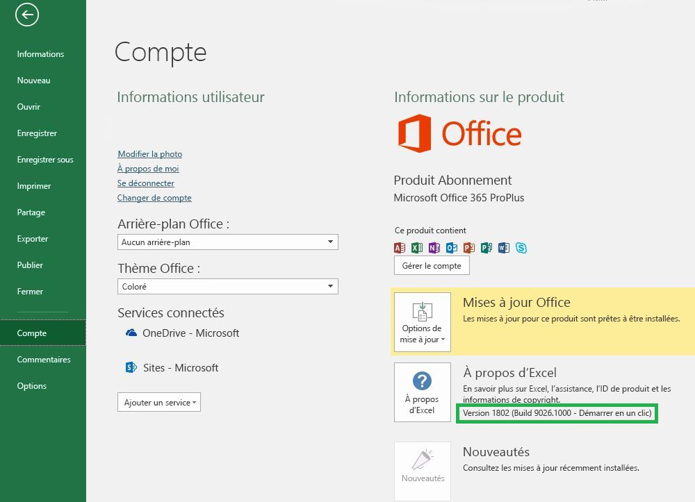

# Versions d’Office et ensembles de conditions requisesOffice versions and requirement sets

Il existe de nombreuses versions d’Office sur plusieurs plateformes, celles-ci ne prenant pas forcément en charge toutes les API dans l’interface API JavaScript pour Office (Office.js).There are many versions of Office on several platforms, and they don't all support every API in Office JavaScript API (Office.js). Vous n’avez pas toujours le contrôle sur la version d’Office que vos utilisateurs ont installée.You may not always have control over the version of Office your users have installed.  Pour gérer cette situation, nous fournissons un système nommé ensembles de conditions requises pour vous aider à déterminer si un hôte Office prend en charge les fonctionnalités dont vous avez besoin dans votre complément Office.To handle this situation, we provide a system called requirement sets to help you determine whether an Office host supports the capabilities you need in your Office Add-in. 

> [!NOTE]
> - Office peut être exécuté sur plusieurs plateformes, notamment Office pour Windows, Office Online, Office pour Mac et Office pour iPad.Office runs across multiple platforms, including Office for Windows, Office Online, Office for the Mac, and Office for the iPad.  
> - Parmi les hôtes Office, voici quelques exemples de produits Office : Excel, Word, PowerPoint, Outlook, OneNote et autres.Examples of Office hosts are Office Products: Excel, Word, PowerPoint, Outlook, OneNote, and so forth.  
> - Un ensemble de conditions requises est un groupe nommé de membres d’API, par exemple : `ExcelApi 1.5`, `WordApi 1.3`, et ainsi de suite.A requirement set is a named group of API members e.g., `ExcelApi 1.5`, `WordApi 1.3`, and so on.  

## Vérification de votre version d’OfficeHow to check your Office version

Pour identifier la version d’Office que vous utilisez, à partir d’une application Office, sélectionnez le menu **Fichier**, puis sélectionnez **Compte**.To identify the Office version that you're using, from within an Office application, select the **File** menu, and then choose **Account**. La version d’Office s’affiche dans la section **Informations sur le produit**.The version of Office will appear in the **Product Information** section. Par exemple, la capture d’écran suivante indique la version 1802 d’Office (build 9026.1000) :For example, the following screenshot indicates Office Version 1802 (Build 9026.1000):

## Disponibilité des ensembles de conditions requises OfficeOffice requirement sets availability

Les compléments Office peuvent utiliser des ensembles de conditions requises d’API pour déterminer si l’hôte Office prend en charge les membres d’API nécessaires.Office Add-ins can use API requirement sets to determine whether the Office host supports the API members that it need to use. La prise en charge des ensembles de conditions requises varie selon l’hôte Office et la version de ce dernier (voir la section précédente).Requirement set support varies by Office host and the Office host version (see previous section).

Certains hôtes Office ont leurs propres ensembles de conditions requises d’API.Some Office hosts have their own API requirement sets. Par exemple, le premier ensemble de conditions requises pour l’API Excel était `ExcelApi 1.1` et le premier ensemble de conditions requises pour l’API Word était `WordApi 1.1`.For example, the first requirement set for the Excel API was `ExcelApi 1.1` and the first requirement set for the Word API was `WordApi 1.1`. Depuis lors, de nombreux ensembles de conditions requises d’API Excel et d’API Word ont été ajoutés pour proposer des fonctionnalités d’API supplémentaires.Since then, multiple new ExcelApi requirement sets and WordApi requirement sets have been added to provide additional API functionality.

Par ailleurs, d’autres fonctionnalités telles que les commandes de complément (extensibilité du ruban) et la possibilité de lancer des boîtes de dialogue (API de boîte de dialogue) ont été ajoutées à l’API commune.In addition, other functionality such as add-in commands (ribbon extensibility) and the ability to launch dialog boxes (Dialog API) were added to the common API. Les commandes de complément et les ensembles de conditions requises d’API de boîte de dialogue sont des exemples d’ensembles de conditions requises d’API que les différents hôtes Office ont en commun.Add-in commands and Dialog API requirement sets are examples of API sets that the various Office hosts share in common.

Un complément peut utiliser uniquement des API dans les ensembles de conditions requises qui sont prises en charge par la version de l’hôte Office sur lequel le complément est exécuté.An add-in can only use APIs in requirement sets that are supported by the version of Office host where the add-in is running. Pour savoir exactement quels ensembles de conditions requises sont disponibles pour une version spécifique de l’hôte Office, reportez-vous aux articles suivants sur les ensembles de conditions requises propres aux hôtes :To know exactly which requirement sets are available for a specific Office host version, refer to the following host-specific requirement set articles:

- [Ensembles de conditions requises de l’API JavaScript pour Excel](https://docs.microsoft.com/office/dev/add-ins/reference/requirement-sets/excel-api-requirement-sets) (ExcelApi)[Excel JavaScript API requirement sets](https://docs.microsoft.com/office/dev/add-ins/reference/requirement-sets/excel-api-requirement-sets) (ExcelApi)
- [Ensembles de conditions requises de l’API JavaScript pour Word](https://docs.microsoft.com/office/dev/add-ins/reference/requirement-sets/word-api-requirement-sets) (WordApi)[Word JavaScript API requirement sets](https://docs.microsoft.com/office/dev/add-ins/reference/requirement-sets/word-api-requirement-sets) (WordApi)
- [Ensembles de conditions requises de l’API JavaScript pour OneNote](https://docs.microsoft.com/office/dev/add-ins/reference/requirement-sets/onenote-api-requirement-sets) (OneNoteApi)[OneNote JavaScript API requirement sets](https://docs.microsoft.com/office/dev/add-ins/reference/requirement-sets/onenote-api-requirement-sets) (OneNoteApi)
- [Présentation de l’ensemble de conditions requises pour les API Outlook](https://docs.microsoft.com/office/dev/add-ins/reference/requirement-sets/outlook-api-requirement-sets) (MailBox)[Understanding Outlook API requirement sets](https://docs.microsoft.com/office/dev/add-ins/reference/requirement-sets/outlook-api-requirement-sets) (MailBox)

Certains ensembles de conditions requises contiennent des API qui peuvent être utilisées par n’importe quel hôte Office.Some requirement sets contain APIs that can be used by any Office host. Pour plus d’informations sur ces ensembles de conditions requises, reportez-vous aux articles suivants :For information about these requirement sets, refer to the following articles:

- [Ensembles de conditions requises communes pour OfficeOffice common API requirement sets](https://docs.microsoft.com/office/dev/add-ins/reference/requirement-sets/office-add-in-requirement-sets)
- [Ensembles de conditions requises concernant les commandes de complémentAdd-in commands requirement sets](https://docs.microsoft.com/office/dev/add-ins/reference/requirement-sets/add-in-commands-requirement-sets)
- [Ensembles de conditions requises de l’API de boîte de dialogueDialog API requirement sets](https://docs.microsoft.com/office/dev/add-ins/reference/requirement-sets/dialog-api-requirement-sets)
- [Ensembles de conditions requises de l’API d’identitéIdentity API requirement sets](https://docs.microsoft.com/office/dev/add-ins/reference/requirement-sets/identity-api-requirement-sets)

Le numéro de version d’un ensemble de conditions requises, par exemple « 1.1 » dans `ExcelApi 1.1`, est défini par rapport à l’hôte d’Office.The version number of a requirement set, such as the "1.1" in `ExcelApi 1.1`, is relative to the Office host. Le numéro de version d’un ensemble donné de conditions requises (par exemple, `ExcelApi 1.1`) ne correspond pas au numéro de version d’Office.js, ni aux ensembles de conditions requises pour d’autres hôtes Office (comme Word, Outlook, etc.).The version number of a given requirement set (e.g., `ExcelApi 1.1`) does not correspond to the version number of Office.js or to requirement sets for other Office hosts (e.g., Word, Outlook, etc.).  Les ensembles de conditions requises pour les différents hôtes Office sont publiés à des moments et à des rythmes différents.Requirement sets for the different Office hosts are released at different speeds and times. Par exemple, `ExcelApi 1.5` a été publié avant l’ensemble de conditions requises `WordApi 1.3`.For example, `ExcelApi 1.5` was released before the `WordApi 1.3` requirement set.

L’API JavaScript pour la bibliothèque Office (Office.js) inclut tous les ensembles de conditions requises actuellement disponibles.The JavaScript API for Office library (Office.js) includes all requirement sets that are currently available. Alors qu’il existe des ensembles de conditions requises `ExcelApi 1.3` et `WordApi 1.3`, il n’existe pas d’ensemble de conditions requises `Office.js 1.3`.While there is such a thing as requirement sets `ExcelApi 1.3` and `WordApi 1.3`, there is no `Office.js 1.3` requirement set. La dernière version d’Office.js est gérée comme un point de terminaison Office unique remis via le réseau de distribution de contenu (CDN).The latest release of Office.js is maintained as a single Office endpoint delivered via the content delivery network (CDN). Pour plus d’informations sur le CDN Office.js, notamment sur la gestion des versions et de la compatibilité avec les anciennes versions, reportez-vous à l’article [Présentation de l’API Interface JavaScript pour Office](https://docs.microsoft.com/office/dev/add-ins/develop/understanding-the-javascript-api-for-office).For more details around the Office.js CDN, including how versioning and backward compatability is handled, see [Understanding the JavaScript API for Office](https://docs.microsoft.com/office/dev/add-ins/develop/understanding-the-javascript-api-for-office).

## Spécification des ensembles de conditions requises et des hôtes OfficeSpecify Office hosts and requirement sets

Il existe différentes méthodes pour spécifier les hôtes Office et les ensembles de conditions qui sont requis par un complément.There are various ways to specify which Office hosts and requirement sets are required by an add-in.  Pour plus d’informations, consultez la rubrique [Spécifier les hôtes Office et la configuration requise d’API](https://docs.microsoft.com/office/dev/add-ins/develop/specify-office-hosts-and-api-requirements).For detailed information, see [Specify Office hosts and API requirements](https://docs.microsoft.com/office/dev/add-ins/develop/specify-office-hosts-and-api-requirements)

## Voir aussiSee also

- [Spécification des exigences en matière d’hôtes Office et d’APISpecify Office hosts and API requirements](https://docs.microsoft.com/office/dev/add-ins/develop/specify-office-hosts-and-api-requirements)
- [Installer la dernière version d’OfficeInstall the latest version of Office](https://docs.microsoft.com/office/dev/add-ins/develop/install-latest-office-version)
- [Présentation des canaux de mise à jour pour Office 365 ProPlusOverview of update channels for Office 365 ProPlus](https://docs.microsoft.com/deployoffice/overview-of-update-channels-for-office-365-proplus)
- [Tirez le meilleur parti d’Office avec Office 365Get the most from Office with Office 365](https://products.office.com/compare-all-microsoft-office-products?tab=2)
