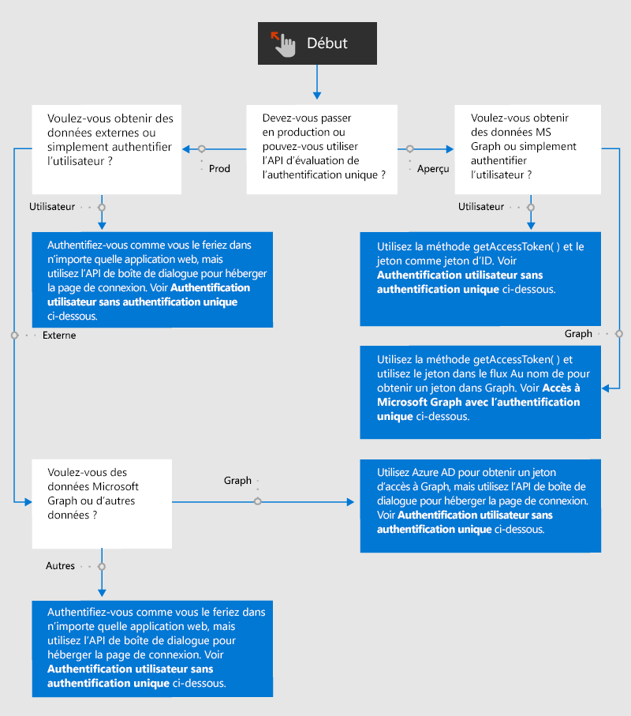

# Vue d’ensemble de l’authentification et de l’autorisation dans les compléments Office

Les applications Web et par conséquent les compléments Office autorisent l’accès anonyme par défaut, mais vous pouvez demander aux utilisateurs de s’authentifier avec une connexion. Par exemple, vous pouvez exiger que vos utilisateurs soient connectés avec un compte Microsoft, un compte Microsoft 365 Education ou un compte de travail, ou un autre compte commun. Cette tâche est appelée authentification des utilisateurs, car elle permet au complément de déterminer l’identité de l’utilisateur.

Votre add-in peut également obtenir le consentement de l'utilisateur pour accéder à ses données Microsoft Graphique (telles que son profil Microsoft 365, ses fichiers OneDrive et ses données SharePoint) ou à des données d'autres sources externes telles que Google, Facebook, LinkedIn, SalesForce et GitHub. Cette tâche est appelée autorisation de complément (ou d’application), car il s’agit du *complément* qui est autorisé et non l’utilisateur.

Vous avez le choix entre deux méthodes d’authentification.

- **Authentification unique (SSO) d’Office** : système *actuellement en préversion* qui permet à la connexion Office d’un utilisateur de fonctionner également comme connexion au complément. Si vous le souhaitez, le complément peut également utiliser les informations d’identification Office de l’utilisateur pour autoriser le complément à accéder à Microsoft Graph. (Les sources non-Microsoft ne sont pas accessibles par ce biais.)
- **Authentification et autorisation des applications web avec Azure Active Directory** : il ne s’agit pas d’une nouveauté, ni d’un comportement spécial. C’est la manière dont le complément Office (et les autres applications web) authentifiait les utilisateurs et autorisait les applications avant l’arrivée d’un système d’authentification unique pour Office et elle reste utilisée dans les scénarios où l’authentification unique d’Office est impossible.

Le diagramme suivant montre les décisions que vous devez prendre en tant que développeur de compléments. Cet article contient d’autres détails plus avant.

## Authentification utilisateur sans authentification unique

Vous pouvez authentifier un utilisateur dans un complément Office avec Azure Active Directory (AAD) comme vous le feriez dans d'autres applications web, à une exception près : AAD n’autorise pas la page de connexion à s’ouvrir dans un IFrame. Lorsqu’un complément Office est exécuté sur *Office sur le Web*, le volet Office est un iFrame. Cela signifie que vous devez ouvrir l’écran de connexion Azure Active Directory dans une boîte de dialogue ouverte avec l’API de boîte de dialogue Office. Cela a une incidence sur la manière dont vous utilisez les bibliothèques d’aide à l’authentification. Pour plus d’informations, consultez [Authentification avec l’API de boîte de dialogue Office](auth-with-office-dialog-api.md).

Pour plus d’informations sur la programmation de l’authentification avec Azure Active Directory, commencez par la [Vue d’ensemble de la plateforme d’identité Microsoft (v 2.0)](/azure/active-directory/develop/v2-overview) où se trouvent de nombreux didacticiels et guides, ainsi que des liens vers des exemples et bibliothèques pertinents. Comme expliqué dans [Authentification avec l’API de boîte de dialogue Office](auth-with-office-dialog-api.md), vous devrez peut-être ajuster le code dans les exemples pour qu’il s’exécute dans la boîte de dialogue Office.

## Accès à Microsoft Graph sans authentification unique

Vous pouvez obtenir l’autorisation d’accès aux données Microsoft Graph pour votre complément en obtenant un jeton d’accès auprès d’Azure Active Directory (AAD). Vous pouvez effectuer cette opération sans utiliser l’authentification unique d’Office. Pour plus d’informations sur la manière de procéder, voir [Accès à Microsoft Graph sans authentification unique](authorize-to-microsoft-graph-without-sso.md) qui contient davantage de détails et des liens vers des exemples.

## Authentification utilisateur avec authentification unique

Pour authentifier l'utilisateur à l'aide de l’authentification unique, votre code dans un volet Office ou un fichier fonction appelle la méthode [getAccessToken](/javascript/api/office-runtime/officeruntime.auth#getaccesstoken-options-). Si l’utilisateur n’est pas connecté, Office ouvre une boîte de dialogue et se redirige vers la page de connexion Azure Active Directory. Une fois que l’utilisateur se connecte, ou si l’utilisateur est déjà connecté, la méthode retourne un jeton d’accès. Ce jeton est un jeton de démarrage dans le flux **On Behalf Of**. (Voir [accès à Microsoft Graph sans authentification unique](#access-to-microsoft-graph-with-sso).) Il peut toutefois être utilisé en tant que jeton d’ID, car il contient plusieurs revendications uniques pour l’utilisateur actuel, notamment `preferred_username`, `name`, `sub` et `oid`. Pour obtenir des instructions sur la propriété à utiliser en tant qu’ID utilisateur final, voir [Jetons d’accès à la plateforme d’identité Microsoft](https://docs.microsoft.com/azure/active-directory/develop/access-tokens#payload-claims). Pour obtenir un exemple d’un de ces jetons, consultez l’[Exemple de jeton d’accès](sso-in-office-add-ins.md#example-access-token).

Une fois que votre code a extrait la revendication souhaitée du jeton, il utilise cette valeur pour rechercher l’utilisateur dans une table des utilisateurs ou une base de données des utilisateurs. Utilisez la base de données pour stocker les informations relatives aux utilisateurs, comme les préférences utilisateur ou l’état du compte utilisateur. Étant donné que vous utilisez l’authentification unique, vos utilisateurs ne se connectent pas séparément à votre complément. vous n’avez donc pas besoin de stocker de mot de passe pour l’utilisateur.

Avant de commencer l’implémentation de l’authentification des utilisateurs avec l’authentification unique, assurez-vous que vous êtes familiarisé avec l’article [Activer l’authentification unique pour les compléments Office](sso-in-office-add-ins.md). Notez également les exemples suivants :

- [Complément Office NodeJS SSO](https://github.com/OfficeDev/Office-Add-in-NodeJS-SSO), en particulier le fichier [ssoAuthES6.js](https://github.com/OfficeDev/Office-Add-in-NodeJS-SSO/blob/master/Complete/public/javascripts/ssoAuthES6.js).
- [Complément Office ASP.NET SSO](https://github.com/OfficeDev/Office-Add-in-ASPNET-SSO).

Toutefois, ces exemples n’utilisent pas le jeton comme jeton d’identité. Ils l’utilisent pour obtenir l’accès à Microsoft Graph avec le flux **On Behalf Of**.

## Accès à Microsoft Graph avec l’authentification unique

Pour utiliser l’authentification unique afin d'accéder à Microsoft Graph, votre complément dans le volet Office ou dans un fichier fonction appelle la méthode [getAccessToken](/javascript/api/office-runtime/officeruntime.auth#getaccesstoken-options-). Si l’utilisateur n’est pas connecté, Office ouvre une boîte de dialogue et la redirige vers la page de connexion Azure Active Directory. Une fois que l’utilisateur se connecte, ou si l’utilisateur est déjà connecté, la méthode retourne un jeton d’accès. Ce jeton est un jeton d’amorçage dans le flux **On Behalf Of**. Plus précisément, il possède une `scope`revendication avec la valeur `access_as_user`. Pour plus d’informations sur les revendications dans le jeton, voir [Jetons d’accès à la plateforme d’identité Microsoft](https://docs.microsoft.com/azure/active-directory/develop/access-tokens#payload-claims). Pour obtenir un exemple d’un de ces jetons, consultez l’[Exemple de jeton d’accès](sso-in-office-add-ins.md#example-access-token).

Une fois que votre code a obtenu le jeton, il l’utilise dans le flux **On Behalf Of** pour obtenir un deuxième jeton : un jeton d’accès à Microsoft Graph.

Avant de commencer l’implémentation de l’authentification unique Office, assurez-vous de bien vous familiariser avec les deux articles suivants :

- [Activer l’authentification unique pour des compléments Office](sso-in-office-add-ins.md)
- [Autoriser la connexion à Microsoft Graph avec l’authentification unique](authorize-to-microsoft-graph.md)

Vous devez également lire au moins l’un des articles de procédure de procédure mentionnés ici. Même si vous ne suivez pas la procédure, celle-ci contient des informations utiles sur la façon dont vous implémentez l’authentification unique Office et le flux **On Behalf Of**. 

- [Créer un complément Office ASP.NET qui utilise l’authentification unique](create-sso-office-add-ins-aspnet.md)
- [Créer un complément Office Node.js qui utilise l’authentification unique](create-sso-office-add-ins-nodejs.md)

Notez également les exemples suivants :

- [SSO NodeJS pour complément Office](https://github.com/OfficeDev/Office-Add-in-NodeJS-SSO)
- [SSO ASP.NET pour complément Office](https://github.com/OfficeDev/Office-Add-in-ASPNET-SSO)

## Accès à des sources de données non-Microsoft

Les services en ligne populaires, dont Google, Facebook, LinkedIn, SalesForce et GitHub, permettent aux développeurs d’accorder aux utilisateurs l’accès à leurs comptes dans d’autres applications. Vous avez ainsi la possibilité d’inclure ces services dans votre complément Office. Pour obtenir une vue d’ensemble des méthodes que votre complément peut utiliser, voir [Autoriser des services externes dans votre complément Office](auth-external-add-ins.md).

> [!IMPORTANT]
> Avant de commencer à coder, déterminez si la source de données autorise l’ouverture de son écran de connexion dans un IFrame. Lorsqu’un complément Office est exécuté sur *Office sur le Web*, le volet des tâches est un IFrame. Si la source de données n’autorise pas l’ouverture de l’écran de connexion dans un IFrame, vous devez ouvrir l’écran de connexion dans une boîte de dialogue ouverte avec l’API de dialogue Office. Pour plus d’informations, consultez [Authentification avec l’API de boîte de dialogue Office](auth-with-office-dialog-api.md).
