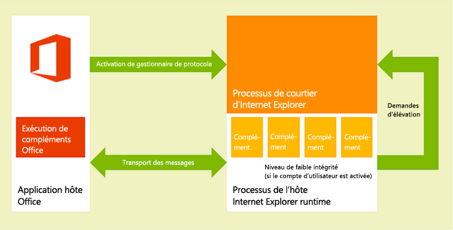
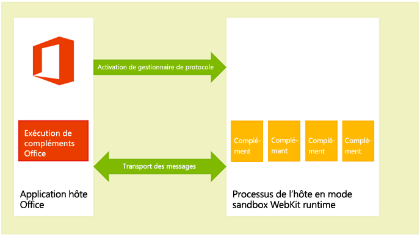
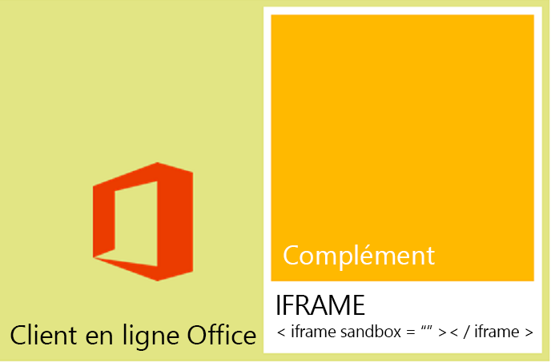

# <a name="privacy-and-security-for-office-add-ins"></a>Confidentialité et sécurité pour les compléments Office

## <a name="understanding-the-add-in-runtime"></a>Présentation du runtime de complément

Les Compléments Office sont sécurisées par un environnement d’exécution de complément, un modèle d’autorisations à plusieurs niveaux et des gouverneurs de performances. Cette infrastructure protège l’expérience utilisateur de la façon suivante : 


- L’accès à l’infrastructure de l’interface utilisateur de l’application hôte est géré.

- Seul un accès indirect au thread de l’interface utilisateur de l’application hôte est autorisé.

- Les interactions modales ne sont pas autorisées. Par exemple, les appels aux fonctions JavaScript  **alert**,  **confirm** et  **prompt** ne sont pas autorisés car ils sont modaux.

En outre, l’infrastructure d’exécution offre les avantages suivants pour garantir qu’un complément Office ne peut pas endommager l’environnement de l’utilisateur :


- Isole le processus dans lequel s’exécute le complément.

- Ne nécessite pas de remplacements de .dll ou de .exe, ni de composants ActiveX.

- Simplifie l’installation et la désinstallation des compléments.

De plus, l’utilisation des ressources de mémoire, de processeur et réseau par les compléments Office peut être régie afin de garantir de bonnes performances et une excellente fiabilité. 

Les sections suivantes décrivent brièvement comment l’architecture d’exécution prend en charge l’exécution de compléments dans les clients Office sur des appareils Windows ou Mac OS X, et dans les clients Office Online sur le web.

> **Remarque :** pour en savoir plus sur l’utilisation de la protection des informations Windows et d’Intune avec des compléments Office, reportez-vous à l’article relatif à l’[utilisation de la protection des informations Windows et d’Intune pour protéger des données d’entreprise dans les documents utilisant des compléments Office](https://docs.microsoft.com/en-us/microsoft-365-enterprise/office-add-ins-wip).

### <a name="clients-for-windows-and-os-x-devices"></a>Clients pour les appareils Windows et OS X

Dans les clients pris en charge pour les ordinateurs de bureau et les tablettes, comme Excel, Outlook et Outlook pour Mac, les complément Office sont pris en charge en intégrant un composant in-process, le runtime des compléments Office, qui gère le cycle de vie du complément et permet l’interopérabilité entre le complément et l’application cliente. La page web du complément elle-même est hébergée hors processus. Comme indiqué dans la figure 1, sur un ordinateur de bureau ou une tablette, la page web du complément est hébergée dans un contrôle Internet Explorer qui, à son tour, est hébergé dans un processus d’exécution du complément qui fournit la sécurité et l’isolation des performances.

Sur le bureau Windows, Le mode protégé d’Internet Explorer doit être activé pour la zone de site sensible. En règle générale, il est activé par défaut. S’il est désactivé, une [erreur se produit](https://support.microsoft.com/en-us/help/2761180/apps-for-office-don-t-start-if-you-disable-protected-mode-for-the-restricted-sites-zone-in-internet-explorer) lorsque vous essayez de lancer un complément.

**Figure 1. Environnement d’exécution des compléments Office dans les clients de bureau et de tablette Windows**



Comme indiqué dans la figure 2, sur un ordinateur de bureau Mac OS X, la page web du complément est hébergée dans un processus hôte d’exécution Webkit en mode bac à sable qui fournit un niveau similaire de sécurité et de protection des performances. 


**Figure 2. Environnement d’exécution des compléments Office dans les clients Mac OS X**



Le runtime des compléments Office gère les communications entre processus, la traduction des appels et des événements d’API JavaScript dans des appels et événements natifs, ainsi que la prise en charge à distance de l’interface utilisateur pour permettre au complément d’être restitué à l’intérieur du document, dans un volet Office ou de façon adjacente à un message électronique, une demande de réunion ou un rendez-vous.


### <a name="web-clients"></a>Clients web

Dans les clients web pris en charge, tels que Excel Online et Outlook Web App, les compléments Office sont hébergés dans un **iframe** exécuté à l’aide de l’attribut HTML5 **sandbox**. Les composants ActiveX ou la navigation dans la page principale du client web ne sont pas autorisés. La prise en charge des compléments Office est activée dans les clients web par l’intégration de l’API JavaScript pour Office. Comme pour les applications clientes de bureau, l’API JavaScript gère le cycle de vie du complément et l’interopérabilité entre le complément et le client web. Cette interopérabilité est implémentée à l’aide d’une infrastructure spéciale de communication par publication de messages sur plusieurs cadres. La bibliothèque JavaScript (Office.js) utilisée sur les clients de bureau est disponible pour l’interaction avec le client web. La figure 3 illustre l’infrastructure qui prend en charge les compléments Office dans Office Online (sur navigateur) et les composants impliqués (client web, **iframe**, exécution des compléments Office et API JavaScript pour Office) qui sont requis pour les prendre en charge.


**Figure 3. Infrastructure prenant en charge les compléments Office dans les clients web Office**




## <a name="add-in-integrity-in-the-office-store"></a>Intégrité des compléments dans l’Office Store

Vous pouvez rendre vos compléments Office accessibles au public en les publiant dans l’Office Store. L’Office Store applique les mesures suivantes pour conserver l’intégrité des compléments :


- Le serveur hôte d’un complément Office doit toujours utiliser le protocole SSL (Secure Sockets Layer) pour communiquer.

- Pour proposer des compléments, un développeur doit fournir la preuve de son identité, un accord contractuel et une stratégie de confidentialité conforme.

- Assurez-vous que le code source des compléments est accessible en lecture seule.

- Un système de révision par les utilisateurs est pris en charge pour les compléments disponibles afin de promouvoir une communauté d’autoréglementation.

## <a name="addressing-end-users-privacy-concerns"></a>Réponse aux inquiétudes des utilisateurs finaux concernant la confidentialité

Cette section décrit la protection offerte par la plateforme des compléments Office du point de vue du client (utilisateur final) et vous donne des recommandations concernant la satisfaction des attentes des utilisateurs et la façon de gérer leurs informations d’identification personnelle (PII) en toute sécurité.


### <a name="end-users-perspective"></a>Point de vue des utilisateurs finaux

Les compléments Office sont créés à l’aide de technologies web qui s’exécutent dans un contrôle de navigateur ou  **iframe**. C’est la raison pour laquelle l’utilisation de compléments est semblable à la navigation sur les sites web, que ce soit sur Internet ou sur l’intranet. Les compléments peuvent être externes à une organisation (si le complément est acquis à partir de l’Office Store) ou internes (si le complément est acquis à partir d’un catalogue de compléments Exchange Server, d’un catalogue de compléments SharePoint ou d’un partage de fichiers sur le réseau d’une organisation). Les compléments ont un accès limité au réseau et la plupart d’entre eux peuvent effectuer des opérations de lecture ou d’écriture dans le document ou l’élément de messagerie actif. La plateforme du complément applique certaines contraintes avant qu’un utilisateur ou un administrateur installe ou démarre ce complément. Mais, comme pour tout modèle d’extensibilité, les utilisateurs doivent faire preuve de prudence avant de lancer un complément inconnu.

La plateforme du complément répond aux inquiétudes des utilisateurs finaux concernant la confidentialité des manières suivantes :


- §LTA Les données communiquées avec le serveur web qui héberge un complément du volet Office, Outlook ou de contenu, ainsi que les communications entre le complément et tout service web, doivent toujours être chiffrées à l’aide du protocole SSL (Secure Socket Layer).

- Avant qu’un utilisateur n’installe un complément à partir de l’Office Store, il peut afficher la déclaration de confidentialité et les conditions requises du complément. De plus, les compléments Outlook qui interagissent avec les boîtes aux lettres des utilisateurs exposent les autorisations spécifiques nécessaires ; l’utilisateur peut lire les conditions d’utilisation, les autorisations requises et la déclaration de confidentialité avant d’installer un complément Outlook.

- Lorsqu’ils partagent un document, les utilisateurs partagent également les compléments insérés dans ces documents ou qui y sont associés. Si un utilisateur ouvre un document qui contient un complément qu’il n’a jamais utilisé auparavant, l’application hôte demande à l’utilisateur d’accorder l’autorisation d’exécution du complément dans le document. Dans un environnement d’entreprise, l’application hôte Office demande également à l’utilisateur si le document provient d’une source externe.

- Les utilisateurs peuvent activer ou désactiver l’accès à l’Office Store. Pour les compléments de contenu et du volet Office, les utilisateurs gèrent l’accès aux compléments et aux catalogues approuvés à partir du **Centre de gestion de la confidentialité** sur le client Office hôte (ouvert à partir de **Fichier** > **Options** > **Centre de gestion de la confidentialité** > **Paramètres du Centre de gestion de la confidentialité** > **Catalogues de compléments approuvés**). Pour les compléments Outlook, les utilisateurs peuvent gérer les compléments en sélectionnant le bouton **Gérer les compléments** ; dans Outlook pour Windows, choisissez **Fichier** > **Gérer les compléments**. Dans Outlook pour Mac, sélectionnez le bouton **Gérer les compléments** dans la barre des compléments. Dans Outlook Web App, choisissez le menu **Paramètres**(icône d’engrenage) > **Gérer les compléments**. Les administrateurs peuvent également gérer cet accès [à l’aide de la stratégie de groupe](http://technet.microsoft.com/en-us/library/jj219429.aspx#BKMK_Managing).

- La conception de la plateforme du complément offre sécurité et performance aux utilisateurs finals des façons suivantes :

  - Un complément Office s’exécute dans un contrôle de navigateur web, qui est hébergé dans un environnement d’exécution de compléments séparé de l’application hôte Office. Cette conception offre à la fois une sécurité et une séparation des performances de l’application hôte.

  - L’exécution dans un contrôle de navigateur web permet au complément de faire quasiment tout ce qu’une page web ordinaire exécutée dans un navigateur peut faire mais, en même temps, oblige le complément à suivre la stratégie d’origine identique pour l’isolation du domaine et les zones de sécurité.

Les compléments Outlook fournissent des fonctionnalités supplémentaires de sécurité et de performance grâce à une analyse de l’utilisation des ressources propres aux compléments Outlook. Pour en savoir plus, voir [Confidentialité, autorisations et sécurité pour les compléments Outlook](../../docs/outlook/privacy-and-security.md).


### <a name="developer-guidelines-to-handle-pii"></a>Recommandations à l’intention des développeurs en matière de gestion des PII

Vous pouvez lire les recommandations générales en matière de protection de PII destinées aux administrateurs informatiques et aux développeurs dans la rubrique [Protection de la confidentialité des données dans le développement et le test d’applications de gestion de ressources humaines](http://technet.microsoft.com/en-us/library/gg447064.aspx). Voici quelques recommandations en matière de protection de PII pour les développeurs de compléments Office :


- L’objet [Settings](../../reference/shared/settings.md) est conçu pour conserver les paramètres de complément et les données d’état entre les sessions pour un complément de contenu ou du volet Office, mais il ne stocke pas les mots de passe et autres informations d’identification personnelle confidentielles dans l’objet **Settings**. Les données contenues dans l’objet **Settings** ne sont pas visibles par les utilisateurs finaux, mais elles sont stockées en tant que partie du format de fichier du document, qui est facilement accessible. Vous devez limiter l’utilisation par votre complément des informations d’identification personnelle et stocker celles qu’il exige sur le serveur hébergeant votre complément en tant que ressource sécurisée par l’utilisateur.

- Certaines applications peuvent exposer les informations d’identification personnelle dans le cadre de leur utilisation. Faites en sorte de stocker les données de vos utilisateurs de manière sécurisée, notamment l’identité, la situation géographique, les heures d’accès et autres informations d’identification, pour éviter que d’autres utilisateurs du complément puissent y accéder.

- Si votre complément est disponible dans l’Office Store, l’utilisation obligatoire de HTTPS dans l’Office Store assure la protection des informations d’identification personnelle transmises entre votre serveur web et l’ordinateur client ou l’appareil. Toutefois, si vous devez retransmettre ces données à d’autres serveurs, veillez à observer le même niveau de protection.

- Si vous stockez les informations d’identification personnelle des utilisateurs, veillez à en informer les utilisateurs et donnez-leur la possibilité de les inspecter et de les supprimer. Si vous soumettez votre complément à l’Office Store, vous pouvez indiquer les données que vous collectez et l’utilisation qui en est faite dans la déclaration de confidentialité.


## <a name="developers-permission-choices-and-security-practices"></a>Choix des développeurs relatifs aux autorisations et aux pratiques de sécurité

Suivez les recommandations générales suivantes pour prendre en charge le modèle de sécurité des compléments Office et faire une exploration en détail pour chaque type de complément.


### <a name="permissions-choices"></a>Choix des autorisations

La plateforme du complément fournit un modèle d’autorisations que votre complément utilise pour déclarer le niveau d’accès aux données d’un utilisateur qu’il exige pour ses fonctionnalités. Chaque niveau d’autorisation correspond à un sous-ensemble de l’interface API JavaScript pour Office que votre complément est autorisé à utiliser pour ses fonctionnalités. Par exemple, l’autorisation  **WriteDocument** pour les compléments de contenu et du volet Office permet l’accès à la méthode [Document.setSelectedDataAsync](../../reference/shared/document.setselecteddataasync.md) qui laisse un complément écrire dans le document de l’utilisateur mais n’autorise pas l’accès aux méthodes de lecture de données à partir du document. Ce niveau d’autorisation est pertinent pour les compléments qui doivent seulement écrire dans un document, comme un complément dans lequel l’utilisateur peut rechercher des données à insérer dans son document.

Nous vous recommandons vivement de demander des autorisations sur la base du  _principe de privilège minimal_. Autrement dit, vous ne devez demander l’autorisation d’accès qu’au sous-ensemble minimal de l’API que votre complément requiert pour fonctionner correctement. Par exemple, si votre complément a seulement besoin de lire des données dans le document d’un utilisateur pour ses fonctionnalités, vous ne devez pas demander plus que l’autorisation **ReadDocument**. (Gardez toutefois à l’esprit qu’en cas de demande d’autorisations insuffisantes, la plateforme du complément bloquera l’utilisation de certaines API par votre complément et des erreurs seront générées lors de l’exécution.)

Spécifiez des autorisations dans le manifeste de votre complément, comme montré dans l’exemple de la section ci-dessous, pour permettre aux utilisateurs de connaître le niveau d’autorisation requis pour un complément avant de décider de l’installer ou de l’activer pour la première fois. De plus, les compléments Outlook qui demandent l’autorisation **ReadWriteMailbox** exigent des privilèges d’administrateur explicites pour l’installation.

L’exemple suivant montre comment un complément du volet Office spécifie l’autorisation  **ReadDocument** dans son manifeste. À des fins de clarté par rapport aux autorisations, les autres éléments du manifeste ne sont pas affichés.


```xml
<?xml version="1.0" encoding="utf-8"?>
<OfficeApp xmlns="http://schemas.microsoft.com/office/appforoffice/1.0"
           xmlns:xsi="http://www.w3.org/2001/XMLSchema-instance" 
           xmlns:ver="http://schemas.microsoft.com/office/appforoffice/1.0"
           xsi:type="TaskPaneApp">

... <!-- To keep permissions as the focus, not displaying other elements. -->
  <Permissions>ReadDocument</Permissions>
...
</OfficeApp>
```

Pour plus d’informations à ce propos pour les compléments de contenu et du volet Office, voir  [Requesting permissions for API use in content and task pane add-ins](requesting-permissions-for-api-use-in-content-and-task-pane-add-ins.md).

Pour plus d’informations à ce propos pour les compléments Outlook, voir les rubriques suivantes :

- [Confidentialité, autorisations et sécurité pour les compléments Outlook](../../docs/outlook/privacy-and-security.md)

- [Présentation des autorisations de complément Outlook](../../docs/outlook/understanding-outlook-add-in-permissions.md)


### <a name="same-origin-policy"></a>Stratégie d’origine identique

Comme les compléments Office sont des pages web qui s’exécutent dans un contrôle de navigateur web, elles doivent suivre la stratégie d’origine identique appliquée par le navigateur : par défaut, une page web dans un domaine ne peut pas effectuer des appels de service web [XmlHttpRequest](http://www.w3.org/TR/XMLHttpRequest/) vers un domaine autre que celui où il est hébergé.

Pour contourner cette limitation, il est possible d’utiliser JSON/P -- JSON/P fournit un proxy pour le service web en incluant une balise  **script** avec un attribut **src** qui pointe vers un script hébergé sur un autre domaine. Vous pouvez créer au moyen d’un programme les balises **script**, en créant dynamiquement l’URL vers laquelle pointer l’attribut **src**, et en passant les paramètres à l’URL via les paramètres de requêtes de l’URI. Les fournisseurs de services web créent et hébergent du code JavaScript à des URL spécifiques, et retournent différents scripts en fonction des paramètres de requête de l’URI. Ces scripts s’exécutent ensuite à l’emplacement où ils ont été insérés et fonctionnent comme ils sont chargés de le faire.

§LTA Ci-dessous figure un exemple de JSON/P dans l’exemple de complément Outlook. 

```js
// Dynamically create an HTML SCRIPT element that obtains the details for the specified video.
function loadVideoDetails(videoIndex) {
    // Dynamically create a new HTML SCRIPT element in the webpage.
    var script = document.createElement("script");
    // Specify the URL to retrieve the indicated video from a feed of a current list of videos,
    // as the value of the src attribute of the SCRIPT element. 
    script.setAttribute("src", "https://gdata.youtube.com/feeds/api/videos/" + 
        videos[videoIndex].Id + "?alt=json-in-script&amp;callback=videoDetailsLoaded");
    // Insert the SCRIPT element at the end of the HEAD section.
    document.getElementsByTagName('head')[0].appendChild(script);
}
```

Exchange et SharePoint sont des proxys côté client qui permettent un accès sur plusieurs domaines. En général, la stratégie d’origine identique sur un intranet n’est pas aussi stricte que sur Internet. Pour plus d’informations, voir [Stratégie d’origine identique Partie 1 : Interdiction de regarder](http://blogs.msdn.com/b/ieinternals/archive/2009/08/28/explaining-same-origin-policy-part-1-deny-read.aspx) et [Résolution des limites de stratégie d’origine identique dans les compléments Office](../../docs/develop/addressing-same-origin-policy-limitations.md).


### <a name="tips-to-prevent-malicious-cross-site-scripting"></a>Conseils pour éviter les scripts intersites malveillants

Un utilisateur mal intentionné peut s’attaquer à l’origine d’un complément en entrant du script malveillant dans le document ou les champs du complément. Le développeur doit traiter les entrées des utilisateurs afin d’éviter l’exécution du code JavaScript d’un utilisateur malveillant au sein de son domaine. Voici quelques conseils à suivre pour gérer les entrées des utilisateurs dans un document ou un message électronique, ou via les champs d’un complément :


- Au lieu d’utiliser la propriété DOM [innerHTML](http://msdn.microsoft.com/en-us/library/ie/ms533897.aspx), utilisez les propriétés [innerText](https://msdn.microsoft.com/library/ms533899.aspx) et [textContent](https://developer.mozilla.org/en-US/docs/DOM/Node.textContent) chaque fois que cela est possible. Utilisez ce qui suit afin d’assurer la prise en charge entre navigateurs pour Internet Explorer et Firefox :

```js
     var text = x.innerText || x.textContent
```

   Pour plus d’informations sur les différences entre  **innerText** et **textContent**, voir [Node.textContent](https://developer.mozilla.org/en-US/docs/DOM/Node.textContent). Pour plus d’informations sur la compatibilité DOM entre les navigateurs les plus répandus, voir les instructions relatives à la [compatibilité DOM W3C - HTML](http://www.quirksmode.org/dom/w3c_html.html#t07).

- Si vous devez utiliser  **innerHTML**, assurez-vous que l’entrée de l’utilisateur ne comporte pas de contenu malveillant avant de le transmettre à  **innerHTML**. Pour plus d’informations et pour obtenir un exemple montrant comment utiliser sans risque  **innerHTML**, voir la propriété [innerHTML](http://msdn.microsoft.com/en-us/library/ie/ms533897.aspx).

- Si vous utilisez jQuery, utilisez la méthode [.text()](http://api.jquery.com/text/) au lieu de la méthode [.html()](http://api.jquery.com/html/).

- Utilisez la méthode [toStaticHTML](http://msdn.microsoft.com/en-us/library/ie/cc848922.aspx) pour supprimer les éléments et attributs HTML dynamiques des entrées des utilisateurs avant de les transmettre à **innerHTML**.

- Utilisez la fonction [encodeURIComponent](http://msdn.microsoft.com/en-us/library/8202bce6-1342-40dc-a5ef-ac6d210a7d15.aspx) ou [encodeURI](http://msdn.microsoft.com/en-us/library/17bab5a2-bcd4-46c2-8b52-b2b5a0ed98a3.aspx) pour encoder le texte qui représente une URL ayant pour origine ou contenant une entrée utilisateur.

- Consultez les informations relatives au [développement de compléments sécurisés](http://msdn.microsoft.com/en-us/library/windows/apps/hh849625.aspx) pour connaître d’autres meilleures pratiques en matière de création de solutions web plus sécurisées.


### <a name="tips-to-prevent-clickjacking"></a>Conseils pour éviter les « détournements de clic »

Comme les compléments Office sont restitués dans un IFrame lorsqu’ils sont exécutés dans un navigateur avec les applications hôtes Office Online, suivez les conseils ci-dessous pour minimiser le risque de [détournement de clic](http://en.wikipedia.org/wiki/Clickjacking), une technique employée par les pirates informatiques pour inciter les internautes à fournir des informations confidentielles.

Tout d’abord, identifiez les actions sensibles que votre complément est en mesure d’effectuer, notamment celles qu’un utilisateur non autorisé pourrait utiliser à des fins malveillantes, comme effectuer une opération financière ou publier des données sensibles. Par exemple, votre complément peut permettre à l’utilisateur d’envoyer un paiement à un destinataire qu’il a lui-même défini.

Ensuite, concernant ces opérations sensibles, votre complément doit demander à l’utilisateur de confirmer l’action avant que celle-ci ne soit exécutée. Cette confirmation doit décrire en détail les conséquences de l’action qui va être exécutée. De même, le cas échéant, elle doit indiquer à l’utilisateur comment empêcher que l’action soit exécutée au moyen d’un bouton spécifique portant la mention « Ne pas autoriser » ou en ignorant la confirmation.

Enfin, pour être certain qu’aucun pirate informatique ne peut être en mesure de cacher ou masquer la confirmation, vous devez afficher cette dernière en dehors du contexte du complément (c’est-à-dire pas dans une boîte de dialogue HTML).

Voici quelques exemples de méthodes que vous pouvez utiliser pour obtenir la confirmation :


- Envoyer à l’utilisateur un courrier électronique contenant un lien de confirmation.

- Envoyer à l’utilisateur un message texte contenant un code de confirmation qu’il peut saisir dans le complément.

- Ouvrir une boîte de dialogue de confirmation dans une nouvelle fenêtre de navigateur dirigeant vers une page qui ne peut pas être intégrée dans un iFrame. C’est généralement le modèle qui est utilisé par les pages de connexion. Utilisez l’[API de boîte de dialogue](https://dev.office.com/docs/add-ins/develop/dialog-api-in-office-add-ins) pour créer une boîte de dialogue.

Assurez-vous également que l’adresse que vous utilisez pour contacter l’utilisateur n’a pas pu être fournie par un pirate potentiel. Par exemple, pour les confirmations de paiement, utilisez l’adresse figurant dans le compte de l’utilisateur autorisé.


### <a name="other-security-practices"></a>Autres pratiques de sécurité

Les développeurs doivent aussi tenir compte des pratiques de sécurité suivantes :


- Les développeurs ne doivent pas utiliser les contrôles ActiveX dans les compléments Office car les contrôles ActiveX ne prennent pas en charge la nature multiplateforme de la plateforme du complément.

- Les compléments de contenu et du volet Office adoptent les mêmes paramètres SSL que les paramètres par défaut dans Internet Explorer, ce qui permet à la plupart des contenus d’être délivrés uniquement par SSL. Les compléments Outlook nécessitent une livraison du contenu par SSL. Les développeurs doivent spécifier dans l’élément **SourceLocation** du manifeste du complément une URL qui utilise le protocole HTTPS pour identifier l’emplacement du fichier HTML pour le complément.

    Pour s’assurer que les compléments ne délivrent pas du contenu à l’aide du protocole HTTP lors du test des compléments, les développeurs doivent s’assurer que les paramètres suivants sont sélectionnés dans Internet Explorer et qu’aucun avertissement de sécurité n’apparaît dans leurs scénarios de test :

    - Vérifiez que le paramètre de sécurité, **Affiche un contenu mixte**, pour la zone **Internet** est défini sur **Demander**. Pour cela, procédez comme suit dans Internet Explorer : sur l’onglet **Sécurité** de la boîte de dialogue **Options Internet**, sélectionnez la zone **Internet**, sélectionnez **Personnaliser le niveau**, recherchez **Afficher un contenu mixte**, et sélectionnez **Demander** si l’option n’est pas déjà sélectionnée.

    - Assurez-vous que **Avertir en cas de changement entre mode sécurisé et mode non sécurisé** est sélectionné sur l’onglet **Avancé** de la boîte de dialogue **Options Internet**.

- Afin que les compléments n’utilisent pas trop les ressources du processeur ou de la mémoire et provoquent un refus de services sur un ordinateur client, la plateforme établit des limites d’utilisation des ressources. Lors du test, les développeurs doivent vérifier si le complément fonctionne dans les limites d’utilisation des ressources.

- Avant de publier un complément, les développeurs doivent s’assurer que toutes les informations personnelles identifiables exposées dans les fichiers de leur complément sont sécurisées.

- Les développeurs ne devraient pas intégrer les clés qu’ils utilisent pour accéder aux API ou aux services tiers (tels que Bing, Google ou Facebook) directement dans les pages HTML de leur complément. À la place, ils doivent créer un service web personnalisé ou stocker les clés sous une autre forme de stockage web sécurisé qu’ils peuvent appeler pour passer la valeur de clé de leur complément.

- Les développeurs doivent procéder comme suit lorsqu’ils soumettent un complément à l’Office Store :

  - Héberger le complément qu’ils soumettent sur un serveur web qui prend en charge SSL.
  - Produire une déclaration énonçant une stratégie de confidentialité conforme.
  - Être prêts à signer un accord contractuel lorsqu’ils soumettent le complément.

Outre les règles d’utilisation des ressources, les développeurs de compléments Outlook doivent également s’assurer que leurs compléments respectent les limites de spécification des règles d’activation et l’utilisation de l’interface API JavaScript. Pour plus d’informations, voir [Limites pour l’activation et l’API JavaScript pour les compléments Outlook](http://msdn.microsoft.com/library/e0c9e3d0-517e-4333-b8bd-e169c51a07f6.aspx).


## <a name="it-administrators-control"></a>Contrôle des administrateurs informatiques

Dans un environnement d’entreprise, les administrateurs informatiques ont l’autorité ultime pour accorder ou refuser l’accès à l’Office Store et aux catalogues privés.


## <a name="additional-resources"></a>Ressources supplémentaires


- [Demande d’autorisations d’utilisation de l’API dans des compléments de contenu et de volet des tâches](http://msdn.microsoft.com/library/da2efadc-4ebf-45fe-be39-397ac1eb1dbd.aspx)

- [Confidentialité, autorisations et sécurité pour les compléments Outlook](http://msdn.microsoft.com/library/44208fc4-05d4-42d8-ab20-faa89624de1c.aspx)

- [Présentation des autorisations de complément Outlook](http://msdn.microsoft.com/library/5bca69f2-b287-4e19-8f0f-78d896b2a3d3.aspx)

- [Limites pour l’activation et l’API JavaScript pour les compléments Outlook](http://msdn.microsoft.com/library/e0c9e3d0-517e-4333-b8bd-e169c51a07f6.aspx)

- [Résolutions des limites de stratégie d’origine identique dans les compléments Office](http://msdn.microsoft.com/library/36c800ae-1dda-4ea8-a558-37c89ffb161b.aspx)

- [Stratégie d’origine identique](http://www.w3.org/Security/wiki/Same_Origin_Policy)

- [Stratégie d’origine identique Partie 1 : Interdiction de regarder](http://blogs.msdn.com/b/ieinternals/archive/2009/08/28/explaining-same-origin-policy-part-1-deny-read.aspx)

- [Stratégie d’origine identique pour JavaScript](https://developer.mozilla.org/En/Same_origin_policy_for_JavaScript)

- [Mode de protection d’Internet Explorer](https://support.microsoft.com/en-us/help/2761180/apps-for-office-don-t-start-if-you-disable-protected-mode-for-the-restricted-sites-zone-in-internet-explorer)
