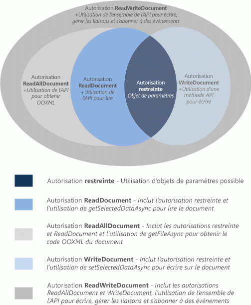

# <a name="requesting-permissions-for-api-use-in-content-and-task-pane-add-ins"></a>Demande d’autorisations pour l’utilisation d’API dans les compléments de contenu et du volet Office
Cet article décrit les différents niveaux d’autorisation que vous pouvez déclarer dans le manifeste de votre complément de contenu ou du volet Office afin de spécifier le niveau d’accès de l’API JavaScript requis pour les fonctionnalités de votre complément. 


## <a name="permissions-model"></a>Modèles d’autorisation


Le modèle d’autorisations d’accès de l’API JavaScript à cinq niveaux fournit les bases de confidentialité et de sécurité pour les utilisateurs de vos compléments de contenu et du volet Office. La figure 1 montre les cinq niveaux d’autorisations de l’API que vous pouvez déclarer dans le manifeste de votre complément.


**Figure 1. Modèle d’autorisations à cinq niveaux pour les compléments de contenu et du volet Office**




Ces autorisations spécifient le sous-ensemble de l’API auquel votre complément de contenu ou du volet Office est autorisé à accéder par l’environnement d’exécution lorsqu’un utilisateur insère, puis active (approuve) votre complément. Pour déclarer le niveau d’autorisation nécessaire à votre complément de contenu ou du volet Office, indiquez l’une des valeurs de texte d’autorisation dans l’élément [Permissions](http://msdn.microsoft.com/en-us/library/d4cfe645-353d-8240-8495-f76fb36602fe%28Office.15%29.aspx) du manifeste de votre complément. L’exemple suivant demande l’autorisation **WriteDocument**, laquelle n’autorise que les méthodes pouvant écrire dans le document (et non le lire).


```XML
<Permissions>WriteDocument</Permissions>
```

Il est recommandé de toujours demander les autorisations sur la base du principe d’ _autorisation minimum_. En d’autres termes, vous devez demander l’autorisation d’accéder uniquement au sous-ensemble de l’API nécessaire au bon fonctionnement de votre complément. Par exemple, si votre complément est conçu pour uniquement lire des données dans le document d’un utilisateur, vous ne devez demander que l’autorisation **ReadDocument**.

Le tableau suivant décrit le sous-ensemble de l’API JavaScript activé pour chaque niveau d’autorisation.


|**Autorisation**|**Sous-ensemble de l’API activé**|
|:-----|:-----|
|**Restricted**|Les méthodes de l’objet [Settings](http://dev.office.com/reference/add-ins/shared/settings) et la méthode [Document.getActiveViewAsync](../../reference/shared/document.getactiveviewasync.md).Niveau d’autorisation minimal pouvant être demandé par un complément de contenu ou du volet Office.|
|**ReadDocument**|En plus de l’API activé par l’autorisation  **Restricted**, permet l’accès aux membres de l’API nécessaires à la lecture du document et à la gestion des liaisons.Cela inclut l’utilisation des éléments suivants :<br/><ul><li>La méthode <a href="http://msdn.microsoft.com/en-us/library/f85ad02c-64f0-4b73-87f6-7f521b3afd69(Office.15).aspx" target="_blank">Document.getSelectedDataAsync</a> pour obtenir les données texte, HTML (Word uniquement) ou tabulaires sélectionnées, mais pas le code sous-jacent Open Office XML (OOXML) contenant toutes les données du document.</p></li><li><p>La méthode <a href="http://msdn.microsoft.com/en-us/library/78047418-89c4-4c7d-9427-4735b8559518(Office.15).aspx" target="_blank">Document.getFileAsync</a> pour obtenir la totalité du texte du document, mais pas la copie binaire OOXML sous-jacente du document.</p></li><li><p>La méthode <a href="http://msdn.microsoft.com/en-us/library/5372ffd8-579d-4fcb-9e5b-e9a2128f3201(Office.15).aspx" target="_blank">Binding.getDataAsync</a> pour la lecture des données liées dans le document.</p></li><li><p>Les méthodes <a href="http://msdn.microsoft.com/en-us/library/afbadac7-60c7-47cb-9477-6e9466ded44c(Office.15).aspx" target="_blank">addFromNamedItemAsync</a>, <a href="http://msdn.microsoft.com/en-us/library/9dc03608-b08b-4700-8be1-3c86ae236799(Office.15).aspx" target="_blank">addFromPromptAsync</a> et <a href="http://msdn.microsoft.com/en-us/library/edc99214-e63e-43f2-9392-97ead42fc155(Office.15).aspx" target="_blank">addFromSelectionAsync</a> de l’objet <span class="keyword">Bindings</span> pour la création de liaisons dans le document.</p></li><li><p>Les méthodes <a href="http://msdn.microsoft.com/en-us/library/ef902b73-cc4c-4551-95de-d8a51eeba82f(Office.15).aspx" target="_blank">getAllAsync</a>, <a href="http://msdn.microsoft.com/en-us/library/2727c891-bc05-465c-9324-113fbfeb3fbb(Office.15).aspx" target="_blank">getByIdAsync</a> et <a href="http://msdn.microsoft.com/en-us/library/ad285984-8b44-435d-9b84-f0ade570c896(Office.15).aspx" target="_blank">releaseByIdAsync</a> de l’objet <span class="keyword">Bindings</span> pour accéder aux liaisons du document et les supprimer.</p></li><li><p>La méthode <a href="http://msdn.microsoft.com/en-us/library/2533a563-95ae-4d52-b2d5-a6783e4ef5b4(Office.15).aspx" target="_blank">Document.getFilePropertiesAsync</a> pour accéder aux propriétés du fichier de document, comme l’URL du document.</p></li><li><p>La méthode <a href="http://msdn.microsoft.com/en-us/library/35dda81c-235e-4eab-8a77-9acb3b73a380(Office.15).aspx" target="_blank">Document.goToByIdAsync</a> pour accéder aux objets et aux emplacements nommés dans le document.</p></li><li><p>Pour les compléments du volet Office de Project, toutes les méthodes d’obtention (get) de l’objet <a href="http://msdn.microsoft.com/en-us/library/1908af4f-93b9-4859-87e3-06942014fae1(Office.15).aspx" target="_blank">ProjectDocument</a>. </p></li></ul>|
|**ReadAllDocument**|En plus de l’API activé par les autorisations **Restricted** et **ReadDocument**, permet l’accès supplémentaire aux données de document ci-dessous :<br/><ul><li><p>Les méthodes <span class="keyword">Document.getSelectedDataAsync</span> et <span class="keyword">Document.getFileAsync</span> pour accéder au code OOXML sous-jacent du document (qui peut inclure une mise en forme, des liens, des graphiques incorporés, des commentaires, des révisions, etc. en plus du texte).</p></li></ul>|
|**WriteDocument**|En plus de l’API activé par l’autorisation **Restricted**, permet l’accès aux membres de l’API suivants :<br/><ul><li><p>La méthode <a href="http://msdn.microsoft.com/en-us/library/998f38dc-83bd-4659-a759-4758c632a6ef(Office.15).aspx" target="_blank">Document.setSelectedDataAsync</a> pour écrire dans la sélection de l’utilisateur dans le document.</p></li></ul>|
|**ReadWriteDocument**|En plus de l’API activée par les autorisations  **Restricted**,  **ReadDocument**,  **ReadAllDocument** et **WriteDocument**, permet l’accès à toutes les API restantes prises en charge par les compléments de contenu et du volet Office, y compris les méthodes d’abonnement à des événements.Vous devez déclarer l’autorisation  **ReadWriteDocument** pour accéder aux membres supplémentaires suivants de l’API :<br/><ul><li><p>La méthode <a href="http://msdn.microsoft.com/en-us/library/6a59bb6d-40b6-4a95-9b98-d70d4616de09(Office.15).aspx" target="_blank">Binding.setDataAsync</a> pour écrire dans des zones liées du document.</p></li><li><p>La méthode <a href="http://msdn.microsoft.com/en-us/library/1cd23454-8435-4e13-98b3-d0d29ed278a8(Office.15).aspx" target="_blank">TableBinding.addRowsAsync</a> pour ajouter des lignes dans les tables liées.</p></li><li><p>La méthode <a href="http://msdn.microsoft.com/en-us/library/8f1bfa81-3850-4ea1-ba2e-c9bcf5847a44(Office.15).aspx" target="_blank">TableBinding.addColumnsAsync</a> pour ajouter des colonnes dans les tables liées.</p></li><li><p>La méthode <a href="http://msdn.microsoft.com/en-us/library/8f5cc783-384d-4520-a218-190dfed74dd2(Office.15).aspx" target="_blank">TableBinding.deleteAllDataValuesAsync</a> pour supprimer toutes les données d’une table liée.</p></li><li><p>Les méthodes <a href="http://msdn.microsoft.com/en-us/library/49712906-f582-4055-9ef8-6edde6e97679(Office.15).aspx" target="_blank">setFormatsAsync</a>, <a href="http://msdn.microsoft.com/en-us/library/cc56e9c0-b33c-4d9b-b676-a7e50f757c10(Office.15).aspx" target="_blank">clearFormatsAsync</a> et <a href="http://msdn.microsoft.com/en-us/library/2885fc57-4527-4ca4-a43d-9ee447ec27d3(Office.15).aspx" target="_blank">setTableOptionsAsync</a> de l’objet <span class="keyword">TableBinding</span> pour définir la mise en forme et les options des tables liées.</p></li><li><p>Tous les membres des objets <a href="http://msdn.microsoft.com/en-us/library/dc1518de-47fa-4108-aab7-04a022724b04(Office.15).aspx" target="_blank">CustomXmlNode</a>, <a href="http://msdn.microsoft.com/en-us/library/83f0e668-8236-4f2f-a20f-b173a9e3f65f(Office.15).aspx" target="_blank">CustomXmlPart</a>, <a href="http://msdn.microsoft.com/en-us/library/ba40cd4c-29bb-4f31-875d-6f1382fd1ee8(Office.15).aspx" target="_blank">CustomXmlParts</a> et <a href="http://msdn.microsoft.com/en-us/library/18b9aa8c-83e7-4c2f-8530-6a0ac8ce5535(Office.15).aspx" target="_blank">CustomXmlPrefixMappings</a>.</p></li><li><p>Toutes les méthodes d’abonnement à des événements prises en charge par les compléments de contenu et du volet Office, en particulier les méthodes <span class="keyword">addHandlerAsync</span> et <span class="keyword">removeHandlerAsync</span> des objets <a href="http://msdn.microsoft.com/en-us/library/42882642-d22b-47d2-a8d3-3aa8c6a4435e(Office.15).aspx" target="_blank">Binding</a>, <a href="http://msdn.microsoft.com/en-us/library/83f0e668-8236-4f2f-a20f-b173a9e3f65f(Office.15).aspx" target="_blank">CustomXmlPart</a>, <a href="http://msdn.microsoft.com/en-us/library/f8859516-cc1f-4b20-a8f3-cee37a983e70(Office.15).aspx" target="_blank">Document</a>, <a href="http://msdn.microsoft.com/en-us/library/1908af4f-93b9-4859-87e3-06942014fae1(Office.15).aspx" target="_blank">ProjectDocument</a> et <a href="http://msdn.microsoft.com/en-us/library/ad733387-a58c-4514-8fc2-53e64fad468d(Office.15).aspx" target="_blank">Settings</a>.</p></li></ul>|

## <a name="additional-resources"></a>Ressources supplémentaires

    
- [Confidentialité et sécurité pour les compléments Office](../../docs/develop/privacy-and-security.md)
    


