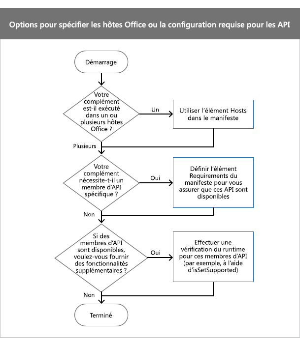

# <a name="specify-office-hosts-and-api-requirements"></a><span data-ttu-id="40e2b-102">Spécification des exigences en matière d’hôtes Office et d’API</span><span class="sxs-lookup"><span data-stu-id="40e2b-102">Specify Office hosts and API requirements</span></span>

<span data-ttu-id="40e2b-p101">Il se peut que votre complément Office dépende d’un hôte Office spécifique, d’un ensemble de conditions requises, d’un membre d’API ou d’une version de l’API pour fonctionner correctement. Par exemple, votre complément peut :</span><span class="sxs-lookup"><span data-stu-id="40e2b-p101">Your Office Add-in might depend on a specific Office host, a requirement set, an API member, or a version of the API in order to work as expected. For example, your add-in might:</span></span>

- <span data-ttu-id="40e2b-105">Exécuter dans une application Office (Word ou Excel), ou plusieurs applications.</span><span class="sxs-lookup"><span data-stu-id="40e2b-105">Run in a single Office application (e.g., Word or Excel), or several applications.</span></span>

- <span data-ttu-id="40e2b-p102">utiliser des API JavaScript disponibles uniquement dans certaines versions d’Office. Par exemple, vous pouvez utiliser les API JavaScript d’Excel dans un complément qui fonctionne dans Excel 2016 ;</span><span class="sxs-lookup"><span data-stu-id="40e2b-p102">Make use of JavaScript APIs that are only available in some versions of Office. For example, you might use the Excel JavaScript APIs in an add-in that runs in Excel 2016.</span></span>

- <span data-ttu-id="40e2b-108">s’exécuter uniquement dans les versions d’Office qui prennent en charge les membres d’API utilisés par votre complément.</span><span class="sxs-lookup"><span data-stu-id="40e2b-108">Run only in versions of Office that support API members that your add-in uses.</span></span>

<span data-ttu-id="40e2b-109">Cet article vous aidera à comprendre les options que vous devez choisir afin de vous assurer que votre complément fonctionne comme prévu et atteint l’audience la plus large possible.</span><span class="sxs-lookup"><span data-stu-id="40e2b-109">This article helps you understand which options you should choose to ensure that your add-in works as expected and reaches the broadest audience possible.</span></span>

> [!NOTE]
> <span data-ttu-id="40e2b-110">Pour savoir de manière détaillée quelle version d’Office prend en charge les compléments Office, consultez la page relative à la [disponibilité des compléments Office sur les plateformes et les hôtes](../overview/office-add-in-availability.md).</span><span class="sxs-lookup"><span data-stu-id="40e2b-110">For a high-level view of where Office Add-ins are currently supported, see the [Office Add-in host and platform availability](../overview/office-add-in-availability.md) page.</span></span>

<span data-ttu-id="40e2b-111">Le tableau suivant répertorie les concepts principaux décrits dans cet article.</span><span class="sxs-lookup"><span data-stu-id="40e2b-111">The following table lists core concepts discussed throughout this article.</span></span>

|<span data-ttu-id="40e2b-112">**Concept**</span><span class="sxs-lookup"><span data-stu-id="40e2b-112">**Concept**</span></span>|<span data-ttu-id="40e2b-113">**Description**</span><span class="sxs-lookup"><span data-stu-id="40e2b-113">**Description**</span></span>|
|:-----|:-----|
|<span data-ttu-id="40e2b-114">Application Office, application hôte Office ou hôte Office</span><span class="sxs-lookup"><span data-stu-id="40e2b-114">Office application, Office host application, Office host, or host</span></span>|<span data-ttu-id="40e2b-p103">Application Office utilisée pour exécuter votre complément. Par exemple, Word, Excel, etc.</span><span class="sxs-lookup"><span data-stu-id="40e2b-p103">The Office application used to run your add-in. For example, Word, Excel, and so on.</span></span>|
|<span data-ttu-id="40e2b-117">Plateforme</span><span class="sxs-lookup"><span data-stu-id="40e2b-117">Platform</span></span>|<span data-ttu-id="40e2b-118">Emplacement d’exécution de l’hôte Office, par exemple, dans un navigateur ou sur un iPad.</span><span class="sxs-lookup"><span data-stu-id="40e2b-118">Where the Office host runs, such as in a browser or on an iPad.</span></span>|
|<span data-ttu-id="40e2b-119">Ensemble de conditions requises</span><span class="sxs-lookup"><span data-stu-id="40e2b-119">Requirement set</span></span>|<span data-ttu-id="40e2b-p104">Groupe nommé de membres d’API associés. Les compléments utilisent des ensembles de conditions requises pour déterminer si l’hôte Office prend en charge les membres d’API utilisés par votre complément. Il est plus facile de tester la prise en charge d’un ensemble de conditions requises, plutôt que la prise en charge de membres individuels d’API. La prise en charge de l’ensemble des conditions requises varie selon l’hôte Office et la version de ce dernier. </span><span class="sxs-lookup"><span data-stu-id="40e2b-p104">A named group of related API members. Add-ins use requirement sets to determine whether the Office host supports API members used by your add-in. It's easier to test for the support of a requirement set than for the support of individual API members. Requirement set support varies by Office host and the version of the Office host. </span></span><br ><span data-ttu-id="40e2b-124">Les ensembles de conditions requises sont spécifiés dans le fichier manifeste.</span><span class="sxs-lookup"><span data-stu-id="40e2b-124">Requirement sets are specified in the manifest file.</span></span> <span data-ttu-id="40e2b-125">Quand vous définissez des ensembles de conditions requises dans le fichier manifeste, vous définissez le niveau minimal de prise en charge de l’API que l’hôte Office doit fournir pour exécuter votre complément.</span><span class="sxs-lookup"><span data-stu-id="40e2b-125">When you specify requirement sets in the manifest, you set the minimum level of API support that the Office host must provide in order to run your add-in.</span></span> <span data-ttu-id="40e2b-126">Les hôtes Office qui ne prennent pas en charge les ensembles de conditions requises spécifiés dans le manifeste ne peuvent pas exécuter votre complément, et votre complément ne sera pas affiché dans <span class="ui">Mes compléments</span>. Cela limite les emplacements où votre complément sera disponible.</span><span class="sxs-lookup"><span data-stu-id="40e2b-126">Office hosts that don't support requirement sets specified in the manifest can't run your add-in, and your add-in won't display in <span class="ui">My Add-ins</span>. This restricts where your add-in is available.</span></span> <span data-ttu-id="40e2b-127">Dans le code utilisant les vérifications à l’exécution.</span><span class="sxs-lookup"><span data-stu-id="40e2b-127">In code using runtime checks.</span></span> <span data-ttu-id="40e2b-128">Pour obtenir la liste complète des ensembles de conditions requises, voir [Ensemble de conditions requises pour les compléments Office](/office/dev/add-ins/reference/requirement-sets/office-add-in-requirement-sets).</span><span class="sxs-lookup"><span data-stu-id="40e2b-128">For the complete list of requirement sets, see [Office Add-in requirement sets](/office/dev/add-ins/reference/requirement-sets/office-add-in-requirement-sets).</span></span>|
|<span data-ttu-id="40e2b-129">Vérification à l’exécution</span><span class="sxs-lookup"><span data-stu-id="40e2b-129">Runtime check</span></span>|<span data-ttu-id="40e2b-130">Test effectué à l’exécution pour déterminer si l’hôte Office qui exécute votre complément prend en charge les ensembles de conditions requises ou les méthodes utilisés par votre complément.</span><span class="sxs-lookup"><span data-stu-id="40e2b-130">A test that is performed at runtime to determine whether the Office host running your add-in supports requirement sets or methods used by your add-in.</span></span> <span data-ttu-id="40e2b-131">Pour effectuer une vérification à l’exécution, vous \*\*\*\* utilisez une instruction if `isSetSupported` avec la méthode, les ensembles de conditions requises ou les noms de méthodes qui ne font pas partie d’un ensemble de conditions requises.</span><span class="sxs-lookup"><span data-stu-id="40e2b-131">To perform a runtime check, you use an **if** statement with the `isSetSupported` method, the requirement sets, or the method names that aren't part of a requirement set.</span></span> <span data-ttu-id="40e2b-132">Les vérifications à l’exécution permettent de veiller à ce que votre complément atteigne le plus grand nombre possible de clients.</span><span class="sxs-lookup"><span data-stu-id="40e2b-132">Use runtime checks to ensure that your add-in reaches the broadest number of customers.</span></span> <span data-ttu-id="40e2b-133">Contrairement aux ensembles de conditions requises, les vérifications à l’exécution ne précisent pas le niveau minimal de prise en charge de l’API que l’hôte Office doit fournir pour l’exécution de votre complément.</span><span class="sxs-lookup"><span data-stu-id="40e2b-133">Unlike requirement sets, runtime checks don't specify the minimum level of API support that the Office host must provide for your add-in to run.</span></span> <span data-ttu-id="40e2b-134">Au lieu de cela, vous utilisez l’instruction **If** pour déterminer si un membre de l’API est pris en charge.</span><span class="sxs-lookup"><span data-stu-id="40e2b-134">Instead, you use the **if** statement to determine whether an API member is supported.</span></span> <span data-ttu-id="40e2b-135">Si c’est le cas, vous pouvez fournir des fonctionnalités supplémentaires dans votre complément.</span><span class="sxs-lookup"><span data-stu-id="40e2b-135">If it is, you can provide additional functionality in your add-in.</span></span> <span data-ttu-id="40e2b-136">Votre complément s’affiche toujours dans **Mes compléments** quand vous effectuez des vérifications à l’exécution.</span><span class="sxs-lookup"><span data-stu-id="40e2b-136">Your add-in will always display in **My Add-ins** when you use runtime checks.</span></span>|

## <a name="before-you-begin"></a><span data-ttu-id="40e2b-137">Avant de commencer</span><span class="sxs-lookup"><span data-stu-id="40e2b-137">Before you begin</span></span>

<span data-ttu-id="40e2b-p107">Votre complément doit utiliser la version la plus récente du schéma de manifeste de complément. Si vous utilisez des vérifications à l’exécution dans votre complément, assurez-vous d’utiliser la dernière bibliothèque de l’API JavaScript pour Office (Office. js).</span><span class="sxs-lookup"><span data-stu-id="40e2b-p107">Your add-in must use the most current version of the add-in manifest schema. If you use runtime checks in your add-in, ensure that you use the latest Office JavaScript API (office.js) library.</span></span>

### <a name="specify-the-latest-add-in-manifest-schema"></a><span data-ttu-id="40e2b-140">Indication du schéma de manifeste de complément le plus récent</span><span class="sxs-lookup"><span data-stu-id="40e2b-140">Specify the latest add-in manifest schema</span></span>

<span data-ttu-id="40e2b-p108">Le manifeste de votre complément doit utiliser la version 1,1 du schéma de manifeste du complément. Définissez l' `OfficeApp` élément dans le manifeste de votre complément comme suit.</span><span class="sxs-lookup"><span data-stu-id="40e2b-p108">Your add-in's manifest must use version 1.1 of the add-in manifest schema. Set the `OfficeApp` element in your add-in manifest as follows.</span></span>

```XML
<OfficeApp xmlns="http://schemas.microsoft.com/office/appforoffice/1.1" xmlns:xsi="http://www.w3.org/2001/XMLSchema-instance" xsi:type="TaskPaneApp">
```

### <a name="specify-the-latest-office-javascript-api-library"></a><span data-ttu-id="40e2b-143">Spécifier la dernière bibliothèque d’API JavaScript pour Office</span><span class="sxs-lookup"><span data-stu-id="40e2b-143">Specify the latest Office JavaScript API library</span></span>

<span data-ttu-id="40e2b-p109">Si vous utilisez des vérifications à l’exécution, référencez la version la plus récente de la bibliothèque de l’API JavaScript pour Office à partir du réseau de distribution de contenu (CDN). Pour ce faire, ajoutez la balise suivante `script` à votre code html. L' `/1/` utilisation de dans l’URL du CDN garantit que vous faites référence à la version la plus récente d’Office. js.</span><span class="sxs-lookup"><span data-stu-id="40e2b-p109">If you use runtime checks, reference the most current version of the Office JavaScript API library from the content delivery network (CDN). To do this, add the following  `script` tag to your HTML. Using `/1/` in the CDN URL ensures that you reference the most recent version of Office.js.</span></span>

```HTML
<script src="https://appsforoffice.microsoft.com/lib/1/hosted/office.js" type="text/javascript"></script>
```

## <a name="options-to-specify-office-hosts-or-api-requirements"></a><span data-ttu-id="40e2b-147">Options pour spécifier des hôtes Office ou les conditions requises d’API</span><span class="sxs-lookup"><span data-stu-id="40e2b-147">Options to specify Office hosts or API requirements</span></span>

<span data-ttu-id="40e2b-p110">Lors de la spécification des hôtes Office ou des conditions requises d’API, vous devez tenir compte de plusieurs facteurs. Le diagramme suivant montre comment choisir la technique à utiliser dans votre complément.</span><span class="sxs-lookup"><span data-stu-id="40e2b-p110">When you specify Office hosts or API requirements, there are several factors to consider. The following diagram shows how to decide which technique to use in your add-in.</span></span>



- <span data-ttu-id="40e2b-p111">Si votre complément s’exécute dans un hôte Office, définissez l' `Hosts` élément dans le manifeste. Pour plus d’informations, consultez [la rubrique Set the hosts Element](#set-the-hosts-element).</span><span class="sxs-lookup"><span data-stu-id="40e2b-p111">If your add-in runs in one Office host, set the `Hosts` element in the manifest. For more information, see [Set the Hosts element](#set-the-hosts-element).</span></span>

- <span data-ttu-id="40e2b-p112">Pour définir l’ensemble de conditions minimales ou les membres de l’API qu’un hôte Office doit prendre en charge pour exécuter votre `Requirements` complément, définissez l’élément dans le manifeste. Pour plus d’informations, voir [définir l’élément Requirements dans le manifeste](#set-the-requirements-element-in-the-manifest).</span><span class="sxs-lookup"><span data-stu-id="40e2b-p112">To set the minimum requirement set or API members that an Office host must support to run your add-in, set the `Requirements` element in the manifest. For more information, see [Set the Requirements element in the manifest](#set-the-requirements-element-in-the-manifest).</span></span>

- <span data-ttu-id="40e2b-155">Si vous souhaitez proposer des fonctionnalités supplémentaires lorsque des ensembles de conditions requises spécifiques ou des membres d’API sont disponibles dans l’hôte Office, effectuez une vérification à l’exécution dans le code JavaScript de votre complément.</span><span class="sxs-lookup"><span data-stu-id="40e2b-155">If you would like to provide additional functionality if specific requirement sets or API members are available in the Office host, perform a runtime check in your add-in's JavaScript code.</span></span> <span data-ttu-id="40e2b-156">Par exemple, si votre complément est exécuté dans Excel 2016, utilisez les membres d’API de l’API JavaScript Excel pour fournir des fonctionnalités supplémentaires.</span><span class="sxs-lookup"><span data-stu-id="40e2b-156">For example, if your add-in runs in Excel 2016, use API members from the Excel JavaScript API to provide additional functionality.</span></span> <span data-ttu-id="40e2b-157">Pour plus d’informations, consultez la section [Utilisation des vérifications à l’exécution dans votre code JavaScript](#use-runtime-checks-in-your-javascript-code).</span><span class="sxs-lookup"><span data-stu-id="40e2b-157">For more information, see [Use runtime checks in your JavaScript code](#use-runtime-checks-in-your-javascript-code).</span></span>

## <a name="set-the-hosts-element"></a><span data-ttu-id="40e2b-158">Définition de l’élément Hosts</span><span class="sxs-lookup"><span data-stu-id="40e2b-158">Set the Hosts element</span></span>

<span data-ttu-id="40e2b-p114">Pour que votre complément s’exécute dans une application hôte Office, utilisez les `Hosts` éléments et `Host` dans le manifeste. Si vous ne spécifiez `Hosts` pas l’élément, votre complément s’exécutera sur tous les hôtes.</span><span class="sxs-lookup"><span data-stu-id="40e2b-p114">To make your add-in run in one Office host application, use the `Hosts` and `Host` elements in the manifest. If you don't specify the `Hosts` element, your add-in will run in all hosts.</span></span>

<span data-ttu-id="40e2b-161">Par exemple, la Déclaration `Hosts` et `Host` suivante spécifie que le complément fonctionnera avec n’importe quelle version d’Excel, y compris Excel sur le Web, Windows et iPad.</span><span class="sxs-lookup"><span data-stu-id="40e2b-161">For example, the following `Hosts` and `Host` declaration specifies that the add-in will work with any release of Excel, which includes Excel on the web, Windows, and iPad.</span></span>

```xml
<Hosts>
  <Host Name="Workbook" />
</Hosts>
```

<span data-ttu-id="40e2b-p115">L' `Hosts` élément peut contenir un ou plusieurs `Host` éléments. L' `Host` élément spécifie l’hôte Office dont votre complément a besoin. L' `Name` attribut est obligatoire et peut prendre la valeur de l’une des valeurs suivantes.</span><span class="sxs-lookup"><span data-stu-id="40e2b-p115">The `Hosts` element can contain one or more `Host` elements. The `Host` element specifies the Office host your add-in requires. The `Name` attribute is required and can be set to one of the following values.</span></span>

| <span data-ttu-id="40e2b-165">Name</span><span class="sxs-lookup"><span data-stu-id="40e2b-165">Name</span></span>          | <span data-ttu-id="40e2b-166">Applications hôtes Office</span><span class="sxs-lookup"><span data-stu-id="40e2b-166">Office host applications</span></span>                                                                  |
|:--------------|:------------------------------------------------------------------------------------------|
| <span data-ttu-id="40e2b-167">Base de données</span><span class="sxs-lookup"><span data-stu-id="40e2b-167">Database</span></span>      | <span data-ttu-id="40e2b-168">applications web Access</span><span class="sxs-lookup"><span data-stu-id="40e2b-168">Access web apps</span></span>                                                                           |
| <span data-ttu-id="40e2b-169">Document</span><span class="sxs-lookup"><span data-stu-id="40e2b-169">Document</span></span>      | <span data-ttu-id="40e2b-170">Word pour Windows, Word pour Mac, Word pour iPad, Word sur le web</span><span class="sxs-lookup"><span data-stu-id="40e2b-170">Word on Windows, Word on Mac, Word on iPad, Word on the web</span></span>                               |
| <span data-ttu-id="40e2b-171">Boîte aux lettres</span><span class="sxs-lookup"><span data-stu-id="40e2b-171">Mailbox</span></span>       | <span data-ttu-id="40e2b-172">Outlook pour Windows, Outlook pour Mac, Outlook sur le web, Outlook pour Android, Outlook pour iOS</span><span class="sxs-lookup"><span data-stu-id="40e2b-172">Outlook on Windows, Outlook on Mac, Outlook on the web, Outlook on Android, Outlook on iOS</span></span>|
| <span data-ttu-id="40e2b-173">Présentation</span><span class="sxs-lookup"><span data-stu-id="40e2b-173">Presentation</span></span>  | <span data-ttu-id="40e2b-174">PowerPoint pour Windows, PowerPoint pour Mac, PowerPoint pour iPad, PowerPoint sur le web</span><span class="sxs-lookup"><span data-stu-id="40e2b-174">PowerPoint on Windows, PowerPoint on Mac, PowerPoint on iPad, PowerPoint on the web</span></span>       |
| <span data-ttu-id="40e2b-175">Project</span><span class="sxs-lookup"><span data-stu-id="40e2b-175">Project</span></span>       | <span data-ttu-id="40e2b-176">Project sur Windows</span><span class="sxs-lookup"><span data-stu-id="40e2b-176">Project on Windows</span></span>                                                                        |
| <span data-ttu-id="40e2b-177">Classeur</span><span class="sxs-lookup"><span data-stu-id="40e2b-177">Workbook</span></span>      | <span data-ttu-id="40e2b-178">Excel pour Windows, Excel pour Mac, Excel pour iPad, Excel sur le web</span><span class="sxs-lookup"><span data-stu-id="40e2b-178">Excel on Windows, Excel on Mac, Excel on iPad, Excel on the web</span></span>                           |

> [!NOTE]
> <span data-ttu-id="40e2b-179">L' `Name` attribut spécifie l’application hôte Office qui peut exécuter votre complément.</span><span class="sxs-lookup"><span data-stu-id="40e2b-179">The `Name` attribute specifies the Office host application that can run your add-in.</span></span> <span data-ttu-id="40e2b-180">Les hôtes Office sont pris en charge sur différentes plateformes et sont exécutés sur les ordinateurs de bureau, les navigateurs web, les tablettes et les appareils mobiles.</span><span class="sxs-lookup"><span data-stu-id="40e2b-180">Office hosts are supported on different platforms and run on desktops, web browsers, tablets, and mobile devices.</span></span> <span data-ttu-id="40e2b-181">Vous ne pouvez pas indiquer quelle plateforme peut être utilisée pour exécuter votre complément.</span><span class="sxs-lookup"><span data-stu-id="40e2b-181">You can't specify which platform can be used to run your add-in.</span></span> <span data-ttu-id="40e2b-182">Par exemple, si vous spécifiez `Mailbox`, Outlook sur le web et Outlook sur Windows peuvent être utilisés pour exécuter votre complément.</span><span class="sxs-lookup"><span data-stu-id="40e2b-182">For example, if you specify `Mailbox`, both Outlook on Windows and on the web can be used to run your add-in.</span></span>

> [!IMPORTANT]
> <span data-ttu-id="40e2b-183">Nous ne vous recommandons plus de créer et d’utiliser les bases de données et les applications web Access dans SharePoint.</span><span class="sxs-lookup"><span data-stu-id="40e2b-183">We no longer recommend that you create and use Access web apps and databases in SharePoint.</span></span> <span data-ttu-id="40e2b-184">Nous vous recommandons plutôt d’utiliser [Microsoft PowerApps](https://powerapps.microsoft.com/) pour créer des solutions professionnelles sans code pour des appareils mobiles et web.</span><span class="sxs-lookup"><span data-stu-id="40e2b-184">As an alternative, we recommend that you use [Microsoft PowerApps](https://powerapps.microsoft.com/) to build no-code business solutions for web and mobile devices.</span></span>


## <a name="set-the-requirements-element-in-the-manifest"></a><span data-ttu-id="40e2b-185">Définition de l’élément Requirements dans le manifeste</span><span class="sxs-lookup"><span data-stu-id="40e2b-185">Set the Requirements element in the manifest</span></span>

<span data-ttu-id="40e2b-p118">L' `Requirements` élément spécifie les ensembles de conditions requises minimum ou les membres d’API qui doivent être pris en charge par l’hôte Office pour exécuter votre complément. L' `Requirements` élément peut spécifier des ensembles de conditions requises et des méthodes individuelles utilisées dans votre complément. Dans la version 1,1 du schéma de manifeste de complément, l' `Requirements` élément est facultatif pour tous les compléments, à l’exception des compléments Outlook.</span><span class="sxs-lookup"><span data-stu-id="40e2b-p118">The `Requirements` element specifies the minimum requirement sets or API members that must be supported by the Office host to run your add-in. The `Requirements` element can specify both requirement sets and individual methods used in your add-in. In version 1.1 of the add-in manifest schema, the `Requirements` element is optional for all add-ins, except for Outlook add-ins.</span></span>

> [!WARNING]
> <span data-ttu-id="40e2b-189">Utilisez uniquement l' `Requirements` élément pour spécifier des ensembles de conditions requises critiques ou des membres d’API que votre complément doit utiliser.</span><span class="sxs-lookup"><span data-stu-id="40e2b-189">Only use the `Requirements` element to specify critical requirement sets or API members that your add-in must use.</span></span> <span data-ttu-id="40e2b-190">Si l’hôte ou la plateforme Office ne prend pas en charge les ensembles de conditions requises `Requirements` ou les membres d’API spécifiés dans l’élément, le complément ne s’exécutera pas sur cet hôte ou cette plateforme, et ne s’affichera pas dans **mes compléments**. Au lieu de cela, nous vous recommandons de faire en sorte que votre complément soit disponible sur toutes les plateformes d’un hôte Office, comme Excel sur le Web, Windows et iPad.</span><span class="sxs-lookup"><span data-stu-id="40e2b-190">If the Office host or platform doesn't support the requirement sets or API members specified in the `Requirements` element, the add-in won't run in that host or platform, and won't display in **My Add-ins**. Instead, we recommend that you make your add-in available on all platforms of an Office host, such as Excel on the web, Windows, and iPad.</span></span> <span data-ttu-id="40e2b-191">Pour que votre complément soit disponible sur _tous les_ hôtes et plateformes Office, utilisez des vérifications à l' `Requirements` exécution à la place de l’élément.</span><span class="sxs-lookup"><span data-stu-id="40e2b-191">To make your add-in available on  _all_ Office hosts and platforms, use runtime checks instead of the `Requirements` element.</span></span>

<span data-ttu-id="40e2b-192">Cet exemple de code illustre un complément qui se charge dans toutes les applications hôtes Office qui prennent en charge les éléments suivants :</span><span class="sxs-lookup"><span data-stu-id="40e2b-192">The following code example shows an add-in that loads in all Office host applications that support the following:</span></span>

-  <span data-ttu-id="40e2b-193">`TableBindings`ensemble de conditions requises, dont la version minimale est « 1,1 ».</span><span class="sxs-lookup"><span data-stu-id="40e2b-193">`TableBindings` requirement set, which has a minimum version of "1.1".</span></span>

-  <span data-ttu-id="40e2b-194">`OOXML`ensemble de conditions requises, dont la version minimale est « 1,1 ».</span><span class="sxs-lookup"><span data-stu-id="40e2b-194">`OOXML` requirement set, which has a minimum version of "1.1".</span></span>

-  <span data-ttu-id="40e2b-195">`Document.getSelectedDataAsync`procédé.</span><span class="sxs-lookup"><span data-stu-id="40e2b-195">`Document.getSelectedDataAsync` method.</span></span>

```XML
<Requirements>
   <Sets DefaultMinVersion="1.1">
      <Set Name="TableBindings" MinVersion="1.1"/>
      <Set Name="OOXML" MinVersion="1.1"/>
   </Sets>
   <Methods>
      <Method Name="Document.getSelectedDataAsync"/>
   </Methods>
</Requirements>
```

- <span data-ttu-id="40e2b-196">L' `Requirements` élément contient les `Sets` éléments `Methods` enfants et.</span><span class="sxs-lookup"><span data-stu-id="40e2b-196">The `Requirements` element contains the `Sets` and `Methods` child elements.</span></span>

- <span data-ttu-id="40e2b-p120">L' `Sets` élément peut contenir un ou plusieurs `Set` éléments. `DefaultMinVersion` spécifie la `MinVersion` valeur par défaut de `Set` tous les éléments enfants.</span><span class="sxs-lookup"><span data-stu-id="40e2b-p120">The `Sets` element can contain one or more `Set` elements. `DefaultMinVersion` specifies the default `MinVersion` value of all child `Set` elements.</span></span>

- <span data-ttu-id="40e2b-199">L' `Set` élément spécifie les ensembles de conditions requises que l’hôte Office doit prendre en charge pour exécuter le complément.</span><span class="sxs-lookup"><span data-stu-id="40e2b-199">The `Set` element specifies requirement sets that the Office host must support to run the add-in.</span></span> <span data-ttu-id="40e2b-200">L' `Name` attribut spécifie le nom de l’ensemble de conditions requises.</span><span class="sxs-lookup"><span data-stu-id="40e2b-200">The `Name` attribute specifies the name of the requirement set.</span></span> <span data-ttu-id="40e2b-201">L `MinVersion` 'spécifie la version minimale de l’ensemble de conditions requises.</span><span class="sxs-lookup"><span data-stu-id="40e2b-201">The `MinVersion` specifies the minimum version of the requirement set.</span></span> <span data-ttu-id="40e2b-202">`MinVersion`remplace la valeur de `DefaultMinVersion` pour plus d’informations sur les ensembles de conditions requises et les versions d’ensemble de conditions requises auxquelles appartiennent les membres de l’API, consultez la rubrique ensembles de conditions requises pour les [Compléments Office](/office/dev/add-ins/reference/requirement-sets/office-add-in-requirement-sets).</span><span class="sxs-lookup"><span data-stu-id="40e2b-202">`MinVersion` overrides the value of `DefaultMinVersion` For more information about requirement sets and requirement set versions that your API members belong to, see [Office Add-in requirement sets](/office/dev/add-ins/reference/requirement-sets/office-add-in-requirement-sets).</span></span>

- <span data-ttu-id="40e2b-203">L' `Methods` élément peut contenir un ou plusieurs `Method` éléments.</span><span class="sxs-lookup"><span data-stu-id="40e2b-203">The `Methods` element can contain one or more `Method` elements.</span></span> <span data-ttu-id="40e2b-204">Vous ne pouvez pas `Methods` utiliser l’élément avec des compléments Outlook.</span><span class="sxs-lookup"><span data-stu-id="40e2b-204">You can't use the `Methods` element with Outlook add-ins.</span></span>

- <span data-ttu-id="40e2b-205">L' `Method` élément spécifie une méthode individuelle qui doit être prise en charge dans l’hôte Office où s’exécute votre complément.</span><span class="sxs-lookup"><span data-stu-id="40e2b-205">The `Method` element specifies an individual method that must be supported in the Office host where your add-in runs.</span></span> <span data-ttu-id="40e2b-206">L' `Name` attribut est obligatoire et spécifie le nom de la méthode qualifiée avec son objet parent.</span><span class="sxs-lookup"><span data-stu-id="40e2b-206">The `Name` attribute is required and specifies the name of the method qualified with its parent object.</span></span>

## <a name="use-runtime-checks-in-your-javascript-code"></a><span data-ttu-id="40e2b-207">Utilisation des vérifications à l’exécution dans votre code JavaScript</span><span class="sxs-lookup"><span data-stu-id="40e2b-207">Use runtime checks in your JavaScript code</span></span>

<span data-ttu-id="40e2b-208">Vous pouvez fournir des fonctionnalités supplémentaires dans votre complément si certains ensembles de conditions requises sont pris en charge par l’hôte Office.</span><span class="sxs-lookup"><span data-stu-id="40e2b-208">You might want to provide additional functionality in your add-in if certain requirement sets are supported by the Office host.</span></span> <span data-ttu-id="40e2b-209">Par exemple, vous pouvez utiliser les interfaces API JavaScript de Word dans votre complément existant si ce dernier est exécuté dans Word 2016.</span><span class="sxs-lookup"><span data-stu-id="40e2b-209">For example, you might want to use the Word JavaScript APIs in your existing add-in if your add-in runs in Word 2016.</span></span> <span data-ttu-id="40e2b-210">Pour ce faire, utilisez la méthode [isSetSupported](/javascript/api/office/office.requirementsetsupport#issetsupported-name--minversion-) avec le nom de l’ensemble de conditions requises.</span><span class="sxs-lookup"><span data-stu-id="40e2b-210">To do this, you use the [isSetSupported](/javascript/api/office/office.requirementsetsupport#issetsupported-name--minversion-) method with the name of the requirement set.</span></span> <span data-ttu-id="40e2b-211">`isSetSupported`détermine, lors de l’exécution, si l’hôte Office qui exécute le complément prend en charge l’ensemble de conditions requises.</span><span class="sxs-lookup"><span data-stu-id="40e2b-211">`isSetSupported` determines, at runtime, whether the Office host running the add-in supports the requirement set.</span></span> <span data-ttu-id="40e2b-212">Si l’ensemble de conditions requises est `isSetSupported` pris en charge, renvoie la **valeur true** et exécute le code supplémentaire qui utilise les membres de l’API à partir de cet ensemble de conditions requises.</span><span class="sxs-lookup"><span data-stu-id="40e2b-212">If the requirement set is supported, `isSetSupported` returns **true** and runs the additional code that uses the API members from that requirement set.</span></span> <span data-ttu-id="40e2b-213">Si l’hôte Office ne prend pas en charge l' `isSetSupported` ensemble de conditions requises, renvoie la **valeur false** et le code supplémentaire ne s’exécute pas.</span><span class="sxs-lookup"><span data-stu-id="40e2b-213">If the Office host doesn't support the requirement set, `isSetSupported` returns **false** and the additional code won't run.</span></span> <span data-ttu-id="40e2b-214">Le code suivant illustre la syntaxe à utiliser avec `isSetSupported`.</span><span class="sxs-lookup"><span data-stu-id="40e2b-214">The following code shows the syntax to use with `isSetSupported`.</span></span>

```js
if (Office.context.requirements.isSetSupported(RequirementSetName, MinimumVersion))
{
   // Code that uses API members from RequirementSetName.
}

```

- <span data-ttu-id="40e2b-215">_RequirementSetName_ (obligatoire) est une chaîne qui représente le nom de l’ensemble de la configuration requise (p. ex., « **ExcelApi** », « **Mailbox** », etc.).</span><span class="sxs-lookup"><span data-stu-id="40e2b-215">_RequirementSetName_ (required) is a string that represents the name of the requirement set (e.g., "**ExcelApi**", "**Mailbox**", etc.).</span></span> <span data-ttu-id="40e2b-216">Pour plus d’informations concernant les ensembles de conditions requises disponibles, voir [Ensembles de conditions requises pour complément Office](/office/dev/add-ins/reference/requirement-sets/office-add-in-requirement-sets).</span><span class="sxs-lookup"><span data-stu-id="40e2b-216">For more information about available requirement sets, see [Office Add-in requirement sets](/office/dev/add-ins/reference/requirement-sets/office-add-in-requirement-sets).</span></span>
- <span data-ttu-id="40e2b-217">_MinimumVersion_ (facultatif) est une chaîne qui spécifie la version minimale requise que l’hôte doit prendre en charge afin de permettre l’exécution de l’instruction `if` dans le code (p. ex. « **1.9** »).</span><span class="sxs-lookup"><span data-stu-id="40e2b-217">_MinimumVersion_ (optional) is a string that specifies the minimum requirement set version that the host must support in order for the code within the `if` statement to run (e.g., "**1.9**").</span></span>

> [!WARNING]
> <span data-ttu-id="40e2b-218">Lors de l' `isSetSupported` appel de la méthode, la `MinimumVersion` valeur du paramètre (s’il est spécifié) doit être une chaîne.</span><span class="sxs-lookup"><span data-stu-id="40e2b-218">When calling the `isSetSupported` method, the value of the `MinimumVersion` parameter (if specified) should be a string.</span></span> <span data-ttu-id="40e2b-219">En effet, l’analyseur syntaxique JavaScript ne peut pas différencier les valeurs numériques, telles que 1.1 et 1.10, mais le peut pour les valeurs chaîne, telles que « 1.1 » et « 1.10 ».</span><span class="sxs-lookup"><span data-stu-id="40e2b-219">This is because the JavaScript parser cannot differentiate between numeric values such as 1.1 and 1.10, where as it can for string values such as "1.1" and "1.10".</span></span>
> <span data-ttu-id="40e2b-220">La surcharge `number` est déconseillée.</span><span class="sxs-lookup"><span data-stu-id="40e2b-220">The `number` overload is deprecated.</span></span>

<span data-ttu-id="40e2b-221">Utilisez `isSetSupported` -le `RequirementSetName` avec l’hôte Office comme suit.</span><span class="sxs-lookup"><span data-stu-id="40e2b-221">Use `isSetSupported` with the `RequirementSetName` associated with the Office host as follows.</span></span>

|<span data-ttu-id="40e2b-222">Hôte Office</span><span class="sxs-lookup"><span data-stu-id="40e2b-222">Office host</span></span>|<span data-ttu-id="40e2b-223">RequirementSetName</span><span class="sxs-lookup"><span data-stu-id="40e2b-223">RequirementSetName</span></span>|
|---|---|
|<span data-ttu-id="40e2b-224">Excel</span><span class="sxs-lookup"><span data-stu-id="40e2b-224">Excel</span></span>|<span data-ttu-id="40e2b-225">ExcelApi</span><span class="sxs-lookup"><span data-stu-id="40e2b-225">ExcelApi</span></span>|
|<span data-ttu-id="40e2b-226">OneNote</span><span class="sxs-lookup"><span data-stu-id="40e2b-226">OneNote</span></span>|<span data-ttu-id="40e2b-227">OneNoteApi</span><span class="sxs-lookup"><span data-stu-id="40e2b-227">OneNoteApi</span></span>|
|<span data-ttu-id="40e2b-228">Outlook</span><span class="sxs-lookup"><span data-stu-id="40e2b-228">Outlook</span></span>|<span data-ttu-id="40e2b-229">Boîte aux lettres</span><span class="sxs-lookup"><span data-stu-id="40e2b-229">Mailbox</span></span>|
|<span data-ttu-id="40e2b-230">Word</span><span class="sxs-lookup"><span data-stu-id="40e2b-230">Word</span></span>|<span data-ttu-id="40e2b-231">WordApi</span><span class="sxs-lookup"><span data-stu-id="40e2b-231">WordApi</span></span>|

<span data-ttu-id="40e2b-232">La `isSetSupported` méthode et les ensembles de conditions requises pour ces hôtes sont disponibles dans le fichier Office. js le plus récent sur le CDN.</span><span class="sxs-lookup"><span data-stu-id="40e2b-232">The `isSetSupported` method and the requirement sets for these hosts are available in the latest Office.js file on the CDN.</span></span> <span data-ttu-id="40e2b-233">Si vous n’utilisez pas Office. js à partir du CDN, votre complément peut générer des exceptions `isSetSupported` , car il n’est pas défini.</span><span class="sxs-lookup"><span data-stu-id="40e2b-233">If you don't use Office.js from the CDN, your add-in might generate exceptions because `isSetSupported` will be undefined.</span></span> <span data-ttu-id="40e2b-234">Pour plus d’informations, consultez [la rubrique spécifier la dernière bibliothèque de l’API JavaScript pour Office](#specify-the-latest-office-javascript-api-library).</span><span class="sxs-lookup"><span data-stu-id="40e2b-234">For more information, see [Specify the latest Office JavaScript API library](#specify-the-latest-office-javascript-api-library).</span></span>

<span data-ttu-id="40e2b-235">L’exemple de code suivant montre comment un complément peut fournir des fonctionnalités différentes pour divers hôtes Office qui peuvent prendre en charge plusieurs ensembles de conditions requises ou membres d’API.</span><span class="sxs-lookup"><span data-stu-id="40e2b-235">The following code example shows how an add-in can provide different functionality for different Office hosts that might support different requirement sets or API members.</span></span>

```js
if (Office.context.requirements.isSetSupported('WordApi', '1.1'))
{
    // Run code that provides additional functionality using the Word JavaScript API when the add-in runs in Word 2016 or later.
}
else if (Office.context.requirements.isSetSupported('CustomXmlParts'))
{
    // Run code that uses API members from the CustomXmlParts requirement set.
}
else
{
    // Run additional code when the Office host is not Word 2016 or later and does not support the CustomXmlParts requirement set.
}

```

## <a name="runtime-checks-using-methods-not-in-a-requirement-set"></a><span data-ttu-id="40e2b-236">Vérifications à l’exécution à l’aide de méthodes ne faisant pas partie d’un ensemble de conditions requises</span><span class="sxs-lookup"><span data-stu-id="40e2b-236">Runtime checks using methods not in a requirement set</span></span>

<span data-ttu-id="40e2b-237">Certains membres API n’appartiennent pas à des ensembles de conditions requises.</span><span class="sxs-lookup"><span data-stu-id="40e2b-237">Some API members don't belong to requirement sets.</span></span> <span data-ttu-id="40e2b-238">Ceci ne s’applique qu’aux membres de l’API qui font partie de l’espace de noms `Office.` de l' [API JavaScript pour Office](/office/dev/add-ins/reference/javascript-api-for-office) (tout élément sous sauf les API de [boîte aux lettres Outlook](/javascript/api/outlook)), `Word.`mais pas les membres de l’API qui appartiennent à l' [API JavaScript pour Word](/office/dev/add-ins/reference/overview/word-add-ins-reference-overview) (quoi que ce soit), l' [API JavaScript pour Excel](/office/dev/add-ins/reference/overview/excel-add-ins-reference-overview) (tout élément `Excel.`dans) ou l' [API](/office/dev/add-ins/reference/overview/onenote-add-ins-javascript-reference) `OneNote.`JavaScript OneNote</span><span class="sxs-lookup"><span data-stu-id="40e2b-238">This only applies to API members that are part of the [Office JavaScript API](/office/dev/add-ins/reference/javascript-api-for-office) namespace (anything under `Office.` except [Outlook Mailbox APIs](/javascript/api/outlook)), but not API members that belong to the [Word JavaScript API](/office/dev/add-ins/reference/overview/word-add-ins-reference-overview) (anything in `Word.`), [Excel JavaScript API](/office/dev/add-ins/reference/overview/excel-add-ins-reference-overview) (anything in `Excel.`), or [OneNote JavaScript API](/office/dev/add-ins/reference/overview/onenote-add-ins-javascript-reference) (anything in `OneNote.`) namespaces.</span></span> <span data-ttu-id="40e2b-239">Lorsque votre complément dépend d’une méthode qui ne fait pas partie d’un ensemble de conditions requises, vous pouvez utiliser la vérification à l’exécution pour déterminer si la méthode est prise en charge par l’hôte Office, comme indiqué dans l’exemple suivant.</span><span class="sxs-lookup"><span data-stu-id="40e2b-239">When your add-in depends on a method that is not part of a requirement set, you can use the runtime check to determine whether the method is supported by the Office host, as shown in the following code example.</span></span> <span data-ttu-id="40e2b-240">Pour consulter la liste complète des méthodes qui n’appartiennent pas à un ensemble de conditions requises, voir [Ensemble de conditions requises pour les compléments Office](/office/dev/add-ins/reference/requirement-sets/office-add-in-requirement-sets#methods-that-arent-part-of-a-requirement-set).</span><span class="sxs-lookup"><span data-stu-id="40e2b-240">For a complete list of methods that don't belong to a requirement set, see [Office Add-in requirement sets](/office/dev/add-ins/reference/requirement-sets/office-add-in-requirement-sets#methods-that-arent-part-of-a-requirement-set).</span></span>

> [!NOTE]
> <span data-ttu-id="40e2b-241">Nous vous recommandons de limiter l’utilisation de ce type de vérification à l’exécution dans le code de votre complément.</span><span class="sxs-lookup"><span data-stu-id="40e2b-241">We recommend that you limit the use of this type of runtime check in your add-in's code.</span></span>

<span data-ttu-id="40e2b-242">L’exemple de code suivant vérifie si l’hôte `document.setSelectedDataAsync`prend en charge.</span><span class="sxs-lookup"><span data-stu-id="40e2b-242">The following code example checks whether the host supports `document.setSelectedDataAsync`.</span></span>

```js
if (Office.context.document.setSelectedDataAsync)
{
    // Run code that uses document.setSelectedDataAsync.
}
```


## <a name="see-also"></a><span data-ttu-id="40e2b-243">Voir aussi</span><span class="sxs-lookup"><span data-stu-id="40e2b-243">See also</span></span>

- [<span data-ttu-id="40e2b-244">Manifeste XML des compléments Office</span><span class="sxs-lookup"><span data-stu-id="40e2b-244">Office Add-ins XML manifest</span></span>](add-in-manifests.md)
- [<span data-ttu-id="40e2b-245">Ensembles de conditions requises pour les compléments Office</span><span class="sxs-lookup"><span data-stu-id="40e2b-245">Office Add-in requirement sets</span></span>](/office/dev/add-ins/reference/requirement-sets/office-add-in-requirement-sets)
- [<span data-ttu-id="40e2b-246">Word-Add-in-Get-Set-EditOpen-XML</span><span class="sxs-lookup"><span data-stu-id="40e2b-246">Word-Add-in-Get-Set-EditOpen-XML</span></span>](https://github.com/OfficeDev/Word-Add-in-Get-Set-EditOpen-XML)
