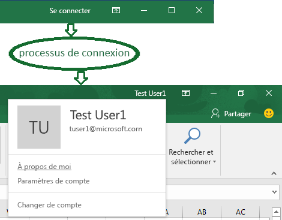
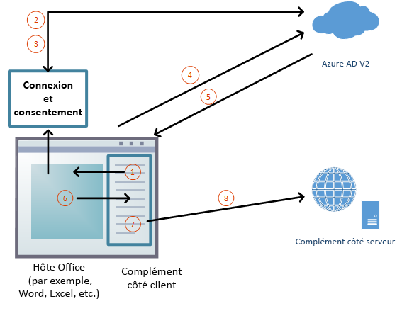

# <a name="enable-single-sign-on-for-office-add-ins-preview"></a>Activer l’authentification unique pour des compléments Office (préversion)

Les utilisateurs se connectent à Office (plateformes en ligne, mobiles et de bureau) à l’aide de leur compte Microsoft personnel ou de leur compte professionnel ou scolaire (Office 365). Vous pouvez profiter de cette fonctionnalité et utiliser l’authentification unique (SSO) pour autoriser l’utilisateur à accéder à votre complément sans qu’il ne soit obligé de se connecter une seconde fois.



### <a name="preview-status"></a>État de la préversion

L’API d'authentification unique est actuellement prise en charge uniquement en préversion. Elle est disponible aux fins d'expérimentation pour les développeurs ; mais elle ne doit pas être utilisée dans un complément de production. En outre, les compléments qui utilisent l’authentification unique ne sont pas acceptés dans [AppSource](https://appsource.microsoft.com).

Certaines applications Office ne prennent pas en charge la préversion de l’authentification unique. Elle est disponible dans Word, Excel, Outlook et PowerPoint. Pour plus d’informations sur les applications qui prennent en charge actuellement l’API d’authentification unique, consultez la rubrique [Ensembles de conditions requises pour l’API d’identification](https://docs.microsoft.com/javascript/office/requirement-sets/identity-api-requirement-sets?view=office-js).

### <a name="requirements-and-best-practices"></a>Configuration requise et meilleures pratiques

Pour utiliser l’authentification unique, vous devez charger la version bêta de la bibliothèque JavaScript de Office à partir de `https://appsforoffice.microsoft.com/lib/beta/hosted/office.js` au niveau de la page de démarrage HTML du complément.

Si vous utilisez un complément **Outlook**, veillez à activer l’authentification moderne pour la location d’Office 365. Pour plus d’informations sur la manière de procéder, consultez la rubrique [Exchange Online : Activation de votre client pour l’authentification moderne](https://social.technet.microsoft.com/wiki/contents/articles/32711.exchange-online-how-to-enable-your-tenant-for-modern-authentication.aspx).

Vous ne devez *pas* utiliser l’authentification unique comme seule méthode d’authentification pour votre complément. Vous devez implémenter un système d’authentification alternatif que votre complément peut utiliser dans certaines situations d’erreur. Vous pouvez utiliser un système de tables de l’utilisateur et d’authentification, ou vous pouvez tirer parti d’un des fournisseurs de connexion de mise en réseau. Pour plus d’informations sur comment procéder avec un complément Office, voir [Autoriser les services externes dans votre complément Office](https://docs.microsoft.com/en-us/office/dev/add-ins/develop/auth-external-add-ins). Pour *Outlook*, il existe un système alternatif recommandé. Pour plus d’informations, reportez-vous à [Scénario : Implémenter l’authentification unique sur votre service dans un complément Outlook](https://docs.microsoft.com/outlook/add-ins/implement-sso-in-outlook-add-in).

### <a name="how-sso-works-at-runtime"></a>Fonctionnement de l’authentification unique au moment de l’exécution

Le diagramme suivant illustre le mode de fonctionnement du processus d’authentification unique.



1. Dans le complément, JavaScript appelle une nouvelle API Office.js [getAccessTokenAsync](#sso-api-reference). Cela indique à l’application hôte Office qu’elle doit obtenir un jeton d’accès au complément. Voir [Exemple de token](#example-access-token).
2. Si l’utilisateur n’est pas connecté, l’application hôte Office ouvre une fenêtre contextuelle pour que l’utilisateur se connecte.
3. Si c’est la première fois que l’utilisateur utilise votre complément, il est invité à donner son consentement.
4. L’application hôte Office demande le **jeton de complément** au point de terminaison Azure AD v2.0 pour l’utilisateur actuel.
5. Azure AD envoie le jeton de complément à l’application hôte Office.
6. L’application hôte Office envoie le **jeton de complément** au complément dans le cadre de l’objet de résultat renvoyé par l’appel `getAccessTokenAsync`.
7. Dans le complément, JavaScript peut analyser le jeton et extraire les informations dont il a besoin, telles que l'adresse e-mail de l'utilisateur. 
8. Optionnellement, le complément peut envoyer une requête HTTP à son serveur pour obtenir plus de données sur l'utilisateur, notamment les préférences de l'utilisateur. Alternativement, le jeton d'accès lui-même pourrait être envoyé au serveur pour analyse et validation. 

## <a name="develop-an-sso-add-in"></a>Développer un complément d’authentification unique

Cette section décrit les tâches que nécessite la création d’un complément Office qui utilise l’authentification unique. Ces tâches sont décrites ici indépendamment du langage et de l’infrastructure. Pour obtenir des exemples de procédures pas-à-pas détaillées, consultez les rubriques suivantes :

* [Créer un complément Office Node.js qui utilise l’authentification unique](create-sso-office-add-ins-nodejs.md)
* [Créer un complément Office ASP.NET qui utilise l’authentification unique](create-sso-office-add-ins-aspnet.md)

### <a name="create-the-service-application"></a>Créer l’application de service

Enregistrer le complément sur le portail d’inscription pour le point de terminaison Azure v2.0 : https://apps.dev.microsoft.com. Il s’agit d’un processus de 5 à 10 minutes qui inclut les tâches suivantes :

* Obtenez un ID de client et un code secret pour le complément.
* Spécifiez les autorisations dont votre complément a besoin pour AAD v. Endpoint 2.0 (et éventuellement Microsoft Graph). L'autorisation de "profil" est toujours nécessaire.
* Accordez la confiance de l’application hôte Office au complément.
* Pré-autorisez l’application hôte Office pour le complément avec l’autorisation par défaut *access_as_user*.

Pour plus de détails sur ce processus, voir [Enregistrer un complément Office qui utilise l'authentification unique auprès du point de terminaison Azure AD v2.0](register-sso-add-in-aad-v2.md).

### <a name="configure-the-add-in"></a>Configurez le complément

Ajoutez un nouveau balisage au manifeste du complément :

* **WebApplicationInfo** : parent des éléments suivants.
* **Id** - ID du client du complément : il  s'agit d'un ID d'application que vous obtenez lors de l'enregistrement du complément. Voir [Enregistrer un complément Office qui utilise l'authentification unique (SSO) avec le point de terminaison AD v2.0](register-sso-add-in-aad-v2.md).
* **Resource** : URL du complément.
* **Scopes** : parent d’un ou plusieurs éléments **Scope**.
* **Scope** - Spécifie une autorisation dont le complément a besoin pour AAD. L' `profile` autorisation est toujours nécessaire et il peut s'agir de la seule autorisation nécessaire si votre complément n'accède pas à Microsoft Graph. Si c'est le cas, vous avez également besoin des éléments d'une **étendue**pour obtenir les autorisations Microsoft Graph requises; par exemple, `User.Read`, `Mail.Read`. Les bibliothèques que vous utilisez dans votre code pour accéder à Microsoft Graph peuvent avoir besoin d'autorisations supplémentaires. Par exemple, Microsoft Authentication Library (MSAL) pour .NET nécessite `offline_access` une autorisation. Pour plus d'informations, voir [Autoriser Microsoft Graph à partir d'un complément Office](authorize-to-microsoft-graph.md).

Pour les hôtes Office autres qu’Outlook, ajoutez le balisage à la fin de la section `<VersionOverrides ... xsi:type="VersionOverridesV1_0">`. Pour Outlook, ajoutez le balisage à la fin de la section `<VersionOverrides ... xsi:type="VersionOverridesV1_1">`.

Voici un exemple de balise :

```xml
<WebApplicationInfo>
    <Id>5661fed9-f33d-4e95-b6cf-624a34a2f51d</Id>
    <Resource>api://addin.contoso.com/5661fed9-f33d-4e95-b6cf-624a34a2f51d</Resource>
    <Scopes>
        <Scope>user.read</Scope>
        <Scope>files.read</Scope>
        <Scope>profile</Scope>
    </Scopes>
</WebApplicationInfo>
```

### <a name="add-client-side-code"></a>Ajouter du code côté client

Ajoutez un code JavaScript pour le complément à :

* Appelez [getAccessTokenAsync](https://docs.microsoft.com/office/dev/add-ins/develop/sso-in-office-add-ins#sso-api-reference).

* Analyser le jeton ou le transmettre au code côté serveur du complément. 

Voici un exemple simple d'un appel à `getAccessTokenAsync`. 

> [!NOTE]
> Cet exemple ne présente explicitement qu'un seul type d'erreur. Pour avoir des exemples de traitement des erreurs plus élaborés, voir [Home.js in Office-Add-in-ASPNET-SSO](https://github.com/OfficeDev/Office-Add-in-ASPNET-SSO/blob/master/Complete/Office-Add-in-ASPNET-SSO-WebAPI/Scripts/Home.js) et [program.js in Office-Add-in-NodeJS-SSO](https://github.com/OfficeDev/Office-Add-in-NodeJS-SSO/blob/master/Completed/public/program.js). Voir également [Résolution des problèmes de messages d’erreur pour l’authentification unique (SSO)](troubleshoot-sso-in-office-add-ins.md).
 

```js
Office.context.auth.getAccessTokenAsync(function (result) {
    if (result.status === "succeeded") {
        // Use this token to call Web API
        var ssoToken = result.value;
        ...
    } else {
        if (result.error.code === 13003) {
            // SSO is not supported for domain user accounts, only
            // work or school (Office 365) or Microsoft Account IDs.
        } else {
            // Handle error
        }
    }
});
```

Voici un exemple simple d’un passage de jeton du complément vers le serveur. Le token est inclus en tant qu' `Authorization` en-tête lors de l'envoi d'une demande au serveur. Dans cet exemple, l'envoi de données JSON se fait en utilisant la méthode `POST`, mais `GET` est suffisant pour envoyer le jeton d'accès lorsque vous n'écrivez pas sur le serveur.

```js
$.ajax({
    type: "POST",
    url: "/api/DoSomething",
    headers: {
        "Authorization": "Bearer " + ssoToken
    },
    data: { /* some JSON payload */ },
    contentType: "application/json; charset=utf-8"
}).done(function (data) {
    // Handle success
}).fail(function (error) {
    // Handle error
}).always(function () {
    // Cleanup
});
```

#### <a name="when-to-call-the-method"></a>Quand appeler la méthode

Si votre complément ne peut pas être utilisé lorsqu'aucun utilisateur n’est connecté à Office, vous devez appeler `getAccessTokenAsync` *au lancement du complément*.

Si le complément possède certaines fonctionnalités qui ne nécessitent pas d’utilisateur connecté, appelez `getAccessTokenAsync` *lorsque l’utilisateur effectue une action qui requiert un utilisateur connecté*. Les appels répétés à `getAccessTokenAsync` ne causent aucune détérioration importante des performances, car Office met en cache le jeton d’accès et le réutilise jusqu'à ce qu’il arrive à expiration, sans effectuer un autre appel à l’AAD v. 2.0 dès que `getAccessTokenAsync` est appelé. Ainsi, vous pouvez ajouter des appels de `getAccessTokenAsync` à l’ensemble des fonctions et gestionnaires qui lancent une action dans laquelle le jeton est nécessaire.

### <a name="add-server-side-code"></a>Ajouter du code côté serveur

Dans la plupart des scénarios, il n’est pas vraiment utile d’obtenir le jeton d’accès si votre complément ne le transmet pas côté serveur et ne l’utilise pas à cet emplacement. Quelques tâches côté serveur que votre complément pourrait faire :

* Créer une ou plusieurs méthodes d'API Web qui utilisent des informations sur l'utilisateur qui sont extraites du jeton ; par exemple, une méthode qui recherche les préférences de l'utilisateur dans votre base de données hébergée. (Voir **Utilisation du jeton SSO en tant qu'identité** ci-dessous). En fonction de votre langue et de votre structure, des bibliothèques peuvent être disponibles pour simplifier le code que vous devez écrire.
* Obtenir des données Microsoft Graph. Votre code côté serveur doit effectuer les opérations suivantes :

    * Valider le token (voir **Valider le token** ci-dessous).
    * Démarrer le flux « de la part de » avec un appel du point de terminaison Azure AD v2.0 qui inclut le jeton d’accès du complément, certaines métadonnées relatives à l’utilisateur et les informations d’identification du complément (ID et code secret). Dans ce contexte, le token est appelé token de démarrage.
    * Mettre en cache le nouveau jeton renvoyé par le flux intermédiaire.
    * Obtenir des données à partir de Microsoft Graph en utilisant le nouveau jeton.

 Pour plus de détails sur l'obtention d'un accès autorisé aux données Microsoft Graph de l'utilisateur, voir [Autoriser Microsoft Graph dans votre complément Office](authorize-to-microsoft-graph.md).

#### <a name="validate-the-access-token"></a>Valider le jeton d’accès

Quand l’API web reçoit le jeton d’accès, elle doit valider son fonctionnement avant de l’utiliser. Le jeton est un jeton JWT (JSON Web Tokan). En d’autres termes, la validation se déroule comme dans la plupart des flux OAuth standard. Il existe un certain nombre de bibliothèques pouvant gérer la validation JWT qui sont toutes, au minimum, chargées de :

- vérifier que le jeton est bien formé ;
- vérifier que le jeton a été émis par l’autorité souhaitée ;
- vérifier que le jeton est destiné à l’API web.

Suivez les recommandations suivantes quand vous validez le jeton :

- Les jetons SSO valides doivent être émis par l’autorité Azure `https://login.microsoftonline.com`. La revendication `iss` dans le jeton doit commencer par cette valeur.
- Le paramètre `aud` du jeton devra correspondre à l’ID d’application de l’enregistrement du complément.
- Le paramètre `scp` du jeton devra correspondre à `access_as_user`.

#### <a name="using-the-sso-token-as-an-identity"></a>Utilisation du jeton SSO comme identité

Si votre complément doit vérifier l’identité de l’utilisateur, le jeton SSO contient des informations utiles pour établir son identité. Les lignes suivantes présentes dans le jeton concernent l’identité de l’utilisateur.

- `name` - Le nom de l’utilisateur.
- `preferred_username` -  L'adresse e-mail de l'utilisateur.
- `oid` - Un GUID représentant l’ID de l’utilisateur dans Azure Active Directory.
- `tid` - Un GUID représentant l'ID de l'organisation de l'utilisateur dans Azure Active Directory.

Étant donné que les valeurs `name` et `preferred_username` peuvent être amenées à changer, nous vous recommandons d’utiliser les valeurs `oid` et `tid` pour corréler l’identité de l’utilisateur avec le service d’autorisation de votre API principale.

Par exemple, votre service peut mettre en forme ces valeurs de la façon suivante `{oid-value}@{tid-value}`, puis stocker cette mise en forme sous forme de valeur dans l’enregistrement de l’utilisateur dans votre base de données utilisateur interne. Puis à l'aide de requêtes ultérieures, l’utilisateur pourra être récupéré grâce à cette valeur et l’accès à certaines ressources pourra être déterminé selon les mécanismes de contrôle d’accès existants.

### <a name="example-access-token"></a>Exemple de jeton

Voici une charge utile décodée typique de jeton. Pour plus d'informations sur les propriétés, voir [Référence des jetons Azure Active Directory v2.0](https://docs.microsoft.com/azure/active-directory/develop/active-directory-v2-tokens).


```js
{
    aud: "2c3caa80-93f9-425e-8b85-0745f50c0d24",         
    iss: "https://login.microsoftonline.com/fec4f964-8bc9-4fac-b972-1c1da35adbcd/v2.0",         
    iat: 1521143967,         
    nbf: 1521143967,         
    exp: 1521147867,         
    aio: "ATQAy/8GAAAA0agfnU4DTJUlEqGLisMtBk5q6z+6DB+sgiRjB/Ni73q83y0B86yBHU/WFJnlMQJ8",         
    azp: "e4590ed6-62b3-5102-beff-bad2292ab01c",         
    azpacr: "0",         
    e_exp: 262800,         
    name: "Mila Nikolova",         
    oid: "6467882c-fdfd-4354-a1ed-4e13f064be25",         
    preferred_username: "milan@contoso.com",         
    scp: "access_as_user",         
    sub: "XkjgWjdmaZ-_xDmhgN1BMP2vL2YOfeVxfPT_o8GRWaw",         
    tid: "fec4f964-8bc9-4fac-b972-1c1da35adbcd",         
    uti: "MICAQyhrH02ov54bCtIDAA",         
    ver: "2.0"
}
```

## <a name="using-sso-with-an-outlook-add-in"></a>Utilisation de l'authentification unique (SSO) avec un complément Outlook

Il existe quelques différences mineures, mais importantes, en ce qui concerne l'utilisation de la connexion unique SSO dans et comme complément Outlook comparé à son utilisation comme complément Excel, PowerPoint ou Word. Assurez-vous de lire [Authentifier un utilisateur avec un jeton unique logé dans le complément Outlook](https://docs.microsoft.com/outlook/add-ins/authenticate-a-user-with-an-sso-token) et l' [étude de cas : Implémenter la connexion unique à votre service dans un complément Outlook](https://docs.microsoft.com/outlook/add-ins/implement-sso-in-outlook-add-in).

## <a name="sso-api-reference"></a>Référence de l’API de l’authentification unique

### <a name="getaccesstokenasync"></a>getAccessTokenAsync

L’espace de noms Office Auth, `Office.context.auth`, fournit une méthode, `getAccessTokenAsync` qui permet à l’hôte Office d'obtenir un jeton d’accès à l’application web du module complémentaire. Indirectement, cela permet également au module complémentaire d'accéder aux données Microsoft Graph de l'utilisateur connecté sans qu'il ait à se connecter une seconde fois.

```typescript
getAccessTokenAsync(options?: AuthOptions, callback?: (result: AsyncResult<string>) => void): void;
```

La méthode appelle le point de terminaison Azure Active Directory V 2.0 pour obtenir un jeton d'accès à l'application Web de votre complément. Cela permet aux compléments d’identifier les utilisateurs. Le Code côté serveur peut utiliser ce jeton pour accéder à Microsoft Graph pour l’application web du complément à l’aide du [flux OAuth intermédiaire](https://docs.microsoft.com/azure/active-directory/develop/active-directory-v2-protocols-oauth-on-behalf-of).

> [!NOTE]
> Dans Outlook, cette API n'est pas prise en charge si le complément est chargé dans une boîte aux lettres Outlook.com ou Gmail.

<table><tr><td>Hôtes</td><td>Excel, OneNote, Outlook, PowerPoint, Word</td></tr>

 <tr><td>Ensembles de conditions requises</td><td>[IdentityAPI](https://docs.microsoft.com/office/dev/add-ins/develop/specify-office-hosts-and-api-requirements)</td></tr></table>

#### <a name="parameters"></a>Paramètres

`options` - Facultatif. Accepte un objet `AuthOptions` (voir ci-dessous) pour définir les comportements de connexion.

`callback` - Facultatif. Accepte une méthode de rappel qui peut analyser le jeton pour l’ID d’utilisateur ou utiliser le jeton dans le flux « de la part de » pour accéder à Microsoft Graph. Si [AsyncResult](https://docs.microsoft.com/javascript/api/office/office.asyncresult)`.status`  est « réussi », alors `AsyncResult.value` est l'AAD v brut. Jeton d'accès au format 2.0.

L' `AuthOptions` interface fournit des options pour l'expérience utilisateur, lorsque Office obtient un jeton d'accès au complément d'AAD v. 2.0 avec la méthode `getAccessTokenAsync` .

```typescript
interface AuthOptions {
    /**
        * Causes Office to display the add-in consent experience. Useful if the add-in's Azure permissions have changed or if the user's consent has 
        * been revoked.
        */
    forceConsent?: boolean,
    /**
        * Prompts the user to add their Office account (or to switch to it, if it is already added).
        */
    forceAddAccount?: boolean,
    /**
        * Causes Office to prompt the user to provide the additional factor when the tenancy being targeted by Microsoft Graph requires multifactor 
        * authentication. The string value identifies the type of additional factor that is required. In most cases, you won't know at development 
        * time whether the user's tenant requires an additional factor or what the string should be. So this option would be used in a "second try" 
        * call of getAccessTokenAsync after Microsoft Graph has sent an error requesting the additional factor and containing the string that should 
        * be used with the authChallenge option.
        */
    authChallenge?: string
    /**
        * A user-defined item of any type that is returned, unchanged, in the asyncContext property of the AsyncResult object that is passed to a callback.
        */
    asyncContext?: any
}
```


