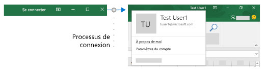

# <a name="enable-single-sign-on-for-office-add-ins-preview"></a>Activer l’authentification unique pour des compléments Office (aperçu)

Les utilisateurs se connectent à Office (plateformes en ligne, mobiles ou de bureau) à l’aide de leur compte Microsoft personnel ou de leur compte professionnel ou Microsoft 365 Éducation. Vous pouvez en tirer parti et utiliser l’authentification unique (SSO) pour autoriser l’utilisateur à accéder à votre complément sans qu’il doive se connecter une deuxième fois.



## <a name="preview-status"></a>État de Prévisualisation

L’API de l’authentification unique est actuellement prise en charge uniquement en prévisualisation. Elle est disponible pour les développeurs à des fins d’expérimentation ; mais elle ne doit pas être utilisée dans un complément de production. Par ailleurs, les compléments qui utilisent l’authentification unique SSO ne sont pas acceptés dans [AppSource](https://appsource.microsoft.com).

L’authentification unique (SSO) nécessite un abonnement Microsoft 365. Vous devez utiliser la version et le build mensuels les plus récents du canal du programme Insider. Vous devez participer au programme Office Insider pour obtenir cette version. Pour plus d’informations, reportez-vous à [Participez au programme Office Insider](https://insider.office.com). Veuillez noter que lorsqu’un build passe au canal semi-annuel de production, la prise en charge des fonctionnalités d’aperçu, y compris l’authentification unique, est désactivée pour ce build.

Toutes les applications Office ne prennent pas en charge la prévisualisation de l’authentification unique (SSO). Elle est disponible dans Word, Excel, Outlook et PowerPoint. Pour plus d’informations sur l’endroit où l’API d’authentification unique est actuellement prise en charge, consultez la rubrique [Ensembles de conditions requises de l’API d’identité](../reference/requirement-sets/identity-api-requirement-sets.md).

## <a name="requirements-and-best-practices"></a>Meilleures Pratiques et Conditions Requises

> [!NOTE]
> [!INCLUDE [Information about using preview APIs](../includes/using-preview-apis.md)]

Si vous travaillez avec un complément **Outlook**, assurez-vous d'activer l'authentification moderne pour la location de Microsoft 365. Pour plus d’informations sur la manière de procéder, consultez la rubrique [Exchange Online : Activation de votre client pour l’authentification moderne](https://social.technet.microsoft.com/wiki/contents/articles/32711.exchange-online-how-to-enable-your-tenant-for-modern-authentication.aspx).

Vous ne devez*pas* dépendre de l’authentification unique SSO comme seule méthode de votre complément d’authentification. Vous devez implémenter un système d’authentification secondaire vers lequel votre complément peut revenir dans certaines situations d’erreur. Vous pouvez utiliser un système de tableaux d’utilisateur et d’authentification, ou vous pouvez tirer parti d’un des fournisseurs de connexion sociale. Pour plus d’informations sur la procédure à suivre avec un complément Office, voir[Services externes autorisées dans votre complément Office](auth-external-add-ins.md). Concernant*Outlook*, il existe un système de secours recommandé. Pour plus d’informations, voir[Scénario : Implémenter l’authentification unique sur votre service dans un complément Outlook](../outlook/implement-sso-in-outlook-add-in.md). Pour consulter des exemples d’utilisation d’Azure Active Directory comme système de secours, voir [SSO NodeJS pour complément Office](https://github.com/OfficeDev/Office-Add-in-NodeJS-SSO) et [SSO ASP.NET pour complément Office](https://github.com/OfficeDev/Office-Add-in-ASPNET-SSO).

## <a name="how-sso-works-at-runtime"></a>Mode de fonctionnement de l’authentification unique SSO en cours d’exécution

Le diagramme suivant illustre le mode de fonctionnement du processus d’authentification unique SSO.


1. Dans le complément, JavaScript appelle une nouvelle API Office.js [getAccessToken](/javascript/api/office-runtime/officeruntime.auth#getaccesstoken-options-). Cela indique à l’application hôte Office qu’elle doit obtenir un jeton d’accès au complément. Voir [Exemple de token](#example-access-token).
2. Si l’utilisateur n’est pas connecté, l’application hôte Office ouvre une fenêtre contextuelle pour que l’utilisateur se connecte.
3. Si c’est la première fois que l’utilisateur actuel utilise votre complément, il est invité à donner son consentement.
4. L’application hôte Office demande le **jeton de complément** au point de terminaison Azure AD v2.0 pour l’utilisateur actuel.
5. Azure AD envoie le jeton de complément à l’application hôte Office.
6. L’application hôte Office envoie le**jeton de complément (token)** au complément dans le cadre de l’objet de résultat renvoyé par l’appel`getAccessToken`.
7. Dans le compl?ment, JavaScript peut analyser le token et extraire les informations dont il a besoin, telles que l'adresse e-mail de l'utilisateur.
8. Optionnellement, le compl?ment peut envoyer une requ?te HTTP ? son serveur pour obtenir plus de donn?es sur l'utilisateur, notamment les pr?f?rences de l'utilisateur. Alternativement, le token lui-m?me pourrait ?tre envoy? au serveur pour analyse et validation.

## <a name="develop-an-sso-add-in"></a>Développer un complément d’authentification unique SSO

Cette section décrit les tâches impliquées dans la création d’un complément Office qui utilise l’authentification unique. Ces tâches sont décrites ici indépendamment du langage et de l’infrastructure. Pour consulter des procédures pas à pas détaillées, voir :

* [Créer un complément Office Node.js qui utilise l’authentification unique](create-sso-office-add-ins-nodejs.md)
* [Créer un complément Office ASP.NET qui utilise l’authentification unique](create-sso-office-add-ins-aspnet.md)

> [!NOTE]
> Vous pouvez utiliser le générateur Yeoman pour créer votre complément Office compatible avec l’authentification unique, Node.js.. Le générateur Yeoman simplifie le processus de création d’un complément avec authentification unique en automatisant les étapes nécessaires pour configurer l’authentification unique dans Azure et la génération du code nécessaire pour qu’un complément utilise l’authentification unique. Pour plus d'informations, consultez [Démarrage rapide de l'authentification unique](../quickstarts/sso-quickstart.md).

### <a name="create-the-service-application"></a>Créer l’application de service

Enregistrer le complément auprès du portail d’inscription pour le point de terminaison Azure v2.0. Il s’agit d’un processus de 5 à 10 minutes qui inclut les tâches suivantes :

* Obtenez un ID client et un code secret pour le complément.
* Spécifiez les autorisations dont votre complément a besoin pour AAD v.  Point de terminaison 2.0 (et ?ventuellement Microsoft Graph). L'autorisation "profil" est toujours n?cessaire.
* Accordez la confiance de l’application hôte Office au complément.
* Pré-autorisez l’application hôte Office pour le complément avec l’autorisation par défaut*access_as_user*.

Pour plus de d?tails sur ce processus, voir [Enregistrer un compl?ment Office qui utilise l'authentification unique aupr?s du point de terminaison Azure AD v2.0](register-sso-add-in-aad-v2.md).

### <a name="configure-the-add-in"></a>Configurer le complément

Ajoutez un nouveau balisage au manifeste du complément :

* **WebApplicationInfo**: le parent des éléments suivants.
* **Id** - ID du client du compl?ment : il  s'agit d'un ID d'application que vous obtenez lors de l'enregistrement du compl?ment. Voir[Enregistrer un complément Office utilisant une SSO (authentification unique) avec le point de terminaison Azure AD v2.0](register-sso-add-in-aad-v2.md).
* **Ressource**: l’URL du complément. Il s’agit du même URI (y compris le protocole`api:`) que vous avez utilisé lors de l’inscription du complément dans AAD. Le domaine et les sous-domaines doivent être les mêmes que ceux utilisés dans les URLs dans la section`<Resources>` du manifeste du complément.
* **Scopes**: le parent d’un ou plusieurs éléments **Scope**.
* **Scope**: spécifie une autorisation nécessaire pour le complément dans l’AAD. L' `profile` autorisation est toujours n?cessaire et il peut s'agir de la seule autorisation n?cessaire si votre compl?ment n'acc?de pas ? Microsoft Graph. Si c'est le cas, vous avez ?galement besoin des ?l?ments d'une **?tendue**pour obtenir les autorisations Microsoft Graph requises; par exemple, `User.Read`, `Mail.Read`. Les biblioth?ques que vous utilisez dans votre code pour acc?der ? Microsoft Graph peuvent avoir des besoin d'autorisations suppl?mentaires. Par exemple, Microsoft Authentication Library (MSAL) pour .NET n?cessite `offline_access` une autorisation. Pour plus d'informations, voir [Autoriser Microsoft Graph ? partir d'un compl?ment Office](authorize-to-microsoft-graph.md).

Pour les hôtes Office autres qu’Outlook, ajoutez le balisage à la fin de la section `<VersionOverrides ... xsi:type="VersionOverridesV1_0">`. Pour Outlook, ajoutez le balisage à la fin de la section `<VersionOverrides ... xsi:type="VersionOverridesV1_1">`.

Voici un exemple de marques de révision :

```xml
<WebApplicationInfo>
    <Id>5661fed9-f33d-4e95-b6cf-624a34a2f51d</Id>
    <Resource>api://addin.contoso.com/5661fed9-f33d-4e95-b6cf-624a34a2f51d</Resource>
    <Scopes>
        <Scope>user.read</Scope>
        <Scope>files.read</Scope>
        <Scope>profile</Scope>
    </Scopes>
</WebApplicationInfo>
```

### <a name="add-client-side-code"></a>Ajouter du code côté client

Ajoutez un code JavaScript pour le complément à :

* Appelez [getAccessToken](/javascript/api/office-runtime/officeruntime.auth#getaccesstoken-options-).

* Analyser le jeton d’accès ou le transmettre au code côté serveur du complément.

Voici un exemple simple d’un appel à`getAccessToken`.

> [!NOTE]
> Cet exemple ne pr?sente explicitement qu'un seul type d'erreur. Pour des exemples de traitement des erreurs plus élaborés, voir [SSO NodeJS pour complément Office](https://github.com/OfficeDev/Office-Add-in-NodeJS-SSO) et [SSO ASP.NET pour complément Office](https://github.com/OfficeDev/Office-Add-in-ASPNET-SSO).


```js
async function getGraphData() {
    try {
        let bootstrapToken = await OfficeRuntime.auth.getAccessToken({ allowSignInPrompt: true, forMSGraphAccess: true });

        // The /api/values controller will make the token exchange and use the
        // access token it gets back to make the call to MS Graph.
        getData("/api/DoSomething", bootstrapToken);
    }
    catch (exception) {
        if (exception.code === 13003) {
            // SSO is not supported for domain user accounts, only
            // work or school (Microsoft 365) or Microsoft Account IDs.
        } else {
            // Handle error
        }
    }
}
```

Voici un exemple simple d?un passage de token du compl?ment vers le serveur. Le token est inclus en tant qu' `Authorization` en-t?te lors de l'envoi d'une demande au serveur. Dans cet exemple, l'envoi de donn?es JSON se fait en utilisant la m?thode `POST`, mais `GET` est suffisant pour envoyer le token d'acc?s lorsque vous n'?crivez pas sur le serveur.

```js
$.ajax({
    type: "POST",
    url: "/api/DoSomething",
    headers: {
        "Authorization": "Bearer " + bootstrapToken
    },
    data: { /* some JSON payload */ },
    contentType: "application/json; charset=utf-8"
}).done(function (data) {
    // Handle success
}).fail(function (error) {
    // Handle error
}).always(function () {
    // Cleanup
});
```

#### <a name="when-to-call-the-method"></a>Quand appeler la méthode

Si votre complément ne peut pas être utilisé lorsqu’aucun utilisateur n’est connecté à Office, vous devez alors appeler`getAccessToken` * au lancement du complément* et passer `allowSignInPrompt: true` dans le paramètre `options` de `getAccessToken`.

Si le complément possède certaines fonctionnalités qui ne nécessitent pas un accès à l’utilisateur, ensuite appelez`getAccessToken`* lorsque l’utilisateur effectue une action qui requiert un utilisateur connecté*. Les appels répétés à `getAccessToken` ne causent aucune dégradation importante des performances, car Office met en cache le jeton d’amorçage et le réutilise jusqu'à ce qu’il arrive à expiration, sans effectuer un autre appel vers l’AAD v. Point de terminaison 2.0 dès que `getAccessToken` est appelé. Ainsi, vous pouvez ajouter des appels de `getAccessToken` à l’ensemble des fonctions et gestionnaires qui lancent une action dans laquelle le jeton est nécessaire.

### <a name="add-server-side-code"></a>Ajouter du code côté serveur

Dans la plupart des scénarios, il n’est pas vraiment utile d’obtenir le jeton d’accès si votre complément ne le transmet pas côté serveur et ne l’utilise pas à cet emplacement. Quelques t?ches c?t? serveur que votre compl?ment pourrait faire :

* Cr?er d'une ou plusieurs m?thodes d'API Web qui utilisent des informations sur l'utilisateur qui sont extraitent du token ; par exemple, une m?thode qui recherche les pr?f?rences de l'utilisateur dans votre base de donn?es h?berg?e. (Voir **Utilisation du token SSO en tant qu'identit?** ci-dessous). En fonction de votre langue et de votre structure, des biblioth?ques peuvent ?tre disponibles pour simplifier le code que vous devez ?crire.
* Obtenir des donn?es Microsoft Graph. Votre code côté serveur doit effectuer les opérations suivantes :

    * Démarrer le flux « de la part de » avec un appel du point de terminaison Azure AD v2.0 qui inclut le jeton d’accès du complément, certaines métadonnées relatives à l’utilisateur et les informations d’identification du complément (ID et code secret). Dans ce contexte, le jeton d’accès est appelé le jeton bootstrap.
    * Obtenir des données à partir de Microsoft Graph en utilisant le nouveau jeton.
    * Si vous le souhaitez, avant de lancer le flux, validez le jeton d’accès (voir **Valider le jeton d’accès** ci-dessous).
    * Si vous le souhaitez, une fois l’exécution du flux on-behalf-of terminée, mettez en cache le nouveau jeton d’accès renvoyé à partir du flux de façon à ce qu’il soit réutilisé dans d’autres appels à Microsoft Graph jusqu’à son expiration.

 Pour plus de d?tails sur l'obtention d'un acc?s autoris? aux donn?es Microsoft Graph de l'utilisateur, voir [Autoriser Microsoft Graph dans votre compl?ment Office](authorize-to-microsoft-graph.md).

#### <a name="validate-the-access-token"></a>Valider le jeton d’accès

Quand l’API web reçoit le jeton d’accès, elle peut valider son fonctionnement avant de l’utiliser. Le jeton est un jeton JWT. En d’autres termes, la validation se déroule comme dans la plupart des flux OAuth standard. Il existe un certain nombre de bibliothèques pouvant gérer la validation JWT qui sont toutes, au minimum, chargées de :

- vérifier que le jeton est bien formé ;
- vérifier que le jeton a été émis par l’autorité souhaitée ;
- vérifier que le jeton est destiné à l’API web.

Suivez les recommandations suivantes quand vous validez le jeton :

- Les jetons SSO valides doivent être émis par l’autorité Azure `https://login.microsoftonline.com`. La revendication `iss` dans le jeton doit commencer par cette valeur.
- Le paramètre `aud` du jeton devra correspondre à l’ID d’application de l’enregistrement du complément.
- Le paramètre `scp` du jeton devra correspondre à `access_as_user`.

#### <a name="using-the-sso-token-as-an-identity"></a>Utilisation du jeton SSO comme identité

Si votre complément doit vérifier l’identité de l’utilisateur, le jeton SSO contient des informations utiles pour établir son identité. Les revendications suivantes présentes dans le jeton concernent l’identité de l’utilisateur.

- `name`: le nom d’affichage de l’utilisateur.
- `preferred_username`: l’adresse de messagerie de l’utilisateur.
- `oid` : un GUID représentant l’ID de l’utilisateur dans Azure Active Directory.
- `tid`: un GUID représentant l’ID de l’organisation de l’utilisateur dans Azure Active Directory.

Étant donné que les valeurs `name` et `preferred_username` peuvent être amenées à changer, nous vous recommandons d’utiliser les valeurs `oid` et `tid` pour corréler l’identité de l’utilisateur avec le service d’autorisation de votre API principale.

Par exemple, votre service peut mettre en forme ces valeurs de la façon suivante `{oid-value}@{tid-value}`, puis stocker cette mise en forme sous forme de valeur dans l’enregistrement de l’utilisateur dans votre base de données utilisateur interne. Lors des demandes ultérieures, l’utilisateur pourra être récupéré grâce à cette valeur et l’accès à certaines ressources pourra être déterminé selon les mécanismes de contrôle d’accès existants.

### <a name="example-access-token"></a>Exemple de token

Voici une charge utile d?cod?e typique de token. Pour plus d’informations sur les propriétés, voir[jetons référence (token) version 2.0 Azure Active Directory](/azure/active-directory/develop/active-directory-v2-tokens).

```js
{
    aud: "2c3caa80-93f9-425e-8b85-0745f50c0d24",
    iss: "https://login.microsoftonline.com/fec4f964-8bc9-4fac-b972-1c1da35adbcd/v2.0",
    iat: 1521143967,
    nbf: 1521143967,
    exp: 1521147867,
    aio: "ATQAy/8GAAAA0agfnU4DTJUlEqGLisMtBk5q6z+6DB+sgiRjB/Ni73q83y0B86yBHU/WFJnlMQJ8",
    azp: "e4590ed6-62b3-5102-beff-bad2292ab01c",
    azpacr: "0",
    e_exp: 262800,
    name: "Mila Nikolova",
    oid: "6467882c-fdfd-4354-a1ed-4e13f064be25",
    preferred_username: "milan@contoso.com",
    scp: "access_as_user",
    sub: "XkjgWjdmaZ-_xDmhgN1BMP2vL2YOfeVxfPT_o8GRWaw",
    tid: "fec4f964-8bc9-4fac-b972-1c1da35adbcd",
    uti: "MICAQyhrH02ov54bCtIDAA",
    ver: "2.0"
}
```

## <a name="using-sso-with-an-outlook-add-in"></a>Utilisation de l’authentification unique SSO en accompagnement d’un complément Outlook

Il existe quelques différences mineures, mais importantes, en ce qui concerne l'utilisation de la connexion unique SSO dans un complément Outlook à partir de son utilisation dans un complément Excel, PowerPoint ou Word. Assurez-vous de lire [Authentifier un utilisateur avec un token unique log? dans le compl?ment Outlook](../outlook/authenticate-a-user-with-an-sso-token.md) et l' [?tude de cas : Impl?menter la connexion unique ? votre service dans un compl?ment Outlook](../outlook/implement-sso-in-outlook-add-in.md).

## <a name="sso-api-reference"></a>RÉFÉRENCE D’API D’AUTHENTIFICATION UNIQUE SSO

### <a name="getaccesstoken"></a>getAccessToken

L'espace de nommage OfficeRuntime [Auth](/javascript/api/office-runtime/officeruntime.auth), `OfficeRuntime.Auth`, fournit une méthode `getAccessToken` qui permet à l'hôte Office d'obtenir un jeton d'accès à l'application Web du module complémentaire. Indirectement, ceci active également le complément pour accéder aux données de Microsoft Graph de l’utilisateur sans que l’utilisateur ne doive se connecter une deuxième fois.

```typescript
getAccessToken(options?: AuthOptions: (result: AsyncResult<string>) => void): void;
```

Cette méthode appelle le point de terminaison Azure Active Directory V 2.0 pour obtenir un jeton d’accès à l’application web de votre complément. Ceci permet à des compléments d’identifier les utilisateurs. Le Code côté serveur peut utiliser ce jeton pour accéder à Microsoft Graph pour l’application web du complément à l’aide du [flux OAuth « Pour le compte de »](/azure/active-directory/develop/active-directory-v2-protocols-oauth-on-behalf-of).

> [!NOTE]
> Dans Outlook, cette API n'est pas prise en charge si le complément est chargé dans une boîte aux lettres Outlook.com ou Gmail.

|Hôtes|Excel, Outlook, PowerPoint, Word|
|---|---|
|[Ensembles de conditions requises](specify-office-hosts-and-api-requirements.md)|[IdentityAPI](../reference/requirement-sets/identity-api-requirement-sets.md)|

#### <a name="parameters"></a>Paramètres

`options`: Facultatif. Accepte un objet [AuthOptions](/javascript/api/office-runtime/officeruntime.authoptions) (voir ci-dessous) pour définir les comportements d’authentification.

`callback`: Facultatif. Accepte une méthode de rappel qui peut analyser le jeton pour l’ID de l’utilisateur ou utilisez le jeton dans le flux de « de la part de » pour accéder à Microsoft Graph. Si[AsyncResult](/javascript/api/office/office.asyncresult) `.status` est « Réussi », puis`AsyncResult.value` est le AAD v brut. 2.0: le jeton d’accès mis en forme.

L’interface [AuthOptions](/javascript/api/office-runtime/officeruntime.authoptions) fournit des options pour l’expérience utilisateur quand Office reçoit un jeton d’accès pour le complément à partir d’AAD v. 2.0 avec la méthode`getAccessToken`.
