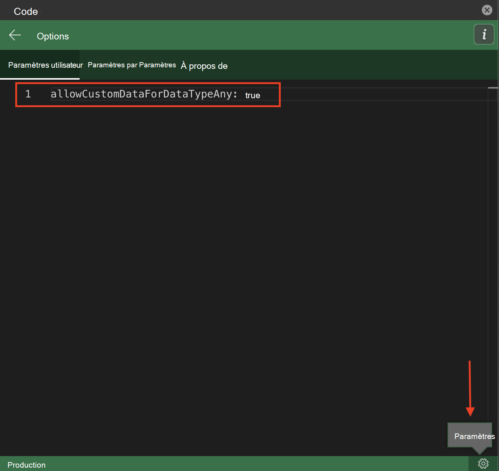

# <a name="use-data-types-with-custom-functions-in-excel-preview"></a>Utiliser des types de données avec des fonctions personnalisées dans Excel (préversion)

[!include[Custom functions and data types availability note](../includes/excel-custom-functions-data-types-note.md)]

Les types de données développent l’API JavaScript Excel pour prendre en charge les types de données au-delà des quatre types de valeurs de cellule d’origine (chaîne, nombre, booléen et erreur). Les types de données incluent la prise en charge des images Web, des valeurs numériques formatées, des valeurs d'entité et des tableaux au sein des valeurs d'entité.

Ces types de données amplifient la puissance des fonctions personnalisées, car les fonctions personnalisées acceptent les types de données comme valeurs d'entrée et de sortie. Vous pouvez générer des types de données via des fonctions personnalisées ou utiliser des types de données existants comme arguments de fonction dans les calculs. Une fois que le schéma JSON d’un type de données est définie, ce schéma est conservé tout au long des calculs.

Pour en savoir plus sur l’utilisation des types de données avec un complément Excel, consultez [Vue d’ensemble des types de données dans des compléments Excel](excel-data-types-overview.md).

## <a name="how-custom-functions-handle-data-types"></a>Comment les fonctions personnalisées gèrent les types de données

Les fonctions personnalisées peuvent reconnaître les types de données et les accepter comme valeurs de paramètre. Une fonction personnalisée peut créer un nouveau type de données pour une valeur de retour. Les fonctions personnalisées utilisent le même schéma JSON pour les types de données que l’API JavaScript Excel, et ce schéma JSON est conservé à mesure que les fonctions personnalisées calculent et évaluent.

> [!NOTE]
> Les fonctions personnalisées ne prennent pas en charge toutes les fonctionnalités des objets d’erreur améliorés offerts par les types de données. Une fonction personnalisée peut accepter un objet d’erreur de types de données, mais elle ne sera pas conservée tout au long du calcul. Pour l’instant, les fonctions personnalisées ne peuvent que supporter les erreurs incluses dans l’[objet CustomFunctions.Error](custom-functions-errors.md).

## <a name="enable-data-types-for-custom-functions"></a>Activer les types de données pour les fonctions personnalisées

Pour utiliser cette fonctionnalité, vous devez mettre à jour manuellement vos métadonnées JSON. Pour des tests plus temporaires, vous pouvez personnaliser vos paramètres de Script Lab au lieu de mettre à jour manuellement les métadonnées JSON. Les sections suivantes décrivent ces étapes plus en détail.

### <a name="manually-update-json-metadata"></a>Mettre à jour manuellement les métadonnées JSON

Les projets de fonctions personnalisées incluent un fichier de métadonnées JSON. Ce fichier de métadonnées JSON diffère du schéma JSON utilisé par les API de types de données. Pour utiliser l’intégration des types de données avec des fonctions personnalisées, le fichier de métadonnées JSON des fonctions personnalisées doit être mis à jour manuellement pour inclure la propriété `allowCustomDataForDataTypeAny`. Définissez cette propriété sur `true`.

Pour obtenir une description complète du processus de création manuelle JSON, consultez [Créer manuellement des métadonnées JSON pour des fonctions personnalisées](custom-functions-json.md). Pour plus d’informations sur cette propriété, consultez[allowCustomDataForDataTypeAny](custom-functions-json.md#allowcustomdatafordatatypeany-preview).

### <a name="script-lab-option"></a>L’option Script Lab

L’intégration des fonctions personnalisées avec les types de données est disponible pour les tests avec Script Lab, en plus de la mise à jour manuelle des métadonnées JSON décrite dans la section précédente. Pour en savoir plus sur Script Lab, consultez [Explorer l’API JavaScript Office à l’aide de Script Lab](../overview/explore-with-script-lab.md). Pour tester cette fonctionnalité avec Script Lab, mettez à jour les paramètres en suivant les étapes ci-après.

1. Ouvrez le volet des tâches **Code** Script Lab.
1. Dans le coin inférieur droit, sélectionnez le bouton **Paramètres**.
1. Accédez à l’onglet **Paramètres de l’utilisateur** et entrez`allowCustomDataForDataTypeAny: true`.



## <a name="output-a-formatted-number-value"></a>Sortie d’une valeur numérique formattée

L’exemple de code suivant montre comment créer un type de données [FormattedNumberCellValue](/javascript/api/excel/excel.formattednumbercellvalue) avec une fonction personnalisée. La fonction prend un nombre de base et un paramètre de format comme paramètres d’entrée et renvoie un type de données de valeur numérique formattée en tant que sortie.

```js
/**
 * Take a number as the input value and return a formatted number value as the output.
 * @customfunction
 * @param {number} value
 * @param {string} format (e.g. "0.00%")
 * @returns A formatted number value.
 */
function createFormattedNumber(value, format) {
    return {
        type: "FormattedNumber",
        basicValue: value,
        numberFormat: format
    }
}
```

## <a name="input-an-entity-value"></a>Saisie d’une valeur d’entité

L’exemple de code suivant montre une fonction personnalisée qui prend un type de données [EntityCellValue](/javascript/api/excel/excel.entitycellvalue) comme entrée. Si le `attribute` paramètre est définie sur`text`,puis la fonction renvoie la `text`propriété de la valeur d’entité. Sinon, la fonction renvoie la `basicValue` propriété de la valeur d’entité.

```js
/**
 * Accept an entity value data type as a function input.
 * @customfunction
 * @param {any} value
 * @param {string} attribute
 * @returns {any} The text value of the entity.
 */
function getEntityAttribute(value, attribute) {
    if (value.type == "Entity") {
        if (attribute == "text") {
            return value.text;
        } else {
            return value.properties[attribute].basicValue;
        }
    } else {
        return JSON.stringify(value);
    }
}
```

## <a name="see-also"></a>Voir aussi

* [Présentation des types de données dans les compléments Excel](excel-data-types-overview.md)
* [Concepts de base des types de données Excel](excel-data-types-concepts.md)
* [Configurer votre complément Office pour utiliser un runtime JavaScript partagé](../develop/configure-your-add-in-to-use-a-shared-runtime.md)
