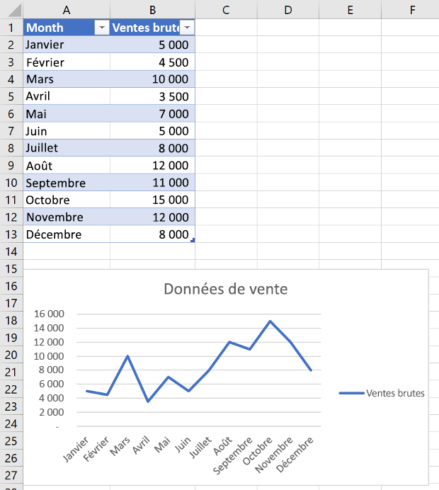
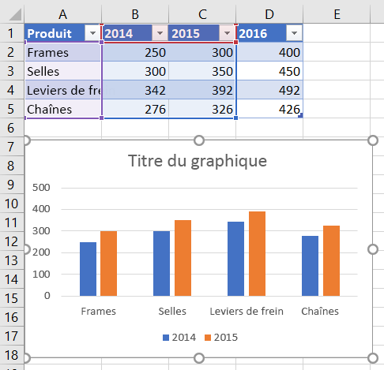
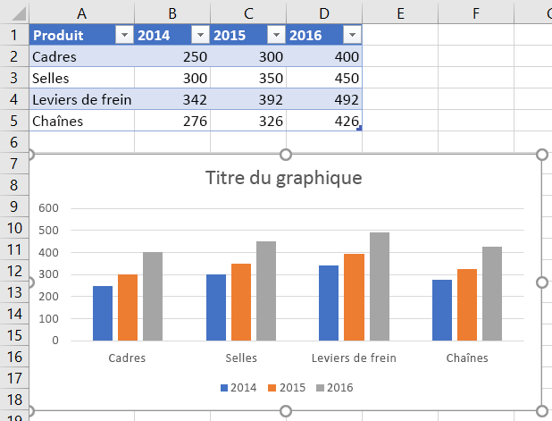
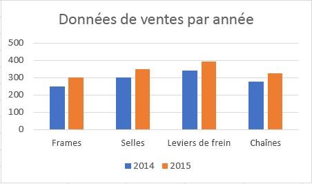
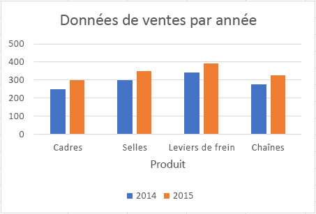
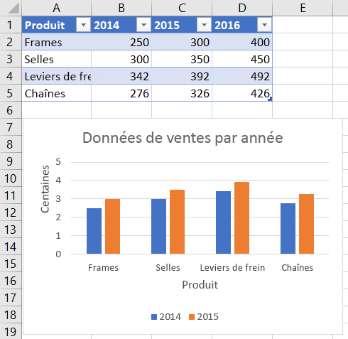
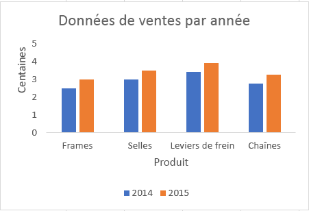
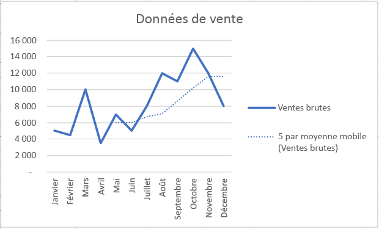
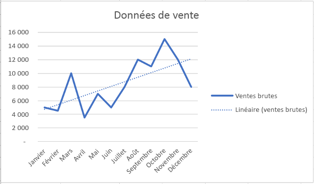

# <a name="work-with-charts-using-the-excel-javascript-api"></a><span data-ttu-id="329f0-103">Utiliser des graphiques à l’aide de l’API JavaScript pour Excel</span><span class="sxs-lookup"><span data-stu-id="329f0-103">Work with charts using the Excel JavaScript API</span></span>

<span data-ttu-id="329f0-104">Cet article fournit des exemples de code qui montrent comment effectuer des tâches courantes à l’aide de graphiques utilisant l’API JavaScript pour Excel.</span><span class="sxs-lookup"><span data-stu-id="329f0-104">This article provides code samples that show how to perform common tasks with charts using the Excel JavaScript API.</span></span>
<span data-ttu-id="329f0-105">Pour obtenir la liste complète des propriétés et des méthodes `Chart` `ChartCollection` prises en charge par les objets et, voir [Chart (interface API JavaScript pour Excel)](/javascript/api/excel/excel.chart) et [Chart collection, objet (interface API JavaScript pour Excel)](/javascript/api/excel/excel.chartcollection).</span><span class="sxs-lookup"><span data-stu-id="329f0-105">For the complete list of properties and methods that the `Chart` and `ChartCollection` objects support, see [Chart Object (JavaScript API for Excel)](/javascript/api/excel/excel.chart) and [Chart Collection Object (JavaScript API for Excel)](/javascript/api/excel/excel.chartcollection).</span></span>

## <a name="create-a-chart"></a><span data-ttu-id="329f0-106">Création d’un graphique</span><span class="sxs-lookup"><span data-stu-id="329f0-106">Create a chart</span></span>

<span data-ttu-id="329f0-p102">The following code sample creates a chart in the worksheet named **Sample**. The chart is a **Line** chart that is based upon data in the range **A1:B13**.</span><span class="sxs-lookup"><span data-stu-id="329f0-p102">The following code sample creates a chart in the worksheet named **Sample**. The chart is a **Line** chart that is based upon data in the range **A1:B13**.</span></span>

```js
Excel.run(function (context) {
    var sheet = context.workbook.worksheets.getItem("Sample");
    var dataRange = sheet.getRange("A1:B13");
    var chart = sheet.charts.add("Line", dataRange, "auto");

    chart.title.text = "Sales Data";
    chart.legend.position = "right"
    chart.legend.format.fill.setSolidColor("white");
    chart.dataLabels.format.font.size = 15;
    chart.dataLabels.format.font.color = "black";

    return context.sync();
}).catch(errorHandlerFunction);
```

<span data-ttu-id="329f0-109">**Nouveau graphique en courbes**</span><span class="sxs-lookup"><span data-stu-id="329f0-109">**New line chart**</span></span>




## <a name="add-a-data-series-to-a-chart"></a><span data-ttu-id="329f0-111">Ajouter une série de données à un graphique</span><span class="sxs-lookup"><span data-stu-id="329f0-111">Add a data series to a chart</span></span>

<span data-ttu-id="329f0-p103">The following code sample adds a data series to the first chart in the worksheet. The new data series corresponds to the column named **2016** and is based upon data in the range **D2:D5**.</span><span class="sxs-lookup"><span data-stu-id="329f0-p103">The following code sample adds a data series to the first chart in the worksheet. The new data series corresponds to the column named **2016** and is based upon data in the range **D2:D5**.</span></span>

```js
Excel.run(function (context) {
    var sheet = context.workbook.worksheets.getItem("Sample");
    var chart = sheet.charts.getItemAt(0);
    var dataRange = sheet.getRange("D2:D5");

    var newSeries = chart.series.add("2016");
    newSeries.setValues(dataRange);

    return context.sync();
}).catch(errorHandlerFunction);
```

<span data-ttu-id="329f0-114">**Graphique avant l’ajout de la série de données 2016**</span><span class="sxs-lookup"><span data-stu-id="329f0-114">**Chart before the 2016 data series is added**</span></span>



<span data-ttu-id="329f0-116">**Graphique après l’ajout de la série de données 2016**</span><span class="sxs-lookup"><span data-stu-id="329f0-116">**Chart after the 2016 data series is added**</span></span>



## <a name="set-chart-title"></a><span data-ttu-id="329f0-118">Définir le titre du graphique</span><span class="sxs-lookup"><span data-stu-id="329f0-118">Set chart title</span></span>

<span data-ttu-id="329f0-119">L’exemple de code suivant définit le titre du premier graphique dans la feuille de calcul sur **Sales Data by Year**.</span><span class="sxs-lookup"><span data-stu-id="329f0-119">The following code sample sets the title of the first chart in the worksheet to **Sales Data by Year**.</span></span>

```js
Excel.run(function (context) {
    var sheet = context.workbook.worksheets.getItem("Sample");

    var chart = sheet.charts.getItemAt(0);
    chart.title.text = "Sales Data by Year";

    return context.sync();
}).catch(errorHandlerFunction);
```

<span data-ttu-id="329f0-120">**Graphique après la définition du titre**</span><span class="sxs-lookup"><span data-stu-id="329f0-120">**Chart after title is set**</span></span>



## <a name="set-properties-of-an-axis-in-a-chart"></a><span data-ttu-id="329f0-122">Définir les propriétés d’un axe d’un graphique</span><span class="sxs-lookup"><span data-stu-id="329f0-122">Set properties of an axis in a chart</span></span>

<span data-ttu-id="329f0-p104">Les graphiques qui utilisent le [système de coordonnées cartésiennes](https://en.wikipedia.org/wiki/Cartesian_coordinate_system), comme les histogrammes, les graphiques à barres et les nuages de points, ont un axe des abscisses et un axe des ordonnées. Ces exemples montrent comment définir le titre et afficher les unités d’un axe dans un graphique.</span><span class="sxs-lookup"><span data-stu-id="329f0-p104">Charts that use the [Cartesian coordinate system](https://en.wikipedia.org/wiki/Cartesian_coordinate_system) such as column charts, bar charts, and scatter charts contain a category axis and a value axis. These examples show how to set the title and display unit of an axis in a chart.</span></span>

### <a name="set-axis-title"></a><span data-ttu-id="329f0-125">Définir le titre d’un axe</span><span class="sxs-lookup"><span data-stu-id="329f0-125">Set axis title</span></span>

<span data-ttu-id="329f0-126">L’exemple de code suivant définit le titre de l’axe des abscisses pour le premier graphique de la feuille de calcul sur **Product**.</span><span class="sxs-lookup"><span data-stu-id="329f0-126">The following code sample sets the title of the category axis for the first chart in the worksheet to **Product**.</span></span>

```js
Excel.run(function (context) {
    var sheet = context.workbook.worksheets.getItem("Sample");

    var chart = sheet.charts.getItemAt(0);
    chart.axes.categoryAxis.title.text = "Product";

    return context.sync();
}).catch(errorHandlerFunction);
```

<span data-ttu-id="329f0-127">**Graphique après la définition de l’axe des abscisses**</span><span class="sxs-lookup"><span data-stu-id="329f0-127">**Chart after title of category axis is set**</span></span>



### <a name="set-axis-display-unit"></a><span data-ttu-id="329f0-129">Définir l’unité d’affichage de l’axe</span><span class="sxs-lookup"><span data-stu-id="329f0-129">Set axis display unit</span></span>

<span data-ttu-id="329f0-130">L’exemple de code suivant définit l’unité d’affichage de l’axe des ordonnées pour le premier graphique de la feuille de calcul sur **Hundreds**.</span><span class="sxs-lookup"><span data-stu-id="329f0-130">The following code sample sets the display unit of the value axis for the first chart in the worksheet to **Hundreds**.</span></span>

```js
Excel.run(function (context) {
    var sheet = context.workbook.worksheets.getItem("Sample");

    var chart = sheet.charts.getItemAt(0);
    chart.axes.valueAxis.displayUnit = "Hundreds";

    return context.sync();
}).catch(errorHandlerFunction);
```

<span data-ttu-id="329f0-131">**Graphique après la définition de l’unité d’affichage de l’axe des ordonnées**</span><span class="sxs-lookup"><span data-stu-id="329f0-131">**Chart after display unit of value axis is set**</span></span>



## <a name="set-visibility-of-gridlines-in-a-chart"></a><span data-ttu-id="329f0-133">Définir la visibilité du quadrillage dans un graphique</span><span class="sxs-lookup"><span data-stu-id="329f0-133">Set visibility of gridlines in a chart</span></span>

<span data-ttu-id="329f0-134">L’exemple de code suivant masque le quadrillage principal de l’axe des ordonnées du premier graphique de la feuille de calcul.</span><span class="sxs-lookup"><span data-stu-id="329f0-134">The following code sample hides the major gridlines for the value axis of the first chart in the worksheet.</span></span> <span data-ttu-id="329f0-135">Vous pouvez afficher le quadrillage principal de l’axe des ordonnées du graphique, en définissant `chart.axes.valueAxis.majorGridlines.visible` sur `true` .</span><span class="sxs-lookup"><span data-stu-id="329f0-135">You can show the major gridlines for the value axis of the chart, by setting `chart.axes.valueAxis.majorGridlines.visible` to `true`.</span></span>

```js
Excel.run(function (context) {
    var sheet = context.workbook.worksheets.getItem("Sample");

    var chart = sheet.charts.getItemAt(0);
    chart.axes.valueAxis.majorGridlines.visible = false;

    return context.sync();
}).catch(errorHandlerFunction);
```

<span data-ttu-id="329f0-136">**Graphique avec du quadrillage masqué**</span><span class="sxs-lookup"><span data-stu-id="329f0-136">**Chart with gridlines hidden**</span></span>



## <a name="chart-trendlines"></a><span data-ttu-id="329f0-138">Courbes de tendance de graphiques</span><span class="sxs-lookup"><span data-stu-id="329f0-138">Chart trendlines</span></span>

### <a name="add-a-trendline"></a><span data-ttu-id="329f0-139">Ajouter une courbe de tendance</span><span class="sxs-lookup"><span data-stu-id="329f0-139">Add a trendline</span></span>

<span data-ttu-id="329f0-p106">L’exemple de code suivant ajoute une courbe de tendance de moyenne mobile à la première série du premier graphique de la feuille de calcul nommée **Sample**. La courbe de tendance affiche une moyenne mobile sur 5 périodes.</span><span class="sxs-lookup"><span data-stu-id="329f0-p106">The following code sample adds a moving average trendline to the first series in the first chart in the worksheet named **Sample**. The trendline shows a moving average over 5 periods.</span></span>

```js
Excel.run(function (context) {
    var sheet = context.workbook.worksheets.getItem("Sample");

    var chart = sheet.charts.getItemAt(0);
    var seriesCollection = chart.series;
    seriesCollection.getItemAt(0).trendlines.add("MovingAverage").movingAveragePeriod = 5;

    return context.sync();
}).catch(errorHandlerFunction);
```

<span data-ttu-id="329f0-142">**Graphique avec courbe de tendance de moyenne mobile**</span><span class="sxs-lookup"><span data-stu-id="329f0-142">**Chart with moving average trendline**</span></span>



### <a name="update-a-trendline"></a><span data-ttu-id="329f0-144">Mettre à jour une courbe de tendance</span><span class="sxs-lookup"><span data-stu-id="329f0-144">Update a trendline</span></span>

<span data-ttu-id="329f0-145">L’exemple de code suivant définit la courbe de tendance sur `Linear` le type de la première série du premier graphique de la feuille de calcul nommée **Sample**.</span><span class="sxs-lookup"><span data-stu-id="329f0-145">The following code sample sets the trendline to type `Linear` for the first series in the first chart in the worksheet named **Sample**.</span></span>

```js
Excel.run(function (context) {
    var sheet = context.workbook.worksheets.getItem("Sample");

    var chart = sheet.charts.getItemAt(0);
    var seriesCollection = chart.series;
    var series = seriesCollection.getItemAt(0);
    series.trendlines.getItem(0).type = "Linear";

    return context.sync();
}).catch(errorHandlerFunction);
```

<span data-ttu-id="329f0-146">**Graphique avec une courbe de tendance linéaire**</span><span class="sxs-lookup"><span data-stu-id="329f0-146">**Chart with linear trendline**</span></span>



## <a name="export-a-chart-as-an-image"></a><span data-ttu-id="329f0-148">Exporter un graphique sous forme d’image</span><span class="sxs-lookup"><span data-stu-id="329f0-148">Export a chart as an image</span></span>

<span data-ttu-id="329f0-149">Vous pouvez générer des graphiques sous forme d’images en dehors d’Excel.</span><span class="sxs-lookup"><span data-stu-id="329f0-149">Charts can be rendered as images outside of Excel.</span></span> <span data-ttu-id="329f0-150">`Chart.getImage` renvoie le graphique en tant que chaîne codée en Base64 représentant le graphique sous forme d’image JPEG.</span><span class="sxs-lookup"><span data-stu-id="329f0-150">`Chart.getImage` returns the chart as a base64-encoded string representing the chart as a JPEG image.</span></span> <span data-ttu-id="329f0-151">Le code suivant montre comment obtenir la chaîne de l’image et l’enregistrer dans la console.</span><span class="sxs-lookup"><span data-stu-id="329f0-151">The following code shows how to get the image string and log it to the console.</span></span>

```js
Excel.run(function (ctx) {
    var chart = ctx.workbook.worksheets.getItem("Sheet1").charts.getItem("Chart1");
    var imageAsString = chart.getImage();
    return context.sync().then(function () {
        console.log(imageAsString.value);
        // Instead of logging, your add-in may use the base64-encoded string to save the image as a file or insert it in HTML.
    });
}).catch(errorHandlerFunction);
```

<span data-ttu-id="329f0-152">`Chart.getImage` utilise trois paramètres facultatifs : largeur, hauteur et mode d’ajustement.</span><span class="sxs-lookup"><span data-stu-id="329f0-152">`Chart.getImage` takes three optional parameters: width, height, and the fitting mode.</span></span>

```typescript
getImage(width?: number, height?: number, fittingMode?: Excel.ImageFittingMode): OfficeExtension.ClientResult<string>;
```

<span data-ttu-id="329f0-153">Ces paramètres déterminent la taille de l’image.</span><span class="sxs-lookup"><span data-stu-id="329f0-153">These parameters determine the size of the image.</span></span> <span data-ttu-id="329f0-154">Les images sont toujours mises à l’échelle proportionnellement.</span><span class="sxs-lookup"><span data-stu-id="329f0-154">Images are always proportionally scaled.</span></span> <span data-ttu-id="329f0-155">Les paramètres de largeur et de hauteur appliquent des limites supérieures ou inférieures à l’image mise à l’échelle.</span><span class="sxs-lookup"><span data-stu-id="329f0-155">The width and height parameters put upper or lower bounds on the scaled image.</span></span> <span data-ttu-id="329f0-156">`ImageFittingMode` contient trois valeurs avec les comportements suivants :</span><span class="sxs-lookup"><span data-stu-id="329f0-156">`ImageFittingMode` has three values with the following behaviors:</span></span>

- <span data-ttu-id="329f0-157">`Fill`: La hauteur ou la largeur minimale de l’image est la hauteur ou la largeur spécifiée (selon la valeur atteinte en premier lors de la mise à l’échelle de l’image).</span><span class="sxs-lookup"><span data-stu-id="329f0-157">`Fill`: The image's minimum height or width is the specified height or width (whichever is reached first when scaling the image).</span></span> <span data-ttu-id="329f0-158">Il s’agit du comportement par défaut lorsqu’aucun mode d’ajustement n’est spécifié.</span><span class="sxs-lookup"><span data-stu-id="329f0-158">This is the default behavior when no fitting mode is specified.</span></span>
- <span data-ttu-id="329f0-159">`Fit`: La hauteur ou la largeur maximale de l’image est la hauteur ou la largeur spécifiée (selon la valeur atteinte en premier lors de la mise à l’échelle de l’image).</span><span class="sxs-lookup"><span data-stu-id="329f0-159">`Fit`: The image's maximum height or width is the specified height or width (whichever is reached first when scaling the image).</span></span>
- <span data-ttu-id="329f0-160">`FitAndCenter`: La hauteur ou la largeur maximale de l’image est la hauteur ou la largeur spécifiée (selon la valeur atteinte en premier lors de la mise à l’échelle de l’image).</span><span class="sxs-lookup"><span data-stu-id="329f0-160">`FitAndCenter`: The image's maximum height or width is the specified height or width (whichever is reached first when scaling the image).</span></span> <span data-ttu-id="329f0-161">L’image générée est centrée par rapport à l’autre dimension.</span><span class="sxs-lookup"><span data-stu-id="329f0-161">The resulting image is centered relative to the other dimension.</span></span>

## <a name="see-also"></a><span data-ttu-id="329f0-162">Voir aussi</span><span class="sxs-lookup"><span data-stu-id="329f0-162">See also</span></span>

- [<span data-ttu-id="329f0-163">Concepts fondamentaux de programmation avec l’API JavaScript pour Excel</span><span class="sxs-lookup"><span data-stu-id="329f0-163">Fundamental programming concepts with the Excel JavaScript API</span></span>](excel-add-ins-core-concepts.md)
