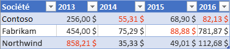
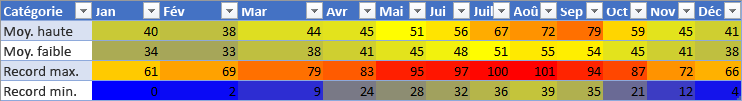
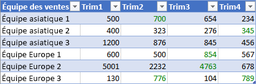
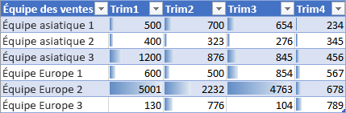
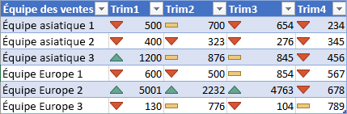
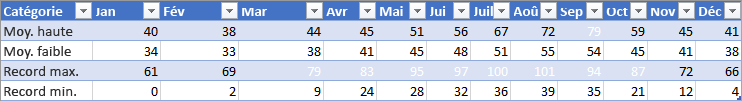
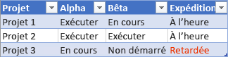
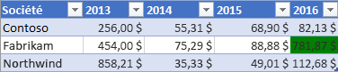
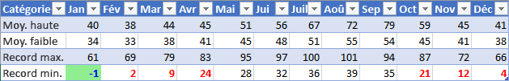

# <a name="apply-conditional-formatting-to-excel-ranges"></a><span data-ttu-id="b4066-103">Appliquer une mise en forme conditionnelle à des plages Excel</span><span class="sxs-lookup"><span data-stu-id="b4066-103">Apply conditional formatting to Excel ranges</span></span>

<span data-ttu-id="b4066-104">La bibliothèque JavaScript Excel fournit des API pour appliquer une mise en forme conditionnelle aux plages de données dans vos feuilles de calcul.</span><span class="sxs-lookup"><span data-stu-id="b4066-104">The Excel JavaScript Library provides APIs to apply conditional formatting to data ranges in your worksheets.</span></span> <span data-ttu-id="b4066-105">Cette fonctionnalité simplifie l’analyse visuelle de grands ensembles de données.</span><span class="sxs-lookup"><span data-stu-id="b4066-105">This functionality makes large sets of data easy to visually parse.</span></span> <span data-ttu-id="b4066-106">La mise en forme effectue également des mises à jour dynamiques en fonction des changements dans la plage.</span><span class="sxs-lookup"><span data-stu-id="b4066-106">The formatting also dynamically updates based on changes within the range.</span></span>

> [!NOTE]
> <span data-ttu-id="b4066-107">Cet article décrit la mise en forme conditionnelle dans le contexte de compléments Excel JavaScript. Les articles suivants offrent des informations détaillées sur les fonctionnalités de mise en forme conditionnelles complètes dans Excel.</span><span class="sxs-lookup"><span data-stu-id="b4066-107">This article covers conditional formatting in the context of Excel JavaScript add-ins. The following articles provide detailed information about the full conditional formatting capabilities within Excel.</span></span>
> -  [<span data-ttu-id="b4066-108">Ajouter, modifier ou effacer des formats conditionnels</span><span class="sxs-lookup"><span data-stu-id="b4066-108">Add, change, or clear conditional formats</span></span>](https://support.office.com/article/add-change-or-clear-conditional-formats-8a1cc355-b113-41b7-a483-58460332a1af)
> -  [<span data-ttu-id="b4066-109">Utilisez des formules avec mise en forme conditionnelle</span><span class="sxs-lookup"><span data-stu-id="b4066-109">Use formulas with conditional formatting</span></span>](https://support.office.com/article/Use-formulas-with-conditional-formatting-FED60DFA-1D3F-4E13-9ECB-F1951FF89D7F)

## <a name="programmatic-control-of-conditional-formatting"></a><span data-ttu-id="b4066-110">Contrôle par programme de mise en forme conditionnelle</span><span class="sxs-lookup"><span data-stu-id="b4066-110">Programmatic control of conditional formatting</span></span>

<span data-ttu-id="b4066-111">La `Range.conditionalFormats` propriété est un ensemble d’objets [ConditionalFormat](/javascript/api/excel/excel.conditionalformat)qui s’appliquent à la plage.</span><span class="sxs-lookup"><span data-stu-id="b4066-111">The `Range.conditionalFormats` property is a collection of [ConditionalFormat](/javascript/api/excel/excel.conditionalformat) objects that apply to the range.</span></span>  <span data-ttu-id="b4066-112">L’`ConditionalFormat` objet contient plusieurs propriétés qui définissent le format à appliquer en fonction du [ConditionalFormatType](/javascript/api/excel/excel.conditionalformattype).</span><span class="sxs-lookup"><span data-stu-id="b4066-112">The `ConditionalFormat` object contains several properties that define the format to be applied based on the [ConditionalFormatType](/javascript/api/excel/excel.conditionalformattype).</span></span>

-    `cellValue`
-    `colorScale`
-    `custom`
-    `dataBar`
-    `iconSet`
-    `preset`
-    `textComparison`
-    `topBottom`

> [!NOTE]
> <span data-ttu-id="b4066-113">Chacune de ces propriétés de mise en forme a une variante correspondante`*OrNullObject`.</span><span class="sxs-lookup"><span data-stu-id="b4066-113">Each of these formatting properties has a corresponding `*OrNullObject` variant.</span></span> <span data-ttu-id="b4066-114">Pour en savoir plus sur ce modèle, consultez la section [ \* méthodes OrNullObject](../develop/application-specific-api-model.md#ornullobject-methods-and-properties) .</span><span class="sxs-lookup"><span data-stu-id="b4066-114">Learn more about that pattern in the [\*OrNullObject methods](../develop/application-specific-api-model.md#ornullobject-methods-and-properties) section.</span></span>

<span data-ttu-id="b4066-115">Un seul type de format peut être défini pour l’objet ConditionalFormat.</span><span class="sxs-lookup"><span data-stu-id="b4066-115">Only one format type can be set for the ConditionalFormat object.</span></span> <span data-ttu-id="b4066-116">Cela est déterminé par la `type` propriété, c'est-à-dire une [ConditionalFormatType](/javascript/api/excel/excel.conditionalformattype) valeur enum.</span><span class="sxs-lookup"><span data-stu-id="b4066-116">This is determined by the `type` property, which is a [ConditionalFormatType](/javascript/api/excel/excel.conditionalformattype) enum value.</span></span> <span data-ttu-id="b4066-117">`type` est défini lorsque vous ajoutez une mise en forme conditionnelle à une plage.</span><span class="sxs-lookup"><span data-stu-id="b4066-117">`type` is set when adding a conditional format to a range.</span></span>

## <a name="creating-conditional-formatting-rules"></a><span data-ttu-id="b4066-118">Modification des règles de mise en forme conditionnelles</span><span class="sxs-lookup"><span data-stu-id="b4066-118">Creating conditional formatting rules</span></span>

<span data-ttu-id="b4066-119">Les mises en forme conditionnelles sont ajoutées à une plage à l’aide de `conditionalFormats.add`.</span><span class="sxs-lookup"><span data-stu-id="b4066-119">Conditional formats are added to a range by using `conditionalFormats.add`.</span></span> <span data-ttu-id="b4066-120">Une fois ajoutées, vous pouvez définir les propriétés spécifiques à la mise en forme conditionnelle.</span><span class="sxs-lookup"><span data-stu-id="b4066-120">Once added, the properties specific to the conditional format can be set.</span></span> <span data-ttu-id="b4066-121">Les exemples ci-dessous montrent la création de différents types de mise en forme.</span><span class="sxs-lookup"><span data-stu-id="b4066-121">The following examples show the creation of different formatting types.</span></span>

### <a name="cell-value"></a>[<span data-ttu-id="b4066-122">Valeur de la cellule</span><span class="sxs-lookup"><span data-stu-id="b4066-122">Cell value</span></span>](/javascript/api/excel/excel.cellvalueconditionalformat)

<span data-ttu-id="b4066-123">La mise en forme conditionnelle de valeur de la cellule applique un format défini par l’utilisateur en fonction des résultats d’une ou deux formules dans la [ConditionalCellValueRule](/javascript/api/excel/excel.conditionalcellvaluerule).</span><span class="sxs-lookup"><span data-stu-id="b4066-123">Cell value conditional formatting applies a user-defined format based on the results of one or two formulas in the [ConditionalCellValueRule](/javascript/api/excel/excel.conditionalcellvaluerule).</span></span> <span data-ttu-id="b4066-124">La`operator` propriété est un [ConditionalCellValueOperator](/javascript/api/excel/excel.conditionalcellvalueoperator) définissant comment les expressions qui en résultent sont liées à la mise en forme.</span><span class="sxs-lookup"><span data-stu-id="b4066-124">The `operator` property is a [ConditionalCellValueOperator](/javascript/api/excel/excel.conditionalcellvalueoperator) defining how the resulting expressions relate to the formatting.</span></span>

<span data-ttu-id="b4066-125">L’exemple suivant montre une coloration de la police en rouge appliquée à une valeur dans la plage inférieure à zéro.</span><span class="sxs-lookup"><span data-stu-id="b4066-125">The following example shows red font coloring applied to any value in the range less than zero.</span></span>



```typescript
const sheet = context.workbook.worksheets.getItem("Sample");
const range = sheet.getRange("B21:E23");
const conditionalFormat = range.conditionalFormats.add(
    Excel.ConditionalFormatType.cellValue
);

// set the font of negative numbers to red
conditionalFormat.cellValue.format.font.color = "red";
conditionalFormat.cellValue.rule = { formula1: "=0", operator: "LessThan" };

await context.sync();
```

### <a name="color-scale"></a>[<span data-ttu-id="b4066-127">Échelle de couleur</span><span class="sxs-lookup"><span data-stu-id="b4066-127">Color scale</span></span>](/javascript/api/excel/excel.colorscaleconditionalformat)

<span data-ttu-id="b4066-128">La mise en forme conditionnelle de l’échelle de couleur applique un dégradé de couleur au sein de la plage de données.</span><span class="sxs-lookup"><span data-stu-id="b4066-128">Color scale conditional formatting applies a color gradient across the data range.</span></span> <span data-ttu-id="b4066-129">La`criteria` propriété sur le `ColorScaleConditionalFormat` définit trois[ConditionalColorScaleCriterion](/javascript/api/excel/excel.conditionalcolorscalecriterion): `minimum`, `maximum`et éventuellement, `midpoint`.</span><span class="sxs-lookup"><span data-stu-id="b4066-129">The `criteria` property on the `ColorScaleConditionalFormat` defines three [ConditionalColorScaleCriterion](/javascript/api/excel/excel.conditionalcolorscalecriterion): `minimum`, `maximum`, and, optionally, `midpoint`.</span></span> <span data-ttu-id="b4066-130">Les critères des points d’échelle ont trois propriétés :</span><span class="sxs-lookup"><span data-stu-id="b4066-130">Each of the criterion scale points have three properties:</span></span>

-    <span data-ttu-id="b4066-131">`color` -Le code de couleur HTML pour le point de terminaison.</span><span class="sxs-lookup"><span data-stu-id="b4066-131">`color` - The HTML color code for the endpoint.</span></span>
-    <span data-ttu-id="b4066-132">`formula` -Un nombre ou une formule représentant le point de terminaison.</span><span class="sxs-lookup"><span data-stu-id="b4066-132">`formula` - A number or formula representing the endpoint.</span></span> <span data-ttu-id="b4066-133">Il s’agit de `null` si `type` est `lowestValue` ou `highestValue`.</span><span class="sxs-lookup"><span data-stu-id="b4066-133">This will be `null` if `type` is `lowestValue` or `highestValue`.</span></span>
-    <span data-ttu-id="b4066-134">`type` -Comment la formule doit être évaluée.</span><span class="sxs-lookup"><span data-stu-id="b4066-134">`type` - How the formula should be evaluated.</span></span> <span data-ttu-id="b4066-135">`highestValue` et `lowestValue` font référence à des valeurs dans la plage en cours de mise en forme.</span><span class="sxs-lookup"><span data-stu-id="b4066-135">`highestValue` and `lowestValue` refer to values in the range being formatted.</span></span>

<span data-ttu-id="b4066-136">L’exemple suivant montre une plage colorée de bleue à jaune à rouge.</span><span class="sxs-lookup"><span data-stu-id="b4066-136">The following example shows a range being colored blue to yellow to red.</span></span> <span data-ttu-id="b4066-137">Notez que `minimum` et `maximum` sont les valeurs inférieures et supérieures respectivement et utilisent les `null` formules.</span><span class="sxs-lookup"><span data-stu-id="b4066-137">Note that `minimum` and `maximum` are the lowest and highest values respectively and use `null` formulas.</span></span> <span data-ttu-id="b4066-138">`midpoint` utilise le `percentage` type avec une formule de `"=50"` donc la cellule jaune est la valeur moyenne.</span><span class="sxs-lookup"><span data-stu-id="b4066-138">`midpoint` is using the `percentage` type with a formula of `"=50"` so the yellowest cell is the mean value.</span></span>



```typescript
const sheet = context.workbook.worksheets.getItem("Sample");
const range = sheet.getRange("B2:M5");
const conditionalFormat = range.conditionalFormats.add(
      Excel.ConditionalFormatType.colorScale
);

// color the backgrounds of the cells from blue to yellow to red based on value
const criteria = {
      minimum: {
           formula: null,
           type: Excel.ConditionalFormatColorCriterionType.lowestValue,
           color: "blue"
      },
      midpoint: {
           formula: "50",
           type: Excel.ConditionalFormatColorCriterionType.percent,
           color: "yellow"
      },
      maximum: {
           formula: null,
           type: Excel.ConditionalFormatColorCriterionType.highestValue,
           color: "red"
      }
};
conditionalFormat.colorScale.criteria = criteria;

await context.sync();
```

### <a name="custom"></a>[<span data-ttu-id="b4066-140">Personnalisé</span><span class="sxs-lookup"><span data-stu-id="b4066-140">Custom</span></span>](/javascript/api/excel/excel.customconditionalformat)

<span data-ttu-id="b4066-141">La mise en forme conditionnelle personnalisée applique un format défini par l’utilisateur aux cellules en fonction d’une formule de complexité arbitraire.</span><span class="sxs-lookup"><span data-stu-id="b4066-141">Custom conditional formatting applies a user-defined format to the cells based on a formula of arbitrary complexity.</span></span> <span data-ttu-id="b4066-142">L’objet [ConditionalFormatRule](/javascript/api/excel/excel.conditionalformatrule) vous permet de définir la formule dans des notations différentes :</span><span class="sxs-lookup"><span data-stu-id="b4066-142">The [ConditionalFormatRule](/javascript/api/excel/excel.conditionalformatrule) object lets you define the formula in different notations:</span></span>

-    <span data-ttu-id="b4066-143">`formula` -Notation standard.</span><span class="sxs-lookup"><span data-stu-id="b4066-143">`formula` - Standard notation.</span></span>
-    <span data-ttu-id="b4066-144">`formulaLocal` -Localisé en fonction de la langue de l’utilisateur.</span><span class="sxs-lookup"><span data-stu-id="b4066-144">`formulaLocal` - Localized based on the user's language.</span></span>
-    <span data-ttu-id="b4066-145">`formulaR1C1` -Notation type L1C1.</span><span class="sxs-lookup"><span data-stu-id="b4066-145">`formulaR1C1` - R1C1-style notation.</span></span>

<span data-ttu-id="b4066-146">L’exemple suivant colore les polices de cellules avec des valeurs supérieures à la cellule située à leur gauche en vert.</span><span class="sxs-lookup"><span data-stu-id="b4066-146">The following example colors the fonts green of cells with higher values than the cell to their left.</span></span>



```typescript
const sheet = context.workbook.worksheets.getItem("Sample");
const range = sheet.getRange("B8:E13");
const conditionalFormat = range.conditionalFormats.add(
     Excel.ConditionalFormatType.custom
);

// if a cell has a higher value than the one to its left, set that cell's font to green
conditionalFormat.custom.rule.formula = '=IF(B8>INDIRECT("RC[-1]",0),TRUE)';
conditionalFormat.custom.format.font.color = "green";

await context.sync();

```
### <a name="data-bar"></a>[<span data-ttu-id="b4066-148">Barre de données</span><span class="sxs-lookup"><span data-stu-id="b4066-148">Data bar</span></span>](/javascript/api/excel/excel.databarconditionalformat)

<span data-ttu-id="b4066-149">La mise en forme conditionnelle de la barre de données ajoute des barres de données aux cellules.</span><span class="sxs-lookup"><span data-stu-id="b4066-149">Data bar conditional formatting adds data bars to the cells.</span></span> <span data-ttu-id="b4066-150">Par défaut, les valeurs minimales et maximales dans la plage forment les limites et les tailles proportionnelles des barres de données.</span><span class="sxs-lookup"><span data-stu-id="b4066-150">By default, the minimum and maximum values in the Range form the bounds and proportional sizes of the data bars.</span></span> <span data-ttu-id="b4066-151">L' `DataBarConditionalFormat` objet possède plusieurs propriétés permettant de contrôler l’apparence de la barre.</span><span class="sxs-lookup"><span data-stu-id="b4066-151">The `DataBarConditionalFormat` object has several properties to control the bar's appearance.</span></span> 

<span data-ttu-id="b4066-152">L’exemple suivant met en forme la plage contenant des barres de données remplissant de gauche à droite.</span><span class="sxs-lookup"><span data-stu-id="b4066-152">The following example formats the range with data bars filling left-to-right.</span></span>



```typescript
const sheet = context.workbook.worksheets.getItem("Sample");
const range = sheet.getRange("B8:E13");
const conditionalFormat = range.conditionalFormats.add(
     Excel.ConditionalFormatType.dataBar
);

// give left-to-right, default-appearance data bars to all the cells
conditionalFormat.dataBar.barDirection = Excel.ConditionalDataBarDirection.leftToRight;
await context.sync();
```

### <a name="icon-set"></a>[<span data-ttu-id="b4066-154">Jeu d’icônes</span><span class="sxs-lookup"><span data-stu-id="b4066-154">Icon set</span></span>](/javascript/api/excel/excel.iconsetconditionalformat)

<span data-ttu-id="b4066-155">La mise en forme conditionnelle du jeu d’icônes utilise Excel [icônes](/javascript/api/excel/excel.icon) pour mettre en surbrillance les cellules.</span><span class="sxs-lookup"><span data-stu-id="b4066-155">Icon set conditional formatting uses Excel [Icons](/javascript/api/excel/excel.icon) to highlight cells.</span></span> <span data-ttu-id="b4066-156">La `criteria` propriété est une matrice de [ConditionalIconCriterion](/javascript/api/excel/excel.ConditionalIconCriterion), qui définit le symbole à insérer et la condition sous laquelle celui-ci est inséré.</span><span class="sxs-lookup"><span data-stu-id="b4066-156">The `criteria` property is an array of [ConditionalIconCriterion](/javascript/api/excel/excel.ConditionalIconCriterion), which define the symbol to be inserted and the condition under which it is inserted.</span></span> <span data-ttu-id="b4066-157">Ce tableau est automatiquement pré-rempli avec éléments critères avec les propriétés par défaut.</span><span class="sxs-lookup"><span data-stu-id="b4066-157">This array is automatically prepopulated with criterion elements with default properties.</span></span> <span data-ttu-id="b4066-158">Les propriétés individuelles ne peut pas être remplacées.</span><span class="sxs-lookup"><span data-stu-id="b4066-158">Individual properties cannot be overwritten.</span></span> <span data-ttu-id="b4066-159">Au lieu de cela, l’ensemble de l’objet de critères doit être remplacé.</span><span class="sxs-lookup"><span data-stu-id="b4066-159">Instead, the whole criteria object must be replaced.</span></span> 

<span data-ttu-id="b4066-160">L’exemple suivant montre un jeu d’icônes trois triangles utilisé dans la plage.</span><span class="sxs-lookup"><span data-stu-id="b4066-160">The following example shows a three-triangle icon set applied across the range.</span></span>



```typescript
const sheet = context.workbook.worksheets.getItem("Sample");
const range = sheet.getRange("B8:E13");
const conditionalFormat = range.conditionalFormats.add(
     Excel.ConditionalFormatType.iconSet
);

const iconSetCF = conditionalFormat.iconSet;
iconSetCF.style = Excel.IconSet.threeTriangles;

/*
   With a "three*" icon set style, such as "threeTriangles", the third
    element in the criteria array (criteria[2]) defines the "top" icon;
    e.g., a green triangle. The second (criteria[1]) defines the "middle"
    icon, The first (criteria[0]) defines the "low" icon, but it can often 
    be left empty as this method does below, because every cell that
   does not match the other two criteria always gets the low icon.
*/
iconSetCF.criteria = [
    {} as any,
      {
        type: Excel.ConditionalFormatIconRuleType.number,
        operator: Excel.ConditionalIconCriterionOperator.greaterThanOrEqual,
        formula: "=700"
      },
      {
        type: Excel.ConditionalFormatIconRuleType.number,
        operator: Excel.ConditionalIconCriterionOperator.greaterThanOrEqual,
        formula: "=1000"
      }
];

await context.sync();
```

### <a name="preset-criteria"></a>[<span data-ttu-id="b4066-162">Critères prédéfinis</span><span class="sxs-lookup"><span data-stu-id="b4066-162">Preset criteria</span></span>](/javascript/api/excel/excel.presetcriteriaconditionalformat)

<span data-ttu-id="b4066-163">La mise en forme conditionnelle prédéfinie applique un format défini par l’utilisateur pour la plage basée sur une règle standard sélectionnée.</span><span class="sxs-lookup"><span data-stu-id="b4066-163">Preset conditional formatting applies a user-defined format to the range based on a selected standard rule.</span></span> <span data-ttu-id="b4066-164">Ces règles sont définies par le [ConditionalFormatPresetCriterion](/javascript/api/excel/excel.ConditionalFormatPresetCriterion) dans le [ConditionalPresetCriteriaRule](/javascript/api/excel/excel.conditionalpresetcriteriarule).</span><span class="sxs-lookup"><span data-stu-id="b4066-164">These rules are defined by the [ConditionalFormatPresetCriterion](/javascript/api/excel/excel.ConditionalFormatPresetCriterion) in the [ConditionalPresetCriteriaRule](/javascript/api/excel/excel.conditionalpresetcriteriarule).</span></span> 

<span data-ttu-id="b4066-165">L’exemple suivant colore la police en blanc dès que la valeur d’une cellule est au moins un écart-type au-dessus de la moyenne de la plage.</span><span class="sxs-lookup"><span data-stu-id="b4066-165">The following example colors the font white wherever a cell's value is at least one standard deviation above the range's average.</span></span>



```typescript
const sheet = context.workbook.worksheets.getItem("Sample");
const range = sheet.getRange("B2:M5");
const conditionalFormat = range.conditionalFormats.add(
     Excel.ConditionalFormatType.presetCriteria
);

// color every cell's font white that is one standard deviation above average relative to the range
conditionalFormat.preset.format.font.color = "white";
conditionalFormat.preset.rule = {
     criterion: Excel.ConditionalFormatPresetCriterion.oneStdDevAboveAverage
};

await context.sync();
```

### <a name="text-comparison"></a>[<span data-ttu-id="b4066-167">Comparaison de texte</span><span class="sxs-lookup"><span data-stu-id="b4066-167">Text comparison</span></span>](/javascript/api/excel/excel.textconditionalformat)

<span data-ttu-id="b4066-168">La mise en forme conditionnelle de comparaison de texte utilise des comparaisons de chaînes comme condition.</span><span class="sxs-lookup"><span data-stu-id="b4066-168">Text comparison conditional formatting uses string comparisons as the condition.</span></span> <span data-ttu-id="b4066-169">La `rule` propriété est un [ConditionalTextComparisonRule](/javascript/api/excel/excel.conditionaltextcomparisonrule) définissant une chaîne à comparer avec la cellule et un opérateur pour spécifier le type de comparaison.</span><span class="sxs-lookup"><span data-stu-id="b4066-169">The `rule` property is a [ConditionalTextComparisonRule](/javascript/api/excel/excel.conditionaltextcomparisonrule) defining a string to compare with the cell and an operator to specify the type of comparison.</span></span> 

<span data-ttu-id="b4066-170">L’exemple suivant montre comment appliquer la couleur rouge à la police lorsque le texte d’une cellule contient « retardée ».</span><span class="sxs-lookup"><span data-stu-id="b4066-170">The following example formats the font color red when a cell's text contains "Delayed".</span></span>



```typescript
const sheet = context.workbook.worksheets.getItem("Sample");
const range = sheet.getRange("B16:D18");
const conditionalFormat = range.conditionalFormats.add(
     Excel.ConditionalFormatType.containsText
);

// color the font of every cell containing "Delayed"
conditionalFormat.textComparison.format.font.color = "red";
conditionalFormat.textComparison.rule = {
     operator: Excel.ConditionalTextOperator.contains,
     text: "Delayed"
};

await context.sync();
```

### <a name="topbottom"></a>[<span data-ttu-id="b4066-172">Supérieure/inférieure</span><span class="sxs-lookup"><span data-stu-id="b4066-172">Top/bottom</span></span>](/javascript/api/excel/excel.TopBottomconditionalformat)

<span data-ttu-id="b4066-173">La mise en forme conditionnelle supérieure/inférieure applique un format aux valeurs les plus élevées ou plus faibles d’une plage.</span><span class="sxs-lookup"><span data-stu-id="b4066-173">Top/bottom conditional formatting applies a format to the highest or lowest values in a range.</span></span> <span data-ttu-id="b4066-174">La `rule` propriété, de type [ConditionalTopBottomRule](/javascript/api/excel/excel.conditionaltopbottomrule), définit si la condition est basée sur le plus élevé ou le plus bas, ainsi que si l’évaluation est en classement ou pourcentage.</span><span class="sxs-lookup"><span data-stu-id="b4066-174">The `rule` property, which is of type [ConditionalTopBottomRule](/javascript/api/excel/excel.conditionaltopbottomrule), sets whether the condition is based on the highest or lowest, as well as whether the evaluation is ranked or percentage-based.</span></span> 

<span data-ttu-id="b4066-175">L’exemple suivant applique un surlignage vert à la cellule de valeur plus élevée dans la plage.</span><span class="sxs-lookup"><span data-stu-id="b4066-175">The following example applies a green highlight to the highest value cell in the range.</span></span>




```typescript
const sheet = context.workbook.worksheets.getItem("Sample");
const range = sheet.getRange("B21:E23");
const conditionalFormat = range.conditionalFormats.add(
     Excel.ConditionalFormatType.topBottom
);

// for the highest valued cell in the range, make the background green
conditionalFormat.topBottom.format.fill.color = "green"
conditionalFormat.topBottom.rule = { rank: 1, type: "TopItems"}

await context.sync();
```

## <a name="multiple-formats-and-priority"></a><span data-ttu-id="b4066-177">Formats multiples et priorité</span><span class="sxs-lookup"><span data-stu-id="b4066-177">Multiple formats and priority</span></span>

<span data-ttu-id="b4066-178">Vous pouvez appliquer plusieurs mises en forme conditionnelles à une plage.</span><span class="sxs-lookup"><span data-stu-id="b4066-178">You can apply multiple conditional formats to a range.</span></span> <span data-ttu-id="b4066-179">Si les formats ont des éléments en conflit, tels que les couleurs de police différentes, la mise en forme s’applique uniquement à un élément particulier.</span><span class="sxs-lookup"><span data-stu-id="b4066-179">If the formats have conflicting elements, such as differing font colors, only one format applies that particular element.</span></span> <span data-ttu-id="b4066-180">La priorité est définie par la`ConditionalFormat.priority` propriété.</span><span class="sxs-lookup"><span data-stu-id="b4066-180">Precedence is defined by the `ConditionalFormat.priority` property.</span></span> <span data-ttu-id="b4066-181">La priorité est un nombre (égal à l’index dans le `ConditionalFormatCollection`) et peut être définie lorsque vous créez le format.</span><span class="sxs-lookup"><span data-stu-id="b4066-181">Priority is a number (equal to the index in the `ConditionalFormatCollection`) and can be set when creating the format.</span></span> <span data-ttu-id="b4066-182">Plus basse la `priority` valeur est, plus élevée la priorité de la mise en forme est.</span><span class="sxs-lookup"><span data-stu-id="b4066-182">The lowerer the `priority` value, the higher the priority of the format is.</span></span>

<span data-ttu-id="b4066-183">L’exemple suivant montre un choix de couleur de police en conflit entre les deux formats.</span><span class="sxs-lookup"><span data-stu-id="b4066-183">The following example shows a conflicting font color choice between the two formats.</span></span> <span data-ttu-id="b4066-184">Les nombres négatifs recevront une police en gras, mais pas une police rouge, car la priorité se porte sur le format leur donnant une police bleue.</span><span class="sxs-lookup"><span data-stu-id="b4066-184">Negative numbers will get a bold font, but NOT a red font, because priority goes to the format that gives them a blue font.</span></span>



```typescript
const sheet = context.workbook.worksheets.getItem("Sample");
const temperatureDataRange = sheet.tables.getItem("TemperatureTable").getDataBodyRange();


// Set low numbers to bold, dark red font and assign priority 1.
const presetFormat = temperatureDataRange.conditionalFormats
    .add(Excel.ConditionalFormatType.presetCriteria);
presetFormat.preset.format.font.color = "red";
presetFormat.preset.format.font.bold = true;
presetFormat.preset.rule = { criterion: Excel.ConditionalFormatPresetCriterion.oneStdDevBelowAverage };
presetFormat.priority = 1;

// Set negative numbers to blue font with green background and set priority 0.
const cellValueFormat = temperatureDataRange.conditionalFormats
    .add(Excel.ConditionalFormatType.cellValue);
cellValueFormat.cellValue.format.font.color = "blue";
cellValueFormat.cellValue.format.fill.color = "lightgreen";
cellValueFormat.cellValue.rule = { formula1: "=0", operator: "LessThan" };
cellValueFormat.priority = 0;

await context.sync();

```

### <a name="mutually-exclusive-conditional-formats"></a><span data-ttu-id="b4066-186">Formats exclusifs de mise en forme conditionnelle</span><span class="sxs-lookup"><span data-stu-id="b4066-186">Mutually exclusive conditional formats</span></span>

<span data-ttu-id="b4066-187">La `stopIfTrue` propriété de `ConditionalFormat` empêche les mises en forme conditionnelles de priorité inférieure de s’appliquer à la plage.</span><span class="sxs-lookup"><span data-stu-id="b4066-187">The `stopIfTrue` property of `ConditionalFormat` prevents lower priority conditional formats from being applied to the range.</span></span> <span data-ttu-id="b4066-188">Lorsqu’une plage correspondant à la mise en forme conditionnelle avec `stopIfTrue === true` est appliquée, aucune mise en forme conditionnelle suivante n’est appliquée, même si ses détails de mise en forme ne sont pas contradictoires.</span><span class="sxs-lookup"><span data-stu-id="b4066-188">When a range matching the conditional format with `stopIfTrue === true` is applied, no subsequent conditional formats are applied, even if their formatting details are not contradictory.</span></span>

<span data-ttu-id="b4066-189">L’exemple suivant montre deux mises en forme conditionnelles ajoutées à une plage.</span><span class="sxs-lookup"><span data-stu-id="b4066-189">The following example shows two conditional formats being added to a range.</span></span> <span data-ttu-id="b4066-190">Les nombres négatifs aura une police bleue avec un arrière-plan vert léger, quelle que soit la condition de l’autre format.</span><span class="sxs-lookup"><span data-stu-id="b4066-190">Negative numbers will have a blue font with a light green background, regardless of whether the other format condition is true.</span></span>


```typescript
const sheet = context.workbook.worksheets.getItem("Sample");
const temperatureDataRange = sheet.tables.getItem("TemperatureTable").getDataBodyRange();

// Set low numbers to bold, dark red font and assign priority 1.
const presetFormat = temperatureDataRange.conditionalFormats
    .add(Excel.ConditionalFormatType.presetCriteria);
presetFormat.preset.format.font.color = "red";
presetFormat.preset.format.font.bold = true;
presetFormat.preset.rule = { criterion: Excel.ConditionalFormatPresetCriterion.oneStdDevBelowAverage };
presetFormat.priority = 1;

// Set negative numbers to blue font with green background and 
// set priority 0, but set stopIfTrue to true, so none of the 
// formatting of the conditional format with the higher priority
// value will apply, not even the bolding of the font.
const cellValueFormat = temperatureDataRange.conditionalFormats
    .add(Excel.ConditionalFormatType.cellValue);
cellValueFormat.cellValue.format.font.color = "blue";
cellValueFormat.cellValue.format.fill.color = "lightgreen";
cellValueFormat.cellValue.rule = { formula1: "=0", operator: "LessThan" };
cellValueFormat.priority = 0;
cellValueFormat.stopIfTrue = true;

await context.sync();
```

## <a name="see-also"></a><span data-ttu-id="b4066-192">Voir aussi</span><span class="sxs-lookup"><span data-stu-id="b4066-192">See also</span></span>

- [<span data-ttu-id="b4066-193">Concepts fondamentaux de programmation avec l’API JavaScript pour Excel</span><span class="sxs-lookup"><span data-stu-id="b4066-193">Fundamental programming concepts with the Excel JavaScript API</span></span>](../excel/excel-add-ins-core-concepts.md)
- [<span data-ttu-id="b4066-194">Utiliser les plages à l’aide de l’API JavaScript Excel</span><span class="sxs-lookup"><span data-stu-id="b4066-194">Work with ranges using the Excel JavaScript API</span></span>](../excel/excel-add-ins-ranges.md)
- [<span data-ttu-id="b4066-195">Objet ConditionalFormat (API JavaScript pour Excel)</span><span class="sxs-lookup"><span data-stu-id="b4066-195">ConditionalFormat Object (JavaScript API for Excel)</span></span>](/javascript/api/excel/excel.conditionalformat)
- [<span data-ttu-id="b4066-196">Ajouter, modifier ou effacer des formats conditionnels</span><span class="sxs-lookup"><span data-stu-id="b4066-196">Add, change, or clear conditional formats</span></span>](https://support.office.com/article/add-change-or-clear-conditional-formats-8a1cc355-b113-41b7-a483-58460332a1af)
- [<span data-ttu-id="b4066-197">Utilisez des formules avec mise en forme conditionnelle</span><span class="sxs-lookup"><span data-stu-id="b4066-197">Use formulas with conditional formatting</span></span>](https://support.office.com/article/Use-formulas-with-conditional-formatting-FED60DFA-1D3F-4E13-9ECB-F1951FF89D7F)
