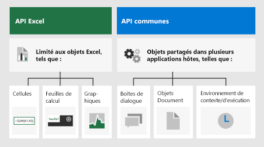

# <a name="excel-javascript-object-model-in-office-add-ins"></a>Modèle d’objet JavaScript Excel dans les compléments Office

Cet article décrit comment utiliser l’[API JavaScript pour Excel](../reference/overview/excel-add-ins-reference-overview.md) afin de créer des compléments pour Excel 2016 ou versions ultérieures. Il présente les concepts fondamentaux de l’utilisation des API et fournit des conseils pour effectuer des tâches spécifiques, comme la lecture ou l’écriture d’une grande plage, la mise à jour de toutes les cellules d’une plage, et bien plus encore.

> [!IMPORTANT]
> Pour en savoir plus sur la nature asynchrone des API Excel et la manière dont elles fonctionnent avec le classeur, voir [Utilisation du modèle d’API spécifique à l’application](../develop/application-specific-api-model.md).  

## <a name="officejs-apis-for-excel"></a>API Office.js pour Excel

Un complément Excel interagit avec des objets dans Excel en utilisant l’API Office JavaScript, qui inclut deux modèles d’objets JavaScript :

* **API JavaScript pour Excel** : inclut dans Office 2016, l’[API JavaScript Excel](../reference/overview/excel-add-ins-reference-overview.md) fournit des objets fortement typés que vous pouvez utiliser pour accéder à des feuilles de calcul, des plages, des tableaux, des graphiques et bien plus encore.

* **API communes** : incluses dans Office 2013, les [API communes](/javascript/api/office) peuvent être utilisées pour accéder à des fonctionnalités telles qu’une interface utilisateur, des boîtes de dialogue et des paramètres du client, qui sont communes à plusieurs types d’applications Office.

Vous utiliserez probablement l’API JavaScript Excel pour développer la majorité des fonctionnalités des compléments destinés à Excel 2016 ou version ultérieure, vous utiliserez également des objets dans l’API commune. Par exemple :

* [Context](/javascript/api/office/office.context) :le `Context` représente l’environnement d’exécution du complément et permet d’accéder à des objets clés de l’API. Il se compose de détails sur la configuration du classeur comme `contentLanguage` et `officeTheme`, et fournit des informations sur l’environnement d’exécution du complément comme `host` et `platform`. En outre, il fournit la méthode `requirements.isSetSupported()` que vous pouvez utiliser pour vérifier si l’ensemble de conditions requises spécifié est pris en charge par l’application Excel dans laquelle le complément est exécuté.
* [Document](/javascript/api/office/office.document) : le `Document` fournit la méthode `getFileAsync()` que vous pouvez utiliser pour télécharger le fichier Excel dans lequel le complément est exécuté.

L’image suivante illustre les situations dans lesquelles vous pouvez utiliser l’API JavaScript Excel ou les API communes.



## <a name="excel-specific-object-model"></a>Modèle d’objet spécifique à Excel

Pour comprendre les API Excel, vous devez connaître la manière dont les composants d’un classeur sont liés les uns aux autres.

* Un **classeur** contient une ou plusieurs **feuilles de calcul**.
* Une **Feuille de calcul** contient les collections de ces objets de données présents sur la feuille individuelle, et donne accès aux cellules via des objets de la **Plage**.
* Une **plage** représente un groupe de cellules contiguës.
* Les **plages** sont utilisées pour créer et placer des **tableaux**, des **graphiques**, des **formes** et d’autres objets d’organisation ou de visualisation de données.
* Les **classeurs** contiennent des collections de certains de ces objets de données (par exemple : les **tableaux**) pour l'ensemble du **classeur**.

[!include[Excel cells and ranges note](../includes/note-excel-cells-and-ranges.md)]

### <a name="ranges"></a>Plages

Une plage est un groupe de cellules contiguës dans le classeur. Les compléments utilisent généralement la notation de style A1 (par exemple : **B3** pour la cellule unique de la colonne **B** et de la ligne **3** ou **C2:F4** pour les cellules des colonnes **C** à **F** et des lignes **2** à **4**) pour définir les plages.

Les plages ont trois propriétés principales : `values`, `formulas` et `format`. Ces propriétés obtiennent ou définissent les valeurs de cellule, les formules à évaluer et la mise en forme visuelle des cellules.

#### <a name="range-sample"></a>Exemple de plage

L’exemple de code suivant montre comment créer des registres des ventes. Cette fonction utilise les objets `Range` pour déterminer les valeurs, les formules et les formats.

```js
await Excel.run(async (context) => {
    let sheet = context.workbook.worksheets.getActiveWorksheet();

    // Create the headers and format them to stand out.
    let headers = [
      ["Product", "Quantity", "Unit Price", "Totals"]
    ];
    let headerRange = sheet.getRange("B2:E2");
    headerRange.values = headers;
    headerRange.format.fill.color = "#4472C4";
    headerRange.format.font.color = "white";

    // Create the product data rows.
    let productData = [
      ["Almonds", 6, 7.5],
      ["Coffee", 20, 34.5],
      ["Chocolate", 10, 9.56],
    ];
    let dataRange = sheet.getRange("B3:D5");
    dataRange.values = productData;

    // Create the formulas to total the amounts sold.
    let totalFormulas = [
      ["=C3 * D3"],
      ["=C4 * D4"],
      ["=C5 * D5"],
      ["=SUM(E3:E5)"]
    ];
    let totalRange = sheet.getRange("E3:E6");
    totalRange.formulas = totalFormulas;
    totalRange.format.font.bold = true;

    // Display the totals as US dollar amounts.
    totalRange.numberFormat = [["$0.00"]];

    await context.sync();
});
```

Cet exemple crée les données suivantes dans la feuille de calcul active.


Pour plus d’informations, consultez [Définir et obtenir des valeurs de plage, un texte, ou des formules à l’aide de l’API JavaScript Excel](excel-add-ins-ranges-set-get-values.md).

### <a name="charts-tables-and-other-data-objects"></a>Graphiques, tableaux et autres objets de données

Les API JavaScript Excel peuvent créer et manipuler les structures de données et les visualisations dans Excel. Les tableaux et les graphiques sont deux des objets les plus fréquemment utilisés, mais les API prennent en charge les tableaux croisés dynamiques, les formes, les images et bien plus encore.

#### <a name="creating-a-table"></a>Création d’un tableau

Créez des tableaux à l’aide de plages remplies de données. Les contrôles de mise en forme et du tableau (par exemple, les filtres) sont automatiquement appliqués à la plage.

L’exemple suivant crée un tableau à l’aide des plages de l’exemple précédent.

```js
await Excel.run(async (context) => {
    let sheet = context.workbook.worksheets.getActiveWorksheet();
    sheet.tables.add("B2:E5", true);
    await context.sync();
});
```

L’exécution de cet exemple de code sur la feuille de calcul avec les données précédentes crée le tableau suivant.


Pour plus d’informations, consultez [Travailler avec des tableaux l’aide de l’API JavaScript Excel](excel-add-ins-tables.md).

#### <a name="creating-a-chart"></a>Création d’un graphique

Vous pouvez créer un graphique pour visualiser les données d’une plage. Les API prennent en charge des dizaines de variétés de graphiques, chacun pouvant être personnalisé selon vos besoins.

L’exemple suivant crée un histogramme pour trois éléments et place celui-ci 100 pixels en dessous de la partie supérieure de la feuille de calcul.

```js
await Excel.run(async (context) => {
    let sheet = context.workbook.worksheets.getActiveWorksheet();
    let chart = sheet.charts.add(Excel.ChartType.columnStacked, sheet.getRange("B3:C5"));
    chart.top = 100;
    await context.sync();
});
```

L’exécution de cet exemple sur la feuille de calcul avec le tableau précédent crée le graphique suivant.


Pour plus d’informations, consultez [Travailler avec des graphiques l’aide de l’API JavaScript Excel](excel-add-ins-charts.md).

## <a name="see-also"></a>Voir aussi

* [Création de votre premier complément Excel](../quickstarts/excel-quickstart-jquery.md)
* [Exemples de code pour les compléments Excel](https://developer.microsoft.com/office/gallery/?filterBy=Samples,Excel)
* [Optimisation des performances à l’aide de l’API JavaScript d’Excel](../excel/performance.md)
* [Référence de l’API JavaScript pour Excel](../reference/overview/excel-add-ins-reference-overview.md)
