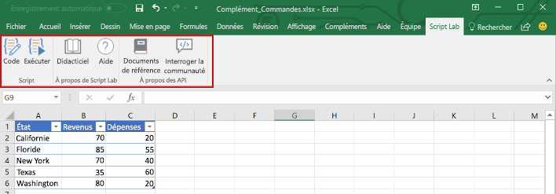
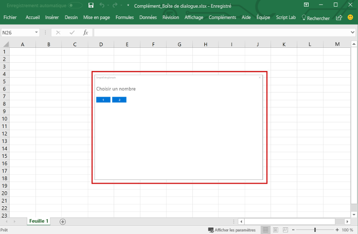
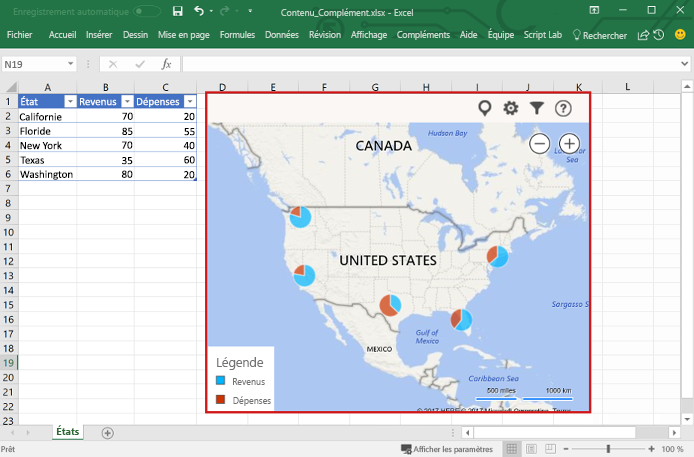

# Étendre les fonctionnalités d’Excel

Outre l’interaction avec le contenu d’un classeur, un complément Excel peut ajouter des boutons de ruban personnalisés ou des commandes de menu, insérer des volets de tâches, ouvrir des boîtes de dialogue et même incorporer du contenu riche basé sur le web directement dans une feuille de calcul.

## Commandes de complément

Les commandes de complément sont des éléments d’interface utilisateur qui étendent l’interface utilisateur d’Excel et lancent des actions dans votre complément. Vous pouvez les utiliser pour ajouter un bouton sur le ruban ou un élément dans le menu contextuel dans Excel. Lorsque les utilisateurs sélectionnent une commande de complément, ils lancent des actions telles que l’exécution de code JavaScript ou l’affichage d’une page du complément dans le volet Office. 

**Commandes de complément**

Pour plus d’informations sur les fonctionnalités des commandes, les plateformes prises en charge et les bonnes pratiques pour le développement de commandes, reportez-vous à la rubrique [Commandes de complément pour Excel, Word et PowerPoint](../design/add-in-commands.md).

## Volets Office

Les volets des tâches sont des surfaces d’interface qui s’affichent généralement sur le côté droit de la fenêtre dans Excel. Les volets des tâches permettent aux utilisateurs d’accéder aux contrôles d’interface qui exécutent du code pour modifier le document Excel ou afficher des données d’une source de données. 

**Volet Office**

Pour plus d’informations sur les volets Office, reportez-vous à [Volets Office dans les compléments Office](../design/task-pane-add-ins.md). Pour consulter un exemple qui implémente un volet Office dans Excel, reportez-vous à [Excel Add-in JS WoodGrove Expense Trends](https://github.com/OfficeDev/Excel-Add-in-WoodGrove-Expense-Trends).

## Boîtes de dialogue

Les boîtes de dialogue sont des surfaces qui flottent au-dessus de la fenêtre active de l’application Excel. Vous pouvez utiliser les boîtes de dialogue pour des tâches comme l’affichage de pages de connexion impossibles à ouvrir directement dans un volet Office, les demandes de confirmation d’une action par l’utilisateur ou l’hébergement de vidéos pouvant être trop petites si elles sont limitées à un volet Office. Utilisez l’[API de dialogue](http://dev.office.com/reference/add-ins/shared/officeui) pour ouvrir des boîtes de dialogue dans votre complément Excel.

**Boîte de dialogue**

Pour plus d’informations sur les boîtes de dialogue et l’API de dialogue, reportez-vous aux rubriques [Boîtes de dialogue dans les compléments Office](../design/dialog-boxes.md) et [Utiliser l’API de dialogue dans vos compléments Office](../develop/dialog-api-in-office-add-ins.md).

## Compléments de contenu

Les compléments de contenu sont des surfaces que vous pouvez incorporer directement dans les documents Excel. Vous pouvez utiliser des compléments de contenu pour incorporer des objets riches, basés sur le web, tels que des graphiques, des visualisations de données ou des supports dans une feuille de calcul, ou autoriser l’accès des utilisateurs aux options d’interface qui exécutent le code pour modifier le document Excel ou afficher des données à partir d’une source de données. Utilisez les compléments de contenu lorsque vous souhaitez incorporer des fonctionnalités directement dans le document.

**Complément de contenu**

Pour plus d’informations sur les compléments de contenu, reportez-vous à [Compléments Office de contenu](../design/content-add-ins.md). Pour consulter un exemple qui implémente un complément de contenu dans Excel, reportez-vous à [Excel Content Add-in Humongous Insurance](https://github.com/OfficeDev/Excel-Content-Add-in-Humongous-Insurance) dans GitHub.

## Ressources supplémentaires

- [Commandes de complément pour Excel, Word et PowerPoint](../design/add-in-commands.md)
- [Définir des commandes de complément dans votre manifeste](../develop/define-add-in-commands.md)
- [Exemples de commandes de complément Office sur Github](https://github.com/OfficeDev/Office-Add-in-Commands-Samples/)
- [Volets Office dans les compléments Office](../design/task-pane-add-ins.md)
- [Complément Excel : JS WoodGrove Expense Trends](https://github.com/OfficeDev/Excel-Add-in-WoodGrove-Expense-Trends)
- [Boîtes de dialogue dans les compléments Office](../design/dialog-boxes.md)
- [Utiliser l’API de dialogue dans vos compléments Office](../develop/dialog-api-in-office-add-ins.md)
- [Exemple d’API de dialogue pour compléments Office](https://github.com/OfficeDev/Office-Add-in-Dialog-API-Simple-Example)
- [Compléments Office de contenu](../design/content-add-ins.md)
- [Complément de contenu Excel : Humongous Insurance](https://github.com/OfficeDev/Excel-Content-Add-in-Humongous-Insurance)
