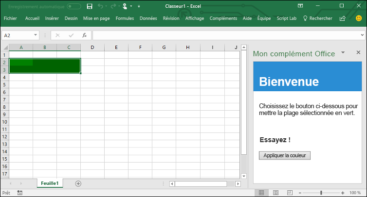

# <a name="build-an-excel-add-in-using-jquery"></a>Développement d’un complément Excel à l’aide de jQuery

Cet article décrit le processus de création d’un complément Excel à l’aide de jQuery et de l’API JavaScript pour Excel.

## <a name="prerequisites"></a>Conditions préalables

Si vous ne l’avez pas déjà fait, vous devez installer [Yeoman](https://github.com/yeoman/yo) et le [générateur Yeoman pour les compléments Office](https://github.com/OfficeDev/generator-office) globalement.

    ```bash
    npm install -g yo generator-office
    ```

## <a name="create-the-web-app"></a>Création de l’application web

1. Créez un dossier sur votre lecteur local et nommez-le **my-addin**. Il s’agit de l’endroit où vous allez créer les fichiers de votre application.

2. Accédez au dossier de votre application.

    ```bash
    cd my-addin
    ```

3. Utilisez le générateur Yeoman pour générer le fichier manifeste de votre complément. Exécutez la commande suivante, puis répondez aux invites comme indiqué dans la capture d’écran suivante :

    ```bash
    yo office
    ```
    


4. Dans votre éditeur de code, ouvrez **index.html** à la racine du projet. Ce fichier spécifie le code HTML qui s’affichera dans le volet Office du complément. 
 
5. Remplacez la balise `header` générée par le marquage suivant.
 
    ```html
    <div id="content-header">
        <div class="padding">
            <h1>Welcome</h1>
        </div>
    </div>
    ```

6. Remplacez la balise `main` générée par le marquage suivant et enregistrez le fichier.

    ```html
    <div id="content-main">
        <div class="padding">
            <p>Choose the button below to set the color of the selected range to green.</p>
            <br />
            <h3>Try it out</h3>
            <button class="ms-Button" id="set-color">Set color</button>
        </div>
    </div>
    ```

7. Ouvrez le fichier **app.js** pour spécifier le script pour le complément. Remplacez l’expression de la fonction appelée immédiatement générée par le code suivant et enregistrez le fichier.

    ```js
    (function () {
        "use strict";

        Office.initialize = function (reason) {
            $(document).ready(function () {
                $('#set-color').click(setColor);
            });
        };

        function setColor() {
            Excel.run(function (context) {
                var range = context.workbook.getSelectedRange();
                range.format.fill.color = 'green';

                return context.sync();
            }).catch(function (error) {
                console.log("Error: " + error);
                if (error instanceof OfficeExtension.Error) {
                    console.log("Debug info: " + JSON.stringify(error.debugInfo));
                }
            });
        }
    })();
    ```

8. Ouvrez le fichier **app.css** pour spécifier les styles personnalisés pour le complément. Remplacez le contenu (sauf le commentaire de copyright) par le balisage suivant, puis enregistrez le fichier.

    ```css
    #content-header {
        background: #2a8dd4;
        color: #fff;
        position: absolute;
        top: 0;
        left: 0;
        width: 100%;
        height: 80px; 
        overflow: hidden;
    }

    #content-main {
        background: #fff;
        position: fixed;
        top: 80px;
        left: 0;
        right: 0;
        bottom: 0;
        overflow: auto; 
    }

    .padding {
        padding: 15px;
    }
    ```

## <a name="configure-the-manifest-file-and-sideload-the-add-in"></a>Configuration du fichier manifeste et chargement d’une version test du complément

1. Ouvrez le fichier nommé **my-office-add-in-manifest.xml** pour définir les paramètres et les fonctionnalités du complément. 

2. La balise **ProviderName** a une valeur d’espace réservé. Remplacez-la par `Microsoft`.

3. La valeur **DefaultValue** de la balise **DisplayName** a une valeur d’espace réservé. Remplacez-la par `A task pane add-in for Excel`. 

4. Enregistrez le fichier, mais ne le fermez pas.

## <a name="configure-to-use-http"></a>Configuration pour utiliser HTTP

Les compléments web Office doivent utiliser le protocole HTTPS, et non HTTP, même lorsque vous développez. Toutefois, pour que le complément soit opérationnel rapidement, ce guide de démarrage rapide utilisera HTTP. Procédez comme suit :

1. Dans le fichier manifeste **my-office-add-in-manifest.xml**, remplacez « https » par « http » partout. Ensuite, enregistrez et fermez le fichier.

2. Ouvrez le fichier **bsconfig.json** à la racine du projet. Définissez la valeur de la propriété **https** sur `false`. Enregistrez le fichier.


## <a name="try-it-out"></a>Essayez !

1. Suivez les instructions pour la plateforme que vous utiliserez afin d’exécuter votre complément en vue d’en charger une version test dans Excel.

    - Windows : [Chargement de compléments Office pour des tests sur Windows](../testing/create-a-network-shared-folder-catalog-for-task-pane-and-content-add-ins.md)
    - Excel Online : [Chargement de version test des compléments Office dans Office Online](../testing/sideload-office-add-ins-for-testing.md#sideload-an-office-add-in-on-office-online)
    - iPad et Mac : [Chargement de version test des compléments Office sur iPad et Mac](../testing/sideload-an-office-add-in-on-ipad-and-mac.md)

2. Ouvrez un terminal bash à la racine du projet et exécutez la commande suivante pour démarrer le serveur de développement.

    ```bash
    npm start
    ```

   > **Remarque** : Une fenêtre de navigateur s’ouvre avec le complément qu’elle contient. Fermez cette fenêtre.

3. Dans Excel, sélectionnez l’onglet **Accueil**, puis choisissez le bouton **Afficher le volet Office** du ruban pour ouvrir le volet Office du complément.

    

4. Sélectionnez une plage de cellules dans la feuille de calcul.

5. Dans le volet Office, choisissez le volet du bouton **Indiquer une couleur** pour définir la couleur de la plage sélectionnée sur vert.

    

## <a name="next-steps"></a>Étapes suivantes

Félicitations, vous avez créé un complément Excel à l’aide de jQuery ! Apprenez-en davantage sur les [concepts fondamentaux](excel-add-ins-core-concepts.md) de la création de compléments Excel.

## <a name="additional-resources"></a>Ressources supplémentaires

* [Concepts de base de l’API JavaScript pour Excel](excel-add-ins-core-concepts.md)
* [Exemples de code pour les compléments Excel](http://dev.office.com/code-samples#?filters=excel,office%20add-ins)
* [Référence de l’API JavaScript pour Excel](http://dev.office.com/reference/add-ins/excel/excel-add-ins-reference-overview)
